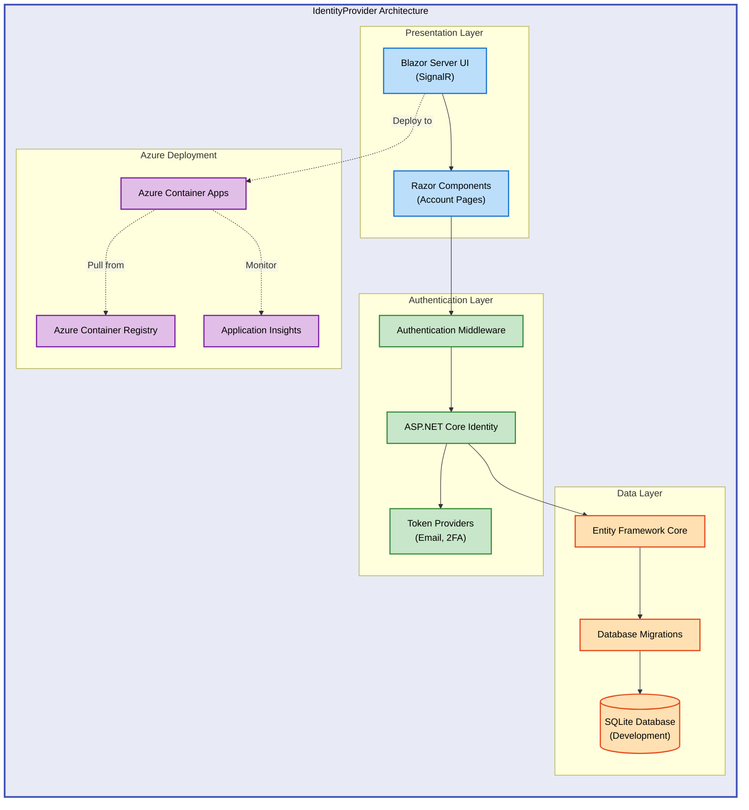

# IdentityProvider


ASP.NET Core Blazor Server application with built-in authentication and user management. Provides a complete identity solution with email confirmation, two-factor authentication, and external login provider support.

## 🏗️ Architecture



The architecture follows a layered design:

- **Presentation Layer**: Blazor Server with interactive UI components
- **Authentication Layer**: ASP.NET Core Identity handling user management and security
- **Data Layer**: Entity Framework Core with SQLite for local development
- **Azure Deployment**: Container Apps with integrated monitoring for production

## 🚀 Quick Start

```bash
git clone https://github.com/Evilazaro/IdentityProvider.git
cd IdentityProvider/src/IdentityProvider
dotnet run
```

Navigate to `https://localhost:5001` to access the application.

## 📦 Deployment

> ⚠️ **Prerequisites**: Ensure [.NET 9.0 SDK](https://dotnet.microsoft.com/download/dotnet/9.0) is installed before proceeding.

**Step-by-step setup instructions:**

1. **Clone the repository**

```bash
git clone https://github.com/Evilazaro/IdentityProvider.git
cd IdentityProvider
```

2. **Navigate to the project directory**

```bash
cd src/IdentityProvider
```

3. **Restore dependencies**

```bash
dotnet restore
```

4. **Run database migrations** (automatically applied in development)

```bash
dotnet run
```

5. **Access the application**

Open your browser and navigate to `https://localhost:5001`

> 💡 **Tip**: The application uses SQLite for local development. Database migrations are automatically applied on first run in development mode.

## 💻 Usage

The application provides a complete authentication system with the following pages:

**Account Management:**

```csharp
// User registration with email confirmation
builder.Services.AddIdentityCore<ApplicationUser>(options =>
    options.SignIn.RequireConfirmedAccount = true)
    .AddEntityFrameworkStores<ApplicationDbContext>()
    .AddSignInManager()
    .AddDefaultTokenProviders();
```

**Key Endpoints:**

- `/Account/Register` - New user registration
- `/Account/Login` - User login with cookies
- `/Account/Manage` - Profile management and two-factor authentication setup
- `/Account/Manage/EnableAuthenticator` - Configure authenticator app for 2FA
- `/Account/ExternalLogin` - External authentication provider integration

**Expected Output:**

After running `dotnet run`, you'll see:

```
info: Microsoft.Hosting.Lifetime[14]
      Now listening on: https://localhost:5001
      Now listening on: http://localhost:5000
info: Microsoft.Hosting.Lifetime[0]
      Application started. Press Ctrl+C to shut down.
```

> ℹ️ **Note**: The application uses HTTPS by default. Your browser may show a security warning for the development certificate on first run.

## ✨ Features

**Overview**: IdentityProvider leverages ASP.NET Core Identity to deliver enterprise-grade authentication and authorization capabilities. Built with Blazor Server for interactive UI experiences, it provides secure user management with minimal configuration.

| Feature                       | Description                                                                                                   | Benefits                                                                                               |
| ----------------------------- | ------------------------------------------------------------------------------------------------------------- | ------------------------------------------------------------------------------------------------------ |
| **ASP.NET Core Identity**     | Full-featured authentication system with password hashing, account lockout, and security stamps               | Industry-standard security practices built-in, reducing custom authentication code and vulnerabilities |
| **Two-Factor Authentication** | Support for TOTP authenticator apps (Microsoft Authenticator, Google Authenticator) with QR codes             | Enhanced account security with second authentication factor, protecting against password compromise    |
| **External Login Providers**  | Integration points for OAuth providers (Google, Microsoft, Facebook) via extensible authentication middleware | Simplified user onboarding and reduced password management burden for users                            |
| **Email Confirmation**        | Account activation workflow with email verification tokens                                                    | Validates user email addresses and reduces spam/bot registrations                                      |
| **Blazor Server UI**          | Interactive web UI with server-side rendering and SignalR real-time communication                             | Rich user experience with .NET code execution on server, no JavaScript frameworks required             |

## 📋 Requirements

**Overview**: IdentityProvider is built on modern .NET 9.0 technologies and requires minimal system dependencies. The application uses SQLite for local development, making it easy to run without external database setup. For production deployments, Azure Container Apps provides scalable cloud hosting with integrated monitoring.

| Category     | Requirements                                                              | More Information                                                                                |
| ------------ | ------------------------------------------------------------------------- | ----------------------------------------------------------------------------------------------- |
| **Runtime**  | .NET 9.0 SDK                                                              | [Download .NET 9.0](https://dotnet.microsoft.com/download/dotnet/9.0)                           |
| **System**   | Windows 10+, macOS 11+, or Linux (any distribution with .NET 9.0 support) | [.NET Supported OS](https://github.com/dotnet/core/blob/main/release-notes/9.0/supported-os.md) |
| **Database** | SQLite (development), SQL Server/PostgreSQL (production recommended)      | [Entity Framework Core Providers](https://learn.microsoft.com/ef/core/providers/)               |
| **Browser**  | Modern browser with WebSocket support (Chrome, Edge, Firefox, Safari)     | Required for Blazor Server SignalR connection                                                   |
| **Cloud**    | Azure subscription (optional, for Container Apps deployment)              | [Azure Free Account](https://azure.microsoft.com/free/)                                         |

## 🔧 Configuration

The application is configured via `appsettings.json` and supports environment-specific overrides.

**Connection String Configuration:**

```json
{
  "ConnectionStrings": {
    "DefaultConnection": "Data Source=identityProviderDB.db;"
  }
}
```

**Logging Configuration:**

```json
{
  "Logging": {
    "LogLevel": {
      "Default": "Information",
      "Microsoft.AspNetCore": "Warning"
    }
  }
}
```

**Environment Variables:**

For production deployments, override settings using environment variables:

```bash
ConnectionStrings__DefaultConnection="Server=prod-db;Database=IdentityProvider;..."
```

**Azure Deployment Configuration:**

The project includes Azure Bicep infrastructure templates in `infra/` for Container Apps deployment:

- `main.bicep` - Main infrastructure orchestration
- `resources.bicep` - Container registry, app environment, and monitoring resources
- `azure.yaml` - Azure Developer CLI configuration

Deploy using Azure Developer CLI:

```bash
azd up
```

## 🤝 Contributing

Contributions are welcome! Please feel free to submit issues or pull requests to improve the application.

## 📝 License

This project is licensed under the [MIT License](LICENSE).
