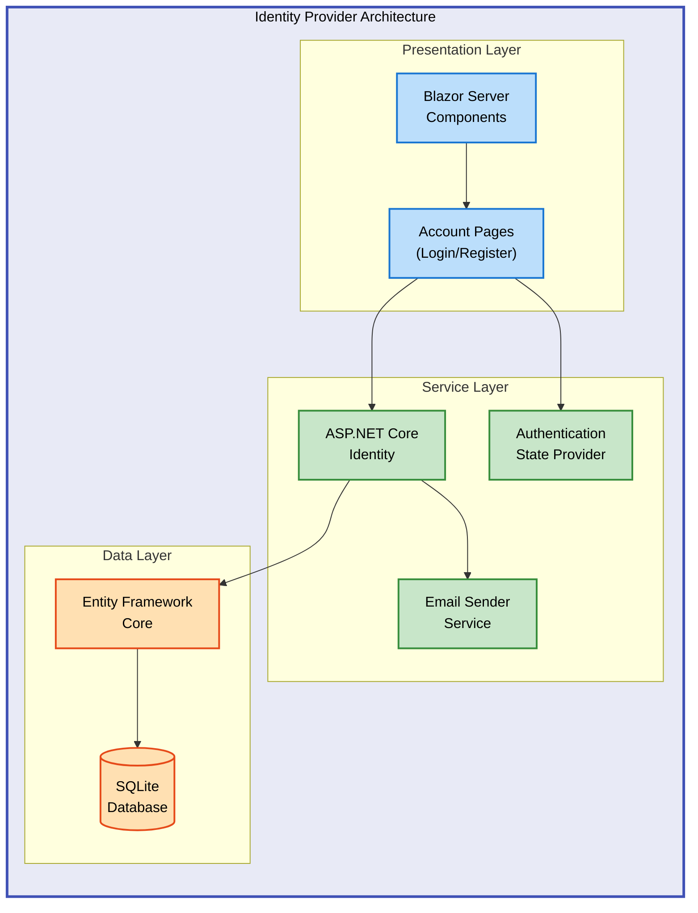

# IdentityProvider


A modern ASP.NET Core Blazor Server application providing secure user authentication and identity management with SQLite database storage and Azure deployment capabilities.

**Overview**

IdentityProvider delivers a production-ready authentication solution built on ASP.NET Core Identity framework. The application features server-side Blazor rendering for responsive user interfaces, Entity Framework Core for data persistence, and automatic database migrations in development environments. Designed for Azure Container Apps deployment, it provides scalable identity services with configurable authentication flows, email confirmation requirements, and comprehensive user management capabilities. The architecture supports both development and production scenarios with SQLite for local development and seamless migration to production-grade databases.

## 📑 Table of Contents

- [Architecture](#-architecture)
- [Quick Start](#-quick-start)
- [Deployment](#-deployment)
- [Usage](#-usage)
- [Features](#-features)
- [Requirements](#-requirements)
- [Configuration](#-configuration)
- [Contributing](#-contributing)
- [License](#-license)

## 🏗️ Architecture

**Overview**

The application follows a layered architecture pattern with Blazor Server for the presentation layer, ASP.NET Core Identity for authentication services, and Entity Framework Core for data access. Components are organized into functional areas including account management, authentication state providers, and identity endpoints. The infrastructure layer supports Azure Container Apps deployment with Bicep templates for resource provisioning.



## 🚀 Quick Start

Get started with IdentityProvider in under 5 minutes:

```bash
# Clone the repository
git clone https://github.com/Evilazaro/IdentityProvider.git
cd IdentityProvider

# Run the application
dotnet run --project src/IdentityProvider

# Navigate to https://localhost:5001
```

> 💡 **Tip**: Database migrations run automatically in development mode—no manual setup required.

## 📦 Deployment

**Overview**

IdentityProvider supports both local development and Azure Container Apps deployment. The local setup uses SQLite for rapid iteration, while Azure deployments leverage container-based hosting with infrastructure provisioned through Bicep templates. The Azure Developer CLI (azd) streamlines the entire deployment workflow from resource creation to application hosting.

### Prerequisites

Ensure you have the following installed before deployment:

1. [.NET 9.0 SDK](https://dotnet.microsoft.com/download/dotnet/9.0)
2. [Azure CLI](https://docs.microsoft.com/cli/azure/install-azure-cli) (for Azure deployments)
3. [Azure Developer CLI (azd)](https://learn.microsoft.com/azure/developer/azure-developer-cli/install-azd)

### Local Development

```bash
# Restore dependencies
dotnet restore

# Build the project
dotnet build src/IdentityProvider

# Run with automatic migrations
dotnet run --project src/IdentityProvider
```

> ⚠️ **Note**: The application creates `identityProviderDB.db` in the project directory on first run.

### Azure Container Apps Deployment

```bash
# Login to Azure
azd auth login

# Initialize environment
azd init

# Provision infrastructure and deploy
azd up
```

The `azd up` command provisions all Azure resources defined in `infra/main.bicep` and deploys the containerized application.

### Verification

Confirm successful deployment:

```bash
# Local: Visit https://localhost:5001
# Azure: azd outputs the application URL after deployment

# Check application health
curl -I https://your-app-url/
```

## 💻 Usage

**Overview**

IdentityProvider provides complete user authentication workflows including registration, login, email confirmation, and password recovery. The application exposes interactive Blazor components for account management and supports both cookie-based authentication and external providers through ASP.NET Core Identity.

### User Registration

```csharp
// Navigate to /Account/Register in your browser
// Or programmatically access the registration endpoint

// Example: Registering a new user
var user = new ApplicationUser { UserName = "user@example.com", Email = "user@example.com" };
var result = await userManager.CreateAsync(user, "SecurePassword123!");
// Expected: User created with confirmation email sent
```

### Authentication Flow

```csharp
// Users authenticate through the login page at /Account/Login
// Authentication uses cookie-based sessions with configurable expiration

// Example: Checking authentication state
@inject AuthenticationStateProvider AuthStateProvider

var authState = await AuthStateProvider.GetAuthenticationStateAsync();
var user = authState.User;

if (user.Identity.IsAuthenticated)
{
    // User is authenticated
    var userName = user.Identity.Name;
}
```

### Database Management

```bash
# Add new migration
dotnet ef migrations add MigrationName --project src/IdentityProvider

# Update database manually (optional in development)
dotnet ef database update --project src/IdentityProvider

# View migration history
dotnet ef migrations list --project src/IdentityProvider
```

## ✨ Features

**Overview**

IdentityProvider delivers enterprise-grade authentication capabilities through ASP.NET Core Identity integration. The feature set includes comprehensive user management, secure authentication flows, and flexible deployment options. Built with Blazor Server, the application provides responsive interactive components while maintaining server-side security. The modular architecture supports customization and extension for specific organizational requirements.

| Feature | Description | Benefits |
|---------|-------------|----------|
| **ASP.NET Core Identity** | Full-featured identity management system with user registration, login, and password recovery | Provides battle-tested security implementations and extensive customization options |
| **Blazor Server UI** | Interactive server-side rendered components for account management | Delivers rich user experiences without client-side JavaScript complexity |
| **Entity Framework Core** | Code-first database approach with automatic migrations | Simplifies data model changes and supports multiple database providers |
| **SQLite Database** | Lightweight file-based database for development and small deployments | Enables zero-configuration local development and portable data storage |
| **Azure Container Apps** | Cloud-native deployment with infrastructure as code | Provides automatic scaling, managed certificates, and simplified operations |
| **Email Confirmation** | Configurable account confirmation workflow | Enhances security and validates user email addresses |

## 📋 Requirements

**Overview**

IdentityProvider targets modern .NET development environments with support for cross-platform deployment. The application requires .NET 9.0 runtime and development tools, with additional Azure tooling for cloud deployments. All dependencies are managed through NuGet package references with explicit version constraints for stability.

| Category | Requirements | More Information |
|----------|--------------|------------------|
| **Runtime** | .NET 9.0 or later | [Download .NET](https://dotnet.microsoft.com/download/dotnet/9.0) |
| **Development** | Visual Studio 2022 (17.8+) or VS Code with C# extension | [Visual Studio](https://visualstudio.microsoft.com/) |
| **Database** | SQLite (included) or SQL Server for production | [Entity Framework Core Providers](https://learn.microsoft.com/ef/core/providers/) |
| **Azure Tools** | Azure CLI, Azure Developer CLI (azd) | [Azure CLI](https://docs.microsoft.com/cli/azure/install-azure-cli) |
| **System** | Windows 10+, macOS 12+, or Linux (Ubuntu 20.04+) | [.NET Supported OS versions](https://github.com/dotnet/core/blob/main/release-notes/9.0/supported-os.md) |

### NuGet Package Dependencies

```xml
<PackageReference Include="Microsoft.AspNetCore.Identity.EntityFrameworkCore" Version="9.0.3" />
<PackageReference Include="Microsoft.EntityFrameworkCore.Sqlite" Version="9.0.4" />
<PackageReference Include="Microsoft.EntityFrameworkCore.Design" Version="9.0.3" />
```

## 🔧 Configuration

**Overview**

IdentityProvider uses ASP.NET Core's configuration system with support for JSON files, environment variables, and user secrets. Configuration includes database connection strings, authentication settings, and application behavior controls. The application separates development and production configurations, with automatic migration application in development environments.

### Connection Strings

Configure database connection in `appsettings.json`:

```json
{
  "ConnectionStrings": {
    "DefaultConnection": "Data Source=identityProviderDB.db;"
  }
}
```

For production SQL Server:

```json
{
  "ConnectionStrings": {
    "DefaultConnection": "Server=tcp:yourserver.database.windows.net,1433;Database=IdentityDb;User ID=admin;Password=yourpassword;Encrypt=True;"
  }
}
```

### Identity Options

Configure authentication settings in `Program.cs`:

```csharp
builder.Services.AddIdentityCore<ApplicationUser>(options => {
    options.SignIn.RequireConfirmedAccount = true;
    options.Password.RequireDigit = true;
    options.Password.RequiredLength = 8;
    options.Password.RequireNonAlphanumeric = true;
})
```

### Environment Variables

```bash
# Development
ASPNETCORE_ENVIRONMENT=Development

# Production
ASPNETCORE_ENVIRONMENT=Production
ASPNETCORE_URLS=http://+:8080
```

### User Secrets (Development)

```bash
# Set user secrets for sensitive configuration
dotnet user-secrets set "ConnectionStrings:DefaultConnection" "YourConnectionString"
dotnet user-secrets set "Authentication:Google:ClientId" "YourClientId"
```

> 💡 **Tip**: Use Azure Key Vault for production secrets management.

## 🤝 Contributing

**Overview**

Contributions to IdentityProvider are welcome and appreciated. The project follows standard GitHub workflow practices with pull requests for code submissions. Contributors should maintain code quality standards, include tests for new features, and update documentation accordingly. All contributions must align with the project's architecture principles and security best practices.

1. Fork the repository
2. Create a feature branch: `git checkout -b feature/your-feature-name`
3. Commit changes: `git commit -am 'Add new feature'`
4. Push to branch: `git push origin feature/your-feature-name`
5. Submit a pull request

### Guidelines

- Follow existing code style and conventions
- Add unit tests for new functionality
- Update documentation for API changes
- Ensure all tests pass before submitting
- Keep commits focused and well-described

> ⚠️ **Security**: Report security vulnerabilities privately to the maintainers before public disclosure.

## 📝 License

MIT License - see [LICENSE](LICENSE) file for details.

Copyright (c) 2025 Evilázaro Alves
