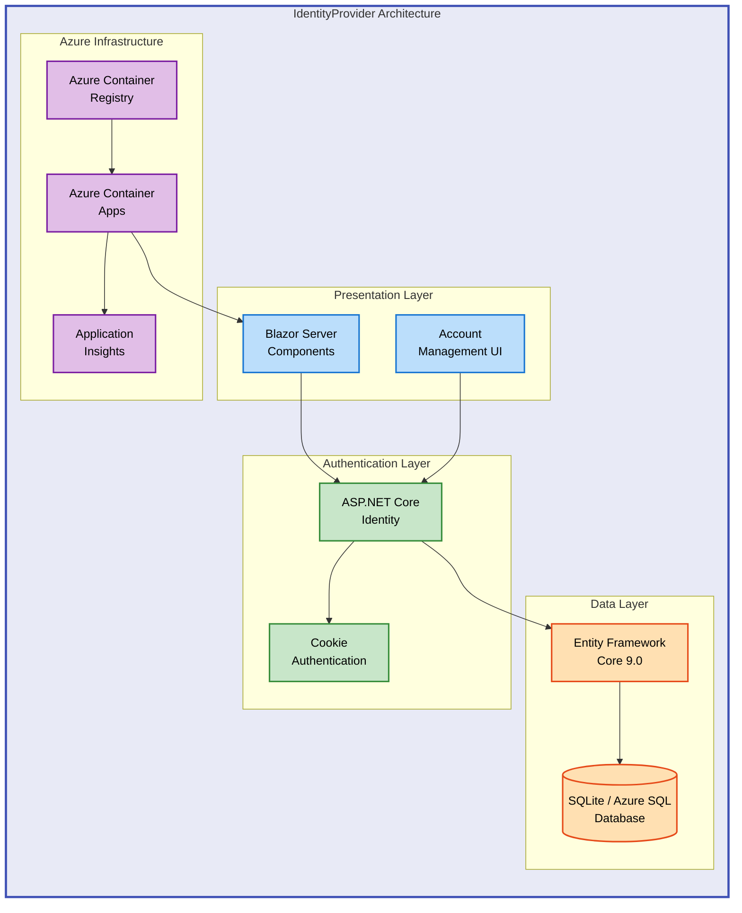

# IdentityProvider


A modern ASP.NET Core 9.0 Blazor Server application providing secure user authentication and identity management with Azure Container Apps deployment.

**Overview**

IdentityProvider is a production-ready authentication solution built on ASP.NET Core Identity, designed for organizations requiring secure user registration, login, and account management. The application leverages Blazor Server's interactive components for a responsive user experience while maintaining server-side security. It uses Entity Framework Core with SQLite for local development and supports seamless migration to Azure SQL Database for production deployments.

The system provides comprehensive identity management capabilities including email confirmation workflows, password reset functionality, two-factor authentication support, and role-based access control. Built with Azure-first architecture, IdentityProvider deploys as a containerized application on Azure Container Apps with integrated monitoring through Application Insights and Azure Monitor. This approach ensures scalability, high availability, and enterprise-grade security for authentication services.

Organizations benefit from reduced development time for authentication infrastructure, compliance-ready audit logging, and extensible user profile management. The modular design allows integration with existing applications through standard ASP.NET Core Identity APIs, while the included Azure infrastructure as code (Bicep) enables consistent, repeatable deployments across development, staging, and production environments.

---

## 📋 Table of Contents

- [Architecture](#-architecture)
- [Features](#-features)
- [Requirements](#-requirements)
- [Quick Start](#-quick-start)
- [Deployment](#-deployment)
  - [Local Development](#local-development)
  - [Azure Deployment](#azure-deployment)
- [Usage](#-usage)
- [Configuration](#-configuration)
- [Testing](#-testing)
- [Contributing](#-contributing)
- [License](#-license)

---

## 🏗️ Architecture

**Overview**

The IdentityProvider architecture follows a three-tier design pattern optimized for cloud-native deployment on Azure Container Apps. At the presentation layer, Blazor Server components deliver interactive user interfaces with server-side rendering, eliminating the need for client-side JavaScript frameworks while maintaining real-time responsiveness through SignalR connections. The authentication layer leverages ASP.NET Core Identity's built-in security features including password hashing (PBKDF2), secure cookie management, and anti-forgery token validation.

Data persistence occurs through Entity Framework Core with a database-agnostic design supporting SQLite for local development and Azure SQL Database for production. The application automatically applies Entity Framework migrations on startup in development mode, ensuring schema consistency without manual intervention. Azure Container Registry stores application container images with role-based access control limiting pull permissions to the Container Apps managed identity.

Infrastructure provisioning uses Azure Bicep templates defining Container Apps Environment, Application Insights workspace, Log Analytics workspace, and Container Registry with consistent naming conventions and resource tagging. This declarative infrastructure approach enables repeatable deployments across multiple environments while maintaining security best practices through managed identities and Azure RBAC policies.



---

## ✨ Features

**Overview**

IdentityProvider delivers enterprise-grade authentication capabilities through ASP.NET Core Identity's proven security framework. The feature set addresses common authentication requirements including user lifecycle management, credential security, and access control while maintaining extensibility for custom business logic. Each capability integrates seamlessly with existing ASP.NET Core applications through standard middleware and dependency injection patterns.

The system prioritizes security-first design with features like automatic account lockout after failed login attempts, secure password storage using industry-standard hashing algorithms, and built-in protection against common web vulnerabilities (CSRF, XSS). Development teams benefit from pre-built UI components reducing implementation time from weeks to hours, while security teams gain confidence from battle-tested authentication patterns used by thousands of production applications worldwide.

Advanced features like two-factor authentication support and email confirmation workflows enable compliance with regulatory requirements (GDPR, HIPAA, SOC 2) while maintaining user-friendly experiences. The containerized deployment model ensures consistent behavior across development laptops and production cloud environments, eliminating "works on my machine" deployment issues.

| Feature                                | Description                                                                                                                                                                                                           | Benefits                                                                                                                                                                                                                                                    |
| -------------------------------------- | --------------------------------------------------------------------------------------------------------------------------------------------------------------------------------------------------------------------- | ----------------------------------------------------------------------------------------------------------------------------------------------------------------------------------------------------------------------------------------------------------- |
| 🔐 **User Authentication**             | Cookie-based authentication with ASP.NET Core Identity supporting user registration, login, logout, and password management. Includes automatic database migrations and SQLite storage for rapid development.         | Eliminates custom authentication code reducing security vulnerabilities. Provides proven patterns for session management, password hashing (PBKDF2), and anti-forgery protection. Accelerates time-to-market for applications requiring user accounts.      |
| 📧 **Email Confirmation**              | Email verification workflow for new account registration with token-based confirmation links. Configurable email sender integration supporting SMTP, SendGrid, or custom providers.                                   | Prevents fake account creation and ensures valid user contact information. Reduces spam registrations and improves user data quality. Enables compliance with data protection regulations requiring verified user consent.                                  |
| 🔄 **Password Reset**                  | Secure password recovery flow with time-limited reset tokens sent via email. Includes password strength validation and confirmation requirements.                                                                     | Reduces help desk burden from locked-out users. Maintains security through token expiration and one-time use policies. Provides user-friendly self-service password management.                                                                             |
| 👤 **User Profile Management**         | Extensible `ApplicationUser` model based on `IdentityUser` allowing custom profile fields, claims, and metadata. Supports profile editing through Blazor interactive components.                                      | Enables application-specific user data without database schema modifications. Provides type-safe access to user properties through Entity Framework. Supports multi-tenancy scenarios with custom claims and roles.                                         |
| ☁️ **Azure Container Apps Deployment** | Infrastructure as code (Bicep) provisioning Azure Container Apps, Container Registry, Application Insights, and Log Analytics. Includes automated CI/CD via GitHub Actions and Azure Developer CLI (azd) integration. | Simplifies production deployment with managed containers eliminating server maintenance. Provides auto-scaling based on HTTP traffic with consumption-based pricing. Enables blue-green deployments and zero-downtime updates through container versioning. |

---

## 📋 Requirements

**Overview**

IdentityProvider requires a modern .NET development environment with specific runtime versions to ensure compatibility with ASP.NET Core 9.0 features and Entity Framework Core 9.0 improvements. The application supports cross-platform development on Windows, macOS, and Linux through .NET's unified runtime. Local development uses SQLite requiring no external database server, while production deployments typically migrate to Azure SQL Database for enterprise scalability and managed backups.

Azure deployment prerequisites include an active Azure subscription with permissions to create resource groups, Container Apps, and Container Registry resources. Organizations using Azure Active Directory benefit from seamless integration with managed identities for secure authentication between Azure resources without storing credentials in application code. Development teams should provision separate Azure environments (dev, staging, production) to isolate workloads and enable safe experimentation without production impact.

Tool requirements focus on the Azure Developer CLI (azd) which orchestrates infrastructure provisioning, container builds, and deployments through a single command-line interface. While optional for local development, azd becomes essential for teams adopting infrastructure as code practices and seeking repeatable, auditable deployments aligned with DevOps best practices.

| Category               | Requirements                                                                                                              | More Information                                                                                                                                                                                                                       |
| ---------------------- | ------------------------------------------------------------------------------------------------------------------------- | -------------------------------------------------------------------------------------------------------------------------------------------------------------------------------------------------------------------------------------- |
| **Runtime**            | .NET 9.0 SDK or later                                                                                                     | [Download .NET 9.0](https://dotnet.microsoft.com/download/dotnet/9.0)                                                                                                                                                                  |
| **Database**           | SQLite (included) for local development<br/>Azure SQL Database (optional) for production                                  | [Entity Framework Core documentation](https://docs.microsoft.com/ef/core/)                                                                                                                                                             |
| **IDE**                | Visual Studio 2022 17.8+, Visual Studio Code with C# extension, or JetBrains Rider 2024.1+                                | [Visual Studio 2022](https://visualstudio.microsoft.com/)<br/>[VS Code C# Extension](https://marketplace.visualstudio.com/items?itemName=ms-dotnettools.csharp)                                                                        |
| **Azure (Production)** | Azure subscription<br/>Azure CLI 2.50+ or Azure Developer CLI (azd) 1.5+<br/>Docker Desktop (for local container testing) | [Azure Free Account](https://azure.microsoft.com/free/)<br/>[Install Azure CLI](https://docs.microsoft.com/cli/azure/install-azure-cli)<br/>[Install azd](https://learn.microsoft.com/azure/developer/azure-developer-cli/install-azd) |
| **Git**                | Git 2.30+ for source control and CI/CD workflows                                                                          | [Git Downloads](https://git-scm.com/downloads)                                                                                                                                                                                         |

> ⚠️ **Note**: Azure deployment requires contributor-level permissions to create resources in a resource group. Contact your Azure administrator if you lack sufficient privileges.

---

## 🚀 Quick Start

```bash
# Clone the repository
git clone https://github.com/Evilazaro/IdentityProvider.git
cd IdentityProvider

# Restore dependencies
dotnet restore

# Run the application
dotnet run --project src/IdentityProvider

# Access the application at https://localhost:5001
```

> 💡 **Tip**: The database is automatically created and migrated on first run in development mode. No manual database setup required.

---

## 📦 Deployment

### Local Development

**Overview**

Local deployment prioritizes rapid iteration cycles enabling developers to test authentication flows without cloud dependencies. The SQLite database stores all user data in a single file (`identityProviderDB.db`) located in the project directory, simplifying backup and reset operations during development. Entity Framework Core's automatic migration system detects model changes and updates the database schema on application startup, eliminating manual schema management.

1. **Prerequisites Check**

   Verify .NET 9.0 SDK installation:

   ```bash
   dotnet --version
   # Expected output: 9.0.x or higher
   ```

2. **Clone and Restore**

   ```bash
   git clone https://github.com/Evilazaro/IdentityProvider.git
   cd IdentityProvider
   dotnet restore
   ```

3. **Configure Connection String** (Optional)

   The default SQLite connection string works out-of-the-box. To customize, edit `src/IdentityProvider/appsettings.Development.json`:

   ```json
   {
     "ConnectionStrings": {
       "DefaultConnection": "Data Source=identityProviderDB.db;"
     }
   }
   ```

4. **Run Application**

   ```bash
   cd src/IdentityProvider
   dotnet run
   ```

   Expected output:

   ```
   info: Microsoft.Hosting.Lifetime[14]
         Now listening on: https://localhost:5001
   info: Microsoft.Hosting.Lifetime[0]
         Application started. Press Ctrl+C to shut down.
   ```

5. **Access Application**

   Navigate to `https://localhost:5001` in your browser. The first request triggers automatic database creation and migration.

6. **Register Test User**

   Click "Register" and create an account with:
   - Email: `test@example.com`
   - Password: `Test123!` (meets complexity requirements)

   > ⚠️ **Development Note**: Email confirmation is bypassed in development mode (`RequireConfirmedAccount` is enabled but no real emails are sent). Configure an email sender for production use.

### Azure Deployment

**Overview**

Azure deployment leverages the Azure Developer CLI (azd) for streamlined infrastructure provisioning and application deployment. The included Bicep templates define all required Azure resources (Container Apps, Container Registry, Application Insights) with secure defaults and consistent naming conventions. This approach enables reproducible deployments across multiple environments while maintaining infrastructure as code best practices.

1. **Install Azure Developer CLI**

   ```bash
   # Windows (PowerShell)
   powershell -ex AllSigned -c "Invoke-RestMethod 'https://aka.ms/install-azd.ps1' | Invoke-Expression"

   # macOS/Linux
   curl -fsSL https://aka.ms/install-azd.sh | bash
   ```

2. **Azure Login**

   ```bash
   azd auth login
   # Opens browser for Azure authentication
   ```

3. **Initialize Environment**

   ```bash
   azd init
   # Follow prompts to select Azure subscription and region
   # Recommended regions: East US, West Europe, Southeast Asia
   ```

4. **Provision and Deploy**

   ```bash
   azd up
   # Provisions Azure resources (5-10 minutes)
   # Builds container image
   # Deploys to Azure Container Apps
   ```

   Expected output:

   ```
   Provisioning Azure resources (azd provision)
   Creating resource group: rg-identity-provider-dev
   Creating container registry: cridentityproviderdev
   Creating container apps environment: cae-identity-provider-dev
   Creating container app: ca-identity-provider

   Deploying services (azd deploy)
   Building container image: identity-provider:latest
   Pushing to Azure Container Registry
   Deploying to Azure Container Apps

   Success! Your application is running at:
   https://ca-identity-provider.randomstring.azurecontainerapps.io
   ```

5. **Configure Production Database** (Recommended)

   For production workloads, migrate from SQLite to Azure SQL Database:

   ```bash
   # Create Azure SQL Database
   az sql server create --name sql-identity-provider --resource-group rg-identity-provider-dev --location eastus --admin-user sqladmin --admin-password 'YourSecurePassword123!'
   az sql db create --resource-group rg-identity-provider-dev --server sql-identity-provider --name identitydb --service-objective S0

   # Update connection string in Azure Container Apps environment variables
   az containerapp update --name ca-identity-provider --resource-group rg-identity-provider-dev --set-env-vars "ConnectionStrings__DefaultConnection=Server=tcp:sql-identity-provider.database.windows.net,1433;Database=identitydb;User ID=sqladmin;Password=YourSecurePassword123!;Encrypt=True;TrustServerCertificate=False;Connection Timeout=30;"
   ```

6. **Verify Deployment**

   Access the application URL provided by `azd up`. Register a test account to confirm authentication flows work correctly.

> 💡 **Tip**: Use `azd monitor` to view Application Insights logs and metrics in real-time. Use `azd down` to delete all Azure resources when no longer needed.

---

## 💻 Usage

**Overview**

IdentityProvider exposes standard ASP.NET Core Identity endpoints through Blazor Server components, enabling seamless integration with existing web applications. The authentication state propagates automatically to all Blazor components through the `AuthenticationStateProvider`, allowing conditional rendering based on user login status. Custom authentication logic extends through the `ApplicationUser` model and Identity's built-in extensibility points for claims-based authorization.

### User Registration

1. Navigate to `/Account/Register`
2. Enter email address and password (minimum 8 characters, requires uppercase, lowercase, digit, and special character)
3. Click "Register"
4. Account is created and user is automatically logged in (in development mode)

```csharp
// Example: Accessing authenticated user in Blazor component
@page "/dashboard"
@using Microsoft.AspNetCore.Authorization
@attribute [Authorize]

<h3>Welcome, @context.User.Identity?.Name!</h3>

@code {
    [CascadingParameter]
    private Task<AuthenticationState>? authenticationStateTask { get; set; }

    private string userName = "";

    protected override async Task OnInitializedAsync()
    {
        var authState = await authenticationStateTask!;
        var user = authState.User;

        if (user.Identity?.IsAuthenticated == true)
        {
            userName = user.Identity.Name ?? "Unknown";
        }
    }
}
```

### User Login

Navigate to `/Account/Login` and enter credentials. On successful authentication, users redirect to the home page with an authenticated session cookie valid for 14 days by default.

### Logout

Click "Logout" in the navigation menu or navigate to `/Account/Logout` to clear the authentication cookie and end the session.

### Extending User Profiles

Add custom fields to `ApplicationUser`:

```csharp
// src/IdentityProvider/Data/ApplicationUser.cs
public class ApplicationUser : IdentityUser
{
    [MaxLength(100)]
    public string? FirstName { get; set; }

    [MaxLength(100)]
    public string? LastName { get; set; }

    public DateTime? DateOfBirth { get; set; }
}
```

After modifying the model, create and apply a migration:

```bash
dotnet ef migrations add AddUserProfileFields --project src/IdentityProvider
dotnet ef database update --project src/IdentityProvider
```

---

## 🔧 Configuration

**Overview**

Configuration follows ASP.NET Core's hierarchical settings system with environment-specific overrides enabling different behaviors across development, staging, and production. Sensitive values like database connection strings and email service credentials should use Azure Key Vault or user secrets in development to avoid committing secrets to source control. The application reads configuration from `appsettings.json` (base settings), `appsettings.Development.json` (local overrides), and environment variables (production overrides in Azure).

### Environment Variables

```bash
# Database connection (production)
ConnectionStrings__DefaultConnection="Server=tcp:yourserver.database.windows.net,1433;Database=identitydb;..."

# Email sender configuration (optional)
EmailSender__SmtpHost="smtp.sendgrid.net"
EmailSender__SmtpPort="587"
EmailSender__Username="apikey"
EmailSender__Password="your-sendgrid-api-key"

# Logging level
Logging__LogLevel__Default="Information"
Logging__LogLevel__Microsoft_AspNetCore="Warning"
```

### Application Settings

Edit `src/IdentityProvider/appsettings.json`:

```json
{
  "ConnectionStrings": {
    "DefaultConnection": "Data Source=identityProviderDB.db;"
  },
  "Logging": {
    "LogLevel": {
      "Default": "Information",
      "Microsoft.AspNetCore": "Warning"
    }
  },
  "AllowedHosts": "*"
}
```

### Identity Options

Customize password requirements and account settings in `Program.cs`:

```csharp
builder.Services.AddIdentityCore<ApplicationUser>(options =>
{
    options.SignIn.RequireConfirmedAccount = true;
    options.Password.RequireDigit = true;
    options.Password.RequiredLength = 8;
    options.Password.RequireNonAlphanumeric = true;
    options.Password.RequireUppercase = true;
    options.Password.RequireLowercase = true;
    options.Lockout.MaxFailedAccessAttempts = 5;
    options.Lockout.DefaultLockoutTimeSpan = TimeSpan.FromMinutes(15);
})
```

### Azure-Specific Configuration

The `azure.yaml` file defines deployment settings for Azure Developer CLI:

```yaml
name: identity-provider
services:
  identity-provider:
    project: src/IdentityProvider
    host: containerapp
    language: dotnet
resources:
  identity-provider:
    type: host.containerapp
    port: 8080
```

> ⚠️ **Security Warning**: Never commit connection strings or API keys to source control. Use Azure Key Vault references in production or user secrets for local development (`dotnet user-secrets set "ConnectionStrings:DefaultConnection" "your-connection-string"`).

---

## 🧪 Testing

Run unit tests with MSTest:

```bash
dotnet test src/identityProviderTests/identityProviderTests.csproj
```

Expected output:

```
Test run for identityProviderTests.dll (.NETCoreApp,Version=v9.0)
Microsoft (R) Test Execution Command Line Tool Version 17.8.0
Starting test execution, please wait...
Total tests: X
     Passed: X
```

> 💡 **Tip**: Add tests for custom authentication logic, user profile extensions, and authorization policies to ensure security requirements remain enforced during code changes.

---

## 🤝 Contributing

**Overview**

Contributions enhance IdentityProvider's capabilities for the broader developer community while maintaining security and code quality standards. The contribution process follows GitHub's pull request workflow enabling collaborative code review before changes merge to the main branch. Security-sensitive changes (authentication logic, cryptography, access control) receive additional scrutiny to prevent vulnerabilities reaching production deployments.

Contributors benefit from clear coding standards (defined in `.editorconfig`), automated CI checks via GitHub Actions, and maintainer feedback within 3-5 business days. The project welcomes bug fixes, documentation improvements, feature enhancements, and Azure infrastructure optimizations. Significant architectural changes should start with a GitHub issue discussion to align with project goals before investing implementation effort.

Quality standards require all pull requests pass existing unit tests, add tests for new functionality, and maintain backward compatibility with existing ASP.NET Core Identity APIs. Documentation updates accompany code changes ensuring README, XML doc comments, and inline comments remain accurate. This collaborative approach ensures IdentityProvider remains secure, maintainable, and useful for authentication scenarios across diverse applications.

1. Fork the repository
2. Create a feature branch (`git checkout -b feature/your-feature-name`)
3. Make your changes following C# coding conventions
4. Add unit tests for new functionality
5. Run tests locally (`dotnet test`)
6. Commit changes with descriptive messages (`git commit -m "Add two-factor authentication support"`)
7. Push to your fork (`git push origin feature/your-feature-name`)
8. Open a pull request with detailed description

**Code Style Guidelines**:

- Follow [Microsoft C# Coding Conventions](https://docs.microsoft.com/dotnet/csharp/fundamentals/coding-style/coding-conventions)
- Use meaningful variable and method names
- Add XML documentation comments for public APIs
- Keep methods focused on single responsibilities

**Areas for Contribution**:

- Additional authentication providers (Google, Microsoft, Facebook OAuth)
- Enhanced user profile management UI
- Role-based authorization examples
- Azure Key Vault integration for secrets
- Terraform alternative to Bicep templates

---

## 📝 License

MIT License - see [LICENSE](LICENSE) file for details.

Copyright (c) 2025 Evilázaro Alves

---

**Built with .NET 9.0 | Deployed on Azure Container Apps | Secured with ASP.NET Core Identity**
