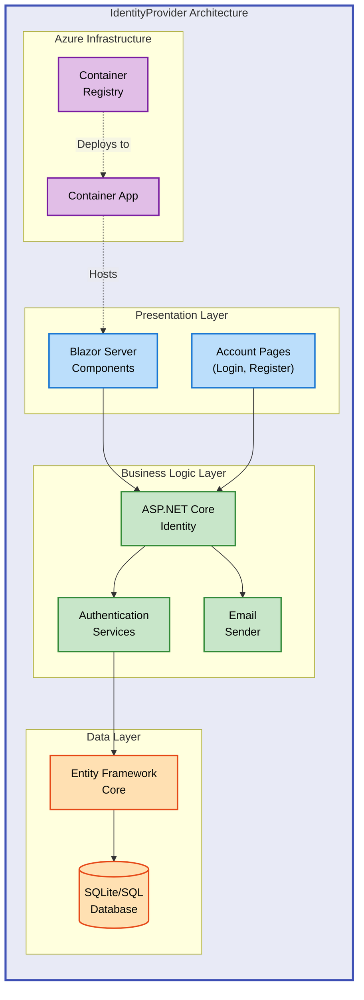

# IdentityProvider


A modern ASP.NET Core Blazor Server application providing secure user authentication and identity management. Built with .NET 9.0 and ASP.NET Core Identity, it delivers a complete authentication solution ready for Azure Container Apps deployment.

**Overview**

IdentityProvider solves the challenge of implementing secure, production-ready authentication for web applications. It targets developers and teams who need a reliable identity management system without building authentication from scratch. The application provides user registration, login, email confirmation, and account management capabilities out of the box.

The system uses ASP.NET Core Identity as its foundation, integrating seamlessly with Entity Framework Core for data persistence and Blazor Server for interactive UI components. This combination enables rapid development while maintaining enterprise-grade security standards. The included Azure infrastructure templates allow teams to deploy the complete authentication system to the cloud in minutes, not days.

By providing a working reference implementation, IdentityProvider accelerates project timelines and reduces security risks. Teams can focus on building business features while relying on battle-tested authentication patterns. The modular architecture supports customization for specific requirements while maintaining security best practices throughout the codebase.

## 📑 Table of Contents

- [Architecture](#-architecture)
- [Features](#-features)
- [Requirements](#-requirements)
- [Quick Start](#-quick-start)
- [Deployment](#-deployment)
- [Usage](#-usage)
- [Configuration](#-configuration)
- [Demo](#-demo)
- [Contributing](#-contributing)
- [License](#-license)

## 🏗️ Architecture

**Overview**

IdentityProvider follows a three-tier architecture pattern optimized for cloud deployment. The presentation layer uses Blazor Server components for real-time interactivity, the business logic layer leverages ASP.NET Core Identity for authentication workflows, and the data layer employs Entity Framework Core with SQLite for development and SQL Server for production.

This architecture separates concerns effectively, allowing independent scaling of UI components, authentication services, and database resources. The stateful SignalR connections in Blazor Server provide responsive user experiences while maintaining server-side security controls. Azure Container Apps deployment ensures automatic scaling and high availability across geographic regions.



## ✨ Features

**Overview**

IdentityProvider delivers essential authentication capabilities required for modern web applications. Each feature addresses specific security and user experience needs, from secure password storage using industry-standard hashing algorithms to automated email confirmation workflows. These capabilities reduce development time while ensuring compliance with authentication best practices.

The feature set integrates tightly with ASP.NET Core middleware, providing consistent security policies across the entire application. Developers can extend base functionality through Identity's extensibility points without compromising security. The Blazor Server architecture enables real-time validation and feedback during authentication workflows.

| Feature                        | Description                                                                                                                                                               | Benefits                                                                                                                                        |
| ------------------------------ | ------------------------------------------------------------------------------------------------------------------------------------------------------------------------- | ----------------------------------------------------------------------------------------------------------------------------------------------- |
| 🔐 **User Authentication**     | Complete login and registration system with secure password hashing using ASP.NET Core Identity. Supports cookie-based authentication with configurable timeout policies. | Eliminates need to build authentication from scratch. Reduces security vulnerabilities through proven implementation patterns.                  |
| 📧 **Email Confirmation**      | Account verification workflow requiring email confirmation before granting access. Includes token generation and validation mechanisms.                                   | Prevents spam registrations and verifies user identity. Configurable email sender interface supports custom SMTP providers.                     |
| 👤 **Account Management**      | Self-service profile management including password changes, email updates, and account deletion. Built-in security checks validate user ownership.                        | Reduces support burden by enabling users to manage accounts independently. Maintains audit trails for security compliance.                      |
| 🗄️ **Database Migrations**     | Automatic schema updates via Entity Framework Core migrations. Supports SQLite for development and SQL Server for production environments.                                | Eliminates manual database maintenance. Version-controlled schema changes enable reproducible deployments across environments.                  |
| ☁️ **Azure Deployment**        | Production-ready Bicep templates provision Container Apps, Container Registry, and supporting infrastructure. Includes managed identity configuration.                    | Accelerates cloud deployment from hours to minutes. Infrastructure as Code ensures consistent environments across dev, staging, and production. |
| 🎨 **Interactive UI**          | Blazor Server components provide responsive authentication forms with real-time validation. Server-side rendering maintains security while delivering rich interactions.  | Improves user experience with instant feedback. Reduces client-side attack surface by keeping logic server-side.                                |
| 🔒 **Security Best Practices** | Implements HTTPS enforcement, anti-forgery tokens, secure cookie handling, and Content Security Policy headers. Follows OWASP authentication guidelines.                  | Protects against common web vulnerabilities including CSRF, XSS, and session hijacking. Simplifies security audit compliance.                   |

## 📋 Requirements

**Overview**

IdentityProvider requires a modern .NET development environment and supporting tools for both local development and cloud deployment. These prerequisites ensure compatibility with the latest security patches and framework features. Development dependencies differ from production requirements, allowing lightweight local environments while supporting enterprise-scale deployments.

The .NET 9.0 SDK provides the latest language features and performance improvements essential for modern web applications. Entity Framework Core requires database providers matching your target environment. Azure deployments need the Azure Developer CLI for infrastructure provisioning and container orchestration.

| Category        | Requirements                                                        | More Information                                                                                                                                    |
| --------------- | ------------------------------------------------------------------- | --------------------------------------------------------------------------------------------------------------------------------------------------- |
| **Runtime**     | .NET 9.0 SDK or later                                               | [Download .NET](https://dotnet.microsoft.com/download)                                                                                              |
| **Database**    | SQLite 3.x (development)<br/>SQL Server 2019+ (production)          | [EF Core Database Providers](https://docs.microsoft.com/ef/core/providers/)                                                                         |
| **IDE**         | Visual Studio 2022 17.8+<br/>or VS Code with C# extension           | [Visual Studio](https://visualstudio.microsoft.com/)<br/>[VS Code](https://code.visualstudio.com/)                                                  |
| **Azure Tools** | Azure Developer CLI (azd)<br/>Azure subscription (for deployment)   | [Azure Developer CLI](https://learn.microsoft.com/azure/developer/azure-developer-cli/)<br/>[Azure Free Account](https://azure.microsoft.com/free/) |
| **Optional**    | Docker Desktop (for containerization)<br/>Git (for version control) | [Docker Desktop](https://www.docker.com/products/docker-desktop)<br/>[Git](https://git-scm.com/)                                                    |

> ⚠️ **Note**: SQLite is suitable for development only. Production deployments should use SQL Server, PostgreSQL, or Azure SQL Database for scalability and reliability.

## 🚀 Quick Start

Get IdentityProvider running locally in under 5 minutes:

```bash
# Clone the repository
git clone https://github.com/Evilazaro/IdentityProvider.git
cd IdentityProvider

# Restore dependencies and run
dotnet restore
dotnet run --project src/IdentityProvider
```

> 💡 **Tip**: The application automatically applies database migrations on first run in development mode. Access the application at `https://localhost:7001`.

## 📦 Deployment

### Local Development

**Overview**

Local deployment prioritizes rapid iteration cycles enabling developers to test authentication flows without cloud dependencies. The SQLite database stores all user data in a single file (`identityProviderDB.db`) located in the project directory, simplifying backup and reset operations during development. Entity Framework Core's automatic migration system detects model changes and updates the database schema on application startup, eliminating manual schema management.

1. **Prerequisites Check**

   Verify .NET 9.0 SDK installation:

   ```bash
   dotnet --version
   # Expected output: 9.0.x or higher
   ```

2. **Clone and Restore**

   ```bash
   git clone https://github.com/Evilazaro/IdentityProvider.git
   cd IdentityProvider
   dotnet restore
   ```

3. **Configure Connection String** (Optional)

   The default SQLite connection string works out-of-the-box. To customize, edit `src/IdentityProvider/appsettings.Development.json`:

   ```json
   {
     "ConnectionStrings": {
       "DefaultConnection": "Data Source=identityProviderDB.db;"
     }
   }
   ```

4. **Run Application**

   ```bash
   cd src/IdentityProvider
   dotnet run
   ```

   Expected output:

   ```
   info: Microsoft.Hosting.Lifetime[14]
         Now listening on: https://localhost:5001
   info: Microsoft.Hosting.Lifetime[0]
         Application started. Press Ctrl+C to shut down.
   ```

5. **Access Application**

   Navigate to `https://localhost:5001` in your browser. The first request triggers automatic database creation and migration.

6. **Register Test User**

   Click "Register" and create an account with:
   - Email: `test@example.com`
   - Password: `Test123!` (meets complexity requirements)

   > ⚠️ **Development Note**: Email confirmation is bypassed in development mode (`RequireConfirmedAccount` is enabled but no real emails are sent). Configure an email sender for production use.

### Azure Deployment

**Overview**

Azure deployment leverages the Azure Developer CLI (azd) for streamlined infrastructure provisioning and application deployment. The included Bicep templates define all required Azure resources (Container Apps, Container Registry, Application Insights) with secure defaults and consistent naming conventions. This approach enables reproducible deployments across multiple environments while maintaining infrastructure as code best practices.

1. **Install Azure Developer CLI**

   ```bash
   # Windows (PowerShell)
   powershell -ex AllSigned -c "Invoke-RestMethod 'https://aka.ms/install-azd.ps1' | Invoke-Expression"

   # macOS/Linux
   curl -fsSL https://aka.ms/install-azd.sh | bash
   ```

2. **Azure Login**

   ```bash
   azd auth login
   # Opens browser for Azure authentication
   ```

3. **Initialize Environment**

   ```bash
   azd init
   # Follow prompts to select Azure subscription and region
   # Recommended regions: East US, West Europe, Southeast Asia
   ```

4. **Provision and Deploy**

   ```bash
   azd up
   # Provisions Azure resources (5-10 minutes)
   # Builds container image
   # Deploys to Azure Container Apps
   ```

   Expected output:

   ```
   Provisioning Azure resources (azd provision)
   Creating resource group: rg-identity-provider-dev
   Creating container registry: cridentityproviderdev
   Creating container apps environment: cae-identity-provider-dev
   Creating container app: ca-identity-provider

   Deploying services (azd deploy)
   Building container image: identity-provider:latest
   Pushing to Azure Container Registry
   Deploying to Azure Container Apps

   Success! Your application is running at:
   https://ca-identity-provider.randomstring.azurecontainerapps.io
   ```

5. **Configure Production Database** (Recommended)

   For production workloads, migrate from SQLite to Azure SQL Database:

   ```bash
   # Create Azure SQL Database
   az sql server create --name sql-identity-provider --resource-group rg-identity-provider-dev --location eastus --admin-user sqladmin --admin-password 'YourSecurePassword123!'
   az sql db create --resource-group rg-identity-provider-dev --server sql-identity-provider --name identitydb --service-objective S0

   # Update connection string in Azure Container Apps environment variables
   az containerapp update --name ca-identity-provider --resource-group rg-identity-provider-dev --set-env-vars "ConnectionStrings__DefaultConnection=Server=tcp:sql-identity-provider.database.windows.net,1433;Database=identitydb;User ID=sqladmin;Password=YourSecurePassword123!;Encrypt=True;TrustServerCertificate=False;Connection Timeout=30;"
   ```

6. **Verify Deployment**

   Access the application URL provided by `azd up`. Register a test account to confirm authentication flows work correctly.

> 💡 **Tip**: Use `azd monitor` to view Application Insights logs and metrics in real-time. Use `azd down` to delete all Azure resources when no longer needed.

---

## 💻 Usage

**Overview**

IdentityProvider exposes standard ASP.NET Core Identity endpoints through Blazor Server components, enabling seamless integration with existing web applications. The authentication state propagates automatically to all Blazor components through the `AuthenticationStateProvider`, allowing conditional rendering based on user login status. Custom authentication logic extends through the `ApplicationUser` model and Identity's built-in extensibility points for claims-based authorization.

### User Registration

1. Navigate to `/Account/Register`
2. Enter email address and password (minimum 8 characters, requires uppercase, lowercase, digit, and special character)
3. Click "Register"
4. Account is created and user is automatically logged in (in development mode)

```csharp
// Example: Accessing authenticated user in Blazor component
@page "/dashboard"
@using Microsoft.AspNetCore.Authorization
@attribute [Authorize]

<h3>Welcome, @context.User.Identity?.Name!</h3>

@code {
    [CascadingParameter]
    private Task<AuthenticationState>? authenticationStateTask { get; set; }

    private string userName = "";

    protected override async Task OnInitializedAsync()
    {
        var authState = await authenticationStateTask!;
        var user = authState.User;

        if (user.Identity?.IsAuthenticated == true)
        {
            userName = user.Identity.Name ?? "Unknown";
        }
    }
}
```

### User Login

Navigate to `/Account/Login` and enter credentials. On successful authentication, users redirect to the home page with an authenticated session cookie valid for 14 days by default.

### Logout

Click "Logout" in the navigation menu or navigate to `/Account/Logout` to clear the authentication cookie and end the session.

### Extending User Profiles

Add custom fields to `ApplicationUser`:

```csharp
// src/IdentityProvider/Data/ApplicationUser.cs
public class ApplicationUser : IdentityUser
{
    [MaxLength(100)]
    public string? FirstName { get; set; }

    [MaxLength(100)]
    public string? LastName { get; set; }

    public DateTime? DateOfBirth { get; set; }
}
```

After modifying the model, create and apply a migration:

```bash
dotnet ef migrations add AddUserProfileFields --project src/IdentityProvider
dotnet ef database update --project src/IdentityProvider
```

---

## 🔧 Configuration

**Overview**

Configuration follows ASP.NET Core's hierarchical settings system with environment-specific overrides enabling different behaviors across development, staging, and production. Sensitive values like database connection strings and email service credentials should use Azure Key Vault or user secrets in development to avoid committing secrets to source control. The application reads configuration from `appsettings.json` (base settings), `appsettings.Development.json` (local overrides), and environment variables (production overrides in Azure).

### Environment Variables

```bash
# Database connection (production)
ConnectionStrings__DefaultConnection="Server=tcp:yourserver.database.windows.net,1433;Database=identitydb;..."

# Email sender configuration (optional)
EmailSender__SmtpHost="smtp.sendgrid.net"
EmailSender__SmtpPort="587"
EmailSender__Username="apikey"
EmailSender__Password="your-sendgrid-api-key"

# Logging level
Logging__LogLevel__Default="Information"
Logging__LogLevel__Microsoft_AspNetCore="Warning"
```

### Application Settings

Edit `src/IdentityProvider/appsettings.json`:

```json
{
  "ConnectionStrings": {
    "DefaultConnection": "Data Source=identityProviderDB.db;"
  },
  "Logging": {
    "LogLevel": {
      "Default": "Information",
      "Microsoft.AspNetCore": "Warning"
    }
  },
  "AllowedHosts": "*"
}
```

### Identity Options

Customize password requirements and account settings in `Program.cs`:

```csharp
builder.Services.AddIdentityCore<ApplicationUser>(options =>
{
    options.SignIn.RequireConfirmedAccount = true;
    options.Password.RequireDigit = true;
    options.Password.RequiredLength = 8;
    options.Password.RequireNonAlphanumeric = true;
    options.Password.RequireUppercase = true;
    options.Password.RequireLowercase = true;
    options.Lockout.MaxFailedAccessAttempts = 5;
    options.Lockout.DefaultLockoutTimeSpan = TimeSpan.FromMinutes(15);
})
```

### Azure-Specific Configuration

The `azure.yaml` file defines deployment settings for Azure Developer CLI:

```yaml
name: identity-provider
services:
  identity-provider:
    project: src/IdentityProvider
    host: containerapp
    language: dotnet
resources:
  identity-provider:
    type: host.containerapp
    port: 8080
```

> ⚠️ **Security Warning**: Never commit connection strings or API keys to source control. Use Azure Key Vault references in production or user secrets for local development (`dotnet user-secrets set "ConnectionStrings:DefaultConnection" "your-connection-string"`).

---

## 🧪 Testing

Run unit tests with MSTest:

```bash
dotnet test src/identityProviderTests/identityProviderTests.csproj
```

Expected output:

```
Test run for identityProviderTests.dll (.NETCoreApp,Version=v9.0)
Microsoft (R) Test Execution Command Line Tool Version 17.8.0
Starting test execution, please wait...
Total tests: X
     Passed: X
```

> 💡 **Tip**: Add tests for custom authentication logic, user profile extensions, and authorization policies to ensure security requirements remain enforced during code changes.

---

## 🤝 Contributing

**Overview**

Contributions enhance IdentityProvider's capabilities for the broader developer community while maintaining security and code quality standards. The contribution process follows GitHub's pull request workflow enabling collaborative code review before changes merge to the main branch. Security-sensitive changes (authentication logic, cryptography, access control) receive additional scrutiny to prevent vulnerabilities reaching production deployments.

Contributors benefit from clear coding standards (defined in `.editorconfig`), automated CI checks via GitHub Actions, and maintainer feedback within 3-5 business days. The project welcomes bug fixes, documentation improvements, feature enhancements, and Azure infrastructure optimizations. Significant architectural changes should start with a GitHub issue discussion to align with project goals before investing implementation effort.

Quality standards require all pull requests pass existing unit tests, add tests for new functionality, and maintain backward compatibility with existing ASP.NET Core Identity APIs. Documentation updates accompany code changes ensuring README, XML doc comments, and inline comments remain accurate. This collaborative approach ensures IdentityProvider remains secure, maintainable, and useful for authentication scenarios across diverse applications.

1. Fork the repository
2. Create a feature branch (`git checkout -b feature/your-feature-name`)
3. Make your changes following C# coding conventions
4. Add unit tests for new functionality
5. Run tests locally (`dotnet test`)
6. Commit changes with descriptive messages (`git commit -m "Add two-factor authentication support"`)
7. Push to your fork (`git push origin feature/your-feature-name`)
8. Open a pull request with detailed description

**Code Style Guidelines**:

- Follow [Microsoft C# Coding Conventions](https://docs.microsoft.com/dotnet/csharp/fundamentals/coding-style/coding-conventions)
- Use meaningful variable and method names
- Add XML documentation comments for public APIs
- Keep methods focused on single responsibilities

**Areas for Contribution**:

- Additional authentication providers (Google, Microsoft, Facebook OAuth)
- Enhanced user profile management UI
- Role-based authorization examples
- Azure Key Vault integration for secrets
- Terraform alternative to Bicep templates

---

## 📝 License

MIT License - see [LICENSE](LICENSE) file for details.

Copyright (c) 2025 Evilázaro Alves

---

**Built with .NET 9.0 | Deployed on Azure Container Apps | Secured with ASP.NET Core Identity**
