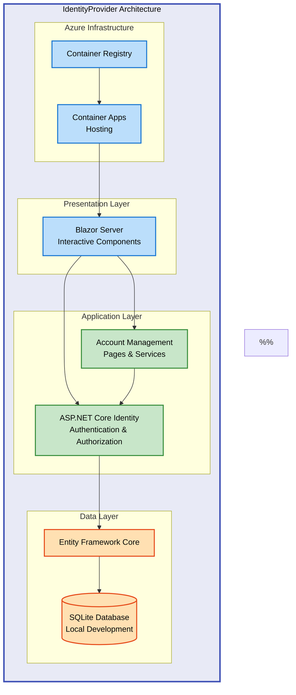

# IdentityProvider


A modern, secure identity provider built with ASP.NET Core Blazor Server and ASP.NET Core Identity, designed for seamless user authentication and management with Azure deployment support.

**Overview**

IdentityProvider is a production-ready authentication solution that leverages the power of Blazor Server's interactive components with the robust security features of ASP.NET Core Identity. Built on .NET 9.0, it provides a complete user management system including registration, login, password reset, and email confirmation workflows. The application uses SQLite for local development and is designed for deployment to Azure Container Apps with Infrastructure as Code (Bicep) templates included. This project demonstrates best practices for modern web authentication, secure credential storage, and cloud-native architecture patterns.

The system is architected for scalability and security, featuring automatic database migrations, comprehensive testing with MSTest, and a containerized deployment pipeline. Whether you're building a new application that needs authentication or looking for a reference implementation of ASP.NET Core Identity, this project provides a solid foundation with clear separation of concerns and maintainable code structure.

## Table of Contents

- [Architecture](#architecture)
- [Quick Start](#quick-start)
- [Deployment](#deployment)
- [Usage](#usage)
- [Features](#features)
- [Requirements](#requirements)
- [Configuration](#configuration)
- [Demo](#demo)
- [Contributing](#contributing)
- [License](#license)

## 🏗️ Architecture

**Overview**

The IdentityProvider follows a modern three-tier architecture pattern with clear separation between presentation (Blazor Server components), business logic (ASP.NET Core Identity services), and data persistence (Entity Framework Core with SQLite). The system is designed for Azure Container Apps deployment, leveraging managed infrastructure for scalability and reliability. Key architectural decisions include the use of Blazor Server for real-time interactivity, Entity Framework migrations for database versioning, and Bicep templates for reproducible infrastructure deployment.



## 🚀 Quick Start

**Overview**

Get started with IdentityProvider in under 5 minutes. This section provides the fastest path to running the application locally for development and testing. The quick start assumes you have .NET 9.0 SDK installed and focuses on the essential commands needed to restore dependencies, apply database migrations, and launch the application. For detailed deployment scenarios including Azure Container Apps, see the Deployment section below.

```bash
# Clone the repository
git clone https://github.com/Evilazaro/IdentityProvider.git
cd IdentityProvider

# Restore dependencies
dotnet restore

# Run the application
dotnet run --project src/IdentityProvider

# Navigate to https://localhost:5001
```

> 💡 **Tip**: The application automatically applies Entity Framework migrations on startup in development mode, creating the SQLite database if it doesn't exist.

## 📦 Deployment

**Overview**

IdentityProvider supports multiple deployment scenarios from local development to production Azure Container Apps. The deployment process leverages Azure Developer CLI (azd) for streamlined infrastructure provisioning and application deployment using the included Bicep templates. This section covers prerequisites, step-by-step deployment instructions, and verification steps to ensure your identity provider is running correctly in the target environment.

> ⚠️ **Prerequisites**: Ensure you have .NET 9.0 SDK, Azure CLI, and Azure Developer CLI installed before proceeding.

### Local Development Deployment

1. **Install .NET 9.0 SDK** from [dotnet.microsoft.com](https://dotnet.microsoft.com/download/dotnet/9.0)

2. **Clone and restore dependencies**:

```bash
git clone https://github.com/Evilazaro/IdentityProvider.git
cd IdentityProvider
dotnet restore
```

3. **Run the application**:

```bash
dotnet run --project src/IdentityProvider
```

4. **Verify**: Navigate to `https://localhost:5001` and register a new user account

### Azure Container Apps Deployment

1. **Install Azure Developer CLI**: Follow instructions at [learn.microsoft.com/azure/developer/azure-developer-cli](https://learn.microsoft.com/azure/developer/azure-developer-cli/install-azd)

2. **Login to Azure**:

```bash
azd auth login
```

3. **Initialize and deploy**:

```bash
azd up
```

4. **Verify deployment**: Access the provided URL from the deployment output

> 💡 **Tip**: Use `azd deploy` for subsequent deployments after initial provisioning with `azd up`.

## 💻 Usage

**Overview**

IdentityProvider offers a comprehensive set of authentication features accessible through intuitive Blazor Server pages. This section demonstrates common usage scenarios including user registration, login, password management, and integration patterns for consuming applications. Code examples show both user-facing workflows and programmatic access patterns for developers building applications on top of this identity system.

### User Registration

Navigate to the registration page and create a new account:

```csharp
// Users access registration at /Account/Register
// The system creates a user with the following workflow:

var user = new ApplicationUser
{
    UserName = email,
    Email = email
};

var result = await UserManager.CreateAsync(user, password);
```

Expected output: Email confirmation link generated (check application logs in development)

### User Login

Authenticate users with the secure login flow:

```csharp
// Login form at /Account/Login
var result = await SignInManager.PasswordSignInAsync(
    email,
    password,
    isPersistent: rememberMe,
    lockoutOnFailure: false
);
```

Expected output: Authenticated session with cookie-based authentication

### Programmatic Access

For developers integrating with IdentityProvider:

```csharp
// Inject services in your Blazor components
@inject UserManager<ApplicationUser> UserManager
@inject SignInManager<ApplicationUser> SignInManager

// Get current user
var user = await UserManager.GetUserAsync(HttpContext.User);

// Check authentication status
bool isAuthenticated = SignInManager.IsSignedIn(User);
```

## ✨ Features

**Overview**

IdentityProvider delivers enterprise-grade authentication capabilities built on proven ASP.NET Core Identity patterns. The feature set encompasses complete user lifecycle management from registration through password recovery, with built-in security best practices including password hashing, account lockout, and two-factor authentication support. The system is designed for extensibility, allowing easy integration of additional identity providers or custom authentication workflows.

| Feature                   | Description                                                                                           | Benefits                                                                           |
| ------------------------- | ----------------------------------------------------------------------------------------------------- | ---------------------------------------------------------------------------------- |
| 🔐 Secure Authentication  | ASP.NET Core Identity with cookie-based authentication, password hashing, and secure token storage    | Industry-standard security practices protect user credentials and session data     |
| 👤 User Management        | Complete user lifecycle including registration, login, logout, password reset, and email confirmation | Reduces development time with pre-built, tested authentication workflows           |
| 🎨 Blazor Server UI       | Interactive, real-time components with server-side rendering for responsive user experience           | Modern UI with SignalR-powered interactivity without complex JavaScript frameworks |
| 🗄️ Entity Framework Core  | Code-first database approach with automatic migrations and SQLite support for development             | Simplified database management with version control for schema changes             |
| ☁️ Azure-Ready Deployment | Bicep Infrastructure as Code templates for Azure Container Apps with container registry integration   | One-command deployment to production-ready cloud infrastructure                    |

## 📋 Requirements

**Overview**

IdentityProvider has specific runtime, system, and dependency requirements to ensure optimal performance and security. The application is built on .NET 9.0 which provides the latest performance improvements and security patches. Development requires Visual Studio 2022 or VS Code with C# Dev Kit, while production deployments can run on any container-compatible hosting platform. This section outlines all prerequisites needed for both development and deployment scenarios.

| Category             | Requirements                                                     | More Information                                                             |
| -------------------- | ---------------------------------------------------------------- | ---------------------------------------------------------------------------- |
| 🖥️ Runtime           | .NET 9.0 SDK or later                                            | [Download .NET 9.0](https://dotnet.microsoft.com/download/dotnet/9.0)        |
| 💻 System            | Windows 10+, macOS 12+, or Linux (Ubuntu 20.04+)                 | Cross-platform support via .NET runtime                                      |
| 🛠️ Development Tools | Visual Studio 2022 17.8+ or VS Code with C# Dev Kit              | [Visual Studio](https://visualstudio.microsoft.com)                          |
| 📦 Dependencies      | Entity Framework Core 9.0, ASP.NET Core Identity 9.0, SQLite 9.0 | Managed via NuGet package references in `.csproj`                            |
| ☁️ Azure Deployment  | Azure CLI, Azure Developer CLI (azd), Azure subscription         | [Azure CLI Install](https://learn.microsoft.com/cli/azure/install-azure-cli) |

> ⚠️ **Note**: For production deployments, consider using a more robust database system like Azure SQL Database or PostgreSQL instead of SQLite.

## 🔧 Configuration

**Overview**

IdentityProvider uses ASP.NET Core's configuration system with support for multiple configuration sources including `appsettings.json`, environment variables, and user secrets. The configuration approach follows the principle of least privilege with development-specific settings isolated from production. Key configuration areas include database connection strings, Identity options (password policies, lockout settings), and Azure-specific settings for container apps deployment.

### Connection Strings

Configure database connection in [`appsettings.json`](src/IdentityProvider/appsettings.json):

```json
{
  "ConnectionStrings": {
    "DefaultConnection": "Data Source=identityProviderDB.db;"
  }
}
```

> 💡 **Tip**: For production, use environment variables or Azure Key Vault to store connection strings securely.

### Identity Options

Customize authentication behavior in [`Program.cs`](src/IdentityProvider/Program.cs):

```csharp
builder.Services.AddIdentityCore<ApplicationUser>(options =>
{
    options.SignIn.RequireConfirmedAccount = true;
    options.Password.RequireDigit = true;
    options.Password.RequiredLength = 8;
    options.Lockout.MaxFailedAccessAttempts = 5;
})
```

### Environment Variables

Set the following environment variables for Azure deployment:

```bash
AZURE_LOCATION=eastus
AZURE_SUBSCRIPTION_ID=your-subscription-id
ASPNETCORE_ENVIRONMENT=Production
```

### Azure Configuration

The [`azure.yaml`](azure.yaml) file configures Azure deployment settings:

```yaml
name: identity-provider
services:
  identity-provider:
    project: src/IdentityProvider
    host: containerapp
    language: dotnet
```

## 📸 Demo

**Overview**

Experience IdentityProvider's clean, modern interface designed for intuitive user authentication workflows. The demo showcases the responsive Blazor Server UI with real-time validation, seamless navigation, and accessibility-first design principles.

> 💡 **Live Demo**: Deploy your own instance to Azure Container Apps in minutes using `azd up` to see the full functionality in action.


_Screenshot placeholder: Shows the registration/login interface with Blazor Server components_

## 🤝 Contributing

**Overview**

Contributions to IdentityProvider are welcome and appreciated. This project follows standard open-source contribution practices with a focus on code quality, security, and comprehensive testing. Whether you're fixing a bug, adding a feature, or improving documentation, your contributions help make this identity solution better for everyone. Please review the guidelines below to ensure a smooth contribution process.

1. **Fork the repository** and create a feature branch from `main`
2. **Write tests** for new functionality using MSTest framework
3. **Follow coding standards**: C# conventions, XML documentation for public APIs
4. **Submit a pull request** with clear description of changes

> 💡 **Tip**: Check the [Issues](https://github.com/Evilazaro/IdentityProvider/issues) page for good first contributions labeled with `good-first-issue`.

## 📝 License

This project is licensed under the MIT License - see the [`LICENSE`](LICENSE) file for details.

Copyright (c) 2025 Evilázaro Alves

---

**Built with** ❤️ **using ASP.NET Core Blazor Server**
