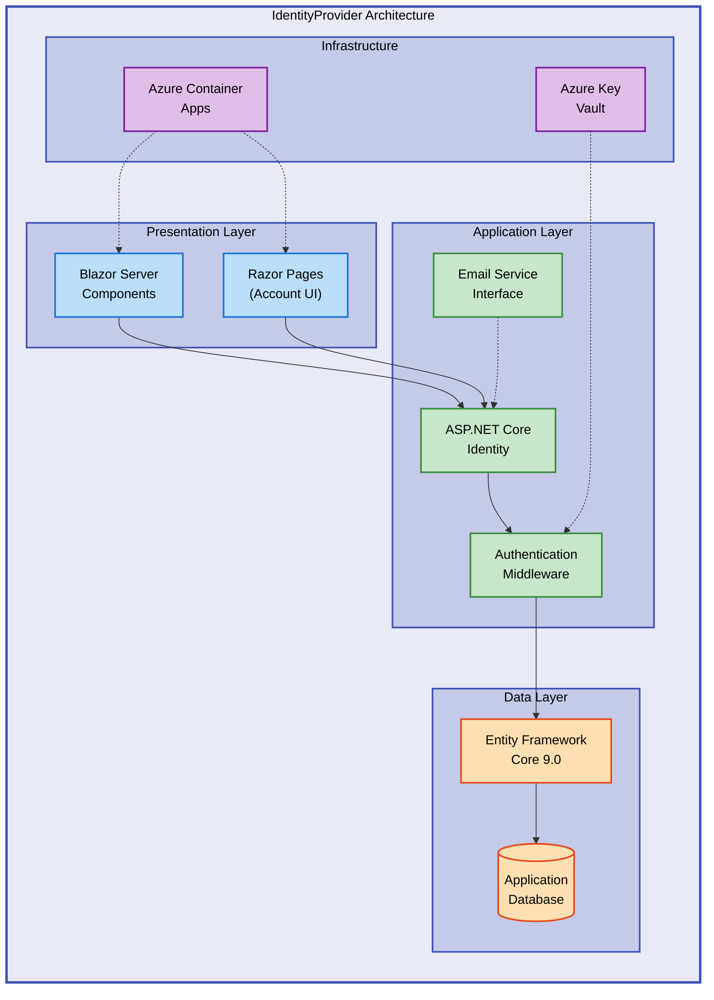

# IdentityProvider


A modern identity and authentication provider built with Blazor Server and ASP.NET Core Identity, designed for secure user management and application registration workflows.

**Overview**

IdentityProvider is a comprehensive authentication solution that leverages ASP.NET Core Identity with Entity Framework Core for robust user management. The application provides a secure foundation for managing user identities, application registrations, and authentication flows in modern web applications. Built on .NET 9.0 with Blazor Server for interactive UI components, it offers a production-ready authentication system with support for Azure Container Apps deployment.

The project emphasizes security best practices including secure credential storage, token-based authentication, and configurable identity requirements. It includes automated database migrations, email verification workflows, and extensible user profile management. The architecture supports both development scenarios with SQLite and production deployments with SQL Server, making it adaptable to various infrastructure requirements.

This solution is ideal for organizations needing a customizable identity provider that can be easily integrated into existing .NET ecosystems while maintaining enterprise-grade security standards and Azure cloud compatibility.

## 🚀 Quick Start

```bash
# Clone the repository
git clone https://github.com/Evilazaro/IdentityProvider.git
cd IdentityProvider

# Run the application
dotnet run --project src/IdentityProvider
```

The application will be available at `https://localhost:5001` (or the port specified in [launchSettings.json](src/IdentityProvider/Properties/launchSettings.json)).

## 📦 Deployment

> ⚠️ **Prerequisites**: .NET 9.0 SDK or later is required. Download from [dotnet.microsoft.com](https://dotnet.microsoft.com/download/dotnet/9.0).

### Local Development

1. **Install dependencies**:

   ```bash
   dotnet restore
   ```

2. **Update database** (applies migrations automatically in development):

   ```bash
   dotnet ef database update --project src/IdentityProvider
   ```

3. **Run the application**:

   ```bash
   dotnet run --project src/IdentityProvider
   ```

4. **Run tests**:
   ```bash
   dotnet test
   ```

### Azure Deployment

> 💡 **Tip**: This project includes Azure Developer CLI (azd) configuration for one-command deployment.

```bash
# Install Azure Developer CLI
winget install microsoft.azd

# Login to Azure
azd auth login

# Provision and deploy
azd up
```

The application will be deployed to Azure Container Apps with all required infrastructure provisioned via Bicep templates in the [infra/](infra/) directory.

## 💻 Usage

### User Registration and Authentication

```csharp
// Example: Accessing authenticated user information in a Blazor component
@page "/profile"
@using Microsoft.AspNetCore.Authorization
@attribute [Authorize]

<h3>Welcome, @context.User.Identity?.Name!</h3>

@code {
    [CascadingParameter]
    private Task<AuthenticationState>? authenticationStateTask { get; set; }
}
```

**Expected Output**: Displays the authenticated user's name on the profile page.

### Application Registration

Navigate to the App Registration page to register OAuth/OIDC client applications. The form captures:

- Client ID and Secret
- Tenant ID
- Redirect URIs
- Required scopes
- Application name

## ✨ Features

**Overview**

IdentityProvider delivers a complete authentication and identity management solution with a focus on security, scalability, and developer experience. The feature set encompasses user lifecycle management from registration through authentication and profile updates, with built-in support for multi-tenant application scenarios. Each feature is designed with production readiness in mind, incorporating industry best practices for secure credential handling, session management, and compliance with modern authentication standards.

The platform provides both end-user facing capabilities for account management and administrative features for application registration and configuration. The modular architecture allows organizations to customize authentication flows, extend user profiles, and integrate with existing identity systems while maintaining a secure and maintainable codebase.

| Feature                         | Description                                                                                                                                         | Benefits                                                                                                                     |
| ------------------------------- | --------------------------------------------------------------------------------------------------------------------------------------------------- | ---------------------------------------------------------------------------------------------------------------------------- |
| 🔐 **ASP.NET Core Identity**    | Full-featured user authentication and authorization system with password hashing, two-factor authentication support, and secure session management. | Industry-standard security practices built-in, reduces development time, and provides extensible user management foundation. |
| 📝 **Application Registration** | Manage OAuth/OIDC client applications with configurable redirect URIs, scopes, and tenant isolation.                                                | Enables multi-tenant scenarios, simplifies client app onboarding, and provides centralized credential management.            |
| 💾 **Entity Framework Core**    | Database-first approach with automated migrations using EF Core 9.0, supporting SQLite (development) and SQL Server (production).                   | Simplified database management, type-safe queries, and seamless schema evolution with migration scripts.                     |
| 🎨 **Blazor Server UI**         | Interactive server-side rendered UI components with real-time updates and component-based architecture.                                             | Rich user experience without complex JavaScript frameworks, server-side security validation, and reduced client payload.     |
| ☁️ **Azure Ready**              | Pre-configured for Azure Container Apps deployment with Bicep infrastructure templates and Azure Developer CLI integration.                         | One-command deployment, infrastructure as code, and optimized for cloud-native scaling and monitoring.                       |
| ✉️ **Email Integration**        | Extensible email sender interface for account verification, password resets, and notification workflows.                                            | Configurable email providers, supports transactional email services, and implements secure token-based verification.         |
| 🧪 **Unit Testing**             | MSTest-based test suite covering email validation, user workflows, and core business logic.                                                         | Ensures code quality, enables confident refactoring, and provides regression protection for authentication flows.            |

## 📋 Requirements

**Overview**

The IdentityProvider application is built on the .NET 9.0 platform and requires specific runtime, database, and development tools for successful deployment and operation. The system is designed to run on multiple operating systems including Windows, macOS, and Linux, making it suitable for diverse development and production environments. Database requirements are flexible with SQLite for local development and SQL Server recommended for production deployments, though other Entity Framework Core compatible databases can be configured.

For Azure deployments, an active Azure subscription is necessary along with appropriate permissions to create resources such as Container Apps, SQL Databases, and Key Vaults. Development environments benefit from Visual Studio 2022+ or Visual Studio Code with C# extension for optimal debugging and tooling support. The lightweight SQLite database enables developers to quickly set up local environments without external database dependencies.

| Category             | Requirements                                        | More Information                                                  |
| -------------------- | --------------------------------------------------- | ----------------------------------------------------------------- |
| **Runtime**          | .NET 9.0 SDK or later                               | [Download .NET](https://dotnet.microsoft.com/download/dotnet/9.0) |
| **Database**         | SQLite (development), SQL Server 2019+ (production) | [SQL Server](https://www.microsoft.com/sql-server)                |
| **Development**      | Visual Studio 2022+ or VS Code with C# extension    | [Visual Studio](https://visualstudio.microsoft.com/)              |
| **Azure (Optional)** | Azure subscription, Azure CLI, Azure Developer CLI  | [Azure Portal](https://portal.azure.com)                          |
| **Operating System** | Windows 10+, macOS 12+, or Linux (Ubuntu 20.04+)    | Cross-platform support via .NET                                   |

## 🔧 Configuration

**Overview**

IdentityProvider uses ASP.NET Core's configuration system with support for environment-specific settings, user secrets, and environment variables. Configuration follows a hierarchical approach where `appsettings.json` provides base settings, `appsettings.Development.json` overrides for local development, and environment variables or Azure Key Vault for production secrets. The application automatically applies database migrations in development mode but requires manual migration execution in production for safety.

Connection strings support multiple database providers through Entity Framework Core's provider model. The SQLite provider is pre-configured for development with automatic database creation, while production deployments should configure SQL Server or Azure SQL Database connection strings. Identity configuration options including password policies, lockout settings, and email verification requirements can be customized in [Program.cs](src/IdentityProvider/Program.cs) or through configuration files.

### Environment Variables

```bash
# Database configuration
ConnectionStrings__DefaultConnection="Data Source=identityprovider.db"

# Identity options (optional, defaults shown)
Identity__SignIn__RequireConfirmedAccount=true
Identity__Password__RequireDigit=true
Identity__Password__RequireLowercase=true
Identity__Password__RequireUppercase=true
Identity__Password__RequireNonAlphanumeric=true
Identity__Password__RequiredLength=6

# Azure-specific (for production)
AZURE_SQL_CONNECTION_STRING="Server=tcp:yourserver.database.windows.net,1433;Database=identitydb;..."
```

### Configuration Files

**Development** ([appsettings.Development.json](src/IdentityProvider/appsettings.Development.json)):

```json
{
  "ConnectionStrings": {
    "DefaultConnection": "Data Source=identityprovider.db"
  },
  "Logging": {
    "LogLevel": {
      "Default": "Information",
      "Microsoft.AspNetCore": "Warning"
    }
  }
}
```

**User Secrets** (for sensitive development data):

```bash
# Initialize user secrets
dotnet user-secrets init --project src/IdentityProvider

# Set secrets
dotnet user-secrets set "ConnectionStrings:DefaultConnection" "YourConnectionString"
```

> ℹ️ **Important**: Never commit sensitive credentials to source control. Use user secrets for development and Azure Key Vault for production.

## 🏗️ Architecture



**Key Components**:

- **Blazor Server**: Interactive UI with real-time server communication
- **ASP.NET Core Identity**: User authentication and authorization
- **Entity Framework Core**: Database abstraction with migrations
- **Azure Container Apps**: Cloud-native hosting platform

## 🤝 Contributing

**Overview**

We welcome contributions from the community to help improve IdentityProvider. Whether you're fixing bugs, improving documentation, or proposing new features, your input is valuable. The contribution process emphasizes code quality, security best practices, and maintainability. All contributions should align with the project's goals of providing a secure, production-ready identity management solution.

Before submitting significant changes, please open an issue to discuss your proposed modifications. This helps ensure your contribution aligns with project direction and prevents duplicate efforts. All pull requests should include appropriate tests, follow the existing code style, and update documentation as needed.

Contributions should:

1. Fork the repository and create a feature branch
2. Write clear commit messages describing changes
3. Include unit tests for new functionality
4. Update documentation to reflect changes
5. Ensure all tests pass before submitting PR
6. Follow security best practices for authentication code

## 📝 License

MIT License - see [LICENSE](LICENSE) file for details.

Copyright (c) 2025 Evilázaro Alves
