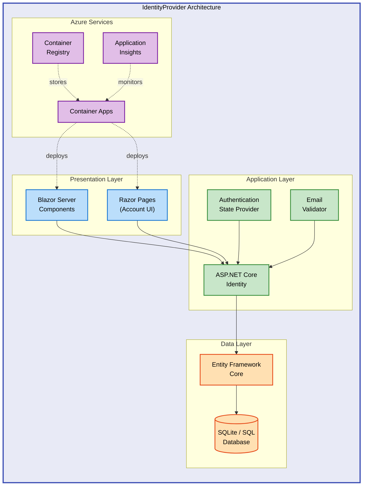

# IdentityProvider


A modern ASP.NET Core Blazor Server application providing secure user authentication and identity management with Azure deployment support.

This project implements ASP.NET Core Identity with Entity Framework Core, offering user registration, login, email validation, and session management. Built with Blazor Server components, it provides a responsive UI with real-time authentication state management and deploys seamlessly to Azure Container Apps using Infrastructure as Code.

## Table of Contents

- [Quick Start](#-quick-start)
- [Deployment](#-deployment)
- [Usage](#-usage)
- [Features](#-features)
- [Requirements](#-requirements)
- [Configuration](#-configuration)
- [Architecture](#-architecture)
- [Contributing](#-contributing)
- [License](#-license)

## 🚀 Quick Start

Clone the repository and run the application locally:

```bash
git clone https://github.com/Evilazaro/IdentityProvider.git
cd IdentityProvider
dotnet run --project src/IdentityProvider
```

The application starts at `https://localhost:5001` with automatic database migrations applied in development mode.

## 📦 Deployment

### Prerequisites

- [.NET 9.0 SDK](https://dotnet.microsoft.com/download/dotnet/9.0)
- [Azure CLI](https://docs.microsoft.com/cli/azure/install-azure-cli) (for Azure deployment)
- [Azure Developer CLI (azd)](https://learn.microsoft.com/azure/developer/azure-developer-cli/install-azd)

### Local Development

1. **Restore dependencies:**

```bash
dotnet restore
```

2. **Apply database migrations:**

```bash
dotnet ef database update --project src/IdentityProvider
```

> 💡 **Tip**: In development mode, migrations apply automatically on application startup.

3. **Run the application:**

```bash
dotnet run --project src/IdentityProvider
```

4. **Run tests:**

```bash
dotnet test
```

### Azure Deployment

Deploy to Azure Container Apps using Azure Developer CLI:

```bash
azd auth login
azd up
```

> ⚠️ **Prerequisites**: Ensure you have Contributor access to the target Azure subscription.

This command provisions Azure resources (Container Apps, Container Registry, Log Analytics, Application Insights) and deploys the application. Infrastructure is defined in [`infra/main.bicep`](infra/main.bicep) and [`infra/resources.bicep`](infra/resources.bicep).

## 💻 Usage

### User Registration

Navigate to `/Account/Register` and create a new account with email and password:

```csharp
// Email validation example from eMail.cs
var emailChecker = new eMail();
bool isValid = emailChecker.checkEmail("user@example.com"); // Returns true
```

**Valid email domains**: `example.com`, `test.com`

### Authentication Flow

1. User registers with email and password
2. Account confirmation required (configured in [`Program.cs`](src/IdentityProvider/Program.cs))
3. User logs in to access protected pages
4. Session managed via ASP.NET Core Identity cookies

### Expected Output

After successful login, users access protected Blazor components with authentication state:

- `/` - Home page (public)
- `/counter` - Protected counter page
- `/weather` - Protected weather data page
- `/Account/Manage` - User profile management

## ✨ Features

Modern identity management with enterprise-grade security and Azure cloud integration.

| Feature                        | Description                                                                                       | Benefits                                                                  |
| ------------------------------ | ------------------------------------------------------------------------------------------------- | ------------------------------------------------------------------------- |
| ASP.NET Core Identity          | Built-in authentication system with user management, password hashing, and security token service | Industry-standard security with minimal configuration required            |
| Blazor Server Components       | Interactive UI with real-time updates using SignalR                                               | Responsive user experience without complex JavaScript frameworks          |
| Entity Framework Core          | Code-first database migrations with SQLite (dev) and SQL Server (production) support              | Type-safe data access with automatic schema management                    |
| Email Validation               | Custom email domain validation with extensible rule engine                                        | Control user registration with configurable domain whitelisting           |
| Azure Container Apps           | Serverless container deployment with automatic scaling                                            | Cost-effective hosting with built-in HTTPS, load balancing, and logging   |
| Infrastructure as Code (Bicep) | Declarative Azure resource provisioning with versioned templates                                  | Reproducible deployments with automated resource management and rollbacks |

## 📋 Requirements

System requirements and runtime dependencies for development and production environments.

| Category         | Requirements                                                                  | More Information                                                                                    |
| ---------------- | ----------------------------------------------------------------------------- | --------------------------------------------------------------------------------------------------- |
| Runtime          | .NET 9.0 SDK or later                                                         | [Download .NET](https://dotnet.microsoft.com/download)                                              |
| System           | Windows 10+, macOS 12+, or Linux with .NET support                            | [.NET Supported OS](https://github.com/dotnet/core/blob/main/release-notes/9.0/supported-os.md)     |
| Database         | SQLite 3.x (development), SQL Server 2019+ or Azure SQL (production)          | [EF Core Database Providers](https://learn.microsoft.com/ef/core/providers)                         |
| Dependencies     | See [`IdentityProvider.csproj`](src/IdentityProvider/IdentityProvider.csproj) | Microsoft.AspNetCore.Identity.EntityFrameworkCore 9.0.3, Microsoft.EntityFrameworkCore.Sqlite 9.0.4 |
| Azure (optional) | Azure subscription with Container Apps and Container Registry                 | [Azure Free Account](https://azure.microsoft.com/free/)                                             |

## 🔧 Configuration

Configure application settings using `appsettings.json` and environment variables.

### Connection Strings

Update [`appsettings.json`](src/IdentityProvider/appsettings.json) with your database connection:

```json
{
  "ConnectionStrings": {
    "DefaultConnection": "Data Source=identityProviderDB.db;"
  }
}
```

For production with SQL Server:

```json
{
  "ConnectionStrings": {
    "DefaultConnection": "Server=tcp:yourserver.database.windows.net,1433;Database=identitydb;User ID=admin;Password=YourPassword;Encrypt=True;"
  }
}
```

### Environment Variables

Azure Container Apps automatically inject these variables (defined in [`infra/resources.bicep`](infra/resources.bicep)):

```bash
APPLICATIONINSIGHTS_CONNECTION_STRING=InstrumentationKey=xxx
AZURE_CLIENT_ID=managed-identity-client-id
PORT=8080
```

### Email Validation Rules

Customize allowed email domains in [`src/IdentityProvider/Components/eMail.cs`](src/IdentityProvider/Components/eMail.cs):

```csharp
string[] validDomains = { "example.com", "test.com", "yourdomain.com" };
```

### Identity Options

Modify identity settings in [`Program.cs`](src/IdentityProvider/Program.cs):

```csharp
builder.Services.AddIdentityCore<ApplicationUser>(options =>
{
    options.SignIn.RequireConfirmedAccount = true; // Email confirmation required
    options.Password.RequireDigit = true;
    options.Password.RequiredLength = 8;
    options.Password.RequireNonAlphanumeric = true;
});
```

## 🏗️ Architecture

The application follows a multi-tier architecture with Azure cloud services integration.



**Key Components:**

- **Presentation Layer**: Blazor Server components with real-time UI updates via SignalR
- **Application Layer**: ASP.NET Core Identity handles authentication, authorization, and session management
- **Data Layer**: Entity Framework Core with code-first migrations for database operations
- **Azure Services**: Containerized deployment with monitoring and logging

## 🤝 Contributing

Contributions are welcome! Please follow these guidelines:

1. Fork the repository
2. Create a feature branch (`git checkout -b feature/amazing-feature`)
3. Commit your changes (`git commit -m 'Add amazing feature'`)
4. Push to the branch (`git push origin feature/amazing-feature`)
5. Open a Pull Request

Ensure all tests pass before submitting:

```bash
dotnet test
```

## 📝 License

This project is licensed under the MIT License - see the [`LICENSE`](LICENSE) file for details.

Copyright (c) 2025 Evilázaro Alves
