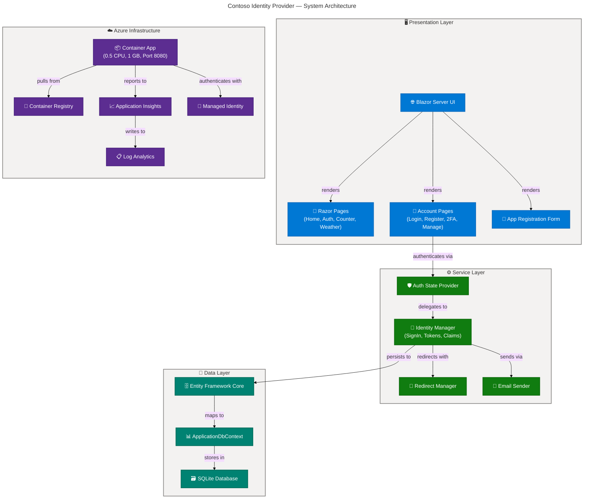

# Contoso Identity Provider

[](https://dotnet.microsoft.com/)
[](https://learn.microsoft.com/aspnet/core/blazor/)
[](https://azure.microsoft.com/products/container-apps)
[](https://learn.microsoft.com/ef/core/)
[](LICENSE)

A modern identity management and authentication platform built with **ASP.NET Core 9.0**, **Blazor Server**, and **ASP.NET Core Identity**. It provides a complete, production-ready authentication system with user registration, login, two-factor authentication, account management, and OAuth/OIDC application registration — deployable to **Azure Container Apps** via the Azure Developer CLI (`azd`).

> [!NOTE]
> This project targets **.NET 9.0** and uses **SQLite** as the default database for local development. For production deployments, consider migrating to Azure SQL or PostgreSQL.

## Table of Contents

- [Features](#features)
- [Architecture](#architecture)
- [Prerequisites](#prerequisites)
- [Getting Started](#getting-started)
- [Project Structure](#project-structure)
- [Configuration](#configuration)
- [Testing](#testing)
- [Deployment](#deployment)
- [Contributing](#contributing)
- [License](#license)

## Features

**Overview**

Contoso Identity Provider delivers a full-featured identity platform that handles the complete authentication lifecycle — from user registration and email confirmation through multi-factor authentication and account recovery. It also supports OAuth/OIDC application registration for third-party integrations.

| Category               | Feature                     | Description                                                                       |
| ---------------------- | --------------------------- | --------------------------------------------------------------------------------- |
| **Authentication**     | Email & Password Login      | Standard credential-based sign-in with confirmed email requirement                |
| **Authentication**     | Two-Factor Authentication   | TOTP authenticator app support with recovery codes                                |
| **Authentication**     | External Login Providers    | Pluggable external authentication (Google, Microsoft, etc.)                       |
| **Registration**       | User Registration           | Self-service registration with email confirmation flow                            |
| **Registration**       | OAuth/OIDC App Registration | Register external applications with client credentials, scopes, and redirect URIs |
| **Account Management** | Password Reset              | Self-service password recovery via email                                          |
| **Account Management** | Email Change                | Update email address with re-confirmation                                         |
| **Account Management** | Personal Data Export        | Download all stored personal data (GDPR compliance)                               |
| **Account Management** | Account Deletion            | Self-service account deletion                                                     |
| **Security**           | Account Lockout             | Automatic lockout after failed login attempts                                     |
| **Security**           | Anti-forgery Tokens         | Built-in CSRF protection via `UseAntiforgery()`                                   |
| **Security**           | HTTPS Enforcement           | HSTS and HTTPS redirection in production                                          |
| **Infrastructure**     | Azure Container Apps        | Containerized deployment with auto-scaling (1-10 replicas)                        |
| **Infrastructure**     | Application Insights        | Integrated telemetry and monitoring                                               |

> [!TIP]
> The OAuth/OIDC application registration feature (`AppRegistration`) allows you to register external applications that authenticate through this identity provider, enabling single sign-on (SSO) across your application ecosystem.

## Architecture


```mermaid
---
title: "Contoso Identity Provider — System Architecture"
config:
  theme: base
  look: classic
  layout: dagre
  flowchart:
    htmlLabels: true
---
flowchart TD
    accTitle: Contoso Identity Provider System Architecture
    accDescr: Shows the layered architecture from user-facing Blazor UI through authentication services to data storage and Azure deployment infrastructure

    subgraph presentation["🖥️ Presentation Layer"]
        direction TB
        blazor["🌐 Blazor Server UI"]:::core
        pages["📄 Razor Pages<br/>(Home, Auth, Counter, Weather)"]:::core
        accountUI["🔐 Account Pages<br/>(Login, Register, 2FA, Manage)"]:::core
        appRegForm["📝 App Registration Form"]:::core
    end

    subgraph services["⚙️ Service Layer"]
        direction TB
        authState["🛡️ Auth State Provider"]:::process
        identityMgr["👤 Identity Manager<br/>(SignIn, Tokens, Claims)"]:::process
        redirectMgr["🔀 Redirect Manager"]:::process
        emailSender["📧 Email Sender"]:::process
    end

    subgraph data["💾 Data Layer"]
        direction TB
        efCore["🗄️ Entity Framework Core"]:::data
        dbContext["📊 ApplicationDbContext"]:::data
        sqlite["🗃️ SQLite Database"]:::data
    end

    subgraph azure["☁️ Azure Infrastructure"]
        direction TB
        containerApp["📦 Container App<br/>(0.5 CPU, 1 GB, Port 8080)"]:::infra
        acr["🐳 Container Registry"]:::infra
        appInsights["📈 Application Insights"]:::infra
        logAnalytics["📋 Log Analytics"]:::infra
        managedId["🔑 Managed Identity"]:::infra
    end

    blazor -->|"renders"| pages
    blazor -->|"renders"| accountUI
    blazor -->|"renders"| appRegForm
    accountUI -->|"authenticates via"| authState
    authState -->|"delegates to"| identityMgr
    identityMgr -->|"redirects with"| redirectMgr
    identityMgr -->|"sends via"| emailSender
    identityMgr -->|"persists to"| efCore
    efCore -->|"maps to"| dbContext
    dbContext -->|"stores in"| sqlite
    containerApp -->|"pulls from"| acr
    containerApp -->|"reports to"| appInsights
    appInsights -->|"writes to"| logAnalytics
    containerApp -->|"authenticates with"| managedId

    style presentation fill:#F3F2F1,stroke:#8A8886,stroke-width:2px,color:#323130
    style services fill:#F3F2F1,stroke:#8A8886,stroke-width:2px,color:#323130
    style data fill:#F3F2F1,stroke:#8A8886,stroke-width:2px,color:#323130
    style azure fill:#F3F2F1,stroke:#8A8886,stroke-width:2px,color:#323130

    classDef core fill:#0078D4,stroke:#106EBE,stroke-width:2px,color:#FFFFFF
    classDef process fill:#107C10,stroke:#0B6A0B,stroke-width:2px,color:#FFFFFF
    classDef data fill:#008272,stroke:#006D5B,stroke-width:2px,color:#FFFFFF
    classDef infra fill:#5C2D91,stroke:#4B2380,stroke-width:2px,color:#FFFFFF
    classDef neutral fill:#F5F5F5,stroke:#616161,stroke-width:2px,color:#323130
```

**Component Responsibilities:**

| Layer          | Component             | Responsibility                                        | Source                                               |
| -------------- | --------------------- | ----------------------------------------------------- | ---------------------------------------------------- |
| Presentation   | Blazor Server UI      | Interactive server-side rendering with SignalR        | `Program.cs`                                         |
| Presentation   | Account Pages         | Full authentication UI (Login, Register, 2FA, Manage) | `Components/Account/Pages/`                          |
| Presentation   | App Registration Form | OAuth/OIDC application registration interface         | `Components/Pages/AppRegistrationForm.razor`         |
| Service        | Auth State Provider   | Revalidates authentication state on each circuit      | `IdentityRevalidatingAuthenticationStateProvider.cs` |
| Service        | Identity Manager      | ASP.NET Core Identity (sign-in, tokens, claims)       | `Program.cs`                                         |
| Data           | ApplicationDbContext  | EF Core context inheriting from `IdentityDbContext`   | `Data/ApplicationDbContext.cs`                       |
| Data           | SQLite                | Local file-based database (`identityProviderDB.db`)   | `appsettings.json`                                   |
| Infrastructure | Container App         | Azure Container Apps with 0.5 CPU, 1 GB memory        | `infra/resources.bicep`                              |

## Prerequisites

| Requirement                                                                                        | Version | Purpose                                          |
| -------------------------------------------------------------------------------------------------- | ------- | ------------------------------------------------ |
| [.NET SDK](https://dotnet.microsoft.com/download)                                                  | 9.0+    | Build and run the application                    |
| [Azure Developer CLI](https://learn.microsoft.com/azure/developer/azure-developer-cli/install-azd) | Latest  | Deploy to Azure (optional)                       |
| [Docker](https://www.docker.com/get-started)                                                       | Latest  | Container builds for Azure deployment (optional) |

> [!WARNING]
> Ensure you have the **.NET 9.0 SDK** installed. Earlier SDK versions will not build this project. Verify your version with `dotnet --version`.

## Getting Started

### 1. Clone the Repository

```bash
git clone https://github.com/Evilazaro/IdentityProvider.git
cd IdentityProvider
```

### 2. Restore Dependencies

```bash
dotnet restore
```

### 3. Run the Application

```bash
dotnet run --project src/IdentityProvider
```

The application starts and listens on:

- **HTTPS**: `https://localhost:7223`
- **HTTP**: `http://localhost:5244`

### 4. Open in Browser

Navigate to `https://localhost:7223` to access the Identity Provider home page. Register a new account to explore the authentication features.

**Expected output:**

```text
info: Microsoft.Hosting.Lifetime[14]
      Now listening on: https://localhost:7223
info: Microsoft.Hosting.Lifetime[14]
      Now listening on: http://localhost:5244
info: Microsoft.Hosting.Lifetime[0]
      Application started. Press Ctrl+C to shut out.
```

> [!NOTE]
> On first run in development mode, Entity Framework Core automatically applies pending migrations and creates the SQLite database file `identityProviderDB.db`.

## Project Structure

```text
IdentityProvider/
├── azure.yaml                          # Azure Developer CLI manifest
├── IdentityProvider.sln                # Solution file
├── infra/                              # Azure Bicep infrastructure templates
│   ├── main.bicep                      # Root deployment (subscription scope)
│   ├── main.parameters.json            # Environment parameters
│   ├── resources.bicep                 # Azure resource definitions
│   └── modules/
│       └── fetch-container-image.bicep # Container image lookup
├── src/
│   ├── IdentityProvider/               # Main web application
│   │   ├── Program.cs                  # Application entry point & service configuration
│   │   ├── IdentityProvider.csproj     # Project file (.NET 9.0)
│   │   ├── Components/
│   │   │   ├── App.razor               # Root HTML document shell
│   │   │   ├── Routes.razor            # Route config with auth guards
│   │   │   ├── AppRegistration.cs      # OAuth/OIDC app registration model
│   │   │   ├── eMail.cs                # Email validation utility
│   │   │   ├── Layout/                 # MainLayout and NavMenu components
│   │   │   ├── Pages/                  # Application pages (Home, Auth, Counter, Weather)
│   │   │   └── Account/               # Authentication pages and shared components
│   │   │       ├── Pages/             # Login, Register, 2FA, Password Reset, etc.
│   │   │       ├── Pages/Manage/      # Account settings (Password, Email, 2FA, Data)
│   │   │       └── Shared/            # AccountLayout, ManageNavMenu, StatusMessage
│   │   ├── Data/
│   │   │   ├── ApplicationDbContext.cs # EF Core database context
│   │   │   └── ApplicationUser.cs      # Custom Identity user model
│   │   ├── Migrations/                 # EF Core database migrations
│   │   └── wwwroot/                    # Static assets (CSS, Bootstrap, favicon)
│   └── identityProviderTests/          # Unit test project (MSTest)
│       ├── eMailTests.cs               # Email validation tests
│       └── Test1.cs                    # Placeholder test
```

## Configuration

Application settings are defined in `appsettings.json`:

```json
{
  "ConnectionStrings": {
    "DefaultConnection": "Data Source=identityProviderDB.db;"
  },
  "Logging": {
    "LogLevel": {
      "Default": "Information",
      "Microsoft.AspNetCore": "Warning"
    }
  },
  "AllowedHosts": "*"
}
```

| Setting                               | Value                                | Description                                   |
| ------------------------------------- | ------------------------------------ | --------------------------------------------- |
| `ConnectionStrings:DefaultConnection` | `Data Source=identityProviderDB.db;` | SQLite database file path                     |
| `Logging:LogLevel:Default`            | `Information`                        | Default logging verbosity                     |
| `AllowedHosts`                        | `*`                                  | Allowed host headers (restrict in production) |

**User Secrets** are supported for sensitive configuration. The project is pre-configured with the User Secrets ID `aspnet-IdentityProvider-f99f5be1-3749-4889-aa7a-f8105c053e60`. Manage secrets with:

```bash
dotnet user-secrets set "Key" "Value" --project src/IdentityProvider
```

## Testing

The project uses **MSTest** with parallel execution enabled at the method level.

### Run Tests

```bash
dotnet test
```

**Expected output:**

```text
Passed!  - Failed:  0, Passed:  2, Skipped:  0, Total:  2
```

### Test Coverage

| Test Class   | Tests | Description                                                             |
| ------------ | ----- | ----------------------------------------------------------------------- |
| `eMailTests` | 6     | Validates email format and domain whitelist (`example.com`, `test.com`) |
| `Test1`      | 1     | Placeholder for future test expansion                                   |

## Deployment

This project is configured for deployment to **Azure Container Apps** using the [Azure Developer CLI (`azd`)](https://learn.microsoft.com/azure/developer/azure-developer-cli/).

### Azure Resources Provisioned

| Resource                       | Purpose                                                    |
| ------------------------------ | ---------------------------------------------------------- |
| **Resource Group**             | Logical container for all resources                        |
| **Container Registry**         | Stores Docker images for the application                   |
| **Container Apps Environment** | Managed Kubernetes hosting environment                     |
| **Container App**              | Runs the application (0.5 CPU, 1 GB memory, 1-10 replicas) |
| **Application Insights**       | Telemetry, logging, and performance monitoring             |
| **Log Analytics Workspace**    | Centralized log aggregation                                |
| **Managed Identity**           | Passwordless authentication between Azure services         |

### Deploy to Azure

```bash
azd auth login
azd up
```

The `azd up` command provisions all Azure infrastructure defined in `infra/main.bicep` and deploys the containerized application. You will be prompted for:

- **Environment name** — used as a prefix for resource names
- **Azure location** — the Azure region for deployment

### Infrastructure Parameters

| Parameter         | Source                 | Description                         |
| ----------------- | ---------------------- | ----------------------------------- |
| `environmentName` | `AZURE_ENV_NAME`       | Prefix for all Azure resource names |
| `location`        | `AZURE_LOCATION`       | Target Azure region                 |
| `principalId`     | `AZURE_PRINCIPAL_ID`   | Identity for RBAC role assignments  |
| `principalType`   | `AZURE_PRINCIPAL_TYPE` | `User` or `ServicePrincipal`        |

## Contributing

Contributions are welcome. To contribute:

1. Fork the repository
2. Create a feature branch (`git checkout -b feature/your-feature`)
3. Commit your changes (`git commit -m "Add your feature"`)
4. Push to the branch (`git push origin feature/your-feature`)
5. Open a Pull Request

Please ensure all tests pass before submitting:

```bash
dotnet test
```

## License

This project is licensed under the **MIT License**. See the [LICENSE](LICENSE) file for details.

© 2025 Evilázaro Alves
