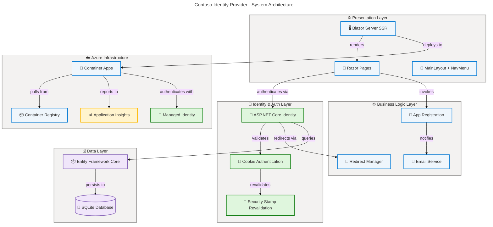

# Contoso Identity Provider


A **digital identity management platform** built with ASP.NET Core Blazor Server that provides **user authentication, authorization, and OAuth/OIDC application registration** capabilities, deployable to **Azure Container Apps** with one command.

## 📖 Overview

**Overview**

Contoso Identity Provider is a **production-ready identity management solution** for organizations that need **centralized authentication and application registration services**. Built on **ASP.NET Core Identity** with **Blazor Server interactive SSR**, it delivers a complete authentication experience including user registration, login, password recovery, email confirmation, two-factor authentication, and external login provider support.

The platform uses a **Code-First Entity Framework Core** approach with SQLite for data persistence, Razor Components for the server-rendered UI, and Azure Container Apps for scalable cloud hosting. Infrastructure is **fully defined as code** using **Azure Bicep** with **Azure Verified Modules (AVM)**, enabling repeatable deployments via the **Azure Developer CLI** (`azd`).

## 📑 Table of Contents

- [Overview](#-overview)
- [Architecture](#️-architecture)
- [Features](#-features)
- [Requirements](#-requirements)
- [Quick Start](#-quick-start)
- [Deployment](#-deployment)
- [Usage](#-usage)
- [Configuration](#️-configuration)
- [Contributing](#-contributing)
- [License](#-license)

## 🏗️ Architecture

**Overview**

The system follows a **layered Blazor Server SSR architecture** with ASP.NET Core Identity managing authentication state, Entity Framework Core handling data access via SQLite, and Azure Container Apps providing cloud hosting. This separation ensures that presentation, business logic, and data access concerns remain **independently maintainable**.

The architecture uses **cascading authentication state** with **30-minute security stamp revalidation** on active SignalR circuits, **cookie-based session management**, and **anti-forgery middleware**. Infrastructure provisioning leverages Azure Verified Modules for Container Registry, Container Apps Environment, Application Insights monitoring, and **User-Assigned Managed Identity** for secure ACR image pulls.


```mermaid
---
title: "Contoso Identity Provider - System Architecture"
config:
  theme: base
  look: classic
  layout: dagre
  flowchart:
    htmlLabels: true
---
flowchart TB
    accTitle: Contoso Identity Provider System Architecture
    accDescr: Shows the layered architecture of the Identity Provider including Blazor UI, Identity services, data layer, and Azure deployment infrastructure

    %% ═══════════════════════════════════════════════════════════════════════════
    %% AZURE / FLUENT ARCHITECTURE PATTERN v1.1
    %% (Semantic + Structural + Font + Accessibility Governance)
    %% ═══════════════════════════════════════════════════════════════════════════
    %% PHASE 1 - FLUENT UI: All styling uses approved Fluent UI palette only
    %% PHASE 2 - GROUPS: Every subgraph has semantic color via style directive
    %% PHASE 3 - COMPONENTS: Every node has semantic classDef + icon prefix
    %% PHASE 4 - ACCESSIBILITY: accTitle/accDescr present, WCAG AA contrast
    %% PHASE 5 - STANDARD: Governance block present, classDefs centralized
    %% ═══════════════════════════════════════════════════════════════════════════

    subgraph presentation["🌐 Presentation Layer"]
        direction LR
        blazor["🖥️ Blazor Server SSR"]:::core
        pages["📄 Razor Pages"]:::core
        layout["🎨 MainLayout + NavMenu"]:::core
    end

    subgraph identity["🔐 Identity & Auth Layer"]
        direction LR
        auth["🔑 ASP.NET Core Identity"]:::success
        cookie["🍪 Cookie Authentication"]:::success
        revalidate["🔄 Security Stamp Revalidation"]:::success
    end

    subgraph business["⚙️ Business Logic Layer"]
        direction LR
        registration["📝 App Registration"]:::core
        email["📧 Email Service"]:::core
        redirect["🔀 Redirect Manager"]:::core
    end

    subgraph data["🗄️ Data Layer"]
        direction LR
        efcore["📦 Entity Framework Core"]:::data
        sqlite[("💾 SQLite Database")]:::data
    end

    subgraph azure["☁️ Azure Infrastructure"]
        direction LR
        aca["🐳 Container Apps"]:::core
        acr["📦 Container Registry"]:::core
        monitor["📊 Application Insights"]:::warning
        mi["🔐 Managed Identity"]:::success
    end

    blazor -->|"renders"| pages
    pages -->|"authenticates via"| auth
    auth -->|"validates"| cookie
    cookie -->|"revalidates"| revalidate
    pages -->|"invokes"| registration
    registration -->|"notifies"| email
    auth -->|"redirects via"| redirect
    auth -->|"queries"| efcore
    efcore -->|"persists to"| sqlite
    blazor -->|"deploys to"| aca
    aca -->|"pulls from"| acr
    aca -->|"reports to"| monitor
    aca -->|"authenticates with"| mi

    style presentation fill:#F3F2F1,stroke:#8A8886,stroke-width:2px,color:#323130
    style identity fill:#F3F2F1,stroke:#8A8886,stroke-width:2px,color:#323130
    style business fill:#F3F2F1,stroke:#8A8886,stroke-width:2px,color:#323130
    style data fill:#F3F2F1,stroke:#8A8886,stroke-width:2px,color:#323130
    style azure fill:#F3F2F1,stroke:#8A8886,stroke-width:2px,color:#323130

    classDef core fill:#EFF6FC,stroke:#0078D4,stroke-width:2px,color:#323130
    classDef success fill:#DFF6DD,stroke:#107C10,stroke-width:2px,color:#323130
    classDef warning fill:#FFF4CE,stroke:#FFB900,stroke-width:2px,color:#323130
    classDef data fill:#F0E6FA,stroke:#8764B8,stroke-width:2px,color:#323130
```

**Component Roles:**

| Component                      | Layer        | Role                                                              |
| ------------------------------ | ------------ | ----------------------------------------------------------------- |
| 🖥️ Blazor Server SSR           | Presentation | Interactive server-side rendering via SignalR                     |
| 📄 Razor Pages                 | Presentation | Individual account and application pages                          |
| 🔑 ASP.NET Core Identity       | Identity     | User management, password hashing, claims                         |
| 🍪 Cookie Authentication       | Identity     | Session persistence with `ApplicationScheme` and `ExternalScheme` |
| 🔄 Security Stamp Revalidation | Identity     | Validates security stamps every 30 minutes                        |
| 📝 App Registration            | Business     | OAuth/OIDC client application registration                        |
| 📧 Email Service               | Business     | Email validation utility with domain whitelisting                 |
| 📦 Entity Framework Core       | Data         | Code-First ORM with migrations                                    |
| 💾 SQLite                      | Data         | Lightweight embedded relational database                          |
| 🐳 Container Apps              | Azure        | Serverless containerized hosting (port 8080)                      |
| 📊 Application Insights        | Azure        | Telemetry, logging, and performance monitoring                    |

## ✨ Features

**Overview**

Contoso Identity Provider delivers a **comprehensive identity management experience** out of the box. It combines ASP.NET Core Identity's battle-tested authentication framework with Blazor Server's interactive UI capabilities to provide **secure user management** without client-side JavaScript complexity.

The platform supports the full authentication lifecycle — from registration and email confirmation through login, password recovery, two-factor authentication, and external provider integration — alongside OAuth/OIDC application registration for building connected service ecosystems.

| Feature                            | Description                                                                   | Status         |
| ---------------------------------- | ----------------------------------------------------------------------------- | -------------- |
| 🔐 User Authentication             | Cookie-based email and password login with lockout support                    | ✅ Stable      |
| 📝 User Registration               | Self-service account creation with email confirmation                         | ✅ Stable      |
| 🔑 Password Recovery               | Token-based password reset via email with secure reset flows                  | ✅ Stable      |
| 🔒 Two-Factor Authentication       | 2FA redirect flow with recovery code support                                  | ✅ Stable      |
| 🌐 External Login Providers        | Infrastructure for OAuth/OIDC external identity providers                     | ✅ Stable      |
| 📋 App Registration                | OAuth client registration form with ClientId, Secret, Scopes, and Grant Types | 🔄 In Progress |
| 📧 Email Validation                | Domain-restricted email format validation utility                             | ✅ Stable      |
| 🔄 Security Stamp Revalidation     | Automatic 30-minute security stamp validation on active circuits              | ✅ Stable      |
| 🛡️ Anti-Forgery Protection         | Built-in CSRF protection via anti-forgery middleware                          | ✅ Stable      |
| ☁️ Azure Container Apps Deployment | One-command cloud deployment with `azd up`                                    | ✅ Stable      |
| 📊 Application Insights Monitoring | Integrated telemetry and performance monitoring                               | ✅ Stable      |
| 📦 Infrastructure as Code          | Azure Bicep templates with Azure Verified Modules                             | ✅ Stable      |

## 📋 Requirements

**Overview**

Before running the Identity Provider locally or deploying to Azure, **ensure the following tools and services are available** on your development machine. The project targets **.NET 9.0** and uses **Azure Developer CLI** for cloud provisioning.

All Azure infrastructure is defined through Bicep templates, so no manual portal configuration is required beyond having an active subscription with sufficient permissions.

> [!IMPORTANT]
> .NET 9.0 SDK is required. Earlier versions of .NET are not supported due to framework-specific API usage in ASP.NET Core Identity and Blazor components.

| Requirement                    | Version        | Purpose                                                 |
| ------------------------------ | -------------- | ------------------------------------------------------- |
| ⚙️ .NET SDK                    | 9.0 or later   | Build and run the Blazor Server application             |
| 🛠️ Azure Developer CLI (`azd`) | Latest         | Provision and deploy Azure infrastructure               |
| ☁️ Azure Subscription          | Active         | Host Container Apps, Container Registry, and monitoring |
| 📝 Visual Studio / VS Code     | 2022+ / Latest | IDE for development and debugging                       |
| 🐳 Docker                      | Latest         | Build container images for deployment                   |
| 🔧 Git                         | Latest         | Clone the repository                                    |

## 🚀 Quick Start

**Overview**

Get the Identity Provider running locally in minutes. The application uses SQLite, so **no external database setup is required** for local development.

> [!TIP]
> The application automatically applies Entity Framework Core migrations on startup when running in the Development environment, so the database is created and seeded without manual intervention.

**1. Clone the repository**

```bash
git clone https://github.com/Evilazaro/IdentityProvider.git
cd IdentityProvider
```

**Expected output:**

```text
Cloning into 'IdentityProvider'...
remote: Enumerating objects: done.
remote: Counting objects: 100% (X/X), done.
Receiving objects: 100% (X/X), done.
```

**2. Restore dependencies**

```bash
dotnet restore src/IdentityProvider/IdentityProvider.csproj
```

**Expected output:**

```text
  Determining projects to restore...
  Restored z:\IdentityProvider\src\IdentityProvider\IdentityProvider.csproj (in 1.2 sec).
```

**3. Run the application**

```bash
dotnet run --project src/IdentityProvider/IdentityProvider.csproj
```

**Expected output:**

```text
info: Microsoft.Hosting.Lifetime[14]
      Now listening on: https://localhost:7223
info: Microsoft.Hosting.Lifetime[14]
      Now listening on: http://localhost:5244
info: Microsoft.Hosting.Lifetime[0]
      Application started. Press Ctrl+C to shut down.
```

**4. Open in your browser**

Navigate to `https://localhost:7223` to access the Identity Provider landing page.

**5. Run the tests**

```bash
dotnet test src/identityProviderTests/identityProviderTests.csproj
```

**Expected output:**

```text
  Determining projects to restore...
  All projects are up-to-date for restore.
  identityProviderTests -> bin\Debug\net9.0\identityProviderTests.dll
Test run for identityProviderTests.dll (.NETCoreApp,Version=v9.0)
Microsoft (R) Test Execution Command Line Tool
Passed!  - Failed:     0, Passed:     6, Skipped:     0, Total:     6
```

## 📦 Deployment

**Overview**

The Identity Provider deploys to **Azure Container Apps** using the **Azure Developer CLI** (`azd`). The entire infrastructure — Container Registry, Container Apps Environment, Application Insights, and Managed Identity — is **provisioned automatically** through Bicep templates.

> [!WARNING]
> Deploying to Azure will create billable resources in your subscription. The default configuration provisions a Container App with 0.5 CPU and 1.0 GiB RAM, scaling between 1 and 10 replicas. Review the Bicep parameters in `infra/main.parameters.json` before provisioning.

**1. Authenticate with Azure**

```bash
azd auth login
```

**Expected output:**

```text
Logged in to Azure.
```

**2. Initialize the environment**

```bash
azd init
```

**Expected output:**

```text
Initializing an app to run on Azure (azd init)
  (✓) Done: Initialized app

SUCCESS: Your app is ready for the cloud!
```

**3. Provision and deploy**

```bash
azd up
```

**Expected output:**

```text
Packaging services (azd package)
  (✓) Done: Packaging service identity-provider

Provisioning Azure resources (azd provision)
  (✓) Done: Resource group: rg-<environmentName>
  (✓) Done: Container Registry
  (✓) Done: Container Apps Environment
  (✓) Done: Container App: identity-provider
  (✓) Done: Application Insights

Deploying services (azd deploy)
  (✓) Done: Deploying service identity-provider

SUCCESS: Your application was provisioned and deployed to Azure.
You can view the resources created under the resource group rg-<environmentName> in the Azure Portal.
```

**Azure Resources Created:**

| Resource                          | Description                                                        |
| --------------------------------- | ------------------------------------------------------------------ |
| 📦 Resource Group                 | `rg-<environmentName>` — contains all resources                    |
| 🐳 Container Apps Environment     | Serverless container hosting environment                           |
| 🐳 Container App                  | `identity-provider` — runs on port 8080, 0.5 CPU / 1.0 GiB RAM     |
| 📦 Container Registry             | Stores Docker images with admin-less ACR Pull via Managed Identity |
| 📊 Log Analytics Workspace        | Centralized log collection                                         |
| 📊 Application Insights           | Application performance monitoring and telemetry                   |
| 📊 Dashboard                      | Pre-configured monitoring dashboard                                |
| 🔐 User-Assigned Managed Identity | Enables secure ACR image pulls without credentials                 |

## 💻 Usage

**Overview**

Once the application is running, users can register accounts, authenticate, and manage their identity through the Blazor Server UI. The application also exposes **account management endpoints** for programmatic interaction.

> [!NOTE]
> Email confirmation is required for login (`RequireConfirmedAccount = true`). In development mode, the no-op email sender displays confirmation links in the application output rather than sending actual emails.

**Register a new user**

Navigate to `/Account/Register` and enter your email, password, and password confirmation.

```text
POST /Account/Register
  Email: user@example.com
  Password: ********
  ConfirmPassword: ********
```

**Expected output:**

```text
Register confirmation page displayed with email verification link.
"Please check your email to confirm your account."
```

**Log in**

Navigate to `/Account/Login` and enter your confirmed email and password.

```text
POST /Account/Login
  Email: user@example.com
  Password: ********
  RememberMe: true
```

**Expected output:**

```text
Redirect to Home page: "Welcome to Contoso Identity Provider V2.0"
```

**Account Management Endpoints:**

| Endpoint                                  | Method   | Description                                     |
| ----------------------------------------- | -------- | ----------------------------------------------- |
| 🔑 `/Account/Login`                       | GET/POST | User login with email and password              |
| 📝 `/Account/Register`                    | GET/POST | New user registration                           |
| 🔓 `/Account/Logout`                      | POST     | Sign out and clear authentication cookie        |
| 🔑 `/Account/ForgotPassword`              | GET/POST | Request password reset email                    |
| ✅ `/Account/ConfirmEmail`                | GET      | Confirm email address with token                |
| 🌐 `/Account/ExternalLogin`               | GET/POST | External OAuth provider login flow              |
| 📋 `/AppRegistrationForm`                 | GET      | OAuth/OIDC client application registration form |
| 📥 `/Account/Manage/DownloadPersonalData` | POST     | Download user personal data (GDPR)              |

## ⚙️ Configuration

**Overview**

The Identity Provider is configured through **standard ASP.NET Core configuration files** and **Azure deployment parameters**. Application settings control the database connection, logging levels, and host filtering, while Bicep parameters define the Azure infrastructure.

Environment-specific overrides are supported through `appsettings.{Environment}.json` files and User Secrets for local development credentials.

> [!NOTE]
> The default connection string uses SQLite with a local `identityProviderDB.db` file. For production use, consider configuring a more robust database backend such as Azure SQL or PostgreSQL.

**Application Settings (`appsettings.json`):**

| Setting                                    | Default Value                        | Description                                |
| ------------------------------------------ | ------------------------------------ | ------------------------------------------ |
| 🗄️ `ConnectionStrings:DefaultConnection`   | `Data Source=identityProviderDB.db;` | SQLite database connection string          |
| ⚙️ `Logging:LogLevel:Default`              | `Information`                        | Default logging verbosity                  |
| ⚙️ `Logging:LogLevel:Microsoft.AspNetCore` | `Warning`                            | ASP.NET Core framework logging level       |
| 🌐 `AllowedHosts`                          | `*`                                  | Allowed host headers for request filtering |

**Azure Deployment Parameters (`infra/main.parameters.json`):**

| Parameter                   | Source                                      | Description                                                 |
| --------------------------- | ------------------------------------------- | ----------------------------------------------------------- |
| 🌍 `environmentName`        | `AZURE_ENV_NAME`                            | Azure environment name (e.g., `dev`, `staging`, `prod`)     |
| 📍 `location`               | `AZURE_LOCATION`                            | Azure region for resource deployment                        |
| 🔐 `principalId`            | `AZURE_PRINCIPAL_ID`                        | Azure AD principal ID for RBAC assignments                  |
| 🔐 `principalType`          | `AZURE_PRINCIPAL_TYPE`                      | Principal type (e.g., `User`, `ServicePrincipal`)           |
| ☁️ `identityProviderExists` | `SERVICE_IDENTITY_PROVIDER_RESOURCE_EXISTS` | Whether the Container App already exists (default: `false`) |

**Container App Runtime Configuration:**

| Variable                                   | Value            | Description                               |
| ------------------------------------------ | ---------------- | ----------------------------------------- |
| 📊 `APPLICATIONINSIGHTS_CONNECTION_STRING` | Auto-provisioned | Application Insights telemetry endpoint   |
| 🔐 `AZURE_CLIENT_ID`                       | Auto-provisioned | Managed Identity client ID for ACR access |
| 🌐 `PORT`                                  | `8080`           | Container listening port                  |

**Local Development Profiles (`Properties/launchSettings.json`):**

| Profile        | URL                                  | Description                         |
| -------------- | ------------------------------------ | ----------------------------------- |
| 🔒 `https`     | `https://localhost:7223`             | HTTPS development profile with HSTS |
| 🌐 `http`      | `http://localhost:5244`              | HTTP-only development profile       |
| ⚙️ IIS Express | `http://localhost:2284` (SSL: 44336) | IIS Express hosting profile         |

## 🤝 Contributing

**Overview**

Contributions to the Contoso Identity Provider are welcome. Whether you are fixing a bug, adding a feature, or improving documentation, your contributions help make this project better for everyone.

This project follows standard GitHub contribution workflows. Please **ensure all code changes include appropriate tests** and pass the existing test suite before submitting a pull request.

> [!TIP]
> Run `dotnet test` from the repository root before submitting a pull request to ensure all existing tests pass.

**Getting Started:**

1. Fork the repository
2. Create a feature branch: `git checkout -b feature/your-feature-name`
3. Make your changes and add tests
4. Run the test suite: `dotnet test`
5. Commit your changes: `git commit -m "Add your feature description"`
6. Push to your fork: `git push origin feature/your-feature-name`
7. Open a Pull Request against `main`

**Branch Naming Conventions:**

| Prefix         | Purpose                                     |
| -------------- | ------------------------------------------- |
| 🌿 `feature/`  | New capabilities or enhancements            |
| 🔧 `fix/`      | Bug fixes                                   |
| 📝 `docs/`     | Documentation updates                       |
| 🔀 `refactor/` | Code restructuring without behavior changes |

## 📄 License

This project is licensed under the [MIT License](LICENSE) — Copyright (c) 2025 Evilázaro Alves.
