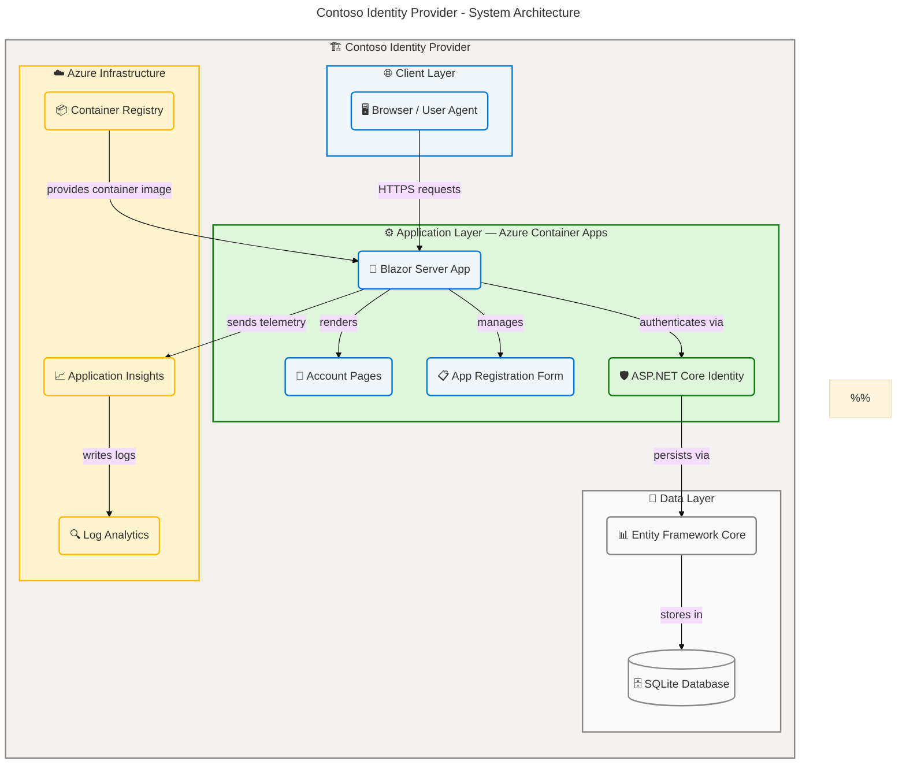

# Contoso Identity Provider


## Overview

**Overview**

Contoso Identity Provider (v2.0) is a cloud-native, open-source identity management platform built with Blazor Server on .NET 10 that delivers enterprise-grade user authentication, account management, and OAuth/OIDC application registration. It is designed for development teams and cloud architects who need a fully functional, deployable identity system without building identity infrastructure from scratch.

Built to run natively on Azure Container Apps, this platform ships with Infrastructure-as-Code Bicep templates and Azure Developer CLI (`azd`) support, enabling one-command provisioning and deployment. It integrates with Azure Application Insights for observability, uses SQLite for lightweight, file-based persistence, and provides a complete interactive Blazor Server UI covering all standard identity workflows — from user registration and two-factor authentication to OAuth/OIDC client app registration.

## Table of Contents

- [Overview](#overview)
- [Architecture](#architecture)
- [Features](#features)
- [Requirements](#requirements)
- [Quick Start](#quick-start)
- [Deployment](#deployment)
- [Usage](#usage)
- [Configuration](#configuration)
- [Contributing](#contributing)
- [License](#license)

## Architecture

**Overview**

Contoso Identity Provider follows a layered architecture pattern that cleanly separates user-facing presentation, identity business logic, data access, and cloud infrastructure concerns into distinct, independently maintainable layers. This design enables development teams to reason about each layer in isolation and scale or replace components without cascading changes across the system.

The system is hosted on Azure Container Apps and is composed of a Blazor Server application that manages the interactive web UI and identity operations through ASP.NET Core Identity, backed by Entity Framework Core and a SQLite database. Azure Container Registry stores container images, while Application Insights and Log Analytics provide full-stack observability across all layers.


```mermaid
---
title: "Contoso Identity Provider - System Architecture"
config:
  theme: base
  look: classic
  layout: dagre
  themeVariables:
    fontSize: '16px'
---
flowchart TB
    accTitle: Contoso Identity Provider - System Architecture
    accDescr: Layered architecture showing a browser client connecting via HTTPS to a Blazor Server app hosted in Azure Container Apps, which uses ASP.NET Core Identity for authentication, Entity Framework Core for data access, SQLite for storage, Azure Container Registry for image hosting, and Application Insights plus Log Analytics for monitoring. WCAG AA compliant.

    %%
    %% AZURE / FLUENT ARCHITECTURE PATTERN v2.0
    %% (Semantic + Structural + Font + Accessibility Governance)
    %%
    %% PHASE 1 - FLUENT UI: All styling uses approved Fluent UI palette only
    %% PHASE 2 - GROUPS: Every subgraph has semantic color via style directive
    %% PHASE 3 - COMPONENTS: Every node has semantic classDef + icon prefix
    %% PHASE 4 - ACCESSIBILITY: accTitle/accDescr present, WCAG AA contrast
    %% PHASE 5 - STANDARD: Governance block present, classDefs centralized
    %%

    subgraph identitySystem["🏗️ Contoso Identity Provider"]
        direction TB
        subgraph clientLayer["🌐 Client Layer"]
            browser("🖥️ Browser / User Agent"):::core
        end

        subgraph appLayer["⚙️ Application Layer — Azure Container Apps"]
            direction TB
            blazor("🔷 Blazor Server App"):::core
            account("🔐 Account Pages"):::core
            appReg("📋 App Registration Form"):::core
            aspIdentity("🛡️ ASP.NET Core Identity"):::success
        end

        subgraph dataLayer["💾 Data Layer"]
            direction TB
            efcore("📊 Entity Framework Core"):::neutral
            sqlite[("🗄️ SQLite Database")]:::neutral
        end

        subgraph infraLayer["☁️ Azure Infrastructure"]
            direction TB
            acr("📦 Container Registry"):::warning
            appInsights("📈 Application Insights"):::warning
            logAnalytics("🔍 Log Analytics"):::warning
        end

        browser -->|"HTTPS requests"| blazor
        blazor -->|"renders"| account
        blazor -->|"manages"| appReg
        blazor -->|"authenticates via"| aspIdentity
        aspIdentity -->|"persists via"| efcore
        efcore -->|"stores in"| sqlite
        acr -->|"provides container image"| blazor
        blazor -->|"sends telemetry"| appInsights
        appInsights -->|"writes logs"| logAnalytics

    end

    style identitySystem fill:#F3F2F1,stroke:#8A8886,stroke-width:2px,color:#323130
    style clientLayer fill:#EFF6FC,stroke:#0078D4,stroke-width:2px,color:#323130
    style appLayer fill:#DFF6DD,stroke:#107C10,stroke-width:2px,color:#323130
    style dataLayer fill:#FAFAFA,stroke:#8A8886,stroke-width:2px,color:#323130
    style infraLayer fill:#FFF4CE,stroke:#FFB900,stroke-width:2px,color:#323130

    %% Centralized semantic classDefs (Phase 5 compliant)
    classDef neutral fill:#FAFAFA,stroke:#8A8886,stroke-width:2px,color:#323130
    classDef core fill:#EFF6FC,stroke:#0078D4,stroke-width:2px,color:#323130
    classDef success fill:#DFF6DD,stroke:#107C10,stroke-width:2px,color:#323130
    classDef warning fill:#FFF4CE,stroke:#FFB900,stroke-width:2px,color:#323130
```

**Component Roles:**

| 🔧 Component             | 🗂️ Layer       | 📝 Description                                            |
| ------------------------ | -------------- | --------------------------------------------------------- |
| 🖥️ Browser               | Client         | End-user interface communicating via HTTPS                |
| 🔷 Blazor Server App     | Application    | Interactive server-rendered web UI host                   |
| 🔐 Account Pages         | Application    | Login, register, 2FA, and password management pages       |
| 📋 App Registration Form | Application    | OAuth/OIDC client application registration UI             |
| 🛡️ ASP.NET Core Identity | Application    | Authentication, authorization, and user management engine |
| 📊 Entity Framework Core | Data           | ORM layer providing migrations and query abstraction      |
| 🗄️ SQLite Database       | Data           | File-based relational database for user and app data      |
| 📦 Container Registry    | Infrastructure | Azure Container Registry for Docker image storage         |
| 📈 Application Insights  | Infrastructure | Application performance monitoring and telemetry          |
| 🔍 Log Analytics         | Infrastructure | Centralized log aggregation and query workspace           |

## Features

**Overview**

Contoso Identity Provider delivers a complete, production-ready authentication and identity management system that allows engineering teams to integrate secure user authentication into their applications without building identity infrastructure from scratch. It eliminates weeks of development effort by providing pre-built, tested Blazor Server UI components for every standard identity workflow.

The platform combines ASP.NET Core Identity's battle-tested security model with a modern, interactive Blazor Server interface, first-class Azure Container Apps deployment support, and OAuth/OIDC application registration management. This combination makes it suitable for both rapid prototyping and production-grade identity scenarios where full control over the identity layer is required.

| 🔐 Feature                   | 📝 Description                                                                                          | ✅ Status |
| ---------------------------- | ------------------------------------------------------------------------------------------------------- | --------- |
| 🔑 User Registration         | Email-based account creation with password confirmation and email verification workflow                 | Stable    |
| 🔓 User Login                | Secure local account login with optional remember-me cookie persistence                                 | Stable    |
| 📱 Two-Factor Authentication | TOTP-based 2FA (Time-based One-Time Password) with recovery codes and authenticator app support         | Stable    |
| 🔒 Password Management       | Change password, forgot password email flow, and password reset workflows                               | Stable    |
| 📧 Email Confirmation        | Account activation via email confirmation link with resend capability                                   | Stable    |
| 🌐 External Login            | Third-party OAuth provider login integration via `ExternalLoginPicker` component                        | Stable    |
| 📋 App Registration          | OAuth/OIDC client app registration with `ClientId`, `ClientSecret`, `TenantId`, scopes, and grant types | Stable    |
| 🛡️ Account Management        | Profile management, email change, personal data export, and account deletion                            | Stable    |
| ☁️ Azure Container Apps      | One-command deployment to Azure via `azd up` with Container Apps hosting at port 8080                   | Stable    |
| 📈 Observability             | Application Insights telemetry with Log Analytics workspace integration via Bicep                       | Stable    |
| 🔄 Auto-Migration            | Automatic EF Core database migration on application startup in development environments                 | Stable    |
| 🧪 Unit Tests                | MSTest-based test suite covering core components such as the email validation logic                     | Stable    |

## Requirements

**Overview**

Contoso Identity Provider requires the .NET 10 SDK for local development and build, and an Azure subscription with the Azure Developer CLI (`azd`) for cloud deployment. All NuGet package dependencies are defined in `src/IdentityProvider/IdentityProvider.csproj` and are automatically restored during the build process.

Local development requires no external database server because SQLite is bundled as a NuGet package. Cloud deployment provisions Azure Container Apps, Azure Container Registry, and Azure Monitor resources automatically through the Bicep templates in the `infra/` directory, so the only prerequisite is an Azure subscription with sufficient permission to create a resource group and the services within it.

> [!IMPORTANT]
> The Azure Developer CLI (`azd`) version 1.18.2 or later is required for deployment. The `azure.yaml` file at the repository root declares the `azd-init@1.18.2` template version, and older `azd` versions may produce incomplete infrastructure configurations.

| 🛠️ Requirement                 | 📌 Minimum Version | 🔗 Purpose                                                  |
| ------------------------------ | ------------------ | ----------------------------------------------------------- |
| 🔷 .NET SDK                    | 10.0               | Build, run, and test the application locally                |
| ☁️ Azure Subscription          | Active             | Host the application and provision cloud infrastructure     |
| 🔧 Azure Developer CLI (`azd`) | 1.18.2             | Provision infrastructure and deploy container images        |
| 🐳 Docker Desktop              | Latest stable      | Build and push container images (invoked by `azd`)          |
| 💻 Visual Studio or VS Code    | Latest             | Development IDE (optional but recommended)                  |
| 🗄️ SQLite                      | Bundled via NuGet  | Local file-based database — no separate installation needed |

## Quick Start

> [!TIP]
> The Quick Start below covers local development. For a complete Azure deployment with all infrastructure provisioned automatically, see the [Deployment](#deployment) section.

Follow these numbered steps to run Contoso Identity Provider on your local machine.

**1. Clone the repository**

```bash
git clone https://github.com/Evilazaro/IdentityProvider.git
cd IdentityProvider
```

Expected output:

```text
Cloning into 'IdentityProvider'...
remote: Enumerating objects: ...
Resolving deltas: 100% (...)
```

**2. Restore NuGet dependencies**

```bash
dotnet restore src/IdentityProvider/IdentityProvider.csproj
```

Expected output:

```text
  Determining projects to restore...
  Restored src/IdentityProvider/IdentityProvider.csproj (in 2.4s)
```

**3. Run the application**

```bash
dotnet run --project src/IdentityProvider/IdentityProvider.csproj
```

Expected output:

```text
info: Microsoft.Hosting.Lifetime[14]
      Now listening on: http://localhost:5244
info: Microsoft.Hosting.Lifetime[0]
      Application started. Press Ctrl+C to shut down.
```

**4. Open the application in your browser**

Navigate to `http://localhost:5244`. You will see the Contoso Identity Provider v2.0 welcome page.

**5. Register a new user account**

Navigate to `http://localhost:5244/Account/Register` and create an account with a valid email address and password. The application requires confirmed accounts, so check the development console for the confirmation link (the default `IdentityNoOpEmailSender` logs it).

**6. Run the unit test suite**

```bash
dotnet test src/identityProviderTests/identityProviderTests.csproj
```

Expected output:

```text
Test run for identityProviderTests.dll (.NETCoreApp,Version=v10.0)
Starting test execution, please wait...
A total of 1 test files matched the specified pattern.

Passed!  - Failed: 0, Passed: 6, Skipped: 0, Total: 6, Duration: ...
```

## Deployment

Deploy Contoso Identity Provider to Azure using the Azure Developer CLI (`azd`). The `azure.yaml` file at the repository root configures the service as an Azure Container App, and the `infra/` directory contains all required Bicep templates.

> [!WARNING]
> Running `azd up` provisions live Azure resources that incur charges. Review `infra/resources.bicep` before deploying to understand the resources created: Container Apps Environment, Container Registry, Container App, Application Insights, Log Analytics Workspace, and a User-Assigned Managed Identity.

**1. Install the Azure Developer CLI**

```bash
winget install microsoft.azd
```

Expected output:

```text
Found Azure Developer CLI [microsoft.azd] Version ...
Successfully installed
```

**2. Authenticate with your Azure account**

```bash
azd auth login
```

Expected output:

```text
Logged in to Azure.
```

**3. Initialize a new deployment environment**

```bash
azd init --environment my-identity-provider
```

Expected output:

```text
SUCCESS: New environment 'my-identity-provider' initialized.
```

**4. Provision infrastructure and deploy the application**

```bash
azd up
```

Expected output:

```text
Provisioning Azure resources (azd provision)...
  Creating resource group 'rg-my-identity-provider'...
  Creating container registry...
  Creating container apps environment...
  Creating container app 'identity-provider'...

Deploying services (azd deploy)...
  Deploying service 'identity-provider'...

SUCCESS: Your application was provisioned and deployed to Azure!
Endpoint: https://identity-provider.<unique>.azurecontainerapps.io
```

**Provisioned Azure Resources:**

The deployment creates the following resources as defined in `infra/resources.bicep` and `infra/main.bicep`:

- ☁️ Azure Resource Group (`rg-<environmentName>`)
- 📦 Azure Container Registry
- ⚙️ Azure Container Apps Environment
- 🖥️ Azure Container App (`identity-provider`, port 8080, min 1 / max 10 replicas)
- 📈 Azure Application Insights
- 🔍 Azure Log Analytics Workspace
- 🔑 User-Assigned Managed Identity

**5. Tear down resources when finished**

```bash
azd down
```

Expected output:

```text
Deleting all resources and deployments associated with 'my-identity-provider'...
SUCCESS: All resources deleted.
```

## Usage

### Registering a New User

Navigate to `/Account/Register` and complete the registration form. Enter a valid email address, password, and password confirmation, then click **Register**.

```text
URL: https://<host>/Account/Register

Email:            user@example.com
Password:         ••••••••••
Confirm Password: ••••••••••

[ Register ]
```

After submitting, the application sends an email confirmation. In development, the confirmation link is logged to the console by `IdentityNoOpEmailSender`. Click the link to activate the account.

### Logging In

Navigate to `/Account/Login` and sign in with your registered credentials.

```text
URL: https://<host>/Account/Login

Email:    user@example.com
Password: ••••••••••
☐ Remember me

[ Log in ]
```

### Managing Your Account

After logging in, access the account management area at `/Account/Manage`. The following pages are available:

- `/Account/Manage` — Profile index and status overview
- `/Account/Manage/Email` — Update and verify your email address
- `/Account/Manage/ChangePassword` — Change your current password
- `/Account/Manage/TwoFactorAuthentication` — Enable or disable TOTP 2FA
- `/Account/Manage/EnableAuthenticator` — Configure an authenticator app
- `/Account/Manage/GenerateRecoveryCodes` — Generate 2FA recovery codes
- `/Account/Manage/PersonalData` — Download or permanently delete account data
- `/Account/Manage/ExternalLogins` — Link or unlink external OAuth providers

### Registering an OAuth/OIDC Application

Navigate to `/AppRegistrationForm` to register a client application. All fields are required except **App Description**.

```text
URL: https://<host>/AppRegistrationForm

Client ID:                my-client-id
Client Secret:            ••••••••••••••••
Tenant ID:                xxxxxxxx-xxxx-xxxx-xxxx-xxxxxxxxxxxx
Redirect URI:             https://myapp.example.com/callback
Scopes (comma-separated): openid,profile,email
Authority:                https://login.microsoftonline.com/<tenant-id>
App Name:                 My Application
App Description:          Optional description of the app
Grant Types:              authorization_code,refresh_token
Response Types:           code

[ Create ]
```

The `AppRegistration` entity (defined in `src/IdentityProvider/Components/AppRegistration.cs`) stores all fields in the `AppRegistrations` table, persisted via Entity Framework Core to the SQLite database.

### Email Validation

The `eMail` class (defined in `src/IdentityProvider/Components/eMail.cs`) provides domain-restricted email validation. Only `example.com` and `test.com` domains are currently accepted as valid. This validator is exercised by the MSTest suite in `src/identityProviderTests/eMailTests.cs`.

```csharp
var validator = new eMail();
bool result = validator.checkEmail("user@example.com"); // returns true
bool rejected = validator.checkEmail("user@other.com"); // returns false
```

## Configuration

**Overview**

Contoso Identity Provider uses the standard ASP.NET Core configuration system, reading values from `appsettings.json` with environment-specific overrides applied from `appsettings.Development.json`. The only configuration required to run the application locally is the database connection string, which points to a SQLite file created automatically on first run.

In Azure Container Apps deployments, all runtime configuration is injected as environment variables by the Bicep provisioning templates in `infra/resources.bicep`. Sensitive values such as the Application Insights connection string and managed identity client ID are set automatically by `azd` during provisioning, so no manual secrets management is required for standard deployments.

| ⚙️ Setting                                 | 📁 Source                    | 📝 Description                                            | 🔧 Default Value                     |
| ------------------------------------------ | ---------------------------- | --------------------------------------------------------- | ------------------------------------ |
| 🗄️ `ConnectionStrings:DefaultConnection`   | `appsettings.json`           | SQLite database file path (EF Core connection string)     | `Data Source=identityProviderDB.db;` |
| 📊 `Logging:LogLevel:Default`              | `appsettings.json`           | Default application log level                             | `Information`                        |
| 📉 `Logging:LogLevel:Microsoft.AspNetCore` | `appsettings.json`           | ASP.NET Core framework log level                          | `Warning`                            |
| 🌍 `ASPNETCORE_ENVIRONMENT`                | Environment variable         | Runtime environment — controls error pages and migrations | `Development`                        |
| 📈 `APPLICATIONINSIGHTS_CONNECTION_STRING` | Environment variable (Azure) | Application Insights connection string for telemetry      | Set by `azd up`                      |
| 🔑 `AZURE_CLIENT_ID`                       | Environment variable (Azure) | User-Assigned Managed Identity client ID                  | Set by `azd up`                      |
| 🔌 `PORT`                                  | Environment variable (Azure) | HTTP listener port inside the container                   | `8080`                               |

**Customizing the Database Connection (Local Development)**

To use a custom SQLite file path or switch to another EF Core provider, update `appsettings.json`:

```json
{
  "ConnectionStrings": {
    "DefaultConnection": "Data Source=/custom/path/myIdentityDb.db;"
  }
}
```

**Using User Secrets (Development)**

For development overrides that should not be committed to source control, use the .NET user secrets feature:

```bash
dotnet user-secrets init --project src/IdentityProvider/IdentityProvider.csproj
dotnet user-secrets set "ConnectionStrings:DefaultConnection" "Data Source=devOverride.db;" \
  --project src/IdentityProvider/IdentityProvider.csproj
```

Expected output:

```text
Set 'ConnectionStrings:DefaultConnection' = 'Data Source=devOverride.db;'
```

**Auto-Migration Behavior**

When `ASPNETCORE_ENVIRONMENT` is set to `Development`, the application calls `dbContext.Database.Migrate()` at startup (defined in `src/IdentityProvider/Program.cs`), applying any pending EF Core migrations automatically. In production environments, this automatic migration is disabled and migrations must be applied manually.

```bash
dotnet ef database update --project src/IdentityProvider/IdentityProvider.csproj
```

## Contributing

**Overview**

Contoso Identity Provider welcomes community contributions including bug fixes, feature enhancements, documentation improvements, and additional unit tests. Contributing to this project helps improve open-source identity management tooling for the broader .NET and Azure developer community, reducing the barrier to adopting production-ready authentication infrastructure.

To contribute effectively, follow the branching strategy and coding conventions used throughout the project, ensure all changes include relevant unit tests verified with `dotnet test`, and write descriptive commit messages. Pull requests are reviewed by project maintainers and merged when they satisfy the project quality bar and align with the project direction.

> [!NOTE]
> Before submitting a pull request for a significant change, please open a GitHub issue to discuss the proposed change. This avoids duplicate effort and ensures alignment with the project roadmap before implementation begins.

### Getting Started

1. **Fork** the repository at [https://github.com/Evilazaro/IdentityProvider](https://github.com/Evilazaro/IdentityProvider)

2. **Clone** your fork locally:

```bash
git clone https://github.com/<your-username>/IdentityProvider.git
cd IdentityProvider
```

3. **Create a feature branch** from `main`:

```bash
git checkout -b feature/your-feature-name
```

4. **Make your changes**, adding or updating unit tests in `src/identityProviderTests/`

5. **Run the test suite** to confirm all tests pass:

```bash
dotnet test src/identityProviderTests/identityProviderTests.csproj
```

6. **Commit and push** your changes:

```bash
git add .
git commit -m "feat: describe your change concisely"
git push origin feature/your-feature-name
```

7. **Open a pull request** against the `main` branch at [https://github.com/Evilazaro/IdentityProvider](https://github.com/Evilazaro/IdentityProvider)

### Branch Naming Conventions

| 🌿 Prefix      | 📝 Purpose                                          |
| -------------- | --------------------------------------------------- |
| 🚀 `feature/`  | New capabilities or feature enhancements            |
| 🔧 `fix/`      | Bug fixes and defect resolutions                    |
| 📝 `docs/`     | Documentation updates and corrections               |
| 🧪 `test/`     | Test additions, improvements, or coverage expansion |
| ♻️ `refactor/` | Code restructuring without behavior change          |

### Code Style Guidelines

- Follow [Microsoft C# Coding Conventions](https://learn.microsoft.com/en-us/dotnet/csharp/fundamentals/coding-style/coding-conventions)
- Enable and respect nullable reference types (`<Nullable>enable</Nullable>` is set in `src/IdentityProvider/IdentityProvider.csproj`)
- Target .NET 10 language features and APIs
- Write unit tests using MSTest (see `src/identityProviderTests/` for examples)
- Use implicit usings where appropriate (`<ImplicitUsings>enable</ImplicitUsings>` is configured)

### Dependency Management

This project uses Dependabot (configured in `.github/dependabot.yml`) to automatically raise pull requests for outdated NuGet packages on a daily schedule. When reviewing or merging Dependabot PRs, verify that the test suite continues to pass after the version bump.

## License

This project is licensed under the **MIT License**. See the [`LICENSE`](LICENSE) file for the full license text.

**Created by:** Evilazaro Alves | Principal Cloud Solution Architect | Cloud Platforms and AI Apps | Microsoft
