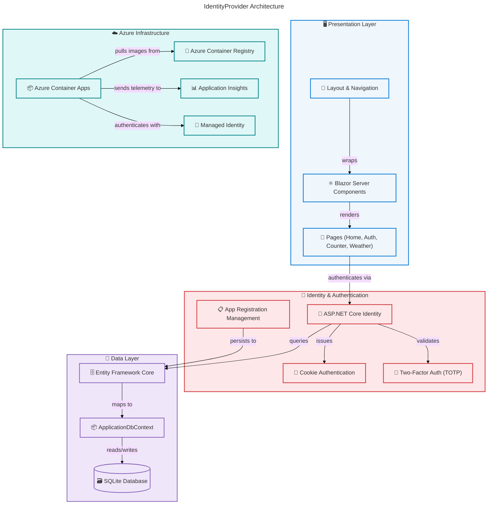

# IdentityProvider

[](https://opensource.org/licenses/MIT)
[](https://dotnet.microsoft.com/)
[](https://azure.microsoft.com/products/container-apps)
[](https://dotnet.microsoft.com/apps/aspnet/web-apps/blazor)

A full-featured ASP.NET Core Blazor identity and authentication provider with OAuth2/OpenID Connect app registration management, built on .NET 9.0 with ASP.NET Core Identity and Entity Framework Core, deployable to Azure Container Apps using Azure Developer CLI.

## Table of Contents

- [Overview](#overview)
- [Features](#features)
- [Getting Started](#getting-started)
- [Requirements](#requirements)
- [Usage](#usage)
- [Configuration](#configuration)
- [Architecture](#architecture)
- [Contributing](#contributing)
- [License](#license)

## Overview

**Overview**

IdentityProvider is a Blazor Server web application that delivers user authentication, authorization, and OAuth2/OpenID Connect application registration management. It provides a complete identity management solution using ASP.NET Core Identity with Entity Framework Core, backed by a SQLite database for lightweight storage and automatic migrations in development.

> [!NOTE]
> This project uses Interactive Server rendering mode for Blazor components, enabling real-time UI updates over a SignalR connection.

The application includes full account lifecycle management (registration, login, password reset, two-factor authentication, email confirmation) along with an app registration portal for managing OAuth2 clients. Infrastructure as Code (Bicep) and Azure Developer CLI (`azd`) configuration are included for seamless deployment to Azure Container Apps with integrated monitoring via Application Insights.

## Features

**Overview**

IdentityProvider consolidates identity management, authentication workflows, and OAuth2 client registration into a single Blazor Server application. These features enable developers to stand up an identity provider quickly with production-grade account management and Azure-native deployment.

| Feature                            | Description                                                                                                              | Status         |
| ---------------------------------- | ------------------------------------------------------------------------------------------------------------------------ | -------------- |
| 🔐 ASP.NET Core Identity           | Full user identity management with cookie-based authentication, account confirmation, and token providers                | ✅ Implemented |
| 🔑 Two-Factor Authentication       | TOTP authenticator app support with recovery codes, enable/disable/reset workflows                                       | ✅ Implemented |
| 📋 OAuth2 App Registration         | Manage OAuth2/OpenID Connect client registrations with client ID, secret, scopes, grant types, and redirect URIs         | ✅ Implemented |
| 🌐 Blazor Server Interactive       | Server-side interactive rendering with cascading authentication state and authorized route views                         | ✅ Implemented |
| 💾 Entity Framework Core + SQLite  | Code-first database with automatic migrations in development, `IdentityDbContext` for user and role management           | ✅ Implemented |
| ☁️ Azure Container Apps Deployment | Containerized deployment with Bicep IaC, Azure Container Registry, Application Insights monitoring, and managed identity | ✅ Implemented |
| ✉️ Email Validation Utility        | Domain-based email validation service with configurable allowed domains                                                  | ✅ Implemented |

## Getting Started

**Overview**

Get the IdentityProvider application running locally in minutes. The application uses SQLite, so no external database setup is required — migrations run automatically in development mode.

### Clone the Repository

```bash
git clone https://github.com/Evilazaro/IdentityProvider.git
cd IdentityProvider
```

### Build and Run

```bash
dotnet restore src/IdentityProvider/IdentityProvider.csproj
dotnet build src/IdentityProvider/IdentityProvider.csproj
dotnet run --project src/IdentityProvider/IdentityProvider.csproj
```

**Expected Output**:

```text
Building...
info: Microsoft.Hosting.Lifetime[14]
      Now listening on: https://localhost:7223
info: Microsoft.Hosting.Lifetime[14]
      Now listening on: http://localhost:5244
info: Microsoft.Hosting.Lifetime[0]
      Application started. Press Ctrl+C to shut down.
```

> [!TIP]
> The SQLite database (`identityProviderDB.db`) is created automatically on first run, and EF Core migrations are applied in development mode — no manual database setup is needed.

### Run Tests

```bash
dotnet test src/identityProviderTests/identityProviderTests.csproj
```

**Expected Output**:

```text
Passed!  - Failed:     0, Passed:     7, Skipped:     0, Total:     7
```

## Requirements

**Overview**

The following tools and runtimes are required to build, run, and deploy IdentityProvider. The .NET 9.0 SDK provides the build toolchain and runtime, while Azure Developer CLI is needed only for cloud deployment.

> [!TIP]
> **Why This Matters**: Ensuring the correct SDK version prevents build errors and guarantees access to the latest Blazor Server features and security patches introduced in .NET 9.0.

> [!IMPORTANT]
> **How It Works**: The application uses `net9.0` as its target framework. The `dotnet restore` command resolves all NuGet dependencies automatically, and SQLite requires no separate database server installation.

| Requirement                    | Version | Purpose                               | Required               |
| ------------------------------ | ------- | ------------------------------------- | ---------------------- |
| 🛠️ .NET SDK                    | 9.0+    | Build and run the application         | ✅ Yes                 |
| 🔗 Git                         | 2.0+    | Clone the repository                  | ✅ Yes                 |
| ☁️ Azure Developer CLI (`azd`) | Latest  | Deploy to Azure Container Apps        | ⬜ For deployment only |
| ☁️ Azure CLI                   | Latest  | Azure resource management             | ⬜ For deployment only |
| 🐳 Docker                      | 20.10+  | Container builds for Azure deployment | ⬜ For deployment only |

## Usage

**Overview**

After starting the application, use the browser-based Blazor UI to manage user accounts and OAuth2 application registrations. The identity system handles the full account lifecycle including registration, sign-in, and profile management.

### Access the Application

Navigate to `https://localhost:7223` in your browser after starting the application.

### User Account Management

The application provides complete account management pages:

- **Register** — Create a new account with email confirmation at `/Account/Register`
- **Login** — Authenticate with email and password at `/Account/Login`
- **Two-Factor Authentication** — Enable/disable TOTP authenticator at `/Account/Manage/TwoFactorAuthentication`
- **Password Management** — Change or reset password at `/Account/Manage/ChangePassword`
- **Personal Data** — Download or delete personal data at `/Account/Manage/PersonalData`

### App Registration Management

Navigate to the App Registration page to manage OAuth2/OpenID Connect client applications:

```csharp
// AppRegistration entity fields (AppRegistration.cs)
public required string ClientId { get; set; }
public required string ClientSecret { get; set; }
public required string TenantId { get; set; }
public required string RedirectUri { get; set; }
public required string Scopes { get; set; }        // Comma-separated
public required string Authority { get; set; }
public required string AppName { get; set; }
public string? AppDescription { get; set; }
public required string GrantTypes { get; set; }     // Comma-separated
public required string ResponseTypes { get; set; }  // Comma-separated
```

## Configuration

**Overview**

IdentityProvider uses the standard ASP.NET Core configuration system with `appsettings.json` files. The primary configuration controls database connectivity and logging. Environment-specific overrides are applied through `appsettings.Development.json`.

| Parameter                                  | Description                       | Default                              | Required |
| ------------------------------------------ | --------------------------------- | ------------------------------------ | -------- |
| ⚙️ `ConnectionStrings:DefaultConnection`   | SQLite database connection string | `Data Source=identityProviderDB.db;` | ✅ Yes   |
| 📊 `Logging:LogLevel:Default`              | Default logging verbosity         | `Information`                        | ⬜ No    |
| 📊 `Logging:LogLevel:Microsoft.AspNetCore` | ASP.NET Core framework logging    | `Warning`                            | ⬜ No    |
| 🌐 `AllowedHosts`                          | Allowed host headers for requests | `*`                                  | ⬜ No    |

> [!WARNING]
> The `UserSecretsId` is configured for local development. For production deployments, use Azure Key Vault or environment variables to manage sensitive configuration such as connection strings and authentication secrets.

### Launch Profiles

The application includes three launch profiles configured in `Properties/launchSettings.json`:

| Profile          | URL                                    | Use Case                             |
| ---------------- | -------------------------------------- | ------------------------------------ |
| 🔒 `https`       | `https://localhost:7223`               | Development with HTTPS (recommended) |
| 🌐 `http`        | `http://localhost:5244`                | Development without SSL              |
| 🖥️ `IIS Express` | `http://localhost:2284` (SSL: `44336`) | IIS Express hosting                  |

## Architecture

**Overview**

IdentityProvider follows a layered Blazor Server architecture with ASP.NET Core Identity for authentication, Entity Framework Core for data access, and Bicep-based Infrastructure as Code for Azure Container Apps deployment. The application uses Interactive Server rendering with SignalR for real-time UI and a cascading authentication state pattern.


```mermaid
---
title: "IdentityProvider Architecture"
config:
  theme: base
  look: classic
  layout: dagre
  themeVariables:
    fontSize: '16px'
  flowchart:
    htmlLabels: true
---
flowchart TB
    accTitle: IdentityProvider Application Architecture
    accDescr: Layered architecture showing Blazor Server frontend, ASP.NET Core Identity middleware, Entity Framework Core data layer, SQLite database, and Azure Container Apps deployment infrastructure

    %% ═══════════════════════════════════════════════════════════════════════════
    %% AZURE / FLUENT ARCHITECTURE PATTERN v1.1
    %% (Semantic + Structural + Font + Accessibility Governance)
    %% ═══════════════════════════════════════════════════════════════════════════
    %% PHASE 1 - FLUENT UI: All styling uses approved Fluent UI palette only
    %% PHASE 2 - GROUPS: Every subgraph has semantic color via style directive
    %% PHASE 3 - COMPONENTS: Every node has semantic classDef + icon prefix
    %% PHASE 4 - ACCESSIBILITY: accTitle/accDescr present, WCAG AA contrast
    %% PHASE 5 - STANDARD: Governance block present, classDefs centralized
    %% ═══════════════════════════════════════════════════════════════════════════

    subgraph presentation["🖥️ Presentation Layer"]
        direction LR
        blazor["⚛️ Blazor Server Components"]:::core
        layout["📐 Layout & Navigation"]:::core
        pages["📄 Pages (Home, Auth, Counter, Weather)"]:::core
    end

    subgraph identity["🔐 Identity & Authentication"]
        direction LR
        auth["🔑 ASP.NET Core Identity"]:::danger
        cookies["🍪 Cookie Authentication"]:::danger
        twofa["📱 Two-Factor Auth (TOTP)"]:::danger
        appreg["📋 App Registration Management"]:::danger
    end

    subgraph data["💾 Data Layer"]
        direction LR
        efcore["🗄️ Entity Framework Core"]:::data
        dbcontext["📦 ApplicationDbContext"]:::data
        sqlite[("🗃️ SQLite Database")]:::data
    end

    subgraph azure["☁️ Azure Infrastructure"]
        direction LR
        containerapp["📦 Azure Container Apps"]:::external
        acr["🐳 Azure Container Registry"]:::external
        appinsights["📊 Application Insights"]:::external
        managedid["🔐 Managed Identity"]:::external
    end

    blazor -->|"renders"| pages
    layout -->|"wraps"| blazor
    pages -->|"authenticates via"| auth
    auth -->|"issues"| cookies
    auth -->|"validates"| twofa
    appreg -->|"persists to"| efcore
    auth -->|"queries"| efcore
    efcore -->|"maps to"| dbcontext
    dbcontext -->|"reads/writes"| sqlite
    containerapp -->|"pulls images from"| acr
    containerapp -->|"sends telemetry to"| appinsights
    containerapp -->|"authenticates with"| managedid

    style presentation fill:#EFF6FC,stroke:#0078D4,stroke-width:2px,color:#323130
    style identity fill:#FDE7E9,stroke:#D13438,stroke-width:2px,color:#323130
    style data fill:#F0E6FA,stroke:#8764B8,stroke-width:2px,color:#323130
    style azure fill:#E0F7F7,stroke:#038387,stroke-width:2px,color:#323130

    classDef core fill:#EFF6FC,stroke:#0078D4,stroke-width:2px,color:#323130
    classDef danger fill:#FDE7E9,stroke:#D13438,stroke-width:2px,color:#323130
    classDef data fill:#F0E6FA,stroke:#8764B8,stroke-width:2px,color:#323130
    classDef external fill:#E0F7F7,stroke:#038387,stroke-width:2px,color:#323130
```

### Project Structure

```text
IdentityProvider/
├── src/
│   ├── IdentityProvider/               # Main application
│   │   ├── Components/
│   │   │   ├── Account/                # Identity account pages (Login, Register, 2FA, etc.)
│   │   │   │   ├── Pages/              # Account page components
│   │   │   │   │   └── Manage/         # Account management (password, 2FA, personal data)
│   │   │   │   └── Shared/             # Shared account layout components
│   │   │   ├── Layout/                 # MainLayout and NavMenu
│   │   │   ├── Pages/                  # Application pages (Home, Auth, Counter, Weather)
│   │   │   ├── App.razor               # Root application component
│   │   │   ├── AppRegistration.cs      # OAuth2 client registration entity
│   │   │   ├── eMail.cs                # Email validation utility
│   │   │   └── Routes.razor            # Routing with authorization
│   │   ├── Data/
│   │   │   └── ApplicationDbContext.cs # EF Core identity database context
│   │   ├── Migrations/                 # EF Core database migrations
│   │   ├── Properties/                 # Launch profiles and service dependencies
│   │   ├── wwwroot/                    # Static files (CSS, JavaScript, icons)
│   │   ├── Program.cs                  # Application entry point and service configuration
│   │   ├── appsettings.json            # Application configuration
│   │   └── IdentityProvider.csproj     # Project file (.NET 9.0)
│   └── identityProviderTests/          # MSTest unit tests
│       ├── eMailTests.cs               # Email validation tests
│       ├── Test1.cs                    # Placeholder test
│       └── identityProviderTests.csproj
├── infra/                              # Azure Bicep IaC
│   ├── main.bicep                      # Subscription-level deployment
│   ├── resources.bicep                 # Azure resources (Container Apps, ACR, Insights)
│   └── modules/                        # Bicep modules
├── azure.yaml                          # Azure Developer CLI configuration
├── IdentityProvider.sln                # Visual Studio solution
└── LICENSE                             # MIT License
```

### Azure Deployment

Deploy to Azure Container Apps using Azure Developer CLI:

```bash
azd auth login
azd up
```

**Expected Output**:

```text
Packaging services (azd package)

  (✓) Done: Packaging service identity-provider

Provisioning Azure resources (azd provision)
Provisioning Azure resources can take some time.

  (✓) Done: Resource group: rg-<environment-name>
  (✓) Done: Container Registry
  (✓) Done: Container Apps Environment
  (✓) Done: Container App: identity-provider
  (✓) Done: Application Insights

Deploying services (azd deploy)

  (✓) Done: Deploying service identity-provider

SUCCESS: Your application was provisioned and deployed to Azure.
```

The Bicep infrastructure provisions:

| Resource                          | Purpose                                                                 |
| --------------------------------- | ----------------------------------------------------------------------- |
| 📦 Azure Container Apps           | Hosts the containerized application (port `8080`, 0.5 CPU, 1 GB memory) |
| 🐳 Azure Container Registry       | Stores container images with managed identity pull access               |
| 📊 Application Insights           | Application performance monitoring and telemetry                        |
| 📈 Log Analytics Workspace        | Centralized log collection and analysis                                 |
| 🔐 User-Assigned Managed Identity | Secure, passwordless authentication to Azure services                   |

## Contributing

**Overview**

Contributions to IdentityProvider are welcome. Whether you are fixing bugs, adding features, or improving documentation, your input helps improve the project for everyone.

1. Fork the repository
2. Create a feature branch (`git checkout -b feature/your-feature`)
3. Commit your changes (`git commit -m 'Add your feature'`)
4. Push to the branch (`git push origin feature/your-feature`)
5. Open a Pull Request

### Running Tests Locally

```bash
dotnet test src/identityProviderTests/identityProviderTests.csproj
```

> [!TIP]
> Tests run in parallel at the method level by default. See `MSTestSettings.cs` for the parallelization configuration.

## License

This project is licensed under the [MIT License](./LICENSE).

Copyright (c) 2025 Evilázaro Alves
