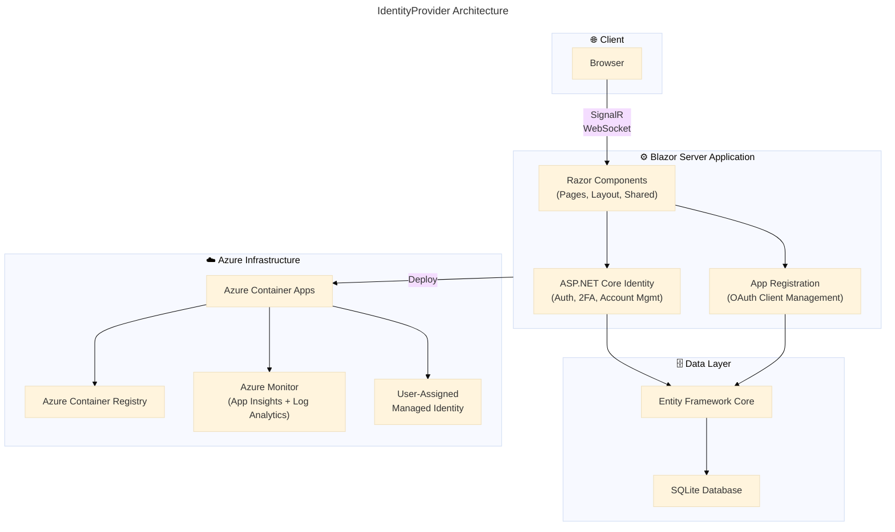

# IdentityProvider

[](./LICENSE)
[](https://dotnet.microsoft.com/)
[](https://dotnet.microsoft.com/apps/aspnet/web-apps/blazor)
[](https://azure.microsoft.com/products/container-apps)
[](https://learn.microsoft.com/azure/azure-resource-manager/bicep/)

A Blazor Server identity management application built on ASP.NET Core Identity that provides secure authentication, authorization, and OAuth application registration capabilities, deployable to Azure Container Apps.

## 📖 IdentityProvider

**Overview**

IdentityProvider (Contoso Identity Provider V2.0) is a full-featured identity management web application built with ASP.NET Core Blazor Server and ASP.NET Core Identity. It provides a complete set of user authentication workflows — including registration, login, two-factor authentication, password recovery, and account management — along with an OAuth application registration interface. The project uses Entity Framework Core with SQLite for data persistence and is pre-configured for deployment to Azure Container Apps using the Azure Developer CLI (`azd`).

## 🏗️ Architecture

**Overview**

The application follows a layered Blazor Server architecture with ASP.NET Core Identity for authentication, Entity Framework Core for data access, and Bicep-based Infrastructure as Code for Azure deployment. Interactive server-side rendering handles all UI interactions over a persistent SignalR connection.


```mermaid
---
title: IdentityProvider Architecture
config:
  theme: base
  look: classic
---
graph TB
    accTitle: IdentityProvider Application Architecture
    accDescr: Shows the layered architecture from client browser through Blazor Server to data and Azure infrastructure

    subgraph Client["🌐 Client"]
        Browser["Browser"]
    end

    subgraph BlazorServer["⚙️ Blazor Server Application"]
        direction TB
        Components["Razor Components<br/>(Pages, Layout, Shared)"]
        Identity["ASP.NET Core Identity<br/>(Auth, 2FA, Account Mgmt)"]
        AppReg["App Registration<br/>(OAuth Client Management)"]
    end

    subgraph DataLayer["🗄️ Data Layer"]
        EFCore["Entity Framework Core"]
        SQLite["SQLite Database"]
    end

    subgraph Azure["☁️ Azure Infrastructure"]
        ContainerApp["Azure Container Apps"]
        ACR["Azure Container Registry"]
        Monitor["Azure Monitor<br/>(App Insights + Log Analytics)"]
        ManagedId["User-Assigned<br/>Managed Identity"]
    end

    Browser -->|"SignalR<br/>WebSocket"| Components
    Components --> Identity
    Components --> AppReg
    Identity --> EFCore
    AppReg --> EFCore
    EFCore --> SQLite
    BlazorServer -->|"Deploy"| ContainerApp
    ContainerApp --> ACR
    ContainerApp --> Monitor
    ContainerApp --> ManagedId
```

## ✨ Features

**Overview**

IdentityProvider delivers a comprehensive identity management experience with enterprise-grade authentication workflows, interactive server-side rendering, and cloud-native deployment support out of the box.

| Feature                         | Description                                                                                                    | Source                                                                                       |
| ------------------------------- | -------------------------------------------------------------------------------------------------------------- | -------------------------------------------------------------------------------------------- |
| User Registration & Login       | Complete account creation and sign-in flows with email confirmation                                            | `Components/Account/Pages/Register.razor`, `Login.razor`                                     |
| Two-Factor Authentication       | TOTP-based 2FA with authenticator app support and recovery codes                                               | `Components/Account/Pages/Manage/EnableAuthenticator.razor`, `TwoFactorAuthentication.razor` |
| Password Management             | Password reset, change password, and forgot-password workflows                                                 | `Components/Account/Pages/ForgotPassword.razor`, `ResetPassword.razor`                       |
| External Login Providers        | Support for third-party authentication providers                                                               | `Components/Account/Pages/ExternalLogin.razor`                                               |
| OAuth App Registration          | Form-based interface for registering OAuth client applications with Client ID, Secret, Scopes, and Grant Types | `Components/Pages/AppRegistrationForm.razor`, `Components/AppRegistration.cs`                |
| Account Management              | Profile management including email change, personal data export, and account deletion                          | `Components/Account/Pages/Manage/`                                                           |
| Interactive Server Rendering    | Blazor Server with SignalR for real-time interactive UI                                                        | `Program.cs:12-13`                                                                           |
| Azure Container Apps Deployment | Pre-configured IaC with Bicep for Azure Container Apps, Container Registry, and monitoring                     | `infra/resources.bicep`, `azure.yaml`                                                        |

## 📋 Requirements

**Overview**

The following tools and runtimes are required to build, run, and deploy the application locally and to Azure.

| Requirement                    | Version | Purpose                                    |
| ------------------------------ | ------- | ------------------------------------------ |
| 🟣 .NET SDK                    | 9.0+    | Build and run the application              |
| 🗄️ SQLite                      | Bundled | Local data persistence (no install needed) |
| 🔧 Azure Developer CLI (`azd`) | Latest  | Deploy to Azure Container Apps             |
| ☁️ Azure Subscription          | —       | Required for cloud deployment              |
| 🐳 Docker                      | Latest  | Container image build (for deployment)     |

## 🚀 Quick Start

**Overview**

Get the application running locally in a few steps.

**1. Clone the repository**

```bash
git clone https://github.com/Evilazaro/IdentityProvider.git
cd IdentityProvider
```

**2. Restore dependencies**

```bash
dotnet restore IdentityProvider.sln
```

**3. Run the application**

```bash
cd src/IdentityProvider
dotnet run
```

**Expected output:**

```text
info: Microsoft.Hosting.Lifetime[14]
      Now listening on: https://localhost:7223
      Now listening on: http://localhost:5244
info: Microsoft.Hosting.Lifetime[0]
      Application started. Press Ctrl+C to shut down.
```

Open `https://localhost:7223` in your browser to access the application.

**4. Run tests**

```bash
cd src/identityProviderTests
dotnet test
```

**Expected output:**

```text
Passed!  - Failed:  0, Passed:  6, Skipped:  0, Total:  6
```

## 📦 Deployment

**Overview**

The project includes Bicep-based Infrastructure as Code for deploying to Azure Container Apps using the Azure Developer CLI (`azd`). The infrastructure provisions a Container App, Container Registry, Application Insights monitoring, and a user-assigned managed identity.

**1. Authenticate with Azure**

```bash
azd auth login
```

**2. Initialize the environment**

```bash
azd init
```

Follow the prompts to select your Azure subscription and region.

**3. Deploy to Azure**

```bash
azd up
```

**Expected output:**

```text
Deploying services (azd deploy)

  (✓) Done: Deploying service identity-provider
  - Endpoint: https://<your-container-app>.azurecontainerapps.io

SUCCESS: Your application was provisioned and deployed to Azure.
```

**Provisioned Azure Resources:**

| Resource                                             | Purpose                                                    |
| ---------------------------------------------------- | ---------------------------------------------------------- |
| Azure Container Apps                                 | Hosts the application container (port 8080, 1-10 replicas) |
| Azure Container Registry                             | Stores container images                                    |
| Azure Monitor (Application Insights + Log Analytics) | Application monitoring and logging                         |
| User-Assigned Managed Identity                       | Secure, passwordless authentication to Azure services      |

## 💻 Usage

**Overview**

Once running, the application provides a web-based identity management interface with the following key workflows.

**Register a new user account**

1. Navigate to the application URL.
2. Click **Register** to create a new account.
3. Provide an email and password, then confirm your email.

**Sign in**

1. Navigate to `/Account/Login`.
2. Enter your credentials.
3. Optionally enable two-factor authentication from account settings.

**Register an OAuth application**

1. Navigate to `/AppRegistrationForm`.
2. Fill in the required fields: Client ID, Client Secret, Tenant ID, Redirect URI, Scopes, Authority, App Name, Grant Types, and Response Types.
3. Submit the form to create the registration.

## ⚙️ Configuration

**Overview**

The application is configured through standard ASP.NET Core configuration files. The primary settings control the database connection and logging behavior.

| Parameter                               | Description                                                | Default                              | Required        |
| --------------------------------------- | ---------------------------------------------------------- | ------------------------------------ | --------------- |
| `ConnectionStrings:DefaultConnection`   | SQLite database connection string                          | `Data Source=identityProviderDB.db;` | Yes             |
| `Logging:LogLevel:Default`              | Default log verbosity                                      | `Information`                        | No              |
| `Logging:LogLevel:Microsoft.AspNetCore` | ASP.NET Core framework log level                           | `Warning`                            | No              |
| `AllowedHosts`                          | Hosts permitted to make requests                           | `*`                                  | No              |
| `APPLICATIONINSIGHTS_CONNECTION_STRING` | Application Insights connection (set via Azure deployment) | —                                    | No (Azure only) |
| `AZURE_CLIENT_ID`                       | Managed identity client ID (set via Azure deployment)      | —                                    | No (Azure only) |

Configuration files:

- [src/IdentityProvider/appsettings.json](src/IdentityProvider/appsettings.json) — Production settings
- [src/IdentityProvider/appsettings.Development.json](src/IdentityProvider/appsettings.Development.json) — Development overrides

## 🤝 Contributing

**Overview**

Contributions are welcome. Please follow the standard GitHub workflow to propose changes.

1. Fork the repository.
2. Create a feature branch from `main`.
3. Make your changes.
4. Run the test suite to verify:

   ```bash
   dotnet test IdentityProvider.sln
   ```

5. Submit a pull request with a clear description of your changes.

## 📄 License

This project is licensed under the [MIT License](./LICENSE).

Copyright (c) 2025 Evilázaro Alves.
