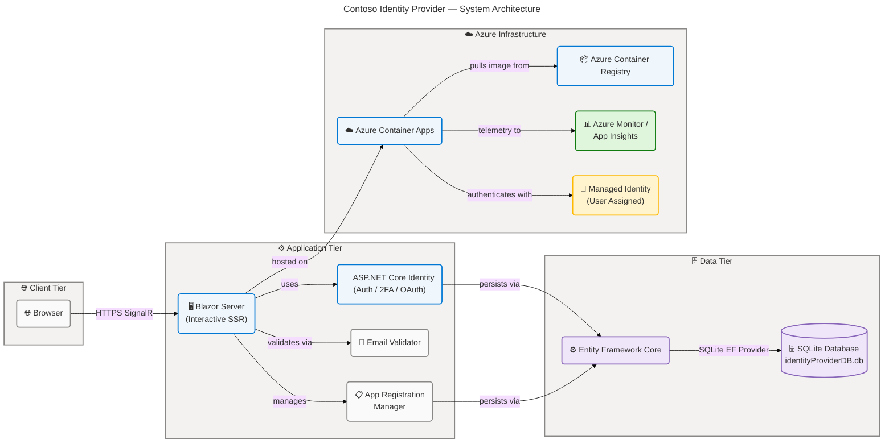

# Contoso Identity Provider


A production-ready **ASP.NET Core Identity Provider** built with Blazor Server and .NET 9, providing full-featured user authentication, authorization, and OAuth 2.0 app registration management — deployable to Azure Container Apps via the Azure Developer CLI.

## Overview

**Overview**

Contoso Identity Provider is an **enterprise-grade digital identity management platform** designed for development teams that need a self-hosted, **standards-compliant authentication service**. It delivers user registration, email-confirmed login, **two-factor authentication**, and external provider support through a Blazor Server interactive UI, empowering teams to ship secured applications without building authentication from scratch.

The platform uses **ASP.NET Core Identity** on top of Entity Framework Core with a SQLite backend for rapid local development, and deploys seamlessly to Azure Container Apps via Bicep infrastructure-as-code and the Azure Developer CLI. **Automatic migrations on startup**, integrated Application Insights telemetry, and a **managed identity RBAC model** ensure the transition from development to production requires minimal operational overhead.

## Table of Contents

- [Overview](#overview)
- [Architecture](#architecture)
- [Features](#features)
- [Requirements](#requirements)
- [Quick Start](#quick-start)
- [Configuration](#configuration)
- [Usage](#usage)
- [Contributing](#contributing)
- [License](#license)

## Architecture

**Overview**

The application follows a **layered architecture** separating the Blazor Server presentation tier, ASP.NET Core Identity service tier, and Entity Framework Core data tier. All layers are packaged as a **single container image** and deployed to Azure Container Apps with full observability via Azure Monitor.


```mermaid
---
title: "Contoso Identity Provider — System Architecture"
config:
  theme: base
  look: classic
  layout: dagre
  themeVariables:
    fontSize: '16px'
  flowchart:
    htmlLabels: true
    curve: basis
---
flowchart LR
    accTitle: Contoso Identity Provider System Architecture
    accDescr: Shows the layered architecture from browser through Blazor Server, ASP.NET Core Identity, Entity Framework Core to SQLite database, plus Azure deployment infrastructure

    %% ═══════════════════════════════════════════════════════════════════════════
    %% AZURE / FLUENT ARCHITECTURE PATTERN v1.1
    %% (Semantic + Structural + Font + Accessibility Governance)
    %% ═══════════════════════════════════════════════════════════════════════════
    %% PHASE 1 - FLUENT UI: All styling uses approved Fluent UI palette only
    %% PHASE 2 - GROUPS: Every subgraph has semantic color via style directive
    %% PHASE 3 - COMPONENTS: Every node has semantic classDef + icon prefix
    %% PHASE 4 - ACCESSIBILITY: accTitle/accDescr present, WCAG AA contrast
    %% PHASE 5 - STANDARD: Governance block present, classDefs centralized
    %% ═══════════════════════════════════════════════════════════════════════════

    subgraph client["🌐 Client Tier"]
        browser("🌐 Browser"):::neutral
    end

    subgraph app["⚙️ Application Tier"]
        blazor("🖥️ Blazor Server<br>(Interactive SSR)"):::core
        identity("🔐 ASP.NET Core Identity<br>(Auth / 2FA / OAuth)"):::core
        email("📧 Email Validator"):::neutral
        appReg("📋 App Registration<br>Manager"):::neutral
    end

    subgraph dataTier["🗄️ Data Tier"]
        efcore("⚙️ Entity Framework Core"):::data
        sqlite[("🗄️ SQLite Database<br>identityProviderDB.db")]:::data
    end

    subgraph azure["☁️ Azure Infrastructure"]
        aca("☁️ Azure Container Apps"):::core
        acr("📦 Azure Container Registry"):::core
        monitor("📊 Azure Monitor /<br>App Insights"):::success
        identityMI("🔑 Managed Identity<br>(User Assigned)"):::warning
    end

    browser -->|"HTTPS SignalR"| blazor
    blazor -->|"uses"| identity
    blazor -->|"validates via"| email
    blazor -->|"manages"| appReg
    identity -->|"persists via"| efcore
    appReg -->|"persists via"| efcore
    efcore -->|"SQLite EF Provider"| sqlite
    blazor -->|"hosted on"| aca
    aca -->|"pulls image from"| acr
    aca -->|"telemetry to"| monitor
    aca -->|"authenticates with"| identityMI

    style client fill:#F3F2F1,stroke:#8A8886,stroke-width:2px,color:#323130
    style app fill:#F3F2F1,stroke:#8A8886,stroke-width:2px,color:#323130
    style dataTier fill:#F3F2F1,stroke:#8A8886,stroke-width:2px,color:#323130
    style azure fill:#F3F2F1,stroke:#8A8886,stroke-width:2px,color:#323130

    %% Centralized semantic classDefs (Phase 5 compliant)
    classDef neutral fill:#FAFAFA,stroke:#8A8886,stroke-width:2px,color:#323130
    classDef core fill:#EFF6FC,stroke:#0078D4,stroke-width:2px,color:#323130
    classDef success fill:#DFF6DD,stroke:#107C10,stroke-width:2px,color:#323130
    classDef warning fill:#FFF4CE,stroke:#FFB900,stroke-width:2px,color:#323130
    classDef data fill:#F0E6FA,stroke:#8764B8,stroke-width:2px,color:#323130
```

**Component Roles:**

| Component                           | Role                                                                                                               |
| ----------------------------------- | ------------------------------------------------------------------------------------------------------------------ |
| 🖥️ **Blazor Server**                | Hosts all UI pages and handles interactive server-side rendering via SignalR                                       |
| 🔐 **ASP.NET Core Identity**        | Manages all authentication flows — local accounts, 2FA, recovery codes, external providers, and account management |
| ⚙️ **Entity Framework Core**        | Provides the ORM layer with automatic migration execution on startup                                               |
| 🗄️ **SQLite**                       | Lightweight, file-based relational database (`identityProviderDB.db`)                                              |
| ☁️ **Azure Container Apps**         | Serverless container runtime that scales from 1 to 10 replicas                                                     |
| 📦 **Azure Container Registry**     | Stores and serves the container image for deployment                                                               |
| 📊 **Azure Monitor / App Insights** | Captures runtime telemetry via the `APPLICATIONINSIGHTS_CONNECTION_STRING` environment variable                    |
| 🔑 **Managed Identity**             | A user-assigned managed identity provides credential-free ACR pulls                                                |

## Features

**Overview**

Contoso Identity Provider delivers a comprehensive authentication and identity lifecycle management solution that eliminates the need to build authentication logic from scratch. Development teams gain a working, production-deployable IdP with user registration, multi-factor authentication, account self-service, and OAuth 2.0 client registration — all backed by ASP.NET Core Identity's battle-tested security model.

The platform differentiates itself by combining Blazor Server's real-time interactive UI with a **fully scaffolded identity pipeline**, Azure-native deployment using **infrastructure-as-code Bicep**, and extensible data models that teams can customize. **Automatic EF Core migrations on development startup** and managed identity RBAC in Azure reduce friction from first `git clone` to production deployment.

> [!NOTE]
> The feature set is entirely evidence-based from source files in `src/IdentityProvider/`. No capabilities are implied or extrapolated beyond what the codebase implements.

| Feature                      | Description                                                               | Source                               |
| ---------------------------- | ------------------------------------------------------------------------- | ------------------------------------ |
| 🔐 **User Registration**     | Email-based account creation with confirmed-account enforcement           | `Account/Pages/Register.razor`       |
| 🔑 **Local Login**           | Cookie-based login with Remember Me and return URL support                | `Account/Pages/Login.razor`          |
| 📱 **Two-Factor Auth (2FA)** | Authenticator app TOTP support with recovery codes                        | `Account/Pages/LoginWith2fa.razor`   |
| 🔁 **Password Recovery**     | Forgot password and reset password flows via email token                  | `Account/Pages/ForgotPassword.razor` |
| 🌐 **External Login**        | OAuth external provider registration and login                            | `Account/Pages/ExternalLogin.razor`  |
| 👤 **Account Management**    | Self-service profile, email, password, personal data                      | `Account/Pages/Manage/`              |
| 📋 **App Registration**      | OAuth 2.0 client registration form (ClientId, Secret, Scopes, GrantTypes) | `Components/AppRegistration.cs`      |
| 📧 **Email Validation**      | Domain-allowlist email validator utility                                  | `Components/eMail.cs`                |
| ☁️ **Azure Deployment**      | One-command deploy to Azure Container Apps via `azd up`                   | `azure.yaml`, `infra/`               |
| 📊 **Observability**         | Application Insights telemetry auto-wired via managed identity            | `infra/resources.bicep`              |

## Requirements

**Overview**

This project targets **.NET 9** and requires the **Azure Developer CLI** for cloud deployment. All infrastructure resources — Container Apps environment, Container Registry, Application Insights, and managed identity — are provisioned automatically by the bundled Bicep templates.

Local development requires only the .NET 9 SDK and a supported IDE. The SQLite database file is created and migrated automatically on first run in the Development environment, so **no manual database setup is needed**.

> [!IMPORTANT]
> The Azure Developer CLI (`azd`) and an active Azure subscription with sufficient quota for Container Apps and Container Registry are required only for cloud deployment. Local development has no Azure dependency.

| Prerequisite                        | Version             | Purpose                       | Required For      |
| ----------------------------------- | ------------------- | ----------------------------- | ----------------- |
| 🛠️ **.NET SDK**                     | 9.0 or later        | Build and run the application | ✅ Local + Cloud  |
| 🗄️ **SQLite**                       | Bundled via EF Core | Local database                | ✅ Local dev      |
| ☁️ **Azure Developer CLI**          | Latest (`azd`)      | Deploy to Azure               | ☁️ Cloud only     |
| 🔑 **Azure Subscription**           | Active subscription | Provision Azure resources     | ☁️ Cloud only     |
| 🛠️ **Visual Studio 2022 / VS Code** | 17.x / Latest       | Recommended IDE               | ✅ Optional       |
| 📦 **Docker** (optional)            | 24.x or later       | Build container locally       | ☁️ Cloud optional |

## Quick Start

### Local Development

1. Clone the repository:

```bash
git clone https://github.com/Evilazaro/IdentityProvider.git
cd IdentityProvider
```

2. Restore dependencies and run:

```bash
cd src/IdentityProvider
dotnet restore
dotnet run
```

3. Open your browser and navigate to `https://localhost:5001`.

**Expected output:**

```
info: Microsoft.Hosting.Lifetime[14]
      Now listening on: https://localhost:5001
info: Microsoft.Hosting.Lifetime[14]
      Now listening on: http://localhost:5000
info: Microsoft.Hosting.Lifetime[0]
      Application started. Press Ctrl+C to shut down.
```

The SQLite database file `identityProviderDB.db` is created and **all EF Core migrations are applied automatically on first startup** in the Development environment (see `Program.cs`).

### Run Unit Tests

```bash
cd src/identityProviderTests
dotnet test
```

**Expected output:**

```
Passed!  - Failed: 0, Passed: 6, Skipped: 0, Total: 6
```

### Deploy to Azure

> [!TIP]
> Run `azd auth login` before `azd up` to authenticate with your Azure account. The Azure Developer CLI requires Contributor access on the target subscription or resource group.

1. Authenticate and initialize:

```bash
azd auth login
```

2. Provision infrastructure and deploy:

```bash
azd up
```

This command:

- Creates a resource group `rg-<environment-name>`
- Provisions Azure Container Registry, Container Apps environment, Application Insights, and a user-assigned managed identity
- Builds and pushes the container image to ACR
- Deploys the Container App at port `8080` with **auto-scale from 1 to 10 replicas**

3. Tear down all Azure resources:

```bash
azd down
```

## Configuration

**Overview**

Application configuration is managed via the standard ASP.NET Core appsettings hierarchy. The **only required configuration for local development** is the SQLite connection string in `appsettings.json`. Azure deployment injects environment-specific variables (`APPLICATIONINSIGHTS_CONNECTION_STRING`, `AZURE_CLIENT_ID`, `PORT`) at runtime through the Container App definition in `infra/resources.bicep`.

For production deployments, secrets should be managed via **Azure Key Vault or Container Apps secret references** — **never committed to source control**. The `UserSecretsId` in `IdentityProvider.csproj` (project ID `aspnet-IdentityProvider-f99f5be1-3749-4889-aa7a-f8105c053e60`) supports the .NET User Secrets tool for local secret management.

### Local Configuration (`appsettings.json`)

```json
{
  "ConnectionStrings": {
    "DefaultConnection": "Data Source=identityProviderDB.db;"
  },
  "Logging": {
    "LogLevel": {
      "Default": "Information",
      "Microsoft.AspNetCore": "Warning"
    }
  },
  "AllowedHosts": "*"
}
```

### Development Overrides (`appsettings.Development.json`)

```json
{
  "Logging": {
    "LogLevel": {
      "Default": "Information",
      "Microsoft.AspNetCore": "Warning"
    }
  }
}
```

### Azure Runtime Environment Variables

These variables are injected automatically when deploying via `azd up` (defined in `infra/resources.bicep`):

| Variable                                   | Description                              | Source                         |
| ------------------------------------------ | ---------------------------------------- | ------------------------------ |
| ⚙️ `APPLICATIONINSIGHTS_CONNECTION_STRING` | Application Insights telemetry endpoint  | 📊 Azure Monitor module output |
| 🔑 `AZURE_CLIENT_ID`                       | User-assigned managed identity client ID | 🔑 Managed identity output     |
| 🌐 `PORT`                                  | Container listen port (default `8080`)   | ☁️ Container App definition    |

### Email Domain Allowlist

The `eMail` utility in `src/IdentityProvider/Components/eMail.cs` validates user emails against a domain allowlist. The current defaults are `example.com` and `test.com`. **Update** `validDomains` **in that file to match your organization's allowed domains before deploying.**

```csharp
string[] validDomains = { "example.com", "test.com" };
```

### Identity Options

The `ApplicationUser` class in `src/IdentityProvider/Data/ApplicationUser.cs` extends `IdentityUser` for custom profile data. `RequireConfirmedAccount = true` is enforced in `Program.cs`, meaning all registrations trigger an email confirmation step handled by `IdentityNoOpEmailSender` (a no-op sender suitable for development; **replace with a real `IEmailSender<ApplicationUser>` implementation for production**).

## Usage

### User Registration and Login

Navigate to `/Account/Register` to create a new account. After submitting the registration form, the confirmation flow is triggered. Use `/Account/Login` to sign in with email and password. The login page also exposes external provider login via `ExternalLoginPicker`.

```
POST /Account/Register
POST /Account/Login
GET  /Account/ConfirmEmail?userId=...&code=...
```

### Two-Factor Authentication

Once logged in, enable 2FA from `/Account/Manage/TwoFactorAuthentication`. Scan the displayed QR code with an authenticator app (e.g., Microsoft Authenticator). On subsequent logins, the `/Account/LoginWith2fa` page prompts for the TOTP code. Recovery codes are generated at `/Account/Manage/GenerateRecoveryCodes`.

### Account Management Pages

All account self-service pages are available under `/Account/Manage/`:

| Page                   | Path                                      | Purpose                           |
| ---------------------- | ----------------------------------------- | --------------------------------- |
| 👤 **Profile**         | `/Account/Manage`                         | Display name and profile settings |
| 📧 **Email**           | `/Account/Manage/Email`                   | Change email address              |
| 🔑 **Password**        | `/Account/Manage/ChangePassword`          | Update password                   |
| 📱 **2FA**             | `/Account/Manage/TwoFactorAuthentication` | Enable / disable authenticator    |
| 🔁 **Recovery Codes**  | `/Account/Manage/GenerateRecoveryCodes`   | Generate backup codes             |
| 🌐 **External Logins** | `/Account/Manage/ExternalLogins`          | Link / unlink OAuth providers     |
| 🗂️ **Personal Data**   | `/Account/Manage/PersonalData`            | Download or delete personal data  |

### App Registration Form

Navigate to `/AppRegistrationForm` to register a new OAuth 2.0 client application. The form captures:

| Field               | Required    | Max Length | Description                                |
| ------------------- | ----------- | ---------- | ------------------------------------------ |
| 🆔 `ClientId`       | ✅ Required | 100 chars  | Unique identifier for the application      |
| 🔐 `ClientSecret`   | ✅ Required | 200 chars  | Shared secret for client authentication    |
| 🏢 `TenantId`       | ✅ Required | 100 chars  | Identity tenant identifier                 |
| 🔗 `RedirectUri`    | ✅ Required | 200 chars  | Allowed OAuth redirect target URL          |
| 🎯 `Scopes`         | ✅ Required | —          | Comma-separated OAuth scope values         |
| 🔑 `Authority`      | ✅ Required | 200 chars  | Token authority URL                        |
| 📛 `AppName`        | ✅ Required | 100 chars  | Human-readable application name            |
| 📝 `AppDescription` | ⬜ Optional | 500 chars  | Optional application description           |
| 🔄 `GrantTypes`     | ✅ Required | —          | Comma-separated OAuth grant type values    |
| 📤 `ResponseTypes`  | ✅ Required | —          | Comma-separated OAuth response type values |

The model is defined in `src/IdentityProvider/Components/AppRegistration.cs` and maps to the `AppRegistrations` table.

### Protected Route Example

The `/auth` page (`src/IdentityProvider/Components/Pages/Auth.razor`) demonstrates the `[Authorize]` attribute pattern for protecting any Blazor page:

```csharp
@attribute [Authorize]

<h1>You are authenticated</h1>
<AuthorizeView>
    Hello @context.User.Identity?.Name!
</AuthorizeView>
```

## Contributing

**Overview**

Contributions to Contoso Identity Provider are welcome from developers who want to improve authentication flows, extend the identity model, add new OAuth providers, or harden the deployment infrastructure. The project follows standard GitHub flow — fork, branch, commit, pull request — with MSTest as the testing framework for all runtime logic changes.

Before submitting a pull request, **ensure all existing tests pass** and add new `[TestClass]` tests in `src/identityProviderTests/` for any new utility or service logic. The `eMail` class test suite in `eMailTests.cs` demonstrates the data-driven `[DataTestMethod]` / `[DataRow]` pattern used throughout the project.

### Steps to Contribute

1. Fork the repository on GitHub.
2. Create a feature branch:

```bash
git checkout -b feature/your-feature-name
```

3. Implement your changes in `src/IdentityProvider/`.
4. Add or update tests in `src/identityProviderTests/`:

```bash
dotnet test src/identityProviderTests/identityProviderTests.csproj
```

5. Push your branch and open a pull request against `main`.

### Coding Conventions

- Target `net9.0` with `Nullable=enable` and `ImplicitUsings=enable` (see `IdentityProvider.csproj`).
- Follow existing Razor component patterns in `src/IdentityProvider/Components/`.
- Use `[Table]`, `[Key]`, `[Required]`, and `[MaxLength]` data annotations for new entity classes.
- **Do not commit** `identityProviderDB.db` or any `.secrets` files.

## License

This project is licensed under the MIT License. See [LICENSE](LICENSE) for full terms.

Copyright (c) 2025 Evilázaro Alves
