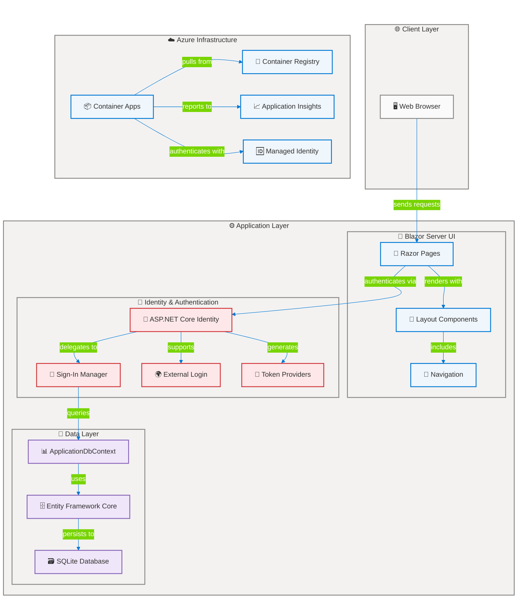

# Contoso Identity Provider

[](LICENSE)
[](https://dotnet.microsoft.com/)
[](https://learn.microsoft.com/aspnet/core/blazor/)
[](https://learn.microsoft.com/azure/container-apps/)

Contoso Identity Provider is a Blazor Server web application built on ASP.NET Core Identity that delivers secure user authentication, authorization, and third-party application registration for enterprise environments.

## 📖 Contoso Identity Provider

**Overview**

Contoso Identity Provider (IdP) is a full-featured identity management system built with .NET 9 and Blazor Server. It enables organizations to manage user identities, support external authentication providers, and register third-party OAuth 2.0 / OpenID Connect applications. The application is designed for deployment to Azure Container Apps using the Azure Developer CLI (`azd`) with infrastructure-as-code managed through Bicep templates.

> [!NOTE]
> This project uses a no-op email sender for development. For production deployments, replace `IdentityNoOpEmailSender` with a real SMTP or email service implementation.

## 🏗️ Architecture

**Overview**

The application follows a layered architecture with Blazor Server for the UI, ASP.NET Core Identity for authentication and authorization, and Entity Framework Core with SQLite for data persistence. Azure Container Apps serves as the deployment target with integrated monitoring through Application Insights.


```mermaid
---
title: Contoso Identity Provider Architecture
config:
  theme: base
  look: classic
  layout: dagre
  flowchart:
    htmlLabels: true
    curve: cardinal
  themeVariables:
    primaryColor: '#0078D4'
    primaryBorderColor: '#106EBE'
    primaryTextColor: '#FFFFFF'
    lineColor: '#0078D4'
    fontSize: '16px'
---
flowchart TD
    accTitle: Contoso Identity Provider Architecture
    accDescr: Shows the layered architecture of the Identity Provider including UI, authentication, data, and Azure infrastructure components

    %% ═══════════════════════════════════════════════════════════════════════════
    %% AZURE / FLUENT ARCHITECTURE PATTERN v1.1
    %% (Semantic + Structural + Font + Accessibility Governance)
    %% ═══════════════════════════════════════════════════════════════════════════
    %% PHASE 1 - FLUENT UI: All styling uses approved Fluent UI palette only
    %% PHASE 2 - GROUPS: Every subgraph has semantic color via style directive
    %% PHASE 3 - COMPONENTS: Every node has semantic classDef + icon prefix
    %% PHASE 4 - ACCESSIBILITY: accTitle/accDescr present, WCAG AA contrast
    %% PHASE 5 - STANDARD: Governance block present, classDefs centralized
    %% ═══════════════════════════════════════════════════════════════════════════

    subgraph client["🌐 Client Layer"]
        direction LR
        browser["🖥️ Web Browser"]:::neutral
    end

    subgraph app["⚙️ Application Layer"]
        direction TB

        subgraph ui["🎨 Blazor Server UI"]
            direction LR
            pages["📄 Razor Pages"]:::core
            layout["📐 Layout Components"]:::core
            nav["🧭 Navigation"]:::core
        end

        subgraph auth["🔐 Identity & Authentication"]
            direction LR
            identity["👤 ASP.NET Core Identity"]:::danger
            signin["🔑 Sign-In Manager"]:::danger
            external["🌍 External Login"]:::danger
            tokens["🎫 Token Providers"]:::danger
        end

        subgraph dataLayer["💾 Data Layer"]
            direction LR
            dbctx["📊 ApplicationDbContext"]:::data
            efcore["🗄️ Entity Framework Core"]:::data
            sqlite["🗃️ SQLite Database"]:::data
        end
    end

    subgraph azure["☁️ Azure Infrastructure"]
        direction LR
        aca["📦 Container Apps"]:::core
        acr["🐳 Container Registry"]:::core
        insights["📈 Application Insights"]:::core
        mid["🆔 Managed Identity"]:::core
    end

    browser -->|"sends requests"| pages
    pages -->|"renders with"| layout
    layout -->|"includes"| nav
    pages -->|"authenticates via"| identity
    identity -->|"delegates to"| signin
    identity -->|"supports"| external
    identity -->|"generates"| tokens
    signin -->|"queries"| dbctx
    dbctx -->|"uses"| efcore
    efcore -->|"persists to"| sqlite
    aca -->|"pulls from"| acr
    aca -->|"reports to"| insights
    aca -->|"authenticates with"| mid

    %% Centralized semantic classDefs
    classDef neutral fill:#FAFAFA,stroke:#8A8886,stroke-width:2px,color:#323130
    classDef core fill:#EFF6FC,stroke:#0078D4,stroke-width:2px,color:#323130
    classDef danger fill:#FDE7E9,stroke:#D13438,stroke-width:2px,color:#323130
    classDef data fill:#F0E6FA,stroke:#8764B8,stroke-width:2px,color:#323130

    %% Subgraph styling (6 subgraphs = 6 style directives)
    style client fill:#F3F2F1,stroke:#8A8886,stroke-width:2px,color:#323130
    style app fill:#F3F2F1,stroke:#8A8886,stroke-width:2px,color:#323130
    style ui fill:#F3F2F1,stroke:#8A8886,stroke-width:2px,color:#323130
    style auth fill:#F3F2F1,stroke:#8A8886,stroke-width:2px,color:#323130
    style dataLayer fill:#F3F2F1,stroke:#8A8886,stroke-width:2px,color:#323130
    style azure fill:#F3F2F1,stroke:#8A8886,stroke-width:2px,color:#323130
```

## ✨ Features

**Overview**

Contoso Identity Provider combines ASP.NET Core Identity with Blazor Server to deliver a comprehensive authentication and identity management platform. Key capabilities span user lifecycle management, external provider integration, and OAuth 2.0 application registration.

| Feature                  | Description                                                    | Status         |
| ------------------------ | -------------------------------------------------------------- | -------------- |
| 🔐 User Registration     | Email-based account creation with confirmation tokens          | ✅ Stable      |
| 🔑 Local Login           | Email and password authentication with cookie-based sessions   | ✅ Stable      |
| 🌍 External Login        | OAuth 2.0 / OpenID Connect external authentication providers   | ✅ Stable      |
| 🔒 Two-Factor Auth       | Support for multi-factor authentication flows                  | ✅ Stable      |
| 📝 App Registration      | Register third-party OAuth 2.0 / OIDC applications             | 🔧 In Progress |
| 👤 Profile Management    | User profile editing including phone number updates            | ✅ Stable      |
| 🔄 Password Recovery     | Forgot password and password reset workflows                   | ✅ Stable      |
| 🛡️ Account Lockout       | Automatic lockout on repeated failed login attempts            | ✅ Stable      |
| 📥 GDPR Data Export      | Download personal data as JSON for regulatory compliance       | ✅ Stable      |
| 🔁 Security Revalidation | Session stamp revalidation every 30 minutes on active circuits | ✅ Stable      |

## 📋 Requirements

**Overview**

Before running the Identity Provider locally, ensure the following tools and runtimes are installed. Azure deployments additionally require the Azure Developer CLI.

| Requirement            | Version | Purpose                                         |
| ---------------------- | ------- | ----------------------------------------------- |
| 🟣 .NET SDK            | 9.0+    | Build and run the application                   |
| 🗄️ SQLite              | Bundled | Local development database (included via NuGet) |
| 🔧 Git                 | 2.x+    | Clone the repository                            |
| ☁️ Azure Developer CLI | Latest  | Deploy to Azure Container Apps (optional)       |
| 🐳 Docker              | Latest  | Containerize the application (optional)         |

## 🚀 Quick Start

**1. Clone the repository**

```bash
git clone https://github.com/Evilazaro/IdentityProvider.git
cd IdentityProvider
```

**2. Restore dependencies**

```bash
dotnet restore
```

**3. Run the application**

```bash
cd src/IdentityProvider
dotnet run
```

Expected output:

```text
info: Microsoft.Hosting.Lifetime[14]
      Now listening on: https://localhost:7223
      Now listening on: http://localhost:5244
info: Microsoft.Hosting.Lifetime[0]
      Application started. Press Ctrl+C to shut down.
```

**4. Open the application**

Navigate to `https://localhost:7223` in your browser. The home page displays the Contoso Identity Provider welcome screen.

> [!TIP]
> In development mode, database migrations are applied automatically on startup. No manual migration commands are needed.

## 📦 Deployment

**Overview**

The application is configured for deployment to Azure Container Apps using the Azure Developer CLI (`azd`). The infrastructure is defined as Bicep templates in the `infra/` directory and provisions a Container Registry, Container Apps Environment, Application Insights, and a Managed Identity.

**1. Authenticate with Azure**

```bash
azd auth login
```

**2. Initialize the environment**

```bash
azd init
```

**3. Provision and deploy**

```bash
azd up
```

Expected output:

```text
Provisioning Azure resources (azd provision)
  (✓) Done: Resource group: rg-<environment-name>

Deploying services (azd deploy)
  (✓) Done: Service identity-provider

SUCCESS: Your application was provisioned and deployed to Azure.
```

The deployment creates the following Azure resources:

| Resource                       | Purpose                                           |
| ------------------------------ | ------------------------------------------------- |
| Resource Group                 | Logical container for all resources               |
| Container Registry             | Stores application container images               |
| Container Apps Environment     | Hosting environment for the container app         |
| Container App                  | Runs the Identity Provider (scales 1–10 replicas) |
| Application Insights           | Monitoring and telemetry collection               |
| Log Analytics Workspace        | Centralized logging                               |
| User-Assigned Managed Identity | Secure authentication to Azure services           |

## 💻 Usage

**Overview**

After starting the application, users can register accounts, log in, manage their profiles, and register third-party applications. The navigation menu adapts based on authentication state.

**Register a new user**

1. Navigate to `https://localhost:7223`
2. Click **Register** in the sidebar navigation
3. Enter an email address and password (minimum 6 characters)
4. Submit the form to create the account

**Log in**

```text
Navigate to: /Account/Login
Enter your email and password, then click "Log in".
```

**Access protected content**

After logging in, the **Auth Required** page at `/auth` displays your authenticated identity:

```text
You are authenticated
Hello user@example.com!
```

**Register an application**

Navigate to `/AppRegistrationForm` to register a new OAuth 2.0 / OIDC application by providing the Client ID, Client Secret, Tenant ID, Redirect URI, Scopes, Authority, App Name, Grant Types, and Response Types.

## ⚙️ Configuration

**Overview**

Application behavior is controlled through `appsettings.json` and environment variables. The connection string determines the database provider, and launch profiles configure local development URLs.

| Parameter                               | Description                        | Default                                        | Required |
| --------------------------------------- | ---------------------------------- | ---------------------------------------------- | -------- |
| `ConnectionStrings:DefaultConnection`   | Database connection string         | `Data Source=identityProviderDB.db;`           | ✅ Yes   |
| `ASPNETCORE_ENVIRONMENT`                | Runtime environment                | `Development`                                  | ✅ Yes   |
| `ASPNETCORE_URLS`                       | Listening URLs                     | `https://localhost:7223;http://localhost:5244` | No       |
| `APPLICATIONINSIGHTS_CONNECTION_STRING` | App Insights connection (Azure)    | —                                              | No       |
| `AZURE_CLIENT_ID`                       | Managed Identity client ID (Azure) | —                                              | No       |

**Database configuration** in `appsettings.json`:

```json
{
  "ConnectionStrings": {
    "DefaultConnection": "Data Source=identityProviderDB.db;"
  }
}
```

**Launch profiles** are defined in `Properties/launchSettings.json` with three options: `http`, `https`, and `IIS Express`.

> [!WARNING]
> The default configuration uses SQLite and the no-op email sender. For production, configure a production-grade database and a real email delivery service.

## 🧪 Testing

**Overview**

The project includes an MSTest-based test suite in `src/identityProviderTests/` with parallel execution enabled at the method level.

**Run all tests**

```bash
dotnet test
```

Expected output:

```text
Passed!  - Failed:     0, Passed:     7, Skipped:     0, Total:     7
```

## 🤝 Contributing

**Overview**

Contributions are welcome. Follow these guidelines to maintain code quality and consistency across the project.

1. Fork the repository
2. Create a feature branch (`git checkout -b feature/your-feature`)
3. Commit your changes (`git commit -m "Add your feature"`)
4. Push to the branch (`git push origin feature/your-feature`)
5. Open a Pull Request

## 📄 License

This project is licensed under the [MIT License](LICENSE).

Copyright (c) 2025 Evilázaro Alves
