# IdentityProvider


A modern ASP.NET Core Blazor Server application providing user authentication and identity management capabilities using ASP.NET Core Identity. Built with .NET 9.0 and designed for cloud deployment on Azure Container Apps.

**Overview**

IdentityProvider is a production-ready authentication solution that enables developers to quickly integrate secure user management into their applications. It leverages ASP.NET Core Identity for robust authentication and authorization, Entity Framework Core for data persistence, and Blazor Server for interactive UI components. The application is designed with cloud-native principles, featuring automated database migrations, infrastructure as code using Bicep, and seamless deployment to Azure Container Apps through Azure Developer CLI (azd). This project serves organizations needing a standalone identity provider that can be easily customized and scaled to meet specific authentication requirements.

The system architecture follows a three-tier pattern with presentation (Blazor components), business logic (ASP.NET Core Identity services), and data access (Entity Framework Core with SQLite for local development). It supports secure cookie-based authentication, user registration with email confirmation requirements, and extensible user profiles through the ApplicationUser model. The infrastructure automation ensures consistent deployments across environments while maintaining security best practices.

## 🏗️ Architecture

**Overview**

The IdentityProvider follows a modern web application architecture with clear separation of concerns between presentation, authentication services, and data persistence layers. The Blazor Server model provides a responsive single-page application experience while maintaining server-side rendering for enhanced security and performance. Authentication flows are handled entirely server-side using ASP.NET Core Identity, eliminating the need for client-side token management and reducing attack surface. The application integrates seamlessly with Azure Container Apps for production workloads, leveraging managed container orchestration, automatic scaling, and integrated monitoring.

Database operations utilize Entity Framework Core with automatic migration support, enabling zero-downtime deployments through code-first database updates. The SQLite database in development provides rapid iteration cycles, while production environments can easily switch to Azure SQL Database or PostgreSQL through configuration changes. Infrastructure provisioning is fully automated through Bicep templates, creating resource groups, container registries, and container app environments with consistent naming conventions and security configurations.

```mermaid
%%{init: {"flowchart": {"htmlLabels": false}} }%%
flowchart TB
    %% ============================================
    %% STANDARD COLOR SCHEME - DO NOT MODIFY
    %% ============================================
    %% Main Group Level (Neutral background)
    classDef mainGroup fill:#E8EAF6,stroke:#3F51B5,stroke-width:3px,color:#000

    %% Sub Group Level
    classDef subGroup fill:#C5CAE9,stroke:#3F51B5,stroke-width:2px,color:#000

    %% Content Level (Semantic colors)
    classDef mdBlue fill:#BBDEFB,stroke:#1976D2,stroke-width:2px,color:#000
    classDef mdGreen fill:#C8E6C9,stroke:#388E3C,stroke-width:2px,color:#000
    classDef mdRed fill:#FFCDD2,stroke:#D32F2F,stroke-width:2px,color:#000
    classDef mdYellow fill:#FFF9C4,stroke:#F57F17,stroke-width:2px,color:#000
    classDef mdOrange fill:#FFE0B2,stroke:#E64A19,stroke-width:2px,color:#000
    classDef mdPurple fill:#E1BEE7,stroke:#7B1FA2,stroke-width:2px,color:#000
    classDef mdTeal fill:#B2DFDB,stroke:#00796B,stroke-width:2px,color:#000
    classDef mdGrey fill:#F5F5F5,stroke:#616161,stroke-width:2px,color:#000
    %% ============================================

    %% ============================================
    %% COLOR SCHEME DOCUMENTATION (v2.1)
    %% ============================================
    %% Level 1 (Main Container): Indigo 50 (#E8EAF6)
    %%   - Used for: Top-level system container
    %%   - Purpose: Visual separation and hierarchy
    %%   - Stroke: Indigo 500 (#3F51B5), 3px
    %%
    %% Level 2 (Functional Siblings): SEMANTIC COLORS
    %%   - Presentation Layer → Blue (#BBDEFB)
    %%     Purpose: UI/interface components
    %%     Stroke: Blue 700 (#1976D2), 2px
    %%   - Service Layer → Orange (#FFE0B2)
    %%     Purpose: Security/authentication services
    %%     Stroke: Orange 800 (#E64A19), 2px
    %%   - Data Layer → Teal (#B2DFDB)
    %%     Purpose: Storage/persistence components
    %%     Stroke: Teal 700 (#00796B), 2px
    %%
    %% Level 3 (Content Nodes): Inherit parent subgraph color class
    %%   - Presentation nodes: mdBlue
    %%   - Service nodes: mdOrange
    %%   - Data nodes: mdTeal
    %%
    %% Accessibility: All colors meet WCAG AA contrast ratio
    %% requirements (4.5:1 minimum) against text (#000)
    %% ============================================

    %% ============================================
    %% ARCHITECTURE OVERVIEW
    %% ============================================
    %% This diagram represents a three-tier architecture:
    %% - Presentation Layer: User-facing Blazor components
    %% - Service Layer: Authentication & authorization logic
    %% - Data Layer: Database persistence with EF Core
    %%
    %% Design Pattern: Layered architecture with clear
    %% separation of concerns for maintainability
    %% ============================================

    subgraph system["IdentityProvider Architecture"]
        direction TB

        subgraph presentation["Presentation Layer"]
            blazor["🎨 Blazor Server<br/>Components"]:::mdBlue
            razor["📄 Razor Pages<br/>(Account UI)"]:::mdBlue
        end

        subgraph services["Service Layer"]
            identity["🔒 ASP.NET Core<br/>Identity"]:::mdOrange
            auth["🔑 Authentication<br/>Services"]:::mdOrange
        end

        subgraph data["Data Layer"]
            ef["⚙️ Entity Framework<br/>Core"]:::mdTeal
            db[("🗄️ SQLite Database<br/>(Dev/Prod)")]:::mdTeal
        end

        blazor -->|"User Interactions"| identity
        razor -->|"Login/Register"| identity
        identity -->|"User Management"| auth
        auth -->|"Data Access"| ef
        ef -->|"SQL Queries"| db
    end

    %% Apply semantic colors to functional sibling subgraphs
    %% Presentation = UI layer -> Blue (#BBDEFB)
    %% Services = Security/Auth layer -> Orange (#FFE0B2)
    %% Data = Storage layer -> Teal (#B2DFDB)
    style system fill:#E8EAF6,stroke:#3F51B5,stroke-width:3px
    style presentation fill:#BBDEFB,stroke:#1976D2,stroke-width:2px
    style services fill:#FFE0B2,stroke:#E64A19,stroke-width:2px
    style data fill:#B2DFDB,stroke:#00796B,stroke-width:2px
```



## 🚀 Quick Start

**Overview**

Get started with IdentityProvider in under 5 minutes by running the application locally. The quick start provides the minimal commands needed to see authentication in action, including user registration and login flows. This rapid setup approach uses SQLite for database storage, eliminating external dependencies and configuration overhead during evaluation. For developers new to Blazor or ASP.NET Core Identity, this serves as an excellent learning environment to explore identity management patterns and interactive UI components.

> ⚠️ **Prerequisites**: Ensure [.NET 9.0 SDK](https://dotnet.microsoft.com/download/dotnet/9.0) is installed before proceeding.

```bash
# Clone and navigate to project
git clone https://github.com/Evilazaro/IdentityProvider.git
cd IdentityProvider/src/IdentityProvider

# Run the application
dotnet run
```

Navigate to `https://localhost:5001` in your browser. The application will automatically create the SQLite database and apply migrations on first run.

## 📦 Deployment

**Overview**

IdentityProvider supports multiple deployment strategies tailored to different environments and operational requirements. Local development uses SQLite with automatic migrations for rapid iteration, while production deployments leverage Azure Container Apps for enterprise-scale hosting with built-in autoscaling and monitoring. The Azure Developer CLI (azd) streamlines the entire provisioning and deployment workflow, handling resource creation, container registry setup, image building, and application deployment through a single command.

Infrastructure as Code using Bicep ensures deployment consistency and enables version-controlled infrastructure changes. The provided templates create all necessary Azure resources including resource groups, container registries, managed identities, and container app environments with security best practices applied by default. For teams requiring custom infrastructure, the Bicep modules are fully parameterized and support environment-specific configuration through parameter files.

### Local Development

1. **Clone the repository**:

   ```bash
   git clone https://github.com/Evilazaro/IdentityProvider.git
   cd IdentityProvider
   ```

2. **Restore dependencies**:

   ```bash
   dotnet restore
   ```

3. **Run the application**:

   ```bash
   cd src/IdentityProvider
   dotnet run
   ```

4. **Verify deployment**:
   - Open browser to `https://localhost:5001`
   - Register a new account using the Register link
   - Confirm email (development mode uses console output)
   - Login with created credentials

> 💡 **Tip**: Database file `identityProviderDB.db` is created automatically in the project directory. Delete this file to reset the database.

### Azure Container Apps Deployment

> ⚠️ **Prerequisites**: Install [Azure CLI](https://docs.microsoft.com/cli/azure/install-azure-cli) and [Azure Developer CLI (azd)](https://learn.microsoft.com/azure/developer/azure-developer-cli/install-azd).

1. **Login to Azure**:

   ```bash
   az login
   azd auth login
   ```

2. **Initialize and provision infrastructure**:

   ```bash
   azd init
   azd up
   ```

3. **Deploy updates** (after code changes):
   ```bash
   azd deploy
   ```

The `azd up` command provisions all Azure resources defined in [infra/main.bicep](infra/main.bicep) and deploys the containerized application to Azure Container Apps.

## 💻 Usage

**Overview**

IdentityProvider provides a complete authentication experience through its Blazor-based user interface and ASP.NET Core Identity integration. Users can register new accounts with email-based confirmation workflows, securely login with cookie-based authentication, and manage their profile information through intuitive components. The application demonstrates best practices for implementing authentication in Blazor Server applications, including proper handling of authentication state, secure route protection, and user session management.

Developers can extend the base `ApplicationUser` model to include custom user properties, add additional Identity features like two-factor authentication, or integrate external authentication providers such as Microsoft, Google, or Facebook. The codebase serves as a reference implementation for building production authentication systems with comprehensive error handling, security headers, and protection against common web vulnerabilities.

### Basic Authentication Flow

```csharp
// Example: Accessing authenticated user information in Blazor components
@page "/profile"
@using Microsoft.AspNetCore.Authorization
@attribute [Authorize]

<AuthorizeView>
    <Authorized>
        <h3>Welcome, @context.User.Identity.Name!</h3>
        <p>Email: @context.User.FindFirst("email")?.Value</p>
    </Authorized>
    <NotAuthorized>
        <p>Please log in to view this page.</p>
    </NotAuthorized>
</AuthorizeView>
```

### User Registration

Navigate to `/Account/Register` to create a new user account. The registration process includes:

1. Email and password input with validation
2. Password confirmation matching
3. Email confirmation requirement (configurable)
4. Automatic database user creation

### Demo

Run the application locally to see the authentication system in action:

1. Register a new account at `https://localhost:5001/Account/Register`
2. Check console output for email confirmation link (in development mode)
3. Login at `https://localhost:5001/Account/Login`
4. Access protected pages requiring authentication

## ✨ Features

**Overview**

IdentityProvider delivers enterprise-ready authentication capabilities built on proven ASP.NET Core Identity foundations. The feature set balances security, usability, and extensibility, providing developers with production-grade identity management without vendor lock-in. Each feature integrates seamlessly with the Blazor Server architecture, maintaining consistent user experience across all authentication workflows while adhering to OWASP security recommendations.

The modular design allows selective feature adoption and customization based on specific application requirements. Teams can extend the base functionality with additional Identity features such as two-factor authentication, external login providers, or role-based access control without modifying core authentication logic.

| Feature                      | Description                                                                                              | Benefits                                                                                                                                                                     |
| ---------------------------- | -------------------------------------------------------------------------------------------------------- | ---------------------------------------------------------------------------------------------------------------------------------------------------------------------------- |
| 🔐 **User Authentication**   | Cookie-based authentication using ASP.NET Core Identity with secure password hashing (PBKDF2)            | Eliminates need for custom authentication logic; leverages battle-tested security implementations with built-in protection against timing attacks and rainbow table exploits |
| 📧 **Email Confirmation**    | Account activation workflow requiring email verification before login access                             | Prevents automated bot registrations and verifies user contact information; configurable for development environments to streamline testing                                  |
| 🎨 **Blazor UI Components**  | Interactive server-rendered components for registration, login, and profile management                   | Provides responsive single-page application experience while maintaining server-side security; reduces client-side attack surface compared to SPA architectures              |
| 🗄️ **Entity Framework Core** | Code-first database approach with automatic migration support and SQLite/SQL Server compatibility        | Enables rapid schema changes during development; supports seamless database provider switching between environments without code modifications                               |
| ☁️ **Azure-Ready**           | Container-based deployment with full Bicep infrastructure automation and Azure Developer CLI integration | Achieves production deployment in minutes with consistent infrastructure provisioning; supports multiple environments (dev/staging/prod) through parameter files             |

## 📋 Requirements

**Overview**

IdentityProvider has minimal runtime dependencies, requiring only the .NET 9.0 SDK for development and execution. The modular architecture allows deployment across various platforms including Windows, macOS, and Linux without platform-specific modifications. Database requirements are flexible, supporting both embedded SQLite for development scenarios and enterprise database systems like SQL Server or PostgreSQL for production workloads.

Azure deployment requires an active Azure subscription with permissions to create resource groups, container registries, and container apps. The infrastructure templates automatically provision all necessary Azure services, eliminating manual resource configuration. For teams using existing Azure resources, the Bicep templates support parameter customization to integrate with pre-existing virtual networks, storage accounts, or monitoring solutions.

| Category              | Requirements                                                                    | More Information                                                                                                                                                                                                                 |
| --------------------- | ------------------------------------------------------------------------------- | -------------------------------------------------------------------------------------------------------------------------------------------------------------------------------------------------------------------------------- |
| **Runtime**           | .NET 9.0 SDK or later                                                           | [Download .NET 9.0](https://dotnet.microsoft.com/download/dotnet/9.0)                                                                                                                                                            |
| **Operating System**  | Windows 10+, macOS 11+, or Linux (Ubuntu 20.04+, Debian 11+)                    | [.NET supported OS versions](https://github.com/dotnet/core/blob/main/release-notes/9.0/supported-os.md)                                                                                                                         |
| **Database**          | SQLite 3.x (included) or SQL Server 2019+ for production                        | [Entity Framework Core database providers](https://docs.microsoft.com/ef/core/providers/)                                                                                                                                        |
| **Development Tools** | Visual Studio 2022 17.8+, VS Code with C# extension, or JetBrains Rider 2023.3+ | [Visual Studio](https://visualstudio.microsoft.com/), [VS Code C# Extension](https://marketplace.visualstudio.com/items?itemName=ms-dotnettools.csharp)                                                                          |
| **Azure Deployment**  | Azure subscription, Azure CLI 2.50+, Azure Developer CLI 1.5+                   | [Azure free account](https://azure.microsoft.com/free/), [Install Azure CLI](https://docs.microsoft.com/cli/azure/install-azure-cli), [Install azd](https://learn.microsoft.com/azure/developer/azure-developer-cli/install-azd) |

## 🔧 Configuration

**Overview**

IdentityProvider configuration follows ASP.NET Core conventions with environment-specific settings managed through `appsettings.json` files and user secrets for sensitive data. The application supports configuration through multiple sources including JSON files, environment variables, and command-line arguments, enabling flexible deployment across diverse hosting environments. Database connection strings, identity options, and logging levels can be customized without code changes through the unified configuration system.

For Azure deployments, configuration is injected at runtime through environment variables managed by Azure Container Apps configuration settings. This approach separates configuration from application code, adhering to twelve-factor app principles and enabling secure secrets management through Azure Key Vault integration. Teams can maintain distinct configurations for development, staging, and production environments while using a single application codebase.

### Application Settings

Configuration is managed through [appsettings.json](src/IdentityProvider/appsettings.json):

```json
{
  "ConnectionStrings": {
    "DefaultConnection": "Data Source=identityProviderDB.db;"
  },
  "Logging": {
    "LogLevel": {
      "Default": "Information",
      "Microsoft.AspNetCore": "Warning"
    }
  },
  "AllowedHosts": "*"
}
```

### Environment Variables

Override configuration using environment variables (useful for Azure deployment):

```bash
# Database connection string
ConnectionStrings__DefaultConnection="Server=tcp:your-server.database.windows.net,1433;Database=identitydb;User ID=admin;Password=your-password;"

# Logging level
Logging__LogLevel__Default="Debug"
```

### Identity Options

Customize ASP.NET Core Identity behavior in [Program.cs](src/IdentityProvider/Program.cs):

```csharp
builder.Services.AddIdentityCore<ApplicationUser>(options =>
{
    options.SignIn.RequireConfirmedAccount = true;  // Require email confirmation
    options.Password.RequireDigit = true;
    options.Password.RequireLowercase = true;
    options.Password.RequireUppercase = true;
    options.Password.RequireNonAlphanumeric = true;
    options.Password.RequiredLength = 8;
})
```

> 💡 **Tip**: Use [User Secrets](https://docs.microsoft.com/aspnet/core/security/app-secrets) for local development to avoid committing sensitive data to source control.

## 🤝 Contributing

**Overview**

Contributions to IdentityProvider are welcome and appreciated from developers of all experience levels. The project values code quality, thorough testing, and clear communication in all contributions. Whether reporting bugs, suggesting features, improving documentation, or submitting code changes, all contributions help make IdentityProvider more robust and useful for the community.

The contribution process emphasizes collaborative development through pull requests with comprehensive descriptions and adherence to existing code patterns. Maintainers review submissions promptly and provide constructive feedback to help contributors refine their changes. By participating in this project, contributors gain experience with modern ASP.NET Core development practices, cloud deployment patterns, and open-source collaboration workflows.

1. Fork the repository
2. Create a feature branch: `git checkout -b feature/your-feature-name`
3. Commit your changes: `git commit -am 'Add new feature'`
4. Push to the branch: `git push origin feature/your-feature-name`
5. Submit a pull request with a clear description of changes

### Contribution Guidelines

- Follow existing code style and naming conventions
- Add unit tests for new functionality in [identityProviderTests](src/identityProviderTests)
- Update documentation to reflect changes
- Ensure all tests pass before submitting PR: `dotnet test`

> 💡 **Tip**: Check the [GitHub Issues](https://github.com/Evilazaro/IdentityProvider/issues) for good first issues labeled `good-first-issue`.

## 📝 License

This project is licensed under the MIT License - see the [LICENSE](LICENSE) file for details.

Copyright (c) 2025 Evilázaro Alves
