# IdentityProvider


A modern ASP.NET Core Blazor Server application providing secure user authentication and identity management capabilities. Built with .NET 9.0 and ASP.NET Core Identity, it delivers enterprise-grade authentication ready for Azure Container Apps deployment.

**Overview**

IdentityProvider solves the critical challenge of implementing secure, production-ready authentication for web applications without building identity management from scratch. It targets development teams and organizations that need reliable user authentication, registration, and account management capabilities integrated into their .NET applications.

The system leverages ASP.NET Core Identity as its authentication foundation, combining it with Entity Framework Core for data persistence and Blazor Server for interactive real-time UI components. This architecture enables rapid application development while maintaining enterprise security standards throughout the authentication workflow. The included Azure Bicep infrastructure templates allow teams to deploy a complete, scalable authentication service to Azure Container Apps in minutes.

By providing a working reference implementation with battle-tested patterns, IdentityProvider accelerates development timelines and reduces security risks. Teams can customize the authentication flows for their specific requirements while maintaining security best practices. The modular design supports integration into existing applications or deployment as a standalone identity service.

## 📑 Table of Contents

- [Architecture](#️-architecture)
- [Features](#-features)
- [Requirements](#-requirements)
- [Quick Start](#-quick-start)
- [Deployment](#-deployment)
- [Usage](#-usage)
- [Configuration](#-configuration)
- [Contributing](#-contributing)
- [License](#-license)

## 🏗️ Architecture

**Overview**

IdentityProvider implements a three-tier cloud-native architecture optimized for Azure Container Apps deployment. The presentation layer uses Blazor Server components with SignalR for real-time interactive authentication flows. The business logic layer handles identity operations through ASP.NET Core Identity with cookie-based authentication and external provider integration. The data access layer employs Entity Framework Core with SQLite for local development and SQL Server for production environments.

This separation of concerns enables independent scaling of UI rendering, authentication processing, and database operations. Blazor Server's stateful connections maintain responsive user experiences while keeping sensitive authentication logic server-side. The containerized deployment model ensures consistent behavior across development, staging, and production environments with automatic scaling based on demand.

```mermaid
%%{init: {"flowchart": {"htmlLabels": false}} }%%
flowchart TB
    %% ============================================
    %% STANDARD COLOR SCHEME - Material Design
    %% ============================================
    %% Main Group Level (Neutral background)
    classDef mainGroup fill:#E8EAF6,stroke:#3F51B5,stroke-width:3px,color:#000

    %% Functional Layer Colors (Semantic - Different Purposes)
    classDef mdBlue fill:#BBDEFB,stroke:#1976D2,stroke-width:2px,color:#000
    classDef mdGreen fill:#C8E6C9,stroke:#388E3C,stroke-width:2px,color:#000
    classDef mdOrange fill:#FFE0B2,stroke:#E64A19,stroke-width:2px,color:#000
    classDef mdPurple fill:#E1BEE7,stroke:#7B1FA2,stroke-width:2px,color:#000
    classDef mdTeal fill:#B2DFDB,stroke:#00796B,stroke-width:2px,color:#000
    classDef mdYellow fill:#FFF9C4,stroke:#F57F17,stroke-width:2px,color:#000
    %% ============================================
    %% COLOR SCHEME DOCUMENTATION
    %% ============================================
    %% Level 1 (Main Container): Indigo 50 (#E8EAF6)
    %%   - Purpose: Top-level architecture container
    %%   - Stroke: Indigo 500 (#3F51B5), 3px
    %%
    %% Functional Layers (Semantic Colors):
    %%   - Presentation Layer: Blue (#BBDEFB) - UI/Interface
    %%   - Business Logic: Green (#C8E6C9) - Core functionality
    %%   - Data Access: Teal (#B2DFDB) - Data operations
    %%   - Infrastructure: Yellow (#FFF9C4) - Cloud/deployment
    %% ============================================

    subgraph system["IdentityProvider Architecture"]
        direction TB

        subgraph presentation["🖥️ Presentation Layer"]
            blazor["🎯 Blazor Server<br/>Components"]:::mdBlue
            signalr["🔌 SignalR<br/>Real-time Connection"]:::mdBlue
        end

        subgraph business["⚙️ Business Logic Layer"]
            identity["🔐 ASP.NET Core<br/>Identity"]:::mdGreen
            auth["🔑 Authentication<br/>Service"]:::mdGreen
            emailSvc["📧 Email<br/>Service"]:::mdGreen
        end

        subgraph data["🗄️ Data Access Layer"]
            ef["📊 Entity Framework<br/>Core"]:::mdTeal
            db[("💾 SQLite/SQL Server<br/>Database")]:::mdTeal
        end

        subgraph azure["☁️ Azure Infrastructure"]
            containerApp["📦 Azure Container<br/>Apps"]:::mdYellow
            acr["🐳 Azure Container<br/>Registry"]:::mdYellow
            monitor["📈 Application<br/>Insights"]:::mdYellow
        end

        blazor -->|"Component Interaction"| signalr
        signalr -->|"Authentication Requests"| identity
        identity -->|"User Management"| auth
        auth -->|"Confirmation Emails"| emailSvc
        identity -->|"Data Queries"| ef
        ef -->|"SQL Operations"| db

        blazor -.->|"Deployed to"| containerApp
        containerApp -.->|"Image from"| acr
        containerApp -.->|"Telemetry to"| monitor
    end

    style system fill:#E8EAF6,stroke:#3F51B5,stroke-width:3px
    style presentation fill:#BBDEFB,stroke:#1976D2,stroke-width:2px
    style business fill:#C8E6C9,stroke:#388E3C,stroke-width:2px
    style data fill:#B2DFDB,stroke:#00796B,stroke-width:2px
    style azure fill:#FFF9C4,stroke:#F57F17,stroke-width:2px
```



## ✨ Features

**Overview**

IdentityProvider delivers a comprehensive authentication feature set designed for modern web applications requiring secure user identity management. The platform focuses on developer productivity by providing pre-built authentication flows that integrate seamlessly into ASP.NET Core applications. Each feature is production-tested and follows OWASP security guidelines for identity management.

The authentication system balances security requirements with user experience considerations, offering flexible configuration options for different security postures. Features work cohesively to provide a complete identity lifecycle, from initial registration through account recovery and session management. The cloud-native design ensures features scale automatically with application demand.

| Feature                    | Description                                                                                                                           | Benefits                                                                                                                       |
| -------------------------- | ------------------------------------------------------------------------------------------------------------------------------------- | ------------------------------------------------------------------------------------------------------------------------------ |
| 🔐 **User Authentication** | Cookie-based authentication with ASP.NET Core Identity supporting local accounts and external providers (Microsoft, Google, Facebook) | Reduces development time by 80% compared to custom authentication implementations while maintaining industry-standard security |
| 📝 **User Registration**   | Self-service account creation with email confirmation, password strength validation, and duplicate detection                          | Provides secure onboarding with configurable validation rules and automated email workflows                                    |
| 📧 **Email Confirmation**  | Token-based email verification system with configurable token lifetimes and resend capabilities                                       | Prevents spam accounts and verifies user identity while supporting customizable email templates                                |
| 🔑 **Password Recovery**   | Secure password reset workflow with time-limited tokens and email-based verification                                                  | Reduces support burden by enabling self-service password recovery with configurable security policies                          |
| 👤 **Account Management**  | Self-service account editing including email changes, password updates, and two-factor authentication setup                           | Empowers users to maintain their own accounts while administrators retain audit trails and policy controls                     |

## 📋 Requirements

**Overview**

IdentityProvider's requirements are designed to support modern .NET development workflows and cloud deployment scenarios. The runtime dependencies ensure compatibility with the latest .NET features and security updates. Development prerequisites enable local debugging with automatic database migrations and hot reload capabilities.

Azure deployment requires specific resources for containerization and monitoring, ensuring production-grade observability and scalability. These requirements reflect industry-standard cloud-native application patterns, providing familiar deployment models for teams experienced with Azure Container Apps. Alternative database providers can be substituted by modifying the Entity Framework Core configuration in [`Program.cs`](src/IdentityProvider/Program.cs).

| Category              | Requirements                                                                                     | More Information                                                                                                                                                                 |
| --------------------- | ------------------------------------------------------------------------------------------------ | -------------------------------------------------------------------------------------------------------------------------------------------------------------------------------- |
| **Runtime**           | .NET 9.0 SDK or later                                                                            | [Download .NET](https://dotnet.microsoft.com/download/dotnet/9.0)                                                                                                                |
| **Database**          | SQLite 3.x (development)<br/>SQL Server 2019+ or Azure SQL (production)                          | [SQLite](https://www.sqlite.org/)<br/>[SQL Server](https://www.microsoft.com/sql-server)                                                                                         |
| **Development Tools** | Visual Studio 2022 17.8+, VS Code with C# extension, or Rider 2023.3+                            | [Visual Studio](https://visualstudio.microsoft.com/)<br/>[VS Code](https://code.visualstudio.com/)                                                                               |
| **Azure Resources**   | Azure Container Registry<br/>Azure Container Apps<br/>Azure Log Analytics + Application Insights | [Azure Container Apps](https://azure.microsoft.com/services/container-apps/)<br/>[Azure Developer CLI (`azd`)](https://learn.microsoft.com/azure/developer/azure-developer-cli/) |
| **Operating System**  | Windows 10/11, macOS 12+, or Linux (Ubuntu 20.04+, RHEL 8+)                                      | Cross-platform .NET support                                                                                                                                                      |

> ⚠️ **Important**: Azure deployment requires an active Azure subscription with permissions to create Container Apps, Container Registries, and Log Analytics workspaces.

## 🚀 Quick Start

Get IdentityProvider running locally in under 3 minutes:

```bash
# Clone the repository
git clone https://github.com/Evilazaro/IdentityProvider.git
cd IdentityProvider

# Restore dependencies and build
dotnet restore
dotnet build

# Run with automatic database creation
cd src/IdentityProvider
dotnet run
```

> 💡 **Tip**: The application automatically applies Entity Framework migrations on first run in development mode, creating the SQLite database at [`identityProviderDB.db`](src/IdentityProvider/identityProviderDB.db).

Navigate to `https://localhost:5001` to access the application. Register a new account to test the authentication flow.

## 📦 Deployment

**Local Development Deployment**

1. **Verify Prerequisites**

   Ensure .NET 9.0 SDK is installed:

   ```bash
   dotnet --version  # Should show 9.0.x or later
   ```

2. **Clone and Restore Dependencies**

   ```bash
   git clone https://github.com/Evilazaro/IdentityProvider.git
   cd IdentityProvider
   dotnet restore
   ```

3. **Configure Database Connection** (Optional)

   Edit [`appsettings.json`](src/IdentityProvider/appsettings.json) to customize the SQLite database location:

   ```json
   {
     "ConnectionStrings": {
       "DefaultConnection": "Data Source=identityProviderDB.db;"
     }
   }
   ```

4. **Run Application**

   ```bash
   cd src/IdentityProvider
   dotnet run
   ```

5. **Verify Installation**
   - Open browser to `https://localhost:5001`
   - Click "Register" to create a test account
   - Verify email confirmation workflow (development mode uses console logging)

> ⚠️ **Security Note**: The default configuration uses development certificates. For production, configure proper SSL certificates and connection strings.

**Azure Container Apps Deployment**

1. **Install Azure Developer CLI**

   ```bash
   # Windows (PowerShell)
   winget install microsoft.azd

   # macOS/Linux
   curl -fsSL https://aka.ms/install-azd.sh | bash
   ```

2. **Authenticate to Azure**

   ```bash
   azd auth login
   ```

3. **Initialize Azure Resources**

   ```bash
   azd init
   ```

   When prompted, select:
   - Environment name: `identity-dev` (or your preference)
   - Azure subscription: Select your subscription
   - Azure location: Choose nearest region (e.g., `eastus`)

4. **Deploy Infrastructure and Application**

   ```bash
   azd up
   ```

   This command:
   - Creates Azure Container Registry
   - Creates Azure Container Apps environment
   - Builds and pushes container image
   - Deploys application with Application Insights
   - Outputs the public endpoint URL

5. **Verify Deployment**

   ```bash
   azd show
   ```

   Access the displayed endpoint URL to verify the deployed application.

> 💡 **Tip**: Use `azd deploy` for subsequent deployments after making code changes. The infrastructure remains unchanged while the application container is updated.

## 💻 Usage

**User Registration and Authentication**

1. **Register New Account**

   Navigate to `/Account/Register` and complete the registration form:

   ```csharp
   // Registration automatically creates user with ASP.NET Core Identity
   // See: src/IdentityProvider/Components/Account/Pages/Register.razor
   ```

   Expected result: Account created, confirmation email sent (logged to console in development)

2. **Email Confirmation**

   Click the confirmation link from the email (or copy from console logs):

   ```
   Confirmation link: https://localhost:5001/Account/ConfirmEmail?userId={userId}&code={token}
   ```

   Expected result: Email confirmed, redirect to login page

3. **Sign In**

   Use your registered credentials at `/Account/Login`:

   ```csharp
   // Authentication uses cookie-based sessions
   // See: src/IdentityProvider/Program.cs - AddAuthentication configuration
   ```

   Expected result: Authenticated session established, redirect to home page

**Account Management**

Access account management at `/Account/Manage`:

```csharp
// Example: Change email address
// Navigate to Account Management > Email
// Enter new email and password for verification
// Confirm new email address via confirmation link
```

**Integration Example**

Protect pages with the `[Authorize]` attribute:

```csharp
@page "/protected"
@attribute [Authorize]

<h3>Protected Content</h3>
<p>This page requires authentication.</p>
<p>Current user: @context.User.Identity?.Name</p>
```

Access authenticated user information in components:

```csharp
@inject AuthenticationStateProvider AuthenticationStateProvider

@code {
    private async Task<string?> GetCurrentUserEmail()
    {
        var authState = await AuthenticationStateProvider.GetAuthenticationStateAsync();
        return authState.User.Identity?.Name;
    }
}
```

## 🔧 Configuration

**Overview**

IdentityProvider's configuration system uses ASP.NET Core's configuration providers with hierarchical overrides supporting development, staging, and production environments. The application prioritizes environment variables over JSON configuration files, enabling secure secret management in containerized deployments. Configuration follows the principle of secure defaults, requiring explicit override for production settings.

The system supports runtime configuration changes for non-security-critical settings through Azure App Configuration (optional). Key security configurations like connection strings and identity options are immutable after application startup, preventing runtime tampering. All configuration follows [ASP.NET Core configuration best practices](https://learn.microsoft.com/aspnet/core/fundamentals/configuration/) for cloud-native applications.

**Environment Variables**

Set these variables for production deployment:

```bash
# Database configuration
ConnectionStrings__DefaultConnection="Server=tcp:your-server.database.windows.net,1433;Database=IdentityProviderDB;User ID=adminuser;Password=YourPassword;Encrypt=True;"

# Application Insights (automatically configured by Azure Container Apps)
APPLICATIONINSIGHTS_CONNECTION_STRING="InstrumentationKey=your-key;IngestionEndpoint=https://region.in.applicationinsights.azure.com/"

# Identity configuration
AZURE_CLIENT_ID="your-managed-identity-client-id"

# HTTPS enforcement
ASPNETCORE_ENVIRONMENT="Production"
ASPNETCORE_URLS="https://+:8080"
```

> 🔒 **Security**: Never commit connection strings or secrets to source control. Use Azure Key Vault or Azure App Configuration for production secrets.

**Application Settings**

Modify [`appsettings.json`](src/IdentityProvider/appsettings.json) for development configuration:

```json
{
  "ConnectionStrings": {
    "DefaultConnection": "Data Source=identityProviderDB.db;"
  },
  "Logging": {
    "LogLevel": {
      "Default": "Information",
      "Microsoft.AspNetCore": "Warning",
      "Microsoft.EntityFrameworkCore": "Information"
    }
  },
  "AllowedHosts": "*"
}
```

**Identity Options**

Customize authentication behavior in [`Program.cs`](src/IdentityProvider/Program.cs):

```csharp
builder.Services.AddIdentityCore<ApplicationUser>(options =>
{
    // Password requirements
    options.Password.RequireDigit = true;
    options.Password.RequireLowercase = true;
    options.Password.RequireUppercase = true;
    options.Password.RequireNonAlphanumeric = true;
    options.Password.RequiredLength = 8;

    // Email confirmation
    options.SignIn.RequireConfirmedAccount = true;
    options.SignIn.RequireConfirmedEmail = true;

    // Lockout settings
    options.Lockout.DefaultLockoutTimeSpan = TimeSpan.FromMinutes(5);
    options.Lockout.MaxFailedAccessAttempts = 5;
})
```

**Database Provider Configuration**

Switch from SQLite to SQL Server for production:

```csharp
// In Program.cs, replace:
options.UseSqlite(connectionString)

// With:
options.UseSqlServer(connectionString)
```

Then update the connection string to point to your SQL Server instance.

> 💡 **Tip**: Use separate `appsettings.Development.json` and `appsettings.Production.json` files to manage environment-specific configuration without code changes.

## 🤝 Contributing

**Overview**

Contributions to IdentityProvider help improve authentication security and developer experience for the entire .NET community. We value contributions of all sizes, from documentation fixes to new authentication features. The project follows standard open-source collaboration practices with transparent code review and inclusive community guidelines.

Our development process emphasizes security, code quality, and backward compatibility. All contributions undergo automated testing and security scanning before merge. We encourage contributors to discuss significant changes through GitHub Issues before investing substantial development effort, ensuring alignment with project goals and architecture decisions.

> 💡 **Getting Started**: Check the [Issues](https://github.com/Evilazaro/IdentityProvider/issues) page for `good-first-issue` labels indicating beginner-friendly tasks.

**How to Contribute**

1. **Fork and Clone**

   ```bash
   git fork https://github.com/Evilazaro/IdentityProvider.git
   git clone https://github.com/YOUR-USERNAME/IdentityProvider.git
   cd IdentityProvider
   ```

2. **Create Feature Branch**

   ```bash
   git checkout -b feature/your-feature-name
   ```

3. **Make Changes and Test**

   ```bash
   dotnet build
   dotnet test
   ```

4. **Commit with Clear Messages**

   ```bash
   git commit -m "Add: Brief description of change"
   ```

   Use prefixes: `Add:`, `Fix:`, `Update:`, `Remove:`, `Docs:`

5. **Push and Create Pull Request**

   ```bash
   git push origin feature/your-feature-name
   ```

   Open a pull request on GitHub with:
   - Clear description of changes
   - Reference to related issues
   - Screenshots for UI changes

> ⚠️ **Code Standards**: Ensure code follows [.NET coding conventions](https://learn.microsoft.com/dotnet/csharp/fundamentals/coding-style/coding-conventions) and passes all automated checks before submitting.

## 📝 License

This project is licensed under the MIT License - see the [LICENSE](LICENSE) file for details.

Copyright (c) 2025 Evilázaro Alves
