# IdentityProvider


IdentityProvider is a `net9.0` ASP.NET Core Blazor Server application with built-in ASP.NET Core Identity and Entity Framework Core over SQLite. It includes local authentication flows, identity account management endpoints, and Azure Container Apps deployment infrastructure through `azd` and Bicep.

**Overview**

This project provides a foundation for an identity-focused web application using cookie authentication, Identity UI components, and a SQLite-backed user store. It is structured for both local development and cloud deployment, with infrastructure defined in `infra/main.bicep` and service orchestration in `azure.yaml`.

The solution contains two projects: the main web app in `src/IdentityProvider` and a test project in `src/identityProviderTests`. The app also includes custom components such as an authenticated page (`/auth`) and an app registration form (`/AppRegistrationForm`) modeled by `AppRegistration`.

## Table of Contents

- [Architecture](#architecture)
- [Features](#features)
- [Requirements](#requirements)
- [Quick Start](#quick-start)
- [Deployment](#deployment)
- [Usage](#usage)
- [Configuration](#configuration)
- [Testing](#testing)
- [Project Structure](#project-structure)
- [Contributing](#contributing)
- [License](#license)

## Architecture

```mermaid
---
title: IdentityProvider Architecture
config:
  theme: base
  look: classic
  layout: dagre
  flowchart:
    htmlLabels: true
---
flowchart LR
    accTitle: IdentityProvider Runtime and Deployment Architecture
    accDescr: Blazor Server app with ASP.NET Core Identity and SQLite, deployed to Azure Container Apps with managed identity and Azure Container Registry.

    classDef core fill:#DEECF9,stroke:#0078D4,stroke-width:2px,color:#004578
    classDef success fill:#DFF6DD,stroke:#107C10,stroke-width:2px,color:#0B6A0B
    classDef neutral fill:#FAFAFA,stroke:#8A8886,stroke-width:2px,color:#323130
    classDef warning fill:#FFF4CE,stroke:#986F0B,stroke-width:2px,color:#3B2C00

    subgraph local["🧩 Application Runtime"]
      direction LR
      browser["🌐 Browser Client"]:::core
      blazor["⚙️ Blazor Server App\nASP.NET Core Identity"]:::success
      sqlite[("🗄️ SQLite Database\nidentityProviderDB.db")]:::neutral
      browser -->|"sends authenticated requests"| blazor
      blazor -->|"reads and writes user data"| sqlite
    end

    subgraph cloud["☁️ Azure Deployment"]
      direction LR
      azd["🧪 Azure Developer CLI\nazd"]:::warning
      aca["📦 Azure Container App\nidentity-provider"]:::core
      acr["💾 Azure Container Registry"]:::neutral
      ai["📊 Application Insights"]:::neutral
      azd -->|"provisions and deploys"| aca
      aca -->|"pulls container image"| acr
      aca -->|"emits telemetry"| ai
    end

    style local fill:#F3F2F1,stroke:#605E5C,stroke-width:2px
    style cloud fill:#F3F2F1,stroke:#605E5C,stroke-width:2px
```



## Features

**Overview**

The application combines ASP.NET Core Identity, Blazor Server UI components, and EF Core persistence in a compact solution. Features are based on implementation in `Program.cs`, `Components/Pages`, and data model files.

| Feature | Description | Source |
| --- | --- | --- |
| 🔐 Identity authentication | Configures application and external Identity cookie schemes and IdentityCore user management | `src/IdentityProvider/Program.cs` |
| 🗄️ SQLite persistence | Uses `ApplicationDbContext` with `UseSqlite` and `DefaultConnection` | `src/IdentityProvider/Program.cs`, `src/IdentityProvider/appsettings.json` |
| 🔄 Dev auto-migrations | Applies `Database.Migrate()` automatically in development | `src/IdentityProvider/Program.cs` |
| 👤 Auth-protected route | `/auth` page requires authorization and shows authenticated user name | `src/IdentityProvider/Components/Pages/Auth.razor` |
| 🧾 App registration model + form | Provides data-annotated app registration model and form page `/AppRegistrationForm` | `src/IdentityProvider/Components/AppRegistration.cs`, `src/IdentityProvider/Components/Pages/AppRegistrationForm.razor` |
| ✉️ Identity email sender stub | Uses `IdentityNoOpEmailSender` for confirmation/reset workflows | `src/IdentityProvider/Components/Account/IdentityNoOpEmailSender.cs` |

## Requirements

**Overview**

The solution targets modern .NET and uses ASP.NET Core/EF Core packages at version 9.x. Local execution needs only the .NET SDK and a writable working directory for the SQLite database file.

> ⚠️ The app enforces confirmed account sign-in (`RequireConfirmedAccount = true`), so registration/login flows depend on confirmation behavior defined by the configured email sender.

> 💡 The default email sender is a no-op implementation; for production scenarios, replace `IdentityNoOpEmailSender` with a real email provider.

| Category | Requirement |
| --- | --- |
| Runtime | `.NET SDK 9.0` |
| Web framework | `Microsoft.NET.Sdk.Web` |
| Database | SQLite (`Microsoft.EntityFrameworkCore.Sqlite`) |
| Optional cloud tooling | `Azure CLI` and `Azure Developer CLI (azd)` for cloud deployment |
| Test framework | MSTest SDK (`MSTest.Sdk`) |

## Quick Start

1. Restore dependencies:

```bash
dotnet restore IdentityProvider.sln
```

2. Build the solution:

```bash
dotnet build IdentityProvider.sln -c Debug
```

3. Run the application:

```bash
dotnet run --project src/IdentityProvider/IdentityProvider.csproj
```

4. Open the local app URL shown in console output.

Expected runtime output includes Kestrel startup logs and a line similar to `Now listening on: https://localhost:<port>`.

## Deployment

**Overview**

Cloud deployment is configured for Azure Container Apps through `azure.yaml` and Bicep modules under `infra/`. The service name is `identity-provider`, hosted as `containerapp`, and exposed on port `8080`.

### Deploy with `azd`

```bash
azd auth login
azd up
```

### Provisioned infrastructure highlights

- Azure Container App (`identity-provider`)
- Azure Container Registry
- Container Apps managed environment
- User-assigned managed identity
- Log Analytics + Application Insights

## Usage

### Identity endpoints

The app maps additional account endpoints via `app.MapAdditionalIdentityEndpoints()`, including:

- `POST /Account/PerformExternalLogin`
- `POST /Account/Logout`
- `POST /Account/Manage/LinkExternalLogin`
- `POST /Account/Manage/DownloadPersonalData`

### App registration page

Navigate to `/AppRegistrationForm` to submit app registration fields. The form currently validates input and redirects to `/` after submit.

### Authenticated route

Navigate to `/auth` after sign-in to verify authentication state and display current user identity.

## Configuration

**Overview**

Configuration is primarily provided through `appsettings.json`, environment variables, and deployment-time settings from Bicep/`azd`. Local data storage defaults to a file-based SQLite database.

| Setting | Purpose | Location |
| --- | --- | --- |
| `ConnectionStrings:DefaultConnection` | EF Core SQLite connection string | `src/IdentityProvider/appsettings.json` |
| `ASPNETCORE_ENVIRONMENT` | Development vs production behavior, including auto-migration path | Environment variable |
| `PORT` | Container app runtime port | Injected in `infra/resources.bicep` |
| `APPLICATIONINSIGHTS_CONNECTION_STRING` | App Insights telemetry integration | Injected in `infra/resources.bicep` |

> ⚠️ Keep secrets out of source control. The project uses `UserSecretsId` for local secret management.

## Testing

Run tests with:

```bash
dotnet test src/identityProviderTests/identityProviderTests.csproj
```

Current tests include:

- Domain-based email validation tests for `eMail.checkEmail`
- Base MSTest project scaffolding (`Test1`)

## Project Structure

```text
IdentityProvider.sln
azure.yaml
infra/
src/
  IdentityProvider/
  identityProviderTests/
```

Key files:

- `src/IdentityProvider/Program.cs` (startup, middleware, identity + EF registration)
- `src/IdentityProvider/Data/ApplicationDbContext.cs` (Identity EF context)
- `src/IdentityProvider/Components/Pages/AppRegistrationForm.razor` (app registration form)
- `infra/main.bicep` and `infra/resources.bicep` (Azure infrastructure)

## Contributing

**Overview**

Contributions are welcome for identity flows, persistence improvements, form persistence logic, and deployment hardening. Keep changes focused, include tests for behavioral changes, and verify both app and test projects build cleanly.

Suggested workflow:

1. Create a feature branch.
2. Run `dotnet build IdentityProvider.sln` and `dotnet test src/identityProviderTests/identityProviderTests.csproj`.
3. Submit a pull request with a clear summary of changes.

## License

This project is licensed under the MIT License. See `LICENSE` for details.