# Contoso IdentityProvider

[](https://dotnet.microsoft.com/)
[](https://learn.microsoft.com/aspnet/core/blazor/)
[](https://learn.microsoft.com/azure/container-apps/)
[](LICENSE)

A production-ready identity management solution built with ASP.NET Core Blazor Server and ASP.NET Core Identity. Contoso IdentityProvider delivers secure user authentication, registration, two-factor authentication (2FA), and OAuth application registration through an interactive server-rendered web interface, deployable to Azure Container Apps with full infrastructure-as-code automation.

## Architecture

```mermaid
---
title: "Contoso IdentityProvider Architecture"
config:
  theme: base
  look: classic
  layout: dagre
  themeVariables:
    fontSize: '16px'
  flowchart:
    htmlLabels: true
---
flowchart TD
    accTitle: Contoso IdentityProvider Architecture
    accDescr: Component diagram showing Blazor Server UI, ASP.NET Core Identity, data layer, and Azure deployment infrastructure

    subgraph client["🌐 Client"]
        direction TB
        browser["🖥️ Web Browser"]
    end

    subgraph app["🔷 Blazor Server Application"]
        direction TB
        ui["📄 Razor Components"]
        identity["🔐 ASP.NET Core Identity"]
        auth["🛡️ Authentication State Provider"]
        efcore["🗄️ Entity Framework Core"]
    end

    subgraph data["💾 Data Layer"]
        direction TB
        sqlite["📦 SQLite Database"]
    end

    subgraph azure["☁️ Azure Infrastructure"]
        direction TB
        aca["🚀 Container Apps"]
        acr["📦 Container Registry"]
        monitor["📊 Azure Monitor"]
        mi["🔑 Managed Identity"]
    end

    browser -->|"SignalR connection"| ui
    ui -->|"authenticates users"| identity
    identity -->|"validates state"| auth
    identity -->|"persists data"| efcore
    efcore -->|"reads/writes"| sqlite
    app -->|"deploys to"| aca
    acr -->|"provides images"| aca
    monitor -->|"observes"| aca
    mi -->|"secures access"| acr

    style client fill:#F3F2F1,stroke:#605E5C,stroke-width:2px
    style app fill:#DEECF9,stroke:#0078D4,stroke-width:2px
    style data fill:#D2F0D2,stroke:#107C10,stroke-width:2px
    style azure fill:#E6F2FB,stroke:#0078D4,stroke-width:2px

    classDef neutral fill:#FAFAFA,stroke:#8A8886,stroke-width:2px,color:#323130
    classDef core fill:#DEECF9,stroke:#0078D4,stroke-width:2px,color:#323130
    classDef data fill:#D2F0D2,stroke:#107C10,stroke-width:2px,color:#323130
    classDef infra fill:#E6F2FB,stroke:#0078D4,stroke-width:2px,color:#323130

    class browser neutral
    class ui,identity,auth,efcore core
    class sqlite data
    class aca,acr,monitor,mi infra
```



## Features

**Overview**

Contoso IdentityProvider offers a comprehensive set of identity management capabilities built on the battle-tested ASP.NET Core Identity framework, delivering enterprise-grade authentication through a modern Blazor Server interface.

> 💡 **Why This Matters**: Centralizing identity management eliminates the need to implement authentication logic in every application, reducing security vulnerabilities and providing a consistent login experience across your organization's services.

> 📌 **How It Works**: The application uses ASP.NET Core Identity with Entity Framework Core to manage user credentials, security stamps, and authentication tokens. Blazor Server's SignalR connection provides real-time, interactive UI components for all identity operations without requiring client-side JavaScript frameworks.

| Feature | Description |
| --- | --- |
| 🔐 **User Authentication** | Email/password login with cookie-based session management |
| 📝 **User Registration** | Self-service account creation with email confirmation |
| 🔑 **Two-Factor Authentication** | TOTP-based 2FA with recovery codes |
| 🔄 **Password Recovery** | Forgot password and reset password workflows |
| 🌐 **External Login Providers** | OAuth/OpenID Connect integration for third-party authentication |
| 📋 **App Registration** | OAuth client registration management (ClientId, TenantId, Scopes, Grant Types) |
| 🛡️ **Security Stamp Revalidation** | Automatic session revalidation every 30 minutes |
| 🚫 **Account Lockout** | Brute-force protection with configurable lockout policies |
| ☁️ **Azure Container Apps Deployment** | One-command deployment with Azure Developer CLI |
| 📊 **Application Insights Monitoring** | Built-in observability with Azure Monitor integration |

## Getting Started

### Prerequisites

| Requirement | Version | Purpose | Installation |
| --- | --- | --- | --- |
| ⚙️ **.NET SDK** | 9.0 or later | Build and run the application | [Install](https://dotnet.microsoft.com/download/dotnet/9.0) |
| 🛠️ **Azure Developer CLI** | Latest | Deploy to Azure Container Apps | [Install](https://learn.microsoft.com/azure/developer/azure-developer-cli/install-azd) |
| 🐳 **Docker** | Latest | Container image builds (for Azure deployment) | [Install](https://docs.docker.com/get-docker/) |
| 💻 **Git** | Latest | Clone the repository | [Install](https://git-scm.com/downloads) |

> ⚠️ **Important**: The Azure Developer CLI (`azd`) and Docker are only required for Azure deployments. For local development, only the .NET 9.0 SDK is needed.

### Quick Start

1. **Clone the repository**

    ```bash
    git clone https://github.com/Evilazaro/IdentityProvider.git
    cd IdentityProvider
    ```

2. **Run the application**

    ```bash
    dotnet run --project src/IdentityProvider
    ```

3. **Open in your browser**

    Navigate to `https://localhost:5001` (or the port shown in terminal output). The application auto-applies database migrations in development mode.

    Expected output:

    ```text
    info: Microsoft.Hosting.Lifetime[14]
          Now listening on: https://localhost:5001
    info: Microsoft.Hosting.Lifetime[0]
          Application started. Press Ctrl+C to shut down.
    ```

### Run Tests

```bash
dotnet test src/identityProviderTests
```

Expected output:

```text
Passed!  - Failed: 0, Passed: 6, Skipped: 0, Total: 6
```

## Configuration

**Overview**

The application uses the standard ASP.NET Core configuration system with environment-specific JSON files and connection strings. SQLite serves as the default database for local development, requiring zero external database setup.

> 💡 **Why This Matters**: The zero-dependency local database setup means developers can clone and run the project immediately without installing or configuring external database servers, reducing onboarding time from hours to minutes.

> 📌 **How It Works**: Configuration is loaded from `appsettings.json` (base) and `appsettings.Development.json` (development overrides). The `DefaultConnection` connection string points to a local SQLite file (`identityProviderDB.db`), and Entity Framework Core automatically applies migrations on startup in development mode via `dbContext.Database.Migrate()` in [Program.cs](src/IdentityProvider/Program.cs).

| Setting | File | Default Value | Purpose |
| --- | --- | --- | --- |
| ⚙️ `ConnectionStrings:DefaultConnection` | `appsettings.json` | `Data Source=identityProviderDB.db;` | SQLite database file path |
| 📋 `Logging:LogLevel:Default` | `appsettings.json` | `Information` | Application log verbosity |
| 📋 `Logging:LogLevel:Microsoft.AspNetCore` | `appsettings.json` | `Warning` | Framework log verbosity |
| 🌐 `AllowedHosts` | `appsettings.json` | `*` | Permitted host headers |

### Environment Variables (Azure Deployment)

When deployed to Azure Container Apps, the following environment variables are injected automatically by the infrastructure:

| Variable | Purpose |
| --- | --- |
| `APPLICATIONINSIGHTS_CONNECTION_STRING` | Telemetry and monitoring |
| `AZURE_CLIENT_ID` | Managed Identity authentication |
| `PORT` | Container listening port |

## Project Structure

```text
IdentityProvider/
├── azure.yaml                          # Azure Developer CLI configuration
├── IdentityProvider.sln                # .NET solution file
├── infra/                              # Azure infrastructure (Bicep IaC)
│   ├── main.bicep                      # Subscription-level deployment
│   ├── main.parameters.json            # Deployment parameters
│   ├── resources.bicep                 # Azure resources (ACR, ACA, Monitor)
│   └── modules/
│       └── fetch-container-image.bicep # Container image resolution
└── src/
    ├── IdentityProvider/               # Main application
    │   ├── Program.cs                  # Application entry point and DI configuration
    │   ├── Components/
    │   │   ├── App.razor               # Root Blazor component
    │   │   ├── Routes.razor            # Routing with authorization
    │   │   ├── AppRegistration.cs      # OAuth client registration model
    │   │   ├── eMail.cs                # Email validation utility
    │   │   ├── Account/                # Identity account components
    │   │   │   ├── Pages/              # Login, Register, 2FA, Password Reset
    │   │   │   └── Shared/             # Shared account UI components
    │   │   ├── Layout/                 # Application layout (NavMenu, MainLayout)
    │   │   └── Pages/                  # Application pages (Home, AppRegistrationForm)
    │   ├── Data/
    │   │   ├── ApplicationDbContext.cs # EF Core database context
    │   │   └── ApplicationUser.cs      # Custom Identity user model
    │   └── Migrations/                 # EF Core database migrations
    └── identityProviderTests/          # Unit tests (MSTest)
        └── eMailTests.cs               # Email validation tests
```

## Deployment

### Deploy to Azure

The project includes full infrastructure-as-code using Azure Bicep, deployable with a single Azure Developer CLI command.

> 💡 **Tip**: The `azd up` command provisions all required Azure resources and deploys the application in one step. It creates a resource group, container registry, container apps environment, monitoring stack, and managed identity automatically.

1. **Authenticate with Azure**

    ```bash
    azd auth login
    ```

2. **Provision and deploy**

    ```bash
    azd up
    ```

    You will be prompted for:
    - **Environment name**: A unique name for your deployment (e.g., `identity-dev`)
    - **Azure location**: The Azure region for resource deployment
    - **Azure subscription**: Your target subscription

3. **Verify deployment**

    After deployment completes, `azd` outputs the application URL. The deployed infrastructure includes:

    | Resource | Purpose |
    | --- | --- |
    | 🏗️ **Resource Group** | `rg-{environmentName}` — organizes all resources |
    | 📦 **Azure Container Registry** | Stores container images |
    | 🚀 **Azure Container Apps** | Hosts the application (port 8080, 1–10 replicas) |
    | 🌐 **Container Apps Environment** | Shared hosting environment |
    | 📊 **Log Analytics Workspace** | Centralized logging |
    | 📈 **Application Insights** | Application performance monitoring |
    | 📉 **Application Insights Dashboard** | Pre-built monitoring dashboard |
    | 🔑 **User-Assigned Managed Identity** | Secure, passwordless access to ACR |

### Tear Down Resources

```bash
azd down
```

## Technology Stack

| Layer | Technology | Version | Purpose |
| --- | --- | --- | --- |
| 🔷 **Runtime** | .NET | 9.0 | Application runtime |
| 🌐 **Web Framework** | ASP.NET Core Blazor Server | 9.0 | Interactive server-rendered UI |
| 🔐 **Identity** | ASP.NET Core Identity | 9.0.13 | Authentication and authorization |
| 🗄️ **ORM** | Entity Framework Core | 9.0.13 | Object-relational mapping |
| 💾 **Database** | SQLite | via EF Core | Lightweight relational database |
| ☁️ **Hosting** | Azure Container Apps | — | Serverless container platform |
| 📦 **Registry** | Azure Container Registry | — | Container image storage |
| 📊 **Monitoring** | Azure Monitor / App Insights | — | Observability and diagnostics |
| 🔑 **Security** | Managed Identity | — | Passwordless Azure authentication |
| 🏗️ **IaC** | Azure Bicep | — | Infrastructure as code |
| 🚀 **CLI** | Azure Developer CLI (azd) | — | Deployment automation |

## Contributing

**Overview**

Contributions to Contoso IdentityProvider are welcome. This project uses standard .NET development practices and follows the patterns established by the ASP.NET Core Blazor Server Identity template.

> 💡 **Why This Matters**: Consistent contribution practices ensure code quality, reduce review cycles, and maintain the security standards required for an identity management application.

> 📌 **How It Works**: Fork the repository, create a feature branch, make your changes, ensure all tests pass, and submit a pull request. The project uses MSTest for unit testing, and all identity-related changes should include corresponding test coverage.

### Steps

1. Fork the repository
2. Create a feature branch (`git checkout -b feature/my-feature`)
3. Make your changes and add tests
4. Run the test suite to verify

    ```bash
    dotnet test src/identityProviderTests
    ```

5. Commit your changes (`git commit -m "Add my feature"`)
6. Push to your fork (`git push origin feature/my-feature`)
7. Open a Pull Request

## License

This project is licensed under the MIT License. See the [LICENSE](LICENSE) file for details.

Copyright (c) 2025 Evilázaro Alves
