# Contoso Identity Provider

[](https://dotnet.microsoft.com/) [](https://learn.microsoft.com/aspnet/core/blazor/) [](https://learn.microsoft.com/aspnet/core/security/authentication/identity) [](https://learn.microsoft.com/azure/container-apps/) [](LICENSE)

Contoso Identity Provider is a secure, enterprise-grade identity management web application built with ASP.NET Core Blazor Server and ASP.NET Core Identity. It delivers authentication, authorization, and application registration capabilities for organizations that need centralized digital identity management.

The application provides a full suite of identity features including user registration, login, two-factor authentication (2FA), password recovery, account management, and OAuth-style application registration — all deployed as a containerized service on Azure Container Apps using Azure Developer CLI (`azd`).

> 💡 **Why This Matters**: Centralized identity management reduces security risks, simplifies user access across applications, and ensures compliance with modern authentication standards.

## 📋 Table of Contents

- [Overview](#overview)
- [Architecture](#architecture)
- [Features](#features)
- [Requirements](#requirements)
- [Getting Started](#getting-started)
- [Configuration](#configuration)
- [Deployment](#deployment)
- [Testing](#testing)
- [Project Structure](#project-structure)
- [Contributing](#contributing)
- [License](#license)

## Overview

Contoso Identity Provider serves as a **centralized authentication and authorization gateway** for enterprise applications. It enables organizations to manage digital identities, enforce security policies, and provide seamless single sign-on experiences across multiple platforms.

The system is built on a **layered architecture** using ASP.NET Core Blazor Server with interactive server-side rendering, ASP.NET Core Identity for authentication workflows, Entity Framework Core with SQLite for data persistence, and Azure Container Apps for cloud deployment. This combination delivers a **production-ready identity solution** with minimal infrastructure overhead.

> 📌 **Key Benefits**: Multi-factor authentication (MFA), cookie-based session management, automatic database migrations in development, and one-command Azure deployment with `azd up`.

## Architecture

The application follows a **layered architecture pattern** with clear separation between the presentation layer (Blazor components), business logic (ASP.NET Core Identity services), and data access (Entity Framework Core with SQLite). The infrastructure layer uses **Azure Container Apps** with supporting services for monitoring, container registry, and managed identity.

```mermaid
---
title: "Contoso Identity Provider — System Architecture"
config:
  theme: base
  look: classic
  layout: dagre
  themeVariables:
    fontSize: '16px'
  flowchart:
    htmlLabels: true
---
flowchart TD
    accTitle: Contoso Identity Provider System Architecture
    accDescr: Shows the layered architecture with client browser, Blazor Server application components, data layer, and Azure infrastructure services

    %% ═══════════════════════════════════════════════════════════════════════════
    %% AZURE / FLUENT ARCHITECTURE PATTERN v1.1
    %% (Semantic + Structural + Font + Accessibility Governance)
    %% ═══════════════════════════════════════════════════════════════════════════
    %% PHASE 1 - STRUCTURAL: Direction explicit, flat topology, nesting ≤ 3
    %% PHASE 2 - SEMANTIC: Colors justified, max 5 semantic classes, neutral-first
    %% PHASE 3 - FONT: Dark text on light backgrounds, contrast ≥ 4.5:1
    %% PHASE 4 - ACCESSIBILITY: accTitle/accDescr present, icons on all nodes
    %% PHASE 5 - STANDARD: Governance block present, classDefs centralized
    %% ═══════════════════════════════════════════════════════════════════════════

    subgraph client["🌐 Client Layer"]
        direction LR
        browser["🖥️ Web Browser"]:::core
    end

    subgraph blazor["⚙️ Blazor Server Application"]
        direction TB
        pages["📄 Razor Pages<br/>Home · Auth · AppRegistration"]:::core
        identity["🔐 ASP.NET Core Identity<br/>Login · Register · 2FA · Recovery"]:::core
        services["🔑 Identity Services<br/>AuthStateProvider · SignInManager"]:::success
    end

    subgraph dataLayer["🗄️ Data Layer"]
        direction LR
        efcore["📊 Entity Framework Core"]:::data
        sqlite[("💾 SQLite Database")]:::data
    end

    subgraph azure["☁️ Azure Infrastructure"]
        direction LR
        aca["📦 Container Apps"]:::warning
        acr["🐳 Container Registry"]:::warning
        monitor["📈 Application Insights"]:::warning
        managedId["🔒 Managed Identity"]:::warning
    end

    browser -->|"HTTPS / SignalR"| pages
    pages --> identity
    identity --> services
    services --> efcore
    efcore -->|"SQLite connection"| sqlite
    blazor -->|"deployed to"| aca
    aca -->|"pulls image"| acr
    aca -->|"telemetry"| monitor
    aca -->|"authenticates via"| managedId

    %% Subgraph styling — semantic colors for functional siblings (MRM-C001)
    %% client: external boundary (neutral), blazor: core application (blue)
    %% dataLayer: data persistence (purple/data), azure: infrastructure (yellow/warning)
    style client fill:#F3F2F1,stroke:#605E5C,stroke-width:2px,color:#323130
    style blazor fill:#DEECF9,stroke:#0078D4,stroke-width:2px,color:#004578
    style dataLayer fill:#E1DFDD,stroke:#8378DE,stroke-width:2px,color:#323130
    style azure fill:#FFF4CE,stroke:#986F0B,stroke-width:2px,color:#3B2C00

    %% classDef declarations — centralized at end per pattern compliance
    %% Semantic: core=Blue(API/info), success=Green(services), data=Purple(persistence), warning=Yellow(infra)
    classDef core fill:#DEECF9,stroke:#0078D4,stroke-width:2px,color:#004578
    classDef success fill:#DFF6DD,stroke:#107C10,stroke-width:2px,color:#0B6A0B
    classDef data fill:#E1DFDD,stroke:#8378DE,stroke-width:2px,color:#323130
    classDef warning fill:#FFF4CE,stroke:#FFB900,stroke-width:2px,color:#986F0B
```



**Component Roles:**

| Component | Role | Benefits |
| --- | --- | --- |
| 📄 Razor Pages | Interactive UI components for identity workflows | Server-side rendering with real-time interactivity via SignalR |
| 🔐 ASP.NET Core Identity | Authentication, authorization, and account management | Battle-tested security with extensible authentication pipeline |
| 📊 Entity Framework Core | ORM for database access and migrations | Code-first schema management with automatic migration support |
| 💾 SQLite | Lightweight embedded database for identity data | Zero-configuration setup with no external database server required |
| ☁️ Azure Container Apps | Serverless container hosting with auto-scaling | Pay-per-use scaling from 1 to 10 replicas with built-in load balancing |
| 📈 Application Insights | Performance monitoring and diagnostics | End-to-end telemetry with real-time alerting and diagnostics dashboards |

## Features

Contoso Identity Provider delivers a **comprehensive set of identity management capabilities** designed for enterprise environments. These features reduce the complexity of implementing authentication from scratch while maintaining full control over user data and security policies.

> 💡 **Why This Matters**: Building identity from scratch is error-prone and time-consuming. This solution provides battle-tested ASP.NET Core Identity patterns with Azure-ready deployment, enabling teams to focus on business logic instead of security plumbing.

> 📌 **How It Works**: The application leverages ASP.NET Core Identity's extensible pipeline for authentication flows, Entity Framework Core for persistence, and Blazor Server's interactive rendering model for responsive user interfaces.

| Feature | Description | Status |
| --- | --- | --- |
| 🔐 User Authentication | Cookie-based authentication with configurable sign-in schemes | ✅ Stable |
| 📝 User Registration | Account creation with email confirmation requirement | ✅ Stable |
| 🔑 Two-Factor Authentication | TOTP-based 2FA with recovery codes | ✅ Stable |
| 🔄 Password Recovery | Forgot password and reset password workflows | ✅ Stable |
| 👤 Account Management | Profile editing, email changes, password updates, personal data export | ✅ Stable |
| 📋 Application Registration | OAuth-style client registration with scopes, grant types, and redirect URIs | ✅ Stable |
| 🌐 External Login Providers | Extensible external authentication (social logins) | ✅ Stable |
| ☁️ Azure Deployment | One-command deployment to Azure Container Apps via `azd up` | ✅ Stable |
| 📈 Monitoring | Application Insights integration for telemetry and diagnostics | ✅ Stable |
| 🗃️ Auto-Migrations | Automatic database migrations in development environment | ✅ Stable |

## Requirements

The following prerequisites are needed to build, run, and deploy the Identity Provider application. The local development setup requires **.NET 9.0 SDK**, while Azure deployment additionally requires **Azure Developer CLI** and an active Azure subscription.

> ⚠️ **Important**: Ensure you have the correct .NET SDK version installed before attempting to build. The application targets `net9.0` and **will not compile** with earlier SDK versions.

| Requirement | Version | Purpose |
| --- | --- | --- |
| 🛠️ .NET SDK | 9.0+ | Build and run the application |
| 💻 Visual Studio / VS Code | 2022+ / Latest | Development IDE |
| ☁️ Azure Developer CLI (`azd`) | Latest | Azure deployment automation |
| 🔑 Azure Subscription | Active | Cloud hosting (deployment only) |
| 🐳 Docker | Latest | Container builds (deployment only) |
| 🧪 MSTest SDK | 3.6.4+ | Running unit tests |

## Getting Started

Get the application running locally in **three steps**: clone the repository, restore dependencies, and run the application. The SQLite database is **created automatically** on first run in development mode.

### 1. Clone the Repository

```bash
git clone https://github.com/Evilazaro/IdentityProvider.git
cd IdentityProvider
```

### 2. Restore Dependencies and Build

```bash
dotnet restore IdentityProvider.sln
dotnet build IdentityProvider.sln
```

### 3. Run the Application

```bash
cd src/IdentityProvider
dotnet run
```

The application starts on `https://localhost:5001` (HTTPS) and `http://localhost:5000` (HTTP) by default.

> 💡 **Tip**: In development mode, the application automatically applies Entity Framework Core migrations and creates the SQLite database file `identityProviderDB.db` in the project directory.

### Verify the Setup

```bash
dotnet test IdentityProvider.sln
```

Expected output:

```text
Passed!  - Failed:     0, Passed:     6, Skipped:     0, Total:     6
```

## Configuration

The application uses the standard **ASP.NET Core configuration system** with JSON-based settings files. Connection strings, logging levels, and environment-specific overrides are managed through `appsettings.json` and environment-specific variants.

> 📌 **How It Works**: Configuration is loaded hierarchically — `appsettings.json` provides base settings, `appsettings.Development.json` overrides for local development, and environment variables override both for production deployments.

### Database Connection

The default SQLite connection string is configured in `appsettings.json`:

```json
{
  "ConnectionStrings": {
    "DefaultConnection": "Data Source=identityProviderDB.db;"
  }
}
```

### Logging

Logging levels are configurable per namespace:

```json
{
  "Logging": {
    "LogLevel": {
      "Default": "Information",
      "Microsoft.AspNetCore": "Warning"
    }
  }
}
```

### Identity Settings

ASP.NET Core Identity is configured in `Program.cs` with the following defaults:

| Setting | Value | Description |
| --- | --- | --- |
| ⚙️ `RequireConfirmedAccount` | `true` | Users must confirm email before sign-in |
| 🔐 `DefaultScheme` | `IdentityConstants.ApplicationScheme` | Cookie-based authentication |
| 🔑 `DefaultSignInScheme` | `IdentityConstants.ExternalScheme` | External provider sign-in scheme |

### Environment Variables

For Azure Container Apps deployment, the following environment variables are injected automatically:

| Variable | Purpose |
| --- | --- |
| 🔗 `APPLICATIONINSIGHTS_CONNECTION_STRING` | Application Insights telemetry endpoint |
| 🔑 `AZURE_CLIENT_ID` | Managed identity client ID |
| 🌐 `PORT` | Container listening port (`8080`) |

## Deployment

The application is designed for **one-command deployment** to Azure Container Apps using Azure Developer CLI (`azd`). The infrastructure is **defined as code** using Bicep templates that provision a resource group, container registry, container apps environment, Application Insights, and a user-assigned managed identity.

> ⚠️ **Important**: You **must** be logged into both Azure CLI and Azure Developer CLI before deploying. Run `az login` and `azd auth login` first.

### Deploy to Azure

```bash
azd auth login
azd up
```

The `azd up` command performs the following steps:

1. **Provisions** Azure resources defined in `infra/main.bicep`
2. **Builds** the .NET application container image
3. **Pushes** the image to Azure Container Registry
4. **Deploys** the container to Azure Container Apps

### Azure Resources Provisioned

| Resource | Purpose |
| --- | --- |
| 📦 Resource Group | `rg-{environmentName}` — Logical container for all resources |
| 🐳 Azure Container Registry | Stores container images |
| ☁️ Azure Container Apps Environment | Serverless container hosting |
| 📦 Azure Container App | Runs the Identity Provider (port `8080`, 1–10 replicas) |
| 📈 Application Insights + Log Analytics | Monitoring, logging, and diagnostics dashboard |
| 🔒 User-Assigned Managed Identity | Secure authentication between Azure services |

### Infrastructure Configuration

The deployment uses parameterized Bicep templates in the `infra/` directory:

| File | Purpose |
| --- | --- |
| 📄 `infra/main.bicep` | Subscription-level orchestration |
| 📄 `infra/resources.bicep` | Resource definitions (ACR, ACA, monitoring, identity) |
| 📄 `infra/main.parameters.json` | Environment-specific parameter values |
| 📄 `infra/modules/fetch-container-image.bicep` | Container image resolution for existing deployments |

## Testing

The project includes unit tests using the **MSTest framework**. Tests are located in the `src/identityProviderTests` project and validate core business logic such as email validation.

### Run Tests

```bash
dotnet test IdentityProvider.sln
```

### Test Coverage

| Test Class | Tests | Scope |
| --- | --- | --- |
| 🧪 `eMailTests` | 6 | Email format and domain validation |

> 💡 **Tip**: The test project references the main `IdentityProvider` project directly, enabling integration-style testing of component logic without mocking.

## Project Structure

The repository follows a **standard .NET solution layout** with source code, tests, infrastructure definitions, and prompt engineering resources organized into top-level directories.

```text
IdentityProvider/
├── azure.yaml                          # Azure Developer CLI configuration
├── IdentityProvider.sln                # Visual Studio solution file
├── LICENSE                             # MIT License
├── infra/                              # Azure Bicep infrastructure-as-code
│   ├── main.bicep                      # Subscription-level deployment
│   ├── main.parameters.json            # Deployment parameters
│   ├── resources.bicep                 # Resource definitions
│   └── modules/                        # Reusable Bicep modules
├── src/
│   ├── IdentityProvider/               # Main application project
│   │   ├── Program.cs                  # Application entry point and DI configuration
│   │   ├── appsettings.json            # Application configuration
│   │   ├── Components/                 # Blazor Razor components
│   │   │   ├── Pages/                  # Routable pages (Home, Auth, AppRegistration)
│   │   │   ├── Account/                # Identity account pages and services
│   │   │   │   ├── Pages/              # Login, Register, 2FA, Password Reset
│   │   │   │   └── Shared/             # Account layout and shared components
│   │   │   └── Layout/                 # MainLayout and NavMenu
│   │   ├── Data/                       # EF Core context and user model
│   │   └── Migrations/                 # Database migration files
│   └── identityProviderTests/          # MSTest unit test project
└── prompts/                            # AI prompt engineering resources
```

## Contributing

Contributions to Contoso Identity Provider are welcome. Whether you are fixing a bug, improving documentation, or adding a new feature, your contributions help improve the project for everyone.

> 💡 **Why Contribute**: Open-source collaboration accelerates development, improves code quality through peer review, and ensures the project meets diverse real-world requirements.

> 📌 **How It Works**: Fork the repository, create a feature branch, make your changes, and submit a pull request. All contributions are reviewed before merging.

### Steps to Contribute

1. Fork the repository on GitHub
2. Create a feature branch from `main`:
   ```bash
   git checkout -b feature/your-feature-name
   ```
3. Make your changes and commit with descriptive messages:
   ```bash
   git commit -m "Add: description of your change"
   ```
4. Push to your fork and open a Pull Request:
   ```bash
   git push origin feature/your-feature-name
   ```
5. Ensure all tests pass before submitting:
   ```bash
   dotnet test IdentityProvider.sln
   ```

## License

This project is licensed under the **MIT License**. See the [LICENSE](LICENSE) file for the full license text.

Copyright (c) 2025 Evilázaro Alves
