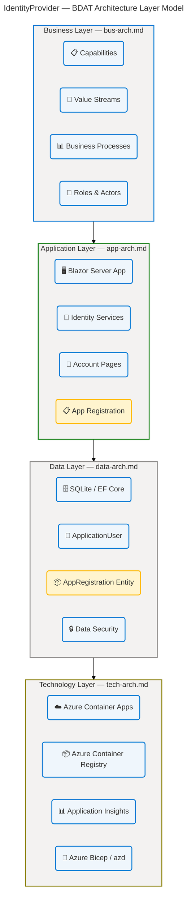
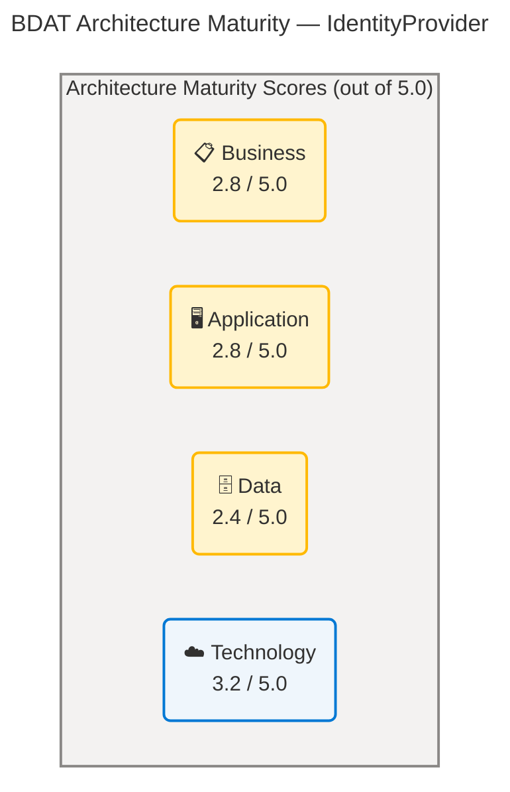

# Architecture Documentation — IdentityProvider

## Overview

**Overview**

This folder contains the complete **TOGAF 10 Architecture Development Method (ADM)** architecture documentation for the Contoso IdentityProvider solution — a cloud-native Identity and Access Management (IAM) platform built on ASP.NET Core Blazor Server targeting .NET 10, deployed to Azure Container Apps.

The documentation is organized across four interdependent architecture layers following the **BDAT model** (Business, Data, Application, Technology). Each document is independently navigable but cross-referenced throughout, providing a holistic view from organizational strategy down to infrastructure and protocol specifics.

> [!NOTE]
> All documents were generated on **2026-04-16** from a live analysis of the `Evilazaro/IdentityProvider` repository (`main` branch). Every factual claim is traced to a source file and line number. No content has been fabricated or inferred beyond what the analysed codebase directly supports.

> [!WARNING]
> These documents carry a **Draft** status and reflect the current state of the codebase, including known gaps and incomplete capabilities. See the [Key Findings](#key-findings) section for a consolidated summary of critical issues that must be resolved before production readiness.

## Table of Contents

- [Overview](#overview)
- [Architecture](#architecture)
- [Document Index](#document-index)
- [BDAT Layer Summary](#bdat-layer-summary)
- [Key Findings](#key-findings)
- [Maturity Assessment](#maturity-assessment)
- [Navigation Guide](#navigation-guide)
- [Contributing](#contributing)

## Architecture

**Overview**

The four architecture documents follow the TOGAF ADM BDAT layering model, where each layer builds on the one beneath it. Technology provides the infrastructure platform; Data defines what is stored and how it flows; Application describes the components and services that process data; and Business articulates the capabilities, value streams, and strategic intent that the application realizes.

## Document Index

**Overview**

The four documents below cover TOGAF ADM sections 1, 2, 3, 4, 5, and 8 for their respective layers. Each document is self-contained and opens with an executive summary, followed by an architecture landscape, principles, current-state baseline, component catalog, and dependency/integration mapping.

| Document                     | Layer       | Sections         | Status | Primary Audience                                   |
| ---------------------------- | ----------- | ---------------- | ------ | -------------------------------------------------- |
| [app-arch.md](app-arch.md)   | Application | 1, 2, 3, 4, 5, 8 | Draft  | Application architects, developers                 |
| [bus-arch.md](bus-arch.md)   | Business    | 1, 2, 3, 4, 5, 8 | Draft  | Business analysts, product managers                |
| [data-arch.md](data-arch.md) | Data        | 1, 2, 3, 4, 5, 8 | Draft  | Data architects, DBAs, security engineers          |
| [tech-arch.md](tech-arch.md) | Technology  | 1, 2, 3, 4, 5, 8 | Draft  | Infrastructure engineers, DevOps, cloud architects |

> [!TIP]
> **Reading order for new contributors**: Start with [bus-arch.md](bus-arch.md) to understand organizational intent, then [app-arch.md](app-arch.md) for component structure, [data-arch.md](data-arch.md) for persistence design, and finish with [tech-arch.md](tech-arch.md) for infrastructure topology.

## BDAT Layer Summary

**Overview**

Each BDAT layer documents a distinct concern of the IdentityProvider solution. The table below summarizes the scope, primary components, overall maturity, and critical gaps per layer.

| Layer           | Document                     | Scope                                                        | Primary Components                                               | Maturity  | Critical Gaps                                                                          |
| --------------- | ---------------------------- | ------------------------------------------------------------ | ---------------------------------------------------------------- | --------- | -------------------------------------------------------------------------------------- |
| **Business**    | [bus-arch.md](bus-arch.md)   | Capabilities, value streams, processes, roles, KPIs          | 6 capabilities, 8 processes, 6 services                          | 2.8 / 5.0 | Email domain whitelist; no-op email sender; app registration not persisted             |
| **Application** | [app-arch.md](app-arch.md)   | Application services, components, interfaces, interactions   | 1 monolith, 28 components, 4 REST endpoints                      | 2.8 / 5.0 | `HandleValidSubmit` stub in `AppRegistrationForm.razor`; `eMail.cs` domain restriction |
| **Data**        | [data-arch.md](data-arch.md) | Entities, models, stores, flows, security, governance        | 8 entities, 7 tables, 5 data services, 11 data security controls | 2.4 / 5.0 | `AppRegistration` not registered in `ApplicationDbContext`; `ClientSecret` plaintext   |
| **Technology**  | [tech-arch.md](tech-arch.md) | Platforms, hosting, middleware, security, observability, IaC | .NET 10, Azure Container Apps, Bicep AVM, App Insights           | 3.2 / 5.0 | SQLite unsuitable for multi-instance scaling; no Azure Key Vault integration           |

### Capability Maturity by Strategic Pillar

| Strategic Pillar              | Business       | Application    | Data              | Technology     | Overall  |
| ----------------------------- | -------------- | -------------- | ----------------- | -------------- | -------- |
| Secure User Authentication    | ✅ 3 — Defined | ✅ 3 — Defined | ✅ 3 — Defined    | ✅ 3 — Defined | **3.0**  |
| Multi-Factor Authentication   | ✅ 3 — Defined | ✅ 3 — Defined | ✅ 3 — Defined    | ✅ 3 — Defined | **3.0**  |
| Account Self-Service          | ✅ 3 — Defined | ✅ 3 — Defined | ✅ 3 — Defined    | ✅ 3 — Defined | **3.0**  |
| App Registration (OAuth/OIDC) | ⚠️ 2 — Managed | ⚠️ 2 — Managed | ⚠️ 1 — Initial    | ⚠️ 2 — Managed | **1.75** |
| External Identity Federation  | ⚠️ 2 — Managed | ⚠️ 2 — Managed | ⚠️ 2 — Managed    | ⚠️ 2 — Managed | **2.0**  |
| Email Notifications           | ⚠️ 1 — Initial | ⚠️ 1 — Initial | ⚠️ 2 — Repeatable | ⚠️ 2 — Managed | **1.5**  |
| Cloud-Native Hosting          | ✅ 3 — Defined | ✅ 3 — Defined | ⚠️ 2 — Repeatable | ✅ 3 — Defined | **2.75** |
| Secrets Management            | —              | —              | ✅ 3 — Defined    | ⚠️ 2 — Managed | **2.5**  |

## Key Findings

**Overview**

The following consolidated findings are drawn from all four architecture documents. They represent the most impactful issues, spanning critical blockers through security gaps to positive design decisions. Each finding references the primary source document for full detail.

### Critical Priority

| #    | Finding                                                                                                                                  | Layer(s)                    | Source                                                             |
| ---- | ---------------------------------------------------------------------------------------------------------------------------------------- | --------------------------- | ------------------------------------------------------------------ |
| C-01 | `AppRegistrationForm.razor` `HandleValidSubmit` is a stub — no persistence call made; feature is non-functional                          | Business, Application, Data | [app-arch.md](app-arch.md) §1, [data-arch.md](data-arch.md) §2.4   |
| C-02 | `eMail.cs` `checkEmail()` accepts only `@example.com` and `@test.com` domains — all production email addresses are rejected              | Business, Application       | [bus-arch.md](bus-arch.md) §1, [app-arch.md](app-arch.md) §1       |
| C-03 | SQLite (`identityProviderDB.db`) is used as the sole data store; file-lock contention will occur when >1 Container App replica is active | Data, Technology            | [data-arch.md](data-arch.md) §2.3, [tech-arch.md](tech-arch.md) §1 |

### High Priority

| #    | Finding                                                                                                                                      | Layer(s)   | Source                                                           |
| ---- | -------------------------------------------------------------------------------------------------------------------------------------------- | ---------- | ---------------------------------------------------------------- |
| H-01 | `IdentityNoOpEmailSender` discards all email notifications — account confirmation, password reset, and 2FA codes cannot be delivered         | All        | [app-arch.md](app-arch.md) §1, [data-arch.md](data-arch.md) §2.5 |
| H-02 | `AppRegistration.ClientSecret` stored as plain `TEXT` with no hashing or encryption                                                          | Data       | [data-arch.md](data-arch.md) §1 Finding F-03                     |
| H-03 | No Azure Key Vault integration; secrets managed exclusively as Container App environment variables — no rotation or audit trail              | Technology | [tech-arch.md](tech-arch.md) §1                                  |
| H-04 | `AppRegistration` entity is not registered in `ApplicationDbContext` — no migration or database table created for OAuth client registrations | Data       | [data-arch.md](data-arch.md) §1 Finding F-01                     |

### Positive Findings

| #    | Finding                                                                                                                      | Layer(s)                | Source                                                           |
| ---- | ---------------------------------------------------------------------------------------------------------------------------- | ----------------------- | ---------------------------------------------------------------- |
| P-01 | Full TOTP 2FA pipeline implemented with recovery codes and reset capabilities                                                | Business, Application   | [app-arch.md](app-arch.md) §1                                    |
| P-02 | `IdentityRedirectManager` enforces relative URI validation, preventing OWASP A01 open redirect attacks                       | Application, Technology | [app-arch.md](app-arch.md) §1, [tech-arch.md](tech-arch.md) §2.4 |
| P-03 | GDPR Article 20 personal data download endpoint (`/Account/Manage/DownloadPersonalData`) is implemented                      | Business, Data          | [bus-arch.md](bus-arch.md) §1, [data-arch.md](data-arch.md) §2.6 |
| P-04 | User-Assigned Managed Identity with `AcrPull` RBAC eliminates credential-based container registry authentication             | Technology              | [tech-arch.md](tech-arch.md) §2.2                                |
| P-05 | Azure Bicep AVM public registry modules used for all resources — standardized, tested IaC with no manual portal drift        | Technology              | [tech-arch.md](tech-arch.md) §2.6                                |
| P-06 | 30-minute security-stamp revalidation in `IdentityRevalidatingAuthenticationStateProvider` invalidates stale Blazor circuits | Application, Technology | [app-arch.md](app-arch.md) §1                                    |

## Maturity Assessment

**Overview**

Maturity scores follow a five-level scale: **1 — Initial**, **2 — Managed**, **3 — Defined**, **4 — Measured**, **5 — Optimizing**. Scores are assessed per architecture document from direct analysis of the source codebase.

| Layer       | Score     | Strongest Area                                   | Weakest Area                                                |
| ----------- | --------- | ------------------------------------------------ | ----------------------------------------------------------- |
| Business    | 2.8 / 5.0 | Secure authentication, MFA, account self-service | Email notification delivery (Level 1)                       |
| Application | 2.8 / 5.0 | Authentication and 2FA workflows                 | App registration persistence (`HandleValidSubmit` stub)     |
| Data        | 2.4 / 5.0 | Identity domain schema (Level 3)                 | Registration domain (Level 1 — no `DbContext` registration) |
| Technology  | 3.2 / 5.0 | Cloud-native hosting, IaC, observability         | Production data persistence (SQLite), secrets management    |

## Navigation Guide

**Overview**

Use the guide below to navigate directly to the most relevant section within each architecture document based on your role or immediate concern.

| Use Case                                              | Recommended Document                                                                                 | Section                                                     |
| ----------------------------------------------------- | ---------------------------------------------------------------------------------------------------- | ----------------------------------------------------------- |
| Understand business capabilities and strategy         | [bus-arch.md](bus-arch.md)                                                                           | §1 Executive Summary, §2.2 Business Capabilities            |
| Review value streams and process flows                | [bus-arch.md](bus-arch.md)                                                                           | §2.3 Value Streams, §2.4 Business Processes                 |
| Understand component structure and relationships      | [app-arch.md](app-arch.md)                                                                           | §2 Architecture Landscape, §5 Component Catalog             |
| Review authentication and 2FA implementation          | [app-arch.md](app-arch.md)                                                                           | §2.3 Application Interfaces, §4 Current State Baseline      |
| Inspect database schema and entity model              | [data-arch.md](data-arch.md)                                                                         | §2.1 Data Entities, §2.2 Data Models                        |
| Review data security and governance controls          | [data-arch.md](data-arch.md)                                                                         | §2.6 Data Governance, §2.11 Data Security                   |
| Review Azure infrastructure topology                  | [tech-arch.md](tech-arch.md)                                                                         | §2 Architecture Landscape (Infrastructure Topology diagram) |
| Understand deployment pipeline and IaC                | [tech-arch.md](tech-arch.md)                                                                         | §2.6 DevOps & Deployment Toolchain                          |
| Assess security posture across layers                 | [tech-arch.md](tech-arch.md) §2.4, [app-arch.md](app-arch.md) §1, [data-arch.md](data-arch.md) §2.11 | Multiple sections                                           |
| Identify all critical gaps and remediation priorities | This README                                                                                          | [Key Findings](#key-findings)                               |

### Document Sections Reference

Each architecture document covers the following standard TOGAF sections:

| Section | Title                      | Description                                                               |
| ------- | -------------------------- | ------------------------------------------------------------------------- |
| §1      | Executive Summary          | Strategic overview, key findings table, strategic alignment matrix        |
| §2      | Architecture Landscape     | Annotated inventory of all component types with embedded Mermaid diagrams |
| §3      | Architecture Principles    | Governing rules and constraints for the layer                             |
| §4      | Current State Baseline     | As-is assessment of implemented capabilities and gap analysis             |
| §5      | Component Catalog          | Detailed specification for each individual component                      |
| §8      | Dependencies & Integration | Cross-layer and external integration points                               |

## Contributing

Architecture documents are generated from direct source analysis of the `src/IdentityProvider/` and `infra/` directories in the [`Evilazaro/IdentityProvider`](https://github.com/Evilazaro/IdentityProvider) repository. To update this documentation:

1. Apply the relevant code or infrastructure change to the `main` branch.
2. Re-run the BDAT Master Coordinator analysis against the updated `src/` and `infra/` trees.
3. Update the affected `*-arch.md` file(s) with evidence-based content, citing `file:line` for every factual claim.
4. Update the [Key Findings](#key-findings) and [Maturity Assessment](#maturity-assessment) tables in this `README.md` to reflect the new state.

> [!NOTE]
> The `status` front-matter field in each document should be updated from `draft` to `reviewed` once the document has been peer-reviewed against the actual codebase and all critical findings have been triaged.
