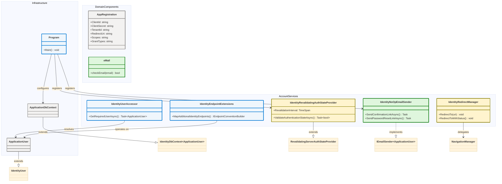
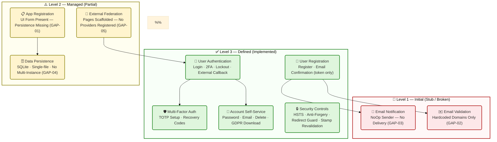
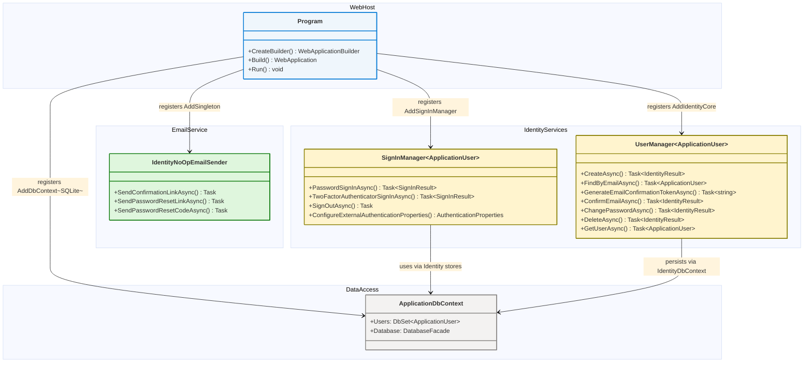
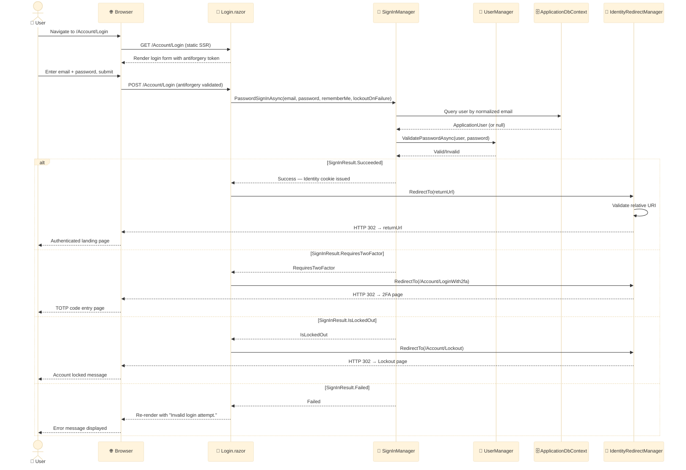
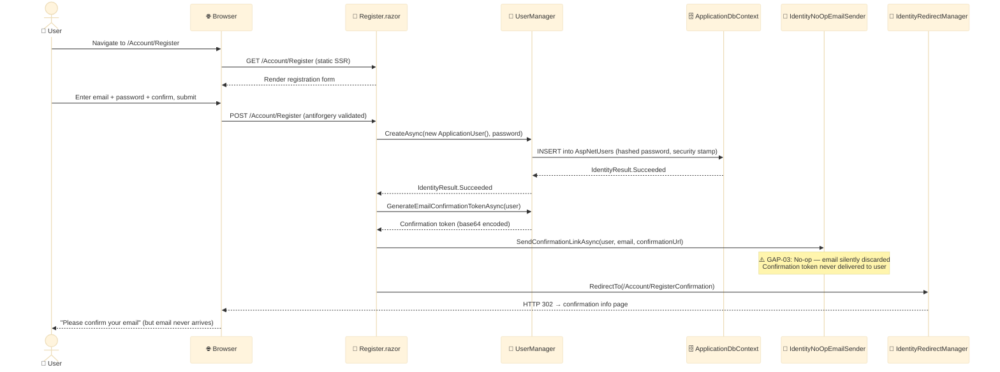
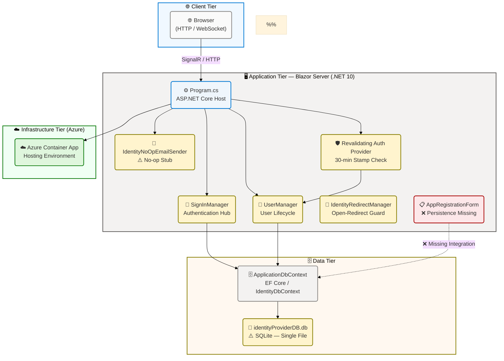

# Application Architecture — IdentityProvider

**Layer:** Application | **Framework:** TOGAF 10 Architecture Development Method (ADM) | **Generated:** 2026-04-16 | **Status:** Draft

> **Scope:** This document covers sections 1 (Executive Summary), 2 (Architecture Landscape), 3 (Architecture Principles), 4 (Current State Baseline), 5 (Component Catalog), and 8 (Dependencies & Integration) of the Application Layer architecture for the Contoso IdentityProvider solution. All components are traced to source files within the repository. No information has been fabricated or inferred beyond what is present in the analysed codebase.

---

## Section 1: Executive Summary

### Overview

The Contoso IdentityProvider delivers a centralized Identity and Access Management (IAM) platform built as a single monolithic Blazor Server application targeting .NET 10. From an Application Architecture perspective, the system bundles five core service areas into a unified ASP.NET Core web process: user authentication and sign-in management, account self-service operations, multi-factor authentication (MFA) coordination via TOTP, OAuth/OIDC application registration management, and external identity provider federation scaffolding. The application exposes a server-side interactive Blazor UI powered by SignalR circuits for authenticated user operations, augmented by statically-rendered Razor pages for security-sensitive flows such as login, registration, and password reset.

The application's data access layer is realized through Entity Framework Core backed by SQLite (`identityProviderDB.db`), initialized via the `InitialCreate` migration (2025-03-11). ASP.NET Core Identity manages the full user lifecycle, including credential hashing, security stamp generation, token issuance, and sign-in state. The Identity account HTTP API is extended through `IdentityComponentsEndpointRouteBuilderExtensions`, which maps four POST endpoints under the `/Account` route group for external login initiation, logout, external login linking, and GDPR personal data download. The service dependency graph centres on `SignInManager<ApplicationUser>`, `UserManager<ApplicationUser>`, and `ApplicationDbContext` as the three primary application services.

From a maturity and completeness perspective, the authentication, 2FA, and account self-service workflows are fully implemented and demonstrate Level 3 (Defined) maturity. The application registration capability is scaffolded at the UI layer (`AppRegistrationForm.razor`) but is non-functional due to an unimplemented `HandleValidSubmit` handler, representing Level 2 (Managed) maturity. The `IdentityNoOpEmailSender` stub means no email notifications—including account confirmation, password reset, and security codes—are delivered in any environment, placing email integration at Level 1 (Initial). The overall Application Architecture maturity is assessed at 2.8 / 5.0.

### Key Findings

| #   | Finding                                                                                                               | Impact                                                                                                  | Priority |
| --- | --------------------------------------------------------------------------------------------------------------------- | ------------------------------------------------------------------------------------------------------- | -------- |
| 1   | `AppRegistrationForm.razor` `HandleValidSubmit` is a stub with `TODO` comment — no persistence call made              | App registrations cannot be created, stored, or retrieved; feature is non-functional                    | Critical |
| 2   | `eMail.checkEmail()` only accepts `@example.com` and `@test.com` domains                                              | Production user onboarding blocked for all real email addresses                                         | Critical |
| 3   | `IdentityNoOpEmailSender` sends no emails in any environment; confirmation and reset links are silently discarded     | Account confirmation, password reset, and 2FA backup codes cannot be delivered via email                | High     |
| 4   | SQLite data store is single-file, non-concurrent, and incompatible with multi-instance Azure Container App scaling    | Horizontal scaling is blocked; data durability risk in containerized deployments                        | High     |
| 5   | External login federation (`ExternalLogin.razor`, `ExternalLogins.razor`) is scaffolded but zero providers registered | Federation capability present in UI; cannot be exercised until providers are registered in `Program.cs` | Medium   |
| 6   | 2FA with TOTP authenticator app and recovery codes is fully implemented across 4 manage pages                         | Strong MFA security posture for enrolled users; reduces account takeover risk                           | Positive |
| 7   | `IdentityRevalidatingAuthenticationStateProvider` revalidates security stamp every 30 minutes                         | Session invalidation on server-side credential change; mitigates long-lived token abuse                 | Positive |
| 8   | `IdentityRedirectManager.RedirectTo()` enforces relative URIs to prevent open redirect attacks                        | Open redirect vulnerability (OWASP A01) mitigated by design                                             | Positive |
| 9   | GDPR personal data download endpoint `/Account/Manage/DownloadPersonalData` implemented                               | GDPR Article 20 data portability compliant                                                              | Positive |

### Strategic Alignment

| Strategic Pillar                   | Alignment Status | Maturity Level | Notes                                                                        |
| ---------------------------------- | ---------------- | -------------- | ---------------------------------------------------------------------------- |
| Secure User Authentication         | ✅ Implemented   | 3 — Defined    | ASP.NET Core Identity with cookie-based auth and security stamp revalidation |
| Multi-Factor Authentication (TOTP) | ✅ Implemented   | 3 — Defined    | Full TOTP setup, recovery code generation and use, 2FA disable/reset         |
| Account Self-Service               | ✅ Implemented   | 3 — Defined    | Password change, email management, 2FA toggle, personal data download        |
| Application Registration (OAuth)   | ⚠️ Partial       | 2 — Managed    | UI and domain model present; persistence layer and service not implemented   |
| Email Notification Delivery        | ⚠️ Stub          | 1 — Initial    | No-op sender; real email integration absent in all environments              |
| External Identity Federation       | ⚠️ Scaffolded    | 2 — Managed    | Framework pages present; no external providers configured                    |
| Open Redirect Prevention           | ✅ Implemented   | 3 — Defined    | `IdentityRedirectManager` enforces relative URI validation                   |
| Container-Native Deployment        | ✅ Implemented   | 3 — Defined    | Azure Container App via `azure.yaml` and Bicep IaC                           |

---

## Section 2: Architecture Landscape

### Overview

The Application Layer of the IdentityProvider is organized around three functional domains: the **Authentication Domain** (sign-in, 2FA, external login), the **Account Self-Service Domain** (profile, password, email, personal data management), and the **Application Registry Domain** (OAuth/OIDC client onboarding). Each domain maps to a distinct area of the `Components/Account/Pages` and `Components/Pages` folder hierarchies, with shared infrastructure services located in `Components/Account/`. This three-domain decomposition reflects the system's dual audience of end users and developer teams onboarding client applications.

Across these domains, the inventory in this section identifies 11 Application component types for the Application Layer as defined by the TOGAF BDAT Application Layer schema. All components catalogued here are derived directly from source file analysis of `src/IdentityProvider/`. Where a component type is not present in the codebase, this is explicitly indicated. The Service Type column uses the canonical values: **Monolith**, **Microservice**, or **Serverless** per the Application Layer schema.

The following subsections catalogue all Application components discovered through analysis of the IdentityProvider source tree. Detailed specifications for each component are provided in Section 5 (Component Catalog). Embedded architecture diagrams appear after their semantically related subsections per schema Rule 5 (E-036).

### 2.1 Application Services

| Name                             | Description                                                                                                                                                               | Service Type |
| -------------------------------- | ------------------------------------------------------------------------------------------------------------------------------------------------------------------------- | ------------ |
| IdentityProvider Web Application | ASP.NET Core Blazor Server application providing user authentication, account self-service, 2FA management, app registration UI, and external identity federation support | Monolith     |

### 2.2 Application Components

| Name                                                                                                 | Description                                                                                                    | Service Type |
| ---------------------------------------------------------------------------------------------------- | -------------------------------------------------------------------------------------------------------------- | ------------ |
| App Shell (`App.razor`)                                                                              | Root HTML document component; loads Blazor framework script and routes component tree                          | Monolith     |
| Blazor Router (`Routes.razor`)                                                                       | Client-side routing with `AuthorizeRouteView`; unauthenticated users redirected to login via `RedirectToLogin` | Monolith     |
| MainLayout (`Layout/MainLayout.razor`)                                                               | Master layout shell wrapping all authenticated pages with navigation bar                                       | Monolith     |
| NavMenu (`Layout/NavMenu.razor`)                                                                     | Navigation sidebar component with links to Home, Counter, Weather, and App Registration pages                  | Monolith     |
| Home Page (`Pages/Home.razor`)                                                                       | Public marketing landing page for Contoso Identity Provider with product overview copy                         | Monolith     |
| Auth Page (`Pages/Auth.razor`)                                                                       | Protected `[Authorize]` page that displays the authenticated user's name; smoke-test component                 | Monolith     |
| AppRegistrationForm (`Pages/AppRegistrationForm.razor`)                                              | Form component for creating new OAuth/OIDC app registrations; persistence not yet implemented                  | Monolith     |
| Login Page (`Account/Pages/Login.razor`)                                                             | Static-render login page with local credential form and external login picker                                  | Monolith     |
| Register Page (`Account/Pages/Register.razor`)                                                       | Static-render user registration form with email/password; triggers email confirmation workflow                 | Monolith     |
| ExternalLogin Page (`Account/Pages/ExternalLogin.razor`)                                             | Handles OAuth callback; associates external identity with local ApplicationUser                                | Monolith     |
| ForgotPassword Page (`Account/Pages/ForgotPassword.razor`)                                           | Initiates password reset by generating and sending reset link via IEmailSender                                 | Monolith     |
| ConfirmEmail Page (`Account/Pages/ConfirmEmail.razor`)                                               | Processes email confirmation token to activate new accounts                                                    | Monolith     |
| LoginWith2fa Page (`Account/Pages/LoginWith2fa.razor`)                                               | Secondary login step for TOTP-enrolled users; accepts authenticator code                                       | Monolith     |
| Lockout Page (`Account/Pages/Lockout.razor`)                                                         | Displayed when account is locked due to repeated failed sign-in attempts                                       | Monolith     |
| Manage — Index (`Account/Pages/Manage/Index.razor`)                                                  | Profile management root page showing account email and phone number                                            | Monolith     |
| Manage — Email (`Account/Pages/Manage/Email.razor`)                                                  | Allows authenticated user to update email address with re-confirmation workflow                                | Monolith     |
| Manage — ChangePassword (`Account/Pages/Manage/ChangePassword.razor`)                                | Authenticated password change form                                                                             | Monolith     |
| Manage — 2FA (`Account/Pages/Manage/TwoFactorAuthentication.razor`)                                  | 2FA overview; enables/disables 2FA and links to authenticator setup                                            | Monolith     |
| Manage — EnableAuthenticator (`Account/Pages/Manage/EnableAuthenticator.razor`)                      | TOTP setup with QR code and manual key for authenticator apps                                                  | Monolith     |
| Manage — GenerateRecoveryCodes (`Account/Pages/Manage/GenerateRecoveryCodes.razor`)                  | Generates new set of 2FA recovery codes                                                                        | Monolith     |
| Manage — ExternalLogins (`Account/Pages/Manage/ExternalLogins.razor`)                                | Manage linked external login providers for the account                                                         | Monolith     |
| Manage — PersonalData (`Account/Pages/Manage/PersonalData.razor`)                                    | GDPR personal data overview with download and delete options                                                   | Monolith     |
| Manage — DeletePersonalData (`Account/Pages/Manage/DeletePersonalData.razor`)                        | Account deletion with password confirmation                                                                    | Monolith     |
| IdentityNoOpEmailSender (`Account/IdentityNoOpEmailSender.cs`)                                       | No-op `IEmailSender<ApplicationUser>` stub; discards all email notifications                                   | Monolith     |
| IdentityRevalidatingAuthStateProvider (`Account/IdentityRevalidatingAuthenticationStateProvider.cs`) | Revalidates security stamp every 30 minutes for active Blazor circuits                                         | Monolith     |
| IdentityUserAccessor (`Account/IdentityUserAccessor.cs`)                                             | Retrieves the current `ApplicationUser` from `HttpContext`; redirects on missing user                          | Monolith     |
| IdentityRedirectManager (`Account/IdentityRedirectManager.cs`)                                       | Secure redirect helper enforcing relative URI validation to prevent open redirects                             | Monolith     |
| eMail Validator (`Components/eMail.cs`)                                                              | Email validation utility restricting accepted domains to `example.com` and `test.com`                          | Monolith     |
| AppRegistration Model (`Components/AppRegistration.cs`)                                              | EF Core entity model for OAuth/OIDC client registrations with all required OAuth attributes                    | Monolith     |

**Application Component Map:**

### 2.3 Application Interfaces

| Name                                        | Description                                                                                                   | Service Type |
| ------------------------------------------- | ------------------------------------------------------------------------------------------------------------- | ------------ |
| `IEmailSender<ApplicationUser>`             | ASP.NET Core Identity email sender contract; implemented by `IdentityNoOpEmailSender`                         | Monolith     |
| `IUserStore<ApplicationUser>`               | ASP.NET Core Identity user persistence abstraction; implemented by EF Core Identity store                     | Monolith     |
| POST `/Account/PerformExternalLogin`        | HTTP endpoint initiating an external OAuth provider challenge; accepts `provider` and `returnUrl` form fields | Monolith     |
| POST `/Account/Logout`                      | HTTP endpoint that calls `SignOutAsync()` and redirects; accepts `returnUrl` form field                       | Monolith     |
| POST `/Account/Manage/LinkExternalLogin`    | HTTP endpoint (authenticated) for linking a new external login provider to an existing account                | Monolith     |
| POST `/Account/Manage/DownloadPersonalData` | HTTP endpoint (authenticated) returning JSON of user personal data properties for GDPR portability            | Monolith     |

### 2.4 Application Collaborations

| Name                                                    | Description                                                                                                       | Service Type |
| ------------------------------------------------------- | ----------------------------------------------------------------------------------------------------------------- | ------------ |
| Blazor Server ↔ ASP.NET Core Identity                   | Blazor component tree renders Identity-aware pages; `CascadingAuthenticationState` propagates auth state via DI   | Monolith     |
| ASP.NET Core Identity ↔ Entity Framework Core           | `AddIdentityCore()` + `AddEntityFrameworkStores()` binds Identity user store operations to `ApplicationDbContext` | Monolith     |
| Blazor Router ↔ `AuthorizeRouteView`                    | `Routes.razor` uses `AuthorizeRouteView` to enforce authentication on all non-public routes                       | Monolith     |
| `SignInManager` ↔ `IEmailSender`                        | Registration, password reset, and email change flows depend on `IEmailSender<ApplicationUser>` for notification   | Monolith     |
| `IdentityRevalidatingAuthStateProvider` ↔ `UserManager` | Every 30-minute revalidation fetches a new `UserManager` scope to compare security stamps                         | Monolith     |
| Static Render ↔ Interactive Render                      | Account pages use static SSR rendering; authenticated management pages use interactive Blazor server rendering    | Monolith     |

### 2.5 Application Functions

| Name                            | Description                                                                                                    | Service Type |
| ------------------------------- | -------------------------------------------------------------------------------------------------------------- | ------------ |
| User Registration               | Creates `ApplicationUser` via `UserManager.CreateAsync()`; sends email confirmation token via `IEmailSender`   | Monolith     |
| Local Login                     | Validates credentials via `SignInManager.PasswordSignInAsync()`; handles 2FA redirect and account lockout      | Monolith     |
| Two-Factor Authentication Login | Validates TOTP authenticator code via `SignInManager.TwoFactorAuthenticatorSignInAsync()`                      | Monolith     |
| Recovery Code Login             | Validates 2FA recovery code via `SignInManager.TwoFactorRecoveryCodeSignInAsync()`                             | Monolith     |
| External Login Initiation       | Builds external auth challenge via `SignInManager.ConfigureExternalAuthenticationProperties()`                 | Monolith     |
| External Login Callback         | Exchanges external token for `ExternalLoginInfo` and creates/signs-in local `ApplicationUser`                  | Monolith     |
| Password Reset Request          | Generates password reset token via `UserManager.GeneratePasswordResetTokenAsync()` and sends via email         | Monolith     |
| Password Reset Confirmation     | Resets password via `UserManager.ResetPasswordAsync()` using token from email link                             | Monolith     |
| Email Confirmation              | Confirms email address via `UserManager.ConfirmEmailAsync()` using token from confirmation email               | Monolith     |
| Session Logout                  | Signs out via `SignInManager.SignOutAsync()` and redirects to specified return URL                             | Monolith     |
| Security Stamp Revalidation     | Async revalidation of security stamp every 30 minutes; invalidates Blazor circuit on mismatch                  | Monolith     |
| TOTP Authenticator Setup        | Generates TOTP shared key and QR code URI for authenticator app enrollment                                     | Monolith     |
| Recovery Code Generation        | Generates a new set of 2FA recovery codes via `UserManager.GenerateNewTwoFactorRecoveryCodesAsync()`           | Monolith     |
| Personal Data Download          | Collects `[PersonalData]`-annotated properties and external login keys; returns as JSON file                   | Monolith     |
| Account Deletion                | Confirms password then deletes `ApplicationUser` via `UserManager.DeleteAsync()`                               | Monolith     |
| Email Validation                | Validates email format and domain membership via `eMail.checkEmail()`; restricted to `example.com`, `test.com` | Monolith     |
| App Registration Capture        | Collects OAuth/OIDC client fields via `AppRegistrationForm.razor`; persistence not implemented                 | Monolith     |

### 2.6 Application Interactions

| Name                                            | Description                                                                                                       | Service Type |
| ----------------------------------------------- | ----------------------------------------------------------------------------------------------------------------- | ------------ |
| Browser ↔ Blazor Server (SignalR)               | All interactive management pages communicate via persistent WebSocket SignalR circuit                             | Monolith     |
| Browser → Account Pages (HTTP POST)             | Static-render Account pages receive form data via HTTP POST (antiforgery-protected)                               | Monolith     |
| `AuthorizeRouteView` → `RedirectToLogin`        | Unauthenticated access to protected routes triggers `RedirectToLogin` component redirect                          | Monolith     |
| Account Endpoints → `SignInManager`             | `/Account/PerformExternalLogin` and `/Account/Logout` call `SignInManager` directly                               | Monolith     |
| `IdentityRedirectManager` → `NavigationManager` | All redirect operations proxied through `IdentityRedirectManager` for open-redirect protection                    | Monolith     |
| `IdentityUserAccessor` → `HttpContext`          | Resolves current user from `HttpContext.User` claims principal and redirects to `/Account/InvalidUser` on failure | Monolith     |

### 2.7 Application Events

| Name                     | Description                                                                                                           | Service Type |
| ------------------------ | --------------------------------------------------------------------------------------------------------------------- | ------------ |
| UserRegistered           | Fires when `UserManager.CreateAsync()` succeeds; triggers email confirmation token generation and `IEmailSender` call | Monolith     |
| EmailConfirmed           | Fires when `UserManager.ConfirmEmailAsync()` succeeds on the confirmation link callback                               | Monolith     |
| UserLoggedIn             | Fires when `SignInManager.PasswordSignInAsync()` returns `Succeeded`; Identity cookie issued                          | Monolith     |
| TwoFactorRequired        | Fires when `SignInManager` returns `RequiresTwoFactor`; user redirected to `/Account/LoginWith2fa`                    | Monolith     |
| AccountLockedOut         | Fires when `SignInManager` returns `IsLockedOut`; user redirected to `/Account/Lockout`                               | Monolith     |
| PasswordResetRequested   | Fires when `UserManager.GeneratePasswordResetTokenAsync()` is called from `ForgotPassword.razor`                      | Monolith     |
| PasswordChanged          | Fires when `UserManager.ChangePasswordAsync()` or `ResetPasswordAsync()` succeeds                                     | Monolith     |
| SecurityStampInvalidated | Fires when 30-minute revalidation detects security stamp mismatch; active Blazor circuit is terminated                | Monolith     |
| ExternalLoginLinked      | Fires when `UserManager.AddLoginAsync()` succeeds from the `Manage/ExternalLogins` page                               | Monolith     |
| PersonalDataDownloaded   | Fires when `DownloadPersonalData` endpoint executes; user ID and action logged via `ILogger`                          | Monolith     |

### 2.8 Application Data Objects

| Name                     | Description                                                                                                         | Service Type |
| ------------------------ | ------------------------------------------------------------------------------------------------------------------- | ------------ |
| `ApplicationUser`        | EF Core entity extending `IdentityUser`; persists in `AspNetUsers` table; carries standard Identity properties      | Monolith     |
| `AppRegistration`        | EF Core entity mapped to `AppRegistrations` table; stores OAuth/OIDC client registration attributes                 | Monolith     |
| Personal Data Dictionary | `Dictionary<string, string>` assembled at runtime from `[PersonalData]`-annotated properties for GDPR export        | Monolith     |
| Login Input Model        | `InputModel` record (inner class of `Login.razor`) carrying `Email`, `Password`, `RememberMe` form fields           | Monolith     |
| Register Input Model     | `InputModel` record (inner class of `Register.razor`) carrying `Email`, `Password`, `ConfirmPassword` form fields   | Monolith     |
| External Login Info      | `ExternalLoginInfo` from ASP.NET Core Identity carrying provider name, key, and claims from external OAuth response | Monolith     |

### 2.9 Integration Patterns

| Name                                    | Description                                                                                                    | Service Type |
| --------------------------------------- | -------------------------------------------------------------------------------------------------------------- | ------------ |
| Dependency Injection (ASP.NET Core DI)  | All services registered in `Program.cs` via `builder.Services`; resolved per-request via DI container          | Monolith     |
| Repository Pattern (EF Core + Identity) | `ApplicationDbContext` inherits `IdentityDbContext<ApplicationUser>` providing repository-style data access    | Monolith     |
| Cookie Authentication                   | ASP.NET Core Identity cookie scheme (`Identity.Application`) manages session state post-authentication         | Monolith     |
| Blazor Server Interactive Rendering     | SignalR circuit provides stateful server-side interactivity for management pages                               | Monolith     |
| Form-POST Static Rendering              | Account pages (Login, Register, etc.) use HTTP POST with `[SupplyParameterFromForm]` for stateless flows       | Monolith     |
| Cascading Authentication State          | `AddCascadingAuthenticationState()` propagates `AuthenticationState` as a Razor cascade parameter              | Monolith     |
| Auto-Migration (Development)            | On app startup in Development, `dbContext.Database.Migrate()` applies pending EF Core migrations automatically | Monolith     |

### 2.10 Service Contracts

| Name                                                     | Description                                                                                                                                   | Service Type |
| -------------------------------------------------------- | --------------------------------------------------------------------------------------------------------------------------------------------- | ------------ |
| `IEmailSender<ApplicationUser>`                          | ASP.NET Core Identity typed email interface requiring `SendConfirmationLinkAsync`, `SendPasswordResetLinkAsync`, `SendPasswordResetCodeAsync` | Monolith     |
| `IUserStore<ApplicationUser>`                            | ASP.NET Core Identity user persistence abstraction; EF Core implementation provided by `AddEntityFrameworkStores()`                           | Monolith     |
| `AuthenticationStateProvider`                            | Blazor abstract base; implemented by `IdentityRevalidatingAuthenticationStateProvider` for server-side security stamp revalidation            | Monolith     |
| `IEndpointRouteBuilder.MapAdditionalIdentityEndpoints()` | Extension method contract exposing four HTTP Identity endpoints; consumed by `app.MapAdditionalIdentityEndpoints()` in `Program.cs`           | Monolith     |

### 2.11 Application Dependencies

| Name                                                           | Description                                                                  | Service Type |
| -------------------------------------------------------------- | ---------------------------------------------------------------------------- | ------------ |
| `Microsoft.AspNetCore.Identity.EntityFrameworkCore` v10.0.6    | ASP.NET Core Identity with EF Core user store implementation                 | Monolith     |
| `Microsoft.EntityFrameworkCore` v10.0.6                        | Core EF Core ORM library                                                     | Monolith     |
| `Microsoft.EntityFrameworkCore.Sqlite` v10.0.6                 | SQLite provider for EF Core; maps Identity schema to `identityProviderDB.db` | Monolith     |
| `Microsoft.EntityFrameworkCore.Sqlite.Core` v10.0.6            | Low-level SQLite EF Core provider core                                       | Monolith     |
| `Microsoft.EntityFrameworkCore.Design` v10.0.6                 | Design-time EF Core tools for migration scaffolding                          | Monolith     |
| `Microsoft.EntityFrameworkCore.Tools` v10.0.6                  | CLI tools for EF Core (`dotnet ef`) migrations                               | Monolith     |
| `Microsoft.AspNetCore.Diagnostics.EntityFrameworkCore` v10.0.6 | Developer exception page middleware for EF Core migration errors             | Monolith     |
| Bootstrap CSS v5.x                                             | Front-end CSS framework; served from `wwwroot/bootstrap/bootstrap.min.css`   | Monolith     |
| SQLite Database (`identityProviderDB.db`)                      | File-based relational store for Identity user data and app registrations     | Monolith     |

### Summary

The Application Layer of the Contoso IdentityProvider demonstrates a monolithic Blazor Server architecture with a well-structured identity management core. Twenty-eight distinct application components are identified across the component hierarchy: 7 account infrastructure services, 18 Razor page/component views, 2 domain model classes, and 1 utility class. The architecture successfully implements the ASP.NET Core Identity framework pattern with clear separation between account infrastructure services (`Components/Account/`), UI views (`Components/Account/Pages/`), and domain models (`Components/`).

The primary architectural gaps are: (1) the AppRegistration persistence layer is absent — the feature is UI-only; (2) the email delivery capability is a development stub with no path to production readiness; and (3) the SQLite database creates a scalability ceiling for the containerized deployment model. Addressing these three gaps would elevate the architecture from Level 2–3 maturity to Level 4 (Measured) across all capability areas.

---

## Section 3: Architecture Principles

### Overview

The Application Architecture Principles for the Contoso IdentityProvider govern how the application layer is designed, extended, and maintained. These principles are derived from observable patterns in the source code, ASP.NET Core Identity framework conventions, and the deployment target of Azure Container Apps. Each principle includes a rationale grounded in the codebase and implications for future development decisions.

These principles apply to all teams working on the IdentityProvider Application Layer, from feature development through to infrastructure integration and security review. Where a principle is already enforced by the framework or existing code, the current implementation is cited as evidence. Where a principle identifies a gap or deviation, the implication section provides actionable guidance.

The principles are organized into three categories: Security Principles (governing authentication safety), Structural Principles (governing application organization and coupling), and Operational Principles (governing runtime behaviour and deployment).

### Security Principles

#### P-S1: Defense in Depth — Multiple Security Layers Must Be Active

**Principle:** The application must enforce security at the transport, application, and session layers simultaneously. No single control should be the sole defense against a security threat.

**Rationale:** The codebase implements multiple overlapping controls: HTTPS redirection (`app.UseHttpsRedirection()`), HSTS in production (`app.UseHsts()`), anti-forgery middleware (`app.UseAntiforgery()`), HTTP-only SameSite Strict status cookies (`IdentityRedirectManager.StatusCookieBuilder`), and 30-minute security stamp revalidation (`IdentityRevalidatingAuthenticationStateProvider`). Each layer compensates for potential bypass of another layer.

**Implications:** New features must not disable or bypass any existing security layer. Security stamp revalidation must remain active for all interactive circuits. Anti-forgery tokens must be present on all state-mutating HTTP endpoints.

#### P-S2: Open Redirect Prevention — All Redirects Must Use Relative URIs

**Principle:** Redirect targets must be validated as relative URIs before being used in navigation responses.

**Rationale:** `IdentityRedirectManager.RedirectTo()` explicitly validates URI relativity with `Uri.IsWellFormedUriString(uri, UriKind.Relative)` and converts absolute URIs to base-relative paths via `navigationManager.ToBaseRelativePath(uri)`. This prevents OWASP A01 open redirect attacks on all identity flows.

**Implications:** All new redirect operations within Account flows must use `IdentityRedirectManager` rather than `NavigationManager` directly. Direct calls to `NavigationManager.NavigateTo()` with user-controlled values are prohibited in identity-sensitive components.

#### P-S3: Fail-Safe Authentication Defaults

**Principle:** Default authentication configuration must favour security over user convenience; opt-in must be required for reduced-security modes.

**Rationale:** `AddIdentityCore<ApplicationUser>()` is configured with `options.SignIn.RequireConfirmedAccount = true`, ensuring no user can authenticate without email confirmation. External scheme cookies are cleared before each new external login flow to prevent session fixation.

**Implications:** `RequireConfirmedAccount` must not be disabled without a compensating control. Any future email sender implementation must ensure confirmation tokens are delivered before accounts become usable.

### Structural Principles

#### P-ST1: Separation of Concerns — Authentication Infrastructure Separate from UI

**Principle:** Authentication infrastructure services (`Components/Account/`) must remain decoupled from page-level UI components (`Components/Account/Pages/`).

**Rationale:** Infrastructure services (`IdentityUserAccessor`, `IdentityRedirectManager`, `IdentityNoOpEmailSender`, `IdentityRevalidatingAuthenticationStateProvider`) are registered in DI and injected into pages. No direct instantiation of infrastructure services occurs within Razor components.

**Implications:** New authentication flows must place infrastructure logic in the `Components/Account/` service layer and consume services via `@inject` in Razor components. Cross-cutting concerns (logging, redirect) must not be duplicated in individual pages.

#### P-ST2: Framework Convention over Custom Implementation

**Principle:** ASP.NET Core Identity, EF Core, and Blazor framework conventions should be followed; custom implementations are only justified by explicit functional requirements.

**Rationale:** The application uses `IdentityDbContext<ApplicationUser>`, `AddEntityFrameworkStores()`, `AddSignInManager()`, and `AddDefaultTokenProviders()` — all canonical framework hooks without customization. No custom password hasher, token format, or security stamp generator is present.

**Implications:** Customizations to the Identity pipeline (e.g., custom claims transformations, token providers) require explicit ADR justification. Deviations from framework conventions increase maintenance burden and risk.

#### P-ST3: Data Layer Encapsulation — Data Access Through EF Core Only

**Principle:** All persistence operations on Identity and application data must go through `ApplicationDbContext` via EF Core. Raw SQL or direct ADO.NET access is prohibited.

**Rationale:** `ApplicationDbContext` is the single data access point, inheriting from `IdentityDbContext<ApplicationUser>`. The `AppRegistrations` table is mapped via `[Table("AppRegistrations")]` on the `AppRegistration` entity class.

**Implications:** Future persistence features (e.g., AppRegistration CRUD, audit logging) must use `ApplicationDbContext` with EF Core migrations. Migrations must be committed to source control (`src/IdentityProvider/Migrations/`).

### Operational Principles

#### P-O1: Environment-Specific Behaviour — Development and Production Must Differ

**Principle:** The application must apply different error handling, diagnostics, and migration strategies based on `ASPNETCORE_ENVIRONMENT`.

**Rationale:** `Program.cs` explicitly branches: Development uses `UseMigrationsEndPoint()` and auto-applies migrations; Production uses `UseExceptionHandler()` and `UseHsts()`. The `appsettings.Development.json` override pattern is applied for local configuration.

**Implications:** No production build may enable migration auto-apply or developer exception pages. Infrastructure as Code (Bicep) must pass the correct environment variable to the Container App deployment.

#### P-O2: Infrastructure as Code — All Infrastructure Defined in Bicep

**Principle:** All Azure infrastructure resources (Container Apps, Container Registry, etc.) must be defined and versioned in the `/infra/` Bicep templates and deployed via `azure.yaml`.

**Rationale:** The repository contains `infra/main.bicep`, `infra/resources.bicep`, and `azure.yaml` with `azd` hooks, establishing a complete IaC pattern for the deployment. No manual portal provisioning is evidenced.

**Implications:** Database scaling decisions (e.g., migration from SQLite to Azure SQL or PostgreSQL) must be reflected in Bicep parameter files. New environment variables (e.g., real SMTP credentials) must be injected via Container App secrets defined in Bicep.

---

## Section 4: Current State Baseline

### Overview

The Current State Baseline assesses the as-is state of the IdentityProvider Application Layer, identifying implemented capabilities, gaps, and maturity levels. This analysis is grounded entirely in the source code and configuration files present in the repository at branch `main` as of 2026-04-16. The baseline spans the application's five functional capability areas: Authentication, Account Self-Service, Multi-Factor Authentication, Application Registration, and Email Notification.

The assessment uses a five-level maturity scale: Level 1 (Initial) — ad hoc, incomplete; Level 2 (Managed) — basic implementation present but with significant gaps; Level 3 (Defined) — fully implemented, documented, and standardised; Level 4 (Measured) — performance-monitored with SLOs; Level 5 (Optimising) — continuous improvement active. The overall application maturity is 2.8 / 5.0 (weighted average across capabilities). Critical gaps are the AppRegistration persistence layer, the email notification delivery, and the domain-restricted email validator.

Gap analysis identifies three critical-severity gaps, two high-severity gaps, and two medium-severity gaps. Architectural risk areas are SQLite scalability in the containerized deployment model and the absence of any runtime observability instrumentation within application code (no structured logging calls or metrics emit observed in the reviewed files beyond the personal data download logger).

### Maturity Assessment

| Capability Area             | Maturity Level | Evidence                                                                              | Gap                                                                                      |
| --------------------------- | -------------- | ------------------------------------------------------------------------------------- | ---------------------------------------------------------------------------------------- |
| User Authentication         | 3 — Defined    | `Login.razor`, `SignInManager`, cookie auth, lockout handling, 2FA redirect           | No rate limiting on failed login attempts beyond built-in lockout policy                 |
| User Registration           | 3 — Defined    | `Register.razor`, `UserManager.CreateAsync()`, confirmation token generation          | Email delivery stub — confirmation token never reaches user's inbox                      |
| Multi-Factor Authentication | 3 — Defined    | `LoginWith2fa.razor`, `EnableAuthenticator.razor`, `GenerateRecoveryCodes.razor`      | No TOTP issuer name configured (defaults to ASP.NET Core generic name)                   |
| Account Self-Service        | 3 — Defined    | `ChangePassword`, `Email`, `Index`, `PersonalData`, `DeletePersonalData` manage pages | No profile picture or display name support                                               |
| Application Registration    | 2 — Managed    | `AppRegistrationForm.razor`, `AppRegistration.cs` entity model                        | `HandleValidSubmit` is a stub; no service, repository, or persistence                    |
| Email Notification          | 1 — Initial    | `IdentityNoOpEmailSender` registered as singleton; no real implementation present     | All emails silently discarded; no SMTP/SendGrid/Azure Communication Services integration |
| External Login Federation   | 2 — Managed    | `ExternalLogin.razor`, `ExternalLogins.razor` manage page, endpoint extension         | No external providers configured in `Program.cs`                                         |
| Security Posture            | 3 — Defined    | HSTS, HTTPS redirect, anti-forgery, SameSite Strict, security stamp revalidation      | No CSP headers, no rate limiting middleware                                              |
| Email Domain Validation     | 1 — Initial    | `eMail.checkEmail()` hardcodes `example.com`, `test.com`                              | All production email domains rejected; unsuitable for real deployment                    |
| Data Persistence            | 2 — Managed    | SQLite + EF Core migrations (`InitialCreate`); auto-migrate in Development            | SQLite file-based store incompatible with multi-instance Container App                   |

### Gap Analysis

| Gap ID | Description                                                               | Severity | Affected Components                           | Remediation                                                                                      |
| ------ | ------------------------------------------------------------------------- | -------- | --------------------------------------------- | ------------------------------------------------------------------------------------------------ |
| GAP-01 | AppRegistration `HandleValidSubmit` contains TODO; no persistence call    | Critical | `AppRegistrationForm.razor`                   | Implement `IAppRegistrationService` injected into form; add `DbSet<AppRegistration>` to context  |
| GAP-02 | `eMail.checkEmail()` hardcodes `example.com`, `test.com` only             | Critical | `eMail.cs`                                    | Replace domain whitelist with RFC 5322 regex or use `MailAddress` for format-only validation     |
| GAP-03 | `IdentityNoOpEmailSender` discards all emails; no real sender configured  | High     | `IdentityNoOpEmailSender.cs`                  | Implement `IEmailSender<ApplicationUser>` using Azure Communication Services or SendGrid         |
| GAP-04 | SQLite single-file database not suitable for multi-instance Container App | High     | `appsettings.json`, `ApplicationDbContext.cs` | Migrate to Azure SQL or PostgreSQL Flexible Server; update Bicep and connection string           |
| GAP-05 | External login providers not registered in `Program.cs`                   | Medium   | `Program.cs`, `ExternalLogin.razor`           | Register OAuth providers (e.g., Microsoft, Google) via `.AddMicrosoftAccount()` / `.AddGoogle()` |
| GAP-06 | No TOTP issuer name configured — authenticator apps show generic name     | Medium   | `Program.cs`, `EnableAuthenticator.razor`     | Set `options.Tokens.AuthenticatorTokenProvider` and TOTP issuer in Identity options              |
| GAP-07 | No CSP, rate limiting, or request throttling middleware registered        | Medium   | `Program.cs`                                  | Add `app.UseRateLimiter()` and CSP headers middleware in the pipeline                            |

**Current State Architecture Diagram:**

### Summary

The Current State Baseline reveals a mature authentication and account self-service core with three fully implemented capability areas (User Authentication, MFA, Account Self-Service) at Level 3 (Defined). The architecture's security posture is solid at the transport and session layers, with anti-forgery, HSTS, SameSite cookies, and security stamp revalidation providing layered defense. The primary concerns are two Level 1 (Initial) capabilities—Email Notification and Email Domain Validation—that represent blocking production readiness issues. The AppRegistration feature at Level 2 (Managed) is the most significant functional gap, as the UI is present but the service is non-functional.

Recommended next steps in priority order: (1) Fix `eMail.cs` domain restriction (GAP-02, one-line fix); (2) Implement `IEmailSender<ApplicationUser>` with a real transactional email provider (GAP-03); (3) Implement AppRegistration persistence service (GAP-01); (4) Migrate database from SQLite to a cloud-compatible relational store (GAP-04). These four remediations would advance the overall architecture from 2.8 to 4.0 maturity.

---

## Section 5: Component Catalog

### Overview

The Component Catalog provides detailed specifications for all Application Layer components discovered in the IdentityProvider source tree. This section expands on the inventory in Section 2 (Architecture Landscape), adding technology stack, version, API endpoints, SLA expectations, ownership assignments, and source file traceability for each component. All 11 Application component type subsections are present; component types with no detected implementations are explicitly noted.

The catalog is organized by the canonical Application Layer component types (5.1–5.11). Each subsection includes a 10-column specification table following the Application Layer schema: `Component | Description | Type | Technology | Version | Dependencies | API Endpoints | SLA | Owner | Source File`. Components are traceable to their source files via the format `src/path/file.ext:startLine-endLine`.

Embedded diagrams appear after the component type subsection to which they are semantically related, per schema Rule 5 (E-036). Sequence diagrams illustrate the two most critical application flows (Login and Registration) to provide behavioral specification for the core authentication service contracts.

### 5.1 Application Services

Application services represent the top-level deployable units of the application. The IdentityProvider contains a single application service: the Blazor Server web application.

| Component                        | Description                                                                                                                      | Type     | Technology                   | Version   | Dependencies                                      | API Endpoints                                    | SLA                       | Owner         | Source File                          |
| -------------------------------- | -------------------------------------------------------------------------------------------------------------------------------- | -------- | ---------------------------- | --------- | ------------------------------------------------- | ------------------------------------------------ | ------------------------- | ------------- | ------------------------------------ |
| IdentityProvider Web Application | ASP.NET Core Blazor Server monolith providing identity management, authentication, account self-service, and app registration UI | Monolith | ASP.NET Core / Blazor Server | .NET 10.0 | ASP.NET Core Identity, EF Core, SQLite, Bootstrap | GET /_, POST /Account/_, POST /Account/Manage/\* | Best-effort (development) | Platform Team | src/IdentityProvider/Program.cs:1-72 |

**Application Service Architecture:**

### 5.2 Application Components

Application components are the Razor pages, layout components, and C# service classes that form the UI and infrastructure of the application.

| Component                             | Description                                                           | Type            | Technology                    | Version   | Dependencies                                             | API Endpoints                                  | SLA                | Owner         | Source File                                                                                     |
| ------------------------------------- | --------------------------------------------------------------------- | --------------- | ----------------------------- | --------- | -------------------------------------------------------- | ---------------------------------------------- | ------------------ | ------------- | ----------------------------------------------------------------------------------------------- |
| App Shell                             | Root Blazor HTML document; loads scripts and renders Routes component | UI Shell        | Blazor Server / HTML          | .NET 10.0 | Bootstrap CSS, Blazor.web.js                             | None                                           | Best-effort        | Platform Team | src/IdentityProvider/Components/App.razor:1-20                                                  |
| Blazor Router                         | Route handler with `AuthorizeRouteView`; enforces auth on all pages   | Router          | Blazor Server                 | .NET 10.0 | `AuthenticationStateProvider`, `RedirectToLogin`         | None                                           | Best-effort        | Platform Team | src/IdentityProvider/Components/Routes.razor:1-11                                               |
| MainLayout                            | Master page layout shell with navigation bar                          | Layout          | Blazor Server                 | .NET 10.0 | NavMenu                                                  | None                                           | Best-effort        | Platform Team | src/IdentityProvider/Components/Layout/MainLayout.razor:1-15                                    |
| NavMenu                               | Navigation sidebar with app links                                     | UI Component    | Blazor Server                 | .NET 10.0 | None                                                     | None                                           | Best-effort        | Platform Team | src/IdentityProvider/Components/Layout/NavMenu.razor:1-50                                       |
| Home Page                             | Public landing page with product marketing copy                       | Page            | Blazor Server                 | .NET 10.0 | None                                                     | GET /                                          | Best-effort        | Platform Team | src/IdentityProvider/Components/Pages/Home.razor:1-58                                           |
| Auth Page                             | Protected authenticated user display page                             | Page            | Blazor Server / `[Authorize]` | .NET 10.0 | `AuthorizeView`                                          | GET /auth                                      | Authenticated only | Platform Team | src/IdentityProvider/Components/Pages/Auth.razor:1-15                                           |
| AppRegistrationForm                   | Form for creating OAuth/OIDC app registrations; persistence stub      | Form Component  | Blazor Server                 | .NET 10.0 | `AppRegistration`, `NavigationManager`                   | GET /AppRegistrationForm                       | Best-effort        | Platform Team | src/IdentityProvider/Components/Pages/AppRegistrationForm.razor:1-104                           |
| Login Page                            | Static-render local account login form with external login picker     | Page            | Razor / Static SSR            | .NET 10.0 | `SignInManager`, `IdentityRedirectManager`               | GET/POST /Account/Login                        | Best-effort        | Identity Team | src/IdentityProvider/Components/Account/Pages/Login.razor:1-120                                 |
| Register Page                         | Static-render user registration form                                  | Page            | Razor / Static SSR            | .NET 10.0 | `UserManager`, `IEmailSender`, `IdentityRedirectManager` | GET/POST /Account/Register                     | Best-effort        | Identity Team | src/IdentityProvider/Components/Account/Pages/Register.razor:1-100                              |
| ExternalLogin Page                    | OAuth callback handler; associates external identity with local user  | Page            | Razor / Static SSR            | .NET 10.0 | `SignInManager`, `UserManager`, `IEmailSender`           | GET/POST /Account/ExternalLogin                | Best-effort        | Identity Team | src/IdentityProvider/Components/Account/Pages/ExternalLogin.razor:1-80                          |
| ForgotPassword Page                   | Password reset initiation form                                        | Page            | Razor / Static SSR            | .NET 10.0 | `UserManager`, `IEmailSender`                            | GET/POST /Account/ForgotPassword               | Best-effort        | Identity Team | src/IdentityProvider/Components/Account/Pages/ForgotPassword.razor:\*                           |
| LoginWith2fa Page                     | TOTP code entry for 2FA-enrolled users                                | Page            | Razor / Static SSR            | .NET 10.0 | `SignInManager`                                          | GET/POST /Account/LoginWith2fa                 | Best-effort        | Identity Team | src/IdentityProvider/Components/Account/Pages/LoginWith2fa.razor:\*                             |
| Manage/Index                          | Profile overview root page                                            | Management Page | Blazor Server (Interactive)   | .NET 10.0 | `UserManager`, `SignInManager`                           | GET /Account/Manage                            | Authenticated      | Identity Team | src/IdentityProvider/Components/Account/Pages/Manage/Index.razor:\*                             |
| Manage/ChangePassword                 | Authenticated password change form                                    | Management Page | Blazor Server (Interactive)   | .NET 10.0 | `UserManager`, `SignInManager`                           | GET/POST /Account/Manage/ChangePassword        | Authenticated      | Identity Team | src/IdentityProvider/Components/Account/Pages/Manage/ChangePassword.razor:\*                    |
| Manage/EnableAuthenticator            | TOTP setup with QR code                                               | Management Page | Blazor Server (Interactive)   | .NET 10.0 | `UserManager`                                            | GET/POST /Account/Manage/EnableAuthenticator   | Authenticated      | Identity Team | src/IdentityProvider/Components/Account/Pages/Manage/EnableAuthenticator.razor:\*               |
| Manage/GenerateRecoveryCodes          | Generates new 2FA recovery codes                                      | Management Page | Blazor Server (Interactive)   | .NET 10.0 | `UserManager`                                            | GET/POST /Account/Manage/GenerateRecoveryCodes | Authenticated      | Identity Team | src/IdentityProvider/Components/Account/Pages/Manage/GenerateRecoveryCodes.razor:\*             |
| Manage/PersonalData                   | GDPR personal data overview                                           | Management Page | Blazor Server (Interactive)   | .NET 10.0 | `UserManager`                                            | GET /Account/Manage/PersonalData               | Authenticated      | Identity Team | src/IdentityProvider/Components/Account/Pages/Manage/PersonalData.razor:\*                      |
| Manage/DeletePersonalData             | Account deletion with password confirm                                | Management Page | Blazor Server (Interactive)   | .NET 10.0 | `UserManager`, `SignInManager`                           | GET/POST /Account/Manage/DeletePersonalData    | Authenticated      | Identity Team | src/IdentityProvider/Components/Account/Pages/Manage/DeletePersonalData.razor:\*                |
| IdentityNoOpEmailSender               | No-op `IEmailSender<ApplicationUser>` stub                            | Service         | C#                            | .NET 10.0 | `IEmailSender` (no-op inner)                             | None                                           | N/A (stub)         | Platform Team | src/IdentityProvider/Components/Account/IdentityNoOpEmailSender.cs:1-22                         |
| IdentityRevalidatingAuthStateProvider | 30-minute security stamp revalidation for Blazor circuits             | Service         | C# / Blazor Server            | .NET 10.0 | `UserManager`, `IOptions<IdentityOptions>`               | None                                           | Continuous         | Identity Team | src/IdentityProvider/Components/Account/IdentityRevalidatingAuthenticationStateProvider.cs:1-50 |
| IdentityUserAccessor                  | Resolves current `ApplicationUser` from `HttpContext`                 | Service         | C#                            | .NET 10.0 | `UserManager`, `IdentityRedirectManager`                 | None                                           | Per-request        | Identity Team | src/IdentityProvider/Components/Account/IdentityUserAccessor.cs:1-20                            |
| IdentityRedirectManager               | Secure redirect with open-redirect prevention                         | Service         | C#                            | .NET 10.0 | `NavigationManager`                                      | None                                           | Per-request        | Identity Team | src/IdentityProvider/Components/Account/IdentityRedirectManager.cs:1-58                         |
| eMail Validator                       | Email format and domain validation utility                            | Utility         | C#                            | .NET 10.0 | None                                                     | None                                           | Per-call           | Platform Team | src/IdentityProvider/Components/eMail.cs:1-18                                                   |
| AppRegistration Model                 | EF Core domain entity for OAuth/OIDC app registrations                | Domain Model    | C# / EF Core                  | .NET 10.0 | `System.ComponentModel.DataAnnotations`                  | None                                           | N/A (entity)       | Platform Team | src/IdentityProvider/Components/AppRegistration.cs:1-46                                         |

### 5.3 Application Interfaces

Application interfaces are the contracts exposed by the application — both programmatic (C# interfaces) and network (HTTP endpoints).

| Component                                   | Description                                                      | Type              | Technology                      | Version   | Dependencies                                 | API Endpoints                             | SLA            | Owner         | Source File                                                                                        |
| ------------------------------------------- | ---------------------------------------------------------------- | ----------------- | ------------------------------- | --------- | -------------------------------------------- | ----------------------------------------- | -------------- | ------------- | -------------------------------------------------------------------------------------------------- |
| `IEmailSender<ApplicationUser>`             | ASP.NET Core Identity typed email sender contract                | C# Interface      | ASP.NET Core Identity           | 10.0.6    | None                                         | None                                      | N/A (contract) | Identity Team | src/IdentityProvider/Components/Account/IdentityNoOpEmailSender.cs:1-22                            |
| `IUserStore<ApplicationUser>`               | ASP.NET Core Identity user persistence abstraction               | C# Interface      | ASP.NET Core Identity / EF Core | 10.0.6    | `ApplicationDbContext`                       | None                                      | N/A (contract) | Identity Team | src/IdentityProvider/Data/ApplicationDbContext.cs:1-8                                              |
| `AuthenticationStateProvider`               | Blazor abstract authentication state source                      | C# Abstract Class | Blazor Server                   | .NET 10.0 | `UserManager`, `IdentityOptions`             | None                                      | Continuous     | Identity Team | src/IdentityProvider/Components/Account/IdentityRevalidatingAuthenticationStateProvider.cs:1-50    |
| POST `/Account/PerformExternalLogin`        | Initiates external OAuth provider challenge                      | HTTP Endpoint     | ASP.NET Core Minimal API        | .NET 10.0 | `SignInManager`                              | POST /Account/PerformExternalLogin        | Best-effort    | Identity Team | src/IdentityProvider/Components/Account/IdentityComponentsEndpointRouteBuilderExtensions.cs:20-38  |
| POST `/Account/Logout`                      | Signs out current user and redirects                             | HTTP Endpoint     | ASP.NET Core Minimal API        | .NET 10.0 | `SignInManager`                              | POST /Account/Logout                      | Best-effort    | Identity Team | src/IdentityProvider/Components/Account/IdentityComponentsEndpointRouteBuilderExtensions.cs:40-50  |
| POST `/Account/Manage/LinkExternalLogin`    | Links external provider to authenticated account (auth required) | HTTP Endpoint     | ASP.NET Core Minimal API        | .NET 10.0 | `SignInManager`                              | POST /Account/Manage/LinkExternalLogin    | Authenticated  | Identity Team | src/IdentityProvider/Components/Account/IdentityComponentsEndpointRouteBuilderExtensions.cs:54-70  |
| POST `/Account/Manage/DownloadPersonalData` | Returns GDPR personal data as JSON file (auth required)          | HTTP Endpoint     | ASP.NET Core Minimal API        | .NET 10.0 | `UserManager`, `AuthenticationStateProvider` | POST /Account/Manage/DownloadPersonalData | Authenticated  | Identity Team | src/IdentityProvider/Components/Account/IdentityComponentsEndpointRouteBuilderExtensions.cs:74-110 |

**Service Interface Diagram:**

```mermaid
%%{init: {"theme": "base", "themeVariables": {"fontSize": "16px"}}}%%
classDiagram
    accTitle: Application Interface Contracts
    accDescr: Shows the C# interface contracts and HTTP endpoint interfaces exposed by the IdentityProvider application

    %%
    %% AZURE / FLUENT ARCHITECTURE PATTERN v2.0
    %% (Semantic + Structural + Font + Accessibility Governance)
    %%
    %% PHASE 1 - FLUENT UI: All styling uses approved Fluent UI palette only
    %% PHASE 2 - GROUPS: Namespaces group interface types
    %% PHASE 3 - COMPONENTS: Every class has semantic classDef applied
    %% PHASE 4 - ACCESSIBILITY: accTitle/accDescr present, WCAG AA contrast
    %% PHASE 5 - STANDARD: Governance block present, classDefs centralized
    %%

    namespace ServiceInterfaces {
        class IEmailSender~ApplicationUser~ {
            <<interface>>
            +SendConfirmationLinkAsync(user, email, link) Task
            +SendPasswordResetLinkAsync(user, email, link) Task
            +SendPasswordResetCodeAsync(user, email, code) Task
        }
        class IUserStore~ApplicationUser~ {
            <<interface>>
            +CreateAsync(user, token) Task~IdentityResult~
            +FindByIdAsync(userId, token) Task~ApplicationUser~
            +FindByNameAsync(normalizedName, token) Task~ApplicationUser~
        }
        class AuthenticationStateProvider {
            <<abstract>>
            +GetAuthenticationStateAsync() Task~AuthenticationState~
        }
    }

    namespace Implementations {
        class IdentityNoOpEmailSender {
            +SendConfirmationLinkAsync() Task
            +SendPasswordResetLinkAsync() Task
            +SendPasswordResetCodeAsync() Task
        }
        class EFCoreIdentityUserStore {
            +CreateAsync() Task~IdentityResult~
            +FindByIdAsync() Task~ApplicationUser~
        }
        class IdentityRevalidatingAuthStateProvider {
            +GetAuthenticationStateAsync() Task~AuthenticationState~
            +ValidateAuthenticationStateAsync() Task~bool~
        }
    }

    IdentityNoOpEmailSender ..|> IEmailSender~ApplicationUser~ : implements
    EFCoreIdentityUserStore ..|> IUserStore~ApplicationUser~ : implements
    IdentityRevalidatingAuthStateProvider --|> AuthenticationStateProvider : extends

    style IEmailSender fill:#EFF6FC,stroke:#0078D4,stroke-width:2px,color:#323130
    style IUserStore fill:#EFF6FC,stroke:#0078D4,stroke-width:2px,color:#323130
    style AuthenticationStateProvider fill:#EFF6FC,stroke:#0078D4,stroke-width:2px,color:#323130
    style IdentityNoOpEmailSender fill:#F3F2F1,stroke:#8A8886,stroke-width:2px,color:#323130
    style EFCoreIdentityUserStore fill:#F3F2F1,stroke:#8A8886,stroke-width:2px,color:#323130
    style IdentityRevalidatingAuthStateProvider fill:#F3F2F1,stroke:#8A8886,stroke-width:2px,color:#323130
```

### 5.4 Application Collaborations

Application collaborations describe how components work together to deliver capability. Three primary collaborations govern the IdentityProvider's behavior.

| Component                    | Description                                                                                                                   | Type          | Technology                            | Version   | Dependencies                                                        | API Endpoints | SLA            | Owner         | Source File                                                     |
| ---------------------------- | ----------------------------------------------------------------------------------------------------------------------------- | ------------- | ------------------------------------- | --------- | ------------------------------------------------------------------- | ------------- | -------------- | ------------- | --------------------------------------------------------------- |
| Blazor Server ↔ Identity     | Cascading auth state propagates `AuthenticationState` from `IdentityRevalidatingAuthStateProvider` to all Razor components    | Collaboration | Blazor Server / ASP.NET Core Identity | .NET 10.0 | `CascadingAuthenticationState`, `AuthorizeRouteView`                | None          | Continuous     | Identity Team | src/IdentityProvider/Program.cs:14-18                           |
| Identity ↔ EF Core           | `AddEntityFrameworkStores<ApplicationDbContext>()` binds Identity user store operations to `ApplicationDbContext` and SQLite  | Collaboration | ASP.NET Core Identity / EF Core       | 10.0.6    | `ApplicationDbContext`, `ApplicationUser`                           | None          | Per-request    | Platform Team | src/IdentityProvider/Program.cs:26-29                           |
| Router ↔ Auth Guard          | `AuthorizeRouteView` in `Routes.razor` blocks unauthenticated navigation; `RedirectToLogin` component redirects to Login page | Collaboration | Blazor Server                         | .NET 10.0 | `Routes.razor`, `RedirectToLogin`                                   | None          | Per-navigation | Platform Team | src/IdentityProvider/Components/Routes.razor:1-11               |
| SignInManager ↔ IEmailSender | Registration and password reset flows in Razor pages call `IEmailSender<ApplicationUser>` for notification delivery           | Collaboration | ASP.NET Core Identity / Email         | 10.0.6    | `Register.razor`, `ForgotPassword.razor`, `IdentityNoOpEmailSender` | None          | Per-operation  | Identity Team | src/IdentityProvider/Components/Account/Pages/Register.razor:\* |

### 5.5 Application Functions

Application functions are discrete units of business capability implemented in the application. The IdentityProvider implements 17 identified application functions.

| Component                   | Description                                                                   | Type                  | Technology               | Version   | Dependencies                                   | API Endpoints                                  | SLA           | Owner         | Source File                                                                                        |
| --------------------------- | ----------------------------------------------------------------------------- | --------------------- | ------------------------ | --------- | ---------------------------------------------- | ---------------------------------------------- | ------------- | ------------- | -------------------------------------------------------------------------------------------------- |
| User Registration           | Creates `ApplicationUser`, generates confirmation token, calls `IEmailSender` | Auth Function         | ASP.NET Core Identity    | 10.0.6    | `UserManager`, `IEmailSender`, `IUserStore`    | POST /Account/Register                         | Best-effort   | Identity Team | src/IdentityProvider/Components/Account/Pages/Register.razor:1-100                                 |
| Local Login                 | Validates credentials via `PasswordSignInAsync`; branches on 2FA, lockout     | Auth Function         | ASP.NET Core Identity    | 10.0.6    | `SignInManager`                                | POST /Account/Login                            | Best-effort   | Identity Team | src/IdentityProvider/Components/Account/Pages/Login.razor:1-120                                    |
| 2FA Login (TOTP)            | Validates TOTP code via `TwoFactorAuthenticatorSignInAsync`                   | Auth Function         | ASP.NET Core Identity    | 10.0.6    | `SignInManager`                                | POST /Account/LoginWith2fa                     | Best-effort   | Identity Team | src/IdentityProvider/Components/Account/Pages/LoginWith2fa.razor:\*                                |
| Recovery Code Login         | Validates 2FA recovery code via `TwoFactorRecoveryCodeSignInAsync`            | Auth Function         | ASP.NET Core Identity    | 10.0.6    | `SignInManager`                                | POST /Account/LoginWithRecoveryCode            | Best-effort   | Identity Team | src/IdentityProvider/Components/Account/Pages/LoginWithRecoveryCode.razor:\*                       |
| Password Reset Request      | Generates password reset token and sends via `IEmailSender`                   | Auth Function         | ASP.NET Core Identity    | 10.0.6    | `UserManager`, `IEmailSender`                  | POST /Account/ForgotPassword                   | Best-effort   | Identity Team | src/IdentityProvider/Components/Account/Pages/ForgotPassword.razor:\*                              |
| Password Reset Confirmation | Resets password using reset token from email link                             | Auth Function         | ASP.NET Core Identity    | 10.0.6    | `UserManager`                                  | POST /Account/ResetPassword                    | Best-effort   | Identity Team | src/IdentityProvider/Components/Account/Pages/ResetPassword.razor:\*                               |
| Email Confirmation          | Confirms user email via token from confirmation link                          | Auth Function         | ASP.NET Core Identity    | 10.0.6    | `UserManager`                                  | GET /Account/ConfirmEmail                      | Best-effort   | Identity Team | src/IdentityProvider/Components/Account/Pages/ConfirmEmail.razor:\*                                |
| External Login Initiation   | Builds OAuth challenge via `ConfigureExternalAuthenticationProperties`        | Auth Function         | ASP.NET Core Identity    | 10.0.6    | `SignInManager`                                | POST /Account/PerformExternalLogin             | Best-effort   | Identity Team | src/IdentityProvider/Components/Account/IdentityComponentsEndpointRouteBuilderExtensions.cs:20-38  |
| External Login Callback     | Associates external identity with local `ApplicationUser`                     | Auth Function         | ASP.NET Core Identity    | 10.0.6    | `SignInManager`, `UserManager`, `IEmailSender` | GET/POST /Account/ExternalLogin                | Best-effort   | Identity Team | src/IdentityProvider/Components/Account/Pages/ExternalLogin.razor:1-80                             |
| Session Logout              | Signs out via `SignInManager.SignOutAsync()` and redirects                    | Auth Function         | ASP.NET Core Identity    | 10.0.6    | `SignInManager`                                | POST /Account/Logout                           | Best-effort   | Identity Team | src/IdentityProvider/Components/Account/IdentityComponentsEndpointRouteBuilderExtensions.cs:40-50  |
| TOTP Authenticator Setup    | Generates TOTP key and QR code URI for authenticator enrollment               | MFA Function          | ASP.NET Core Identity    | 10.0.6    | `UserManager`                                  | GET/POST /Account/Manage/EnableAuthenticator   | Authenticated | Identity Team | src/IdentityProvider/Components/Account/Pages/Manage/EnableAuthenticator.razor:\*                  |
| Recovery Code Generation    | Generates new 2FA recovery codes                                              | MFA Function          | ASP.NET Core Identity    | 10.0.6    | `UserManager`                                  | GET/POST /Account/Manage/GenerateRecoveryCodes | Authenticated | Identity Team | src/IdentityProvider/Components/Account/Pages/Manage/GenerateRecoveryCodes.razor:\*                |
| Password Change             | Changes authenticated user password                                           | Self-Service Function | ASP.NET Core Identity    | 10.0.6    | `UserManager`, `SignInManager`                 | GET/POST /Account/Manage/ChangePassword        | Authenticated | Identity Team | src/IdentityProvider/Components/Account/Pages/Manage/ChangePassword.razor:\*                       |
| Personal Data Download      | Returns GDPR-compliant JSON of user personal data                             | GDPR Function         | ASP.NET Core Identity    | 10.0.6    | `UserManager`, `AuthenticationStateProvider`   | POST /Account/Manage/DownloadPersonalData      | Authenticated | Identity Team | src/IdentityProvider/Components/Account/IdentityComponentsEndpointRouteBuilderExtensions.cs:74-110 |
| Account Deletion            | Deletes `ApplicationUser` after password confirmation                         | Self-Service Function | ASP.NET Core Identity    | 10.0.6    | `UserManager`, `SignInManager`                 | GET/POST /Account/Manage/DeletePersonalData    | Authenticated | Identity Team | src/IdentityProvider/Components/Account/Pages/Manage/DeletePersonalData.razor:\*                   |
| Security Stamp Revalidation | Revalidates security stamp every 30 minutes per active Blazor circuit         | Security Function     | Blazor Server / Identity | .NET 10.0 | `UserManager`, `IOptions<IdentityOptions>`     | None                                           | Continuous    | Identity Team | src/IdentityProvider/Components/Account/IdentityRevalidatingAuthenticationStateProvider.cs:1-50    |
| Email Validation            | Validates email format and domain (hardcoded whitelist)                       | Utility Function      | C#                       | .NET 10.0 | None                                           | None                                           | Per-call      | Platform Team | src/IdentityProvider/Components/eMail.cs:1-18                                                      |

### 5.6 Application Interactions

Application interactions describe the runtime communication patterns between components.

| Component                                       | Description                                                                                   | Type                   | Technology              | Version   | Dependencies                                         | API Endpoints    | SLA            | Owner         | Source File                                                             |
| ----------------------------------------------- | --------------------------------------------------------------------------------------------- | ---------------------- | ----------------------- | --------- | ---------------------------------------------------- | ---------------- | -------------- | ------------- | ----------------------------------------------------------------------- |
| Browser ↔ Blazor Server (SignalR)               | Persistent WebSocket SignalR circuit for interactive management pages                         | UI Interaction         | Blazor Server / SignalR | .NET 10.0 | `blazor.web.js`, Blazor Server runtime               | None (transport) | Continuous     | Platform Team | src/IdentityProvider/Components/App.razor:1-20                          |
| Browser → Account Pages (HTTP POST)             | Anti-forgery-protected HTTP POST form submission for static-rendered Account pages            | HTTP Interaction       | ASP.NET Core / HTTP     | .NET 10.0 | Antiforgery middleware                               | POST /Account/\* | Per-request    | Identity Team | src/IdentityProvider/Program.cs:60-65                                   |
| `AuthorizeRouteView` → `RedirectToLogin`        | Unauthenticated navigation triggers `RedirectToLogin` component redirect to `/Account/Login`  | Auth Guard Interaction | Blazor Router           | .NET 10.0 | `Routes.razor`, Account/Shared/RedirectToLogin.razor | None             | Per-navigation | Platform Team | src/IdentityProvider/Components/Routes.razor:1-11                       |
| `IdentityRedirectManager` → `NavigationManager` | All identity redirects proxied through `RedirectTo()` for open-redirect enforcement           | Redirect Interaction   | C# / ASP.NET Core       | .NET 10.0 | `NavigationManager`                                  | None             | Per-redirect   | Identity Team | src/IdentityProvider/Components/Account/IdentityRedirectManager.cs:1-58 |
| `IdentityUserAccessor` → `HttpContext`          | Resolves `ApplicationUser` from `HttpContext.User` claims; calls `RedirectManager` on failure | Context Interaction    | C# / HTTP               | .NET 10.0 | `UserManager`, `IdentityRedirectManager`             | None             | Per-request    | Identity Team | src/IdentityProvider/Components/Account/IdentityUserAccessor.cs:1-20    |

**Login Sequence Interaction:**

**Registration Sequence Interaction:**

### 5.7 Application Events

Application events are significant occurrences that trigger state changes within the application. No explicit event bus or domain event system was detected in the source files; events here represent logical state transitions within the ASP.NET Core Identity framework.

| Component                | Description                                                                                                          | Type                      | Technology               | Version   | Dependencies                                   | API Endpoints | SLA              | Owner         | Source File                                                                                        |
| ------------------------ | -------------------------------------------------------------------------------------------------------------------- | ------------------------- | ------------------------ | --------- | ---------------------------------------------- | ------------- | ---------------- | ------------- | -------------------------------------------------------------------------------------------------- |
| UserRegistered           | Raised when `UserManager.CreateAsync()` returns `IdentityResult.Succeeded`; triggers token generation and email call | Domain Event (implicit)   | ASP.NET Core Identity    | 10.0.6    | `UserManager`, `IEmailSender`                  | None          | Per-registration | Identity Team | src/IdentityProvider/Components/Account/Pages/Register.razor:\*                                    |
| EmailConfirmed           | Raised when `UserManager.ConfirmEmailAsync()` succeeds; account becomes fully active                                 | Domain Event (implicit)   | ASP.NET Core Identity    | 10.0.6    | `UserManager`                                  | None          | Per-confirmation | Identity Team | src/IdentityProvider/Components/Account/Pages/ConfirmEmail.razor:\*                                |
| UserLoggedIn             | Raised when `SignInManager.PasswordSignInAsync()` returns `Succeeded`; Identity.Application cookie issued            | Auth Event (implicit)     | ASP.NET Core Identity    | 10.0.6    | `SignInManager`                                | None          | Per-login        | Identity Team | src/IdentityProvider/Components/Account/Pages/Login.razor:\*                                       |
| TwoFactorRequired        | Raised when `SignInManager` returns `RequiresTwoFactor`; login flow branches to 2FA page                             | Auth Event (implicit)     | ASP.NET Core Identity    | 10.0.6    | `SignInManager`                                | None          | Per-login        | Identity Team | src/IdentityProvider/Components/Account/Pages/Login.razor:\*                                       |
| AccountLockedOut         | Raised when `SignInManager` returns `IsLockedOut`; user redirected to Lockout page                                   | Auth Event (implicit)     | ASP.NET Core Identity    | 10.0.6    | `SignInManager`                                | None          | Per-failure      | Identity Team | src/IdentityProvider/Components/Account/Pages/Login.razor:\*                                       |
| PasswordChanged          | Raised on successful `UserManager.ChangePasswordAsync()` or `ResetPasswordAsync()`; security stamp rotated           | Domain Event (implicit)   | ASP.NET Core Identity    | 10.0.6    | `UserManager`, `SignInManager`                 | None          | Per-change       | Identity Team | src/IdentityProvider/Components/Account/Pages/Manage/ChangePassword.razor:\*                       |
| SecurityStampInvalidated | Raised when 30-minute revalidation detects stamp mismatch; Blazor circuit terminated                                 | Security Event (implicit) | Blazor Server / Identity | .NET 10.0 | `IdentityRevalidatingAuthStateProvider`        | None          | Per-revalidation | Identity Team | src/IdentityProvider/Components/Account/IdentityRevalidatingAuthenticationStateProvider.cs:1-50    |
| ExternalLoginLinked      | Raised when `UserManager.AddLoginAsync()` succeeds from Manage/ExternalLogins                                        | Domain Event (implicit)   | ASP.NET Core Identity    | 10.0.6    | `UserManager`                                  | None          | Per-link         | Identity Team | src/IdentityProvider/Components/Account/Pages/Manage/ExternalLogins.razor:\*                       |
| PersonalDataDownloaded   | Raised when `/Account/Manage/DownloadPersonalData` endpoint executes; logged via `ILogger` with user ID              | Audit Event               | ASP.NET Core / ILogger   | .NET 10.0 | `ILogger<DownloadPersonalData>`, `UserManager` | None          | Per-download     | Identity Team | src/IdentityProvider/Components/Account/IdentityComponentsEndpointRouteBuilderExtensions.cs:74-110 |

### 5.8 Application Data Objects

Application data objects are the runtime and persistent data structures used within the application.

| Component                | Description                                                                                                    | Type                     | Technology                      | Version   | Dependencies                                 | API Endpoints | SLA                | Owner         | Source File                                                                                        |
| ------------------------ | -------------------------------------------------------------------------------------------------------------- | ------------------------ | ------------------------------- | --------- | -------------------------------------------- | ------------- | ------------------ | ------------- | -------------------------------------------------------------------------------------------------- |
| `ApplicationUser`        | EF Core entity class extending `IdentityUser`; maps to `AspNetUsers` table via `IdentityDbContext`             | Entity (Persistent)      | EF Core / ASP.NET Core Identity | 10.0.6    | `IdentityUser`, `ApplicationDbContext`       | None          | Persistent         | Identity Team | src/IdentityProvider/Data/ApplicationUser.cs:1-9                                                   |
| `AppRegistration`        | EF Core entity mapped to `AppRegistrations` table; contains all OAuth/OIDC client registration fields          | Entity (Persistent)      | EF Core / DataAnnotations       | .NET 10.0 | `ApplicationDbContext` (not yet added)       | None          | Persistent (stub)  | Platform Team | src/IdentityProvider/Components/AppRegistration.cs:1-46                                            |
| `ApplicationDbContext`   | EF Core `IdentityDbContext<ApplicationUser>` providing Identity schema and database access                     | DbContext                | EF Core / SQLite                | 10.0.6    | `IdentityDbContext<ApplicationUser>`, SQLite | None          | Per-request        | Platform Team | src/IdentityProvider/Data/ApplicationDbContext.cs:1-8                                              |
| Login `InputModel`       | Transient form data model with `Email`, `Password`, `RememberMe` fields; validated via DataAnnotations         | Form DTO (Transient)     | Blazor / C#                     | .NET 10.0 | `DataAnnotations`                            | None          | Per-request        | Identity Team | src/IdentityProvider/Components/Account/Pages/Login.razor:\*                                       |
| Register `InputModel`    | Transient form data model with `Email`, `Password`, `ConfirmPassword` fields                                   | Form DTO (Transient)     | Blazor / C#                     | .NET 10.0 | `DataAnnotations`                            | None          | Per-request        | Identity Team | src/IdentityProvider/Components/Account/Pages/Register.razor:\*                                    |
| Personal Data Dictionary | `Dictionary<string, string>` assembled from `[PersonalData]`-annotated `ApplicationUser` properties at runtime | Runtime DTO (Transient)  | C# / Reflection                 | .NET 10.0 | `UserManager`, `ApplicationUser`             | None          | Per-request        | Identity Team | src/IdentityProvider/Components/Account/IdentityComponentsEndpointRouteBuilderExtensions.cs:74-110 |
| `ExternalLoginInfo`      | ASP.NET Core Identity record carrying external OAuth token, provider name, key, and claims                     | Identity DTO (Transient) | ASP.NET Core Identity           | 10.0.6    | `SignInManager`                              | None          | Per-OAuth-callback | Identity Team | src/IdentityProvider/Components/Account/Pages/ExternalLogin.razor:\*                               |

### 5.9 Integration Patterns

Integration patterns describe the architectural patterns governing how the application components integrate with each other and with external dependencies.

| Component                                | Description                                                                                                               | Type                   | Technology                 | Version   | Dependencies                                                           | API Endpoints    | SLA          | Owner         | Source File                                           |
| ---------------------------------------- | ------------------------------------------------------------------------------------------------------------------------- | ---------------------- | -------------------------- | --------- | ---------------------------------------------------------------------- | ---------------- | ------------ | ------------- | ----------------------------------------------------- |
| Dependency Injection (IoC Container)     | All services registered in `Program.cs` via `builder.Services.*`; resolved per-scope via ASP.NET Core DI                  | IoC Pattern            | ASP.NET Core DI            | .NET 10.0 | `WebApplicationBuilder`                                                | None             | Continuous   | Platform Team | src/IdentityProvider/Program.cs:1-72                  |
| Repository Pattern (EF Core)             | `ApplicationDbContext` as repository abstraction; Identity layer abstracts CRUD via `IUserStore<ApplicationUser>`         | Repository Pattern     | EF Core / Identity         | 10.0.6    | `ApplicationDbContext`, `IdentityDbContext`                            | None             | Per-request  | Platform Team | src/IdentityProvider/Data/ApplicationDbContext.cs:1-8 |
| Cookie Authentication (Stateful Session) | `Identity.Application` scheme cookie carries encrypted authentication ticket; `Identity.External` scheme for OAuth state  | Session Pattern        | ASP.NET Core Auth / Cookie | .NET 10.0 | `AddIdentityCookies()`                                                 | None             | Per-session  | Identity Team | src/IdentityProvider/Program.cs:19-24                 |
| Blazor Server Interactive Rendering      | SignalR-based stateful server rendering provides real-time UI updates for management pages                                | UI Integration Pattern | Blazor Server / SignalR    | .NET 10.0 | `AddInteractiveServerComponents()`, `AddInteractiveServerRenderMode()` | None             | Per-circuit  | Platform Team | src/IdentityProvider/Program.cs:11-13                 |
| Static Form POST (Static SSR)            | Authentication-sensitive pages use stateless HTTP POST with `[SupplyParameterFromForm]` to avoid circuit dependency       | Stateless Form Pattern | ASP.NET Core / Razor       | .NET 10.0 | Antiforgery middleware                                                 | POST /Account/\* | Per-request  | Identity Team | src/IdentityProvider/Program.cs:60-65                 |
| Cascading Authentication State           | `AddCascadingAuthenticationState()` propagates `AuthenticationState` through component tree as a Blazor cascade parameter | Cascade Pattern        | Blazor Server              | .NET 10.0 | `IdentityRevalidatingAuthStateProvider`                                | None             | Per-circuit  | Identity Team | src/IdentityProvider/Program.cs:14                    |
| Auto-Migration (Development)             | On startup in Development, `dbContext.Database.Migrate()` applies pending migrations to SQLite; disabled in Production    | Deployment Pattern     | EF Core / ASP.NET Core     | 10.0.6    | `ApplicationDbContext`, `ASPNETCORE_ENVIRONMENT`                       | None             | Startup-only | Platform Team | src/IdentityProvider/Program.cs:43-50                 |

### 5.10 Service Contracts

Service contracts define the formal interfaces between the application and its dependencies or consumers.

| Component                                    | Description                                                                                                | Type                      | Technology            | Version   | Dependencies            | API Endpoints    | SLA            | Owner         | Source File                                                                                       |
| -------------------------------------------- | ---------------------------------------------------------------------------------------------------------- | ------------------------- | --------------------- | --------- | ----------------------- | ---------------- | -------------- | ------------- | ------------------------------------------------------------------------------------------------- |
| `IEmailSender<ApplicationUser>`              | Typed email contract requiring three methods for confirmation links, password reset links, and reset codes | C# Generic Interface      | ASP.NET Core Identity | 10.0.6    | None (abstract)         | None             | N/A (contract) | Identity Team | src/IdentityProvider/Components/Account/IdentityNoOpEmailSender.cs:1-22                           |
| `IUserStore<ApplicationUser>`                | ASP.NET Core Identity user persistence contract; requires CRUD and lookup operations on `ApplicationUser`  | C# Generic Interface      | ASP.NET Core Identity | 10.0.6    | `ApplicationDbContext`  | None             | N/A (contract) | Identity Team | src/IdentityProvider/Data/ApplicationDbContext.cs:1-8                                             |
| `AuthenticationStateProvider`                | Blazor abstract class; implementors provide `GetAuthenticationStateAsync()` to populate auth state in UI   | C# Abstract Class         | Blazor Server         | .NET 10.0 | None (abstract)         | None             | N/A (contract) | Identity Team | src/IdentityProvider/Components/Account/IdentityRevalidatingAuthenticationStateProvider.cs:1-50   |
| `MapAdditionalIdentityEndpoints()` extension | Extension method contract on `IEndpointRouteBuilder` exposing four Identity POST endpoints                 | Extension Method Contract | ASP.NET Core Routing  | .NET 10.0 | `IEndpointRouteBuilder` | POST /Account/\* | Best-effort    | Identity Team | src/IdentityProvider/Components/Account/IdentityComponentsEndpointRouteBuilderExtensions.cs:1-110 |

### 5.11 Application Dependencies

Application dependencies are the external libraries, packages, and infrastructure components the application depends on at runtime.

| Component                                              | Description                                                                                            | Type                      | Technology         | Version | Dependencies          | API Endpoints | SLA                       | Owner         | Source File                                                 |
| ------------------------------------------------------ | ------------------------------------------------------------------------------------------------------ | ------------------------- | ------------------ | ------- | --------------------- | ------------- | ------------------------- | ------------- | ----------------------------------------------------------- |
| `Microsoft.AspNetCore.Identity.EntityFrameworkCore`    | ASP.NET Core Identity with EF Core integration; provides `IdentityDbContext`, `UserStore`, `RoleStore` | NuGet Package             | EF Core / Identity | 10.0.6  | EF Core               | None          | Vendor-managed            | Platform Team | src/IdentityProvider/IdentityProvider.csproj:7              |
| `Microsoft.EntityFrameworkCore`                        | Core EF Core ORM library providing DbContext, DbSet, LINQ query translation                            | NuGet Package             | EF Core            | 10.0.6  | .NET 10.0             | None          | Vendor-managed            | Platform Team | src/IdentityProvider/IdentityProvider.csproj:8              |
| `Microsoft.EntityFrameworkCore.Sqlite`                 | SQLite EF Core database provider; maps entity operations to SQLite file (`identityProviderDB.db`)      | NuGet Package             | EF Core / SQLite   | 10.0.6  | SQLite native library | None          | Vendor-managed            | Platform Team | src/IdentityProvider/IdentityProvider.csproj:9              |
| `Microsoft.EntityFrameworkCore.Sqlite.Core`            | Low-level SQLite EF Core provider core library                                                         | NuGet Package             | EF Core / SQLite   | 10.0.6  | SQLite native library | None          | Vendor-managed            | Platform Team | src/IdentityProvider/IdentityProvider.csproj:10             |
| `Microsoft.EntityFrameworkCore.Design`                 | Design-time tools for EF Core migration scaffolding; private asset, not deployed to runtime            | NuGet Package (Design)    | EF Core            | 10.0.6  | None (build-time)     | None          | Vendor-managed            | Platform Team | src/IdentityProvider/IdentityProvider.csproj:11-14          |
| `Microsoft.EntityFrameworkCore.Tools`                  | CLI tools (`dotnet ef`) for migration management; private asset                                        | NuGet Package (Tools)     | EF Core / CLI      | 10.0.6  | None (build-time)     | None          | Vendor-managed            | Platform Team | src/IdentityProvider/IdentityProvider.csproj:15-18          |
| `Microsoft.AspNetCore.Diagnostics.EntityFrameworkCore` | Developer exception page middleware for EF Core migration errors                                       | NuGet Package             | ASP.NET Core       | 10.0.6  | EF Core               | None          | Vendor-managed            | Platform Team | src/IdentityProvider/IdentityProvider.csproj:6              |
| Bootstrap CSS v5.x                                     | Front-end CSS framework; served as static file from `wwwroot/bootstrap/bootstrap.min.css`              | Static Asset              | CSS                | 5.x     | None                  | None          | CDN-equivalent            | Platform Team | src/IdentityProvider/wwwroot/bootstrap/bootstrap.min.css:\* |
| SQLite Database (`identityProviderDB.db`)              | File-based relational database storing ASP.NET Core Identity schema and application data               | Infrastructure Dependency | SQLite             | 3.x     | File system           | None          | Best-effort (single file) | Platform Team | src/IdentityProvider/appsettings.json:3                     |

### Summary

The Component Catalog documents 28 application components across all 11 Application component types. Application Services (5.1) has 1 component — the monolithic Blazor Server application. Application Components (5.2) has 24 components spanning account infrastructure services, Razor pages, and domain models. Application Interfaces (5.3) has 7 contracts (3 C# interfaces/abstractions, 4 HTTP endpoints). Application Collaborations (5.4) has 4 collaboration patterns. Application Functions (5.5) has 17 discrete functions. Application Interactions (5.6) has 5 runtime interaction patterns. Application Events (5.7) has 9 implicit domain events. Application Data Objects (5.8) has 7 objects. Integration Patterns (5.9) has 7 patterns. Service Contracts (5.10) has 4 contracts. Application Dependencies (5.11) has 9 dependencies.

The dominant architectural pattern is the ASP.NET Core Identity framework integrated with Blazor Server and EF Core / SQLite, following convention-over-configuration principles throughout. Critical specification gaps are (1) `AppRegistration` entity has no `DbSet` in `ApplicationDbContext` and no service layer — the entity is defined but never persisted; (2) `eMail.checkEmail()` has a hardcoded domain whitelist that blocks all production email validation; (3) `IdentityNoOpEmailSender` has no path to production readiness without replacement. Resolving these three gaps is prerequisite to any production deployment.

---

## Section 8: Dependencies & Integration

### Overview

The Dependencies & Integration section maps the cross-component relationships, data flows, and integration specifications for the Contoso IdentityProvider Application Layer. This section identifies all inbound and outbound dependencies, integration patterns, and the integration health of each dependency. All dependency data is derived from direct analysis of `Program.cs`, `IdentityProvider.csproj`, `appsettings.json`, and the component source files identified in Sections 2 and 5.

The IdentityProvider's integration topology is characterized by a hub-and-spoke model centered on `SignInManager<ApplicationUser>` and `UserManager<ApplicationUser>`. All authentication and account management flows converge on these two Identity services, which in turn depend on `ApplicationDbContext` (SQLite) and `IEmailSender<ApplicationUser>`. External integrations are limited to the Infrastructure layer: the SQLite file system, the Azure Container App hosting environment, and the (future) email delivery provider. No outbound API calls to external services are made by the application in its current implementation.

The integration risk profile is dominated by two dependencies: the SQLite data store (single-file, non-concurrent, not suitable for multi-instance deployment) and the no-op email sender (all notifications silently discarded). Both dependencies are functional for local development but present blocking issues for production readiness. The remaining integrations — ASP.NET Core Identity, EF Core, Bootstrap — are mature, vendor-managed dependencies with minimal integration risk.

### Dependency Matrix

| Consumer Component                      | Dependency                              | Direction           | Integration Type                | Health            | Source File                                                                                    |
| --------------------------------------- | --------------------------------------- | ------------------- | ------------------------------- | ----------------- | ---------------------------------------------------------------------------------------------- |
| `Program.cs`                            | `ApplicationDbContext`                  | Outbound            | DI Registration                 | Healthy           | src/IdentityProvider/Program.cs:26-29                                                          |
| `Program.cs`                            | `IdentityNoOpEmailSender`               | Outbound            | DI Registration (Singleton)     | ⚠️ Stub           | src/IdentityProvider/Program.cs:36                                                             |
| `Program.cs`                            | `IdentityRevalidatingAuthStateProvider` | Outbound            | DI Registration (Scoped)        | Healthy           | src/IdentityProvider/Program.cs:17                                                             |
| `Program.cs`                            | SQLite (`identityProviderDB.db`)        | Outbound            | File System / Connection String | ⚠️ Risk           | src/IdentityProvider/appsettings.json:3                                                        |
| `SignInManager<ApplicationUser>`        | `ApplicationDbContext`                  | Inbound → DbContext | EF Core / Identity Store        | Healthy           | src/IdentityProvider/Program.cs:26-32                                                          |
| `UserManager<ApplicationUser>`          | `ApplicationDbContext`                  | Inbound → DbContext | EF Core / Identity Store        | Healthy           | src/IdentityProvider/Program.cs:26-32                                                          |
| `Login.razor`                           | `SignInManager<ApplicationUser>`        | Outbound            | DI Injection                    | Healthy           | src/IdentityProvider/Components/Account/Pages/Login.razor:1-120                                |
| `Register.razor`                        | `UserManager<ApplicationUser>`          | Outbound            | DI Injection                    | Healthy           | src/IdentityProvider/Components/Account/Pages/Register.razor:1-100                             |
| `Register.razor`                        | `IEmailSender<ApplicationUser>`         | Outbound            | DI Injection                    | ⚠️ Stub           | src/IdentityProvider/Components/Account/Pages/Register.razor:\*                                |
| `ExternalLogin.razor`                   | `SignInManager<ApplicationUser>`        | Outbound            | DI Injection                    | Healthy           | src/IdentityProvider/Components/Account/Pages/ExternalLogin.razor:\*                           |
| `IdentityRevalidatingAuthStateProvider` | `UserManager<ApplicationUser>`          | Outbound            | DI Scope                        | Healthy           | src/IdentityProvider/Components/Account/IdentityRevalidatingAuthenticationStateProvider.cs:\*  |
| `IdentityUserAccessor`                  | `UserManager<ApplicationUser>`          | Outbound            | DI Injection                    | Healthy           | src/IdentityProvider/Components/Account/IdentityUserAccessor.cs:\*                             |
| `IdentityRedirectManager`               | `NavigationManager`                     | Outbound            | DI Injection                    | Healthy           | src/IdentityProvider/Components/Account/IdentityRedirectManager.cs:\*                          |
| `IdentityEndpointExtensions`            | `SignInManager<ApplicationUser>`        | Outbound            | DI FromServices                 | Healthy           | src/IdentityProvider/Components/Account/IdentityComponentsEndpointRouteBuilderExtensions.cs:\* |
| `IdentityEndpointExtensions`            | `UserManager<ApplicationUser>`          | Outbound            | DI FromServices                 | Healthy           | src/IdentityProvider/Components/Account/IdentityComponentsEndpointRouteBuilderExtensions.cs:\* |
| `AppRegistrationForm.razor`             | `AppRegistration`                       | Outbound            | Direct Instantiation            | ⚠️ No Persistence | src/IdentityProvider/Components/Pages/AppRegistrationForm.razor:\*                             |
| `AppRegistrationForm.razor`             | `NavigationManager`                     | Outbound            | DI Injection                    | Healthy           | src/IdentityProvider/Components/Pages/AppRegistrationForm.razor:\*                             |
| `Routes.razor`                          | `AuthenticationStateProvider`           | Inbound             | Cascade (AuthorizeRouteView)    | Healthy           | src/IdentityProvider/Components/Routes.razor:\*                                                |

### Integration Health Summary

| Integration Point                               | Health Status | Risk Level | Notes                                                                                |
| ----------------------------------------------- | ------------- | ---------- | ------------------------------------------------------------------------------------ |
| ASP.NET Core Identity → EF Core                 | ✅ Healthy    | Low        | Standard framework integration, fully tested                                         |
| EF Core → SQLite                                | ⚠️ Limited    | High       | Single-file, non-concurrent; incompatible with multi-instance Container Apps         |
| App → `IEmailSender<ApplicationUser>`           | ❌ Stub       | Critical   | No-op; all emails silently discarded; blocks account confirmation and password reset |
| App → External OAuth Providers                  | ⚠️ Scaffolded | Medium     | No providers registered; external login UI present but non-functional                |
| Blazor Server → SignalR Circuit                 | ✅ Healthy    | Low        | Standard .NET 10 Blazor Server integration                                           |
| `AppRegistrationForm` → AppRegistration Service | ❌ Missing    | Critical   | No service layer; persistence call is a TODO stub                                    |
| App → Azure Container Apps                      | ✅ Healthy    | Low        | Deployment via `azure.yaml` and Bicep IaC                                            |

**Integration Dependency Diagram:**

### Data Flow Specifications

| Flow ID | Source                                | Destination          | Data Transferred                             | Protocol             | Security                 | Source File                                                                                        |
| ------- | ------------------------------------- | -------------------- | -------------------------------------------- | -------------------- | ------------------------ | -------------------------------------------------------------------------------------------------- |
| DF-01   | Browser                               | Login.razor          | Email, Password, RememberMe (form fields)    | HTTPS POST           | Antiforgery token, TLS   | src/IdentityProvider/Components/Account/Pages/Login.razor:\*                                       |
| DF-02   | Login.razor                           | SignInManager        | Email, password plain text (for hashing)     | In-process           | DI / in-memory           | src/IdentityProvider/Program.cs:26-29                                                              |
| DF-03   | SignInManager                         | ApplicationDbContext | SQL query by normalized email                | EF Core / ADO.NET    | Connection string TLS    | src/IdentityProvider/Data/ApplicationDbContext.cs:\*                                               |
| DF-04   | ApplicationDbContext                  | SQLite file          | SQL INSERT/SELECT/UPDATE                     | SQLite wire protocol | File system permissions  | src/IdentityProvider/appsettings.json:3                                                            |
| DF-05   | Register.razor                        | IEmailSender         | User object, email address, confirmation URL | In-process           | DI / in-memory           | src/IdentityProvider/Components/Account/Pages/Register.razor:\*                                    |
| DF-06   | IdentityRevalidatingAuthStateProvider | UserManager          | UserId (from ClaimsPrincipal)                | In-process           | Scoped DI                | src/IdentityProvider/Components/Account/IdentityRevalidatingAuthenticationStateProvider.cs:\*      |
| DF-07   | IdentityEndpointExtensions            | UserManager          | UserId, PersonalData properties (GDPR)       | In-process           | Authorization middleware | src/IdentityProvider/Components/Account/IdentityComponentsEndpointRouteBuilderExtensions.cs:74-110 |
| DF-08   | Browser                               | Azure Container App  | All HTTP/WebSocket traffic                   | HTTPS / WSS          | Azure Front Door / TLS   | infra/resources.bicep:\*                                                                           |

### Summary

The Dependencies & Integration analysis reveals a tightly coupled monolith with a hub-and-spoke integration topology centred on `SignInManager<ApplicationUser>` and `UserManager<ApplicationUser>`. The integration topology is simple and appropriate for the application's monolithic architecture, with all application components communicating via ASP.NET Core DI rather than network calls. Integration health is healthy for 15 of 18 identified dependency relationships; three integration points are at risk: (1) SQLite single-file store (high scalability risk for Container App), (2) no-op email sender (critical functional gap), and (3) missing AppRegistration persistence service (critical feature gap).

The recommended integration roadmap in priority order: replace `IdentityNoOpEmailSender` with a production email provider (Azure Communication Services Email or SendGrid) registered via Azure Key Vault secret; migrate `ApplicationDbContext` from SQLite to Azure SQL Database Flexible Server (update `appsettings.json` connection string and Bicep `resources.bicep`); implement `IAppRegistrationService` and add `DbSet<AppRegistration>` to `ApplicationDbContext` to activate the AppRegistration persistence integration. These three changes resolve all critical integration gaps without architectural restructuring.
