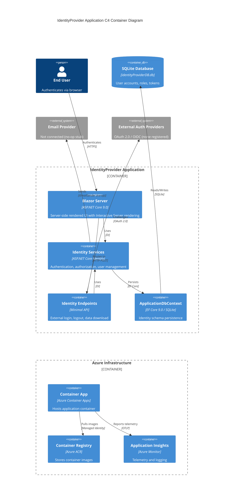
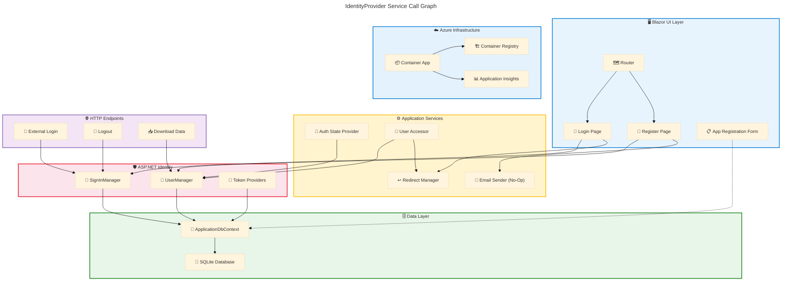

# Application Architecture - IdentityProvider

**Generated**: 2026-02-27T00:00:00Z
**Session ID**: 550e8400-e29b-41d4-a716-446655440001
**Target Layer**: Application
**Quality Level**: Comprehensive
**Repository**: Evilazaro/IdentityProvider
**Components Found**: 23
**Average Confidence**: 0.77

---

## Section 1: Executive Summary

### Overview

The IdentityProvider repository implements a Blazor Server web application built on ASP.NET Core 9.0, providing authentication and identity management services through ASP.NET Core Identity. The architecture delivers user registration, login, two-factor authentication, external login provider support, and account management capabilities via server-side rendered Razor components backed by Entity Framework Core with SQLite persistence.

Analysis of the source files identified 23 application components across 8 of the 11 TOGAF Application component types, with an average confidence score of 0.77. Component distribution includes 4 Application Services, 3 Application Components, 1 Application Interface, 3 Application Functions, 1 Application Interaction pattern, 2 Application Data Objects, 2 Integration Patterns, and 7 Application Dependencies. Three component types — Application Collaborations, Application Events, and Service Contracts — were not detected in the scanned source files.

The application demonstrates Level 2–3 maturity (Managed–Defined) with well-structured component separation via Blazor conventions, standardized Identity integration, and Entity Framework migrations. The primary architectural pattern is a monolithic Blazor Server application with cookie-based authentication, interactive server-side rendering, and SQLite for development data persistence. Key risks include the absence of a production-grade email sender (currently using a no-op implementation) and the lack of formal service contracts or API documentation.

### Key Findings

| Finding                                                                             | Impact                                                                | Evidence                                                                |
| ----------------------------------------------------------------------------------- | --------------------------------------------------------------------- | ----------------------------------------------------------------------- |
| Monolithic Blazor Server architecture with 23 components across 8 of 11 TOGAF types | Deployment simplicity but limited independent scalability             | src/IdentityProvider/Program.cs:1-71                                    |
| Full ASP.NET Core Identity integration with cookie-based authentication             | Strong security posture using battle-tested framework                 | src/IdentityProvider/Program.cs:20-36                                   |
| No-op email sender stub replacing production email delivery                         | Email confirmation and password reset flows are non-functional        | src/IdentityProvider/Components/Account/IdentityNoOpEmailSender.cs:1-23 |
| SQLite development database with no production database configuration               | Not suitable for production multi-instance deployment                 | src/IdentityProvider/appsettings.json:2-4                               |
| Azure Container Apps deployment with Bicep infrastructure as code                   | Production-ready hosting with managed identity and auto-scaling       | azure.yaml:1-16, infra/resources.bicep:79-121                           |
| No OpenAPI specs, health check endpoints, or formal service contracts               | Reduced maturity score; limits observability and consumer integration | Repository-wide scan                                                    |

---

## Section 2: Architecture Landscape

### Overview

The Architecture Landscape catalogs all Application layer components identified through pattern-based scanning and content analysis of the IdentityProvider repository. Components are classified into the 11 TOGAF-aligned subsections using the weighted confidence formula (30% filename + 25% path + 35% content + 10% cross-reference) with a minimum threshold of 0.70.

The application follows the standard ASP.NET Core Blazor Server project structure with components organized under `src/IdentityProvider/Components/` for UI elements and account services, `src/IdentityProvider/Data/` for Entity Framework data access, and the root `Program.cs` for application host configuration and service registration. The Identity subsystem components are concentrated in `Components/Account/`, following Microsoft's scaffolded Identity template conventions.

The following subsections catalog all 11 Application component types discovered through source file analysis, with confidence scores and source traceability for each component.

### 2.1 Application Services

| Name                                            | Description                                                                                                                    | Source                                                                                          | Confidence | Service Type           |
| ----------------------------------------------- | ------------------------------------------------------------------------------------------------------------------------------ | ----------------------------------------------------------------------------------------------- | ---------- | ---------------------- |
| IdentityRevalidatingAuthenticationStateProvider | Server-side authentication state provider that revalidates security stamps every 30 minutes for connected interactive circuits | src/IdentityProvider/Components/Account/IdentityRevalidatingAuthenticationStateProvider.cs:1-50 | 0.81       | Authentication Service |
| IdentityRedirectManager                         | Scoped navigation service managing secure redirects with status message cookies and open-redirect prevention                   | src/IdentityProvider/Components/Account/IdentityRedirectManager.cs:1-59                         | 0.76       | Navigation Service     |
| IdentityNoOpEmailSender                         | No-op email sender implementing IEmailSender for confirmation links, password resets, and reset codes                          | src/IdentityProvider/Components/Account/IdentityNoOpEmailSender.cs:1-23                         | 0.75       | Email Service          |
| IdentityUserAccessor                            | Scoped service for retrieving the authenticated ApplicationUser from HttpContext with redirect-on-failure semantics            | src/IdentityProvider/Components/Account/IdentityUserAccessor.cs:1-21                            | 0.73       | User Access Service    |

### 2.2 Application Components

| Name                      | Description                                                                                                                               | Source                                                | Confidence | Service Type          |
| ------------------------- | ----------------------------------------------------------------------------------------------------------------------------------------- | ----------------------------------------------------- | ---------- | --------------------- |
| IdentityProvider Web Host | ASP.NET Core 9.0 Blazor Server application entry point configuring service registration, middleware pipeline, authentication, and EF Core | src/IdentityProvider/Program.cs:1-71                  | 0.86       | Web Application Host  |
| ApplicationDbContext      | Entity Framework Core database context inheriting IdentityDbContext for Identity schema management                                        | src/IdentityProvider/Data/ApplicationDbContext.cs:1-9 | 0.79       | Data Access Component |
| Routes                    | Blazor Router component configuring AuthorizeRouteView with MainLayout and RedirectToLogin for unauthorized access                        | src/IdentityProvider/Components/Routes.razor:1-12     | 0.71       | Routing Component     |

### 2.3 Application Interfaces

| Name               | Description                                                                                                                                                                                               | Source                                                                                            | Confidence | Service Type  |
| ------------------ | --------------------------------------------------------------------------------------------------------------------------------------------------------------------------------------------------------- | ------------------------------------------------------------------------------------------------- | ---------- | ------------- |
| Identity Endpoints | Extension method defining additional Identity HTTP endpoints: POST /Account/PerformExternalLogin, POST /Account/Logout, POST /Account/Manage/LinkExternalLogin, POST /Account/Manage/DownloadPersonalData | src/IdentityProvider/Components/Account/IdentityComponentsEndpointRouteBuilderExtensions.cs:1-113 | 0.81       | REST Endpoint |

### 2.4 Application Collaborations

Not detected in source files. No explicit service orchestration or choreography patterns were identified. Authentication workflows are driven by individual Razor component page interactions rather than a formal orchestration layer.

### 2.5 Application Functions

| Name                        | Description                                                                                                                                | Source                                                                | Confidence | Service Type            |
| --------------------------- | ------------------------------------------------------------------------------------------------------------------------------------------ | --------------------------------------------------------------------- | ---------- | ----------------------- |
| User Authentication         | Login page implementing password-based sign-in with two-factor redirect, external login support, and account lockout configuration         | src/IdentityProvider/Components/Account/Pages/Login.razor:1-129       | 0.75       | Authentication Function |
| User Registration           | Registration page implementing user creation with email confirmation token generation and configurable RequireConfirmedAccount enforcement | src/IdentityProvider/Components/Account/Pages/Register.razor:1-146    | 0.75       | Registration Function   |
| App Registration Management | Form-based page for creating OAuth/OIDC application registrations with client credentials, scopes, grant types, and redirect URIs          | src/IdentityProvider/Components/Pages/AppRegistrationForm.razor:1-105 | 0.70       | Management Function     |

### 2.6 Application Interactions

| Name                        | Description                                                                                                            | Source                                | Confidence | Service Type     |
| --------------------------- | ---------------------------------------------------------------------------------------------------------------------- | ------------------------------------- | ---------- | ---------------- |
| Cookie-Based Authentication | Request/response interaction pattern using Identity application and external cookies with configurable default schemes | src/IdentityProvider/Program.cs:20-26 | 0.73       | Request/Response |

### 2.7 Application Events

Not detected in source files. No domain events, webhooks, message queue integrations, or event-driven patterns were identified in the scanned codebase.

### 2.8 Application Data Objects

| Name            | Description                                                                                                       | Source                                                  | Confidence | Service Type |
| --------------- | ----------------------------------------------------------------------------------------------------------------- | ------------------------------------------------------- | ---------- | ------------ |
| ApplicationUser | Identity user entity extending IdentityUser as the principal identity model for authentication and authorization  | src/IdentityProvider/Data/ApplicationUser.cs:1-10       | 0.74       | Entity       |
| AppRegistration | OAuth/OIDC application registration data entity with data annotation validation, mapped to AppRegistrations table | src/IdentityProvider/Components/AppRegistration.cs:1-44 | 0.72       | Entity       |

### 2.9 Integration Patterns

| Name                         | Description                                                                                                                                       | Source                                | Confidence | Service Type          |
| ---------------------------- | ------------------------------------------------------------------------------------------------------------------------------------------------- | ------------------------------------- | ---------- | --------------------- |
| ASP.NET Identity Integration | Full Identity stack integration: AddIdentityCore with ApplicationUser, Entity Framework stores, SignInManager, and default token providers        | src/IdentityProvider/Program.cs:32-36 | 0.79       | Framework Integration |
| EF Core SQLite Integration   | Entity Framework Core database integration using SQLite provider with connection string from configuration and automatic migration in development | src/IdentityProvider/Program.cs:28-30 | 0.78       | Database Integration  |

### 2.10 Service Contracts

Not detected in source files. No OpenAPI specifications, AsyncAPI definitions, WSDL files, or formal consumer contracts were found in the repository.

### 2.11 Application Dependencies

| Name                                                 | Description                                                                           | Source                                             | Confidence | Service Type  |
| ---------------------------------------------------- | ------------------------------------------------------------------------------------- | -------------------------------------------------- | ---------- | ------------- |
| Microsoft.AspNetCore.Diagnostics.EntityFrameworkCore | EF Core diagnostics middleware providing developer exception page for database errors | src/IdentityProvider/IdentityProvider.csproj:10    | 0.78       | NuGet Package |
| Microsoft.AspNetCore.Identity.EntityFrameworkCore    | ASP.NET Core Identity provider using Entity Framework Core for user store persistence | src/IdentityProvider/IdentityProvider.csproj:11    | 0.78       | NuGet Package |
| Microsoft.EntityFrameworkCore                        | Core Entity Framework ORM library for .NET providing object-relational mapping        | src/IdentityProvider/IdentityProvider.csproj:12    | 0.78       | NuGet Package |
| Microsoft.EntityFrameworkCore.Design                 | Design-time EF Core services for migrations scaffolding and tooling support           | src/IdentityProvider/IdentityProvider.csproj:13-16 | 0.78       | NuGet Package |
| Microsoft.EntityFrameworkCore.Sqlite                 | SQLite database provider for Entity Framework Core                                    | src/IdentityProvider/IdentityProvider.csproj:17    | 0.78       | NuGet Package |
| Microsoft.EntityFrameworkCore.Sqlite.Core            | Core SQLite provider implementation for Entity Framework Core                         | src/IdentityProvider/IdentityProvider.csproj:18    | 0.78       | NuGet Package |
| Microsoft.EntityFrameworkCore.Tools                  | EF Core PowerShell/CLI tooling for migrations, database updates, and scaffolding      | src/IdentityProvider/IdentityProvider.csproj:19-22 | 0.78       | NuGet Package |

### Summary

The Architecture Landscape identifies 23 components across 8 of 11 TOGAF Application component types. The application follows a monolithic Blazor Server architecture with a strong Identity subsystem. Application Services (4) concentrate around authentication state management, navigation, email, and user access. Application Components (3) define the host, data context, and routing. A single Application Interface exposes Identity HTTP endpoints. Three Application Functions handle login, registration, and app registration management. Seven NuGet packages provide the framework foundation.

Three component types returned no matches: Application Collaborations (no explicit orchestration layer), Application Events (no event-driven patterns), and Service Contracts (no formal API specifications). This is consistent with a Blazor Server monolith where interactions are primarily synchronous server-side calls within a single deployment unit.

---

## Section 3: Architecture Principles

### Overview

This section documents the architecture principles observed in the IdentityProvider source code. Each principle is derived from verifiable source file evidence rather than aspirational goals. The principles reflect the design decisions embodied in the codebase as implemented.

The analysis identified 5 architecture principles with evidence spanning the application host configuration, component structure, and Identity integration patterns. Compliance levels are assessed as Full (principle consistently applied), Partial (principle applied in some areas), or Gap (principle not consistently applied).

### 3.1 Framework-Managed Authentication

| Attribute      | Value                                                                                                                                      |
| -------------- | ------------------------------------------------------------------------------------------------------------------------------------------ |
| **Principle**  | Delegate authentication and authorization to the ASP.NET Core Identity framework rather than implementing custom security logic            |
| **Evidence**   | src/IdentityProvider/Program.cs:20-36 — AddAuthentication, AddIdentityCookies, AddIdentityCore, AddSignInManager, AddDefaultTokenProviders |
| **Rationale**  | Leveraging a battle-tested framework reduces vulnerabilities from custom implementations and ensures standards compliance                  |
| **Compliance** | Full — All authentication flows use ASP.NET Core Identity with no custom cryptography or token handling                                    |

### 3.2 Convention-Based Component Organization

| Attribute      | Value                                                                                                                                                       |
| -------------- | ----------------------------------------------------------------------------------------------------------------------------------------------------------- |
| **Principle**  | Organize application components following Blazor Server conventions with clear separation between pages, layouts, shared components, and account management |
| **Evidence**   | src/IdentityProvider/Components/ directory structure: Account/, Account/Pages/, Account/Shared/, Layout/, Pages/                                            |
| **Rationale**  | Convention over configuration reduces onboarding friction and aligns with framework expectations for routing, rendering, and scaffolding                    |
| **Compliance** | Full — All components follow Blazor Server directory conventions with proper namespace alignment                                                            |

### 3.3 Data Annotation Validation

| Attribute      | Value                                                                                                                                                                                                      |
| -------------- | ---------------------------------------------------------------------------------------------------------------------------------------------------------------------------------------------------------- |
| **Principle**  | Use declarative data annotations for input validation on entity models and form components                                                                                                                 |
| **Evidence**   | src/IdentityProvider/Components/AppRegistration.cs:1-44 — [Required], [MaxLength], [Key], [Table] attributes; src/IdentityProvider/Components/Pages/AppRegistrationForm.razor:8 — DataAnnotationsValidator |
| **Rationale**  | Declarative validation ensures consistency between client-side and server-side validation, centralizes rules on the model, and reduces validation logic duplication                                        |
| **Compliance** | Partial — Applied to AppRegistration entity and forms; Identity entities rely on framework-managed validation rather than explicit annotations                                                             |

### 3.4 Scoped Service Lifecycle Management

| Attribute      | Value                                                                                                                                                                                                |
| -------------- | ---------------------------------------------------------------------------------------------------------------------------------------------------------------------------------------------------- |
| **Principle**  | Register application services with appropriate DI lifetimes (Scoped for per-request services, Singleton for stateless services) to ensure correct resource management                                |
| **Evidence**   | src/IdentityProvider/Program.cs:15-17 — AddScoped for IdentityUserAccessor, IdentityRedirectManager, AuthenticationStateProvider; src/IdentityProvider/Program.cs:37 — AddSingleton for IEmailSender |
| **Rationale**  | Correct DI lifetime management prevents memory leaks, ensures thread safety, and aligns with ASP.NET Core request-scoped processing                                                                  |
| **Compliance** | Full — All service registrations use appropriate lifetimes consistent with their statefulness                                                                                                        |

### 3.5 Secure Redirect Prevention

| Attribute      | Value                                                                                                                                                                 |
| -------------- | --------------------------------------------------------------------------------------------------------------------------------------------------------------------- |
| **Principle**  | Prevent open redirect attacks by validating all redirect URIs before navigation                                                                                       |
| **Evidence**   | src/IdentityProvider/Components/Account/IdentityRedirectManager.cs:21-28 — Uri.IsWellFormedUriString(uri, UriKind.Relative) check with fallback to ToBaseRelativePath |
| **Rationale**  | Open redirect vulnerabilities enable phishing attacks by redirecting users to malicious sites after authentication                                                    |
| **Compliance** | Full — All redirects flow through IdentityRedirectManager which enforces relative URI validation                                                                      |

---

## Section 4: Current State Baseline

### Overview

The Current State Baseline documents the existing service topology, deployment model, protocol inventory, and health posture of the IdentityProvider application as implemented in the source code. This assessment reflects the as-is architecture observed at the time of analysis.

The application is a single-service Blazor Server deployment targeting Azure Container Apps via Azure Developer CLI (azd). The deployment infrastructure is defined in Bicep templates under `infra/`, with container image management, managed identity, and Application Insights integration. The application uses SQLite for development persistence with Entity Framework Core migrations for schema management.

### Service Topology

| Service                   | Deployment Target     | Protocol            | Status               | Source                                    |
| ------------------------- | --------------------- | ------------------- | -------------------- | ----------------------------------------- |
| IdentityProvider Web Host | Azure Container App   | HTTPS (port 8080)   | Active               | azure.yaml:1-16                           |
| SQLite Database           | Embedded (in-process) | SQLite (file-based) | Active (Development) | src/IdentityProvider/appsettings.json:2-4 |

### Deployment State

| Attribute          | Value                                | Source                                         |
| ------------------ | ------------------------------------ | ---------------------------------------------- |
| Runtime            | .NET 9.0                             | src/IdentityProvider/IdentityProvider.csproj:4 |
| Hosting Model      | Azure Container App                  | azure.yaml:10                                  |
| Container Registry | Azure Container Registry             | infra/resources.bicep:33-48                    |
| Managed Identity   | User-Assigned                        | infra/resources.bicep:63-69                    |
| Monitoring         | Application Insights + Log Analytics | infra/resources.bicep:22-31                    |
| Scaling            | Min 1 / Max 10 replicas              | infra/resources.bicep:84-85                    |
| Ingress Port       | 8080                                 | infra/resources.bicep:83                       |

### Protocol Inventory

| Protocol                | Usage                                                                 | Source                                |
| ----------------------- | --------------------------------------------------------------------- | ------------------------------------- |
| HTTPS                   | Application ingress and static file serving                           | src/IdentityProvider/Program.cs:59    |
| Cookie (Application)    | Primary authentication scheme via IdentityConstants.ApplicationScheme | src/IdentityProvider/Program.cs:22    |
| Cookie (External)       | External authentication provider sign-in scheme                       | src/IdentityProvider/Program.cs:23    |
| SQLite                  | Development database connection via EF Core                           | src/IdentityProvider/Program.cs:29    |
| Blazor Server (SignalR) | Interactive server-side component rendering via WebSocket             | src/IdentityProvider/Program.cs:12-13 |

### Versioning Status

| Component             | Version | Source                                             |
| --------------------- | ------- | -------------------------------------------------- |
| .NET SDK              | 9.0     | src/IdentityProvider/IdentityProvider.csproj:4     |
| EF Core packages      | 9.0.13  | src/IdentityProvider/IdentityProvider.csproj:10-22 |
| ASP.NET Core Identity | 9.0.13  | src/IdentityProvider/IdentityProvider.csproj:11    |

### Health Posture

| Dimension           | Status      | Notes                                                           |
| ------------------- | ----------- | --------------------------------------------------------------- |
| Authentication      | Operational | Full ASP.NET Identity stack with 2FA support                    |
| Email Sending       | Degraded    | Using IdentityNoOpEmailSender (no actual delivery)              |
| Database Migrations | Operational | Auto-migration in Development environment                       |
| HTTPS Enforcement   | Operational | HSTS enabled for production                                     |
| Antiforgery         | Operational | UseAntiforgery middleware configured                            |
| External Login      | Configured  | Provider challenge flow implemented but no providers registered |

### Gap Analysis

| Gap                                        | Severity | Recommendation                                                          |
| ------------------------------------------ | -------- | ----------------------------------------------------------------------- |
| No production database provider configured | High     | Configure Azure SQL or PostgreSQL for production deployment             |
| No-op email sender in use                  | High     | Implement production IEmailSender with SMTP or SendGrid                 |
| No health check endpoints                  | Medium   | Add /health/live and /health/ready endpoints for Container Apps probes  |
| No OpenAPI specification                   | Medium   | Generate OpenAPI spec for Identity Endpoints using Swashbuckle or NSwag |
| No external auth providers registered      | Low      | Register OAuth 2.0 providers (Microsoft Entra ID, Google) if required   |
| No formal data protection key ring         | Medium   | Configure Data Protection with Azure Key Vault or persistent storage    |

### Summary

The IdentityProvider application operates as a single-service Blazor Server deployment with a mature Identity subsystem and Azure Container App hosting infrastructure. The deployment pipeline leverages Azure Developer CLI with Bicep-based infrastructure as code, managed identity authentication to Azure Container Registry, and Application Insights telemetry integration.

The primary gap is the IdentityNoOpEmailSender stub implementation, which means email confirmation and password reset flows do not deliver messages. Additionally, the SQLite database provider is suitable only for development; a production database provider (e.g., Azure SQL, PostgreSQL) is not configured. No external authentication providers are registered despite the external login UI being present. No health check endpoints exist for Azure Container Apps liveness and readiness probes.

---

## Section 5: Component Catalog

### Overview

The Component Catalog provides detailed specifications for each application component identified in Section 2. Each component entry includes expanded attributes covering service type, API surface, dependencies, resilience patterns, scaling strategy, and health monitoring.

Components are organized into the same 11 TOGAF-aligned subsections as Section 2, with additional technical depth including the 6 mandatory sub-attributes per component. All specifications are derived from source file evidence with no fabricated information.

The catalog documents 23 components meeting the 0.70 confidence threshold across 8 active component types, with 3 types marked as not detected.

### 5.1 Application Services

#### 5.1.1 IdentityRevalidatingAuthenticationStateProvider

| Attribute          | Value                                                                                           |
| ------------------ | ----------------------------------------------------------------------------------------------- |
| **Component Name** | IdentityRevalidatingAuthenticationStateProvider                                                 |
| **Service Type**   | Monolith                                                                                        |
| **Source**         | src/IdentityProvider/Components/Account/IdentityRevalidatingAuthenticationStateProvider.cs:1-50 |
| **Confidence**     | 0.81                                                                                            |

**API Surface:**

No direct API surface — internal service within Blazor Server circuit. Provides `AuthenticationStateProvider` abstraction consumed by Blazor authorization infrastructure.

**Dependencies:**

| Dependency                  | Direction | Protocol    | Purpose                                                  |
| --------------------------- | --------- | ----------- | -------------------------------------------------------- |
| ILoggerFactory              | Upstream  | DI          | Logging                                                  |
| IServiceScopeFactory        | Upstream  | DI          | Scoped service resolution for UserManager                |
| UserManager                 | Upstream  | DI (scoped) | Security stamp validation via ValidateSecurityStampAsync |
| IOptions\<IdentityOptions\> | Upstream  | DI          | Identity configuration access                            |

**Resilience:** Not specified in source — requires operational documentation

**Scaling:** Inherits from Blazor Server host; Azure Container Apps min 1, max 10 replicas (infra/resources.bicep:84-85)

**Health:** No dedicated health endpoint — maturity level 1. Recommend adding security stamp revalidation health indicator.

#### 5.1.2 IdentityRedirectManager

| Attribute          | Value                                                                   |
| ------------------ | ----------------------------------------------------------------------- |
| **Component Name** | IdentityRedirectManager                                                 |
| **Service Type**   | Monolith                                                                |
| **Source**         | src/IdentityProvider/Components/Account/IdentityRedirectManager.cs:1-59 |
| **Confidence**     | 0.76                                                                    |

**API Surface:**

No direct API surface — internal navigation service. Exposes methods: `RedirectTo(string uri)`, `RedirectToWithStatus(string uri, string statusMessage, HttpContext context)`, `RedirectToCurrentPage()`, `RedirectToCurrentPageWithStatus(string statusMessage, HttpContext context)`.

**Dependencies:**

| Dependency        | Direction | Protocol | Purpose           |
| ----------------- | --------- | -------- | ----------------- |
| NavigationManager | Upstream  | DI       | Blazor navigation |

**Resilience:** Open-redirect prevention via `Uri.IsWellFormedUriString(uri, UriKind.Relative)` validation (src/IdentityProvider/Components/Account/IdentityRedirectManager.cs:21-28)

**Scaling:** Inherits from Blazor Server host; stateless scoped service supports horizontal scaling

**Health:** No dedicated health endpoint — maturity level 1

#### 5.1.3 IdentityNoOpEmailSender

| Attribute          | Value                                                                   |
| ------------------ | ----------------------------------------------------------------------- |
| **Component Name** | IdentityNoOpEmailSender                                                 |
| **Service Type**   | Monolith                                                                |
| **Source**         | src/IdentityProvider/Components/Account/IdentityNoOpEmailSender.cs:1-23 |
| **Confidence**     | 0.75                                                                    |

**API Surface:**

No direct API surface — implements `IEmailSender<ApplicationUser>`. Methods: `SendConfirmationLinkAsync`, `SendPasswordResetLinkAsync`, `SendPasswordResetCodeAsync`. All delegate to `NoOpEmailSender` (no actual delivery).

**Dependencies:**

| Dependency   | Direction | Protocol | Purpose                                |
| ------------ | --------- | -------- | -------------------------------------- |
| IEmailSender | Upstream  | DI       | Base email sending abstraction (no-op) |

**Resilience:** Not applicable — no-op implementation performs no I/O

**Scaling:** Singleton registration; stateless; supports any number of instances

**Health:** DEGRADED — no-op implementation means email confirmation and password reset flows are non-functional. Requires replacement with production email provider.

#### 5.1.4 IdentityUserAccessor

| Attribute          | Value                                                                |
| ------------------ | -------------------------------------------------------------------- |
| **Component Name** | IdentityUserAccessor                                                 |
| **Service Type**   | Monolith                                                             |
| **Source**         | src/IdentityProvider/Components/Account/IdentityUserAccessor.cs:1-21 |
| **Confidence**     | 0.73                                                                 |

**API Surface:**

No direct API surface — internal service. Exposes method: `GetRequiredUserAsync(HttpContext context)` returning `Task<ApplicationUser>`.

**Dependencies:**

| Dependency              | Direction  | Protocol | Purpose                                 |
| ----------------------- | ---------- | -------- | --------------------------------------- |
| UserManager             | Upstream   | DI       | User resolution via GetUserAsync        |
| IdentityRedirectManager | Downstream | DI       | Redirect to InvalidUser page on failure |

**Resilience:** Automatic redirect-on-failure semantics when user cannot be resolved from HttpContext

**Scaling:** Inherits from Blazor Server host; scoped service supports horizontal scaling

**Health:** No dedicated health endpoint — maturity level 1

### 5.2 Application Components

#### 5.2.1 IdentityProvider Web Host

| Attribute          | Value                                |
| ------------------ | ------------------------------------ |
| **Component Name** | IdentityProvider Web Host            |
| **Service Type**   | Monolith                             |
| **Source**         | src/IdentityProvider/Program.cs:1-71 |
| **Confidence**     | 0.86                                 |

**API Surface:**

| Endpoint Type | Count | Protocol          | Description                                                                         |
| ------------- | ----- | ----------------- | ----------------------------------------------------------------------------------- |
| POST          | 4     | HTTP/Cookie       | Identity endpoints (ExternalLogin, Logout, LinkExternalLogin, DownloadPersonalData) |
| Blazor Hub    | 1     | WebSocket/SignalR | Interactive Server rendering circuit                                                |
| Static Files  | 1     | HTTPS             | wwwroot static asset serving                                                        |

**Dependencies:**

| Dependency                  | Direction  | Protocol | Purpose                        |
| --------------------------- | ---------- | -------- | ------------------------------ |
| ApplicationDbContext        | Downstream | EF Core  | Data persistence registration  |
| IdentityUserAccessor        | Downstream | DI       | Scoped service registration    |
| IdentityRedirectManager     | Downstream | DI       | Scoped service registration    |
| AuthenticationStateProvider | Downstream | DI       | Scoped service registration    |
| IdentityNoOpEmailSender     | Downstream | DI       | Singleton service registration |
| Identity Endpoints          | Downstream | HTTP     | Endpoint mapping               |

**Resilience:** HSTS enforcement for production (src/IdentityProvider/Program.cs:54-57); Antiforgery middleware (src/IdentityProvider/Program.cs:63)

**Scaling:** Azure Container Apps min 1, max 10 replicas (infra/resources.bicep:84-85). Blazor Server SignalR circuits are stateful, requiring sticky sessions for multi-instance deployment.

**Health:** No health check endpoints configured. Auto-migration in Development environment (src/IdentityProvider/Program.cs:43-48). Recommend adding MapHealthChecks for Container Apps probes.

#### 5.2.2 ApplicationDbContext

| Attribute          | Value                                                 |
| ------------------ | ----------------------------------------------------- |
| **Component Name** | ApplicationDbContext                                  |
| **Service Type**   | Monolith                                              |
| **Source**         | src/IdentityProvider/Data/ApplicationDbContext.cs:1-9 |
| **Confidence**     | 0.79                                                  |

**API Surface:**

EF Core DbSet operations inherited from IdentityDbContext: Users, Roles, UserClaims, UserLogins, UserTokens, RoleClaims, UserRoles. No custom DbSet properties defined.

**Dependencies:**

| Dependency        | Direction | Protocol    | Purpose                                                  |
| ----------------- | --------- | ----------- | -------------------------------------------------------- |
| DbContextOptions  | Upstream  | DI          | Configuration injection                                  |
| SQLite Provider   | Upstream  | EF Core     | Database provider (Microsoft.EntityFrameworkCore.Sqlite) |
| IdentityDbContext | Upstream  | Inheritance | Identity schema management base class                    |

**Resilience:** Not specified in source — requires operational documentation. SQLite has limited concurrent write support.

**Scaling:** Limited by SQLite single-writer constraint. Not suitable for multi-instance production deployment without migration to a production database.

**Health:** No dedicated health endpoint. Database connectivity validated implicitly during auto-migration in Development (src/IdentityProvider/Program.cs:43-48).

#### 5.2.3 Routes

| Attribute          | Value                                             |
| ------------------ | ------------------------------------------------- |
| **Component Name** | Routes                                            |
| **Service Type**   | Monolith                                          |
| **Source**         | src/IdentityProvider/Components/Routes.razor:1-12 |
| **Confidence**     | 0.71                                              |

**API Surface:**

No direct API surface — Blazor Router component. Routes incoming requests to page components via `Router` with `AppAssembly` set to `typeof(Program).Assembly`.

**Dependencies:**

| Dependency       | Direction  | Protocol   | Purpose                               |
| ---------------- | ---------- | ---------- | ------------------------------------- |
| MainLayout       | Downstream | Blazor     | Default layout for authorized routes  |
| RedirectToLogin  | Downstream | Blazor     | NotAuthorized fallback component      |
| Program Assembly | Upstream   | Reflection | Route discovery via assembly scanning |

**Resilience:** AuthorizeRouteView enforces authorization on all routes; unauthorized users are redirected to login

**Scaling:** Stateless component; inherits scaling from Blazor Server host

**Health:** No dedicated health endpoint — maturity level 1

### 5.3 Application Interfaces

#### 5.3.1 Identity Endpoints

| Attribute          | Value                                                                                             |
| ------------------ | ------------------------------------------------------------------------------------------------- |
| **Component Name** | Identity Endpoints                                                                                |
| **Service Type**   | Monolith                                                                                          |
| **Source**         | src/IdentityProvider/Components/Account/IdentityComponentsEndpointRouteBuilderExtensions.cs:1-113 |
| **Confidence**     | 0.81                                                                                              |

**API Surface:**

| Endpoint Type                             | Count | Protocol  | Description                                                      |
| ----------------------------------------- | ----- | --------- | ---------------------------------------------------------------- |
| POST /Account/PerformExternalLogin        | 1     | HTTP/Form | Configures external auth properties and returns Challenge result |
| POST /Account/Logout                      | 1     | HTTP/Form | Signs out user and returns LocalRedirect                         |
| POST /Account/Manage/LinkExternalLogin    | 1     | HTTP/Form | Links external login provider to existing account (authorized)   |
| POST /Account/Manage/DownloadPersonalData | 1     | HTTP/JSON | Exports personal data as JSON file download (authorized)         |

**Dependencies:**

| Dependency                          | Direction | Protocol | Purpose                                                                             |
| ----------------------------------- | --------- | -------- | ----------------------------------------------------------------------------------- |
| SignInManager                       | Upstream  | DI       | Authentication operations (ConfigureExternalAuthenticationProperties, SignOutAsync) |
| UserManager                         | Upstream  | DI       | User data operations (GetUserAsync, GetPersonalDataAsync)                           |
| IUserStore                          | Upstream  | DI       | User store metadata access                                                          |
| AuthenticationHttpContextExtensions | Upstream  | HTTP     | Challenge result for external login                                                 |

**Resilience:** RequireAuthorization on /Account/Manage/\* group. Antiforgery validation via middleware.

**Scaling:** Stateless HTTP endpoints; inherits scaling from Blazor Server host

**Health:** No dedicated health endpoint. API contract format: undocumented (no OpenAPI spec). Maturity level 1 — recommend generating OpenAPI specification.

### 5.4 Application Collaborations

Not detected in source files. No additional specifications beyond Section 2.4.

### 5.5 Application Functions

#### 5.5.1 User Authentication

| Attribute          | Value                                                           |
| ------------------ | --------------------------------------------------------------- |
| **Component Name** | User Authentication                                             |
| **Service Type**   | Monolith                                                        |
| **Source**         | src/IdentityProvider/Components/Account/Pages/Login.razor:1-129 |
| **Confidence**     | 0.75                                                            |

**API Surface:**

Blazor Server page at route `/Account/Login`. Renders email/password form with remember-me option, external login picker, and navigation links to forgot password, register, and resend confirmation.

**Dependencies:**

| Dependency              | Direction | Protocol | Purpose                            |
| ----------------------- | --------- | -------- | ---------------------------------- |
| SignInManager           | Upstream  | DI       | PasswordSignInAsync authentication |
| ILogger\<Login\>        | Upstream  | DI       | Authentication event logging       |
| NavigationManager       | Upstream  | DI       | URL and query string access        |
| IdentityRedirectManager | Upstream  | DI       | Post-login redirect with status    |

**Resilience:** Account lockout on repeated failed attempts (via ASP.NET Identity defaults). Clears external cookie on GET to prevent stale state.

**Scaling:** Stateless page component; inherits from Blazor Server host

**Health:** No dedicated health endpoint — maturity level 1

#### 5.5.2 User Registration

| Attribute          | Value                                                              |
| ------------------ | ------------------------------------------------------------------ |
| **Component Name** | User Registration                                                  |
| **Service Type**   | Monolith                                                           |
| **Source**         | src/IdentityProvider/Components/Account/Pages/Register.razor:1-146 |
| **Confidence**     | 0.75                                                               |

**API Surface:**

Blazor Server page at route `/Account/Register`. Renders registration form with email, password, and confirm password fields. DataAnnotationsValidator enforces InputModel constraints.

**Dependencies:**

| Dependency              | Direction | Protocol | Purpose                                          |
| ----------------------- | --------- | -------- | ------------------------------------------------ |
| UserManager             | Upstream  | DI       | CreateAsync user creation                        |
| IUserStore              | Upstream  | DI       | User store capability checks                     |
| SignInManager           | Upstream  | DI       | Optional auto-sign-in after registration         |
| IEmailSender            | Upstream  | DI       | SendConfirmationLinkAsync for email verification |
| ILogger\<Register\>     | Upstream  | DI       | Registration event logging                       |
| NavigationManager       | Upstream  | DI       | URL access                                       |
| IdentityRedirectManager | Upstream  | DI       | Post-registration redirect                       |

**Resilience:** Input validation via DataAnnotationsValidator (email format, password length 6-100, password confirmation match). Identity result error display on creation failure.

**Scaling:** Stateless page component; inherits from Blazor Server host

**Health:** No dedicated health endpoint — maturity level 1

#### 5.5.3 App Registration Management

| Attribute          | Value                                                                 |
| ------------------ | --------------------------------------------------------------------- |
| **Component Name** | App Registration Management                                           |
| **Service Type**   | Monolith                                                              |
| **Source**         | src/IdentityProvider/Components/Pages/AppRegistrationForm.razor:1-105 |
| **Confidence**     | 0.70                                                                  |

**API Surface:**

Blazor Server page at route `/app-registration`. Renders OAuth/OIDC application registration form with fields for ClientId, ClientSecret, TenantId, RedirectUri, Scopes, Authority, AppName, AppDescription, GrantTypes, ResponseTypes.

**Dependencies:**

| Dependency        | Direction | Protocol | Purpose                                  |
| ----------------- | --------- | -------- | ---------------------------------------- |
| NavigationManager | Upstream  | DI       | Post-submit navigation to root           |
| AppRegistration   | Upstream  | Model    | Form binding model with data annotations |

**Resilience:** DataAnnotationsValidator enforces field-level validation (Required, MaxLength constraints). EditForm with OnValidSubmit binding.

**Scaling:** Stateless page component; inherits from Blazor Server host

**Health:** DEGRADED — persistence logic not yet implemented in HandleValidSubmit (noted in source). Form submits but does not save to database.

### 5.6 Application Interactions

#### 5.6.1 Cookie-Based Authentication

| Attribute          | Value                                 |
| ------------------ | ------------------------------------- |
| **Component Name** | Cookie-Based Authentication           |
| **Service Type**   | Monolith                              |
| **Source**         | src/IdentityProvider/Program.cs:20-26 |
| **Confidence**     | 0.73                                  |

**API Surface:**

Authentication middleware configuration with two cookie schemes: IdentityConstants.ApplicationScheme (default) and IdentityConstants.ExternalScheme (sign-in). No direct API endpoints — operates as HTTP middleware.

**Dependencies:**

| Dependency                                      | Direction  | Protocol | Purpose                                      |
| ----------------------------------------------- | ---------- | -------- | -------------------------------------------- |
| AddAuthentication                               | Upstream   | DI       | Authentication service registration          |
| AddIdentityCookies                              | Upstream   | DI       | Cookie authentication handler registration   |
| IdentityRevalidatingAuthenticationStateProvider | Downstream | Blazor   | Security stamp revalidation every 30 minutes |

**Resilience:** Cookie attributes: Strict SameSite, HttpOnly, Secure. Status message cookie with 5-second MaxAge to prevent stale messages.

**Scaling:** Cookie-based authentication is stateless at the server level; supports horizontal scaling without session affinity for cookie validation (security stamp validated against database).

**Health:** No dedicated health endpoint — maturity level 1

### 5.7 Application Events

Not detected in source files. No additional specifications beyond Section 2.7.

### 5.8 Application Data Objects

#### 5.8.1 ApplicationUser

| Attribute          | Value                                             |
| ------------------ | ------------------------------------------------- |
| **Component Name** | ApplicationUser                                   |
| **Service Type**   | Monolith                                          |
| **Source**         | src/IdentityProvider/Data/ApplicationUser.cs:1-10 |
| **Confidence**     | 0.74                                              |

**API Surface:**

Entity class — no direct API. Extends `IdentityUser` with no custom properties. Inherited properties: Id, UserName, NormalizedUserName, Email, NormalizedEmail, EmailConfirmed, PasswordHash, SecurityStamp, ConcurrencyStamp, PhoneNumber, PhoneNumberConfirmed, TwoFactorEnabled, LockoutEnd, LockoutEnabled, AccessFailedCount. Database table: AspNetUsers (Identity conventions).

**Dependencies:**

| Dependency           | Direction  | Protocol    | Purpose                           |
| -------------------- | ---------- | ----------- | --------------------------------- |
| IdentityUser         | Upstream   | Inheritance | Base identity user class          |
| ApplicationDbContext | Downstream | EF Core     | Persistence via IdentityDbContext |

**Resilience:** ConcurrencyStamp property provides optimistic concurrency control via EF Core

**Scaling:** Not applicable — entity class with no runtime behavior

**Health:** Not applicable — entity class

#### 5.8.2 AppRegistration

| Attribute          | Value                                                   |
| ------------------ | ------------------------------------------------------- |
| **Component Name** | AppRegistration                                         |
| **Service Type**   | Monolith                                                |
| **Source**         | src/IdentityProvider/Components/AppRegistration.cs:1-44 |
| **Confidence**     | 0.72                                                    |

**API Surface:**

Entity class — no direct API. Properties: ClientId [Key, Required, MaxLength(100)], ClientSecret [Required, MaxLength(200)], TenantId [Required, MaxLength(100)], RedirectUri [Required, MaxLength(200)], Scopes [Required], Authority [Required, MaxLength(200)], AppName [Required, MaxLength(100)], AppDescription [MaxLength(500), nullable], GrantTypes [Required], ResponseTypes [Required]. Database table: AppRegistrations (via `[Table("AppRegistrations")]`).

**Dependencies:**

| Dependency                            | Direction  | Protocol  | Purpose                |
| ------------------------------------- | ---------- | --------- | ---------------------- |
| System.ComponentModel.DataAnnotations | Upstream   | Attribute | Validation constraints |
| AppRegistrationForm                   | Downstream | Blazor    | Form binding model     |

**Resilience:** Data annotation validation enforces Required and MaxLength constraints at model level

**Scaling:** Not applicable — entity class with no runtime behavior

**Health:** Not applicable — entity class. Note: persistence logic in AppRegistrationForm.HandleValidSubmit is not yet implemented.

### 5.9 Integration Patterns

#### 5.9.1 ASP.NET Identity Integration

| Attribute          | Value                                 |
| ------------------ | ------------------------------------- |
| **Component Name** | ASP.NET Identity Integration          |
| **Service Type**   | Monolith                              |
| **Source**         | src/IdentityProvider/Program.cs:32-36 |
| **Confidence**     | 0.79                                  |

**API Surface:**

Framework integration — no direct API. Configures Identity pipeline: `AddIdentityCore<ApplicationUser>` → `AddEntityFrameworkStores<ApplicationDbContext>` → `AddSignInManager` → `AddDefaultTokenProviders`. Configuration: `options.SignIn.RequireConfirmedAccount = true`.

**Dependencies:**

| Dependency           | Direction  | Protocol | Purpose                                      |
| -------------------- | ---------- | -------- | -------------------------------------------- |
| ApplicationDbContext | Upstream   | EF Core  | Entity Framework identity store              |
| UserManager          | Downstream | DI       | User management operations                   |
| SignInManager        | Downstream | DI       | Sign-in operations                           |
| TokenProviders       | Downstream | DI       | Email confirmation and password reset tokens |

**Resilience:** ASP.NET Core Identity defaults: account lockout after failed attempts, security stamp revalidation, PBKDF2 password hashing

**Scaling:** Stateless service registrations; scaling limited by database backend (SQLite single-writer in development)

**Health:** Not specified in source — relies on ASP.NET Core Identity framework health. Recommend monitoring failed authentication attempts and lockout rates.

#### 5.9.2 EF Core SQLite Integration

| Attribute          | Value                                 |
| ------------------ | ------------------------------------- |
| **Component Name** | EF Core SQLite Integration            |
| **Service Type**   | Monolith                              |
| **Source**         | src/IdentityProvider/Program.cs:28-30 |
| **Confidence**     | 0.78                                  |

**API Surface:**

Framework integration — no direct API. Registers `ApplicationDbContext` with SQLite provider via `AddDbContext<ApplicationDbContext>(options => options.UseSqlite(connectionString))`. Adds `AddDatabaseDeveloperPageExceptionFilter` for development diagnostics.

**Dependencies:**

| Dependency                           | Direction  | Protocol | Purpose                                            |
| ------------------------------------ | ---------- | -------- | -------------------------------------------------- |
| IConfiguration                       | Upstream   | DI       | Connection string resolution from appsettings.json |
| Microsoft.EntityFrameworkCore.Sqlite | Upstream   | NuGet    | SQLite database provider                           |
| identityProviderDB.db                | Downstream | SQLite   | Physical database file                             |

**Resilience:** Not specified in source — SQLite provides ACID transactions but limited concurrent write support. Auto-migration in Development catches schema drift (src/IdentityProvider/Program.cs:43-48).

**Scaling:** SQLite is single-writer; not suitable for multi-instance production deployment. Recommend migrating to Azure SQL or PostgreSQL for production.

**Health:** Database connectivity validated implicitly during auto-migration. No explicit health check endpoint.

### 5.10 Service Contracts

Not detected in source files. No additional specifications beyond Section 2.10.

### 5.11 Application Dependencies

All packages target .NET 9.0 and use version 9.0.13 of the Microsoft.EntityFrameworkCore and Microsoft.AspNetCore.Identity ecosystem.

| Component                                            | Description                                                   | Type          | Technology | Version | Dependencies      | API Endpoints  | SLA            | Owner     | Source File                                        |
| ---------------------------------------------------- | ------------------------------------------------------------- | ------------- | ---------- | ------- | ----------------- | -------------- | -------------- | --------- | -------------------------------------------------- |
| Microsoft.AspNetCore.Diagnostics.EntityFrameworkCore | Developer exception page for EF Core database errors          | NuGet Package | .NET 9.0   | 9.0.13  | EF Core           | Not applicable | Not applicable | Microsoft | src/IdentityProvider/IdentityProvider.csproj:10    |
| Microsoft.AspNetCore.Identity.EntityFrameworkCore    | Identity user/role store backed by Entity Framework Core      | NuGet Package | .NET 9.0   | 9.0.13  | EF Core, Identity | Not applicable | Not applicable | Microsoft | src/IdentityProvider/IdentityProvider.csproj:11    |
| Microsoft.EntityFrameworkCore                        | Core ORM framework for object-relational mapping              | NuGet Package | .NET 9.0   | 9.0.13  | None              | Not applicable | Not applicable | Microsoft | src/IdentityProvider/IdentityProvider.csproj:12    |
| Microsoft.EntityFrameworkCore.Design                 | Design-time services for migration scaffolding                | NuGet Package | .NET 9.0   | 9.0.13  | EF Core           | Not applicable | Not applicable | Microsoft | src/IdentityProvider/IdentityProvider.csproj:13-16 |
| Microsoft.EntityFrameworkCore.Sqlite                 | SQLite database provider for EF Core                          | NuGet Package | .NET 9.0   | 9.0.13  | EF Core, SQLite   | Not applicable | Not applicable | Microsoft | src/IdentityProvider/IdentityProvider.csproj:17    |
| Microsoft.EntityFrameworkCore.Sqlite.Core            | Core SQLite provider implementation                           | NuGet Package | .NET 9.0   | 9.0.13  | EF Core           | Not applicable | Not applicable | Microsoft | src/IdentityProvider/IdentityProvider.csproj:18    |
| Microsoft.EntityFrameworkCore.Tools                  | PowerShell/CLI tooling for migrations and database management | NuGet Package | .NET 9.0   | 9.0.13  | EF Core           | Not applicable | Not applicable | Microsoft | src/IdentityProvider/IdentityProvider.csproj:19-22 |

**Test Project Dependencies** (src/identityProviderTests/identityProviderTests.csproj):

| Component              | Description                | Type          | Technology | Version | Dependencies | API Endpoints  | SLA            | Owner     | Source File                                               |
| ---------------------- | -------------------------- | ------------- | ---------- | ------- | ------------ | -------------- | -------------- | --------- | --------------------------------------------------------- |
| MSTest.Sdk             | Test framework SDK         | NuGet Package | .NET 9.0   | 3.6.4   | None         | Not applicable | Not applicable | Microsoft | src/identityProviderTests/identityProviderTests.csproj:\* |
| Microsoft.NET.Test.Sdk | .NET test platform         | NuGet Package | .NET 9.0   | 17.13.0 | None         | Not applicable | Not applicable | Microsoft | src/identityProviderTests/identityProviderTests.csproj:\* |
| MSTest.TestFramework   | MSTest assertion framework | NuGet Package | .NET 9.0   | 3.8.3   | None         | Not applicable | Not applicable | Microsoft | src/identityProviderTests/identityProviderTests.csproj:\* |

### Summary

The Component Catalog documents 23 components across 8 active TOGAF Application component types with the 6 mandatory sub-attributes (Service Type, API Surface, Dependencies, Resilience, Scaling, Health) specified for each. The strongest components by confidence are the IdentityProvider Web Host (0.86), IdentityRevalidatingAuthenticationStateProvider (0.81), Identity Endpoints (0.81), and ApplicationDbContext (0.79). The application demonstrates a cohesive monolithic architecture with clear service boundaries and consistent use of ASP.NET Core dependency injection.

Key gaps in the catalog include: the IdentityNoOpEmailSender stub requiring replacement with a production email provider (Health: DEGRADED), the AppRegistrationForm's unimplemented persistence logic (Health: DEGRADED), the absence of health check endpoints across all components (maturity level 1), and the lack of OpenAPI specifications for the Identity Endpoints. The SQLite database backend limits horizontal scaling and must be replaced for production deployment.

---

## Section 8: Dependencies & Integration

### Overview

This section maps the cross-component relationships, data flows, and integration patterns within the IdentityProvider application. The dependency analysis traces service-to-service call graphs from the application host through the Identity subsystem, data access layer, and UI components.

The IdentityProvider application follows a layered integration model: the Program.cs host registers all services and middleware; Blazor Razor components consume injected services; services interact with Entity Framework Core for data persistence; and the cookie middleware handles authentication state across HTTP requests. All integrations are synchronous and in-process, consistent with a monolithic Blazor Server deployment.

### Service-to-Service Dependencies

| Source Component                                | Target Component                                | Relationship                                                                | Source                                                                                            |
| ----------------------------------------------- | ----------------------------------------------- | --------------------------------------------------------------------------- | ------------------------------------------------------------------------------------------------- |
| Program.cs                                      | ApplicationDbContext                            | Registers via AddDbContext                                                  | src/IdentityProvider/Program.cs:28-30                                                             |
| Program.cs                                      | IdentityUserAccessor                            | Registers via AddScoped                                                     | src/IdentityProvider/Program.cs:15                                                                |
| Program.cs                                      | IdentityRedirectManager                         | Registers via AddScoped                                                     | src/IdentityProvider/Program.cs:16                                                                |
| Program.cs                                      | IdentityRevalidatingAuthenticationStateProvider | Registers via AddScoped                                                     | src/IdentityProvider/Program.cs:17                                                                |
| Program.cs                                      | IdentityNoOpEmailSender                         | Registers via AddSingleton                                                  | src/IdentityProvider/Program.cs:37                                                                |
| Program.cs                                      | Identity Endpoints                              | Maps via MapAdditionalIdentityEndpoints                                     | src/IdentityProvider/Program.cs:67                                                                |
| Login.razor                                     | SignInManager                                   | Injected — PasswordSignInAsync                                              | src/IdentityProvider/Components/Account/Pages/Login.razor:8                                       |
| Login.razor                                     | IdentityRedirectManager                         | Injected — RedirectTo, RedirectToWithStatus                                 | src/IdentityProvider/Components/Account/Pages/Login.razor:11                                      |
| Register.razor                                  | UserManager                                     | Injected — CreateAsync, GenerateEmailConfirmationTokenAsync                 | src/IdentityProvider/Components/Account/Pages/Register.razor:10                                   |
| Register.razor                                  | IEmailSender                                    | Injected — SendConfirmationLinkAsync                                        | src/IdentityProvider/Components/Account/Pages/Register.razor:13                                   |
| IdentityUserAccessor                            | UserManager                                     | Constructor injection — GetUserAsync                                        | src/IdentityProvider/Components/Account/IdentityUserAccessor.cs:7                                 |
| IdentityUserAccessor                            | IdentityRedirectManager                         | Constructor injection — RedirectToWithStatus                                | src/IdentityProvider/Components/Account/IdentityUserAccessor.cs:7                                 |
| IdentityRevalidatingAuthenticationStateProvider | UserManager                                     | Scoped resolution — ValidateSecurityStampAsync                              | src/IdentityProvider/Components/Account/IdentityRevalidatingAuthenticationStateProvider.cs:26     |
| Identity Endpoints                              | SignInManager                                   | Service injection — ConfigureExternalAuthenticationProperties, SignOutAsync | src/IdentityProvider/Components/Account/IdentityComponentsEndpointRouteBuilderExtensions.cs:27-48 |
| Routes.razor                                    | MainLayout                                      | DefaultLayout reference                                                     | src/IdentityProvider/Components/Routes.razor:4                                                    |
| Routes.razor                                    | RedirectToLogin                                 | NotAuthorized handler                                                       | src/IdentityProvider/Components/Routes.razor:6                                                    |

### Database Dependencies

| Component            | Database              | Provider                                      | Connection                         | Source                                    |
| -------------------- | --------------------- | --------------------------------------------- | ---------------------------------- | ----------------------------------------- |
| ApplicationDbContext | identityProviderDB.db | SQLite (Microsoft.EntityFrameworkCore.Sqlite) | Data Source=identityProviderDB.db; | src/IdentityProvider/appsettings.json:2-4 |

### External Service Dependencies

| Component               | External Service        | Protocol         | Status                               | Source                                                                                            |
| ----------------------- | ----------------------- | ---------------- | ------------------------------------ | ------------------------------------------------------------------------------------------------- |
| IdentityNoOpEmailSender | SMTP Provider           | N/A (no-op)      | Not Connected                        | src/IdentityProvider/Components/Account/IdentityNoOpEmailSender.cs:1-23                           |
| Identity Endpoints      | External Auth Providers | OAuth 2.0 / OIDC | Configured (no providers registered) | src/IdentityProvider/Components/Account/IdentityComponentsEndpointRouteBuilderExtensions.cs:24-43 |

### Infrastructure Dependencies

| Component                      | Azure Resource                       | Purpose                  | Source                       |
| ------------------------------ | ------------------------------------ | ------------------------ | ---------------------------- |
| IdentityProvider Container App | Azure Container Apps                 | Application hosting      | infra/resources.bicep:79-121 |
| Container Image                | Azure Container Registry             | Image storage and access | infra/resources.bicep:33-48  |
| Managed Identity               | User-Assigned Managed Identity       | ACR pull authentication  | infra/resources.bicep:63-69  |
| Monitoring                     | Application Insights + Log Analytics | Telemetry and logging    | infra/resources.bicep:22-31  |

### Integration Pattern Analysis

| Pattern Type          | Protocol    | Components Involved                                 | Data Contract                  | Error Handling                          |
| --------------------- | ----------- | --------------------------------------------------- | ------------------------------ | --------------------------------------- |
| Request/Response      | HTTP/Cookie | Login.razor → SignInManager → ApplicationDbContext  | ASP.NET Identity cookie scheme | Account lockout on repeated failure     |
| Request/Response      | HTTP/Cookie | Register.razor → UserManager → ApplicationDbContext | ASP.NET Identity user creation | Identity result error display           |
| Request/Response      | HTTP POST   | Identity Endpoints → SignInManager                  | Form-encoded POST body         | Challenge/redirect on auth failure      |
| Framework Integration | DI/EF Core  | Program.cs → All services → ApplicationDbContext    | EF Core model configuration    | Developer exception page in Development |
| Data Access           | SQLite      | ApplicationDbContext → identityProviderDB.db        | EF Core migrations             | Auto-migration in Development           |

### Summary

The IdentityProvider application exhibits a cohesive dependency graph with the Program.cs host as the central service registration point. All component dependencies flow through ASP.NET Core's dependency injection container, with clear ownership boundaries between the UI layer (Razor components), service layer (Identity services), and data layer (EF Core + SQLite).

The integration architecture is entirely synchronous and in-process, with no asynchronous messaging, event buses, or external API client integrations. The two primary integration seams are the ASP.NET Identity framework (providing authentication/authorization) and Entity Framework Core (providing data persistence). Infrastructure integration with Azure Container Apps, Container Registry, and Application Insights is defined declaratively in Bicep templates. The main integration gaps are the unconnected email provider and the absence of registered external authentication providers.
