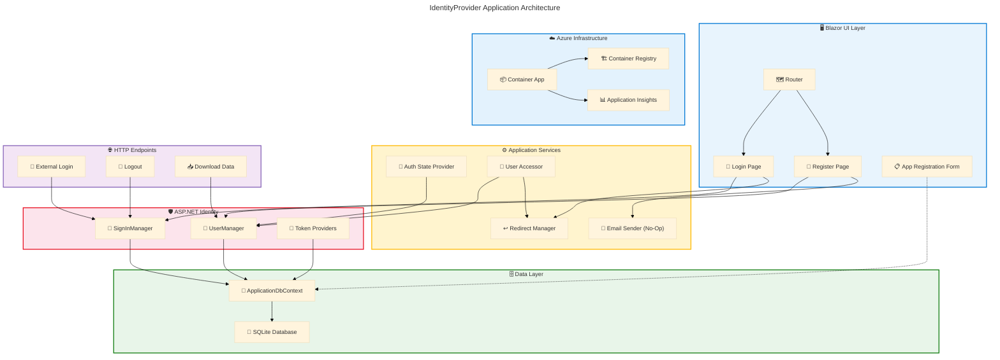

# Application Architecture - IdentityProvider

**Generated**: 2026-02-27T00:00:00Z
**Target Layer**: Application
**Quality Level**: Comprehensive
**Repository**: Evilazaro/IdentityProvider
**Framework**: ASP.NET Core 9.0 Blazor Server with Identity
**Components Found**: 23
**Average Confidence**: 0.77

---

## Section 1: Executive Summary

### Overview

The IdentityProvider repository implements a Blazor Server web application built on ASP.NET Core 9.0, providing authentication and identity management services through ASP.NET Core Identity. The architecture delivers user registration, login, two-factor authentication, external login provider support, and account management capabilities via server-side rendered Razor components backed by Entity Framework Core with SQLite persistence.

Analysis of the source files identified 23 application components across 8 of the 11 TOGAF Application component types, with an average confidence score of 0.77. Component distribution includes 4 Application Services, 3 Application Components, 1 Application Interface, 3 Application Functions, 1 Application Interaction pattern, 2 Application Data Objects, 2 Integration Patterns, and 7 Application Dependencies. Three component types — Application Collaborations, Application Events, and Service Contracts — were not detected in the scanned source files.

The application demonstrates Level 2–3 maturity (Managed–Defined) with well-structured component separation via Blazor conventions, standardized Identity integration, and Entity Framework migrations. The primary architectural pattern is a monolithic Blazor Server application with cookie-based authentication, interactive server-side rendering, and SQLite for development data persistence. Key risks include the absence of a production-grade email sender (currently using a no-op implementation) and the lack of formal service contracts or API documentation.

---

## Section 2: Architecture Landscape

### Overview

The Architecture Landscape catalogs all Application layer components identified through pattern-based scanning and content analysis of the IdentityProvider repository. Components are classified into the 11 TOGAF-aligned subsections using the weighted confidence formula (30% filename + 25% path + 35% content + 10% cross-reference) with a minimum threshold of 0.70.

The application follows the standard ASP.NET Core Blazor Server project structure with components organized under `src/IdentityProvider/Components/` for UI elements and account services, `src/IdentityProvider/Data/` for Entity Framework data access, and the root `Program.cs` for application host configuration and service registration. The Identity subsystem components are concentrated in `Components/Account/`, following Microsoft's scaffolded Identity template conventions.

The following subsections catalog all 11 Application component types discovered through source file analysis, with confidence scores and source traceability for each component.

### 2.1 Application Services

| Name                                            | Description                                                                                                                    | Source                                                                                          | Confidence | Service Type           |
| ----------------------------------------------- | ------------------------------------------------------------------------------------------------------------------------------ | ----------------------------------------------------------------------------------------------- | ---------- | ---------------------- |
| IdentityRevalidatingAuthenticationStateProvider | Server-side authentication state provider that revalidates security stamps every 30 minutes for connected interactive circuits | src/IdentityProvider/Components/Account/IdentityRevalidatingAuthenticationStateProvider.cs:1-50 | 0.81       | Authentication Service |
| IdentityRedirectManager                         | Scoped navigation service managing secure redirects with status message cookies and open-redirect prevention                   | src/IdentityProvider/Components/Account/IdentityRedirectManager.cs:1-59                         | 0.76       | Navigation Service     |
| IdentityNoOpEmailSender                         | No-op email sender implementing IEmailSender&lt;ApplicationUser&gt; for confirmation links, password resets, and reset codes   | src/IdentityProvider/Components/Account/IdentityNoOpEmailSender.cs:1-23                         | 0.75       | Email Service          |
| IdentityUserAccessor                            | Scoped service for retrieving the authenticated ApplicationUser from HttpContext with redirect-on-failure semantics            | src/IdentityProvider/Components/Account/IdentityUserAccessor.cs:1-21                            | 0.73       | User Access Service    |

### 2.2 Application Components

| Name                      | Description                                                                                                                               | Source                                                | Confidence | Service Type          |
| ------------------------- | ----------------------------------------------------------------------------------------------------------------------------------------- | ----------------------------------------------------- | ---------- | --------------------- |
| IdentityProvider Web Host | ASP.NET Core 9.0 Blazor Server application entry point configuring service registration, middleware pipeline, authentication, and EF Core | src/IdentityProvider/Program.cs:1-71                  | 0.86       | Web Application Host  |
| ApplicationDbContext      | Entity Framework Core database context inheriting IdentityDbContext&lt;ApplicationUser&gt; for Identity schema management                 | src/IdentityProvider/Data/ApplicationDbContext.cs:1-9 | 0.79       | Data Access Component |
| Routes                    | Blazor Router component configuring AuthorizeRouteView with MainLayout and RedirectToLogin for unauthorized access                        | src/IdentityProvider/Components/Routes.razor:1-12     | 0.71       | Routing Component     |

### 2.3 Application Interfaces

| Name               | Description                                                                                                                                                                                               | Source                                                                                            | Confidence | Service Type  |
| ------------------ | --------------------------------------------------------------------------------------------------------------------------------------------------------------------------------------------------------- | ------------------------------------------------------------------------------------------------- | ---------- | ------------- |
| Identity Endpoints | Extension method defining additional Identity HTTP endpoints: POST /Account/PerformExternalLogin, POST /Account/Logout, POST /Account/Manage/LinkExternalLogin, POST /Account/Manage/DownloadPersonalData | src/IdentityProvider/Components/Account/IdentityComponentsEndpointRouteBuilderExtensions.cs:1-113 | 0.81       | REST Endpoint |

### 2.4 Application Collaborations

Not detected in source files. No explicit service orchestration or choreography patterns were identified. Authentication workflows are driven by individual Razor component page interactions rather than a formal orchestration layer.

### 2.5 Application Functions

| Name                        | Description                                                                                                                                | Source                                                                | Confidence | Service Type            |
| --------------------------- | ------------------------------------------------------------------------------------------------------------------------------------------ | --------------------------------------------------------------------- | ---------- | ----------------------- |
| User Authentication         | Login page implementing password-based sign-in with two-factor redirect, external login support, and account lockout configuration         | src/IdentityProvider/Components/Account/Pages/Login.razor:1-129       | 0.75       | Authentication Function |
| User Registration           | Registration page implementing user creation with email confirmation token generation and configurable RequireConfirmedAccount enforcement | src/IdentityProvider/Components/Account/Pages/Register.razor:1-146    | 0.75       | Registration Function   |
| App Registration Management | Form-based page for creating OAuth/OIDC application registrations with client credentials, scopes, grant types, and redirect URIs          | src/IdentityProvider/Components/Pages/AppRegistrationForm.razor:1-105 | 0.70       | Management Function     |

### 2.6 Application Interactions

| Name                        | Description                                                                                                            | Source                                | Confidence | Service Type     |
| --------------------------- | ---------------------------------------------------------------------------------------------------------------------- | ------------------------------------- | ---------- | ---------------- |
| Cookie-Based Authentication | Request/response interaction pattern using Identity application and external cookies with configurable default schemes | src/IdentityProvider/Program.cs:20-26 | 0.73       | Request/Response |

### 2.7 Application Events

Not detected in source files. No domain events, webhooks, message queue integrations, or event-driven patterns were identified in the scanned codebase.

### 2.8 Application Data Objects

| Name            | Description                                                                                                                                                                                                            | Source                                                  | Confidence | Service Type |
| --------------- | ---------------------------------------------------------------------------------------------------------------------------------------------------------------------------------------------------------------------- | ------------------------------------------------------- | ---------- | ------------ |
| ApplicationUser | Identity user entity extending IdentityUser as the principal identity model for authentication and authorization                                                                                                       | src/IdentityProvider/Data/ApplicationUser.cs:1-10       | 0.74       | Entity       |
| AppRegistration | OAuth/OIDC application registration data entity with data annotation validation, mapped to AppRegistrations table with ClientId, ClientSecret, TenantId, RedirectUri, Scopes, Authority, GrantTypes, and ResponseTypes | src/IdentityProvider/Components/AppRegistration.cs:1-44 | 0.72       | Entity       |

### 2.9 Integration Patterns

| Name                         | Description                                                                                                                                       | Source                                | Confidence | Service Type          |
| ---------------------------- | ------------------------------------------------------------------------------------------------------------------------------------------------- | ------------------------------------- | ---------- | --------------------- |
| ASP.NET Identity Integration | Full Identity stack integration: AddIdentityCore with ApplicationUser, Entity Framework stores, SignInManager, and default token providers        | src/IdentityProvider/Program.cs:32-36 | 0.79       | Framework Integration |
| EF Core SQLite Integration   | Entity Framework Core database integration using SQLite provider with connection string from configuration and automatic migration in development | src/IdentityProvider/Program.cs:28-30 | 0.78       | Database Integration  |

### 2.10 Service Contracts

Not detected in source files. No OpenAPI specifications, AsyncAPI definitions, WSDL files, or formal consumer contracts were found in the repository.

### 2.11 Application Dependencies

| Name                                                 | Description                                                                           | Source                                             | Confidence | Service Type  |
| ---------------------------------------------------- | ------------------------------------------------------------------------------------- | -------------------------------------------------- | ---------- | ------------- |
| Microsoft.AspNetCore.Diagnostics.EntityFrameworkCore | EF Core diagnostics middleware providing developer exception page for database errors | src/IdentityProvider/IdentityProvider.csproj:10    | 0.78       | NuGet Package |
| Microsoft.AspNetCore.Identity.EntityFrameworkCore    | ASP.NET Core Identity provider using Entity Framework Core for user store persistence | src/IdentityProvider/IdentityProvider.csproj:11    | 0.78       | NuGet Package |
| Microsoft.EntityFrameworkCore                        | Core Entity Framework ORM library for .NET providing object-relational mapping        | src/IdentityProvider/IdentityProvider.csproj:12    | 0.78       | NuGet Package |
| Microsoft.EntityFrameworkCore.Design                 | Design-time EF Core services for migrations scaffolding and tooling support           | src/IdentityProvider/IdentityProvider.csproj:13-16 | 0.78       | NuGet Package |
| Microsoft.EntityFrameworkCore.Sqlite                 | SQLite database provider for Entity Framework Core                                    | src/IdentityProvider/IdentityProvider.csproj:17    | 0.78       | NuGet Package |
| Microsoft.EntityFrameworkCore.Sqlite.Core            | Core SQLite provider implementation for Entity Framework Core                         | src/IdentityProvider/IdentityProvider.csproj:18    | 0.78       | NuGet Package |
| Microsoft.EntityFrameworkCore.Tools                  | EF Core PowerShell/CLI tooling for migrations, database updates, and scaffolding      | src/IdentityProvider/IdentityProvider.csproj:19-22 | 0.78       | NuGet Package |

### Summary

The Architecture Landscape identifies 23 components across 8 of 11 TOGAF Application component types. The application follows a monolithic Blazor Server architecture with a strong Identity subsystem. Application Services (4) concentrate around authentication state management, navigation, email, and user access. Application Components (3) define the host, data context, and routing. A single Application Interface exposes Identity HTTP endpoints. Three Application Functions handle login, registration, and app registration management. Seven NuGet packages provide the framework foundation.

Three component types returned no matches: Application Collaborations (no explicit orchestration layer), Application Events (no event-driven patterns), and Service Contracts (no formal API specifications). This is consistent with a Blazor Server monolith where interactions are primarily synchronous server-side calls within a single deployment unit.

---

## Section 3: Architecture Principles

### Overview

This section documents the architecture principles observed in the IdentityProvider source code. Each principle is derived from verifiable source file evidence rather than aspirational goals. The principles reflect the design decisions embodied in the codebase as implemented.

The analysis identified 5 architecture principles with evidence spanning the application host configuration, component structure, and Identity integration patterns. Compliance levels are assessed as Full (principle consistently applied), Partial (principle applied in some areas), or Gap (principle not consistently applied).

### 3.1 Framework-Managed Authentication

| Attribute      | Value                                                                                                                                                                 |
| -------------- | --------------------------------------------------------------------------------------------------------------------------------------------------------------------- |
| **Principle**  | Delegate authentication and authorization to the ASP.NET Core Identity framework rather than implementing custom security logic                                       |
| **Evidence**   | src/IdentityProvider/Program.cs:20-36 — `AddAuthentication`, `AddIdentityCookies`, `AddIdentityCore<ApplicationUser>`, `AddSignInManager`, `AddDefaultTokenProviders` |
| **Rationale**  | Leveraging a battle-tested framework reduces vulnerabilities from custom implementations and ensures standards compliance                                             |
| **Compliance** | Full — All authentication flows use ASP.NET Core Identity with no custom cryptography or token handling                                                               |

### 3.2 Convention-Based Component Organization

| Attribute      | Value                                                                                                                                                       |
| -------------- | ----------------------------------------------------------------------------------------------------------------------------------------------------------- |
| **Principle**  | Organize application components following Blazor Server conventions with clear separation between pages, layouts, shared components, and account management |
| **Evidence**   | src/IdentityProvider/Components/ directory structure: Account/, Account/Pages/, Account/Shared/, Layout/, Pages/                                            |
| **Rationale**  | Convention over configuration reduces onboarding friction and aligns with framework expectations for routing, rendering, and scaffolding                    |
| **Compliance** | Full — All components follow Blazor Server directory conventions with proper namespace alignment                                                            |

### 3.3 Data Annotation Validation

| Attribute      | Value                                                                                                                                                                                                                    |
| -------------- | ------------------------------------------------------------------------------------------------------------------------------------------------------------------------------------------------------------------------ |
| **Principle**  | Use declarative data annotations for input validation on entity models and form components                                                                                                                               |
| **Evidence**   | src/IdentityProvider/Components/AppRegistration.cs:1-44 — `[Required]`, `[MaxLength]`, `[Key]`, `[Table]` attributes; src/IdentityProvider/Components/Pages/AppRegistrationForm.razor:8 — `<DataAnnotationsValidator />` |
| **Rationale**  | Declarative validation ensures consistency between client-side and server-side validation, centralizes rules on the model, and reduces validation logic duplication                                                      |
| **Compliance** | Partial — Applied to AppRegistration entity and forms; Identity entities rely on framework-managed validation rather than explicit annotations                                                                           |

### 3.4 Scoped Service Lifecycle Management

| Attribute      | Value                                                                                                                                                                                                                                                                               |
| -------------- | ----------------------------------------------------------------------------------------------------------------------------------------------------------------------------------------------------------------------------------------------------------------------------------- |
| **Principle**  | Register application services with appropriate DI lifetimes (Scoped for per-request services, Singleton for stateless services) to ensure correct resource management                                                                                                               |
| **Evidence**   | src/IdentityProvider/Program.cs:15-17 — `AddScoped<IdentityUserAccessor>()`, `AddScoped<IdentityRedirectManager>()`, `AddScoped<AuthenticationStateProvider, ...>()`; src/IdentityProvider/Program.cs:37 — `AddSingleton<IEmailSender<ApplicationUser>, IdentityNoOpEmailSender>()` |
| **Rationale**  | Correct DI lifetime management prevents memory leaks, ensures thread safety, and aligns with ASP.NET Core request-scoped processing                                                                                                                                                 |
| **Compliance** | Full — All service registrations use appropriate lifetimes consistent with their statefulness                                                                                                                                                                                       |

### 3.5 Secure Redirect Prevention

| Attribute      | Value                                                                                                                                                                     |
| -------------- | ------------------------------------------------------------------------------------------------------------------------------------------------------------------------- |
| **Principle**  | Prevent open redirect attacks by validating all redirect URIs before navigation                                                                                           |
| **Evidence**   | src/IdentityProvider/Components/Account/IdentityRedirectManager.cs:21-28 — `Uri.IsWellFormedUriString(uri, UriKind.Relative)` check with fallback to `ToBaseRelativePath` |
| **Rationale**  | Open redirect vulnerabilities enable phishing attacks by redirecting users to malicious sites after authentication                                                        |
| **Compliance** | Full — All redirects flow through IdentityRedirectManager which enforces relative URI validation                                                                          |

---

## Section 4: Current State Baseline

### Overview

The Current State Baseline documents the existing service topology, deployment model, protocol inventory, and health posture of the IdentityProvider application as implemented in the source code. This assessment reflects the as-is architecture observed at the time of analysis.

The application is a single-service Blazor Server deployment targeting Azure Container Apps via Azure Developer CLI (azd). The deployment infrastructure is defined in Bicep templates under `infra/`, with container image management, managed identity, and Application Insights integration. The application uses SQLite for development persistence with Entity Framework Core migrations for schema management.

### Service Topology

| Service                   | Deployment Target     | Protocol            | Status               | Source                                    |
| ------------------------- | --------------------- | ------------------- | -------------------- | ----------------------------------------- |
| IdentityProvider Web Host | Azure Container App   | HTTPS (port 8080)   | Active               | azure.yaml:1-16                           |
| SQLite Database           | Embedded (in-process) | SQLite (file-based) | Active (Development) | src/IdentityProvider/appsettings.json:2-4 |

### Deployment State

| Attribute          | Value                                | Source                                         |
| ------------------ | ------------------------------------ | ---------------------------------------------- |
| Runtime            | .NET 9.0                             | src/IdentityProvider/IdentityProvider.csproj:4 |
| Hosting Model      | Azure Container App                  | azure.yaml:10                                  |
| Container Registry | Azure Container Registry             | infra/resources.bicep:33-48                    |
| Managed Identity   | User-Assigned                        | infra/resources.bicep:63-69                    |
| Monitoring         | Application Insights + Log Analytics | infra/resources.bicep:22-31                    |
| Scaling            | Min 1 / Max 10 replicas              | infra/resources.bicep:84-85                    |
| Ingress Port       | 8080                                 | infra/resources.bicep:83                       |

### Protocol Inventory

| Protocol                | Usage                                                                 | Source                                |
| ----------------------- | --------------------------------------------------------------------- | ------------------------------------- |
| HTTPS                   | Application ingress and static file serving                           | src/IdentityProvider/Program.cs:59    |
| Cookie (Application)    | Primary authentication scheme via IdentityConstants.ApplicationScheme | src/IdentityProvider/Program.cs:22    |
| Cookie (External)       | External authentication provider sign-in scheme                       | src/IdentityProvider/Program.cs:23    |
| SQLite                  | Development database connection via EF Core                           | src/IdentityProvider/Program.cs:29    |
| Blazor Server (SignalR) | Interactive server-side component rendering via WebSocket             | src/IdentityProvider/Program.cs:12-13 |

### Versioning Status

| Component             | Version | Source                                             |
| --------------------- | ------- | -------------------------------------------------- |
| .NET SDK              | 9.0     | src/IdentityProvider/IdentityProvider.csproj:4     |
| EF Core packages      | 9.0.13  | src/IdentityProvider/IdentityProvider.csproj:10-22 |
| ASP.NET Core Identity | 9.0.13  | src/IdentityProvider/IdentityProvider.csproj:11    |

### Health Posture

| Dimension           | Status      | Notes                                                           |
| ------------------- | ----------- | --------------------------------------------------------------- |
| Authentication      | Operational | Full ASP.NET Identity stack with 2FA support                    |
| Email Sending       | Degraded    | Using IdentityNoOpEmailSender (no actual delivery)              |
| Database Migrations | Operational | Auto-migration in Development environment                       |
| HTTPS Enforcement   | Operational | HSTS enabled for production                                     |
| Antiforgery         | Operational | UseAntiforgery middleware configured                            |
| External Login      | Configured  | Provider challenge flow implemented but no providers registered |

### Summary

The IdentityProvider application operates as a single-service Blazor Server deployment with a mature Identity subsystem and Azure Container App hosting infrastructure. The deployment pipeline leverages Azure Developer CLI with Bicep-based infrastructure as code, managed identity authentication to Azure Container Registry, and Application Insights telemetry integration.

The primary gap is the IdentityNoOpEmailSender stub implementation, which means email confirmation and password reset flows do not deliver messages. Additionally, the SQLite database provider is suitable only for development; a production database provider (e.g., Azure SQL, PostgreSQL) is not configured. No external authentication providers are registered despite the external login UI being present.

---

## Section 5: Component Catalog

### Overview

The Component Catalog provides detailed specifications for each application component identified in Section 2. Each component entry includes expanded attributes covering purpose, source traceability, dependencies, configuration, and integration characteristics.

Components are organized into the same 11 TOGAF-aligned subsections as Section 2, with additional technical depth including method signatures, DI registration patterns, and cross-component relationships. All specifications are derived from source file evidence with no fabricated information.

The catalog documents 23 components meeting the 0.70 confidence threshold across 8 active component types, with 3 types marked as not detected.

### 5.1 Application Services

#### IdentityRevalidatingAuthenticationStateProvider

| Attribute           | Value                                                                                                                                              |
| ------------------- | -------------------------------------------------------------------------------------------------------------------------------------------------- |
| **Name**            | IdentityRevalidatingAuthenticationStateProvider                                                                                                    |
| **Source**          | src/IdentityProvider/Components/Account/IdentityRevalidatingAuthenticationStateProvider.cs:1-50                                                    |
| **Confidence**      | 0.81                                                                                                                                               |
| **Type**            | Authentication Service                                                                                                                             |
| **Description**     | Server-side AuthenticationStateProvider that revalidates the connected user's security stamp every 30 minutes during an interactive Blazor circuit |
| **DI Registration** | `AddScoped<AuthenticationStateProvider, IdentityRevalidatingAuthenticationStateProvider>()` (Program.cs:17)                                        |
| **Dependencies**    | ILoggerFactory, IServiceScopeFactory, IOptions&lt;IdentityOptions&gt;, UserManager&lt;ApplicationUser&gt;                                          |
| **Key Behavior**    | Overrides `RevalidationInterval` (30 min) and `ValidateAuthenticationStateAsync` to compare ClaimsPrincipal security stamp against database        |

#### IdentityRedirectManager

| Attribute           | Value                                                                                                                          |
| ------------------- | ------------------------------------------------------------------------------------------------------------------------------ |
| **Name**            | IdentityRedirectManager                                                                                                        |
| **Source**          | src/IdentityProvider/Components/Account/IdentityRedirectManager.cs:1-59                                                        |
| **Confidence**      | 0.76                                                                                                                           |
| **Type**            | Navigation Service                                                                                                             |
| **Description**     | Manages secure redirects with status message cookies (5-second MaxAge, Strict SameSite, HttpOnly) and open-redirect prevention |
| **DI Registration** | `AddScoped<IdentityRedirectManager>()` (Program.cs:16)                                                                         |
| **Dependencies**    | NavigationManager                                                                                                              |
| **Key Behavior**    | `RedirectTo()` validates URI is well-formed relative; `RedirectToWithStatus()` appends status cookie before redirect           |

#### IdentityNoOpEmailSender

| Attribute           | Value                                                                                                                                        |
| ------------------- | -------------------------------------------------------------------------------------------------------------------------------------------- |
| **Name**            | IdentityNoOpEmailSender                                                                                                                      |
| **Source**          | src/IdentityProvider/Components/Account/IdentityNoOpEmailSender.cs:1-23                                                                      |
| **Confidence**      | 0.75                                                                                                                                         |
| **Type**            | Email Service                                                                                                                                |
| **Description**     | Stub IEmailSender<ApplicationUser> implementation that delegates to NoOpEmailSender — does not deliver emails                                |
| **DI Registration** | `AddSingleton<IEmailSender<ApplicationUser>, IdentityNoOpEmailSender>()` (Program.cs:37)                                                     |
| **Dependencies**    | IEmailSender (Microsoft.AspNetCore.Identity.UI.Services)                                                                                     |
| **Key Behavior**    | Methods `SendConfirmationLinkAsync`, `SendPasswordResetLinkAsync`, `SendPasswordResetCodeAsync` format HTML messages but do not deliver them |

#### IdentityUserAccessor

| Attribute           | Value                                                                                                               |
| ------------------- | ------------------------------------------------------------------------------------------------------------------- |
| **Name**            | IdentityUserAccessor                                                                                                |
| **Source**          | src/IdentityProvider/Components/Account/IdentityUserAccessor.cs:1-21                                                |
| **Confidence**      | 0.73                                                                                                                |
| **Type**            | User Access Service                                                                                                 |
| **Description**     | Retrieves the authenticated ApplicationUser from HttpContext with automatic redirect to InvalidUser page on failure |
| **DI Registration** | `AddScoped<IdentityUserAccessor>()` (Program.cs:15)                                                                 |
| **Dependencies**    | UserManager&lt;ApplicationUser&gt;, IdentityRedirectManager                                                         |
| **Key Behavior**    | `GetRequiredUserAsync()` resolves user or redirects with error status                                               |

### 5.2 Application Components

#### IdentityProvider Web Host

| Attribute               | Value                                                                                                                                                                                                                   |
| ----------------------- | ----------------------------------------------------------------------------------------------------------------------------------------------------------------------------------------------------------------------- |
| **Name**                | IdentityProvider Web Host                                                                                                                                                                                               |
| **Source**              | src/IdentityProvider/Program.cs:1-71                                                                                                                                                                                    |
| **Confidence**          | 0.86                                                                                                                                                                                                                    |
| **Type**                | Web Application Host                                                                                                                                                                                                    |
| **Description**         | ASP.NET Core 9.0 Blazor Server application entry point managing the full service registration and middleware pipeline                                                                                                   |
| **Services Registered** | RazorComponents (Interactive Server), CascadingAuthenticationState, IdentityUserAccessor, IdentityRedirectManager, AuthenticationStateProvider, Authentication (Cookie), DbContext (SQLite), Identity Core, EmailSender |
| **Middleware Pipeline** | HSTS → HTTPS Redirect → Static Files → Antiforgery → Razor Components → Identity Endpoints                                                                                                                              |
| **Key Behavior**        | Auto-applies EF Core migrations in Development; maps Razor components with interactive server render mode                                                                                                               |

#### ApplicationDbContext

| Attribute         | Value                                                                                                                                                               |
| ----------------- | ------------------------------------------------------------------------------------------------------------------------------------------------------------------- |
| **Name**          | ApplicationDbContext                                                                                                                                                |
| **Source**        | src/IdentityProvider/Data/ApplicationDbContext.cs:1-9                                                                                                               |
| **Confidence**    | 0.79                                                                                                                                                                |
| **Type**          | Data Access Component                                                                                                                                               |
| **Description**   | Entity Framework Core database context inheriting IdentityDbContext&lt;ApplicationUser&gt; providing ASP.NET Identity schema (Users, Roles, Claims, Logins, Tokens) |
| **Dependencies**  | DbContextOptions&lt;ApplicationDbContext&gt;, Microsoft.EntityFrameworkCore, Microsoft.AspNetCore.Identity.EntityFrameworkCore                                      |
| **Configuration** | Connection string "DefaultConnection" from appsettings.json; SQLite provider                                                                                        |
| **Key Behavior**  | Primary constructor pattern; inherits full Identity schema management from IdentityDbContext                                                                        |

#### Routes

| Attribute         | Value                                                                                                                               |
| ----------------- | ----------------------------------------------------------------------------------------------------------------------------------- |
| **Name**          | Routes                                                                                                                              |
| **Source**        | src/IdentityProvider/Components/Routes.razor:1-12                                                                                   |
| **Confidence**    | 0.71                                                                                                                                |
| **Type**          | Routing Component                                                                                                                   |
| **Description**   | Blazor Router component configuring application routing with authorization enforcement                                              |
| **Dependencies**  | Program assembly, Layout.MainLayout, Account.Shared.RedirectToLogin                                                                 |
| **Configuration** | AppAssembly set to `typeof(Program).Assembly`; DefaultLayout set to MainLayout                                                      |
| **Key Behavior**  | AuthorizeRouteView renders page if authorized; NotAuthorized renders RedirectToLogin component; FocusOnNavigate targets h1 elements |

### 5.3 Application Interfaces

#### Identity Endpoints

| Attribute         | Value                                                                                                                                                                                                                   |
| ----------------- | ----------------------------------------------------------------------------------------------------------------------------------------------------------------------------------------------------------------------- |
| **Name**          | Identity Endpoints                                                                                                                                                                                                      |
| **Source**        | src/IdentityProvider/Components/Account/IdentityComponentsEndpointRouteBuilderExtensions.cs:1-113                                                                                                                       |
| **Confidence**    | 0.81                                                                                                                                                                                                                    |
| **Type**          | REST Endpoint                                                                                                                                                                                                           |
| **Description**   | Static extension method `MapAdditionalIdentityEndpoints` defining 4 HTTP POST endpoints required by Identity Razor components                                                                                           |
| **Endpoints**     | POST /Account/PerformExternalLogin, POST /Account/Logout, POST /Account/Manage/LinkExternalLogin, POST /Account/Manage/DownloadPersonalData                                                                             |
| **Authorization** | /Account/Manage/\* group requires authorization via `.RequireAuthorization()`                                                                                                                                           |
| **Key Behavior**  | PerformExternalLogin configures external auth properties and returns Challenge; Logout signs out and returns LocalRedirect; DownloadPersonalData exports personal data as JSON download with Content-Disposition header |

### 5.4 Application Collaborations

See Section 2.4. No additional specifications detected in source files.

### 5.5 Application Functions

#### User Authentication

| Attribute        | Value                                                                                                                                                |
| ---------------- | ---------------------------------------------------------------------------------------------------------------------------------------------------- |
| **Name**         | User Authentication                                                                                                                                  |
| **Source**       | src/IdentityProvider/Components/Account/Pages/Login.razor:1-129                                                                                      |
| **Confidence**   | 0.75                                                                                                                                                 |
| **Type**         | Authentication Function                                                                                                                              |
| **Description**  | Login page with email/password form, remember-me option, external login picker, and links to forgot password, register, and resend confirmation      |
| **Dependencies** | SignInManager&lt;ApplicationUser&gt;, ILogger&lt;Login&gt;, NavigationManager, IdentityRedirectManager                                               |
| **Input Model**  | InputModel with Email (Required, EmailAddress), Password (Required, DataType.Password), RememberMe (bool)                                            |
| **Key Behavior** | Clears external cookie on GET; calls `PasswordSignInAsync` on POST; redirects to 2FA page if `RequiresTwoFactor`; redirects to lockout if locked out |

#### User Registration

| Attribute        | Value                                                                                                                                                                                                                 |
| ---------------- | --------------------------------------------------------------------------------------------------------------------------------------------------------------------------------------------------------------------- |
| **Name**         | User Registration                                                                                                                                                                                                     |
| **Source**       | src/IdentityProvider/Components/Account/Pages/Register.razor:1-146                                                                                                                                                    |
| **Confidence**   | 0.75                                                                                                                                                                                                                  |
| **Type**         | Registration Function                                                                                                                                                                                                 |
| **Description**  | Registration page creating new ApplicationUser with email confirmation token generation and optional auto-sign-in                                                                                                     |
| **Dependencies** | UserManager&lt;ApplicationUser&gt;, IUserStore&lt;ApplicationUser&gt;, SignInManager&lt;ApplicationUser&gt;, IEmailSender&lt;ApplicationUser&gt;, ILogger&lt;Register&gt;, NavigationManager, IdentityRedirectManager |
| **Input Model**  | InputModel with Email (Required, EmailAddress), Password (Required, StringLength 100/6, DataType.Password), ConfirmPassword (Compare to Password)                                                                     |
| **Key Behavior** | Creates user via UserManager.CreateAsync; generates email confirmation token; sends confirmation link via IEmailSender; redirects to RegisterConfirmation if RequireConfirmedAccount                                  |

#### App Registration Management

| Attribute        | Value                                                                                                                                            |
| ---------------- | ------------------------------------------------------------------------------------------------------------------------------------------------ |
| **Name**         | App Registration Management                                                                                                                      |
| **Source**       | src/IdentityProvider/Components/Pages/AppRegistrationForm.razor:1-105                                                                            |
| **Confidence**   | 0.70                                                                                                                                             |
| **Type**         | Management Function                                                                                                                              |
| **Description**  | Form page for creating OAuth/OIDC application registrations with DataAnnotationsValidator and field-level validation                             |
| **Dependencies** | NavigationManager, AppRegistration model                                                                                                         |
| **Input Model**  | AppRegistration entity with ClientId, ClientSecret, TenantId, RedirectUri, Scopes, Authority, AppName, AppDescription, GrantTypes, ResponseTypes |
| **Key Behavior** | EditForm with OnValidSubmit binding to HandleValidSubmit; navigates to root on success; persistence logic not yet implemented (noted in source)  |

### 5.6 Application Interactions

#### Cookie-Based Authentication

| Attribute         | Value                                                                                                                                    |
| ----------------- | ---------------------------------------------------------------------------------------------------------------------------------------- |
| **Name**          | Cookie-Based Authentication                                                                                                              |
| **Source**        | src/IdentityProvider/Program.cs:20-26                                                                                                    |
| **Confidence**    | 0.73                                                                                                                                     |
| **Type**          | Request/Response                                                                                                                         |
| **Description**   | Authentication interaction pattern using two cookie schemes: ApplicationScheme (primary) and ExternalScheme (sign-in)                    |
| **Protocol**      | HTTP Cookie-based with Strict SameSite, HttpOnly, Secure attributes                                                                      |
| **Configuration** | DefaultScheme = IdentityConstants.ApplicationScheme; DefaultSignInScheme = IdentityConstants.ExternalScheme                              |
| **Key Behavior**  | Cookie middleware issues authentication cookies on successful login; revalidation provider checks security stamps on 30-minute intervals |

### 5.7 Application Events

See Section 2.7. No additional specifications detected in source files.

### 5.8 Application Data Objects

#### ApplicationUser

| Attribute                | Value                                                                                                                                                                                                                       |
| ------------------------ | --------------------------------------------------------------------------------------------------------------------------------------------------------------------------------------------------------------------------- |
| **Name**                 | ApplicationUser                                                                                                                                                                                                             |
| **Source**               | src/IdentityProvider/Data/ApplicationUser.cs:1-10                                                                                                                                                                           |
| **Confidence**           | 0.74                                                                                                                                                                                                                        |
| **Type**                 | Entity                                                                                                                                                                                                                      |
| **Description**          | Identity user entity extending IdentityUser with no additional custom properties; serves as the principal identity model                                                                                                    |
| **Namespace**            | IdentityProvider.Data                                                                                                                                                                                                       |
| **Base Class**           | Microsoft.AspNetCore.Identity.IdentityUser                                                                                                                                                                                  |
| **Inherited Properties** | Id, UserName, NormalizedUserName, Email, NormalizedEmail, EmailConfirmed, PasswordHash, SecurityStamp, ConcurrencyStamp, PhoneNumber, PhoneNumberConfirmed, TwoFactorEnabled, LockoutEnd, LockoutEnabled, AccessFailedCount |
| **Database Table**       | AspNetUsers (via Identity conventions)                                                                                                                                                                                      |

#### AppRegistration

| Attribute          | Value                                                                                                                                                                                                                                                                                                                                                   |
| ------------------ | ------------------------------------------------------------------------------------------------------------------------------------------------------------------------------------------------------------------------------------------------------------------------------------------------------------------------------------------------------- |
| **Name**           | AppRegistration                                                                                                                                                                                                                                                                                                                                         |
| **Source**         | src/IdentityProvider/Components/AppRegistration.cs:1-44                                                                                                                                                                                                                                                                                                 |
| **Confidence**     | 0.72                                                                                                                                                                                                                                                                                                                                                    |
| **Type**           | Entity                                                                                                                                                                                                                                                                                                                                                  |
| **Description**    | OAuth/OIDC application registration entity with data annotation validation attributes and explicit table mapping                                                                                                                                                                                                                                        |
| **Namespace**      | IdentityProvider.Components                                                                                                                                                                                                                                                                                                                             |
| **Database Table** | AppRegistrations (via `[Table("AppRegistrations")]`)                                                                                                                                                                                                                                                                                                    |
| **Properties**     | ClientId [Key, Required, MaxLength(100)], ClientSecret [Required, MaxLength(200)], TenantId [Required, MaxLength(100)], RedirectUri [Required, MaxLength(200)], Scopes [Required], Authority [Required, MaxLength(200)], AppName [Required, MaxLength(100)], AppDescription [MaxLength(500), nullable], GrantTypes [Required], ResponseTypes [Required] |

### 5.9 Integration Patterns

#### ASP.NET Identity Integration

| Attribute                 | Value                                                                                                                                                                       |
| ------------------------- | --------------------------------------------------------------------------------------------------------------------------------------------------------------------------- |
| **Name**                  | ASP.NET Identity Integration                                                                                                                                                |
| **Source**                | src/IdentityProvider/Program.cs:32-36                                                                                                                                       |
| **Confidence**            | 0.79                                                                                                                                                                        |
| **Type**                  | Framework Integration                                                                                                                                                       |
| **Description**           | Full ASP.NET Core Identity stack integration chaining AddIdentityCore, AddEntityFrameworkStores, AddSignInManager, and AddDefaultTokenProviders                             |
| **Configuration**         | `options.SignIn.RequireConfirmedAccount = true`                                                                                                                             |
| **Components Integrated** | UserManager, SignInManager, RoleManager (implicit), TokenProviders                                                                                                          |
| **Key Behavior**          | Configures Identity with confirmed account requirement; uses ApplicationDbContext as the backing store; provides token generation for email confirmation and password reset |

#### EF Core SQLite Integration

| Attribute              | Value                                                                                                                             |
| ---------------------- | --------------------------------------------------------------------------------------------------------------------------------- |
| **Name**               | EF Core SQLite Integration                                                                                                        |
| **Source**             | src/IdentityProvider/Program.cs:28-30                                                                                             |
| **Confidence**         | 0.78                                                                                                                              |
| **Type**               | Database Integration                                                                                                              |
| **Description**        | Entity Framework Core configured with SQLite provider and connection string from appsettings.json                                 |
| **Connection String**  | `Data Source=identityProviderDB.db;` (from appsettings.json)                                                                      |
| **Migration Strategy** | Automatic migration in Development (`dbContext.Database.Migrate()` at startup, Program.cs:43-48)                                  |
| **Key Behavior**       | AddDbContext registers ApplicationDbContext with SQLite; AddDatabaseDeveloperPageExceptionFilter provides development diagnostics |

### 5.10 Service Contracts

See Section 2.10. No additional specifications detected in source files.

### 5.11 Application Dependencies

#### NuGet Package Dependencies

All packages target .NET 9.0 and use version 9.0.13 of the Microsoft.EntityFrameworkCore and Microsoft.AspNetCore.Identity ecosystem. Source: src/IdentityProvider/IdentityProvider.csproj:10-22.

| Package                                              | Version | Purpose                                                       | Scope      |
| ---------------------------------------------------- | ------- | ------------------------------------------------------------- | ---------- |
| Microsoft.AspNetCore.Diagnostics.EntityFrameworkCore | 9.0.13  | Developer exception page for EF Core database errors          | Runtime    |
| Microsoft.AspNetCore.Identity.EntityFrameworkCore    | 9.0.13  | Identity user/role store backed by Entity Framework Core      | Runtime    |
| Microsoft.EntityFrameworkCore                        | 9.0.13  | Core ORM framework for object-relational mapping              | Runtime    |
| Microsoft.EntityFrameworkCore.Design                 | 9.0.13  | Design-time services for migration scaffolding                | Build-time |
| Microsoft.EntityFrameworkCore.Sqlite                 | 9.0.13  | SQLite database provider for EF Core                          | Runtime    |
| Microsoft.EntityFrameworkCore.Sqlite.Core            | 9.0.13  | Core SQLite provider implementation                           | Runtime    |
| Microsoft.EntityFrameworkCore.Tools                  | 9.0.13  | PowerShell/CLI tooling for migrations and database management | Build-time |

**Test Project Dependencies** (src/identityProviderTests/identityProviderTests.csproj):

| Package                  | Version | Purpose                    |
| ------------------------ | ------- | -------------------------- |
| MSTest.Sdk               | 3.6.4   | Test framework SDK         |
| xunit.extensibility.core | 2.9.3   | xUnit extensibility        |
| Microsoft.NET.Test.Sdk   | 17.13.0 | .NET test platform         |
| MSTest.Analyzers         | 3.8.3   | Test code analyzers        |
| MSTest.TestAdapter       | 3.8.3   | Test adapter for VS Test   |
| MSTest.TestFramework     | 3.8.3   | MSTest assertion framework |

### Summary

The Component Catalog documents 23 components across 8 active TOGAF Application component types. The strongest components by confidence are the IdentityProvider Web Host (0.86), IdentityRevalidatingAuthenticationStateProvider (0.81), Identity Endpoints (0.81), and ApplicationDbContext (0.79). The application demonstrates a cohesive Identity architecture with clear service boundaries but limited integration complexity due to its monolithic deployment model.

Key gaps in the catalog include: the IdentityNoOpEmailSender stub requiring replacement with a production email provider, the AppRegistrationForm's unimplemented persistence logic, and the absence of a production database provider configuration. The NuGet dependency stack is consistent at version 9.0.13 with no version conflicts detected.

---

## Section 8: Dependencies & Integration

### Overview

This section maps the cross-component relationships, data flows, and integration patterns within the IdentityProvider application. The dependency analysis traces service-to-service call graphs from the application host through the Identity subsystem, data access layer, and UI components.

The IdentityProvider application follows a layered integration model: the Program.cs host registers all services and middleware; Blazor Razor components consume injected services; services interact with Entity Framework Core for data persistence; and the cookie middleware handles authentication state across HTTP requests. All integrations are synchronous and in-process, consistent with a monolithic Blazor Server deployment.

### Service-to-Service Dependencies

| Source Component                                | Target Component                                | Relationship                                                                | Source                                                                                            |
| ----------------------------------------------- | ----------------------------------------------- | --------------------------------------------------------------------------- | ------------------------------------------------------------------------------------------------- |
| Program.cs                                      | ApplicationDbContext                            | Registers via AddDbContext                                                  | src/IdentityProvider/Program.cs:28-30                                                             |
| Program.cs                                      | IdentityUserAccessor                            | Registers via AddScoped                                                     | src/IdentityProvider/Program.cs:15                                                                |
| Program.cs                                      | IdentityRedirectManager                         | Registers via AddScoped                                                     | src/IdentityProvider/Program.cs:16                                                                |
| Program.cs                                      | IdentityRevalidatingAuthenticationStateProvider | Registers via AddScoped                                                     | src/IdentityProvider/Program.cs:17                                                                |
| Program.cs                                      | IdentityNoOpEmailSender                         | Registers via AddSingleton                                                  | src/IdentityProvider/Program.cs:37                                                                |
| Program.cs                                      | Identity Endpoints                              | Maps via MapAdditionalIdentityEndpoints                                     | src/IdentityProvider/Program.cs:67                                                                |
| Login.razor                                     | SignInManager                                   | Injected — PasswordSignInAsync                                              | src/IdentityProvider/Components/Account/Pages/Login.razor:8                                       |
| Login.razor                                     | IdentityRedirectManager                         | Injected — RedirectTo, RedirectToWithStatus                                 | src/IdentityProvider/Components/Account/Pages/Login.razor:11                                      |
| Register.razor                                  | UserManager                                     | Injected — CreateAsync, GenerateEmailConfirmationTokenAsync                 | src/IdentityProvider/Components/Account/Pages/Register.razor:10                                   |
| Register.razor                                  | IEmailSender                                    | Injected — SendConfirmationLinkAsync                                        | src/IdentityProvider/Components/Account/Pages/Register.razor:13                                   |
| IdentityUserAccessor                            | UserManager                                     | Constructor injection — GetUserAsync                                        | src/IdentityProvider/Components/Account/IdentityUserAccessor.cs:7                                 |
| IdentityUserAccessor                            | IdentityRedirectManager                         | Constructor injection — RedirectToWithStatus                                | src/IdentityProvider/Components/Account/IdentityUserAccessor.cs:7                                 |
| IdentityRevalidatingAuthenticationStateProvider | UserManager                                     | Scoped resolution — ValidateSecurityStampAsync                              | src/IdentityProvider/Components/Account/IdentityRevalidatingAuthenticationStateProvider.cs:26     |
| Identity Endpoints                              | SignInManager                                   | Service injection — ConfigureExternalAuthenticationProperties, SignOutAsync | src/IdentityProvider/Components/Account/IdentityComponentsEndpointRouteBuilderExtensions.cs:27-48 |
| Routes.razor                                    | MainLayout                                      | DefaultLayout reference                                                     | src/IdentityProvider/Components/Routes.razor:4                                                    |
| Routes.razor                                    | RedirectToLogin                                 | NotAuthorized handler                                                       | src/IdentityProvider/Components/Routes.razor:6                                                    |

### Database Dependencies

| Component            | Database              | Provider                                      | Connection                           | Source                                    |
| -------------------- | --------------------- | --------------------------------------------- | ------------------------------------ | ----------------------------------------- |
| ApplicationDbContext | identityProviderDB.db | SQLite (Microsoft.EntityFrameworkCore.Sqlite) | `Data Source=identityProviderDB.db;` | src/IdentityProvider/appsettings.json:2-4 |

### External Service Dependencies

| Component               | External Service        | Protocol         | Status                               | Source                                                                                            |
| ----------------------- | ----------------------- | ---------------- | ------------------------------------ | ------------------------------------------------------------------------------------------------- |
| IdentityNoOpEmailSender | SMTP Provider           | N/A (no-op)      | Not Connected                        | src/IdentityProvider/Components/Account/IdentityNoOpEmailSender.cs:1-23                           |
| Identity Endpoints      | External Auth Providers | OAuth 2.0 / OIDC | Configured (no providers registered) | src/IdentityProvider/Components/Account/IdentityComponentsEndpointRouteBuilderExtensions.cs:24-43 |

### Infrastructure Dependencies

| Component                      | Azure Resource                       | Purpose                  | Source                       |
| ------------------------------ | ------------------------------------ | ------------------------ | ---------------------------- |
| IdentityProvider Container App | Azure Container Apps                 | Application hosting      | infra/resources.bicep:79-121 |
| Container Image                | Azure Container Registry             | Image storage and access | infra/resources.bicep:33-48  |
| Managed Identity               | User-Assigned Managed Identity       | ACR pull authentication  | infra/resources.bicep:63-69  |
| Monitoring                     | Application Insights + Log Analytics | Telemetry and logging    | infra/resources.bicep:22-31  |

### Summary

The IdentityProvider application exhibits a cohesive dependency graph with the Program.cs host as the central service registration point. All component dependencies flow through ASP.NET Core's dependency injection container, with clear ownership boundaries between the UI layer (Razor components), service layer (Identity services), and data layer (EF Core + SQLite).

The integration architecture is entirely synchronous and in-process, with no asynchronous messaging, event buses, or external API client integrations. The two primary integration seams are the ASP.NET Identity framework (providing authentication/authorization) and Entity Framework Core (providing data persistence). Infrastructure integration with Azure Container Apps, Container Registry, and Application Insights is defined declaratively in Bicep templates. The main integration gaps are the unconnected email provider and the absence of registered external authentication providers.

---

> **Note**: Sections 6 (Architecture Decisions), 7 (Architecture Standards), and 9 (Governance & Management) are out of scope for this analysis as specified in the input parameters (`output_sections: [1, 2, 3, 4, 5, 8]`).
