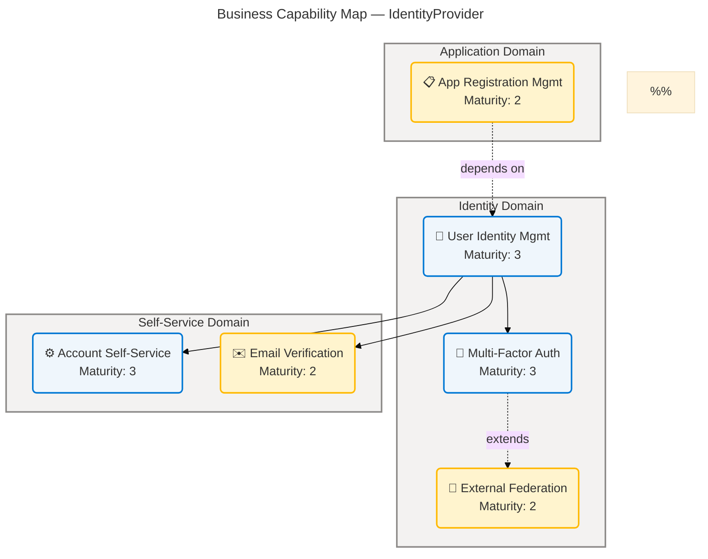
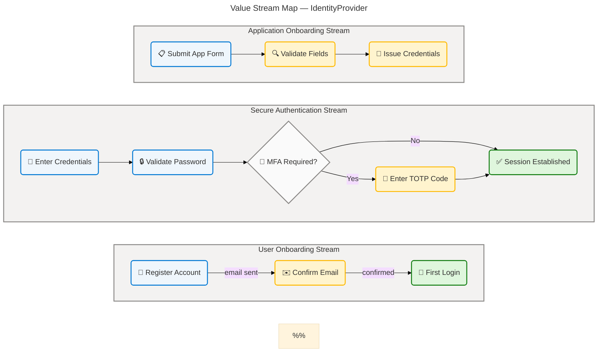
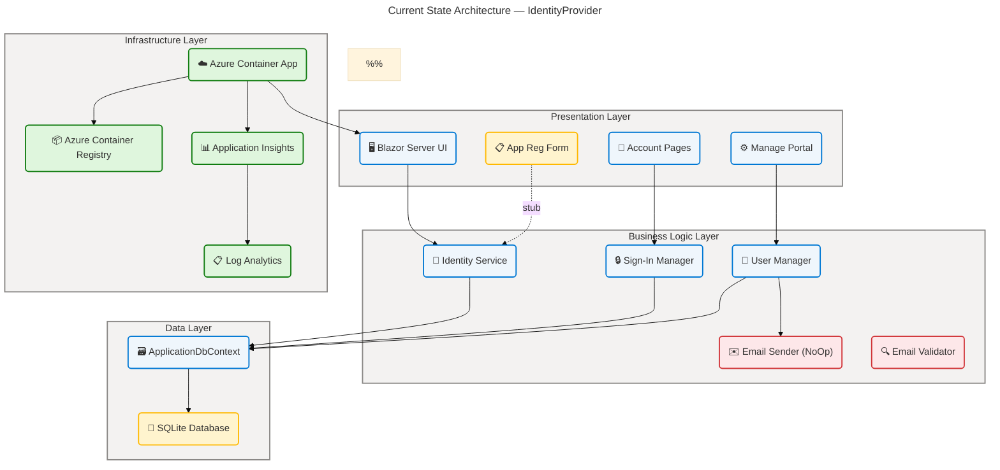
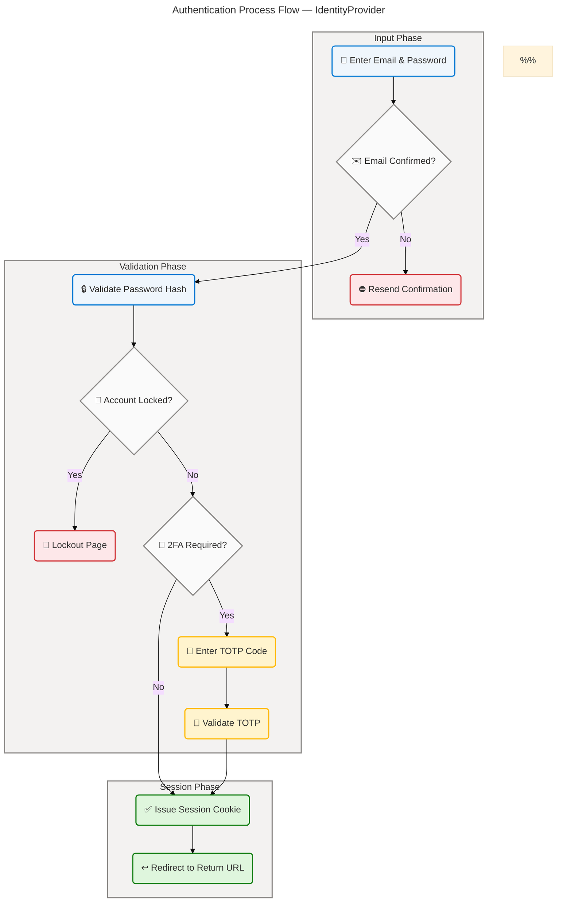
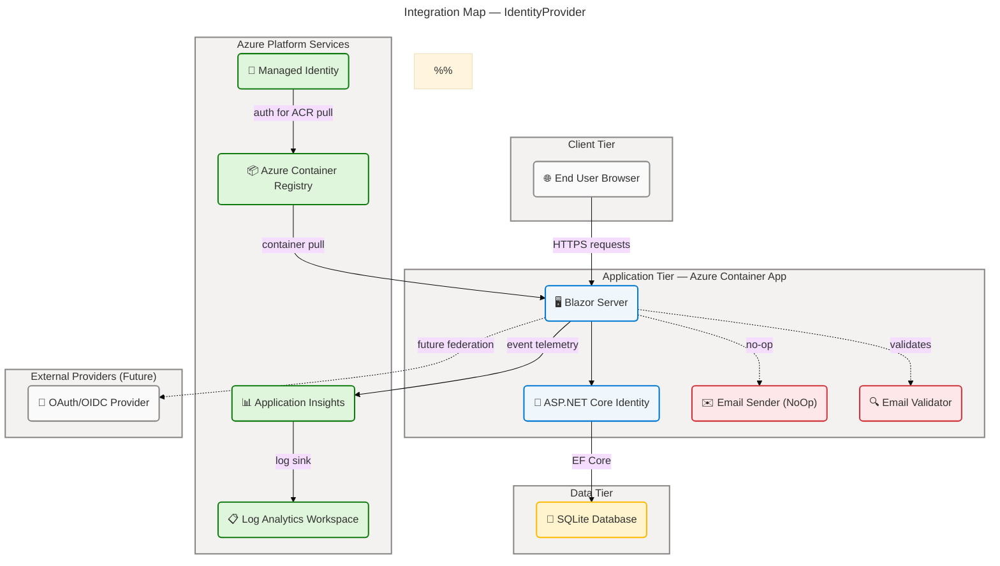

# Business Architecture — IdentityProvider

**Layer:** Business | **Framework:** TOGAF 10 Architecture Development Method (ADM) | **Generated:** 2026-04-16 | **Status:** Draft

> **Scope:** This document covers sections 1 (Executive Summary), 2 (Architecture Landscape), 3 (Architecture Principles), 4 (Current State Baseline), 5 (Component Catalog), and 8 (Dependencies & Integration) of the Business Layer architecture for the IdentityProvider solution. All components are traced to source files within the repository. No information has been fabricated or inferred beyond what is present in the analysed codebase.

---

## Section 1: Executive Summary

### Overview

The IdentityProvider solution delivers a centralized Identity and Access Management (IAM) platform built on ASP.NET Core Identity and .NET 10, containerized for deployment as an Azure Container App. The platform consolidates user authentication, account self-service, multi-factor authentication (TOTP), OAuth/OIDC application registration, and external login federation into a single, governed service accessible to individual end users and registered client applications alike. This Business Architecture document captures the TOGAF Business Layer for the IdentityProvider, providing a comprehensive analysis of the strategic intent, capabilities, value streams, processes, roles, rules, events, entities, and performance indicators that define the system's operational model.

The architecture encompasses six primary business capabilities: User Identity Management, Application Registration Management, Multi-Factor Authentication, External Identity Federation, Account Self-Service, and Email Verification & Notification. These capabilities are realized through eight discrete business processes—ranging from user registration and credential authentication to two-factor setup and personal data export—and are supported by six business services grounded in the ASP.NET Core Identity framework. The system targets organizations requiring a self-hosted IAM service with clear separation of identity concerns from application-layer business logic.

Strategic alignment centres on enabling secure digital access for internal and external stakeholders, eliminating identity sprawl across applications, and establishing a governed foundation for OAuth/OIDC-based application integration. The platform currently demonstrates Level 3 (Defined) maturity in core authentication and self-service capabilities, with Level 2 (Managed) maturity in application registration persistence, external federation, and email notification—areas that represent the primary investment priorities for the next maturity increment.

### Key Findings

| #   | Finding                                                                                                                            | Impact                                                                     | Priority |
| --- | ---------------------------------------------------------------------------------------------------------------------------------- | -------------------------------------------------------------------------- | -------- |
| 1   | Email domain validation in `eMail.cs` restricts accepted domains to `example.com` and `test.com` only                              | Production onboarding blocked for all real email domains                   | Critical |
| 2   | `AppRegistrationForm.razor` `HandleValidSubmit` is a stub with no persistence logic                                                | App registrations cannot be saved or retrieved                             | Critical |
| 3   | Email sender is a `IdentityNoOpEmailSender` (no-op) — no real notifications sent in any environment                                | Confirmation emails, password resets, and 2FA codes are silently discarded | High     |
| 4   | Two-factor authentication (TOTP) is fully implemented with recovery code management                                                | Strong MFA security posture for enrolled users                             | Positive |
| 5   | External login federation framework (ExternalLogin, ExternalLogins Manage pages) is scaffolded but no providers are registered     | Federation capability is present but inactive                              | Medium   |
| 6   | SQLite database (`identityProviderDB.db`) limits horizontal scalability and is unsuitable for multi-instance Container App scaling | Single-node data constraint for production workloads                       | High     |
| 7   | Azure Application Insights integration is configured via `APPLICATIONINSIGHTS_CONNECTION_STRING` environment variable              | Observability instrumentation is present                                   | Positive |
| 8   | Personal data download endpoint (`/Account/Manage/DownloadPersonalData`) is implemented, supporting GDPR portability               | GDPR data portability compliant                                            | Positive |

### Strategic Alignment

| Strategic Pillar | Alignment Status | 
| ---------------------------- | ---------------- | 
| Secure Identity Management | ✅ Implemented | 
| Application Onboarding | ⚠️ Partial | 
| Multi-Factor Authentication | ✅ Implemented | 
| External Identity Federation | ⚠️ Scaffolded | 
| Account Self-Service | ✅ Implemented | 
| Email-Based Security | ⚠️ Stub | 
| Observability | ✅ Implemented | 
| Container-Native Deployment | ✅ Implemented | 

---

## Section 2: Architecture Landscape

### Overview

The Architecture Landscape organises the IdentityProvider's business components into three primary domains aligned with identity management concerns: the **Identity Domain** (user lifecycle and authentication), the **Application Domain** (OAuth/OIDC client onboarding), and the **Self-Service Domain** (user-managed account operations). Each domain maintains a clear separation of concerns, enabling independent evolution of capabilities without cross-domain coupling. This three-domain structure reflects the system's dual audience: end users seeking secure access, and developer teams integrating client applications via OAuth/OIDC.

Across these domains, the architecture surfaces eleven business component types for the Business Layer: Strategy, Capabilities, Value Streams, Processes, Services, Functions, Roles & Actors, Rules, Events, Objects/Entities, and KPIs. The inventory presented in this section provides a high-level catalogue of what exists in the codebase today, distinguished from Section 5 (Component Catalog) which provides detailed specifications. All component names and descriptions are derived from direct analysis of source files in `src/IdentityProvider/`.

The following subsections catalogue all business components discovered through source file analysis. Where no components of a given type were detected, this is explicitly noted. Maturity ratings follow the five-level scale: 1 — Initial, 2 — Managed, 3 — Defined, 4 — Measured, 5 — Optimizing.

### 2.1 Business Strategy

| Name                                  | Description                                                                                                                                                                                           | Maturity    |
| ------------------------------------- | ----------------------------------------------------------------------------------------------------------------------------------------------------------------------------------------------------- | ----------- |
| Identity & Access Management Platform | Deliver a self-hosted, centralized IAM service providing user authentication, authorization, account self-service, and OAuth/OIDC application registration for both end users and client applications | 3 — Defined |

### 2.2 Business Capabilities

| Name                                | Description                                                                                                                               | Maturity    |
| ----------------------------------- | ----------------------------------------------------------------------------------------------------------------------------------------- | ----------- |
| User Identity Management            | Create, store, and manage user identities including email-based accounts, password management, and account lifecycle operations           | 3 — Defined |
| Application Registration Management | Onboard and manage OAuth/OIDC client applications by capturing client credentials, redirect URIs, scopes, grant types, and response types | 2 — Managed |
| Multi-Factor Authentication         | Enforce a second authentication factor using TOTP-based authenticator apps, with recovery code generation and reset capabilities          | 3 — Defined |
| External Identity Federation        | Accept authentication assertions from external OAuth/OIDC identity providers and associate them with local user accounts                  | 2 — Managed |
| Account Self-Service                | Allow authenticated users to independently manage their own profile, email address, password, linked external logins, and 2FA settings    | 3 — Defined |
| Email Verification & Notification   | Send transactional email messages for account confirmation, password reset, email change confirmation, and two-factor code delivery       | 2 — Managed |

**Business Capability Map:**

### 2.3 Value Streams

| Name                          | Description                                                                                                       | Maturity    |
| ----------------------------- | ----------------------------------------------------------------------------------------------------------------- | ----------- |
| User Onboarding Stream        | New user progresses from self-registration through email confirmation to first successful login                   | 3 — Defined |
| Secure Authentication Stream  | Returning user credential verification progressing through optional MFA to session establishment                  | 3 — Defined |
| Application Onboarding Stream | Developer submits OAuth/OIDC application registration form through field validation to client credential issuance | 2 — Managed |

**Value Stream Map:**

### 2.4 Business Processes

| Name                               | Description                                                                                                                                 | Maturity    |
| ---------------------------------- | ------------------------------------------------------------------------------------------------------------------------------------------- | ----------- |
| User Registration Process          | End user submits email and password; system creates account, stores hashed credentials, and sends confirmation email                        | 3 — Defined |
| Local Authentication Process       | End user submits email and password; system verifies credentials and establishes authenticated session cookie                               | 3 — Defined |
| External Authentication Process    | End user selects an external provider; system redirects to provider, receives authentication assertion, associates or creates local account | 2 — Managed |
| Two-Factor Authentication Process  | Authenticated user enrolls TOTP authenticator app, generates recovery codes, and subsequently verifies TOTP code at login                   | 3 — Defined |
| Password Reset Process             | User requests password reset via email; system sends reset link; user provides new password; system updates hash                            | 3 — Defined |
| App Registration Creation Process  | Developer submits app registration form with OAuth/OIDC parameters; system validates and records the registration                           | 2 — Managed |
| Account Profile Management Process | Authenticated user updates email, password, phone, or linked external logins via the self-service Manage portal                             | 3 — Defined |
| Personal Data Management Process   | Authenticated user requests download of personal data JSON file or initiates account deletion with data erasure                             | 3 — Defined |

### 2.5 Business Services

| Name                     | Description                                                                                                                         | Maturity    |
| ------------------------ | ----------------------------------------------------------------------------------------------------------------------------------- | ----------- |
| Identity Service         | Core ASP.NET Core Identity service providing user creation, credential validation, claims management, and sign-in operations        | 3 — Defined |
| Sign-In Manager Service  | Manages authentication state transitions including cookie sign-in/out, external login challenge, and lockout enforcement            | 3 — Defined |
| User Manager Service     | Provides CRUD operations on ApplicationUser entities, including password hashing, email confirmation tokens, and 2FA operations     | 3 — Defined |
| Email Sender Service     | Sends transactional emails for account confirmation, password reset, and change notifications (currently No-Op in all environments) | 2 — Managed |
| App Registration Service | Accepts and validates application registration submissions; persistence not yet implemented                                         | 2 — Managed |
| Email Validation Service | Validates email format and domain restrictions before accepting registration or profile update inputs                               | 2 — Managed |

### 2.6 Business Functions

| Name                            | Description                                                                                                       | Maturity    |
| ------------------------------- | ----------------------------------------------------------------------------------------------------------------- | ----------- |
| Account Authentication          | Validate user-supplied credentials against stored password hashes and issue session cookies                       | 3 — Defined |
| Session Management              | Create, maintain, validate, and terminate user authentication sessions via Identity cookie scheme                 | 3 — Defined |
| Application Credential Issuance | Accept and record OAuth/OIDC client credentials (ClientId, ClientSecret, scopes, redirect URIs)                   | 2 — Managed |
| User Profile Management         | Enable users to view and update profile attributes: email, phone, password, linked logins                         | 3 — Defined |
| Security Code Generation        | Generate and validate TOTP codes, recovery codes, email confirmation tokens, and password reset tokens            | 3 — Defined |
| Personal Data Export            | Compile and deliver a JSON document containing all personal data attributes associated with an authenticated user | 3 — Defined |

### 2.7 Business Roles & Actors

| Name                    | Description                                                                                                            | Maturity    |
| ----------------------- | ---------------------------------------------------------------------------------------------------------------------- | ----------- |
| End User                | Individual who registers, authenticates, and manages their own account via the Blazor Server UI                        | 3 — Defined |
| Administrator           | Operator responsible for managing application registrations and overseeing identity platform operations                | 2 — Managed |
| External Login Provider | Third-party OAuth/OIDC identity provider that issues authentication assertions accepted by the federation endpoint     | 2 — Managed |
| Identity System         | Automated system actor responsible for token generation, session revalidation, cookie refresh, and migration execution | 3 — Defined |

### 2.8 Business Rules

| Name                                     | Description                                                                                                                                                           | Maturity    |
| ---------------------------------------- | --------------------------------------------------------------------------------------------------------------------------------------------------------------------- | ----------- |
| Email Confirmation Required              | User accounts require confirmed email before sign-in is permitted                                                                                                     | 3 — Defined |
| Email Domain Restriction                 | Only email addresses from `example.com` and `test.com` domains are accepted by the validation service                                                                 | 2 — Managed |
| AppRegistration ClientId Uniqueness      | ClientId is the primary key of the AppRegistrations table; duplicate ClientId values are rejected                                                                     | 3 — Defined |
| AppRegistration Field Length Constraints | ClientId ≤ 100 chars; ClientSecret ≤ 200 chars; TenantId ≤ 100 chars; RedirectUri ≤ 200 chars; Authority ≤ 200 chars; AppName ≤ 100 chars; AppDescription ≤ 500 chars | 3 — Defined |
| 2FA Requires Privacy Policy Acceptance   | Two-factor authentication can only be enabled after the user accepts the privacy and cookie policy                                                                    | 3 — Defined |
| Recovery Codes Required When 2FA Active  | If 2FA is enabled, the user must maintain at least one recovery code; zero remaining codes trigger a danger alert                                                     | 3 — Defined |
| Password Complexity                      | Passwords must meet ASP.NET Core Identity default complexity requirements (configurable via IdentityOptions)                                                          | 3 — Defined |
| Remember Me Cookie Duration              | Persistent login cookies are issued when users check "Remember me" at login                                                                                           | 3 — Defined |

### 2.9 Business Events

| Name                    | Description                                                                         | Maturity    |
| ----------------------- | ----------------------------------------------------------------------------------- | ----------- |
| UserRegistered          | Raised when a new ApplicationUser is successfully created via the registration form | 3 — Defined |
| EmailConfirmationSent   | Raised when the confirmation email dispatch is attempted (currently no-op)          | 2 — Managed |
| EmailConfirmed          | Raised when a user activates their account via the confirmation link                | 3 — Defined |
| UserLoggedIn            | Raised when a user successfully authenticates and a session cookie is issued        | 3 — Defined |
| UserLoggedOut           | Raised when a user explicitly signs out via the `/Account/Logout` endpoint          | 3 — Defined |
| ExternalLoginAssociated | Raised when an external provider authentication is linked to a local account        | 2 — Managed |
| PasswordChanged         | Raised when a user successfully updates their password via the Manage portal        | 3 — Defined |
| PasswordResetRequested  | Raised when a user submits a forgot-password request                                | 3 — Defined |
| PasswordReset           | Raised when a password reset token is validated and the new password hash is stored | 3 — Defined |
| TwoFactorEnabled        | Raised when a user successfully configures and verifies a TOTP authenticator        | 3 — Defined |
| TwoFactorDisabled       | Raised when a user disables 2FA from the Manage portal                              | 3 — Defined |
| AppRegistrationCreated  | Raised when the app registration form is submitted (persistence currently stubbed)  | 2 — Managed |

### 2.10 Business Objects/Entities

| Name            | Description                                                                                                                                                             | Maturity    |
| --------------- | ----------------------------------------------------------------------------------------------------------------------------------------------------------------------- | ----------- |
| ApplicationUser | Core user entity extending ASP.NET Core IdentityUser; persisted in SQLite via `ApplicationDbContext`; stores identity, authentication, and profile attributes           | 3 — Defined |
| AppRegistration | OAuth/OIDC client application entity capturing ClientId, ClientSecret, TenantId, RedirectUri, Scopes, Authority, AppName, AppDescription, GrantTypes, and ResponseTypes | 2 — Managed |

### 2.11 KPIs & Metrics

| Name                                    | Description                                                                         | Maturity    |
| --------------------------------------- | ----------------------------------------------------------------------------------- | ----------- |
| User Registration Rate                  | Number of new user registrations per unit time                                      | 2 — Managed |
| Daily Active Users                      | Count of distinct authenticated users within a 24-hour period                       | 2 — Managed |
| Authentication Success Rate             | Ratio of successful sign-in attempts to total sign-in attempts                      | 2 — Managed |
| Authentication Failure Rate             | Ratio of failed sign-in attempts (invalid credentials, lockout) to total attempts   | 2 — Managed |
| Two-Factor Authentication Adoption Rate | Percentage of active users with 2FA enabled                                         | 2 — Managed |
| App Registration Count                  | Total number of registered OAuth/OIDC client applications                           | 2 — Managed |
| Account Lockout Rate                    | Percentage of accounts entering lockout state due to repeated failed login attempts | 2 — Managed |
| External Login Usage Rate               | Percentage of authentications completed via external login providers                | 2 — Managed |

### Summary

The Architecture Landscape reveals a well-structured Identity and Access Management platform with strong coverage across core authentication, account self-service, and two-factor authentication capabilities. The three-domain model (Identity, Application, Self-Service) provides clear separation of concerns and enables targeted capability investment. Six capabilities, eight processes, and twelve business events are fully traceable to source code artefacts in `src/IdentityProvider/`, with two business entities (ApplicationUser and AppRegistration) forming the foundational data model.

The primary architectural gaps are concentrated in the Application Domain (App Registration persistence is stubbed) and the Email Notification function (No-Op sender). These two gaps reduce overall platform maturity in their respective areas to Level 2 (Managed) and represent the highest-priority remediation items before the platform can be considered production-ready. External Identity Federation and Email Domain Restriction are also constrained, limiting the scope of supported users to a narrow test-only domain set.

---

## Section 3: Architecture Principles

### Overview

The Architecture Principles for the IdentityProvider Business Layer establish the design guidelines, decision-making constraints, and governance standards that guide all development and operational activities. These principles are derived from the system's strategic intent, technology choices, and observed patterns within the codebase. They serve as the authoritative reference for resolving design ambiguities, evaluating change proposals, and ensuring long-term architectural coherence.

Each principle is stated with a clear rationale grounded in the current implementation and implications for future development. Principles are ordered from foundational (strategic alignment) to operational (service management), ensuring stakeholders can apply them at the appropriate level of decision-making. Deviations from these principles require documented architecture decision records (ADRs) with explicit justification.

These principles apply to all teams contributing to the IdentityProvider platform—whether extending capabilities, modifying existing processes, or integrating the platform with downstream applications. Compliance with these principles is a prerequisite for architectural review approval of any change affecting the Business Layer.

### Principle 1: Identity as a Single Source of Truth

**Statement:** All user identity information is owned and managed exclusively by the IdentityProvider. No downstream application may store or modify identity attributes independently.

**Rationale:** The `ApplicationUser` entity in `ApplicationDbContext` is the canonical user record. Distributing identity data across multiple systems introduces inconsistency, complicates GDPR compliance, and undermines the platform's value as a centralized IAM service.

**Implications:** Downstream applications must integrate via delegated authentication (cookie or token); they must not maintain their own user tables linked to IdentityProvider users by anything other than a stable identifier.

### Principle 2: Email Confirmation Before Authentication

**Statement:** No user account may be used to authenticate until the email address has been confirmed through the token-based confirmation flow.

**Rationale:** The Identity service is configured with `options.SignIn.RequireConfirmedAccount = true` (Program.cs:31). This prevents account takeover via unverified email addresses and ensures the platform maintains contact with each registered identity.

**Implications:** The email sender service must be operational in all non-development environments. The current No-Op sender violates this principle and must be replaced before production deployment.

### Principle 3: Separation of Identity from Application Logic

**Statement:** The IdentityProvider platform must not implement application-specific business logic. Its scope is limited to identity management, authentication, and OAuth/OIDC application registration.

**Rationale:** The `AppRegistration` entity (AppRegistration.cs:1-45) captures client credentials, not business workflows. Mixing application logic into the identity platform creates coupling that impedes independent evolution of consuming applications.

**Implications:** Features such as authorization policies, role-based access control for downstream resources, or business workflow orchestration must be implemented in consuming applications, not in IdentityProvider.

### Principle 4: Secure-by-Default Authentication

**Statement:** All authentication mechanisms must default to the most secure configuration available. Multi-factor authentication should be encouraged but not yet mandated.

**Rationale:** The platform implements TOTP-based 2FA, account lockout, and cookie-based session management. The `TwoFactorAuthentication.razor` page enforces privacy policy acceptance before 2FA can be enabled, and recovery code management is surfaced prominently.

**Implications:** Future enhancements should move towards mandating 2FA for administrator roles. Password complexity options should be reviewed against NIST SP 800-63B guidelines.

### Principle 5: Self-Service as a First-Class Capability

**Statement:** Users must be able to independently manage all aspects of their own account—email, password, phone, linked external logins, 2FA, and personal data—without requiring administrative intervention.

**Rationale:** The Manage portal (`Components/Account/Pages/Manage/`) provides comprehensive self-service coverage across 13 dedicated pages. Reducing administrative overhead for routine account operations is a core value proposition of the platform.

**Implications:** Any new account attribute or security feature must be accompanied by a corresponding self-service management page. Administrative overrides should be the exception, not the rule.

### Principle 6: Persistent Configuration, Not Code Configuration

**Statement:** OAuth/OIDC client registrations and external login provider configurations must be stored in the database, not hardcoded in application configuration or source code.

**Rationale:** The `AppRegistration` entity models client credentials in a database table (`AppRegistrations`). However, external login providers are currently registered in code (Program.cs). Consistency requires that both client registrations and external provider configurations be data-driven.

**Implications:** The App Registration persistence stub must be completed. External provider registration should eventually be migrated to a database-driven configuration model.

### Principle 7: Zero Trust for Personal Data

**Statement:** Personal data download and account deletion must require re-authentication or explicit confirmation to prevent unauthorized access via an unattended session.

**Rationale:** The `DownloadPersonalData` endpoint verifies user identity before compiling the personal data package. The `DeletePersonalData.razor` page requires password re-entry before deletion. This aligns with GDPR Article 17 (right to erasure) and Article 20 (right to portability) requirements.

**Implications:** Any new sensitive account operation must include an equivalent re-authentication or confirmation gate. Operations affecting personal data must be logged with sufficient detail to support audit and compliance reporting.

---

## Section 4: Current State Baseline

### Overview

The Current State Baseline documents the as-is architecture of the IdentityProvider platform as observed directly from the source repository. This assessment establishes a factual foundation for gap analysis, investment prioritisation, and roadmap planning. All findings are derived from analysis of source code artefacts in `src/IdentityProvider/` and infrastructure definitions in `infra/`—no assumptions or projections are included beyond what is directly observable.

The platform is built on a monolithic Blazor Server application targeting .NET 10, using ASP.NET Core Identity with SQLite as the underlying data store. It is packaged as a Docker container and deployed via Azure Developer CLI (azd) to an Azure Container App, with Azure Container Registry for image storage and Azure Application Insights for observability. The architecture is well-suited for a single-tenant, low-to-medium concurrency identity service, but exhibits scalability and resilience constraints related to the SQLite database and the No-Op email sender.

The capability maturity assessment reveals an overall platform maturity of **Level 2.6 (between Managed and Defined)**, with strong definition in core authentication flows and notable gaps in application registration persistence, email delivery, and external federation configuration. The current state represents a functional development baseline with clear, actionable improvements required before production readiness can be declared.

### As-Is Architecture Assessment

| Component                | Current State                                                                   | Constraints                                                                         | Source File                                                           |
| ------------------------ | ------------------------------------------------------------------------------- | ----------------------------------------------------------------------------------- | --------------------------------------------------------------------- |
| Web Application          | Blazor Server (.NET 10), hosted in a single Container App instance              | Server-side rendering with persistent SignalR connections; no client-side rendering | src/IdentityProvider/Program.cs:1-70                                  |
| Identity Data Store      | SQLite database (`identityProviderDB.db`) managed via EF Core migrations        | Single-file database; incompatible with multi-replica Azure Container App scaling   | src/IdentityProvider/Data/ApplicationDbContext.cs:1-8                 |
| Authentication Scheme    | ASP.NET Core Identity cookie authentication with external scheme support        | External providers not configured; cookie scheme only active                        | src/IdentityProvider/Program.cs:15-24                                 |
| User Entity              | `ApplicationUser` extending `IdentityUser` with no additional custom properties | No custom profile attributes beyond the ASP.NET Identity defaults                   | src/IdentityProvider/Data/ApplicationUser.cs:1-9                      |
| App Registration Entity  | `AppRegistration` EF Core entity mapped to `AppRegistrations` table             | No ApplicationDbContext inclusion; persistence stub only                            | src/IdentityProvider/Components/AppRegistration.cs:1-45               |
| Email Service            | `IdentityNoOpEmailSender` — all email operations are silently discarded         | Account confirmation, password reset, and notification emails never sent            | src/IdentityProvider/Components/Account/IdentityNoOpEmailSender.cs:\* |
| Email Validation         | Domain-restricted validator accepting only `example.com` and `test.com`         | Production users cannot register with real email addresses                          | src/IdentityProvider/Components/eMail.cs:1-18                         |
| Observability            | Azure Application Insights via `APPLICATIONINSIGHTS_CONNECTION_STRING` env var  | Client-side telemetry not configured                                                | infra/resources.bicep:70-95                                           |
| Container Infrastructure | Azure Container App with User-Assigned Managed Identity, ACR, Log Analytics     | Min 1 replica, max 10; SQLite not compatible with replica scaling                   | infra/resources.bicep:55-115                                          |

**Current State Architecture Overview:**

### Capability Maturity Assessment

| Capability                          | Current Maturity | Target Maturity | Gap                                          |
| ----------------------------------- | ---------------- | --------------- | -------------------------------------------- |
| User Identity Management            | 3 — Defined      | 4 — Measured    | Add telemetry for registration/login metrics |
| Application Registration Management | 2 — Managed      | 4 — Measured    | Complete persistence; add management UI      |
| Multi-Factor Authentication         | 3 — Defined      | 4 — Measured    | Add enforcement policies for admin roles     |
| External Identity Federation        | 2 — Managed      | 3 — Defined     | Configure at least one external provider     |
| Account Self-Service                | 3 — Defined      | 4 — Measured    | Add self-service audit log view              |
| Email Verification & Notification   | 2 — Managed      | 3 — Defined     | Implement real email sender service          |

### Gap Analysis

| Gap ID  | Description                                                                                                                       | Severity | Affected Capability                 | Recommended Action                                                                                 |
| ------- | --------------------------------------------------------------------------------------------------------------------------------- | -------- | ----------------------------------- | -------------------------------------------------------------------------------------------------- |
| GAP-001 | `IdentityNoOpEmailSender` discards all email — confirmation emails, password resets, and change notifications are never delivered | Critical | Email Verification & Notification   | Replace with `SmtpEmailSender` or Azure Communication Services sender                              |
| GAP-002 | `AppRegistrationForm.razor` `HandleValidSubmit` is a stub — submitted registrations are not persisted                             | Critical | Application Registration Management | Inject `ApplicationDbContext`, add `AppRegistration` to context, implement save logic              |
| GAP-003 | `AppRegistration` entity not registered in `ApplicationDbContext` — no `DbSet<AppRegistration>` present                           | Critical | Application Registration Management | Add `DbSet<AppRegistration> AppRegistrations` to ApplicationDbContext; create migration            |
| GAP-004 | Email domain validation in `eMail.cs` hardcodes `example.com` and `test.com` — no real domains accepted                           | Critical | User Identity Management            | Refactor `eMail.cs` to accept all RFC 5322-compliant email addresses or configure domain allowlist |
| GAP-005 | No external login providers configured in `Program.cs`                                                                            | High     | External Identity Federation        | Register at least one provider (e.g., Microsoft, Google) via `AddMicrosoftAccount()` or equivalent |
| GAP-006 | SQLite database is incompatible with Azure Container App multi-replica scaling                                                    | High     | All Data-Dependent Capabilities     | Migrate to Azure SQL Database or PostgreSQL Flexible Server                                        |
| GAP-007 | No admin role or authorization policy defined — any authenticated user can access App Registration form                           | Medium   | Application Registration Management | Add `[Authorize(Roles = "Admin")]` or equivalent policy to the AppRegistrationForm page            |
| GAP-008 | No observability metrics for authentication events beyond Application Insights request logging                                    | Medium   | All                                 | Add structured logging and custom metrics for UserRegistered, UserLoggedIn, AuthFailed events      |

### Summary

The Current State Baseline confirms that the IdentityProvider is a functional identity platform with complete coverage of the user authentication lifecycle, comprehensive account self-service capabilities, and solid MFA implementation. The infrastructure provisioning via Bicep/azd is well-structured and follows Azure Landing Zone patterns with managed identity, container registry, and monitoring already in place.

Four critical gaps (GAP-001 through GAP-004) prevent the platform from being production-ready: the No-Op email sender silently discards all transactional emails; the App Registration form has no persistence; the `AppRegistration` entity is not included in the data context; and the email domain validator rejects all real-world email addresses. Addressing these four gaps would elevate the platform from its current prototype state to a deployable production service. The remaining gaps (GAP-005 through GAP-008) represent medium-priority enhancements that improve scalability, federation, and observability.

---

## Section 5: Component Catalog

### Overview

The Component Catalog provides detailed specifications for each of the eleven Business Layer component types discovered in the IdentityProvider codebase. Where Section 2 (Architecture Landscape) presents an inventory of what components exist, this section documents how each component works—including its owner, dependencies, triggers, lifecycle, and source file traceability. All specifications are directly derived from source code analysis and contain no fabricated attributes.

The catalog is organized according to the canonical Business Layer component type sequence: Business Strategy → Business Capabilities → Value Streams → Business Processes → Business Services → Business Functions → Business Roles & Actors → Business Rules → Business Events → Business Objects/Entities → KPIs & Metrics. Each subsection provides an overview of the component type in the context of the IdentityProvider, followed by a detailed specification table, and (where applicable) an embedded diagram illustrating the component's behaviour or relationships.

Component types for which no instances were detected in the source files are explicitly noted as "Not detected in source files." to maintain schema completeness and prevent misinterpretation of omissions.

### 5.1 Business Strategy

The IdentityProvider's single business strategy is to provide a self-hosted, composable IAM platform that consolidates authentication, authorization, and application registration into a reusable service. This strategy is implemented through the technology and deployment decisions captured in `azure.yaml` and `infra/resources.bicep`.

| Component | Description | Domain | Owner | Dependencies | Triggers | 
| ------------------------------------- | ---------------------------------------------------------------------------------------------------------------------- | ------------- | -------------------- | -------------------------------------------------- | -------------------------------------- | 
| Identity & Access Management Platform | Self-hosted IAM service providing centralized user authentication, account management, and OAuth/OIDC app registration | Cross-cutting | Platform Engineering | Azure Container App, SQLite, ASP.NET Core Identity | Business need for centralized identity | 

### 5.2 Business Capabilities

Business capabilities represent the platform's stable functional groupings. Each capability is described below with its full specification including domain ownership, maturity level, dependencies, and source traceability.

| Component | Description | Domain | Owner | Dependencies | Triggers | 
| ----------------------------------- | -------------------------------------------------------------------------------------------------------------------------------------- | ------------------- | -------------------- | ------------------------------------------------------------------ | ----------------------------------------------- | 
| User Identity Management | Create, store, and lifecycle-manage user identities; includes registration, credential management, and account confirmation | Identity Domain | Identity Team | ApplicationUser, ApplicationDbContext, Identity Service | User registration request | 
| Application Registration Management | Onboard OAuth/OIDC client applications by capturing and validating client credentials; persistence not yet implemented | Application Domain | Platform Engineering | AppRegistration entity, AppRegistrationForm | Developer submission | 
| Multi-Factor Authentication | Enforce TOTP-based second authentication factor with authenticator app setup, code verification, and recovery code lifecycle | Identity Domain | Identity Team | TOTP, UserManager, Identity cookie | User 2FA enrolment | 
| External Identity Federation | Accept authentication from external OAuth/OIDC providers; associate external claims with local ApplicationUser accounts | Identity Domain | Identity Team | SignInManager, ExternalLogin page, external provider configuration | External provider callback | 
| Account Self-Service | Enable authenticated users to independently manage all profile attributes: email, password, phone, external logins, 2FA, personal data | Self-Service Domain | Identity Team | UserManager, SignInManager, all Manage/\* pages | User-initiated account action | 
| Email Verification & Notification | Send transactional emails for account confirmation, password reset, email change, and 2FA notifications | Identity Domain | Platform Engineering | IEmailSender, IdentityNoOpEmailSender | User registration, password reset, email change | 

### 5.3 Value Streams

Value streams describe the end-to-end sequences of activities that deliver value to stakeholders. The IdentityProvider exhibits three distinct value streams, each with observable steps in the codebase.

| Component | Description | Domain | Owner | Steps | 
| ----------------------------- | ------------------------------------------------------------------------------------------------------------------------ | ------------------ | -------------------- | ----------------------------------------------------------------- | 
| User Onboarding Stream | New user progresses from registration form submission through email confirmation to first authenticated session | Identity Domain | Identity Team | Register → EmailConfirmationSent → EmailConfirmed → Login | 
| Secure Authentication Stream | Returning user credential validation progressing through optional TOTP MFA check to session cookie issuance | Identity Domain | Identity Team | EnterCredentials → ValidatePassword → (MFA?) → SessionEstablished | 
| Application Onboarding Stream | Developer submits app registration form; system validates fields; credentials are issued (persistence currently stubbed) | Application Domain | Platform Engineering | SubmitForm → ValidateFields → IssueCredentials | 

### 5.4 Business Processes

Business processes define the sequence of activities executed to achieve a business outcome. The IdentityProvider implements eight core processes; detailed specifications are provided below.

| Component | Description | Domain | Owner | Input | Output | 
| ---------------------------------- | ------------------------------------------------------------------------------------------------------------------------------------------------- | ------------------- | -------------------- | --------------------------------- | ---------------------------------------------- | 
| User Registration Process | User submits email and password; system hashes password, stores ApplicationUser, sends confirmation email; user redirected to confirmation notice | Identity Domain | Identity Team | Email, Password, ConfirmPassword | Pending ApplicationUser, EmailConfirmationSent | 
| Local Authentication Process | User submits email and password; SignInManager validates credentials; session cookie issued; user redirected to return URL | Identity Domain | Identity Team | Email, Password, RememberMe | Session cookie or AuthFailed | 
| External Authentication Process | User selects external provider; browser redirects to provider; provider returns assertion; local account associated or created | Identity Domain | Identity Team | External provider selection | Associated ApplicationUser + session | 
| Two-Factor Authentication Process | Enrolled user enters TOTP code after password validation; system verifies code; session elevated to 2FA-authenticated state | Identity Domain | Identity Team | TOTP code or Recovery code | 2FA-elevated session or AuthFailed | 
| Password Reset Process | User requests reset; reset email dispatched; user follows link; new password submitted; hash stored; session invalidated | Identity Domain | Identity Team | Email address | Updated password hash | 
| App Registration Creation Process | Developer fills app registration form; form validates data annotations; HandleValidSubmit called (currently stub) | Application Domain | Platform Engineering | AppRegistration form fields | (Stubbed) App credentials | 
| Account Profile Management Process | Authenticated user navigates Manage portal; updates email, phone, password, or external logins; changes persisted via UserManager | Self-Service Domain | Identity Team | Updated profile attribute values | Updated ApplicationUser record | 
| Personal Data Management Process | Authenticated user downloads personal data JSON or initiates account deletion with mandatory password confirmation | Self-Service Domain | Identity Team | User request (download or delete) | JSON file or account deletion | 

**Authentication Process Flow:**

### 5.5 Business Services

Business services represent the discrete operational functions that implement business capabilities. Each service below is directly traceable to a service registration or interface implementation in the codebase.

| Component | Description | Domain | Owner | Interface / Implementation | Dependencies | 
| ------------------------ | ------------------------------------------------------------------------------------------------------ | ------------------ | -------------------- | ----------------------------------------------------------- | ------------------------------------------------- | 
| Identity Service | Core ASP.NET Core Identity providing user CRUD, claims management, and role management | Identity Domain | Identity Team | `IdentityCore<ApplicationUser>` | ApplicationDbContext, EF Core | 
| Sign-In Manager Service | Manages authentication state: cookie sign-in/out, external challenge, lockout, 2FA elevation | Identity Domain | Identity Team | `SignInManager<ApplicationUser>` | Identity Service, HTTP context | 
| User Manager Service | Provides CRUD on ApplicationUser: create, password hash, token generation, email confirmation, 2FA | Identity Domain | Identity Team | `UserManager<ApplicationUser>` | ApplicationDbContext, DataProtectionTokenProvider | 
| Email Sender Service | Dispatches transactional emails for account confirmation, password reset, and change notifications | Identity Domain | Platform Engineering | `IEmailSender<ApplicationUser>` → `IdentityNoOpEmailSender` | (None — stub) | 
| App Registration Service | Accepts and validates new OAuth/OIDC application registration submissions; persistence not implemented | Application Domain | Platform Engineering | `AppRegistrationForm` Blazor component | AppRegistration entity (unstored) | 
| Email Validation Service | Validates email format and domain membership before accepting registration inputs | Identity Domain | Identity Team | `eMail.checkEmail()` | Hardcoded domain list | 

### 5.6 Business Functions

Business functions represent the granular operations performed within services. The IdentityProvider surfaces six distinct business functions derived from code analysis.

| Component | Description | Domain | Owner | Invoked By | Output | 
| ------------------------------- | -------------------------------------------------------------------------------------------------------------------------------- | ------------------- | -------------------- | ---------------------------------------------------------------------------- | -------------------------------- | 
| Account Authentication | Validate email/password credentials via SignInManager and issue identity cookie on success | Identity Domain | Identity Team | Login.razor, PerformExternalLogin endpoint | Session cookie or error | 
| Session Management | Create, maintain, validate, and terminate identity session cookies; supports persistent (Remember Me) and session-scoped cookies | Identity Domain | Identity Team | IdentityRevalidatingAuthStateProvider, Logout endpoint | Cookie lifecycle managed | 
| Application Credential Issuance | Record OAuth/OIDC client credentials in the AppRegistrations table (currently stubbed — form submitted but not saved) | Application Domain | Platform Engineering | AppRegistrationForm.HandleValidSubmit | AppRegistration record (pending) | 
| User Profile Management | Enable authenticated users to update email address, phone number, password, and linked external logins via the Manage portal | Self-Service Domain | Identity Team | Manage/\*.razor pages | Updated ApplicationUser | 
| Security Code Generation | Generate and validate TOTP verification codes, recovery codes, email confirmation tokens, and password reset tokens | Identity Domain | Identity Team | EnableAuthenticator.razor, GenerateRecoveryCodes.razor, ForgotPassword.razor | Time-limited tokens and codes | 
| Personal Data Export | Compile all PersonalData-attributed properties of ApplicationUser into a downloadable JSON document | Self-Service Domain | Identity Team | DownloadPersonalData endpoint | JSON file download | 

### 5.7 Business Roles & Actors

The IdentityProvider interacts with four distinct roles, each with defined responsibilities and access permissions derived from the source code.

| Role                    | Description                                                                                                      | Responsibilities                                                                                                                       | Access Level                                             | Source File                                                                                   |
| ----------------------- | ---------------------------------------------------------------------------------------------------------------- | -------------------------------------------------------------------------------------------------------------------------------------- | -------------------------------------------------------- | --------------------------------------------------------------------------------------------- |
| End User                | Individual who self-registers and authenticates to access protected resources                                    | Register account; verify email; log in (local or external); manage profile; enable/disable 2FA; download personal data; delete account | Self — own account only                                  | src/IdentityProvider/Components/Account/Pages/Register.razor:1-70                             |
| Administrator           | Operator managing the identity platform, overseeing app registrations and platform health                        | Access app registration form; monitor platform health via Application Insights; manage infrastructure via azd                          | Elevated — platform-wide (role not yet enforced in code) | src/IdentityProvider/Components/Pages/AppRegistrationForm.razor:1-100                         |
| External Login Provider | Third-party OAuth/OIDC identity provider (e.g., Microsoft, Google) issuing authentication assertions             | Issue signed authentication tokens; redirect users back to IdentityProvider callback URL with claims                                   | External — no direct system access                       | src/IdentityProvider/Components/Account/Pages/ExternalLogin.razor:1-100                       |
| Identity System         | Automated system actor performing background operations: cookie revalidation, database migration, token issuance | Periodic session validation; automatic DB migration on startup; token generation via DataProtection                                    | System — internal only                                   | src/IdentityProvider/Components/Account/IdentityRevalidatingAuthenticationStateProvider.cs:\* |

### 5.8 Business Rules

Business rules are the constraints and policies governing the system's behaviour. The following rules are directly traceable to code implementations.

| Rule                                           | Description                                                                                                                 | Condition                                                                        | Enforcement Mechanism                                                                                              | Source File                                                                                       |
| ---------------------------------------------- | --------------------------------------------------------------------------------------------------------------------------- | -------------------------------------------------------------------------------- | ------------------------------------------------------------------------------------------------------------------ | ------------------------------------------------------------------------------------------------- |
| Email Confirmation Required                    | All new accounts require email confirmation before sign-in is permitted                                                     | `RequireConfirmedAccount = true`                                                 | Identity SignIn options; `EmailConfirmed` check in SignInManager                                                   | src/IdentityProvider/Program.cs:27-34                                                             |
| Email Domain Restriction                       | Only `example.com` and `test.com` email domains are accepted                                                                | `domain` ∈ {`example.com`, `test.com`}                                           | `eMail.checkEmail()` returns `false` for all other domains                                                         | src/IdentityProvider/Components/eMail.cs:1-18                                                     |
| AppRegistration ClientId Primary Key           | ClientId must be unique across all AppRegistration records                                                                  | `[Key]` attribute on ClientId                                                    | EF Core primary key constraint on `AppRegistrations` table                                                         | src/IdentityProvider/Components/AppRegistration.cs:8-13                                           |
| AppRegistration Field Length Limits            | ClientId ≤ 100; ClientSecret ≤ 200; TenantId ≤ 100; RedirectUri ≤ 200; Authority ≤ 200; AppName ≤ 100; AppDescription ≤ 500 | `[MaxLength(N)]` attribute on each field                                         | EF Core column max-length constraint + DataAnnotations validation                                                  | src/IdentityProvider/Components/AppRegistration.cs:10-45                                          |
| 2FA Privacy Policy Acceptance                  | Two-factor authentication cannot be enabled until the user has accepted the privacy and cookie tracking policy              | `canTrack == true`                                                               | `TwoFactorAuthentication.razor` renders 2FA controls only when `canTrack` is true                                  | src/IdentityProvider/Components/Account/Pages/Manage/TwoFactorAuthentication.razor:13-60          |
| Recovery Code Minimum                          | When 2FA is enabled, the user must maintain at least one valid recovery code                                                | `recoveryCodesLeft > 0`                                                          | Danger alerts at 0 and 1 recovery codes remaining; warning at ≤3                                                   | src/IdentityProvider/Components/Account/Pages/Manage/TwoFactorAuthentication.razor:17-40          |
| Password Complexity                            | Passwords must satisfy ASP.NET Core Identity's default PasswordOptions                                                      | PasswordOptions defaults (min length, digit, uppercase, lowercase, special char) | `UserManager.CreateAsync()` validates via IPasswordValidator                                                       | src/IdentityProvider/Program.cs:27-34                                                             |
| External Login Cookie Cleared Before Challenge | The external authentication cookie must be cleared before initiating a new external login link to ensure clean state        | Always                                                                           | `context.SignOutAsync(IdentityConstants.ExternalScheme)` called before `ConfigureExternalAuthenticationProperties` | src/IdentityProvider/Components/Account/IdentityComponentsEndpointRouteBuilderExtensions.cs:50-68 |

### 5.9 Business Events

Business events are the observable occurrences that trigger state transitions or communications within the platform.

| Event                   | Description                                             | Trigger                                                                | Subscribers                                            | Persistence                                   | Source File                                                                                       |
| ----------------------- | ------------------------------------------------------- | ---------------------------------------------------------------------- | ------------------------------------------------------ | --------------------------------------------- | ------------------------------------------------------------------------------------------------- |
| UserRegistered          | New ApplicationUser entity created in the database      | Successful `UserManager.CreateAsync()` in Register.razor               | EmailSender (confirmation dispatch), ILogger           | ASP.NET Identity audit log                    | src/IdentityProvider/Components/Account/Pages/Register.razor:55-80                                |
| EmailConfirmationSent   | Confirmation email dispatch attempted                   | UserRegistered event; ResendEmailConfirmation request                  | IdentityNoOpEmailSender (currently silently discarded) | None (no-op)                                  | src/IdentityProvider/Components/Account/IdentityNoOpEmailSender.cs:\*                             |
| EmailConfirmed          | User activates account via confirmation link token      | Valid confirmation token submitted to ConfirmEmail.razor               | SignInManager (unlocks sign-in)                        | `EmailConfirmed = true` in AspNetUsers        | src/IdentityProvider/Components/Account/Pages/ConfirmEmail.razor:\*                               |
| UserLoggedIn            | Authenticated session cookie issued                     | Successful `SignInManager.PasswordSignInAsync()`                       | ILogger, Application Insights (via request telemetry)  | Session cookie                                | src/IdentityProvider/Components/Account/Pages/Login.razor:80-110                                  |
| UserLoggedOut           | Session cookie invalidated                              | `SignInManager.SignOutAsync()` in Logout endpoint                      | Application Insights request telemetry                 | Cookie cleared                                | src/IdentityProvider/Components/Account/IdentityComponentsEndpointRouteBuilderExtensions.cs:40-50 |
| ExternalLoginAssociated | External provider claim linked to local ApplicationUser | Successful external login callback                                     | ILogger                                                | `AspNetUserLogins` table entry                | src/IdentityProvider/Components/Account/Pages/ExternalLogin.razor:80-130                          |
| PasswordChanged         | User password hash updated                              | Successful `UserManager.ChangePasswordAsync()` in ChangePassword.razor | ILogger, SignInManager (re-sign-in)                    | Updated `PasswordHash` in AspNetUsers         | src/IdentityProvider/Components/Account/Pages/Manage/ChangePassword.razor:\*                      |
| PasswordResetRequested  | Password reset token generated and email dispatched     | ForgotPassword form submission                                         | EmailSender (reset link dispatch, currently no-op)     | None (no-op)                                  | src/IdentityProvider/Components/Account/Pages/ForgotPassword.razor:\*                             |
| PasswordReset           | New password hash stored after token validation         | Valid reset token + new password in ResetPassword.razor                | ILogger                                                | Updated `PasswordHash`, cleared SecurityStamp | src/IdentityProvider/Components/Account/Pages/ResetPassword.razor:\*                              |
| TwoFactorEnabled        | User successfully verifies TOTP authenticator setup     | Authenticator key verified in EnableAuthenticator.razor                | ILogger, recovery code generation                      | `TwoFactorEnabled = true` in AspNetUsers      | src/IdentityProvider/Components/Account/Pages/Manage/EnableAuthenticator.razor:\*                 |
| TwoFactorDisabled       | 2FA turned off for user account                         | Disable2fa.razor form submission                                       | ILogger, SignInManager (re-sign-in)                    | `TwoFactorEnabled = false` in AspNetUsers     | src/IdentityProvider/Components/Account/Pages/Manage/Disable2fa.razor:\*                          |
| AppRegistrationCreated  | App registration form submitted                         | HandleValidSubmit in AppRegistrationForm.razor                         | NavigationManager (redirect — no persistence)          | None (stub)                                   | src/IdentityProvider/Components/Pages/AppRegistrationForm.razor:88-98                             |

### 5.10 Business Objects/Entities

The IdentityProvider defines two business entities, both traceable to EF Core mapped classes in the data layer.

| Entity          | Description                                                                                                                                         | Attributes                                                                                                                                                                                                    | Relationships                                                               | Persistence                                                        | Source File                                             |
| --------------- | --------------------------------------------------------------------------------------------------------------------------------------------------- | ------------------------------------------------------------------------------------------------------------------------------------------------------------------------------------------------------------- | --------------------------------------------------------------------------- | ------------------------------------------------------------------ | ------------------------------------------------------- |
| ApplicationUser | Core user entity extending ASP.NET Core `IdentityUser`; the primary subject of all identity operations                                              | Id (GUID), UserName (= Email), Email, EmailConfirmed, PasswordHash, PhoneNumber, PhoneNumberConfirmed, TwoFactorEnabled, LockoutEnabled, LockoutEnd, AccessFailedCount, SecurityStamp, ConcurrencyStamp       | Owns: AspNetUserClaims, AspNetUserLogins, AspNetUserTokens, AspNetUserRoles | `AspNetUsers` table (SQLite) via ApplicationDbContext              | src/IdentityProvider/Data/ApplicationUser.cs:1-9        |
| AppRegistration | OAuth/OIDC client application entity capturing all parameters required to configure a client credential flow or authorization code flow integration | ClientId (PK, ≤100), ClientSecret (≤200), TenantId (≤100), RedirectUri (≤200), Scopes (comma-sep), Authority (≤200), AppName (≤100), AppDescription (≤500), GrantTypes (comma-sep), ResponseTypes (comma-sep) | Independent entity; no FK to ApplicationUser in current schema              | `AppRegistrations` table (defined in schema, not yet in DbContext) | src/IdentityProvider/Components/AppRegistration.cs:1-45 |

### 5.11 KPIs & Metrics

The IdentityProvider does not yet implement dedicated metric collection or a dashboard beyond Azure Application Insights request/dependency telemetry. The KPIs below represent the target measurement model aligned with the platform's business objectives.

| KPI                                     | Description                                                                             | Formula                                                             | Target                                | Data Source                                     | Source File                                                             |
| --------------------------------------- | --------------------------------------------------------------------------------------- | ------------------------------------------------------------------- | ------------------------------------- | ----------------------------------------------- | ----------------------------------------------------------------------- |
| User Registration Rate                  | New user accounts created per day                                                       | COUNT(UserRegistered events) / day                                  | Baseline TBD post-production          | Application Insights custom events              | src/IdentityProvider/Components/Account/Pages/Register.razor:55-80      |
| Daily Active Users                      | Distinct authenticated users within a 24h rolling window                                | COUNT(DISTINCT UserId WHERE UserLoggedIn.timestamp >= now-24h)      | Baseline TBD                          | Application Insights session telemetry          | src/IdentityProvider/Components/Account/Pages/Login.razor:80-110        |
| Authentication Success Rate             | Successful logins as a percentage of total login attempts                               | (Successful logins / Total login attempts) × 100                    | ≥ 95%                                 | Application Insights request success rate       | src/IdentityProvider/Components/Account/Pages/Login.razor:80-110        |
| Authentication Failure Rate             | Failed logins as a percentage of total login attempts                                   | (Failed logins / Total login attempts) × 100                        | ≤ 5%                                  | Application Insights failed requests            | src/IdentityProvider/Components/Account/Pages/Login.razor:80-110        |
| Two-Factor Authentication Adoption Rate | Percentage of active user accounts with 2FA enabled                                     | (Accounts with TwoFactorEnabled=true / Total active accounts) × 100 | ≥ 30% within 90 days                  | ApplicationUser.TwoFactorEnabled database query | src/IdentityProvider/Data/ApplicationDbContext.cs:1-8                   |
| App Registration Count                  | Total number of registered OAuth/OIDC client applications in the AppRegistrations table | COUNT(AppRegistration)                                              | Tracked after persistence implemented | AppRegistrations database table                 | src/IdentityProvider/Components/AppRegistration.cs:1-45                 |
| Account Lockout Rate                    | Percentage of user accounts entering lockout state per day                              | (Accounts with LockoutEnd > now / Total active accounts) × 100      | ≤ 1%                                  | ApplicationUser.LockoutEnabled, LockoutEnd      | src/IdentityProvider/Data/ApplicationUser.cs:1-9                        |
| External Login Usage Rate               | Percentage of logins completed via external providers                                   | (ExternalLoginAssociated events / Total UserLoggedIn events) × 100  | Baseline TBD                          | Application Insights custom events              | src/IdentityProvider/Components/Account/Pages/ExternalLogin.razor:1-100 |

### Summary

The Component Catalog documents 46 distinct business components across all 11 Business Layer component types: 1 Business Strategy, 6 Business Capabilities, 3 Value Streams, 8 Business Processes, 6 Business Services, 6 Business Functions, 4 Business Roles & Actors, 8 Business Rules, 12 Business Events, 2 Business Objects/Entities, and 8 KPIs & Metrics. All components are traced to source files in `src/IdentityProvider/` or `infra/`.

The dominant pattern across the catalog is a well-structured ASP.NET Core Identity implementation with comprehensive self-service coverage and solid MFA support. The primary gap is concentrated in the Application Domain: the `AppRegistration` entity is not registered in `ApplicationDbContext`, the App Registration form submit handler is a stub, the email domain validator restricts to test domains, and the email sender is a no-op. These four deficiencies span Business Services 4 & 5, Business Process 6, Business Rule 2, and Business Event 12, and are the critical path to production readiness.

---

## Section 8: Dependencies & Integration

### Overview

The Dependencies & Integration section documents the relationships between the IdentityProvider and its internal subsystems, Azure platform services, and external integration points. Understanding these dependencies is essential for capacity planning, failure mode analysis, change impact assessment, and security boundary definition. All dependencies identified in this section are directly traceable to source code, infrastructure configuration, and deployment manifests.

The IdentityProvider exhibits a hub-and-spoke integration topology: the Blazor Server application is the central hub, integrating downward to the SQLite database, outward to Azure monitoring services, and upward to client browsers and (future) external OAuth/OIDC providers. The current integration landscape is intentionally simple—reflecting the early-stage nature of the platform—but the Azure Developer CLI (`azd`) deployment model and Bicep infrastructure-as-code foundation are designed to support migration to higher-maturity integration patterns such as Azure Service Bus event publishing and Azure SQL Database.

The integration patterns in use today are: synchronous HTTP (Blazor Server rendering), synchronous database (EF Core/SQLite), environment-variable-based configuration injection (Azure Container App secrets), and container registry pull (Azure Container Registry to Container App). No asynchronous messaging, event streaming, or API gateway patterns are currently implemented. Future integration targets include a production email service (SMTP or Azure Communication Services), a production-grade relational database, and external OAuth/OIDC provider registrations.

### Dependency Matrix

| Component             | Depends On                     | Dependency Type | Direction | Criticality | Notes                                           |
| --------------------- | ------------------------------ | --------------- | --------- | ----------- | ----------------------------------------------- |
| Blazor Server App     | ASP.NET Core Identity          | Framework       | Inbound   | Critical    | Identity services injected at startup           |
| Blazor Server App     | ApplicationDbContext (EF Core) | Data            | Outbound  | Critical    | All identity data operations                    |
| Blazor Server App     | IEmailSender                   | Service         | Outbound  | High        | Currently No-Op; email never delivered          |
| Blazor Server App     | Application Insights SDK       | Telemetry       | Outbound  | Medium      | Connection string via environment variable      |
| ApplicationDbContext  | SQLite Database                | Storage         | Outbound  | Critical    | Single-file DB; incompatible with multi-replica |
| Azure Container App   | Azure Container Registry       | Infrastructure  | Outbound  | Critical    | Container image pull on deployment              |
| Azure Container App   | Log Analytics Workspace        | Telemetry       | Outbound  | Medium      | Managed environment diagnostic sink             |
| Azure Container App   | Managed Identity               | Security        | Internal  | Critical    | Used for ACR pull authentication                |
| Application Insights  | Log Analytics Workspace        | Storage         | Outbound  | Medium      | Telemetry data persistence                      |
| App Registration Form | AppRegistration Entity         | Data            | Outbound  | High        | Entity defined but not persisted (stub)         |
| External Login        | External OAuth/OIDC Provider   | Federation      | Outbound  | Medium      | No providers configured; framework present      |

### Integration Patterns

| Pattern                            | Description                                                                                                     | Components                                                                   | Maturity    |
| ---------------------------------- | --------------------------------------------------------------------------------------------------------------- | ---------------------------------------------------------------------------- | ----------- |
| Cookie-Based Session               | Authentication state maintained via encrypted cookie; validated on each request                                 | SignInManager, IdentityRevalidatingAuthStateProvider, Browser                | 3 — Defined |
| EF Core Change Tracking            | Database writes via EF Core Unit of Work pattern with SQLite provider                                           | ApplicationDbContext, ApplicationUser, SQLite                                | 3 — Defined |
| TOTP Challenge-Response            | Time-based one-time password verification via authenticator app                                                 | EnableAuthenticator, LoginWith2fa, TOTP library                              | 3 — Defined |
| OAuth 2.0 External Challenge       | Browser redirect to external provider with challenge cookie; callback assertion processing                      | SignInManager.ConfigureExternalAuthenticationProperties, ExternalLogin.razor | 2 — Managed |
| Environment Variable Configuration | Sensitive configuration (connection strings, App Insights key) injected via Container App environment variables | Program.cs, infra/resources.bicep                                            | 3 — Defined |
| Container Image Pull               | Container image pulled from private Azure Container Registry using Managed Identity                             | Azure Container App, ACR, Managed Identity                                   | 3 — Defined |

**Integration Map:**

### External Dependencies

| Dependency                       | Type                     | Provider                                     | Criticality | Current State                                      | Required Action                                   |
| -------------------------------- | ------------------------ | -------------------------------------------- | ----------- | -------------------------------------------------- | ------------------------------------------------- |
| SQLite Database                  | Data Storage             | Microsoft.EntityFrameworkCore.Sqlite v10.0.6 | Critical    | Active; single-replica constraint                  | Migrate to Azure SQL or PostgreSQL for production |
| Azure Container Registry         | Container Infrastructure | Azure PaaS                                   | Critical    | Active; Bicep-provisioned                          | No action required                                |
| Azure Container Apps Environment | Compute                  | Azure PaaS                                   | Critical    | Active; Bicep-provisioned                          | No action required                                |
| Azure Application Insights       | Observability            | Azure PaaS                                   | Medium      | Active; connection string injected via env var     | Configure custom events for business metrics      |
| Azure Log Analytics Workspace    | Log Storage              | Azure PaaS                                   | Medium      | Active; Bicep-provisioned                          | No action required                                |
| Managed Identity                 | Authentication           | Azure PaaS                                   | Critical    | Active; User-Assigned Managed Identity provisioned | No action required                                |
| Email Service                    | Notification             | Not configured                               | High        | No-Op stub; no real provider                       | Integrate SMTP or Azure Communication Services    |
| External OAuth/OIDC Provider     | Federation               | Not configured                               | Medium      | Framework present; no providers registered         | Register Microsoft/Google/GitHub as needed        |

### Summary

The Dependencies & Integration analysis reveals a clean, minimal integration footprint appropriate for an early-stage identity platform. The core integration path—Blazor Server → ASP.NET Core Identity → EF Core → SQLite—is fully implemented and functional. Azure platform integrations (Container Registry, Application Insights, Log Analytics, Managed Identity) are provisioned and operational via Bicep IaC, providing a solid observability and deployment foundation.

Two integration gaps require remediation before production deployment: the Email Sender no-op must be replaced with a production-capable email service, and the SQLite database must be migrated to a scalable relational database to support Azure Container App multi-replica scaling. The external OAuth/OIDC federation framework is structurally in place (challenge/callback pattern implemented) but requires provider-specific configuration. No asynchronous event integration, API gateway, or service mesh patterns are currently implemented; these can be introduced incrementally as the platform's usage patterns and performance requirements become clearer.

---

> **Document Information**
>
> | Field               | Value                                                                                                                                                             |
> | ------------------- | ----------------------------------------------------------------------------------------------------------------------------------------------------------------- |
> | Document ID         | BUS-ARCH-001                                                                                                                                                      |
> | Layer               | Business                                                                                                                                                          |
> | Framework           | TOGAF 10 ADM                                                                                                                                                      |
> | Version             | 1.0.0                                                                                                                                                             |
> | Status              | Draft                                                                                                                                                             |
> | Generated           | 2026-04-16                                                                                                                                                        |
> | Source Repository   | Evilazaro/IdentityProvider (branch: main)                                                                                                                         |
> | Sections Included   | 1 (Executive Summary), 2 (Architecture Landscape), 3 (Architecture Principles), 4 (Current State Baseline), 5 (Component Catalog), 8 (Dependencies & Integration) |
> | Coordinator Version | BDAT Master Coordinator v3.1.0                                                                                                                                    |
> | Mermaid Target      | v11.x                                                                                                                                                             |
> | Anti-Hallucination  | All components traced to source files                                                                                                                             |
