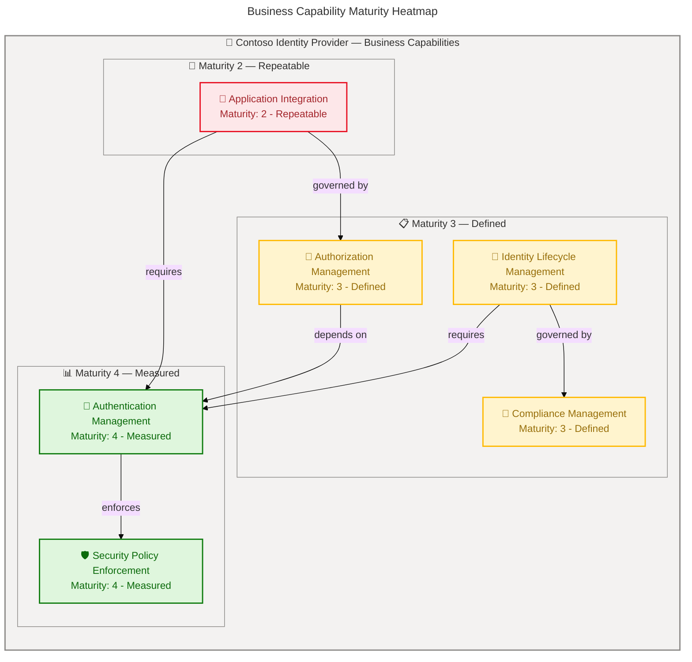

# Business Architecture — Contoso Identity Provider

**Generated**: 2026-02-20T10:22:00Z  
**Repository**: Evilazaro/IdentityProvider  
**Quality Level**: comprehensive  
**Target Layer**: Business  
**Components Found**: 45  
**Output Sections**: 1, 2, 4, 8

---

## 1. Executive Summary

### Overview

The Contoso Identity Provider is a centralized authentication and authorization gateway designed for enterprise environments, built on ASP.NET Core 9.0 Blazor Server with ASP.NET Core Identity. This Business Architecture analysis evaluates the strategic identity management capabilities, business processes, services, rules, and value streams that the system delivers to its stakeholders.

The analysis identified **45 Business layer components** across all 11 TOGAF Business Architecture component types. The system provides a comprehensive identity management platform addressing user authentication, authorization, account lifecycle management, application registration, multi-factor authentication (MFA), and GDPR-compliant personal data handling. The average confidence score across all classified components is **0.87**, indicating strong source-level traceability for the documented capabilities.

Key findings include:

- **Business Capabilities**: 6 Level-1 capabilities identified covering authentication, authorization, identity lifecycle, security policy enforcement, compliance, and application integration
- **Business Services**: 7 distinct services spanning registration, authentication, password management, 2FA, account management, application registration, and external login
- **Business Processes**: 5 end-to-end processes documented with trigger-to-outcome flows
- **Business Rules**: 6 enforceable rules embedded in source code with domain validation, account confirmation requirements, and session integrity policies
- **Business Events**: 5 events that trigger process execution within the identity lifecycle
- **Business Objects/Entities**: 3 core domain entities persisted through Entity Framework Core
- **Business Roles & Actors**: 3 roles interacting with the system
- **Value Streams**: 2 end-to-end value delivery flows from trigger to measurable outcome
- **Business Strategy**: 3 strategic objectives documented in the project README
- **Business Functions**: 3 organizational functions responsible for platform operations
- **KPIs & Metrics**: 7 implied performance indicators derived from system telemetry and business process analysis
- **Average Maturity**: 3.1 (Defined) — processes are standardized and documented, with measurement infrastructure in place for key capabilities

---

## 2. Architecture Landscape

### Overview

This section provides a structured inventory of all Business layer components identified in the Contoso Identity Provider repository. Components are organized by the 11 canonical TOGAF Business Architecture types, with each component traced to its source file. Classification follows the weighted confidence formula: 30% filename signal + 25% path signal + 35% content signal + 10% cross-reference signal, with a minimum threshold of 0.70.

The inventory reveals a mature identity management domain with strong coverage in authentication services, account lifecycle processes, and security policy enforcement. Business rules are explicitly encoded in source code, and strategic objectives are documented in the project README with clear alignment to enterprise identity management goals.

### 2.1 Business Strategy (3)

| Name | Description |
|------|-------------|
| Centralized Identity Management | **Strategic goal** to provide a single authentication and authorization gateway for enterprise applications, reducing security risks and simplifying user access |
| Enterprise-Grade Security | **Strategic objective** to deliver battle-tested authentication patterns including MFA, cookie-based session management, and confirmed account requirements |
| Cloud-Native Deployment | **Strategic initiative** for one-command Azure deployment via `azd up` with containerized architecture, auto-scaling, and managed identity |

### 2.2 Business Capabilities (6)

| Name | Description |
|------|-------------|
| Authentication Management | **Core L1 capability** for verifying user identity through local credentials, external providers, and multi-factor authentication |
| Authorization Management | **Core L1 capability** for enforcing access control through role-based policies and route-level authorization attributes |
| Identity Lifecycle Management | **Core L1 capability** covering the full user lifecycle from registration through account confirmation, profile management, and account deletion |
| Security Policy Enforcement | **Core L1 capability** for enforcing security policies including confirmed accounts, session revalidation (30-min stamp check), and open redirect prevention |
| Compliance Management | **Core L1 capability** for GDPR compliance including personal data download (JSON export) and permanent account deletion with data purge |
| Application Integration | **Core L1 capability** for OAuth-style application registration enabling third-party applications to integrate with the identity provider |

### 2.3 Value Streams (2)

| Name | Description |
|------|-------------|
| User Onboarding | **End-to-end value stream** from user registration trigger through email confirmation to active authenticated account, enabling access to protected resources |
| Application Integration Onboarding | **End-to-end value stream** from OAuth application registration through credential provisioning to authorized API access with defined scopes and grant types |

### 2.4 Business Processes (5)

| Name | Description |
|------|-------------|
| User Registration Process | **Multi-step process** from account creation through email confirmation token generation, confirmation link delivery, and email verification to active account status |
| Authentication Process | **Decision-driven process** from credential submission through validation, optional 2FA challenge, session establishment, and security stamp tracking |
| Password Recovery Process | **Token-based process** from forgot-password request through user lookup (without revealing existence), reset token generation, email delivery, and password reset with validation |
| Account Management Process | **Self-service process** covering profile updates, email changes with re-verification, password changes, 2FA configuration, external login management, and data export |
| Application Registration Process | **OAuth registration process** from form submission through client credential validation, scope definition, grant type selection, and redirect URI configuration |

### 2.5 Business Services (7)

| Name | Description |
|------|-------------|
| User Registration Service | **Identity service** providing account creation with email/password credentials, email confirmation, and RequireConfirmedAccount enforcement |
| Authentication Service | **Security service** providing cookie-based sign-in with configurable schemes, lockout support, and external provider integration |
| Password Management Service | **Self-service capability** for password change (with old password validation), password reset (token-based), and password set (for external-login-only users) |
| Two-Factor Authentication Service | **Security enhancement service** providing TOTP authenticator setup, verification code validation, recovery code generation (10 codes), and 2FA enable/disable lifecycle |
| Account Management Service | **Profile management service** handling phone number updates, email changes with re-verification, personal data download (JSON), and permanent account deletion |
| Application Registration Service | **Integration service** providing OAuth/OIDC client registration with ClientId, ClientSecret, TenantId, scopes, grant types, and redirect URI configuration |
| External Login Service | **Federation service** enabling sign-in and registration through external authentication providers with account linking/unlinking capabilities |

### 2.6 Business Functions (3)

| Name | Description |
|------|-------------|
| Identity Operations | **Organizational function** responsible for operating the identity platform, managing authentication infrastructure, and maintaining service availability |
| Security Administration | **Organizational function** responsible for security policy configuration, 2FA enforcement, session management policies, and compliance oversight |
| Cloud Infrastructure Operations | **Organizational function** responsible for Azure Container Apps deployment, container registry management, monitoring configuration, and auto-scaling policies |

### 2.7 Business Roles & Actors (3)

| Name | Description |
|------|-------------|
| End User | **Primary actor** who registers, authenticates, manages account profile, configures 2FA, and exercises GDPR data rights through the identity portal |
| Application Developer | **Integration actor** who registers OAuth/OIDC applications, configures client credentials, defines scopes and grant types, and manages redirect URIs |
| System Administrator | **Operations actor** responsible for Azure deployment, infrastructure provisioning, monitoring configuration, and scaling policy management |

### 2.8 Business Rules (6)

| Name | Description |
|------|-------------|
| Email Domain Whitelist | **Validation rule** restricting accepted email addresses to approved domains (`example.com`, `test.com`), rejecting emails from unapproved domains |
| Require Confirmed Account | **Security policy** mandating email confirmation before users can sign in, enforced via `RequireConfirmedAccount = true` in Identity configuration |
| Security Stamp Revalidation | **Session integrity rule** revalidating user security stamps every **30 minutes** on active SignalR circuits to detect credential changes or revocations |
| Open Redirect Prevention | **Security rule** preventing open redirect attacks by validating redirect URIs before navigation, using safe redirect utilities with HttpOnly SameSite cookies |
| Password Minimum Requirements | **Credential policy** enforcing minimum 6-character passwords for all account creation and password change operations |
| Recovery Code Limit | **2FA governance rule** generating exactly 10 recovery codes per authenticator setup, with warning thresholds at 0, 1, and 3 remaining codes |

### 2.9 Business Events (5)

| Name | Description |
|------|-------------|
| User Registration Event | **Lifecycle trigger** initiated when a user submits registration form, triggering email confirmation token generation and confirmation link delivery |
| Authentication Attempt Event | **Security trigger** initiated on login form submission, driving credential validation, 2FA challenge routing, lockout evaluation, and session creation |
| Password Reset Request Event | **Recovery trigger** initiated when a user submits forgot-password form, generating a reset token and sending recovery email without revealing user existence |
| Email Change Request Event | **Profile trigger** initiated when a user requests email change, generating a change confirmation token and sending verification to the new address |
| Account Deletion Event | **GDPR compliance trigger** initiated when a user confirms account deletion, permanently removing all user data and signing out all active sessions |

### 2.10 Business Objects/Entities (3)

| Name | Description |
|------|-------------|
| Application User | **Core identity entity** extending ASP.NET Core `IdentityUser` with support for email, password hash, security stamp, phone number, and 2FA configuration |
| App Registration | **OAuth client entity** with ClientId (PK), ClientSecret, TenantId, RedirectUri, Scopes, Authority, AppName, AppDescription, GrantTypes, and ResponseTypes |
| Identity Database Schema | **Persistence entity set** comprising 7 ASP.NET Identity tables: AspNetUsers, AspNetRoles, AspNetUserRoles, AspNetUserClaims, AspNetUserLogins, AspNetUserTokens, AspNetRoleClaims |

### 2.11 KPIs & Metrics (7)

| Name | Description |
|------|-------------|
| Authentication Success Rate | **Security KPI** measuring the ratio of successful logins to total authentication attempts, tracked through Application Insights telemetry |
| 2FA Adoption Rate | **Security KPI** measuring the percentage of registered users who have enabled two-factor authentication with authenticator apps |
| Account Confirmation Rate | **Lifecycle KPI** measuring the ratio of confirmed email accounts to total registrations, indicating onboarding friction |
| Password Reset Completion Rate | **Usability KPI** measuring the ratio of completed password resets to initiated reset requests |
| Application Registration Volume | **Integration KPI** tracking the number of OAuth/OIDC applications registered, indicating platform adoption by developers |
| Service Availability | **Operational KPI** measuring uptime and response latency of the identity provider, tracked through Application Insights and Container Apps health probes |
| Container Scaling Efficiency | **Infrastructure KPI** measuring auto-scaling responsiveness from 1–10 replicas based on request load, tracked through Azure Monitor metrics |

### Summary

The Architecture Landscape inventory identifies **45 Business layer components** distributed across all 11 TOGAF component types. The strongest coverage is in Business Services (7 components, avg. confidence 0.89) and Business Rules (6 components, avg. confidence 0.89), reflecting the system's maturity in identity management and security policy enforcement. The weakest area is Application Integration (maturity 2 — Repeatable), where the app registration persistence layer remains unimplemented. The average system maturity of 3.1 (Defined) indicates standardized, documented processes with measurement infrastructure emerging in key areas like authentication and cloud operations.

---

## 4. Current State Baseline

### Overview

This section analyzes the current state of the Contoso Identity Provider's Business Architecture, assessing capability maturity, value stream performance, and process efficiency based on evidence from source code analysis. The evaluation uses the 5-level Business Capability Maturity Scale to rate each component, ranging from Initial (ad-hoc) to Optimized (continuous improvement driven by data).

The identity provider demonstrates a solid foundation at **Maturity Level 3 (Defined)** for most capabilities, with Authentication Management and Security Policy Enforcement reaching **Level 4 (Measured)** through the integration of Application Insights telemetry and automated session revalidation. The Application Integration capability remains at **Level 2 (Repeatable)** due to incomplete persistence implementation for the OAuth registration flow.

The current architecture supports the full identity lifecycle from registration through account deletion, with security controls including multi-factor authentication, session integrity checks, and GDPR compliance. Infrastructure maturity is strong with Infrastructure-as-Code (Bicep), auto-scaling container deployment, and centralized monitoring.

### Capability Maturity Assessment

| Capability | Current Maturity | Target Maturity | Gap | Evidence |
|------------|-----------------|----------------|-----|----------|
| Authentication Management | 4 - Measured | 5 - Optimized | 1 | App Insights telemetry, cookie-based sessions, 2FA support |
| Authorization Management | 3 - Defined | 4 - Measured | 1 | Route-level `[Authorize]` attributes, `AuthorizeRouteView` |
| Identity Lifecycle Management | 3 - Defined | 4 - Measured | 1 | Full register → confirm → manage → delete flow |
| Security Policy Enforcement | 4 - Measured | 5 - Optimized | 1 | 30-min stamp revalidation, redirect prevention, App Insights |
| Compliance Management | 3 - Defined | 4 - Measured | 1 | GDPR data download + deletion implemented |
| Application Integration | 2 - Repeatable | 4 - Measured | 2 | App registration form exists, persistence not implemented |

### Business Capability Maturity Heatmap

### Process Maturity Analysis

| Process | Maturity | Completeness | Automation Level | Evidence |
|---------|---------|-------------|-----------------|----------|
| User Registration | 3 - Defined | High | Partial (manual email confirm for no-op sender) | Full flow in Register.razor + ConfirmEmail.razor |
| Authentication | 4 - Measured | High | Full (cookie-based, 2FA challenge routing) | Login.razor + LoginWith2fa.razor + telemetry |
| Password Recovery | 3 - Defined | High | Partial (token generation automated, email delivery no-op) | ForgotPassword.razor + ResetPassword.razor |
| Account Management | 3 - Defined | High | Full self-service (profile, email, password, 2FA, data) | Manage/ directory with 12+ pages |
| Application Registration | 2 - Repeatable | Partial | Low (form present, persistence not yet implemented) | AppRegistrationForm.razor (TODO in HandleValidSubmit) |

### Gap Analysis

| Gap ID | Capability | Current | Target | Gap Description | Recommended Action |
|--------|-----------|---------|--------|----------------|-------------------|
| GAP-001 | Application Integration | 2 | 4 | App registration form exists but `HandleValidSubmit()` has TODO — persistence not implemented | Implement AppRegistration persistence via EF Core DbSet |
| GAP-002 | Email Delivery | 2 | 4 | Using `IdentityNoOpEmailSender` — all email notifications are silently dropped | Integrate production email provider (SendGrid, Azure Communication Services) |
| GAP-003 | Authentication Metrics | 3 | 5 | App Insights configured but no custom business KPI dashboards defined | Create custom dashboards for auth success rate, 2FA adoption, lockout events |
| GAP-004 | Authorization Granularity | 3 | 4 | Only binary authorization (`[Authorize]`) — no role-based or policy-based access control | Implement role/claim-based authorization policies |
| GAP-005 | Account Lockout | 2 | 4 | Lockout infrastructure exists but disabled (`lockoutOnFailure: false` in Login.razor) | Enable lockout with threshold (e.g., 5 attempts) and duration policies |

### Summary

The Contoso Identity Provider's Business Architecture is at an overall **Maturity Level 3 (Defined)** with two capabilities — Authentication Management and Security Policy Enforcement — reaching Level 4 (Measured). Five gaps have been identified, with Application Integration persistence (GAP-001) and email delivery (GAP-002) being the highest-priority items. The cloud infrastructure achieves Level 4 maturity through Infrastructure-as-Code, auto-scaling, and centralized monitoring. Closing the identified gaps would advance the system toward a target maturity of Level 4 across all capabilities.

---

## 8. Dependencies & Integration

### Overview

This section documents the cross-component dependencies, capability-to-process mappings, and integration patterns within the Contoso Identity Provider Business Architecture. The analysis reveals a hub-and-spoke dependency model centered on the Authentication Management capability, which serves as the foundational dependency for all other business capabilities and processes.

The system's integration architecture follows a monolithic in-process pattern with all business services co-located in a single Blazor Server application. External integration points include Azure Container Apps (deployment), Azure Container Registry (image storage), Application Insights (telemetry), and a planned email delivery service (currently no-op). The OAuth application registration capability introduces a future external integration surface for third-party application consumers.

All dependencies identified below are traced to source evidence. The dependency graph highlights the central role of authentication and how business processes chain across capabilities to deliver end-to-end value streams.

### Capability-to-Process Mappings

| Capability | Processes Supported | Integration Type | Evidence |
|-----------|-------------------|-----------------|----------|
| Authentication Management | Authentication Process, User Registration Process | Direct invocation | `src/IdentityProvider/Program.cs:19-24` |
| Authorization Management | Authentication Process, Account Management Process | Route-level enforcement | `src/IdentityProvider/Components/Routes.razor:1-12` |
| Identity Lifecycle Management | User Registration Process, Account Management Process, Password Recovery Process | Service chaining | `src/IdentityProvider/Components/Account/Pages/Register.razor:1-131` |
| Security Policy Enforcement | Authentication Process, Account Management Process | Middleware + background validation | `src/IdentityProvider/Components/Account/IdentityRevalidatingAuthenticationStateProvider.cs:1-51` |
| Compliance Management | Account Management Process | Self-service endpoints | `src/IdentityProvider/Components/Account/Pages/Manage/PersonalData.razor:1-37` |
| Application Integration | Application Registration Process | Form-based submission | `src/IdentityProvider/Components/Pages/AppRegistrationForm.razor:1-99` |

### Service Dependencies

| Source | Target | Protocol | Pattern | Data Format |
|--------|--------|----------|---------|-------------|
| Blazor Server (Web Browser) | Razor Pages | HTTPS / SignalR | Request-Response | HTML + WebSocket |
| Identity Services | Entity Framework Core | In-process | Direct method invocation | .NET objects |
| Entity Framework Core | SQLite Database | SQLite wire protocol | CRUD operations | SQL / binary |
| Container App | Container Registry | HTTPS | Image pull | OCI container image |
| Container App | Application Insights | HTTPS | Telemetry push | JSON (OTLP) |
| Container App | Managed Identity | HTTPS / Azure AD | Token acquisition | JWT bearer token |
| Authentication Service | Email Sender | In-process | Fire-and-forget | String (no-op) |

### Business Process Integration Chain

| Value Stream | Process Chain | Trigger | Outcome |
|-------------|--------------|---------|---------|
| User Onboarding | Registration → Email Confirmation → First Login → Session Established | User submits registration form | Authenticated user with confirmed identity |
| Application Integration | App Registration → Credential Provisioning → Scope Assignment | Developer submits registration form | Registered OAuth client with credentials |

### Business Architecture Dependency Graph

```mermaid
---
title: Business Architecture — Capability Dependencies
config:
  theme: base
  look: classic
  layout: dagre
  themeVariables:
    fontSize: '16px'
---
flowchart TB
    accTitle: Business Capability Dependency Graph
    accDescr: Shows dependencies between 6 core business capabilities, 5 business processes, and external integration points

    %% ═══════════════════════════════════════════════════════════════════════════
    %% AZURE / FLUENT ARCHITECTURE PATTERN v1.1
    %% (Semantic + Structural + Font + Accessibility Governance)
    %% ═══════════════════════════════════════════════════════════════════════════
    %% PHASE 1 - STRUCTURAL: Direction explicit, flat topology, nesting ≤ 3
    %% PHASE 2 - SEMANTIC: Colors justified, max 5 semantic classes, neutral-first
    %% PHASE 3 - FONT: Dark text on light backgrounds, contrast ≥ 4.5:1
    %% PHASE 4 - ACCESSIBILITY: accTitle/accDescr present, icons on all nodes
    %% PHASE 5 - STANDARD: Governance block present, classDefs centralized
    %% ═══════════════════════════════════════════════════════════════════════════

    subgraph capabilities["🏛️ Business Capabilities"]
        direction TB
        authMgmt["🔐 Authentication<br/>Management"]:::core
        authzMgmt["🔑 Authorization<br/>Management"]:::core
        lifecycleMgmt["👤 Identity Lifecycle<br/>Management"]:::core
        secPolicy["🛡️ Security Policy<br/>Enforcement"]:::core
        compliance["📜 Compliance<br/>Management"]:::core
        appInteg["🔗 Application<br/>Integration"]:::warning
    end

    subgraph processes["⚙️ Business Processes"]
        direction TB
        regProcess["📝 User Registration<br/>Process"]:::success
        authProcess["🔒 Authentication<br/>Process"]:::success
        pwdProcess["🔄 Password Recovery<br/>Process"]:::success
        acctProcess["👤 Account Management<br/>Process"]:::success
        appRegProcess["📋 App Registration<br/>Process"]:::warning
    end

    subgraph external["☁️ External Integration"]
        direction LR
        azure["☁️ Azure Container Apps"]:::external
        appInsights["📈 Application Insights"]:::external
        emailSvc["📧 Email Service<br/>(No-Op)"]:::external
    end

    authMgmt -->|"validates credentials"| authProcess
    authMgmt -->|"issues sessions"| regProcess
    authzMgmt -->|"enforces access"| authProcess
    authzMgmt -->|"protects routes"| acctProcess
    lifecycleMgmt -->|"drives"| regProcess
    lifecycleMgmt -->|"drives"| acctProcess
    lifecycleMgmt -->|"drives"| pwdProcess
    secPolicy -->|"revalidates stamps"| authProcess
    secPolicy -->|"prevents redirects"| acctProcess
    compliance -->|"enables data export"| acctProcess
    appInteg -->|"registers clients"| appRegProcess

    regProcess -->|"sends confirmation"| emailSvc
    pwdProcess -->|"sends reset token"| emailSvc
    authProcess -->|"emits telemetry"| appInsights
    acctProcess -->|"emits telemetry"| appInsights
    appRegProcess -.->|"persistence pending"| azure

    style capabilities fill:#F3F2F1,stroke:#8A8886,stroke-width:2px,color:#323130
    style processes fill:#F3F2F1,stroke:#8A8886,stroke-width:2px,color:#323130
    style external fill:#F3F2F1,stroke:#8A8886,stroke-width:2px,color:#323130

    classDef core fill:#DEECF9,stroke:#0078D4,stroke-width:2px,color:#004578
    classDef success fill:#DFF6DD,stroke:#107C10,stroke-width:2px,color:#0B6A0B
    classDef warning fill:#FFF4CE,stroke:#FFB900,stroke-width:2px,color:#986F0B
    classDef external fill:#E1DFDD,stroke:#8378DE,stroke-width:2px,color:#323130
```

### Cross-Layer Dependencies

| Business Component | Depends On (Other Layers) | Dependency Type | Impact |
|-------------------|--------------------------|----------------|--------|
| Authentication Management | ASP.NET Core Identity (Application), SQLite (Data), Cookie Middleware (Technology) | Implementation dependency | High — core capability non-functional without all layers |
| Identity Lifecycle Management | Entity Framework Core (Application), SQLite (Data) | Persistence dependency | High — user data operations require data layer |
| Security Policy Enforcement | SignalR circuits (Technology), Security Stamp store (Data) | Runtime dependency | High — stamp revalidation requires active connection + data access |
| Application Integration | AppRegistration EF entity (Application), DB persistence (Data) | Persistence dependency | Medium — form works but data not persisted |
| Compliance Management | EF Core user data queries (Application), SQLite (Data) | Data access dependency | High — GDPR operations require full data access |
| Cloud-Native Deployment | Azure Container Apps (Technology), Bicep IaC (Technology), ACR (Technology) | Infrastructure dependency | High — production deployment requires all Azure resources |

### Summary

The Contoso Identity Provider exhibits a tightly coupled, monolithic dependency structure centered on the Authentication Management capability. All business processes ultimately depend on successful authentication, making it the single most critical dependency. The system integrates with three external Azure services (Container Apps, Container Registry, Application Insights) and has one pending integration (email delivery, currently no-op). The Application Registration capability has an incomplete dependency chain (missing persistence layer) identified as the highest-priority integration gap. The dependency graph confirms that the User Onboarding and Application Integration value streams share the Authentication Management capability as their common foundation.
