# Business Architecture — Contoso IdentityProvider

## Section 1: Executive Summary

### Overview

The Contoso IdentityProvider repository implements a full-featured identity and access management (IAM) platform built on ASP.NET Core Identity with Blazor Server interactive rendering. The application exposes 14 distinct business capabilities spanning user authentication, multi-factor authentication, password lifecycle management, external identity federation (OAuth/OIDC), GDPR data rights compliance, and OAuth client application registration. Analysis of 55 source files produced 38 business components across all 11 TOGAF Business Architecture component types.

This assessment applies the TOGAF 10 Business Architecture framework to map source code artifacts to formal business capabilities, processes, services, rules, events, and entities. The architecture covers core authentication capabilities comprehensively, with well-defined patterns for ancillary features such as OAuth client registration and email validation.

Strategic alignment is strong in identity management and GDPR compliance domains. The primary gaps are the absence of a production email sender (currently a no-op stub), incomplete OAuth App Registration persistence, and no formal business-process orchestration engine. The platform targets Azure Container Apps deployment with Azure Monitor observability, demonstrating a clear cloud-native operational strategy.

**Strategic Alignment Map:**

```mermaid
---
title: <b>Strategic Alignment Map</b>
config:
  theme: base
  look: classic
  layout: dagre
  themeVariables:
    fontSize: '16px'
  flowchart:
    htmlLabels: true
---
flowchart TB
    accTitle: Strategic Alignment Map — Contoso IdentityProvider
    accDescr: Maps strategic objectives to the three business domains showing alignment with Digital Identity Enablement vision

    %% ═══════════════════════════════════════════════════════════════
    %% AZURE / FLUENT ARCHITECTURE PATTERN v1.1
    %% Semantic + Structural + Font + Accessibility Governance
    %% ═══════════════════════════════════════════════════════════════
    %% PHASE 1 — STRUCTURAL: Direction explicit, nesting ≤ 3
    %% PHASE 2 — SEMANTIC: Max 5 classes, neutral-first
    %% PHASE 3 — FONT: Dark text on light backgrounds ≥ 4.5:1
    %% PHASE 4 — ACCESSIBILITY: accTitle + accDescr + icons on all nodes
    %% PHASE 5 — STANDARD: Governance block + classDefs centralized
    %% ═══════════════════════════════════════════════════════════════

    subgraph main["Contoso IdentityProvider — Strategic Alignment"]
        subgraph vision["Digital Identity Enablement Vision"]
            V1["🎯 Enterprise SSO & MFA<br/>Cloud-Native IAM Platform"]
        end

        subgraph strategies["Strategic Objectives"]
            SO1["🔐 Zero-Trust Authentication<br/>Cookie + 2FA + Stamp Revalidation"]
            SO2["🛡️ GDPR Compliance<br/>Data Portability & Right to Erasure"]
            SO3["☁️ Cloud-Native Operations<br/>Azure Container Apps + IaC"]
        end

        subgraph domains["Business Domains"]
            D1["🔐 Authentication Domain<br/>Login · 2FA · Password Mgmt"]
            D2["📝 Identity Management Domain<br/>Registration · GDPR · Email"]
            D3["🌐 Integration Domain<br/>OAuth Federation · App Registration"]
        end
    end

    V1 --> SO1
    V1 --> SO2
    V1 --> SO3
    SO1 --> D1
    SO2 --> D2
    SO3 --> D3
    D1 <-->|Confirmed Account Required| D2
    D1 <-->|External Login Challenge| D3

    %% Semantic classDefs
    classDef core fill:#DEECF9,stroke:#0078D4,stroke-width:2px,color:#004578
    classDef success fill:#DFF6DD,stroke:#107C10,stroke-width:2px,color:#0B6A0B
    classDef warning fill:#FFF4CE,stroke:#FFB900,stroke-width:2px,color:#986F0B
    classDef data fill:#E1DFDD,stroke:#8378DE,stroke-width:2px,color:#5B5FC7

    class V1,D1 core
    class SO1,SO2,SO3 success
    class D2 data
    class D3 warning

    %% Subgraph styling (style directive required for subgraphs)
    style main fill:#F3F2F1,stroke:#605E5C,stroke-width:2px,color:#323130
    style vision fill:#F3F2F1,stroke:#0078D4,stroke-width:2px,color:#323130
    style strategies fill:#F3F2F1,stroke:#107C10,stroke-width:2px,color:#323130
    style domains fill:#F3F2F1,stroke:#8378DE,stroke-width:2px,color:#323130
```

---

## Section 2: Architecture Landscape

### Overview

The Architecture Landscape organizes business components into three primary domains aligned with the IdentityProvider's mission: the Authentication Domain (user sign-in, MFA, password management), the Identity Management Domain (registration, profile management, GDPR compliance), and the Integration Domain (external identity federation, OAuth client registration, cloud deployment).

Each domain maintains clear separation of concerns through the Blazor Server component model, with dedicated Razor pages for each user-facing process, shared services for cross-cutting infrastructure (redirect management, authentication state), and data-annotation-validated entity models for persistence. The ASP.NET Core Identity framework provides the foundational capability surface, while custom components extend it with domain-specific business rules and workflows.

The following subsections catalog all 11 Business component types discovered through source file analysis.

### 2.1 Business Strategy

| Name                           | Description                                                                             |
| ------------------------------ | --------------------------------------------------------------------------------------- |
| Cloud-Native Identity Platform | Strategic initiative to deliver IAM as a containerized Azure service with observability |
| Digital Identity Enablement    | Platform vision for enterprise SSO, MFA, and compliance-ready identity services         |

### 2.2 Business Capabilities

| Name                          | Description                                                                  |
| ----------------------------- | ---------------------------------------------------------------------------- |
| User Authentication           | Email/password credential verification with cookie-based session management  |
| User Registration             | Self-service account creation with email confirmation workflow               |
| Two-Factor Authentication     | TOTP-based authenticator app enrollment, verification, and recovery codes    |
| Password Lifecycle Management | Password change, reset, and initial set for external-login-only users        |
| External Identity Federation  | OAuth/OIDC external provider login, account linking, and provider management |
| GDPR Data Rights              | Personal data download (JSON export) and permanent account deletion          |
| OAuth App Registration        | OAuth client application registration with credential and scope management   |
| Email Management              | Email address change, verification, and confirmation resend workflows        |

### 2.3 Value Streams

| Name               | Description                                                                     |
| ------------------ | ------------------------------------------------------------------------------- |
| User Onboarding    | End-to-end flow: Register → Confirm Email → Login → Manage Profile              |
| Password Recovery  | Self-service flow: Forgot Password → Email Link → Reset Password → Confirmation |
| Security Hardening | User journey from basic authentication to 2FA enrollment with recovery codes    |

### 2.4 Business Processes

| Name                      | Description                                                                 |
| ------------------------- | --------------------------------------------------------------------------- |
| User Registration Process | Create account, generate confirmation token, send email, await confirmation |
| Authentication Process    | Validate credentials, check lockout, handle 2FA requirement, issue cookie   |
| Password Reset Process    | Accept email, generate reset token, verify token, update password           |
| 2FA Enrollment Process    | Generate shared key, display QR URI, verify TOTP code, enable 2FA           |
| Account Deletion Process  | Confirm password, delete user record, sign out, redirect                    |

### 2.5 Business Services

| Name                         | Description                                                                                  |
| ---------------------------- | -------------------------------------------------------------------------------------------- |
| Identity Service             | Core ASP.NET Identity framework providing authentication, authorization, and user management |
| Email Notification Service   | Placeholder email sender for confirmation links, password resets, and code delivery          |
| Authentication State Service | Server-side authentication state revalidation with 30-minute security stamp checks           |

### 2.6 Business Functions

| Name                      | Description                                                                                     |
| ------------------------- | ----------------------------------------------------------------------------------------------- |
| Email Domain Validation   | Validates email addresses against a whitelist of approved domains                               |
| Redirect Management       | Centralized redirect handling with status message cookie transport and open-redirect prevention |
| User Access Resolution    | Retrieves current authenticated user or redirects to InvalidUser error page                     |
| Identity Endpoint Routing | Maps non-Razor Identity HTTP endpoints for external login, logout, link, and data download      |

### 2.7 Business Roles & Actors

| Name                       | Description                                                                     |
| -------------------------- | ------------------------------------------------------------------------------- |
| Anonymous User             | Unauthenticated visitor who can register, login, or reset password              |
| Authenticated User         | Signed-in user with access to profile, 2FA, email, and personal data management |
| External Identity Provider | Third-party OAuth/OIDC provider that issues identity claims for federated login |

### 2.8 Business Rules

| Name                        | Description                                                                       |
| --------------------------- | --------------------------------------------------------------------------------- |
| Password Complexity Policy  | Minimum 6 characters, maximum 100 characters, with confirmation match             |
| Email Confirmation Required | Account sign-in requires confirmed email address (RequireConfirmedAccount = true) |
| Security Stamp Revalidation | Authentication state revalidated every 30 minutes against current security stamp  |
| Email Domain Whitelist      | Only emails from example.com and test.com domains are accepted                    |
| Information Non-Disclosure  | Password reset and email resend do not reveal whether user exists                 |

### 2.9 Business Events

| Name                      | Description                                                                    |
| ------------------------- | ------------------------------------------------------------------------------ |
| User Registered           | Triggered when a new user account is successfully created                      |
| Email Confirmed           | Triggered when user clicks confirmation link and email is verified             |
| Password Reset Completed  | Triggered when user successfully resets password via token                     |
| External Login Associated | Triggered when external OAuth provider is linked to an existing or new account |
| Account Deleted           | Triggered when user permanently deletes their account (GDPR right to erasure)  |

### 2.10 Business Objects/Entities

| Name            | Description                                                                     |
| --------------- | ------------------------------------------------------------------------------- |
| ApplicationUser | Identity user entity inheriting IdentityUser with extensible profile fields     |
| AppRegistration | OAuth/OIDC client registration entity with credentials, scopes, and grant types |

### 2.11 KPIs & Metrics

| Name                               | Description                                                                         |
| ---------------------------------- | ----------------------------------------------------------------------------------- |
| Application Performance Monitoring | Azure Application Insights integration for request telemetry and failure tracking   |
| Recovery Code Threshold Alerts     | UI-level alerting when 2FA recovery codes fall below safety thresholds (0, 1, or 3) |

**Business Capability Map:**

```mermaid
---
title: Business Capability Map
config:
  theme: base
  look: classic
  layout: dagre
  themeVariables:
    fontSize: '16px'
  flowchart:
    htmlLabels: true
---
flowchart TB
    accTitle: Business Capability Map — Contoso IdentityProvider
    accDescr: Hierarchical view of 8 business capabilities organized by Authentication, Identity Management, and Integration domains

    %% ═══════════════════════════════════════════════════════════════
    %% AZURE / FLUENT ARCHITECTURE PATTERN v1.1
    %% Semantic + Structural + Font + Accessibility Governance
    %% ═══════════════════════════════════════════════════════════════
    %% PHASE 1 — STRUCTURAL: Direction explicit, nesting ≤ 3
    %% PHASE 2 — SEMANTIC: Max 5 classes, neutral-first
    %% PHASE 3 — FONT: Dark text on light backgrounds ≥ 4.5:1
    %% PHASE 4 — ACCESSIBILITY: accTitle + accDescr + icons on all nodes
    %% PHASE 5 — STANDARD: Governance block + classDefs centralized
    %% ═══════════════════════════════════════════════════════════════

    subgraph main["Contoso IdentityProvider — Business Capabilities"]
        subgraph authDomain["Authentication Domain"]
            cap1["🔐 User Authentication"]
            cap3["🔑 Two-Factor Authentication"]
            cap4["🔄 Password Lifecycle Mgmt"]
        end

        subgraph idmDomain["Identity Management Domain"]
            cap2["📝 User Registration"]
            cap6["🛡️ GDPR Data Rights"]
            cap8["📧 Email Management"]
        end

        subgraph intDomain["Integration Domain"]
            cap5["🌐 External Identity Federation"]
            cap7["📋 OAuth App Registration"]
        end
    end

    cap2 --> cap1
    cap1 --> cap3
    cap4 --> cap1
    cap5 --> cap1
    cap8 --> cap2

    %% Semantic classDefs
    classDef core fill:#DEECF9,stroke:#0078D4,stroke-width:2px,color:#004578
    classDef success fill:#DFF6DD,stroke:#107C10,stroke-width:2px,color:#0B6A0B
    classDef warning fill:#FFF4CE,stroke:#FFB900,stroke-width:2px,color:#986F0B
    classDef data fill:#E1DFDD,stroke:#8378DE,stroke-width:2px,color:#5B5FC7

    class cap1,cap3,cap4 core
    class cap2,cap6,cap8 success
    class cap5 data
    class cap7 warning

    %% Subgraph styling
    style main fill:#F3F2F1,stroke:#605E5C,stroke-width:2px,color:#323130
    style authDomain fill:#F3F2F1,stroke:#0078D4,stroke-width:2px,color:#323130
    style idmDomain fill:#F3F2F1,stroke:#107C10,stroke-width:2px,color:#323130
    style intDomain fill:#F3F2F1,stroke:#8378DE,stroke-width:2px,color:#323130
```

**Business Ecosystem Map:**

```mermaid
---
title: Business Ecosystem Map
config:
  theme: base
  look: classic
  layout: dagre
  themeVariables:
    fontSize: '16px'
  flowchart:
    htmlLabels: true
---
flowchart LR
    accTitle: Business Ecosystem Map — Contoso IdentityProvider
    accDescr: Shows relationships between actors, core capabilities, support services, and platform within the identity ecosystem

    %% ═══════════════════════════════════════════════════════════════
    %% AZURE / FLUENT ARCHITECTURE PATTERN v1.1
    %% Semantic + Structural + Font + Accessibility Governance
    %% ═══════════════════════════════════════════════════════════════
    %% PHASE 1 — STRUCTURAL: Direction explicit, nesting ≤ 3
    %% PHASE 2 — SEMANTIC: Max 5 classes, neutral-first
    %% PHASE 3 — FONT: Dark text on light backgrounds ≥ 4.5:1
    %% PHASE 4 — ACCESSIBILITY: accTitle + accDescr + icons on all nodes
    %% PHASE 5 — STANDARD: Governance block + classDefs centralized
    %% ═══════════════════════════════════════════════════════════════

    subgraph main["IdentityProvider Business Ecosystem"]
        subgraph actors["Actors"]
            A1["👤 Anonymous User"]
            A2["🔐 Authenticated User"]
            A3["🌐 External IdP<br/>(OAuth/OIDC)"]
        end

        subgraph capabilities["Core Capabilities"]
            C1["📝 Registration"]
            C2["🔐 Authentication"]
            C3["🔑 2FA Enrollment"]
            C4["📧 Email Management"]
            C5["🛡️ GDPR Rights"]
            C6["🔄 Password Lifecycle"]
        end

        subgraph support["Support Services"]
            SS1["📧 Email Service<br/>(No-Op Stub)"]
            SS2["🔄 Auth State Service"]
            SS3["🗄️ Identity Service"]
        end

        subgraph platform["Platform"]
            P1["☁️ Azure Container Apps"]
            P2["📊 Azure Monitor"]
        end
    end

    A1 -->|Register| C1
    A1 -->|Login| C2
    A1 -->|Forgot Password| C6
    A2 -->|Manage Profile| C4
    A2 -->|Enable 2FA| C3
    A2 -->|Download/Delete Data| C5
    A2 -->|Change Password| C6
    A3 -->|OAuth Claims| C2
    C1 --> SS1
    C2 --> SS3
    C6 --> SS1
    SS3 --> SS2
    SS3 --> P1
    P1 --> P2

    %% Semantic classDefs
    classDef core fill:#DEECF9,stroke:#0078D4,stroke-width:2px,color:#004578
    classDef success fill:#DFF6DD,stroke:#107C10,stroke-width:2px,color:#0B6A0B
    classDef warning fill:#FFF4CE,stroke:#FFB900,stroke-width:2px,color:#986F0B
    classDef data fill:#E1DFDD,stroke:#8378DE,stroke-width:2px,color:#5B5FC7

    class A1,A2 core
    class A3,SS1 warning
    class C1,C2,C3,C4,C5,C6,SS2,SS3 success
    class P1,P2 data

    %% Subgraph styling
    style main fill:#F3F2F1,stroke:#605E5C,stroke-width:2px,color:#323130
    style actors fill:#F3F2F1,stroke:#0078D4,stroke-width:2px,color:#323130
    style capabilities fill:#F3F2F1,stroke:#107C10,stroke-width:2px,color:#323130
    style support fill:#F3F2F1,stroke:#FFB900,stroke-width:2px,color:#323130
    style platform fill:#F3F2F1,stroke:#8378DE,stroke-width:2px,color:#323130
```

### Summary

The Architecture Landscape identifies 38 business components across all 11 TOGAF Business Architecture component types. The strongest coverage is in Business Capabilities (8 components), Business Processes (5), Business Rules (5), and Business Events (5).

Primary gaps include: (1) the Email Notification Service is a development-only no-op stub with no production implementation, (2) OAuth App Registration lacks persistence logic (TODO noted in source), and (3) KPI tracking relies solely on infrastructure-level Application Insights without application-level business metrics. Recommended next steps: implement a production email sender, complete AppRegistration CRUD persistence, and add business-level telemetry events for capability usage tracking.

---

## Section 3: Architecture Principles

### Overview

The IdentityProvider codebase embeds several architectural principles observable through code patterns, configuration choices, and framework utilization. These principles align with TOGAF 10 Business Architecture governance standards and reflect deliberate design decisions in the source files.

Each principle is stated with its rationale (why it exists) and implications (what it means for the architecture), grounded in evidence from the analyzed source files. These principles guide Business layer decisions and constrain future evolution.

### Principle 1: Security-by-Default

**Statement**: All identity operations enforce security controls at the framework level, with opt-out requiring explicit configuration.

**Rationale**: The ASP.NET Core Identity framework provides PBKDF2 password hashing, CSRF antiforgery tokens, and security stamp validation out of the box. The application activates `RequireConfirmedAccount = true` (src/IdentityProvider/Program.cs:32) and revalidates authentication state every 30 minutes (src/IdentityProvider/Components/Account/IdentityRevalidatingAuthenticationStateProvider.cs:19).

**Implications**: New features inherit security controls automatically. Custom extensions must not bypass framework-provided protections. Password reset and email resend endpoints follow information non-disclosure (src/IdentityProvider/Components/Account/Pages/ForgotPassword.razor:47-50).

### Principle 2: Privacy Compliance by Design

**Statement**: GDPR data rights (access, portability, erasure) are built into the user self-service interface as first-class capabilities.

**Rationale**: The Manage section includes personal data download as JSON (src/IdentityProvider/Components/Account/IdentityComponentsEndpointRouteBuilderExtensions.cs:75-108), account deletion with password confirmation (src/IdentityProvider/Components/Account/Pages/Manage/DeletePersonalData.razor:55-78), and explicit consent tracking for 2FA browser remembering (src/IdentityProvider/Components/Account/Pages/Manage/TwoFactorAuthentication.razor:67-71).

**Implications**: All new data collection requires corresponding data access and deletion implementations. External integrations must respect the right-to-erasure workflow.

### Principle 3: Separation of Authentication Concerns

**Statement**: Authentication, authorization, and user management operate through distinct service registrations with defined interfaces.

**Rationale**: Program.cs registers `AuthenticationStateProvider`, `IdentityUserAccessor`, `IdentityRedirectManager`, and `IEmailSender<ApplicationUser>` as separate scoped/singleton services (src/IdentityProvider/Program.cs:14-37). Each Razor page operates on a single business concern (Login, Register, ChangePassword, etc.).

**Implications**: Services can be replaced independently (e.g., swapping `IdentityNoOpEmailSender` for a production sender). Testing targets individual components without coupling to unrelated features.

### Principle 4: Progressive Security Enhancement

**Statement**: Users start with basic email/password authentication and can progressively enable stronger security (2FA, external providers).

**Rationale**: The 2FA dashboard presents a graduated security model: enable authenticator → generate recovery codes → manage trusted browsers (src/IdentityProvider/Components/Account/Pages/Manage/TwoFactorAuthentication.razor:1-102). External login linking adds federation on top of existing credentials (src/IdentityProvider/Components/Account/Pages/Manage/ExternalLogins.razor:1-145).

**Implications**: Security enhancements are additive and user-controlled. The architecture must maintain backward compatibility with basic authentication while supporting advanced modes.

### Principle 5: Configuration-Driven Infrastructure

**Statement**: Deployment configuration is externalized through Infrastructure as Code (Bicep) and Azure Developer CLI (azd), with environment-specific parameters.

**Rationale**: Infrastructure definitions in infra/main.bicep:1-50 and infra/resources.bicep:1-126 declare all Azure resources declaratively. The azure.yaml:1-14 configuration maps the application service to its Container App host. Connection strings use configuration providers (src/IdentityProvider/appsettings.json:1-12).

**Implications**: Environment promotion (dev → staging → production) requires only parameter changes, not code changes. Infrastructure changes are version-controlled and auditable.

**Architecture Principle Hierarchy:**

### Summary

The five architecture principles form a layered governance framework. Foundation principles (Security-by-Default, Privacy Compliance by Design) establish non-negotiable requirements inherited from ASP.NET Core Identity. Structural principles (Separation of Authentication Concerns, Configuration-Driven Infrastructure) enable the foundation through modular service registrations and externalized deployment configuration. The evolution principle (Progressive Security Enhancement) builds upon both layers to support additive security improvements — such as 2FA enrollment and recovery code generation — without disrupting existing authentication flows.

All five principles have direct source code evidence with line-range citations. Future architecture decisions should be evaluated against these principles, particularly when extending the platform with new identity capabilities or integrating additional external providers.

---

## Section 4: Current State Baseline

### Overview

The Current State Baseline captures the as-is architecture of the IdentityProvider's business layer, assessing capability coverage and gap analysis against enterprise IAM requirements. The assessment is based on analysis of 55 source files across application code, infrastructure definitions, tests, and documentation.

The IdentityProvider delivers a functionally complete authentication platform with 8 business capabilities. Core authentication and registration processes are well-defined with clear data flows and validation rules. Ancillary capabilities such as OAuth App Registration and email domain validation have known gaps.

The following analysis establishes the baseline for gap identification and improvement planning across the three business domains.

### Capability Coverage Assessment

| Domain              | Capabilities                          | Coverage |
| ------------------- | ------------------------------------- | -------- |
| Authentication      | User Auth, 2FA, Password Mgmt         | Complete |
| Identity Management | Registration, GDPR, Email Mgmt        | Complete |
| Integration         | External Federation, App Registration | Partial  |

### Gap Analysis

| Gap ID  | Gap Description                                                                   | Impact                                                                      |
| ------- | --------------------------------------------------------------------------------- | --------------------------------------------------------------------------- |
| GAP-001 | No production email sender — IdentityNoOpEmailSender sends no actual emails       | High — email confirmations and password resets non-functional in production |
| GAP-002 | App Registration form lacks persistence — submits redirect to home without saving | Medium — OAuth client registration is UI-only with no backend storage       |
| GAP-003 | Email domain whitelist hardcoded to example.com and test.com                      | Medium — email validation blocks all real-world domains                     |
| GAP-004 | No application-level business metrics or KPI telemetry                            | Low — only infrastructure-level Application Insights configured             |
| GAP-005 | Account lockout disabled in Login flow (lockoutOnFailure: false)                  | Medium — brute-force protection not enforced                                |
| GAP-006 | External login bypasses 2FA (bypassTwoFactor: true)                               | Medium — security policy inconsistency for federated users                  |

### Component Status Overview

| Component Type            | Count | Status |
| ------------------------- | ----- | ------ |
| Business Strategy         | 2     | Stable |
| Business Capabilities     | 8     | Active |
| Value Streams             | 3     | Stable |
| Business Processes        | 5     | Active |
| Business Services         | 3     | Mixed  |
| Business Functions        | 4     | Stable |
| Business Roles & Actors   | 3     | Stable |
| Business Rules            | 5     | Active |
| Business Events           | 5     | Stable |
| Business Objects/Entities | 2     | Stable |
| KPIs & Metrics            | 2     | Gap    |

**Capability Assessment Visualization:**

```mermaid
---
title: Capability Assessment Heatmap
config:
  theme: base
  look: classic
  layout: dagre
  themeVariables:
    fontSize: '16px'
  flowchart:
    htmlLabels: true
---
flowchart TB
    accTitle: Capability Assessment Heatmap — Contoso IdentityProvider
    accDescr: Visual heatmap showing capability status across key business capabilities with color-coded gap identification

    %% ═══════════════════════════════════════════════════════════════
    %% AZURE / FLUENT ARCHITECTURE PATTERN v1.1
    %% Semantic + Structural + Font + Accessibility Governance
    %% ═══════════════════════════════════════════════════════════════
    %% PHASE 1 — STRUCTURAL: Direction explicit, nesting ≤ 3
    %% PHASE 2 — SEMANTIC: Max 5 classes, neutral-first
    %% PHASE 3 — FONT: Dark text on light backgrounds ≥ 4.5:1
    %% PHASE 4 — ACCESSIBILITY: accTitle + accDescr + icons on all nodes
    %% PHASE 5 — STANDARD: Governance block + classDefs centralized
    %% ═══════════════════════════════════════════════════════════════

    subgraph main["Capability Assessment"]
        subgraph level4["Fully Operational"]
            M4A["🔐 User Authentication"]
            M4B["📝 User Registration"]
            M4C["🏗️ Identity Service"]
        end

        subgraph level3["Well-Defined"]
            M3A["🔑 Two-Factor Authentication"]
            M3B["🔄 Password Lifecycle"]
            M3C["🌐 External Federation"]
            M3D["🛡️ GDPR Data Rights"]
            M3E["📧 Email Management"]
        end

        subgraph level2["Gaps Identified ⚠️"]
            M2A["📋 OAuth App Registration"]
            M2B["📧 Email Service (Stub)"]
            M2C["🔍 Email Domain Validation"]
        end
    end

    %% Semantic classDefs
    classDef core fill:#DEECF9,stroke:#0078D4,stroke-width:2px,color:#004578
    classDef success fill:#DFF6DD,stroke:#107C10,stroke-width:2px,color:#0B6A0B
    classDef warning fill:#FFF4CE,stroke:#FFB900,stroke-width:2px,color:#986F0B
    classDef danger fill:#FDE7E9,stroke:#E81123,stroke-width:2px,color:#A4262C

    class M4A,M4B,M4C success
    class M3A,M3B,M3C,M3D,M3E core
    class M2A,M2C warning
    class M2B danger

    %% Subgraph styling (semantic fills retained — heatmap pattern)
    style main fill:#F3F2F1,stroke:#605E5C,stroke-width:2px,color:#323130
    style level4 fill:#DFF6DD,stroke:#107C10,stroke-width:2px,color:#0B6A0B
    style level3 fill:#DEECF9,stroke:#0078D4,stroke-width:2px,color:#004578
    style level2 fill:#FFF4CE,stroke:#FFB900,stroke-width:2px,color:#986F0B
```

### Summary

The Current State Baseline reveals a well-structured, framework-driven identity platform with 38 components across all 11 TOGAF Business Architecture types. Authentication core capabilities (login, registration, password management) demonstrate well-tested patterns inherited from ASP.NET Core Identity. The three business domains (Authentication, Identity Management, Integration) demonstrate clear separation of concerns.

Six gaps require attention: the no-op email sender (GAP-001) is the highest-impact issue blocking production readiness, followed by the incomplete App Registration persistence (GAP-002) and hardcoded email domain whitelist (GAP-003). Security-related gaps (disabled lockout GAP-005, 2FA bypass for external login GAP-006) represent policy decisions that should be reviewed against enterprise security requirements. Recommended next steps: prioritize GAP-001 with a production email provider, address GAP-005/GAP-006 security policy alignment, and implement business-level telemetry (GAP-004).

---

## Section 5: Component Catalog

### Overview

The Component Catalog provides detailed specifications for each business component identified in the Architecture Landscape (Section 2). Where Section 2 inventories what exists, this section documents how each component works, its dependencies, ownership, and operational characteristics.

Each subsection uses the Business layer table schema with attributes specific to organizational alignment. For component types with no detected instances, the subsection is marked "Not detected in source files."

The catalog covers 38 components across 11 Business Architecture component types.

### 5.1 Business Strategy

| Component                      | Description                                                                            | Classification | Stakeholders                   | Owner         | Status | Alignment              | Source Systems        | Consumers               |
| ------------------------------ | -------------------------------------------------------------------------------------- | -------------- | ------------------------------ | ------------- | ------ | ---------------------- | --------------------- | ----------------------- |
| Cloud-Native Identity Platform | Azure Container Apps deployment strategy with managed identity, ACR, and observability | Strategic      | Platform Engineering, Security | Platform Team | Active | Cloud-First            | Azure DevOps, azd CLI | All Consumers           |
| Digital Identity Enablement    | Enterprise SSO and MFA vision with compliance-ready identity services                  | Strategic      | Business Leadership, Security  | Product Owner | Active | Digital Transformation | Product Roadmap       | End Users, Applications |

### 5.2 Business Capabilities

| Component                    | Description                                                                                           | Classification | Stakeholders                 | Owner           | Status  | Alignment            | Source Systems           | Consumers               |
| ---------------------------- | ----------------------------------------------------------------------------------------------------- | -------------- | ---------------------------- | --------------- | ------- | -------------------- | ------------------------ | ----------------------- |
| User Authentication          | Email/password credential verification issuing cookie-based sessions with configurable lockout        | Core           | Security, End Users          | Identity Team   | Active  | Security-by-Default  | ASP.NET Identity, SQLite | All authenticated pages |
| User Registration            | Self-service account creation with email confirmation token generation and callback URL               | Core           | End Users, Compliance        | Identity Team   | Active  | Privacy Compliance   | ASP.NET Identity         | Email Service, Login    |
| Two-Factor Authentication    | TOTP authenticator app enrollment with shared key, QR URI, verification, and 10 recovery codes        | Core           | Security, End Users          | Security Team   | Active  | Progressive Security | Authenticator Apps       | Login, Recovery         |
| Password Lifecycle Mgmt      | Change (with old password), reset (via token), and set (for external-login-only users)                | Core           | End Users                    | Identity Team   | Active  | Security-by-Default  | ASP.NET Identity         | Login, Email            |
| External Identity Federation | OAuth/OIDC provider login challenge, callback handling, account creation, and provider linking        | Core           | End Users, Partners          | Identity Team   | Active  | Integration          | OAuth Providers          | Login, Profile          |
| GDPR Data Rights             | Personal data JSON export with all PersonalData attributes plus authenticator key and external logins | Compliance     | Compliance, Legal, End Users | Compliance Team | Active  | Privacy Compliance   | ASP.NET Identity         | End Users               |
| OAuth App Registration       | Client application registration with ClientId, ClientSecret, TenantId, scopes, and grant types        | Ancillary      | Developers, Partners         | Platform Team   | Partial | Integration          | AppRegistration entity   | Not detected            |
| Email Management             | Email change with confirmation token, verification resend, and address update with username sync      | Core           | End Users                    | Identity Team   | Active  | Privacy Compliance   | ASP.NET Identity, Email  | Profile, Login          |

#### 5.2.1 User Authentication

| Attribute      | Value                                                                                          |
| -------------- | ---------------------------------------------------------------------------------------------- |
| Description    | Email/password credential verification issuing cookie-based sessions with configurable lockout |
| Classification | Core                                                                                           |
| Owner          | Identity Team                                                                                  |
| Status         | Active                                                                                         |
| Alignment      | Security-by-Default                                                                            |

**Process Steps:**

1. User submits email and password via `Login.razor` form with `[SupplyParameterFromForm]` binding
2. `SignInManager.PasswordSignInAsync(Input.Email, Input.Password, Input.RememberMe, lockoutOnFailure: false)` validates credentials
3. Result branches: `Succeeded` → redirect to `ReturnUrl`; `RequiresTwoFactor` → redirect to `LoginWith2fa`; `IsLockedOut` → redirect to `Lockout`; else → display "Invalid login attempt" error
4. Cookie authentication middleware issues encrypted session cookie with configurable expiry
5. `AuthenticationStateProvider` cascades authentication context to all downstream Blazor components

**Business Rules Applied:**

- Security Stamp Revalidation: Authentication state revalidated every 30 minutes (IdentityRevalidatingAuthenticationStateProvider.cs:19)
- Account lockout currently disabled (`lockoutOnFailure: false`) — see GAP-005
- Requires confirmed email account (`RequireConfirmedAccount = true` in Program.cs:32)

#### 5.2.2 Two-Factor Authentication

| Attribute      | Value                                                                                          |
| -------------- | ---------------------------------------------------------------------------------------------- |
| Description    | TOTP authenticator app enrollment with shared key, QR URI, verification, and 10 recovery codes |
| Classification | Core                                                                                           |
| Owner          | Security Team                                                                                  |
| Status         | Active                                                                                         |
| Alignment      | Progressive Security Enhancement                                                               |

**Process Steps:**

1. User navigates to 2FA Dashboard (`TwoFactorAuthentication.razor`) — displays current 2FA status
2. `GetAuthenticatorKeyAsync` generates shared key; `FormatKey` presents as space-separated groups
3. `GenerateQrCodeUri` produces `otpauth://totp/...` URI for authenticator app scanning
4. User enters 6-digit TOTP code; `TwoFactorAuthenticatorSignInAsync` verifies against shared key
5. On success, `SetTwoFactorEnabledAsync(user, true)` activates 2FA; `GenerateNewTwoFactorRecoveryCodes(user, 10)` creates recovery codes
6. Recovery code threshold alerts trigger at ≤ 3 (warning), ≤ 1 (danger), or 0 (danger) remaining codes

**Business Rules Applied:**

- TOTP verification code must be stripped of spaces and hyphens before validation
- 10 recovery codes generated on enrollment; each code is single-use
- Disable 2FA requires explicit `SetTwoFactorEnabledAsync(user, false)` and resets authenticator key

### 5.3 Value Streams

| Component          | Description                                                                          | Classification | Stakeholders             | Owner         | Status | Alignment            | Source Systems               | Consumers       |
| ------------------ | ------------------------------------------------------------------------------------ | -------------- | ------------------------ | ------------- | ------ | -------------------- | ---------------------------- | --------------- |
| User Onboarding    | Register → Confirm Email → Login → Manage Profile end-to-end value delivery          | Primary        | End Users, Business      | Product Owner | Active | Digital Identity     | Registration, Email, Login   | End Users       |
| Password Recovery  | Forgot Password → Email Reset Link → Reset Password → Confirmation self-service flow | Primary        | End Users, Support       | Identity Team | Active | Security-by-Default  | ForgotPassword, Email, Reset | End Users       |
| Security Hardening | Basic Auth → Enable 2FA → Generate Recovery Codes → Manage Trusted Browsers          | Secondary      | Security-conscious Users | Security Team | Active | Progressive Security | 2FA Dashboard, Authenticator | Users, Security |

**Value Stream Map:**

```mermaid
---
title: Value Stream Map
config:
  theme: base
  look: classic
  layout: dagre
  themeVariables:
    fontSize: '16px'
  flowchart:
    htmlLabels: true
---
flowchart LR
    accTitle: Value Stream Map — Contoso IdentityProvider
    accDescr: Shows the three value streams with their sequential stages from trigger to outcome

    %% ═══════════════════════════════════════════════════════════════
    %% AZURE / FLUENT ARCHITECTURE PATTERN v1.1
    %% Semantic + Structural + Font + Accessibility Governance
    %% ═══════════════════════════════════════════════════════════════
    %% PHASE 1 — STRUCTURAL: Direction explicit, nesting ≤ 3
    %% PHASE 2 — SEMANTIC: Max 5 classes, neutral-first
    %% PHASE 3 — FONT: Dark text on light backgrounds ≥ 4.5:1
    %% PHASE 4 — ACCESSIBILITY: accTitle + accDescr + icons on all nodes
    %% PHASE 5 — STANDARD: Governance block + classDefs centralized
    %% ═══════════════════════════════════════════════════════════════

    subgraph main["IdentityProvider Value Streams"]
        subgraph vs1["User Onboarding (Primary)"]
            VS1A["📝 Register"] --> VS1B["📧 Confirm Email"] --> VS1C["🔐 Login"] --> VS1D["👤 Manage Profile"]
        end

        subgraph vs2["Password Recovery (Primary)"]
            VS2A["❓ Forgot Password"] --> VS2B["📧 Email Reset Link"] --> VS2C["🔄 Reset Password"] --> VS2D["✅ Confirmation"]
        end

        subgraph vs3["Security Hardening (Secondary)"]
            VS3A["🔐 Basic Auth"] --> VS3B["📱 Enable 2FA"] --> VS3C["🔑 Recovery Codes"] --> VS3D["🔒 Manage Browsers"]
        end
    end

    %% Semantic classDefs
    classDef core fill:#DEECF9,stroke:#0078D4,stroke-width:2px,color:#004578
    classDef success fill:#DFF6DD,stroke:#107C10,stroke-width:2px,color:#0B6A0B
    classDef data fill:#E1DFDD,stroke:#8378DE,stroke-width:2px,color:#5B5FC7

    class VS1A,VS1B,VS1C,VS1D core
    class VS2A,VS2B,VS2C,VS2D success
    class VS3A,VS3B,VS3C,VS3D data

    %% Subgraph styling
    style main fill:#F3F2F1,stroke:#605E5C,stroke-width:2px,color:#323130
    style vs1 fill:#F3F2F1,stroke:#0078D4,stroke-width:2px,color:#323130
    style vs2 fill:#F3F2F1,stroke:#107C10,stroke-width:2px,color:#323130
    style vs3 fill:#F3F2F1,stroke:#8378DE,stroke-width:2px,color:#323130
```

### 5.4 Business Processes

| Component                 | Description                                                                                  | Classification | Stakeholders     | Owner           | Status | Alignment            | Source Systems             | Consumers       |
| ------------------------- | -------------------------------------------------------------------------------------------- | -------------- | ---------------- | --------------- | ------ | -------------------- | -------------------------- | --------------- |
| User Registration Process | CreateAsync → GenerateEmailConfirmationTokenAsync → SendConfirmationLinkAsync → Redirect     | Core           | End Users        | Identity Team   | Active | Privacy Compliance   | UserManager, Email Sender  | Login, Profile  |
| Authentication Process    | PasswordSignInAsync → Check lockout → Check 2FA → Issue cookie → Redirect to return URL      | Core           | End Users        | Identity Team   | Active | Security-by-Default  | SignInManager              | All Auth Pages  |
| Password Reset Process    | FindByEmailAsync → GeneratePasswordResetTokenAsync → SendEmail → ResetPasswordAsync          | Core           | End Users        | Identity Team   | Active | Security-by-Default  | UserManager, Email         | Login           |
| 2FA Enrollment Process    | GetAuthenticatorKeyAsync → FormatKey → GenerateQrCodeUri → TwoFactorAuthenticatorSignInAsync | Core           | Security Users   | Security Team   | Active | Progressive Security | UserManager, Authenticator | Login, Recovery |
| Account Deletion Process  | RequirePasswordConfirmation → DeleteAsync → SignOutAsync → NavigateTo redirect               | Compliance     | End Users, Legal | Compliance Team | Active | Privacy Compliance   | UserManager, SignInManager | GDPR Compliance |

#### 5.4.1 Authentication Process

| Attribute      | Value                                                                                   |
| -------------- | --------------------------------------------------------------------------------------- |
| Description    | PasswordSignInAsync → Check lockout → Check 2FA → Issue cookie → Redirect to return URL |
| Classification | Core                                                                                    |
| Owner          | Identity Team                                                                           |
| Status         | Active                                                                                  |
| Alignment      | Security-by-Default                                                                     |

**Process Steps:**

1. `Login.razor` captures `Input.Email` and `Input.Password` via `[SupplyParameterFromForm]` model binding
2. `HttpContext.SignInAsync` clears any existing authentication context
3. `SignInManager.PasswordSignInAsync(Input.Email, Input.Password, Input.RememberMe, lockoutOnFailure: false)` executes credential validation
4. Result dispatches to four branches:
   - `Succeeded` → `RedirectManager.RedirectTo(ReturnUrl)` with authenticated cookie
   - `RequiresTwoFactor` → redirect to `LoginWith2fa?ReturnUrl={ReturnUrl}&RememberMe={RememberMe}`
   - `IsLockedOut` → redirect to `Lockout` page (currently unreachable — lockout disabled)
   - Failure → set `errorMessage = "Error: Invalid login attempt."`
5. Post-login, `IdentityRevalidatingAuthenticationStateProvider` validates security stamps every 30 minutes

**Business Rules Applied:**

- Confirmed account required (`RequireConfirmedAccount = true`) — unconfirmed users cannot sign in
- Lockout disabled (`lockoutOnFailure: false`) — GAP-005 identifies this as a security policy gap
- Information non-disclosure: login error message does not reveal whether email exists

#### 5.4.2 Account Deletion Process

| Attribute      | Value                                                                                   |
| -------------- | --------------------------------------------------------------------------------------- |
| Description    | GDPR right-to-erasure implementation with password confirmation and session termination |
| Classification | Compliance                                                                              |
| Owner          | Compliance Team                                                                         |
| Status         | Active                                                                                  |
| Alignment      | Privacy Compliance by Design                                                            |

**Process Steps:**

1. User navigates to `DeletePersonalData.razor` under `[Authorize]` Manage section
2. `RequirePassword` check determines whether password confirmation is needed (external-login-only users bypass)
3. User enters current password; `UserManager.CheckPasswordAsync` validates
4. `UserManager.DeleteAsync(user)` permanently removes user record from ApplicationDbContext
5. `SignInManager.SignOutAsync()` terminates the current session
6. `NavigationManager.NavigateTo("/")` redirects to home page

**Business Rules Applied:**

- Password confirmation required unless user has no local password (external-login-only)
- Deletion is permanent with no soft-delete or recovery period
- Session is immediately terminated after account deletion

### 5.5 Business Services

| Component                    | Description                                                                                            | Classification | Stakeholders            | Owner         | Status | Alignment           | Source Systems             | Consumers                    |
| ---------------------------- | ------------------------------------------------------------------------------------------------------ | -------------- | ----------------------- | ------------- | ------ | ------------------- | -------------------------- | ---------------------------- |
| Identity Service             | Core ASP.NET Identity registration: UserManager, SignInManager, TokenProviders, EntityFramework stores | Core           | All                     | Identity Team | Active | Security-by-Default | SQLite via EF Core         | All Identity pages           |
| Email Notification Service   | IEmailSender implementation — no-op stub delivering zero emails in development mode                    | Support        | End Users (blocked)     | Identity Team | Stub   | Not detected        | Not detected               | Registration, Password Reset |
| Authentication State Service | RevalidatingServerAuthenticationStateProvider checking security stamps every 30 minutes                | Core           | All Authenticated Users | Identity Team | Active | Security-by-Default | UserManager, SecurityStamp | Blazor Components            |

#### 5.5.1 Identity Service

| Attribute      | Value                                                                                  |
| -------------- | -------------------------------------------------------------------------------------- |
| Description    | Core ASP.NET Identity registration providing UserManager, SignInManager, and EF stores |
| Classification | Core                                                                                   |
| Owner          | Identity Team                                                                          |
| Status         | Active                                                                                 |
| Alignment      | Security-by-Default                                                                    |

**Service Registration (Program.cs:14-37):**

1. `AddAuthentication` → configures `IdentityConstants.ApplicationScheme` as default
2. `AddIdentityCookies()` → registers cookie authentication with external provider support
3. `AddDatabaseDeveloperPageExceptionFilter()` → EF Core developer diagnostics
4. `AddDbContext<ApplicationDbContext>` → SQLite connection string from `appsettings.json`
5. `AddIdentityCore<ApplicationUser>` → registers `UserManager`, `SignInManager`, token providers
6. `AddEntityFrameworkStores<ApplicationDbContext>` → binds Identity to EF Core persistence
7. `AddSignInManager()` → registers `SignInManager<ApplicationUser>`
8. `RequireConfirmedAccount = true` → enforces email confirmation before sign-in

**Downstream Dependencies:**

- All 5 business processes depend on `UserManager<ApplicationUser>` for identity operations
- `ApplicationDbContext` (SQLite) provides the single persistence backend
- `IEmailSender<ApplicationUser>` bound to `IdentityNoOpEmailSender` (no-op stub — GAP-001)

### 5.6 Business Functions

| Component                 | Description                                                                                                | Classification | Stakeholders             | Owner         | Status | Alignment           | Source Systems             | Consumers     |
| ------------------------- | ---------------------------------------------------------------------------------------------------------- | -------------- | ------------------------ | ------------- | ------ | ------------------- | -------------------------- | ------------- |
| Email Domain Validation   | checkEmail() — null/empty check, @ presence, domain whitelist (example.com, test.com)                      | Utility        | Registration, Validation | Identity Team | Active | Security            | Email input                | Registration  |
| Redirect Management       | RedirectTo/RedirectToWithStatus — URI validation, status cookie (HttpOnly, SameSite, 5s expiry)            | Infrastructure | All Account Pages        | Identity Team | Active | Security-by-Default | NavigationManager          | Account pages |
| User Access Resolution    | GetRequiredUserAsync — retrieves current user or redirects to Account/InvalidUser                          | Infrastructure | Manage Pages             | Identity Team | Active | Security-by-Default | UserManager, HttpContext   | Manage pages  |
| Identity Endpoint Routing | MapAdditionalIdentityEndpoints — POST endpoints for ExternalLogin, Logout, LinkLogin, DownloadPersonalData | Infrastructure | External Integration     | Identity Team | Active | Integration         | SignInManager, UserManager | HTTP Clients  |

### 5.7 Business Roles & Actors

| Component                  | Description                                                                        | Classification | Stakeholders       | Owner         | Status | Alignment           | Source Systems        | Consumers           |
| -------------------------- | ---------------------------------------------------------------------------------- | -------------- | ------------------ | ------------- | ------ | ------------------- | --------------------- | ------------------- |
| Anonymous User             | Unauthenticated visitor — can access Home, Register, Login, Counter, Weather pages | Actor          | UX, Marketing      | Product Owner | Active | Accessibility       | NavMenu AuthorizeView | Public pages        |
| Authenticated User         | Signed-in user — can access Manage section (Profile, Email, Password, 2FA, Data)   | Actor          | End Users          | Identity Team | Active | Security-by-Default | Authorize attribute   | Manage pages        |
| External Identity Provider | Third-party OAuth/OIDC provider issuing claims via challenge/callback flow         | System Actor   | Partners, Security | Identity Team | Active | Integration         | OAuth Protocol        | ExternalLogin pages |

### 5.8 Business Rules

| Component                   | Description                                                                      | Classification | Stakeholders          | Owner         | Status | Alignment           | Source Systems     | Consumers                               |
| --------------------------- | -------------------------------------------------------------------------------- | -------------- | --------------------- | ------------- | ------ | ------------------- | ------------------ | --------------------------------------- |
| Password Complexity Policy  | StringLength(min=6, max=100) with DataAnnotations Compare validation             | Security       | End Users, Compliance | Security Team | Active | Security-by-Default | DataAnnotations    | Register, ChangePassword, ResetPassword |
| Email Confirmation Required | SignIn.RequireConfirmedAccount = true — blocks unconfirmed accounts              | Security       | End Users, Compliance | Identity Team | Active | Privacy Compliance  | Identity Options   | Registration, Login                     |
| Security Stamp Revalidation | RevalidationInterval = TimeSpan.FromMinutes(30) — forces re-auth on stamp change | Security       | Security              | Security Team | Active | Security-by-Default | IdentityOptions    | All Blazor circuits                     |
| Email Domain Whitelist      | validDomains = example.com, test.com — rejects all other domains                 | Business       | Registration          | Identity Team | Active | Security            | Application config | Email validation                        |
| Information Non-Disclosure  | ForgotPassword and ResendEmailConfirmation do not reveal user existence          | Security       | Security, Compliance  | Security Team | Active | Privacy Compliance  | Account pages      | End Users, Attackers                    |

#### 5.8.1 Password Complexity Policy

| Attribute      | Value                                                                 |
| -------------- | --------------------------------------------------------------------- |
| Description    | Minimum 6 characters, maximum 100 characters, with confirmation match |
| Classification | Security                                                              |
| Owner          | Security Team                                                         |
| Status         | Active                                                                |
| Alignment      | Security-by-Default                                                   |

**Rule Implementation:**

- `[StringLength(100, MinimumLength = 6)]` applied to `InputModel.Password` in Register, ResetPassword, and ChangePassword pages
- `[Compare("Password")]` enforces `ConfirmPassword` match at model-binding level
- `[DataType(DataType.Password)]` hints browser password masking
- ASP.NET Identity defaults: requires digit, lowercase, uppercase, non-alphanumeric (unless overridden)

**Enforcement Points:** Register.razor:126-140, ChangePassword.razor:80-94, ResetPassword.razor:58-68, SetPassword.razor:48-61

#### 5.8.2 Email Confirmation Required

| Attribute      | Value                                                               |
| -------------- | ------------------------------------------------------------------- |
| Description    | SignIn.RequireConfirmedAccount = true — blocks unconfirmed accounts |
| Classification | Security                                                            |
| Owner          | Identity Team                                                       |
| Status         | Active                                                              |
| Alignment      | Privacy Compliance by Design                                        |

**Rule Implementation:**

- Configured in `Program.cs:32` as `options.SignIn.RequireConfirmedAccount = true`
- Registration flow generates confirmation token via `UserManager.GenerateEmailConfirmationTokenAsync`
- `RegisterConfirmation.razor` displays confirmation instructions and link (development mode shows direct link)
- `ConfirmEmail.razor` validates token via `UserManager.ConfirmEmailAsync` and activates account
- Unconfirmed users receive "Account not confirmed" redirect when attempting login

**Dependency:** Requires functional `IEmailSender` for production use — currently blocked by GAP-001 (no-op stub)

### 5.9 Business Events

| Component                 | Description                                                                            | Classification | Stakeholders         | Owner           | Status | Alignment           | Source Systems    | Consumers      |
| ------------------------- | -------------------------------------------------------------------------------------- | -------------- | -------------------- | --------------- | ------ | ------------------- | ----------------- | -------------- |
| User Registered           | CreateAsync succeeds → confirmation email triggered → redirect to RegisterConfirmation | Lifecycle      | End Users, Analytics | Identity Team   | Active | Privacy Compliance  | UserManager       | Email, Login   |
| Email Confirmed           | ConfirmEmailAsync succeeds → account becomes active for sign-in                        | Lifecycle      | End Users            | Identity Team   | Active | Privacy Compliance  | UserManager       | Login          |
| Password Reset Completed  | ResetPasswordAsync succeeds → redirect to ResetPasswordConfirmation                    | Security       | End Users            | Identity Team   | Active | Security-by-Default | UserManager       | Login          |
| External Login Associated | AddLoginAsync succeeds → external provider linked to account                           | Integration    | End Users, Partners  | Identity Team   | Active | Integration         | ExternalLoginInfo | Profile, Login |
| Account Deleted           | DeleteAsync succeeds → SignOutAsync → user session terminated                          | Compliance     | End Users, Legal     | Compliance Team | Active | Privacy Compliance  | UserManager       | GDPR Audit     |

**Business Event Lifecycle:**

### 5.10 Business Objects/Entities

| Component       | Description                                                                                                                     | Classification | Stakeholders | Owner         | Status  | Alignment           | Source Systems      | Consumers          |
| --------------- | ------------------------------------------------------------------------------------------------------------------------------- | -------------- | ------------ | ------------- | ------- | ------------------- | ------------------- | ------------------ |
| ApplicationUser | IdentityUser subclass — Id, UserName, Email, PasswordHash, SecurityStamp, TwoFactorEnabled, LockoutEnd, PhoneNumber             | Core Entity    | All          | Identity Team | Active  | Security-by-Default | ASP.NET Identity    | All Identity pages |
| AppRegistration | OAuth client entity — ClientId (PK), ClientSecret, TenantId, RedirectUri, Scopes, Authority, AppName, GrantTypes, ResponseTypes | Domain Entity  | Developers   | Platform Team | Partial | Integration         | AppRegistrationForm | Not detected       |

#### 5.10.1 ApplicationUser

| Attribute      | Value                                                                       |
| -------------- | --------------------------------------------------------------------------- |
| Description    | Core identity entity inheriting IdentityUser with extensible profile fields |
| Classification | Core Entity                                                                 |
| Owner          | Identity Team                                                               |
| Status         | Active                                                                      |
| Alignment      | Security-by-Default                                                         |

**Entity Attributes (inherited from IdentityUser):**

| Field            | Type           | Purpose                                             |
| ---------------- | -------------- | --------------------------------------------------- |
| Id               | string (GUID)  | Primary key                                         |
| UserName         | string         | Login identifier (synced with Email)                |
| Email            | string         | Email address with confirmation tracking            |
| EmailConfirmed   | bool           | Controls sign-in eligibility                        |
| PasswordHash     | string         | PBKDF2-hashed password                              |
| SecurityStamp    | string         | Invalidation token (rotated on security changes)    |
| TwoFactorEnabled | bool           | 2FA enrollment status                               |
| LockoutEnd       | DateTimeOffset | Lockout expiry timestamp                            |
| PhoneNumber      | string         | Optional phone (not used in current implementation) |
| AuthenticatorKey | string         | TOTP shared key for 2FA                             |

**Persistence:** `ApplicationDbContext : IdentityDbContext<ApplicationUser>` mapped to SQLite via EF Core 9.0.13. Migrations in `Migrations/20250311003709_InitialCreate.cs`.

**PersonalData Attributes:** Fields decorated with `[PersonalData]` are included in the GDPR data download JSON export via `DownloadPersonalData` endpoint.

### 5.11 KPIs & Metrics

| Component                          | Description                                                                                       | Classification | Stakeholders              | Owner         | Status | Alignment            | Source Systems               | Consumers              |
| ---------------------------------- | ------------------------------------------------------------------------------------------------- | -------------- | ------------------------- | ------------- | ------ | -------------------- | ---------------------------- | ---------------------- |
| Application Performance Monitoring | Azure Application Insights + Log Analytics Workspace for request/failure telemetry and dashboards | Operational    | Platform Engineering, SRE | Platform Team | Active | Cloud-Native         | Azure Monitor SDK            | Operations, Dashboards |
| Recovery Code Threshold Alerts     | Blazor UI alerts when 2FA recovery codes ≤ 0 (danger), 1 (danger), or ≤ 3 (warning)               | Security       | End Users, Security       | Security Team | Active | Progressive Security | TwoFactorAuthentication page | End Users              |

**Business Process Flow — User Registration:**

```mermaid
---
title: User Registration Business Process Flow
config:
  theme: base
  look: classic
  layout: dagre
  themeVariables:
    fontSize: '16px'
  flowchart:
    htmlLabels: true
---
flowchart LR
    accTitle: User Registration Business Process Flow
    accDescr: Shows the end-to-end registration process from form submission through email confirmation to active account

    %% ═══════════════════════════════════════════════════════════════
    %% AZURE / FLUENT ARCHITECTURE PATTERN v1.1
    %% Semantic + Structural + Font + Accessibility Governance
    %% ═══════════════════════════════════════════════════════════════
    %% PHASE 1 — STRUCTURAL: Direction explicit, nesting ≤ 3
    %% PHASE 2 — SEMANTIC: Max 5 classes, neutral-first
    %% PHASE 3 — FONT: Dark text on light backgrounds ≥ 4.5:1
    %% PHASE 4 — ACCESSIBILITY: accTitle + accDescr + icons on all nodes
    %% PHASE 5 — STANDARD: Governance block + classDefs centralized
    %% ═══════════════════════════════════════════════════════════════

    subgraph main["User Registration Process"]
        subgraph inputPhase["Input Phase"]
            A["📝 User Submits<br/>Registration Form"]
            B["✅ Validate<br/>Email & Password"]
        end

        subgraph processingPhase["Processing Phase"]
            C["👤 CreateAsync<br/>User Account"]
            D["🔑 Generate Email<br/>Confirmation Token"]
            E["📧 Send Confirmation<br/>Link via Email"]
        end

        subgraph completionPhase["Completion Phase"]
            F["📬 User Clicks<br/>Confirmation Link"]
            G["✅ ConfirmEmailAsync<br/>Activate Account"]
            H["🔐 Redirect<br/>to Login"]
        end
    end

    A --> B
    B --> C
    C --> D
    D --> E
    E --> F
    F --> G
    G --> H

    %% Semantic classDefs
    classDef core fill:#DEECF9,stroke:#0078D4,stroke-width:2px,color:#004578
    classDef success fill:#DFF6DD,stroke:#107C10,stroke-width:2px,color:#0B6A0B
    classDef data fill:#E1DFDD,stroke:#8378DE,stroke-width:2px,color:#5B5FC7

    class A,B core
    class C,D,E success
    class F,G,H data

    %% Subgraph styling
    style main fill:#F3F2F1,stroke:#605E5C,stroke-width:2px,color:#323130
    style inputPhase fill:#F3F2F1,stroke:#0078D4,stroke-width:2px,color:#323130
    style processingPhase fill:#F3F2F1,stroke:#107C10,stroke-width:2px,color:#323130
    style completionPhase fill:#F3F2F1,stroke:#8378DE,stroke-width:2px,color:#323130
```

**Authentication Decision Flow:**

```mermaid
---
title: Authentication Business Process Decision Flow
config:
  theme: base
  look: classic
  layout: dagre
  themeVariables:
    fontSize: '16px'
  flowchart:
    htmlLabels: true
---
flowchart TD
    accTitle: Authentication Business Process Decision Flow
    accDescr: Shows the login decision tree including credential validation, lockout check, 2FA requirement, and session establishment

    %% ═══════════════════════════════════════════════════════════════
    %% AZURE / FLUENT ARCHITECTURE PATTERN v1.1
    %% Semantic + Structural + Font + Accessibility Governance
    %% ═══════════════════════════════════════════════════════════════
    %% PHASE 1 — STRUCTURAL: Direction explicit, nesting ≤ 3
    %% PHASE 2 — SEMANTIC: Max 5 classes, neutral-first
    %% PHASE 3 — FONT: Dark text on light backgrounds ≥ 4.5:1
    %% PHASE 4 — ACCESSIBILITY: accTitle + accDescr + icons on all nodes
    %% PHASE 5 — STANDARD: Governance block + classDefs centralized
    %% ═══════════════════════════════════════════════════════════════

    subgraph main["Authentication Process"]
        A["🔐 User Submits<br/>Email & Password"]
        B{"🔍 PasswordSignInAsync<br/>Validate Credentials"}
        C["✅ Login Succeeded<br/>Issue Cookie"]
        D{"🔑 2FA Required?"}
        E["📱 Redirect to<br/>LoginWith2fa"]
        F{"🔒 Locked Out?"}
        G["⛔ Redirect to<br/>Lockout Page"]
        H["❌ Invalid Credentials<br/>Show Error"]
        I["🏠 Redirect to<br/>Return URL"]
    end

    A --> B
    B -->|Succeeded| C
    B -->|RequiresTwoFactor| D
    B -->|IsLockedOut| F
    B -->|Failed| H
    D -->|Yes| E
    C --> I
    F -->|Yes| G

    %% Semantic classDefs
    classDef core fill:#DEECF9,stroke:#0078D4,stroke-width:2px,color:#004578
    classDef success fill:#DFF6DD,stroke:#107C10,stroke-width:2px,color:#0B6A0B
    classDef warning fill:#FFF4CE,stroke:#FFB900,stroke-width:2px,color:#986F0B
    classDef danger fill:#FDE7E9,stroke:#E81123,stroke-width:2px,color:#A4262C

    class A,E core
    class C,I success
    class B,D,F warning
    class G,H danger

    %% Subgraph styling
    style main fill:#F3F2F1,stroke:#605E5C,stroke-width:2px,color:#323130
```

### Summary

The Component Catalog documents 38 components across all 11 Business Architecture component types. The strongest coverage is in Business Capabilities (8 components), Business Processes (5), Business Rules (5), and Business Events (5), reflecting a mature identity management platform with well-defined business logic.

Gaps in the catalog include: the Email Notification Service operating as a no-op stub (no production email delivery), the AppRegistration entity lacking CRUD persistence endpoints, and KPI tracking limited to infrastructure-level Azure Monitor without business-event-specific telemetry. Future enhancements should prioritize production email integration, AppRegistration persistence completion, and custom business telemetry events for registration rates, authentication success/failure ratios, and 2FA adoption metrics.

---

## Section 8: Dependencies & Integration

### Overview

The Dependencies & Integration section maps cross-component relationships, data flows, and integration patterns within the IdentityProvider business architecture. Components are organized by their dependency direction: upstream providers (data sources), downstream consumers (data sinks), and cross-cutting services used by multiple business processes.

The IdentityProvider follows a layered integration pattern with ASP.NET Core Identity as the central integration hub. All business processes depend on `UserManager<ApplicationUser>` and `SignInManager<ApplicationUser>` for identity operations, with `ApplicationDbContext` (SQLite via Entity Framework Core) providing the persistence layer. The Blazor Server component model provides the UI integration surface, with `AuthenticationStateProvider` cascading authentication context to all components.

External integration points include OAuth/OIDC external identity providers (configured at runtime via `AddIdentityCookies`), Azure Container Apps hosting, Azure Container Registry for image distribution, and Azure Monitor for observability. The integration architecture is deployment-time (Infrastructure as Code) rather than runtime service mesh.

### Dependency Matrix

| Component            | Depends On                          | Depended On By                             | Integration Type           |
| -------------------- | ----------------------------------- | ------------------------------------------ | -------------------------- |
| Login Process        | SignInManager, UserManager          | Authenticated User sessions                | Synchronous, in-process    |
| Registration Process | UserManager, IEmailSender           | Login Process, Email Confirmation          | Synchronous, in-process    |
| 2FA Enrollment       | UserManager (authenticator keys)    | Login Process (2FA check)                  | Synchronous, in-process    |
| Password Reset       | UserManager, IEmailSender           | Login Process                              | Async (email), then sync   |
| Account Deletion     | UserManager, SignInManager          | GDPR compliance                            | Synchronous, in-process    |
| External Login       | SignInManager, ExternalAuthSchemes  | Login Process, Profile                     | OAuth challenge/callback   |
| Identity Service     | ApplicationDbContext (SQLite)       | All business processes                     | Entity Framework Core      |
| Email Service        | IEmailSender interface              | Registration, Password Reset, Email Change | Interface contract (no-op) |
| Auth State Service   | UserManager, SecurityStampValidator | All Blazor interactive components          | Cascading parameter        |
| App Registration     | AppRegistration entity              | Not detected (persistence missing)         | Data model only            |

### Data Flow Diagram

```mermaid
---
title: IdentityProvider Integration Data Flow
config:
  theme: base
  look: classic
  layout: dagre
  themeVariables:
    fontSize: '16px'
  flowchart:
    htmlLabels: true
---
flowchart LR
    accTitle: IdentityProvider Integration Data Flow
    accDescr: Shows data flow between user interactions, business services, persistence layer, and external systems

    %% ═══════════════════════════════════════════════════════════════
    %% AZURE / FLUENT ARCHITECTURE PATTERN v1.1
    %% Semantic + Structural + Font + Accessibility Governance
    %% ═══════════════════════════════════════════════════════════════
    %% PHASE 1 — STRUCTURAL: Direction explicit, nesting ≤ 3
    %% PHASE 2 — SEMANTIC: Max 5 classes, neutral-first
    %% PHASE 3 — FONT: Dark text on light backgrounds ≥ 4.5:1
    %% PHASE 4 — ACCESSIBILITY: accTitle + accDescr + icons on all nodes
    %% PHASE 5 — STANDARD: Governance block + classDefs centralized
    %% ═══════════════════════════════════════════════════════════════

    subgraph main["IdentityProvider Integration Architecture"]
        subgraph userLayer["User Interaction Layer"]
            U1["👤 Anonymous User"]
            U2["🔐 Authenticated User"]
        end

        subgraph businessLayer["Business Service Layer"]
            S1["🔐 Identity Service<br/>(UserManager + SignInManager)"]
            S2["📧 Email Service<br/>(IEmailSender)"]
            S3["🔄 Auth State Service<br/>(SecurityStamp Revalidation)"]
        end

        subgraph dataLayer["Persistence Layer"]
            D1["🗄️ ApplicationDbContext<br/>(SQLite — EF Core)"]
        end

        subgraph externalLayer["External Systems"]
            E1["🌐 OAuth/OIDC Providers"]
            E2["☁️ Azure Container Apps"]
            E3["📊 Azure Monitor<br/>(App Insights)"]
        end
    end

    U1 -->|Register, Login, Reset| S1
    U2 -->|Manage, 2FA, Delete| S1
    S1 -->|Confirm, Reset Links| S2
    S1 -->|Read/Write Users| D1
    S3 -->|Validate Stamps| D1
    S3 -->|Cascade Auth State| U2
    E1 -->|OAuth Claims| S1
    S1 -->|Deployed on| E2
    E2 -->|Telemetry| E3

    %% Semantic classDefs
    classDef core fill:#DEECF9,stroke:#0078D4,stroke-width:2px,color:#004578
    classDef success fill:#DFF6DD,stroke:#107C10,stroke-width:2px,color:#0B6A0B
    classDef warning fill:#FFF4CE,stroke:#FFB900,stroke-width:2px,color:#986F0B
    classDef data fill:#E1DFDD,stroke:#8378DE,stroke-width:2px,color:#5B5FC7

    class U1,U2 core
    class S1,S3 success
    class S2,E1,E2,E3 warning
    class D1 data

    %% Subgraph styling
    style main fill:#F3F2F1,stroke:#605E5C,stroke-width:2px,color:#323130
    style userLayer fill:#F3F2F1,stroke:#0078D4,stroke-width:2px,color:#323130
    style businessLayer fill:#F3F2F1,stroke:#107C10,stroke-width:2px,color:#323130
    style dataLayer fill:#F3F2F1,stroke:#8378DE,stroke-width:2px,color:#323130
    style externalLayer fill:#F3F2F1,stroke:#FFB900,stroke-width:2px,color:#323130
```

### Cross-Domain Dependencies

| Source Domain       | Target Domain       | Dependency Nature                                     |
| ------------------- | ------------------- | ----------------------------------------------------- |
| Authentication      | Identity Management | Login requires confirmed email from Registration      |
| Authentication      | Identity Management | 2FA enrollment enables LoginWith2fa process           |
| Identity Management | Authentication      | Registration flow terminates with Login redirect      |
| Authentication      | Integration         | External Login uses OAuth challenge/callback          |
| All Domains         | Persistence         | All processes depend on ApplicationDbContext (SQLite) |
| All Domains         | Infrastructure      | Azure Container Apps hosts all services               |

**Cross-Domain Dependency Graph:**

### Summary

The dependency analysis reveals a hub-and-spoke integration pattern centered on ASP.NET Core Identity's `UserManager` and `SignInManager` services. All 5 business processes depend on these core services for identity operations, with `ApplicationDbContext` (SQLite) as the single persistence backend and `AuthenticationStateProvider` cascading authentication context across the Blazor component tree.

Integration health is strong for the in-process authentication domain but has two notable gaps: (1) the `IEmailSender` interface is bound to `IdentityNoOpEmailSender`, creating a broken integration point for all email-dependent processes (registration confirmation, password reset, email change), and (2) the `AppRegistration` entity has no persistence integration — the form submits but data is discarded. External integration with Azure Container Apps and Azure Monitor is fully configured through Infrastructure as Code. Recommended next steps: bind a production SMTP or SendGrid email sender to `IEmailSender`, implement `ApplicationDbContext` entity mapping for `AppRegistration`, and add health check endpoints for runtime dependency monitoring.
