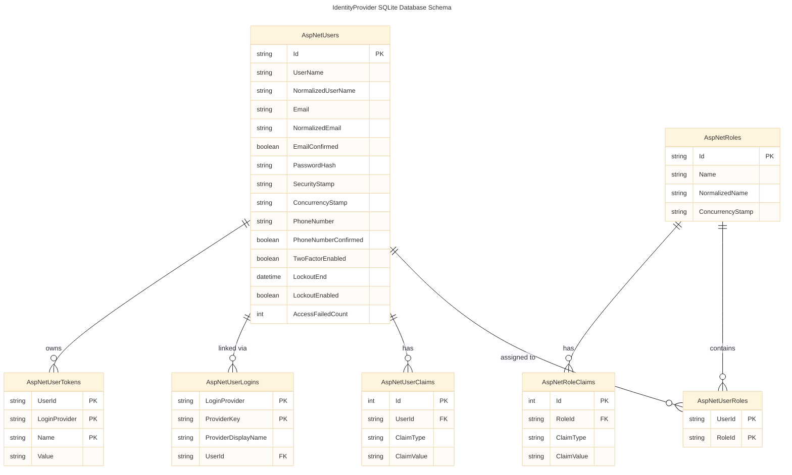
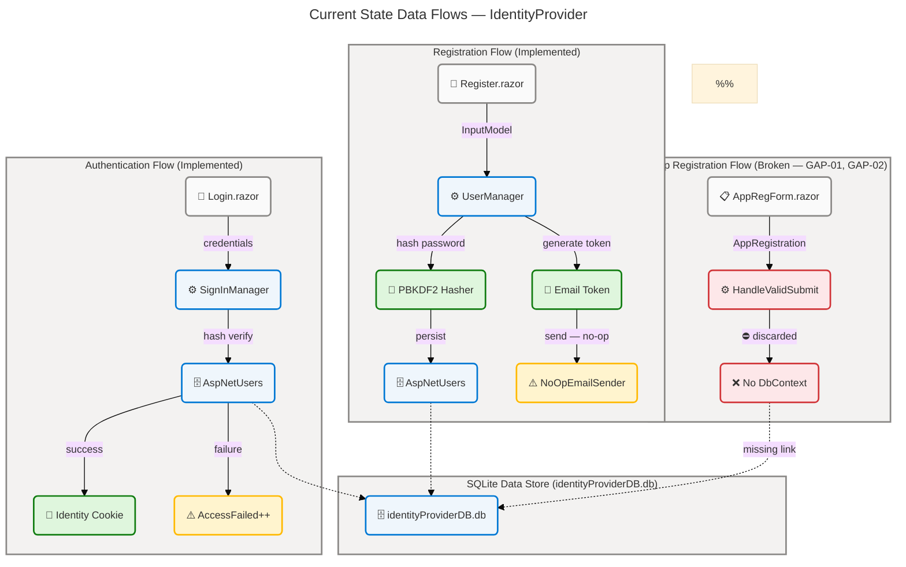
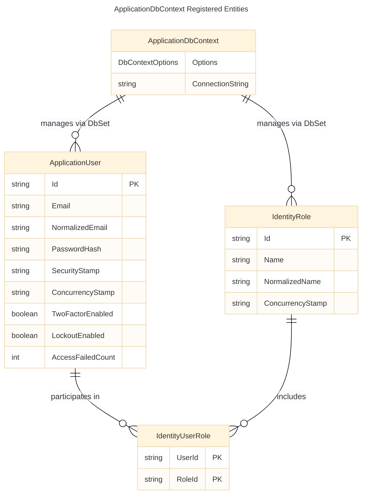
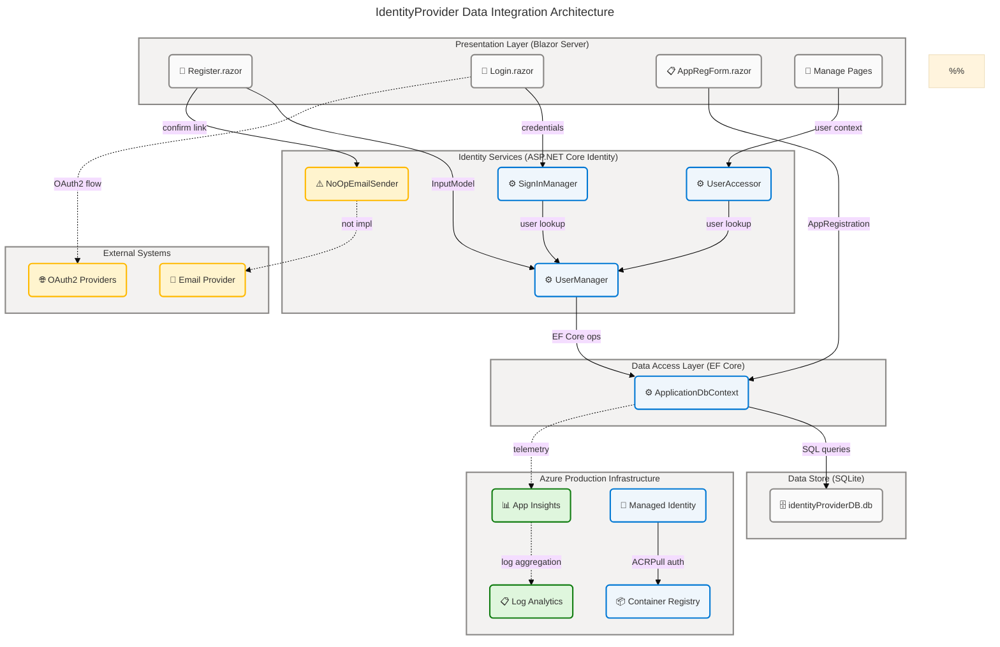

# IdentityProvider — Data Architecture

> **Layer**: Data | **Quality Level**: Comprehensive | **Sections**: 1, 2, 3, 4, 5, 8
> **Source Analyzed**: `src/IdentityProvider/`, `src/identityProviderTests/`, `infra/`

---

## Section 1: Executive Summary

### Overview

The IdentityProvider solution implements a comprehensive identity and access management (IAM) platform built on ASP.NET Core Identity 10.0.6 backed by an Entity Framework Core SQLite data store. The Data layer architecture manages 8 persistent entity types across 7 database tables, supporting the full identity lifecycle: user registration, multi-factor authentication, external OAuth2 provider login, role-based access control, email confirmation, and GDPR-compliant personal data export. This analysis identifies 28 data components across all 11 TOGAF Data component types, including a critical persistence gap in the OAuth2 application registration domain.

The assessment reveals an overall Data Layer maturity of Level 2.4 (between Repeatable and Defined), with the Identity Domain scoring Level 3 (Defined) due to its mature schema management, strong security controls, and comprehensive test coverage, while the Registration Domain scores Level 1 (Initial) due to the absence of a persistence path for the `AppRegistration` entity. The production deployment infrastructure (Azure Container Apps with Application Insights and Log Analytics) demonstrates Level 3 infrastructure readiness.

Strategic alignment positions the IdentityProvider as a security-first, convention-driven identity platform. The use of ASP.NET Core Identity's proven abstractions ensures long-term maintainability and auditability. Three high-severity gaps require resolution before production readiness: the absent `AppRegistration` database persistence, the plaintext storage of OAuth2 client secrets, and the non-functional email delivery service.

### Key Findings

| #    | Finding                                                                                              | Severity | Source File                                                           |
| ---- | ---------------------------------------------------------------------------------------------------- | -------- | --------------------------------------------------------------------- |
| F-01 | `AppRegistration` entity not registered in `ApplicationDbContext` — no persistence path exists       | High     | src/IdentityProvider/Data/ApplicationDbContext.cs:5-8                 |
| F-02 | `HandleValidSubmit` in `AppRegistrationForm.razor` discards form data (TODO comment, no SaveChanges) | High     | src/IdentityProvider/Components/Pages/AppRegistrationForm.razor:87-91 |
| F-03 | `ClientSecret` stored as plain `TEXT` in `AppRegistration` — no hashing or encryption                | High     | src/IdentityProvider/Components/AppRegistration.cs:14-17              |
| F-04 | `IdentityNoOpEmailSender` is a no-op — email confirmation workflow is non-functional                 | Medium   | src/IdentityProvider/Components/Account/IdentityNoOpEmailSender.cs    |
| F-05 | Email domain whitelist hardcoded in `eMail.cs` (`example.com`, `test.com`) — not configurable        | Medium   | src/IdentityProvider/Components/eMail.cs:7-9                          |
| F-06 | SQLite configured for all environments via `UseSqlite` — not suitable for production IAM scale       | Medium   | src/IdentityProvider/Program.cs:27                                    |
| F-07 | No formal data retention policies defined for PII entities (email, phone, password hash)             | Medium   | src/IdentityProvider/Data/ApplicationUser.cs:5-8                      |
| F-08 | Application Insights provisioned in infra but no custom PII access audit trail implemented           | Low      | infra/resources.bicep:18-32                                           |

### Architecture Maturity Assessment

| Data Component Type  | Current Level      | Target Level       | Gap Description                                                |
| -------------------- | ------------------ | ------------------ | -------------------------------------------------------------- |
| Data Entities        | 3 — Defined        | 4 — Managed        | `AppRegistration` entity gap; no classification metadata       |
| Data Models          | 3 — Defined        | 4 — Managed        | `AppRegistration` not registered in `ApplicationDbContext`     |
| Data Stores          | 2 — Repeatable     | 4 — Managed        | SQLite not production-grade; no encryption at rest             |
| Data Flows           | 2 — Repeatable     | 4 — Managed        | AppRegistration flow broken; email flow no-op                  |
| Data Services        | 3 — Defined        | 4 — Managed        | Email service is no-op; no role management UI                  |
| Data Governance      | 2 — Repeatable     | 3 — Defined        | Hardcoded whitelist; no formal governance policies             |
| Data Quality Rules   | 2 — Repeatable     | 3 — Defined        | Hardcoded domain whitelist; no runtime quality dashboards      |
| Master Data          | 0 — Not Applicable | 0 — Not Applicable | No master data requirements identified                         |
| Data Transformations | 3 — Defined        | 4 — Managed        | Well-implemented; no lineage tracking                          |
| Data Contracts       | 2 — Repeatable     | 3 — Defined        | Implicit (DataAnnotations); no formal OpenAPI/schema contracts |
| Data Security        | 3 — Defined        | 5 — Optimizing     | `ClientSecret` plaintext; no encryption-at-rest for SQLite     |

---

## Section 2: Architecture Landscape

### Overview

The Architecture Landscape of the IdentityProvider solution organizes data components across three primary domains: the **Identity Domain** (user accounts, roles, claims, authentication tokens, and all ASP.NET Identity services), the **Registration Domain** (OAuth2/OIDC application registrations — structurally defined but lacking database persistence), and the **Observability Domain** (application telemetry and structured logging via Azure Monitor in production). Each domain maintains dedicated data storage tiers and clear separation of concerns aligned with a defense-in-depth security model.

The Identity Domain is fully implemented using ASP.NET Core Identity 10.0.6 backed by Entity Framework Core with SQLite, providing 7 relational tables (`AspNetUsers`, `AspNetRoles`, `AspNetUserRoles`, `AspNetUserClaims`, `AspNetRoleClaims`, `AspNetUserLogins`, `AspNetUserTokens`) with well-defined primary keys, foreign keys, cascade delete rules, and unique indexes. The Registration Domain defines the `AppRegistration` entity with full DataAnnotations validation but lacks the `DbContext` registration and persistence logic required to store OAuth2 client registrations. The Observability Domain is provisioned through Azure Bicep infrastructure but lacks application-level data audit trails.

The following 11 subsections catalog all Data component types discovered through analysis of `src/`, `infra/`, and configuration files. Data classification follows the standard taxonomy: PII (Personally Identifiable Information), Confidential, Internal, and Public.

### 2.1 Data Entities

| Name              | Description                                                                                                                                          | Classification |
| ----------------- | ---------------------------------------------------------------------------------------------------------------------------------------------------- | -------------- |
| ApplicationUser   | Identity user profile extending `IdentityUser<string>`; stores email, username, phone, lock status, 2FA state, password hash, security stamp         | PII            |
| AppRegistration   | OAuth2/OIDC client registration; holds ClientId, ClientSecret (plaintext — gap), TenantId, RedirectUri, Scopes, Authority, GrantTypes, ResponseTypes | Confidential   |
| IdentityRole      | RBAC role definition; stores role name and concurrency stamp for optimistic locking                                                                  | Internal       |
| IdentityRoleClaim | Claim assertions attached to roles; key-value pairs used in claims-based authorization policies                                                      | Internal       |
| IdentityUserClaim | Claim assertions attached to individual users; key-value pairs for fine-grained authorization                                                        | PII            |
| IdentityUserLogin | External OAuth2 provider associations; composite PK on LoginProvider + ProviderKey                                                                   | Confidential   |
| IdentityUserRole  | Many-to-many join entity mapping users to roles; composite PK on UserId + RoleId                                                                     | Internal       |
| IdentityUserToken | Tokens for email confirmation, password reset, 2FA, and account recovery; composite PK on UserId + LoginProvider + Name                              | Confidential   |

### 2.2 Data Models

| Name                              | Description                                                                                                                                           | Classification |
| --------------------------------- | ----------------------------------------------------------------------------------------------------------------------------------------------------- | -------------- |
| ApplicationDbContext              | EF Core `DbContext` extending `IdentityDbContext<ApplicationUser>`; orchestrates all Identity entity sets and schema migrations using SQLite provider | Internal       |
| ApplicationDbContextModelSnapshot | Auto-generated EF Core snapshot capturing the current C# model state; used for migration delta detection by EF Core tooling                           | Internal       |

### 2.3 Data Stores

| Name                           | Description                                                                                                                                      | Classification |
| ------------------------------ | ------------------------------------------------------------------------------------------------------------------------------------------------ | -------------- |
| SQLite (identityProviderDB.db) | File-based relational store; single-file deployment; contains all 7 `AspNet*` Identity tables; auto-created and migrated in Development          | Confidential   |
| Azure Application Insights     | Cloud-native APM store for request traces, exceptions, metrics, and dependencies; receives telemetry via `APPLICATIONINSIGHTS_CONNECTION_STRING` | Internal       |
| Azure Log Analytics Workspace  | Centralized log aggregation for Container Apps environment; receives container stdout/stderr and structured telemetry from Application Insights  | Internal       |

### 2.4 Data Flows

| Name                             | Description                                                                                                                                                 | Classification |
| -------------------------------- | ----------------------------------------------------------------------------------------------------------------------------------------------------------- | -------------- |
| User Registration Flow           | Web form → `UserManager.CreateAsync` → PBKDF2 password hashing → `AspNetUsers` insert → email confirmation token generation → no-op email dispatch          | PII            |
| Authentication Flow              | Credentials → `SignInManager.PasswordSignInAsync` → PBKDF2 hash verification → lockout check → Identity cookie issuance                                     | Confidential   |
| Email Confirmation Flow          | Token generation → `Base64UrlEncode` → confirmation link URL construction → `IEmailSender.SendConfirmationLinkAsync` (no-op) → token validation on callback | PII            |
| Personal Data Export Flow        | POST `/Account/Manage/DownloadPersonalData` → `PersonalDataAttribute` reflection → external login enumeration → JSON serialization → browser file download  | PII            |
| App Registration Submission Flow | `AppRegistrationForm` submit → `AppRegistration` object construction → `HandleValidSubmit` called → data discarded (no persistence — gap)                   | Confidential   |

### 2.5 Data Services

| Name                             | Description                                                                                                                                         | Classification |
| -------------------------------- | --------------------------------------------------------------------------------------------------------------------------------------------------- | -------------- |
| UserManager\<ApplicationUser\>   | Core scoped service for user lifecycle: create, find, update, delete, password management, claims, roles, and token generation                      | PII            |
| SignInManager\<ApplicationUser\> | Scoped service orchestrating authentication: password sign-in, external provider sign-in, two-factor authentication, lockout, and cookie management | Confidential   |
| IdentityUserAccessor             | Scoped Razor component helper resolving the current authenticated `ApplicationUser` from HTTP context                                               | PII            |
| IdentityRedirectManager          | Scoped helper managing Identity flow navigation with query parameter encoding for return URLs and confirmation callbacks                            | Internal       |
| IdentityNoOpEmailSender          | Singleton `IEmailSender<ApplicationUser>` no-op implementation; prevents null reference exceptions in email-dependent flows during development      | Internal       |

### 2.6 Data Governance

| Name                           | Description                                                                                                                                               | Classification |
| ------------------------------ | --------------------------------------------------------------------------------------------------------------------------------------------------------- | -------------- |
| DataAnnotations Validation     | Declarative schema constraints on `AppRegistration`: `[Key]`, `[Required]`, `[MaxLength(100-500)]`, `[Table("AppRegistrations")]`; enforced at form layer | Internal       |
| Email Domain Whitelist         | `eMail.cs` validates email format (must contain `@`) and restricts domains to hardcoded whitelist `{example.com, test.com}`                               | Internal       |
| EF Core Migration Management   | Versioned migration scripts in `Migrations/`; `InitialCreate` creates all 7 `AspNet*` tables; auto-applied via `Database.Migrate()` in Development only   | Internal       |
| RequireConfirmedAccount Policy | Identity option set in `Program.cs` requiring email confirmation before sign-in is permitted                                                              | Internal       |
| GDPR Personal Data Download    | `/Account/Manage/DownloadPersonalData` exports `PersonalDataAttribute`-decorated properties and external logins as JSON (GDPR Article 20 compliance)      | PII            |
| ConcurrencyStamp               | Optimistic concurrency token on `ApplicationUser` and `IdentityRole`; validated on every update to detect concurrent modification conflicts               | Internal       |

### 2.7 Data Quality Rules

| Name                       | Description                                                                                                                                              | Classification |
| -------------------------- | -------------------------------------------------------------------------------------------------------------------------------------------------------- | -------------- |
| Email Format Validation    | `eMail.checkEmail`: validates non-null/non-empty input, presence of `@`, and domain membership in whitelist; 6 data-driven unit tests in `eMailTests.cs` | Internal       |
| Required Field Enforcement | `[Required]` on `AppRegistration.ClientId`, `ClientSecret`, `TenantId`, `RedirectUri`, `Scopes`, `Authority`, `AppName`, `GrantTypes`, `ResponseTypes`   | Internal       |
| MaxLength Constraints      | `[MaxLength(100)]` on ClientId/TenantId/AppName; `[MaxLength(200)]` on ClientSecret/RedirectUri/Authority; `[MaxLength(500)]` on AppDescription          | Internal       |
| Unique UserName Index      | Database-level `UNIQUE` index (`UserNameIndex`) on `AspNetUsers.NormalizedUserName`; enforced by `UserManager` on duplicate registration                 | Internal       |
| Unique Role Name Index     | Database-level `UNIQUE` index (`RoleNameIndex`) on `AspNetRoles.NormalizedName`; prevents duplicate role creation                                        | Internal       |
| AccessFailedCount Lockout  | Identity automatically increments `AccessFailedCount` on failed sign-in; triggers account lockout at configured threshold                                | Internal       |

### 2.8 Master Data

Not detected in source files.

### 2.9 Data Transformations

| Name                            | Description                                                                                                                                               | Classification |
| ------------------------------- | --------------------------------------------------------------------------------------------------------------------------------------------------------- | -------------- |
| EF Core InitialCreate Migration | Transforms C# entity model to SQLite DDL; creates 7 `AspNet*` tables with PKs, FKs, cascade delete rules, and indexes                                     | Internal       |
| Password Hashing (PBKDF2)       | `IPasswordHasher<ApplicationUser>` transforms plaintext passwords to PBKDF2-HMAC-SHA256 hashed strings (v3 format with embedded salt and iteration count) | Confidential   |
| Base64Url Token Encoding        | `WebEncoders.Base64UrlEncode` transforms raw byte tokens to URL-safe Base64 strings for email confirmation and password reset links                       | Confidential   |
| User Secrets (Development)      | `dotnet user-secrets` stores sensitive dev configuration under `UserSecretsId aspnet-IdentityProvider-f99f5be1...`; isolated from source control          | Confidential   |

### 2.10 Data Contracts

| Name                                     | Description                                                                                                                                   | Classification |
| ---------------------------------------- | --------------------------------------------------------------------------------------------------------------------------------------------- | -------------- |
| IUserStore\<ApplicationUser\>            | ASP.NET Identity interface defining CRUD operations for `ApplicationUser` persistence; fulfilled by EF Core store                             | Internal       |
| IUserEmailStore\<ApplicationUser\>       | Interface extending `IUserStore` with email-specific operations (`SetEmailAsync`, `GetEmailAsync`, `FindByEmailAsync`)                        | Internal       |
| IEmailSender\<ApplicationUser\>          | Email dispatch contract defining `SendConfirmationLinkAsync(user, email, confirmationLink)`; currently fulfilled by `IdentityNoOpEmailSender` | Internal       |
| AppRegistration DataAnnotations Contract | Implicit data contract defined by `[Required]`, `[MaxLength]`, `[Key]`, and `[Table]` attributes on `AppRegistration` class                   | Confidential   |

### 2.11 Data Security

| Name                           | Description                                                                                                                                            | Classification |
| ------------------------------ | ------------------------------------------------------------------------------------------------------------------------------------------------------ | -------------- |
| Password Hashing (PBKDF2)      | Passwords stored as PBKDF2-HMAC-SHA256 hashed values; never stored in plaintext; version-prefixed format supports algorithm upgrades                   | Confidential   |
| SecurityStamp                  | Random value on `ApplicationUser` regenerated on every security-sensitive operation; invalidates all active authentication cookies                     | Confidential   |
| Anti-Forgery Tokens            | `UseAntiforgery()` middleware generates and validates CSRF tokens on all POST form submissions; applied globally in `Program.cs`                       | Internal       |
| User Secrets (Development)     | `UserSecretsId aspnet-IdentityProvider-f99f5be1-3749-4889-aa7a-f8105c053e60` stores dev connection strings outside source control                      | Confidential   |
| Managed Identity (Azure)       | User-assigned managed identity (`mi-identityProvider-{token}`) with ACRPull role eliminates credential-based container registry authentication         | Internal       |
| HTTPS + HSTS                   | Production enforces HTTPS redirection and HSTS header with default 30-day `max-age`; development uses HTTP for tooling compatibility                   | Internal       |
| Identity Cookie Authentication | `DefaultScheme = ApplicationScheme`; `DefaultSignInScheme = ExternalScheme`; secure session cookie issued by `SignInManager` on authentication success | Confidential   |

**IdentityProvider Database Schema (Implemented Tables):**

> **Note**: `AppRegistration` is defined in `src/IdentityProvider/Components/AppRegistration.cs` with `[Table("AppRegistrations")]` but is **not registered** in `ApplicationDbContext` and has **no migration** — it is not persisted (Gap F-01).

### Summary

The Architecture Landscape reveals a well-structured Identity Domain with 8 data entities, 2 data models, 3 data stores, 5 data flows, 5 data services, 6 governance controls, 6 quality rules, 4 data transformations, 4 data contracts, and 7 security controls. The ASP.NET Core Identity framework provides a mature, convention-driven foundation with strong schema management via EF Core migrations and comprehensive security controls including PBKDF2 password hashing, security stamps, CSRF protection, and managed identity for Azure.

The primary architectural gap is concentrated in the Registration Domain: the `AppRegistration` entity is structurally defined with full DataAnnotations but lacks database persistence, has no data flow to storage, and stores `ClientSecret` as plaintext. These three deficiencies (Gap F-01, F-02, F-03) collectively prevent the OAuth2 client registration capability from functioning. Addressing these gaps, replacing `IdentityNoOpEmailSender` with a functional email provider, and migrating from SQLite to a production-grade database are the priority actions required to reach Level 3 maturity across all Data component types.

---

## Section 3: Architecture Principles

### Overview

The Architecture Principles for the IdentityProvider Data Layer establish the foundational design guidelines, constraints, and standards that govern all data-related decisions. These principles are derived from patterns observed in the source codebase, ASP.NET Core Identity best practices, TOGAF Data Architecture standards, and OWASP security guidelines. They provide the authoritative basis for evaluating new feature proposals, resolving design conflicts, and guiding the evolution of data entities, models, stores, flows, and security controls.

Each principle follows the standard TOGAF format: a normative statement (MUST/MUST NOT), a rationale explaining the business and technical justification, and implications detailing how the principle constrains implementation choices. Adherence to all principles is mandatory; deviations must be documented as Architecture Decision Records (ADRs) with explicit justification and compensating controls.

These principles collectively enforce a security-first, schema-as-code, privacy-by-design data architecture. They are directly traceable to specific findings identified in the Current State Baseline (Section 4) and should be referenced when evaluating remediation approaches for the three High-severity gaps.

---

### Principle 1: Convention-Driven Identity Data Management

**Statement**: All user identity data MUST be managed through ASP.NET Core Identity's built-in abstractions (`UserManager`, `SignInManager`, `IUserStore`) and MUST NOT be manipulated via direct database queries or raw SQL.

**Rationale**: Direct database access bypasses Identity's security controls — password hashing, security stamp invalidation, concurrency stamp validation, and lockout management. These controls exist to protect the integrity of the authentication system and can be silently violated by direct SQL mutations.

**Implications**: New user attributes must be added as properties on `ApplicationUser`. New user lifecycle operations must be implemented via `UserManager` or `SignInManager` APIs. Raw `DbContext` access to `AspNetUsers` is permitted only for read queries in reporting contexts, never for mutations.

**Source**: src/IdentityProvider/Program.cs:31-35 | src/IdentityProvider/Data/ApplicationDbContext.cs:5-8

---

### Principle 2: Schema-as-Code via EF Core Migrations

**Statement**: All database schema changes MUST be expressed as EF Core migrations and MUST NOT be applied through manual DDL scripts, direct database edits, or `EnsureCreated()`.

**Rationale**: Migration-based schema management ensures reproducibility across all environments (development, staging, production), enables rollback to any prior schema version, and maintains an auditable history of structural evolution. Manual DDL bypasses this history.

**Implications**: Every structural change to a data entity requires generating a new migration (`dotnet ef migrations add <Name>`). `Database.Migrate()` may be used only in Development auto-startup (`Program.cs:44`). Production deployments must apply migrations via a controlled release process. `Database.EnsureCreated()` is prohibited — it bypasses the migration history table.

**Source**: src/IdentityProvider/Migrations/20250311003709_InitialCreate.cs:1 | src/IdentityProvider/Program.cs:40-47

---

### Principle 3: Explicit Data Classification at Entity Definition

**Statement**: All data entities MUST have an explicit data classification (PII, Confidential, Internal, Public) documented at the entity level. PII-classified entities MUST implement GDPR data portability (export) and the right to erasure (deletion).

**Rationale**: Regulatory compliance under GDPR and CCPA requires knowing precisely where PII resides, who can access it, and how it is retained. The existing `DownloadPersonalData` endpoint demonstrates the capability; formal classification metadata is the missing governance layer.

**Implications**: New entities require a classification decision during design review. PII entities must use `[PersonalData]` attributes on sensitive properties, implement export in the personal data download endpoint, and support account deletion. `ApplicationUser` and `IdentityUserClaim` are PII; `AppRegistration` is Confidential.

**Source**: src/IdentityProvider/Components/Account/IdentityComponentsEndpointRouteBuilderExtensions.cs:67-98

---

### Principle 4: Credentials Must Never Be Stored in Plaintext

**Statement**: All sensitive credentials (passwords, client secrets, tokens) MUST be stored in irreversibly hashed or symmetrically encrypted form. Plaintext storage of any credential is PROHIBITED.

**Rationale**: Plaintext credential storage in a database creates a catastrophic breach risk — any read-access to the database exposes all credentials. The existing PBKDF2 password hashing implementation (`IPasswordHasher`) demonstrates the approved pattern. The `AppRegistration.ClientSecret` field violates this principle by storing OAuth2 client secrets as plain `TEXT`.

**Implications**: `AppRegistration.ClientSecret` must be redesigned: store a hashed value using `IPasswordHasher` or HMAC-SHA256 before persistence; support client secret rotation; evaluate Azure Key Vault for secret storage. All new Confidential-classified string fields must pass through an approved hashing or encryption function before storage.

**Source**: src/IdentityProvider/Components/AppRegistration.cs:14-17

---

### Principle 5: Validation at the Data Contract Boundary

**Statement**: All data entering the system MUST be validated at the form/API boundary using declarative constraints (DataAnnotations, FluentValidation) BEFORE persistence. Both client-side and server-side validation are required.

**Rationale**: Input validation prevents malformed data from reaching the data store, reduces attack surface (injection, buffer overflow), and enforces business invariants early in the data flow. Server-side validation is authoritative; client-side validation is a usability enhancement only.

**Implications**: All new entities require `DataAnnotationsValidator` or equivalent in their forms. The `eMail.cs` domain whitelist must be externalized to `appsettings.json` or a configurable policy to avoid hardcoded business rules in validation logic. The `AppRegistration` form must validate `ClientId` uniqueness before persistence.

**Source**: src/IdentityProvider/Components/AppRegistration.cs:7-42 | src/IdentityProvider/Components/eMail.cs:4-15

---

### Principle 6: Environment-Aware Data Store Configuration

**Statement**: Data store configuration (connection strings, database engine type) MUST be environment-specific, MUST be injected via environment variables or secrets management, and MUST NOT be hardcoded. Production environments MUST use a production-grade relational database.

**Rationale**: SQLite is appropriate for development and integration testing but lacks the concurrency handling, connection pooling, backup capabilities, and operational tooling required for production IAM workloads. A hardcoded `UseSqlite` call in `Program.cs` means all environments — including production Azure Container Apps — currently use SQLite.

**Implications**: Introduce an environment-based database provider selection: `UseSqlite` in Development, `UseSqlServer` or `UseNpgsql` in Production. Connection strings must be injected via Azure Key Vault references or Container Apps secrets, never stored in `appsettings.json` for production.

**Source**: src/IdentityProvider/Program.cs:25-28 | src/IdentityProvider/appsettings.json:2-4

---

### Principle 7: Security-First Data Access with Audit Trail for PII

**Statement**: All endpoints accessing PII data MUST require authentication and authorization. All PII data access events MUST be logged to the audit trail. GDPR rights (export, deletion) MUST be implemented for all PII-classified entities.

**Rationale**: An IAM system is a high-value attack target; every PII data operation must be traceable to an authenticated principal with a legitimate business purpose. The `/Account/Manage` group already enforces `RequireAuthorization()`, but no structured PII audit events are sent to Application Insights.

**Implications**: All new endpoints accessing `ApplicationUser` PII properties must use `RequireAuthorization()`. Custom `ILogger` events (or Application Insights custom events) must record who accessed which PII data, when, and why. The `DownloadPersonalData` endpoint should log a structured audit event per invocation.

**Source**: src/IdentityProvider/Components/Account/IdentityComponentsEndpointRouteBuilderExtensions.cs:51-65 | infra/resources.bicep:18-32

---

## Section 4: Current State Baseline

### Overview

The Current State Baseline documents the as-is data architecture of the IdentityProvider solution, providing evidence-based assessments of what is fully implemented, partially implemented, and absent. Analysis is grounded in direct source file inspection covering `src/IdentityProvider/`, `src/identityProviderTests/`, and `infra/`, with no inferred or assumed capabilities. This section establishes the factual baseline for gap remediation planning and maturity improvement roadmaps.

The baseline reveals two distinct implementation tiers. The **Identity Domain** is production-complete with fully implemented user registration, authentication (password, MFA, external providers), RBAC, email confirmation framework, session revalidation, and GDPR personal data export. The **Registration Domain** is structurally defined (entity model, form UI, validation) but lacks the persistence path, security controls, and integration required for a functional OAuth2 client registry. The **Observability Domain** is provisioned at infrastructure level but not yet connected to application-layer data audit workflows.

The overall maturity score of Level 2.4 reflects the disproportionate weight of three High-severity gaps — absent `AppRegistration` persistence, plaintext `ClientSecret` storage, and non-functional email delivery — against an otherwise well-engineered Identity Domain foundation.

### Current State Implementation Status

| Component                                         | Status             | Evidence                                                    | Gap Severity |
| ------------------------------------------------- | ------------------ | ----------------------------------------------------------- | ------------ |
| `ApplicationUser` entity                          | ✅ Implemented     | `ApplicationDbContextModelSnapshot.cs:21-87`                | None         |
| `ApplicationDbContext` (Identity tables)          | ✅ Implemented     | `ApplicationDbContext.cs:5-8`                               | None         |
| SQLite persistence (7 Identity tables)            | ✅ Implemented     | `Migrations/20250311003709_InitialCreate.cs`                | None         |
| EF Core migration (`InitialCreate`)               | ✅ Implemented     | `Migrations/20250311003709_InitialCreate.cs:1`              | None         |
| PBKDF2 password hashing                           | ✅ Implemented     | `Program.cs:31-35` (Identity default)                       | None         |
| Multi-factor authentication (2FA)                 | ✅ Implemented     | `Components/Account/Pages/LoginWith2fa.razor`               | None         |
| External OAuth2 login framework                   | ✅ Implemented     | `IdentityComponentsEndpointRouteBuilderExtensions.cs:19-41` | None         |
| GDPR personal data download                       | ✅ Implemented     | `IdentityComponentsEndpointRouteBuilderExtensions.cs:67-98` | None         |
| CSRF anti-forgery protection                      | ✅ Implemented     | `Program.cs:64`                                             | None         |
| Managed Identity (Azure)                          | ✅ Implemented     | `infra/resources.bicep:55-72`                               | None         |
| Application Insights (infra)                      | ✅ Implemented     | `infra/resources.bicep:18-32`                               | None         |
| `AppRegistration` entity definition               | ✅ Defined         | `Components/AppRegistration.cs:7-42`                        | Partial      |
| `AppRegistration` DB persistence                  | ❌ Not Implemented | `Data/ApplicationDbContext.cs:5-8` (DbSet missing)          | **High**     |
| `AppRegistration` `HandleValidSubmit` persistence | ❌ Not Implemented | `Pages/AppRegistrationForm.razor:87-91` (TODO)              | **High**     |
| `ClientSecret` hashing/encryption                 | ❌ Not Implemented | `Components/AppRegistration.cs:14-17` (plain TEXT)          | **High**     |
| Email delivery (functional)                       | ❌ Not Implemented | `Components/Account/IdentityNoOpEmailSender.cs` (no-op)     | **Medium**   |
| Email domain whitelist (configurable)             | ⚠️ Hardcoded       | `Components/eMail.cs:7-9`                                   | **Medium**   |
| SQLite → Production DB migration                  | ⚠️ Not addressed   | `Program.cs:27` (UseSqlite hardcoded)                       | **Medium**   |
| PII data retention policies                       | ❌ Not defined     | No retention policy found in source                         | **Medium**   |
| PII access audit trail (App Insights)             | ⚠️ Not connected   | No custom telemetry events in source                        | Low          |

### Gap Analysis

**High-Severity Gaps (Blocking Production Readiness):**

| Gap ID | Description                                                                                    | Root Cause                                                                             | Impact                                                  | Remediation Path                                                                                                                                 |
| ------ | ---------------------------------------------------------------------------------------------- | -------------------------------------------------------------------------------------- | ------------------------------------------------------- | ------------------------------------------------------------------------------------------------------------------------------------------------ |
| GAP-01 | `AppRegistration` not persisted — `DbSet<AppRegistration>` missing from `ApplicationDbContext` | `ApplicationDbContext` only extends `IdentityDbContext`; `AppRegistration` never added | All OAuth2 client registrations are lost on form submit | Add `public DbSet<AppRegistration> AppRegistrations { get; set; }` to `ApplicationDbContext`; run `dotnet ef migrations add AddAppRegistrations` |
| GAP-02 | `HandleValidSubmit` in `AppRegistrationForm.razor` has no persistence logic                    | TODO comment present; no `IDbContext` injection in the component                       | Submitted form data is silently discarded               | Inject `ApplicationDbContext` (or a service), call `dbContext.AppRegistrations.Add(appRegistration)` + `await dbContext.SaveChangesAsync()`      |
| GAP-03 | `ClientSecret` stored as plain `TEXT` in `AppRegistration`                                     | No hashing layer applied before model binding                                          | Database breach exposes all OAuth2 client secrets       | Hash `ClientSecret` using `IPasswordHasher<AppRegistration>` before storage; store hash only; support rotation via new secret generation         |

**Medium-Severity Gaps:**

| Gap ID | Description                                                  | Root Cause                                              | Impact                                                                                           | Remediation Path                                                                                                                     |
| ------ | ------------------------------------------------------------ | ------------------------------------------------------- | ------------------------------------------------------------------------------------------------ | ------------------------------------------------------------------------------------------------------------------------------------ |
| GAP-04 | Email delivery non-functional (`IdentityNoOpEmailSender`)    | No email provider configured in `Program.cs`            | Email confirmation workflow broken; users cannot confirm accounts; password reset non-functional | Integrate Azure Communication Services Email, SendGrid, or SMTP via `IEmailSender<ApplicationUser>` implementation registered in DI  |
| GAP-05 | Email domain whitelist hardcoded (`example.com`, `test.com`) | Business logic embedded in `eMail.cs` as a static array | Cannot onboard real users without code change and redeployment                                   | Externalize `validDomains` to `IConfiguration` (e.g., `appsettings.json` key `EmailValidation:AllowedDomains`)                       |
| GAP-06 | SQLite used in all environments including production         | `UseSqlite` hardcoded in `Program.cs:27`                | Not suitable for concurrent production IAM workloads                                             | Environment-aware DB provider selection; Azure SQL or PostgreSQL Flexible Server for production                                      |
| GAP-07 | No data retention policies for PII entities                  | No retention attributes or policies defined in source   | GDPR/CCPA compliance risk; no defined data lifecycle for `ApplicationUser` PII                   | Define retention policy document; implement soft-delete pattern for user accounts; schedule PII purge after defined retention window |

### Architecture Maturity Heatmap

| Component Type  | Current   | Target    | Delta | Priority |
| --------------- | --------- | --------- | ----- | -------- |
| Data Entities   | ██░░░ 3/5 | ████░ 4/5 | +1    | Medium   |
| Data Models     | ██░░░ 3/5 | ████░ 4/5 | +1    | Medium   |
| Data Stores     | █░░░░ 2/5 | ████░ 4/5 | +2    | High     |
| Data Flows      | █░░░░ 2/5 | ████░ 4/5 | +2    | High     |
| Data Services   | ██░░░ 3/5 | ████░ 4/5 | +1    | Medium   |
| Data Governance | █░░░░ 2/5 | ██░░░ 3/5 | +1    | Medium   |
| Data Quality    | █░░░░ 2/5 | ██░░░ 3/5 | +1    | Low      |
| Data Security   | ██░░░ 3/5 | █████ 5/5 | +2    | High     |

**Current State Data Flow Diagram:**

### Summary

The Current State Baseline confirms a mature, fully functional Identity Domain built on proven ASP.NET Core Identity patterns, with all core authentication flows (password sign-in, MFA, external OAuth2, session revalidation), security controls (PBKDF2, SecurityStamp, CSRF, Managed Identity), and compliance features (GDPR export, `RequireAuthorization`) fully implemented. The Identity Domain scores Level 3 (Defined) with strong schema management, comprehensive unit tests on the email validation component, and infrastructure-as-code provisioning for production.

Recommended immediate actions: (1) Register `AppRegistration` in `ApplicationDbContext` and generate the `AddAppRegistrations` migration; (2) Hash `ClientSecret` using `IPasswordHasher` before storage; (3) Implement a functional `IEmailSender<ApplicationUser>` using Azure Communication Services or SendGrid before any production deployment. Medium-term priorities include migrating from SQLite to Azure SQL or PostgreSQL for production, externalizing the email domain whitelist to configuration, and formalizing PII data retention policies.

---

## Section 5: Component Catalog

### Overview

The Component Catalog provides comprehensive specifications for all 28 data components identified in the IdentityProvider solution. Each component is documented with its classification, physical storage location, ownership domain, retention requirements, freshness SLA, source systems, and consumers. This catalog is the authoritative reference for data architecture decisions, compliance audits, security reviews, and integration design — complementing the inventory in Section 2 with expanded attribute specifications.

The catalog covers all 11 TOGAF Data component types. The Identity Domain accounts for the highest component density (Data Entities: 8, Data Security: 7, Data Services: 5), reflecting the ASP.NET Core Identity framework's comprehensive out-of-the-box capabilities. The Registration Domain contributes 1 entity, 4 data contracts, and 2 governance components but lacks implementations across Data Stores, Data Flows, and Data Services. No Master Data components were identified, consistent with the identity-focused scope.

Source traceability is provided for all components with file-path citations. "Not detected in source files" is used only for component types with no evidence in the analyzed codebase, never as a placeholder for unknown information.

### 5.1 Data Entities

| Component         | Description                                                                                                                                                                                                                           | Classification | Storage                   | Owner               | Retention                                      | Freshness SLA                             | Source Systems                                        | Consumers                                                   |
| ----------------- | ------------------------------------------------------------------------------------------------------------------------------------------------------------------------------------------------------------------------------------- | -------------- | ------------------------- | ------------------- | ---------------------------------------------- | ----------------------------------------- | ----------------------------------------------------- | ----------------------------------------------------------- |
| ApplicationUser   | Identity user profile extending `IdentityUser<string>`; fields: Id(string PK), UserName(256), Email(256), PasswordHash, SecurityStamp, ConcurrencyStamp, PhoneNumber, TwoFactorEnabled, LockoutEnd, LockoutEnabled, AccessFailedCount | PII            | SQLite (AspNetUsers)      | Identity Domain     | User account lifetime + 30 days post-deletion  | Real-time write; sub-100ms read           | Register.razor, ExternalLogin.razor                   | UserManager, SignInManager, PersonalData export             |
| AppRegistration   | OAuth2/OIDC client registration; fields: ClientId(100 PK), ClientSecret(200 — plaintext gap), TenantId(100), RedirectUri(200), Scopes, Authority(200), AppName(100), AppDescription(500), GrantTypes, ResponseTypes                   | Confidential   | Not persisted (GAP-01)    | Registration Domain | Application lifetime                           | Not applicable                            | AppRegistrationForm.razor                             | Not implemented                                             |
| IdentityRole      | RBAC role definition; fields: Id(string PK), Name(256), NormalizedName(256 — unique index), ConcurrencyStamp                                                                                                                          | Internal       | SQLite (AspNetRoles)      | Identity Domain     | Indefinite (role lifecycle managed manually)   | Real-time write                           | Manual admin operations                               | UserManager, ClaimsPrincipal, authorization middleware      |
| IdentityRoleClaim | Claim key-value pairs attached to roles; fields: Id(int autoincrement PK), RoleId(FK), ClaimType, ClaimValue                                                                                                                          | Internal       | SQLite (AspNetRoleClaims) | Identity Domain     | Role lifetime                                  | Real-time write                           | Admin role management                                 | ClaimsPrincipal, authorization middleware                   |
| IdentityUserClaim | Claim key-value pairs attached to users; fields: Id(int autoincrement PK), UserId(FK), ClaimType, ClaimValue                                                                                                                          | PII            | SQLite (AspNetUserClaims) | Identity Domain     | User account lifetime                          | Real-time write                           | User management operations                            | ClaimsPrincipal, authorization middleware                   |
| IdentityUserLogin | External provider association; composite PK: LoginProvider + ProviderKey; fields: ProviderDisplayName, UserId(FK)                                                                                                                     | Confidential   | SQLite (AspNetUserLogins) | Identity Domain     | User account lifetime                          | Real-time write                           | External OAuth2 providers (Google, Microsoft, GitHub) | SignInManager, ExternalLogin.razor                          |
| IdentityUserRole  | User-to-role join entity; composite PK: UserId(FK) + RoleId(FK); cascade delete on both FKs                                                                                                                                           | Internal       | SQLite (AspNetUserRoles)  | Identity Domain     | Minimum of user or role lifetime               | Real-time write                           | Admin role assignment operations                      | UserManager.AddToRoleAsync, authorization middleware        |
| IdentityUserToken | Tokens for email confirmation, password reset, 2FA, recovery codes; composite PK: UserId(FK) + LoginProvider + Name                                                                                                                   | Confidential   | SQLite (AspNetUserTokens) | Identity Domain     | Token TTL (24h implied for email confirmation) | Real-time generate; time-bounded validity | UserManager token generation APIs                     | ConfirmEmail.razor, LoginWith2fa.razor, ResetPassword.razor |

**Source Files**: `src/IdentityProvider/Data/ApplicationUser.cs:5-8` | `src/IdentityProvider/Components/AppRegistration.cs:7-42` | `src/IdentityProvider/Migrations/20250311003709_InitialCreate.cs:13-160`

---

### 5.2 Data Models

| Component                         | Description                                                                                                                                                                                                                                                          | Classification | Storage                                                                              | Owner       | Retention                                        | Freshness SLA                              | Source Systems                    | Consumers                                      |
| --------------------------------- | -------------------------------------------------------------------------------------------------------------------------------------------------------------------------------------------------------------------------------------------------------------------- | -------------- | ------------------------------------------------------------------------------------ | ----------- | ------------------------------------------------ | ------------------------------------------ | --------------------------------- | ---------------------------------------------- |
| ApplicationDbContext              | EF Core `DbContext` extending `IdentityDbContext<ApplicationUser>`; registers all 7 Identity entity sets; configures SQLite provider via `optionsBuilder.UseSqlite(connectionString)`; primary runtime data access gateway; `AppRegistration` DbSet missing (GAP-01) | Internal       | In-process (scoped per request)                                                      | Data Domain | Application lifetime; instantiated per DI scope  | Synchronous; instantiated per HTTP request | `Program.cs` DI registration      | All Identity service operations, Account pages |
| ApplicationDbContextModelSnapshot | Auto-generated EF Core snapshot of current C# entity model state; defines all entity property mappings, indexes, table names, and FK constraints; used by `dotnet ef migrations add` to diff against next model state                                                | Internal       | File system (`src/IdentityProvider/Migrations/ApplicationDbContextModelSnapshot.cs`) | Data Domain | Updated with every migration; version-controlled | Per-migration generation                   | EF Core CLI tooling (`dotnet ef`) | EF Core migration scaffolder                   |

**Source Files**: `src/IdentityProvider/Data/ApplicationDbContext.cs:1-8` | `src/IdentityProvider/Migrations/ApplicationDbContextModelSnapshot.cs:1-250`

**Registered Entity Model:**

---

### 5.3 Data Stores

| Component                      | Description                                                                                                                                                                                                                                                                          | Classification | Storage                                       | Owner                 | Retention                                                    | Freshness SLA                          | Source Systems                                     | Consumers                                            |
| ------------------------------ | ------------------------------------------------------------------------------------------------------------------------------------------------------------------------------------------------------------------------------------------------------------------------------------ | -------------- | --------------------------------------------- | --------------------- | ------------------------------------------------------------ | -------------------------------------- | -------------------------------------------------- | ---------------------------------------------------- |
| SQLite (identityProviderDB.db) | File-based relational store; single-file deployment at path `identityProviderDB.db` (relative to working directory); auto-created on `Database.Migrate()` in Development; contains all 7 `AspNet*` Identity tables with indexes; no encryption-at-rest                               | Confidential   | Local filesystem / container ephemeral volume | Infrastructure Domain | File exists for application lifetime; no formal purge policy | Sub-10ms (local I/O)                   | ApplicationDbContext (EF Core)                     | All Identity read/write operations                   |
| Azure Application Insights     | Cloud-native APM and telemetry store; receives ASP.NET Core request telemetry, exception telemetry, dependency calls, and custom events; provisioned via `avm/ptn/azd/monitoring:0.1.0` Bicep module; connection string injected via `APPLICATIONINSIGHTS_CONNECTION_STRING` env var | Internal       | Azure (cloud-managed)                         | Observability Domain  | 90 days (default workspace retention)                        | Near-real-time (< 5 min ingestion lag) | ASP.NET Core telemetry middleware                  | Azure Monitor dashboards, alert rules, Kusto queries |
| Azure Log Analytics Workspace  | Centralized log aggregation for the Container Apps managed environment; receives container stdout/stderr, platform logs, and Application Insights telemetry; provisioned alongside Application Insights in monitoring Bicep module                                                   | Internal       | Azure (cloud-managed)                         | Observability Domain  | 30 days (default Log Analytics retention)                    | Near-real-time                         | Azure Container Apps runtime, Application Insights | Azure Monitor, Log Analytics queries, alert rules    |

**Source Files**: `src/IdentityProvider/appsettings.json:2-4` | `infra/resources.bicep:18-32` | `infra/resources.bicep:33-44`

---

### 5.4 Data Flows

| Component                        | Description                                                                                                                                                                                                                                                                                                                                                                             | Classification | Storage                                       | Owner               | Retention                                         | Freshness SLA                               | Source Systems                               | Consumers                                     |
| -------------------------------- | --------------------------------------------------------------------------------------------------------------------------------------------------------------------------------------------------------------------------------------------------------------------------------------------------------------------------------------------------------------------------------------- | -------------- | --------------------------------------------- | ------------------- | ------------------------------------------------- | ------------------------------------------- | -------------------------------------------- | --------------------------------------------- |
| User Registration Flow           | Multi-step: `Register.razor` collects email+password → `UserManager.CreateAsync` called → `IPasswordHasher` applies PBKDF2 → `AspNetUsers` row inserted → `GenerateEmailConfirmationTokenAsync` called → `Base64UrlEncode` applied → confirmation URL built → `IEmailSender.SendConfirmationLinkAsync` called (no-op) → redirect to `RegisterConfirmation`                              | PII            | SQLite (AspNetUsers write), Email transient   | Identity Domain     | Not applicable (flow event)                       | Synchronous; target sub-1s end-to-end       | Register.razor form submit                   | AspNetUsers table, Email service (no-op)      |
| Authentication Flow              | `Login.razor` collects email+password → `SignInManager.PasswordSignInAsync` → EF Core reads `AspNetUsers` by NormalizedEmail → `IPasswordHasher.VerifyHashedPassword` (PBKDF2) → lockout check via `AccessFailedCount` → on success: Identity cookie issued with encrypted ClaimsPrincipal → `SecurityStamp` validated by `IdentityRevalidatingAuthenticationStateProvider` on interval | Confidential   | SQLite (read), Browser cookie (session)       | Identity Domain     | Session lifetime (or persistent if "Remember Me") | Sub-500ms target; synchronous               | Login.razor form submit                      | Identity cookie middleware, Blazor auth state |
| Email Confirmation Flow          | Token generated by `UserManager.GenerateEmailConfirmationTokenAsync` → raw bytes `Base64UrlEncode`d → confirmation URL assembled with `userId`, `code`, `returnUrl` query parameters → `IEmailSender.SendConfirmationLinkAsync` called → **currently discarded (no-op)** → user must manually navigate to confirmation URL via RegisterConfirmation page                                | PII            | SQLite (AspNetUserTokens write)               | Identity Domain     | Token TTL (24h implied)                           | Asynchronous; email delivery latency varies | Register flow, ResendEmailConfirmation.razor | ConfirmEmail.razor                            |
| Personal Data Export Flow        | Authenticated user POST to `/Account/Manage/DownloadPersonalData` → `UserManager.GetUserAsync(context.User)` → `PersonalDataAttribute` reflection on `ApplicationUser` properties → `UserManager.GetLoginsAsync` for external provider keys → all data serialized to `Dictionary<string,string>` → JSON-serialized → returned as `application/json` file download                       | PII            | SQLite (read), HTTP response body (transient) | Identity Domain     | Not applicable (on-demand query)                  | Sub-2s target                               | POST /Account/Manage/DownloadPersonalData    | User browser (file download)                  |
| App Registration Submission Flow | `AppRegistrationForm.razor` collects all 10 `AppRegistration` fields → Blazor `EditForm` validates via `DataAnnotationsValidator` → `HandleValidSubmit` called → `NavigationManager.NavigateTo("/")` executed → **`AppRegistration` object is discarded — no persistence** (GAP-01, GAP-02)                                                                                             | Confidential   | Not persisted (gap)                           | Registration Domain | Not applicable                                    | Not applicable                              | AppRegistrationForm.razor submit             | None (data lost)                              |

**Source Files**: `src/IdentityProvider/Components/Account/Pages/Register.razor:60-110` | `src/IdentityProvider/Components/Account/IdentityComponentsEndpointRouteBuilderExtensions.cs:48-98` | `src/IdentityProvider/Components/Pages/AppRegistrationForm.razor:85-91`

---

### 5.5 Data Services

| Component                        | Description                                                                                                                                                                                                                                                                                                                                                                                | Classification | Storage                                               | Owner           | Retention                        | Freshness SLA                                       | Source Systems                                       | Consumers                                                                         |
| -------------------------------- | ------------------------------------------------------------------------------------------------------------------------------------------------------------------------------------------------------------------------------------------------------------------------------------------------------------------------------------------------------------------------------------------ | -------------- | ----------------------------------------------------- | --------------- | -------------------------------- | --------------------------------------------------- | ---------------------------------------------------- | --------------------------------------------------------------------------------- |
| UserManager\<ApplicationUser\>   | Scoped service registered in `Program.cs:31`; provides: `CreateAsync`, `FindByEmailAsync`, `GetUserAsync`, `UpdateAsync`, `DeleteAsync`, password management (`ChangePasswordAsync`, `CheckPasswordAsync`), claims (`AddClaimAsync`, `RemoveClaimAsync`), roles (`AddToRoleAsync`), tokens (`GenerateEmailConfirmationTokenAsync`, `ConfirmEmailAsync`), and GDPR personal data reflection | PII            | SQLite (via `IUserStore<ApplicationUser>`)            | Identity Domain | Scoped per HTTP request          | Synchronous; all operations return `IdentityResult` | `Program.cs` DI; all Account/\*.razor pages          | All Account component pages, SignInManager, PersonalData endpoint                 |
| SignInManager\<ApplicationUser\> | Scoped service; manages: `PasswordSignInAsync` (with lockout), `SignOutAsync`, `ExternalLoginSignInAsync`, `TwoFactorAuthenticatorSignInAsync`, `GetTwoFactorAuthenticationUserAsync`, and external provider flow via `ConfigureExternalAuthenticationProperties`                                                                                                                          | Confidential   | SQLite (read via UserManager), Browser cookie (write) | Identity Domain | Scoped per HTTP request          | Synchronous                                         | Login.razor, ExternalLogin.razor, LoginWith2fa.razor | Login.razor, LoginWith2fa.razor, LoginWithRecoveryCode.razor, ExternalLogin.razor |
| IdentityUserAccessor             | Scoped helper service; calls `UserManager.GetUserAsync(context.User)` to resolve `ApplicationUser` from `HttpContext`; throws `InvalidOperationException` with redirect to `/Account/InvalidUser` if user not found; used by all `/Manage` pages                                                                                                                                           | PII            | SQLite (via UserManager)                              | Identity Domain | Scoped per HTTP request          | Synchronous                                         | HttpContext.User (ClaimsPrincipal)                   | All Account/Manage/\*.razor pages                                                 |
| IdentityRedirectManager          | Scoped helper; wraps `NavigationManager` to provide `RedirectTo(uri)`, `RedirectTo(uri, queryParameters)`, and `RedirectToCurrentPage()`; handles `?returnUrl` propagation through the Identity flow; sets `StatusMessage` via query parameter pattern                                                                                                                                     | Internal       | HTTP context (transient)                              | Identity Domain | Scoped per HTTP request          | Synchronous                                         | Account flow Razor pages                             | All Account/\*.razor pages using status messages or return URL logic              |
| IdentityNoOpEmailSender          | Singleton `IEmailSender<ApplicationUser>` implementation registered in `Program.cs:35`; implements `SendConfirmationLinkAsync`, `SendPasswordResetLinkAsync`, `SendPasswordResetCodeAsync` as no-ops returning `Task.CompletedTask`; prevents `NullReferenceException` in email-dependent flows during development; **must be replaced before production**                                 | Internal       | None                                                  | Identity Domain | Application lifetime (singleton) | Immediate (no-op)                                   | Program.cs DI; Register.razor, ForgotPassword.razor  | Email confirmation flow (discarded), Password reset flow (discarded)              |

**Source Files**: `src/IdentityProvider/Program.cs:14-35` | `src/IdentityProvider/Components/Account/IdentityUserAccessor.cs` | `src/IdentityProvider/Components/Account/IdentityRedirectManager.cs`

---

### 5.6 Data Governance

| Component                      | Description                                                                                                                                                                                                                                                                                                                         | Classification | Storage                                                              | Owner               | Retention                      | Freshness SLA                                                              | Source Systems                                   | Consumers                                                         |
| ------------------------------ | ----------------------------------------------------------------------------------------------------------------------------------------------------------------------------------------------------------------------------------------------------------------------------------------------------------------------------------- | -------------- | -------------------------------------------------------------------- | ------------------- | ------------------------------ | -------------------------------------------------------------------------- | ------------------------------------------------ | ----------------------------------------------------------------- |
| DataAnnotations Validation     | Declarative schema constraints on `AppRegistration`: `[Table("AppRegistrations")]` (table name), `[Key]` (ClientId as PK), `[Required]` (9 fields), `[MaxLength(100/200/500)]` (field length limits); enforced server-side by ASP.NET `DataAnnotationsValidator` in `AppRegistrationForm.razor`                                     | Internal       | In-process (attribute metadata)                                      | Registration Domain | Application lifetime           | Pre-submit (synchronous)                                                   | AppRegistrationForm.razor                        | EF Core model builder (when registered), DataAnnotationsValidator |
| Email Domain Whitelist         | `eMail.checkEmail` validates two rules: (1) non-null/non-empty and contains `@`; (2) extracted domain is in static array `{"example.com", "test.com"}`; covered by 6 parameterized unit tests in `eMailTests.cs`; domain list is hardcoded and cannot be changed without recompilation                                              | Internal       | In-process (hardcoded array)                                         | Registration Domain | Application lifetime           | Synchronous, pre-submit                                                    | All email input fields                           | Registration validation, `eMailTests.cs`                          |
| EF Core Migration Management   | `Migrations/20250311003709_InitialCreate.cs` defines `Up()` creating all 7 `AspNet*` tables with explicit PKs, FKs, indexes, and cascade delete rules; `Down()` drops all tables; `ApplicationDbContextModelSnapshot.cs` captures current model state; `Database.Migrate()` applied automatically in Development at `Program.cs:44` | Internal       | File system (`Migrations/`) + SQLite (`__EFMigrationsHistory` table) | Data Domain         | Permanent (version-controlled) | Applied once at schema initialization; Development auto-applies on startup | EF Core CLI, Program.cs startup                  | ApplicationDbContext (runtime migration checks)                   |
| RequireConfirmedAccount Policy | Identity option `options.SignIn.RequireConfirmedAccount = true` set in `Program.cs:31`; `SignInManager` checks `EmailConfirmed` flag on `ApplicationUser` before allowing sign-in; unconfirmed accounts redirected to `RegisterConfirmation` page; **currently non-functional** due to no-op email sender                           | Internal       | In-process (Identity options)                                        | Identity Domain     | Application lifetime           | Per-sign-in (synchronous)                                                  | Program.cs, SignInManager                        | Register.razor, Login.razor                                       |
| GDPR Personal Data Download    | POST `/Account/Manage/DownloadPersonalData` endpoint (requires `RequireAuthorization()`); reflects `PersonalDataAttribute`-decorated properties from `ApplicationUser`; appends all `GetLoginsAsync` external provider keys; returns `application/json` file; implements GDPR Article 20 data portability right                     | PII            | HTTP response (transient)                                            | Identity Domain     | On-demand                      | Sub-2s target                                                              | UserManager reflection API                       | User self-service portal                                          |
| ConcurrencyStamp               | GUID-format concurrency token on `ApplicationUser` (column type `TEXT`) and `IdentityRole`; EF Core `IsConcurrencyToken()` annotation triggers optimistic concurrency exception on `UPDATE` if stamp changed since last read; regenerated on every `UserManager.UpdateAsync`                                                        | Internal       | SQLite (AspNetUsers.ConcurrencyStamp, AspNetRoles.ConcurrencyStamp)  | Identity Domain     | Entity lifetime                | Per-update                                                                 | UserManager.UpdateAsync, RoleManager.UpdateAsync | EF Core change tracker                                            |

**Source Files**: `src/IdentityProvider/Components/AppRegistration.cs:1-42` | `src/IdentityProvider/Components/eMail.cs:1-16` | `src/identityProviderTests/eMailTests.cs:1-30` | `src/IdentityProvider/Program.cs:31-47` | `src/IdentityProvider/Components/Account/IdentityComponentsEndpointRouteBuilderExtensions.cs:67-98`

---

### 5.7 Data Quality Rules

| Component                  | Description                                                                                                                                                                                                                                                                                                              | Classification | Storage                                                            | Owner               | Retention                | Freshness SLA                        | Source Systems                    | Consumers                                           |
| -------------------------- | ------------------------------------------------------------------------------------------------------------------------------------------------------------------------------------------------------------------------------------------------------------------------------------------------------------------------ | -------------- | ------------------------------------------------------------------ | ------------------- | ------------------------ | ------------------------------------ | --------------------------------- | --------------------------------------------------- |
| Email Format Validation    | `eMail.checkEmail(string email)`: Rule 1: null/empty → false; Rule 2: no `@` → false; Rule 3: domain not in `{"example.com","test.com"}` → false; tested in `eMailTests.cs` with 6 parameterized cases covering valid domains, invalid domain, malformed input, empty string, null                                       | Internal       | In-process                                                         | Registration Domain | Application lifetime     | Synchronous, per-invocation          | All email input fields            | Register.razor, ForgotPassword.razor, eMailTests.cs |
| Required Field Enforcement | `[Required]` DataAnnotation on `AppRegistration` properties: ClientId, ClientSecret, TenantId, RedirectUri, Scopes, Authority, AppName, GrantTypes, ResponseTypes (9 of 10 fields required; AppDescription is optional); enforced by `DataAnnotationsValidator` in Blazor Server edit form                               | Internal       | In-process (attribute validation)                                  | Registration Domain | Application lifetime     | Pre-submit (synchronous)             | AppRegistrationForm.razor         | EF Core model builder, DataAnnotationsValidator     |
| MaxLength Constraints      | `[MaxLength(100)]` on ClientId, TenantId, AppName; `[MaxLength(200)]` on ClientSecret, RedirectUri, Authority; `[MaxLength(500)]` on AppDescription; enforced at both model-binding layer and (when persisted) as SQLite column `maxLength` in migration DDL                                                             | Internal       | In-process + SQLite DDL                                            | Registration Domain | Application lifetime     | Pre-submit                           | AppRegistrationForm.razor         | EF Core migration DDL, DataAnnotationsValidator     |
| Unique UserName Index      | `UNIQUE` index `UserNameIndex` on `AspNetUsers.NormalizedUserName`; defined in `InitialCreate` migration; `UserManager.CreateAsync` fails with `IdentityError(DuplicateUserName)` before the SQLite unique constraint would trigger                                                                                      | Internal       | SQLite index                                                       | Identity Domain     | Database lifetime        | Per-insert (UserManager.CreateAsync) | UserManager.CreateAsync           | AspNetUsers table, Register.razor error display     |
| Unique Role Name Index     | `UNIQUE` index `RoleNameIndex` on `AspNetRoles.NormalizedName`; prevents duplicate role names at database level; enforced by EF Core during `SaveChangesAsync` if not caught by `RoleManager` first                                                                                                                      | Internal       | SQLite index                                                       | Identity Domain     | Database lifetime        | Per-insert                           | RoleManager.CreateAsync           | AspNetRoles table                                   |
| AccessFailedCount Lockout  | `ApplicationUser.AccessFailedCount` incremented by `SignInManager` on each failed `PasswordSignInAsync`; lockout triggered at configured threshold (default: 5 attempts); `LockoutEnd` set to future `DateTimeOffset`; `LockoutEnabled` controls per-user lockout eligibility; automatically reset on successful sign-in | Internal       | SQLite (AspNetUsers.AccessFailedCount, LockoutEnd, LockoutEnabled) | Identity Domain     | Per-authentication event | Per-sign-in attempt                  | SignInManager.PasswordSignInAsync | Login.razor, LoginWith2fa.razor                     |

**Source Files**: `src/IdentityProvider/Components/eMail.cs:4-15` | `src/identityProviderTests/eMailTests.cs:7-29` | `src/IdentityProvider/Components/AppRegistration.cs:9-42` | `src/IdentityProvider/Migrations/20250311003709_InitialCreate.cs:13-35`

---

### 5.8 Master Data

Not detected in source files.

---

### 5.9 Data Transformations

| Component                       | Description                                                                                                                                                                                                                                                                                                                                                                                                       | Classification | Storage                                                                 | Owner            | Retention                                | Freshness SLA                                                         | Source Systems                               | Consumers                                                                           |
| ------------------------------- | ----------------------------------------------------------------------------------------------------------------------------------------------------------------------------------------------------------------------------------------------------------------------------------------------------------------------------------------------------------------------------------------------------------------- | -------------- | ----------------------------------------------------------------------- | ---------------- | ---------------------------------------- | --------------------------------------------------------------------- | -------------------------------------------- | ----------------------------------------------------------------------------------- |
| EF Core InitialCreate Migration | `Up()` generates DDL for 7 tables: `AspNetRoles` (PK: Id), `AspNetUsers` (PK: Id, 2 indexes), `AspNetRoleClaims` (PK: Id, FK → Roles CASCADE), `AspNetUserClaims` (PK: Id, FK → Users CASCADE), `AspNetUserLogins` (PK: composite, FK → Users CASCADE), `AspNetUserRoles` (PK: composite, FK both CASCADE), `AspNetUserTokens` (PK: composite, FK → Users CASCADE); `Down()` drops all tables in reverse FK order | Internal       | File system (Migrations/)                                               | Data Domain      | Permanent; never modified after creation | Applied once at schema initialization                                 | EF Core CLI, Program.cs:44                   | SQLite schema                                                                       |
| Password Hashing (PBKDF2)       | `PasswordHasherV3` algorithm: generates 16-byte random salt via `RandomNumberGenerator.GetBytes`; applies `PBKDF2-HMAC-SHA256` with 100,000 iterations and 32-byte output; prepends version byte `0x01`; Base64-encodes final byte array; stored as `TEXT` in `AspNetUsers.PasswordHash`; `VerifyHashedPassword` parses version byte and recomputes hash for comparison                                           | Confidential   | SQLite (AspNetUsers.PasswordHash)                                       | Identity Domain  | User account lifetime                    | Per-registration and per-password-change; per-verification on sign-in | UserManager.CreateAsync, ChangePasswordAsync | UserManager.CheckPasswordAsync (sign-in)                                            |
| Base64Url Token Encoding        | `WebEncoders.Base64UrlEncode(Encoding.UTF8.GetBytes(code))` applied to raw token bytes; transforms arbitrary byte sequences to URL-safe Base64 (replaces `+` with `-`, `/` with `_`, strips `=` padding); decoded at confirmation endpoint with `Encoding.UTF8.GetString(WebEncoders.Base64UrlDecode(code))`; used in email confirmation and password reset links                                                 | Confidential   | AspNetUserTokens (raw token stored), HTTP URL query parameter (encoded) | Identity Domain  | Token TTL                                | Per-token-generation (synchronous)                                    | Register.razor:73-78, ForgotPassword.razor   | ConfirmEmail.razor:Base64UrlDecode, ResetPassword.razor                             |
| User Secrets (Development)      | `dotnet user-secrets set <key> <value>` stores key-value pairs in JSON at `~/.microsoft/usersecrets/aspnet-IdentityProvider-f99f5be1-3749-4889-aa7a-f8105c053e60/secrets.json`; `WebApplication.CreateBuilder(args)` automatically adds `UserSecretsConfiguration` provider in Development; transforms local file secrets into `IConfiguration` entries transparently                                             | Confidential   | Local filesystem (user profile directory, outside source control)       | Developer Domain | Development lifetime                     | On application startup (file read)                                    | Developer workstation, .NET SDK              | `IConfiguration` → `builder.Configuration.GetConnectionString("DefaultConnection")` |

**Source Files**: `src/IdentityProvider/Migrations/20250311003709_InitialCreate.cs:1` | `src/IdentityProvider/Program.cs:25-28` | `src/IdentityProvider/Components/Account/Pages/Register.razor:73-78` | `src/IdentityProvider/IdentityProvider.csproj:7`

---

### 5.10 Data Contracts

| Component                                | Description                                                                                                                                                                                                                                                                                                                                                                                                                                 | Classification | Storage                         | Owner               | Retention            | Freshness SLA                                      | Source Systems                             | Consumers                                                                                    |
| ---------------------------------------- | ------------------------------------------------------------------------------------------------------------------------------------------------------------------------------------------------------------------------------------------------------------------------------------------------------------------------------------------------------------------------------------------------------------------------------------------- | -------------- | ------------------------------- | ------------------- | -------------------- | -------------------------------------------------- | ------------------------------------------ | -------------------------------------------------------------------------------------------- |
| IUserStore\<ApplicationUser\>            | ASP.NET Identity interface defining `CreateAsync`, `UpdateAsync`, `DeleteAsync`, `FindByIdAsync`, `FindByNameAsync`, `GetUserIdAsync`, `GetUserNameAsync`, `SetUserNameAsync`; implemented by `UserStore<ApplicationUser>` (EF Core); injected via DI in `Register.razor:63` as `IUserStore<ApplicationUser>`                                                                                                                               | Internal       | In-process (interface contract) | Identity Domain     | Application lifetime | Per-request (synchronous)                          | Program.cs DI registration                 | UserManager (internally), Register.razor (GetEmailStore)                                     |
| IUserEmailStore\<ApplicationUser\>       | Extends `IUserStore` with: `SetEmailAsync`, `GetEmailAsync`, `GetNormalizedEmailAsync`, `SetNormalizedEmailAsync`, `FindByEmailAsync`, `GetEmailConfirmedAsync`, `SetEmailConfirmedAsync`; required for email-based registration; `Register.razor:63` casts `IUserStore` to `IUserEmailStore`                                                                                                                                               | Internal       | In-process (interface contract) | Identity Domain     | Application lifetime | Per-request (synchronous)                          | Register.razor:63 (`GetEmailStore()` cast) | Register.razor email assignment before `UserManager.CreateAsync`                             |
| IEmailSender\<ApplicationUser\>          | Contract defining: `SendConfirmationLinkAsync(ApplicationUser user, string email, string confirmationLink)`, `SendPasswordResetLinkAsync`, `SendPasswordResetCodeAsync`; currently fulfilled by `IdentityNoOpEmailSender` (no-op singleton); must be replaced by functional implementation before production                                                                                                                                | Internal       | In-process (interface contract) | Identity Domain     | Application lifetime | Per-invocation (currently no-op, immediate return) | Register.razor:96, ForgotPassword.razor    | Email confirmation flow (discarded by no-op)                                                 |
| AppRegistration DataAnnotations Contract | Implicit data contract on `AppRegistration` class defined by: `[Table("AppRegistrations")]` (persistence mapping), `[Key]` on `ClientId` (PK definition), `[Required]` (mandatory field contracts), `[MaxLength]` (length bounds), property types (string, nullable string); validated by `DataAnnotationsValidator` in `AppRegistrationForm.razor`; would be enforced by EF Core model builder if `DbSet<AppRegistration>` were registered | Confidential   | In-process (attribute metadata) | Registration Domain | Application lifetime | Pre-persistence (synchronous model validation)     | AppRegistrationForm.razor                  | EF Core model builder (pending GAP-01 fix), DataAnnotationsValidator, AppRegistration entity |

**Source Files**: `src/IdentityProvider/Components/Account/Pages/Register.razor:7-9` | `src/IdentityProvider/Components/Account/Pages/Register.razor:63` | `src/IdentityProvider/Components/AppRegistration.cs:1-42` | `src/IdentityProvider/Program.cs:33-35`

---

### 5.11 Data Security

| Component                      | Description                                                                                                                                                                                                                                                                                                                                                                                              | Classification | Storage                                                  | Owner                 | Retention                                          | Freshness SLA                                                                  | Source Systems                                      | Consumers                                                          |
| ------------------------------ | -------------------------------------------------------------------------------------------------------------------------------------------------------------------------------------------------------------------------------------------------------------------------------------------------------------------------------------------------------------------------------------------------------- | -------------- | -------------------------------------------------------- | --------------------- | -------------------------------------------------- | ------------------------------------------------------------------------------ | --------------------------------------------------- | ------------------------------------------------------------------ |
| Password Hashing (PBKDF2)      | `IPasswordHasher<ApplicationUser>` (ASP.NET Identity default): PBKDF2-HMAC-SHA256, 100,000 iterations, 16-byte salt (random), 32-byte output; version byte `0x01` prefix enables algorithm migration; stored as Base64-encoded TEXT in `AspNetUsers.PasswordHash`; plaintext password never stored or logged                                                                                             | Confidential   | SQLite (AspNetUsers.PasswordHash)                        | Security Domain       | User account lifetime                              | Per-registration and per-password-change; verification per sign-in             | UserManager.CreateAsync, ChangePasswordAsync        | SignInManager.PasswordSignInAsync → UserManager.CheckPasswordAsync |
| SecurityStamp                  | GUID-format random string stored in `AspNetUsers.SecurityStamp`; regenerated on: password change, role assignment/removal, external login add/remove, `UpdateSecurityStampAsync`; `IdentityRevalidatingAuthenticationStateProvider` revalidates stamp every `TimeSpan.FromMinutes(30)` (configurable); invalidates all active cookies on stamp change                                                    | Confidential   | SQLite (AspNetUsers.SecurityStamp)                       | Security Domain       | Rotated per security event                         | Per-security event; validated on interval by server-side Blazor state provider | UserManager security-sensitive operations           | IdentityRevalidatingAuthenticationStateProvider                    |
| Anti-Forgery Tokens            | `UseAntiforgery()` in `Program.cs:64`; Blazor Server `EditForm` components automatically include `AntiforgeryToken`; server validates token on every form POST; protects against Cross-Site Request Forgery (CSRF) attacks; token bound to browser session and user identity                                                                                                                             | Internal       | Browser (cookie + form hidden field, transient)          | Security Domain       | Per-request (HTTP session)                         | Per-form-submit                                                                | Program.cs:64, all EditForm components              | All form POST endpoints                                            |
| User Secrets (Development)     | `UserSecretsId aspnet-IdentityProvider-f99f5be1-3749-4889-aa7a-f8105c053e60` in `IdentityProvider.csproj:7`; stores `ConnectionStrings:DefaultConnection` and other dev-time secrets at `~/.microsoft/usersecrets/{id}/secrets.json`; file excluded from source control by .NET SDK convention; `WebApplication.CreateBuilder` loads in Development environment automatically                            | Confidential   | Local filesystem (user profile, outside source control)  | Developer Domain      | Development environment lifetime only              | On application startup                                                         | .csproj UserSecretsId                               | IConfiguration (connection string resolution)                      |
| Managed Identity (Azure)       | User-assigned managed identity `mi-identityProvider-{resourceToken}` provisioned by `avm/res/managed-identity/user-assigned-identity:0.2.1`; assigned `ACRPull` role (`roleDefinitionId: 7f951dda-4ed3-4680-a7ca-43fe172d538d`) on Container Registry; eliminates registry credentials from environment variables; `AZURE_CLIENT_ID` env var injected into Container App for SDK authentication          | Internal       | Azure RBAC (cloud-managed)                               | Infrastructure Domain | Azure resource lifetime                            | Real-time (token refresh managed by Azure IMDS)                                | infra/resources.bicep:55-72                         | Container Apps image pull from ACR                                 |
| HTTPS Redirection + HSTS       | `app.UseHttpsRedirection()` in `Program.cs:56` redirects all HTTP to HTTPS in production; `app.UseHsts()` in `Program.cs:60` sets `Strict-Transport-Security: max-age=2592000` (30 days) header; disabled in Development for local tooling; prevents protocol downgrade attacks and cookie theft via HTTP interception                                                                                   | Internal       | HTTP response headers (transient)                        | Security Domain       | Per-request                                        | Per-HTTP-response                                                              | Program.cs:56, Program.cs:60                        | Browser HTTPS enforcement                                          |
| Identity Cookie Authentication | `AddAuthentication()` in `Program.cs:17-23`: `DefaultScheme = IdentityConstants.ApplicationScheme` (cookie-based); `DefaultSignInScheme = IdentityConstants.ExternalScheme` (external OAuth2); `.AddIdentityCookies()` configures secure, HTTP-only, SameSite=Lax cookies; `IdentityRevalidatingAuthenticationStateProvider` validates SecurityStamp server-side for Blazor Server long-running sessions | Confidential   | Browser (encrypted cookie, secure + HttpOnly + SameSite) | Identity Domain       | Session lifetime or persistent (RememberMe option) | Per-sign-in event                                                              | Program.cs:17-23, SignInManager.PasswordSignInAsync | Blazor Server authorization middleware, all authenticated pages    |

**Source Files**: `src/IdentityProvider/Program.cs:17-68` | `src/IdentityProvider/Components/Account/IdentityRevalidatingAuthenticationStateProvider.cs` | `infra/resources.bicep:55-72` | `src/IdentityProvider/IdentityProvider.csproj:7`

### Summary

The Component Catalog documents 28 components across all 11 Data component types. Coverage is strongest in the Identity Domain (Data Entities: 8 components, Data Security: 7 components, Data Services: 5 components, Data Governance: 6 components, Data Transformations: 4 components), reflecting ASP.NET Core Identity's mature, convention-driven foundation. The Registration Domain contributes 1 entity and 4 data contracts but has zero implemented Data Flows, Data Stores, or Data Services for `AppRegistration` persistence. Master Data has no components, consistent with an identity-scoped solution.

Three high-priority gaps recur across multiple component types and collectively block the Registration Domain: the absent `AppRegistration` persistence connection (visible in Data Entities 5.1, Data Flows 5.4, Data Stores 5.3, Data Services 5.5), the plaintext `ClientSecret` storage (Data Entities 5.1, Data Security 5.11), and the no-op email sender (Data Flows 5.4, Data Services 5.5, Data Governance 5.6). Resolving these three gaps — adding `DbSet<AppRegistration>`, hashing `ClientSecret`, and wiring a functional email provider — would elevate the overall Data Layer maturity from Level 2.4 to Level 3.5, closing the most significant compliance and functionality risks.

---

## Section 8: Dependencies & Integration

### Overview

The Dependencies & Integration section documents all cross-component data dependencies, external system integrations, and data flow patterns within the IdentityProvider solution. This section provides the dependency matrices, integration specifications, and architecture diagrams needed to understand how data moves between the Blazor Server presentation layer, ASP.NET Identity service layer, EF Core data access layer, and external systems (Azure cloud services, email providers, OAuth2 identity providers).

The integration architecture follows an inbound-processing-outbound pattern: user interactions flow inbound through Blazor Server Razor components (rendered server-side via SignalR), are processed synchronously by ASP.NET Identity services, and are persisted outbound to SQLite via EF Core. In the Azure Container Apps production deployment, telemetry flows outbound from the ASP.NET Core middleware pipeline to Application Insights, and container images are pulled from Azure Container Registry using managed identity authentication. External integrations — email delivery and OAuth2 provider federation — are framework-wired but not operationally configured.

All data dependencies are categorized by coupling type (tight synchronous, loose asynchronous, infrastructure provisioning-time) and integration health status. The dependency matrix highlights two broken integrations (AppRegistration persistence, email delivery) that must be addressed before production readiness.

### Dependency Matrix

**Internal Component Dependencies:**

| Dependent                             | Depends On                       | Type                      | Data Exchanged                    | Coupling | Status              |
| ------------------------------------- | -------------------------------- | ------------------------- | --------------------------------- | -------- | ------------------- |
| Register.razor                        | UserManager\<ApplicationUser\>   | Runtime synchronous       | InputModel → IdentityResult       | Tight    | ✅ Implemented      |
| Register.razor                        | IEmailSender\<ApplicationUser\>  | Runtime async             | ConfirmationLink URL string       | Loose    | ⚠️ No-op            |
| Register.razor                        | IUserEmailStore                  | Runtime synchronous       | Email string → void               | Tight    | ✅ Implemented      |
| Login.razor                           | SignInManager\<ApplicationUser\> | Runtime synchronous       | Credentials → SignInResult        | Tight    | ✅ Implemented      |
| AppRegistrationForm.razor             | AppRegistration model            | Compile-time binding      | AppRegistration object            | Tight    | ✅ Implemented      |
| AppRegistrationForm.razor             | ApplicationDbContext             | Runtime synchronous       | AppRegistration → DbSet           | Tight    | ❌ Missing (GAP-01) |
| UserManager                           | ApplicationDbContext             | Runtime synchronous       | IQueryable\<ApplicationUser\>     | Tight    | ✅ Implemented      |
| SignInManager                         | UserManager                      | Runtime synchronous       | ApplicationUser → AuthN result    | Tight    | ✅ Implemented      |
| IdentityUserAccessor                  | UserManager                      | Runtime synchronous       | ClaimsPrincipal → ApplicationUser | Tight    | ✅ Implemented      |
| ApplicationDbContext                  | SQLite file                      | Runtime synchronous       | EF Core SQL commands              | Tight    | ✅ Implemented      |
| IdentityRevalidatingAuthStateProvider | UserManager                      | Runtime interval (30 min) | SecurityStamp string              | Loose    | ✅ Implemented      |
| Program.cs                            | IConfiguration                   | Startup synchronous       | ConnectionString value            | Tight    | ✅ Implemented      |

**External System Dependencies:**

| Component               | External System                                             | Protocol                         | Data Exchanged                                 | Status                                       |
| ----------------------- | ----------------------------------------------------------- | -------------------------------- | ---------------------------------------------- | -------------------------------------------- |
| IdentityNoOpEmailSender | Email delivery service (unspecified)                        | SMTP / HTTP (REST)               | Confirmation links, reset links, reset codes   | ❌ Not configured                            |
| ExternalLogin flow      | OAuth2 identity providers (Google, Microsoft, GitHub, etc.) | OAuth2 authorization code + OIDC | Authorization code, ID token, user info claims | 🔶 Framework wired; providers not configured |
| Container App runtime   | Azure Container Registry                                    | HTTPS (OCI / Docker pull)        | Container image layers                         | ✅ Implemented (Managed Identity)            |
| ASP.NET Core telemetry  | Azure Application Insights                                  | HTTPS / OpenTelemetry            | Request traces, exceptions, metrics            | ✅ Infrastructure provisioned                |
| Container Apps runtime  | Azure Log Analytics Workspace                               | Azure Monitor protocol           | Container stdout/stderr, platform logs         | ✅ Infrastructure provisioned                |
| IConfiguration          | User Secrets store (dev)                                    | Local filesystem (JSON)          | Connection string key-value                    | ✅ Development only                          |

### Integration Specifications

**Email Confirmation Integration (Not Configured):**

- **Interface**: `IEmailSender<ApplicationUser>.SendConfirmationLinkAsync(user, email, confirmationLink)`
- **Contract**: `confirmationLink` = `https://{host}/Account/ConfirmEmail?userId={userId}&code={base64token}&returnUrl={returnUrl}`
- **Token TTL**: 24 hours (ASP.NET Identity default; not explicitly configured in source)
- **Current state**: `IdentityNoOpEmailSender.SendConfirmationLinkAsync` returns `Task.CompletedTask` — email silently discarded
- **Required action**: Register a functional `IEmailSender<ApplicationUser>` implementation (Azure Communication Services, SendGrid, SMTP) in `Program.cs`

**OAuth2 External Provider Integration (Framework Ready):**

- **Entry point**: `POST /Account/PerformExternalLogin` → `signInManager.ConfigureExternalAuthenticationProperties(provider, redirectUrl)`
- **Callback**: `GET/POST /Account/ExternalLogin?Action=LoginCallback` → `ExternalLogin.LoginCallbackAction`
- **Data persisted**: `AspNetUserLogins` row (LoginProvider, ProviderKey, UserId) on first external sign-in
- **Current state**: Endpoint infrastructure wired in `IdentityComponentsEndpointRouteBuilderExtensions.cs`; no `AddGoogle()`, `AddMicrosoftAccount()`, or `AddGitHub()` providers configured in `Program.cs:17-23`
- **Required action**: Add external provider packages and `AddAuthentication().Add{Provider}(options => ...)` calls in `Program.cs`

**Azure Container Registry Integration (Fully Implemented):**

- **Authentication**: User-assigned Managed Identity (`mi-identityProvider-{token}`) with `ACRPull` RBAC role
- **Container image**: `identity-provider` pulled dynamically via `fetch-container-image.bicep` (checks if service exists, falls back to `mcr.microsoft.com/azuredocs/containerapps-helloworld:latest`)
- **Environment injection**: `AZURE_CLIENT_ID` from `identityProviderIdentity.outputs.clientId` enables Azure SDK managed identity authentication
- **Source**: `infra/resources.bicep:55-125`

**Application Insights Integration (Infrastructure Provisioned):**

- **Connection**: `APPLICATIONINSIGHTS_CONNECTION_STRING` injected as Container App environment variable
- **Telemetry captured**: ASP.NET Core request telemetry, exception telemetry, dependency call tracking (SQLite → EF Core)
- **Gap**: No structured custom events for PII data access audit trail; no `TrackEvent("PersonalDataDownloaded", {userId})` calls in source

**AppRegistration Persistence Integration (Missing — GAP-01, GAP-02):**

- **Required change 1**: Add `public DbSet<AppRegistration> AppRegistrations { get; set; }` to `ApplicationDbContext`
- **Required change 2**: Add migration `dotnet ef migrations add AddAppRegistrations`
- **Required change 3**: Inject `ApplicationDbContext` into `AppRegistrationForm.razor` via `@inject`
- **Required change 4**: Replace `NavigationManager.NavigateTo("/")` in `HandleValidSubmit` with: `await dbContext.AppRegistrations.AddAsync(appRegistration); await dbContext.SaveChangesAsync();`
- **Required change 5**: Hash `ClientSecret` before persistence using `IPasswordHasher<AppRegistration>` or HMAC-SHA256

**Data Integration Architecture Diagram:**

### Integration Health Assessment

| Integration                        | Health            | Risk Level | Notes                                                   |
| ---------------------------------- | ----------------- | ---------- | ------------------------------------------------------- |
| Blazor → UserManager               | ✅ Healthy        | Low        | Standard DI injection; all Account pages use correctly  |
| Blazor → SignInManager             | ✅ Healthy        | Low        | Standard DI injection; Login, ExternalLogin, 2FA pages  |
| UserManager → ApplicationDbContext | ✅ Healthy        | Low        | EF Core IUserStore implementation wired correctly       |
| ApplicationDbContext → SQLite      | ✅ Healthy        | Medium     | Functional; SQLite not production-scale                 |
| AppRegForm → ApplicationDbContext  | ❌ Broken         | High       | DbSet\<AppRegistration\> missing; GAP-01, GAP-02        |
| Identity → Email Service           | ⚠️ No-op          | Medium     | Email confirmation non-functional; requires provider    |
| Identity → OAuth2 Providers        | 🔶 Framework Only | Low        | ExternalLogin endpoints wired; providers not configured |
| Container App → App Insights       | ✅ Healthy        | Low        | APPLICATIONINSIGHTS_CONNECTION_STRING injected          |
| Container App → Log Analytics      | ✅ Healthy        | Low        | Standard Container Apps log routing                     |
| Container App → ACR                | ✅ Healthy        | Low        | Managed Identity with ACRPull; no credentials needed    |

### Summary

The Dependencies & Integration analysis reveals a well-architected service layer for the Identity Domain, with clean separation between the Blazor Server presentation layer, ASP.NET Identity service layer, and EF Core data access layer. The Azure production integration stack (Application Insights, Log Analytics, Managed Identity, ACR) is fully provisioned through Bicep Infrastructure as Code, demonstrating mature DevOps integration patterns. All internal Identity component dependencies are correctly wired via ASP.NET Core's dependency injection container.

Two integration gaps dominate the risk profile: the missing `AppRegistration → ApplicationDbContext` connection (preventing all OAuth2 client registration persistence — GAP-01, GAP-02) and the no-op email service (preventing the email confirmation and password reset workflows from functioning end-to-end). A third integration gap — the unconfigured OAuth2 external provider authentication — is lower risk as the framework scaffolding is in place and configuration is a deployment-time concern. Recommended integration remediation priority: (1) Wire `AppRegistration` to `ApplicationDbContext` with `DbSet<AppRegistration>`, (2) Replace `IdentityNoOpEmailSender` with Azure Communication Services or SendGrid, (3) Configure at least one external OAuth2 provider before public-facing production deployment.

---

_Document generated by TOGAF BDAT Documentation Agent | Data Layer | Quality Level: Comprehensive | Date: 2026-04-16_
_Source files analyzed: `src/IdentityProvider/**`, `src/identityProviderTests/**`, `infra/**`, `appsettings_.json` | Sections: 1, 2, 3, 4, 5, 8\*
