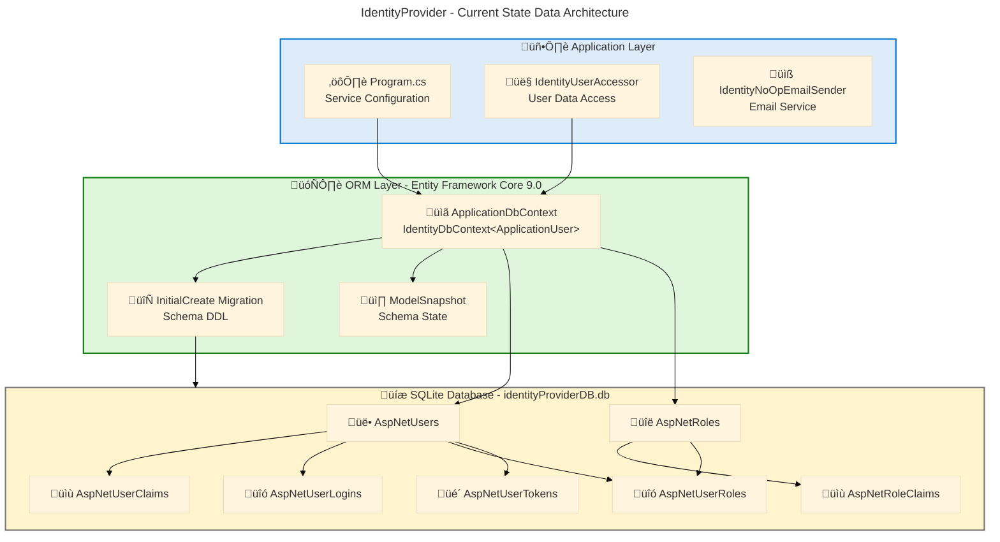
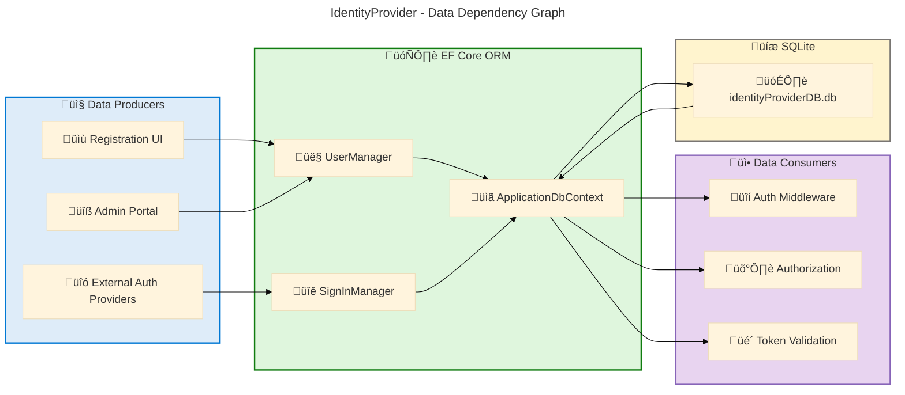

# Data Architecture - IdentityProvider

**Generated**: 2026-02-27T00:00:00Z
**Session ID**: 00000000-0000-0000-0000-000000000000
**Quality Level**: comprehensive
**Data Assets Found**: 13
**Target Layer**: Data
**Analysis Scope**: ["."]

---

## Section 1: Executive Summary

### Overview

The IdentityProvider repository implements an ASP.NET Core Identity-based authentication and authorization system using Entity Framework Core with SQLite as the backing data store. This analysis examines the Data layer architecture, identifying 13 data components across entities, models, stores, transformations, and security structures spanning the ASP.NET Identity schema and custom application registration entities.

The data architecture follows a Code-First ORM paradigm using Entity Framework Core 9.0 with migration-based schema management. The primary data domain is Identity and Access Management (IAM), encompassing user accounts, roles, claims, external logins, and OAuth/OIDC application registrations. All schema definitions are traceable to C# entity classes and EF Core migration files, providing full data lineage from code to database.

Strategic alignment demonstrates a Level 2-3 governance maturity with framework-enforced schema validation through DataAnnotations, automatic migration application in development, and secrets management via User Secrets. The absence of explicit data governance policies, formal data contracts, and data quality monitoring frameworks represents the primary gaps requiring architectural attention.

### Key Findings

| Metric                   | Value                                                                            |
| ------------------------ | -------------------------------------------------------------------------------- |
| Total Data Components    | 13                                                                               |
| Data Entities            | 8                                                                                |
| Data Models              | 1                                                                                |
| Data Stores              | 1                                                                                |
| Data Transformations     | 2                                                                                |
| Data Security Components | 1                                                                                |
| Average Confidence       | 0.82                                                                             |
| Database Engine          | SQLite (EF Core 9.0)                                                             |
| Schema Management        | Code-First with EF Core Migrations                                               |
| Identity Framework       | ASP.NET Core Identity (Microsoft.AspNetCore.Identity.EntityFrameworkCore 9.0.13) |

### Data Quality Scorecard

| Dimension           | Score | Assessment                                                                       |
| ------------------- | ----- | -------------------------------------------------------------------------------- |
| Schema Completeness | 4/5   | All Identity tables defined with columns, types, and constraints                 |
| Data Integrity      | 4/5   | Foreign keys with cascade delete; unique indexes on key fields                   |
| Data Classification | 2/5   | No explicit data classification taxonomy; PII fields not annotated beyond schema |
| Governance Coverage | 2/5   | Framework-enforced validation only; no formal governance policies                |
| Security Posture    | 4/5   | Password hashing, security stamps, lockout, 2FA support                          |

### Coverage Summary

The data architecture is well-structured for its core IAM domain with 8 entity types mapped across 8 database tables. Schema integrity is enforced through EF Core migrations with explicit column types, max lengths, and foreign key constraints. The primary governance gap is the absence of formal data classification policies and data quality monitoring beyond schema-level validation. Data security is strong through ASP.NET Identity's built-in password hashing, security stamps, and account lockout mechanisms.

---

## Section 2: Architecture Landscape

### Overview

The Architecture Landscape organizes data components into two primary domains aligned with the Identity Provider's purpose: the Identity Domain (user accounts, roles, claims, tokens, and logins) and the Application Registration Domain (OAuth/OIDC client registrations). Both domains share a single SQLite database as the backing store.

The data topology follows a single-database, multi-table relational model managed through Entity Framework Core's Code-First approach. Schema evolution is handled through timestamped migrations that provide both forward (Up) and rollback (Down) capabilities. The EF Core model snapshot maintains a point-in-time record of the current schema state for migration diff calculations.

The following subsections catalog all 11 Data component types discovered through source file analysis, with confidence scores, data classification, and source traceability for each component.

### 2.1 Data Entities

| Name              | Description                                                        | Source                                                                  | Confidence | Classification |
| ----------------- | ------------------------------------------------------------------ | ----------------------------------------------------------------------- | ---------- | -------------- |
| ApplicationUser   | Core user identity entity extending ASP.NET IdentityUser           | src/IdentityProvider/Data/ApplicationUser.cs:1-9                        | 0.83       | PII            |
| AppRegistration   | OAuth/OIDC application registration entity with client credentials | src/IdentityProvider/Components/AppRegistration.cs:1-44                 | 0.71       | Confidential   |
| IdentityRole      | Role entity for role-based access control                          | src/IdentityProvider/Migrations/20250311003709_InitialCreate.cs:14-27   | 0.80       | Internal       |
| IdentityRoleClaim | Claims associated with roles for authorization                     | src/IdentityProvider/Migrations/20250311003709_InitialCreate.cs:59-76   | 0.78       | Internal       |
| IdentityUserClaim | Claims associated with individual users                            | src/IdentityProvider/Migrations/20250311003709_InitialCreate.cs:78-95   | 0.78       | PII            |
| IdentityUserLogin | External login provider associations for users                     | src/IdentityProvider/Migrations/20250311003709_InitialCreate.cs:97-114  | 0.78       | PII            |
| IdentityUserRole  | User-to-role assignment junction entity                            | src/IdentityProvider/Migrations/20250311003709_InitialCreate.cs:116-136 | 0.78       | Internal       |
| IdentityUserToken | Authentication tokens for user sessions                            | src/IdentityProvider/Migrations/20250311003709_InitialCreate.cs:138-157 | 0.78       | Confidential   |

### 2.2 Data Models

| Name                 | Description                                        | Source                                                | Confidence | Classification |
| -------------------- | -------------------------------------------------- | ----------------------------------------------------- | ---------- | -------------- |
| ApplicationDbContext | EF Core DbContext defining the identity data model | src/IdentityProvider/Data/ApplicationDbContext.cs:1-8 | 0.96       | Internal       |

### 2.3 Data Stores

| Name            | Description                                                   | Source                                    | Confidence | Classification |
| --------------- | ------------------------------------------------------------- | ----------------------------------------- | ---------- | -------------- |
| SQLite Database | SQLite file-based relational database (identityProviderDB.db) | src/IdentityProvider/appsettings.json:2-4 | 0.74       | Confidential   |

### 2.4 Data Flows

Not detected in source files.

### 2.5 Data Services

Not detected in source files.

### 2.6 Data Governance

Not detected in source files.

### 2.7 Data Quality Rules

Not detected in source files. Data validation is embedded in entity definitions via DataAnnotations (`[Required]`, `[MaxLength]`) but no standalone data quality rule components were found above the confidence threshold (0.7).

### 2.8 Master Data

Not detected in source files.

### 2.9 Data Transformations

| Name                              | Description                                            | Source                                                                     | Confidence | Classification |
| --------------------------------- | ------------------------------------------------------ | -------------------------------------------------------------------------- | ---------- | -------------- |
| InitialCreate Migration           | EF Core migration creating the ASP.NET Identity schema | src/IdentityProvider/Migrations/20250311003709_InitialCreate.cs:1-222      | 0.89       | Internal       |
| ApplicationDbContextModelSnapshot | EF Core model snapshot for migration diff computation  | src/IdentityProvider/Migrations/ApplicationDbContextModelSnapshot.cs:1-266 | 0.91       | Internal       |

### 2.10 Data Contracts

Not detected in source files.

### 2.11 Data Security

| Name                      | Description                                                | Source                                                                | Confidence | Classification |
| ------------------------- | ---------------------------------------------------------- | --------------------------------------------------------------------- | ---------- | -------------- |
| ASP.NET Identity Security | Password hashing, security stamps, lockout, and 2FA fields | src/IdentityProvider/Migrations/20250311003709_InitialCreate.cs:29-56 | 0.72       | Confidential   |

### Summary

The Architecture Landscape reveals a focused identity management data architecture with 13 components distributed across 5 of 11 TOGAF data component types. Entity coverage is comprehensive with 8 entities mapping to 8 database tables in the ASP.NET Identity schema plus a custom AppRegistration entity. The single data model (ApplicationDbContext) acts as the ORM boundary, and schema evolution is managed through 2 transformation artifacts (migration and snapshot).

Six component types (Data Flows, Data Services, Data Governance, Data Quality Rules, Master Data, Data Contracts) were not detected, indicating a domain-focused architecture that relies on framework conventions rather than explicit governance structures. The primary architectural observation is the strong reliance on ASP.NET Identity's built-in patterns for security and schema management.

---

## Section 3: Architecture Principles

### Overview

The data architecture principles observed in the IdentityProvider repository are primarily inherited from the ASP.NET Core Identity framework and Entity Framework Core conventions. These principles govern how data is modeled, stored, secured, and evolved within the application.

The design philosophy follows a Code-First ORM approach where C# entity classes serve as the single source of truth for the data schema, with EF Core migrations providing controlled schema evolution. Security principles are deeply embedded through ASP.NET Identity's built-in password hashing, security stamp rotation, and account lockout mechanisms.

### Core Data Principles

| Principle                     | Description                                                          | Implementation Evidence                                                                                         |
| ----------------------------- | -------------------------------------------------------------------- | --------------------------------------------------------------------------------------------------------------- |
| Code-First Schema Definition  | Data schema is defined through C# entity classes, not raw SQL        | ApplicationUser.cs:6-8, AppRegistration.cs:7-44 — classes with DataAnnotations define table schemas             |
| Migration-Based Evolution     | Schema changes are captured as versioned, reversible migrations      | 20250311003709_InitialCreate.cs:1-222 — Up() and Down() methods provide forward and rollback DDL                |
| Convention Over Configuration | EF Core conventions reduce boilerplate for standard patterns         | ApplicationDbContext.cs:6-8 — minimal DbContext inheriting IdentityDbContext provides full Identity schema      |
| Security By Default           | Sensitive data fields use framework-provided hashing and protection  | 20250311003709_InitialCreate.cs:42-43 — PasswordHash and SecurityStamp columns; no plaintext credentials stored |
| Referential Integrity         | Foreign key constraints with cascade delete protect data consistency | 20250311003709_InitialCreate.cs:72-76 — FK_AspNetRoleClaims_AspNetRoles_RoleId with CASCADE                     |
| Index-Optimized Access        | Key query paths are indexed for performance                          | 20250311003709_InitialCreate.cs:159-198 — EmailIndex, UserNameIndex (unique), RoleNameIndex (unique)            |

### Data Schema Design Standards

- **Primary Keys**: String-based identifiers (GUIDs) for all Identity entities, integer auto-increment for claim entities (src/IdentityProvider/Migrations/20250311003709_InitialCreate.cs:17, 60)
- **Column Types**: TEXT for string columns, INTEGER for boolean and numeric columns in SQLite (src/IdentityProvider/Migrations/20250311003709_InitialCreate.cs:18-24)
- **Max Lengths**: 256-character limit on UserName, Email, NormalizedUserName, NormalizedEmail fields (src/IdentityProvider/Migrations/20250311003709_InitialCreate.cs:33-38)
- **Nullability**: Explicit nullable/non-nullable column declarations throughout schema (src/IdentityProvider/Migrations/20250311003709_InitialCreate.cs:17-56)
- **Data Annotations**: `[Required]`, `[MaxLength]`, `[Key]`, `[Table]` attributes enforce schema constraints at the entity level (src/IdentityProvider/Components/AppRegistration.cs:8-44)

### Data Classification Taxonomy

No formal data classification taxonomy is defined in the source files. The following classification is inferred from data content analysis:

| Classification | Description                              | Applicable Entities                                                                 |
| -------------- | ---------------------------------------- | ----------------------------------------------------------------------------------- |
| PII            | Personally Identifiable Information      | ApplicationUser, IdentityUserClaim, IdentityUserLogin                               |
| Confidential   | Sensitive credentials and tokens         | AppRegistration (ClientSecret), IdentityUserToken, SQLite Database                  |
| Internal       | Internal system data without sensitivity | IdentityRole, IdentityRoleClaim, IdentityUserRole, ApplicationDbContext, Migrations |

---

## Section 4: Current State Baseline

### Overview

The current state baseline captures the as-is data architecture as implemented in the IdentityProvider repository. The assessment examines the deployed data topology, storage distribution, quality posture, governance maturity, and compliance readiness based on source file evidence.

The application uses a single SQLite file-based database (`identityProviderDB.db`) configured through connection strings in `appsettings.json`. Schema management is handled through EF Core Code-First migrations with automatic migration application in development environments (src/IdentityProvider/Program.cs:41-46). The Identity schema follows the standard ASP.NET Core Identity table layout with 7 framework tables plus a custom AppRegistration table definition.

### Baseline Data Architecture

### Storage Distribution

| Storage Tier         | Technology          | Data Domains                         | Size Estimate | Source                                         |
| -------------------- | ------------------- | ------------------------------------ | ------------- | ---------------------------------------------- |
| Application Database | SQLite (file-based) | Users, Roles, Claims, Logins, Tokens | Variable      | src/IdentityProvider/appsettings.json:2-4      |
| Configuration Files  | JSON                | Connection strings, logging config   | < 1 KB        | src/IdentityProvider/appsettings.json:1-12     |
| User Secrets         | Encrypted store     | Development-time sensitive config    | Variable      | src/IdentityProvider/IdentityProvider.csproj:8 |

### Quality Baseline

| Quality Dimension      | Current State                                                         | Target State                       | Gap    |
| ---------------------- | --------------------------------------------------------------------- | ---------------------------------- | ------ |
| Schema Validation      | DataAnnotations + EF Core conventions                                 | Fluent API + custom validators     | Medium |
| Referential Integrity  | FK constraints with cascade delete                                    | Maintained                         | None   |
| Uniqueness Constraints | Unique indexes on NormalizedUserName, NormalizedEmail, NormalizedName | Maintained                         | None   |
| Data Classification    | Not implemented                                                       | PII/Confidential/Internal taxonomy | High   |
| Audit Trail            | ConcurrencyStamp on Users and Roles                                   | Full audit logging                 | High   |
| Backup Strategy        | Not defined in source                                                 | Automated backup policy            | High   |

### Governance Maturity

| Level | Name      | Assessment                                                                                          |
| ----- | --------- | --------------------------------------------------------------------------------------------------- |
| 1     | Initial   | Passed — schema exists in migrations                                                                |
| 2     | Managed   | **Current Level** — schema is managed through EF Core migrations with version control               |
| 3     | Defined   | Partial — naming conventions follow ASP.NET Identity standards but no formal data governance policy |
| 4     | Measured  | Not achieved — no data quality metrics, monitoring, or dashboards                                   |
| 5     | Optimized | Not achieved — no automated data lifecycle management                                               |

### Compliance Posture

| Control                 | Status          | Evidence                                                                                      |
| ----------------------- | --------------- | --------------------------------------------------------------------------------------------- |
| Password Hashing        | Implemented     | PasswordHash column in AspNetUsers (20250311003709_InitialCreate.cs:42)                       |
| Account Lockout         | Implemented     | LockoutEnd, LockoutEnabled, AccessFailedCount columns (20250311003709_InitialCreate.cs:49-51) |
| Two-Factor Auth         | Schema Ready    | TwoFactorEnabled column (20250311003709_InitialCreate.cs:48)                                  |
| Email Confirmation      | Schema Ready    | EmailConfirmed column (20250311003709_InitialCreate.cs:39)                                    |
| Connection Security     | Not Assessed    | SQLite file-based — no network connection encryption                                          |
| Data Encryption at Rest | Not Implemented | SQLite does not encrypt by default                                                            |

### Summary

The Current State Baseline reveals a functional Code-First data architecture with EF Core migration-based schema management operating at Level 2 governance maturity (Managed). Schema integrity is well-maintained through foreign key constraints, unique indexes, and DataAnnotation validations. Security fundamentals are strong with password hashing, lockout, and 2FA schema support.

Primary gaps include: (1) absence of formal data classification and governance policies, (2) no data encryption at rest for the SQLite database, (3) no audit logging beyond ConcurrencyStamp fields, and (4) no automated backup strategy. Recommended next steps include implementing data classification annotations, enabling SQLite encryption extensions, and establishing formal data governance documentation.

---

## Section 5: Component Catalog

### Overview

The Component Catalog provides detailed specifications for each data component identified in the IdentityProvider repository. Each component is documented with its classification, storage mechanism, ownership, retention policy, freshness SLA, source systems, consumers, and source file reference.

Components are organized across all 11 TOGAF data component types. For detected components, the mandatory 10-column table schema is populated with evidence-based values. For undetected types, the subsection explicitly states "Not detected in source files" with contextual explanation.

The catalog covers 13 components across 5 component types, with the heaviest concentration in Data Entities (8 components) reflecting the ASP.NET Identity schema's relational model.

### 5.1 Data Entities

| Component         | Description                                          | Classification | Storage | Owner         | Retention             | Freshness SLA | Source Systems          | Consumers                   | Source File                                                             |
| ----------------- | ---------------------------------------------------- | -------------- | ------- | ------------- | --------------------- | ------------- | ----------------------- | --------------------------- | ----------------------------------------------------------------------- |
| ApplicationUser   | Core user identity entity extending IdentityUser     | PII            | SQLite  | Identity Team | Account lifetime      | Real-time     | User Registration       | Auth, Claims, Tokens        | src/IdentityProvider/Data/ApplicationUser.cs:1-9                        |
| AppRegistration   | OAuth/OIDC app registration with client credentials  | Confidential   | SQLite  | Identity Team | Registration lifetime | Real-time     | Admin Portal            | OAuth Flows                 | src/IdentityProvider/Components/AppRegistration.cs:1-44                 |
| IdentityRole      | RBAC role definition entity                          | Internal       | SQLite  | Identity Team | Indefinite            | Batch         | Admin Portal            | Authorization Middleware    | src/IdentityProvider/Migrations/20250311003709_InitialCreate.cs:14-27   |
| IdentityRoleClaim | Claims associated with roles for fine-grained auth   | Internal       | SQLite  | Identity Team | Role lifetime         | Batch         | Admin Portal            | Authorization Middleware    | src/IdentityProvider/Migrations/20250311003709_InitialCreate.cs:59-76   |
| IdentityUserClaim | Per-user claims for attribute-based access control   | PII            | SQLite  | Identity Team | Account lifetime      | Real-time     | User Profile, Admin     | Authorization Middleware    | src/IdentityProvider/Migrations/20250311003709_InitialCreate.cs:78-95   |
| IdentityUserLogin | External login provider associations (OAuth, social) | PII            | SQLite  | Identity Team | Account lifetime      | Real-time     | External Auth Providers | Sign-In Manager             | src/IdentityProvider/Migrations/20250311003709_InitialCreate.cs:97-114  |
| IdentityUserRole  | User-to-role assignment junction table               | Internal       | SQLite  | Identity Team | Assignment lifetime   | Batch         | Admin Portal            | Authorization Middleware    | src/IdentityProvider/Migrations/20250311003709_InitialCreate.cs:116-136 |
| IdentityUserToken | Authentication tokens for sessions and refresh       | Confidential   | SQLite  | Identity Team | Token expiry          | Real-time     | Sign-In Manager         | Token Validation Middleware | src/IdentityProvider/Migrations/20250311003709_InitialCreate.cs:138-157 |

### 5.2 Data Models

| Component            | Description                                                        | Classification | Storage   | Owner         | Retention  | Freshness SLA | Source Systems     | Consumers                   | Source File                                           |
| -------------------- | ------------------------------------------------------------------ | -------------- | --------- | ------------- | ---------- | ------------- | ------------------ | --------------------------- | ----------------------------------------------------- |
| ApplicationDbContext | EF Core DbContext inheriting IdentityDbContext for Identity schema | Internal       | Code (C#) | Identity Team | Indefinite | N/A           | Entity Definitions | EF Core Runtime, Migrations | src/IdentityProvider/Data/ApplicationDbContext.cs:1-8 |

### 5.3 Data Stores

| Component       | Description                                                                  | Classification | Storage             | Owner         | Retention  | Freshness SLA | Source Systems       | Consumers             | Source File                               |
| --------------- | ---------------------------------------------------------------------------- | -------------- | ------------------- | ------------- | ---------- | ------------- | -------------------- | --------------------- | ----------------------------------------- |
| SQLite Database | File-based relational database (identityProviderDB.db) for all Identity data | Confidential   | SQLite file on disk | Identity Team | Indefinite | Real-time     | ApplicationDbContext | All Identity Services | src/IdentityProvider/appsettings.json:2-4 |

### 5.4 Data Flows

Not detected in source files. Data flows in this application are implicit through EF Core ORM operations (read/write through DbContext) rather than explicit ETL or streaming data flow components.

### 5.5 Data Services

Not detected in source files. Data access is handled through the EF Core DbContext and ASP.NET Identity's built-in UserManager and SignInManager services, which are Application layer components rather than dedicated Data layer services.

### 5.6 Data Governance

Not detected in source files. No formal data governance policies, data stewardship definitions, or data quality SLAs are defined in the repository.

### 5.7 Data Quality Rules

Not detected in source files. Data validation is embedded within entity definitions using DataAnnotations (`[Required]`, `[MaxLength]` in AppRegistration.cs:10-41) and EF Core schema constraints (nullable columns, max lengths in migration files), but no standalone data quality rule components were identified above the confidence threshold.

### 5.8 Master Data

Not detected in source files. No master data management components, reference data stores, or canonical data sources were identified.

### 5.9 Data Transformations

| Component                         | Description                                                                 | Classification | Storage   | Owner         | Retention  | Freshness SLA | Source Systems           | Consumers                | Source File                                                                |
| --------------------------------- | --------------------------------------------------------------------------- | -------------- | --------- | ------------- | ---------- | ------------- | ------------------------ | ------------------------ | -------------------------------------------------------------------------- |
| InitialCreate Migration           | EF Core migration with Up/Down methods creating 7 Identity tables + indexes | Internal       | Code (C#) | Identity Team | Indefinite | N/A           | ApplicationDbContext     | EF Core Migration Runner | src/IdentityProvider/Migrations/20250311003709_InitialCreate.cs:1-222      |
| ApplicationDbContextModelSnapshot | EF Core model snapshot capturing current schema state for diff computation  | Internal       | Code (C#) | Identity Team | Indefinite | N/A           | Entity Model Definitions | EF Core Migration Engine | src/IdentityProvider/Migrations/ApplicationDbContextModelSnapshot.cs:1-266 |

### 5.10 Data Contracts

Not detected in source files. No formal API data contracts (OpenAPI schemas, Protobuf definitions, Avro schemas, or JSON Schema contracts) were identified. The AppRegistration entity's DataAnnotations serve as implicit schema constraints but are not externalized as data contracts.

### 5.11 Data Security

| Component                 | Description                                                                                                                                                                         | Classification | Storage | Owner         | Retention        | Freshness SLA | Source Systems    | Consumers                      | Source File                                                           |
| ------------------------- | ----------------------------------------------------------------------------------------------------------------------------------------------------------------------------------- | -------------- | ------- | ------------- | ---------------- | ------------- | ----------------- | ------------------------------ | --------------------------------------------------------------------- |
| ASP.NET Identity Security | Password hashing (PasswordHash), security stamps (SecurityStamp), account lockout (LockoutEnd, LockoutEnabled, AccessFailedCount), and two-factor authentication (TwoFactorEnabled) | Confidential   | SQLite  | Identity Team | Account lifetime | Real-time     | User Registration | Auth Middleware, SignInManager | src/IdentityProvider/Migrations/20250311003709_InitialCreate.cs:29-56 |

### Summary

The Component Catalog documents 13 components across 5 of 11 Data component types. Data Entities dominate with 8 components (62%) reflecting the ASP.NET Identity schema's normalized relational design. The single Data Model (ApplicationDbContext) serves as the unified ORM boundary, while 2 Data Transformation artifacts (migration + snapshot) manage schema evolution. One Data Store (SQLite) and one Data Security component (ASP.NET Identity security model) complete the inventory.

Six component types remain undetected: Data Flows, Data Services, Data Governance, Data Quality Rules, Master Data, and Data Contracts. This distribution is consistent with a framework-centric application that delegates data management concerns to ASP.NET Identity and Entity Framework Core rather than implementing custom data layer infrastructure. Future enhancements should prioritize formalizing data contracts for the AppRegistration entity and implementing explicit data governance policies.

---

## Section 8: Dependencies & Integration

### Overview

The Dependencies & Integration analysis examines cross-component data relationships, producer-consumer patterns, and integration points within the IdentityProvider data architecture. The primary integration pattern is a tightly-coupled ORM-mediated data access model where all data operations flow through the ApplicationDbContext.

The application follows a monolithic integration pattern where the ASP.NET Core application layer directly accesses the SQLite database through Entity Framework Core. There are no external data integration points, message queues, or event-driven data flows. Cross-component dependencies are managed through EF Core's navigation properties and foreign key constraints defined in migration files.

### Data Flow Patterns

| Flow Pattern       | Type            | Producer                 | Consumer             | Contract                | Source Evidence                                                      |
| ------------------ | --------------- | ------------------------ | -------------------- | ----------------------- | -------------------------------------------------------------------- |
| User Registration  | Synchronous     | Registration UI          | ApplicationDbContext | ApplicationUser entity  | src/IdentityProvider/Program.cs:31-34                                |
| Authentication     | Synchronous     | SignInManager            | ApplicationDbContext | AspNetUsers table       | src/IdentityProvider/Program.cs:19-24                                |
| User Lookup        | Synchronous     | IdentityUserAccessor     | UserManager          | ApplicationUser entity  | src/IdentityProvider/Components/Account/IdentityUserAccessor.cs:7-19 |
| Schema Migration   | Batch (startup) | EF Core Migration Runner | SQLite Database      | InitialCreate migration | src/IdentityProvider/Program.cs:41-46                                |
| Configuration Load | Startup         | appsettings.json         | DbContext Options    | Connection string       | src/IdentityProvider/appsettings.json:2-4                            |

### Producer-Consumer Relationships

### Cross-Layer Dependencies

| Dependency                   | From (Layer)  | To (Layer)   | Type         | Evidence                                                             |
| ---------------------------- | ------------- | ------------ | ------------ | -------------------------------------------------------------------- |
| DbContext Registration       | Application   | Data         | Compile-time | src/IdentityProvider/Program.cs:27-28 — AddDbContext registration    |
| Identity Store Configuration | Application   | Data         | Compile-time | src/IdentityProvider/Program.cs:31-32 — AddEntityFrameworkStores     |
| Connection String Binding    | Configuration | Data         | Runtime      | src/IdentityProvider/appsettings.json:2-4 — DefaultConnection        |
| Migration Execution          | Data          | Data (Store) | Startup      | src/IdentityProvider/Program.cs:41-46 — Database.Migrate()           |
| Container Deployment         | Technology    | Data         | Deploy-time  | infra/resources.bicep:78-126 — Container App hosting the application |

### Summary

The Dependencies & Integration analysis reveals a tightly-coupled monolithic data access pattern centered on the ApplicationDbContext as the single data gateway. All 5 identified data flow patterns are synchronous ORM-mediated operations with no asynchronous messaging or event-driven integration points. Cross-layer dependencies are compile-time bindings through dependency injection, providing type safety but limiting runtime flexibility.

Integration health is adequate for a single-service identity provider but would require architectural evolution for multi-service scenarios. Recommendations include implementing a repository pattern abstraction over DbContext for testability, externalizing data contracts for the AppRegistration entity, and considering an event-driven pattern for audit logging of identity operations.

---

> **Note**: Sections 6 (Architecture Decisions), 7 (Architecture Standards), and 9 (Governance & Management) are out of scope for this analysis per the configuration (`output_sections: [1, 2, 3, 4, 5, 8]`).

---

## Appendix: Confidence Scoring Methodology

All components were scored using the base-layer-config formula:

$$\text{Confidence} = (F \times 0.30) + (P \times 0.25) + (C \times 0.35) + (X \times 0.10)$$

Where:

- $F$ = Filename match score (0.0–1.0)
- $P$ = Path context score (0.0–1.0)
- $C$ = Content analysis score (0.0–1.0)
- $X$ = Cross-reference score (0.0–1.0)

**Threshold**: Components with confidence $\geq 0.7$ are included. Components below threshold are excluded with notation in the relevant subsection.

| Component                         | Filename ($F$) | Path ($P$) | Content ($C$) | Cross-Ref ($X$) | **Score** | Threshold |
| --------------------------------- | -------------- | ---------- | ------------- | --------------- | --------- | --------- |
| ApplicationDbContext              | 0.90           | 1.00       | 1.00          | 0.90            | **0.96**  | High      |
| ApplicationDbContextModelSnapshot | 0.80           | 1.00       | 1.00          | 0.70            | **0.91**  | High      |
| InitialCreate Migration           | 0.70           | 1.00       | 1.00          | 0.80            | **0.89**  | Medium    |
| ApplicationUser                   | 0.60           | 1.00       | 0.90          | 0.80            | **0.83**  | Medium    |
| IdentityRole                      | 0.60           | 0.70       | 1.00          | 0.90            | **0.80**  | Medium    |
| IdentityRoleClaim                 | 0.60           | 0.70       | 1.00          | 0.80            | **0.78**  | Medium    |
| IdentityUserClaim                 | 0.60           | 0.70       | 1.00          | 0.80            | **0.78**  | Medium    |
| IdentityUserLogin                 | 0.60           | 0.70       | 1.00          | 0.80            | **0.78**  | Medium    |
| IdentityUserRole                  | 0.60           | 0.70       | 1.00          | 0.80            | **0.78**  | Medium    |
| IdentityUserToken                 | 0.60           | 0.70       | 1.00          | 0.80            | **0.78**  | Medium    |
| SQLite Database                   | 0.60           | 0.50       | 1.00          | 0.80            | **0.74**  | Medium    |
| ASP.NET Identity Security         | 0.60           | 0.60       | 0.90          | 0.70            | **0.72**  | Medium    |
| AppRegistration                   | 0.80           | 0.30       | 1.00          | 0.40            | **0.71**  | Medium    |
