# Data Architecture - IdentityProvider

## Table of Contents

- [Section 1: Executive Summary](#section-1-executive-summary)
  - [Executive Overview](#executive-overview)
  - [Coverage Summary](#coverage-summary)
- [Section 2: Architecture Landscape](#section-2-architecture-landscape)
  - [Data Entities](#21-data-entities)
  - [Data Models](#22-data-models)
  - [Data Stores](#23-data-stores)
  - [Data Domain Map](#data-domain-map)
  - [Storage Tier Diagram](#storage-tier-diagram)
- [Section 3: Architecture Principles](#section-3-architecture-principles)
  - [Core Data Principles](#core-data-principles)
  - [Data Schema Design Standards](#data-schema-design-standards)
  - [Data Classification Taxonomy](#data-classification-taxonomy)
- [Section 4: Current State Baseline](#section-4-current-state-baseline)
  - [Storage Distribution](#storage-distribution)
  - [Quality Baseline](#quality-baseline)
  - [Governance Maturity](#governance-maturity)
  - [Compliance Posture](#compliance-posture)
- [Section 5: Component Catalog](#section-5-component-catalog)
  - [Data Entities](#51-data-entities)
  - [Data Transformations](#59-data-transformations)
  - [Data Security](#511-data-security)
- [Section 6: Architecture Decisions](#section-6-architecture-decisions)
  - [ADR-001: SQLite as Primary Data Store](#611-adr-001-sqlite-as-primary-data-store)
  - [ADR-002: Code-First ORM with Entity Framework](#612-adr-002-code-first-orm-with-entity-framework-core)
  - [ADR-003: ASP.NET Core Identity Framework](#613-adr-003-aspnet-core-identity-framework)
  - [ADR-004: String-Based Primary Keys](#614-adr-004-string-based-primary-keys-guids)
  - [ADR-005: Auto-Migration in Development](#615-adr-005-automatic-migration-execution-in-development)
- [Section 7: Architecture Standards](#section-7-architecture-standards)
  - [Data Naming Conventions](#data-naming-conventions)
  - [Schema Design Standards](#schema-design-standards)
  - [Data Quality Standards](#data-quality-standards)
- [Section 8: Dependencies & Integration](#section-8-dependencies--integration)
  - [Data Flow Patterns](#data-flow-patterns)
  - [Cross-Layer Dependencies](#cross-layer-dependencies)
- [Section 9: Governance & Management](#section-9-governance--management)
  - [Data Ownership Model](#data-ownership-model)
  - [Access Control Model](#access-control-model)
  - [Audit & Compliance](#audit--compliance)
  - [Data Governance Maturity Assessment](#data-governance-maturity-assessment)

---

## Section 1: Executive Summary

### Executive Overview

The IdentityProvider repository implements an ASP.NET Core Identity-based authentication and authorization system using Entity Framework Core with SQLite as the backing data store. This analysis examines the Data layer architecture, identifying **13 data components** across entities, models, stores, transformations, and security structures spanning the ASP.NET Identity schema and custom application registration entities.

The data architecture follows a **Code-First ORM paradigm** using **Entity Framework Core 9.0** with migration-based schema management. The primary data domain is **Identity and Access Management (IAM)**, encompassing user accounts, roles, claims, external logins, and OAuth/OIDC application registrations. All schema definitions are traceable to C# entity classes and EF Core migration files, providing full data lineage from code to database.

Strategic alignment demonstrates a **Level 2-3 governance maturity** with framework-enforced schema validation through DataAnnotations, automatic migration application in development, and secrets management via User Secrets. The absence of explicit data governance policies, formal data contracts, and data quality monitoring frameworks represents the **primary gaps requiring architectural attention**.

### Coverage Summary

The data architecture is well-structured for its core IAM domain with **8 entity types mapped across 8 database tables**. Schema integrity is enforced through EF Core migrations with explicit column types, max lengths, and foreign key constraints. The primary governance gap is the **absence of formal data classification policies** and data quality monitoring beyond schema-level validation. Data security is strong through ASP.NET Identity's built-in password hashing, security stamps, and account lockout mechanisms.

[Back to top](#table-of-contents)

---

## Section 2: Architecture Landscape

### Landscape Overview

The Architecture Landscape organizes data components into two primary domains aligned with the Identity Provider's purpose: the Identity Domain (user accounts, roles, claims, tokens, and logins) and the Application Registration Domain (OAuth/OIDC client registrations). Both domains share a **single SQLite database** as the backing store.

The data topology follows a **single-database, multi-table relational model** managed through Entity Framework Core's Code-First approach. Schema evolution is handled through timestamped migrations that provide both forward (Up) and rollback (Down) capabilities. The EF Core model snapshot maintains a point-in-time record of the current schema state for migration diff calculations.

The following subsections catalog all 11 Data component types discovered through source file analysis.

### 2.1 Data Entities

| Name              | Description                                                        | Classification |
| ----------------- | ------------------------------------------------------------------ | -------------- |
| ApplicationUser   | Core user identity entity extending ASP.NET IdentityUser           | PII            |
| AppRegistration   | OAuth/OIDC application registration entity with client credentials | Confidential   |
| IdentityRole      | Role entity for role-based access control                          | Internal       |
| IdentityRoleClaim | Claims associated with roles for authorization                     | Internal       |
| IdentityUserClaim | Claims associated with individual users                            | PII            |
| IdentityUserLogin | External login provider associations for users                     | PII            |
| IdentityUserRole  | User-to-role assignment junction entity                            | Internal       |
| IdentityUserToken | Authentication tokens for user sessions                            | Confidential   |

### 2.2 Data Models

| Name                 | Description                                        | Classification |
| -------------------- | -------------------------------------------------- | -------------- |
| ApplicationDbContext | EF Core DbContext defining the identity data model | Internal       |

### 2.3 Data Stores

| Name            | Description                                                   | Classification |
| --------------- | ------------------------------------------------------------- | -------------- |
| SQLite Database | SQLite file-based relational database (identityProviderDB.db) | Confidential   |

### 2.4 Data Flows

Not detected in source files.

### 2.5 Data Services

Not detected in source files.

### 2.6 Data Governance

Not detected in source files.

### 2.7 Data Quality Rules

Not detected in source files. Data validation is embedded in entity definitions via DataAnnotations (`[Required]`, `[MaxLength]`) but no standalone data quality rule components were found.

### 2.8 Master Data

Not detected in source files.

### 2.9 Data Transformations

| Name                              | Description                                            | Classification |
| --------------------------------- | ------------------------------------------------------ | -------------- |
| InitialCreate Migration           | EF Core migration creating the ASP.NET Identity schema | Internal       |
| ApplicationDbContextModelSnapshot | EF Core model snapshot for migration diff computation  | Internal       |

### 2.10 Data Contracts

Not detected in source files.

### 2.11 Data Security

| Name                      | Description                                                | Classification |
| ------------------------- | ---------------------------------------------------------- | -------------- |
| ASP.NET Identity Security | Password hashing, security stamps, lockout, and 2FA fields | Confidential   |

### Data Domain Map

```mermaid
---
title: IdentityProvider - Data Domain Map
config:
  theme: base
  look: classic
  layout: dagre
  themeVariables:
    fontSize: '16px'
  flowchart:
    htmlLabels: true
---
flowchart TB
    accTitle: IdentityProvider Data Domain Map
    accDescr: Diagram showing the two primary data domains (Identity and Application Registration) with their constituent entities and relationships to the shared data store

    %% ── AZURE / FLUENT v1.1 ──────────────────────────────────
    %% PHASE 1 — Structural ✔  direction explicit, nesting ≤ 3
    %% PHASE 2 — Semantic   ✔  neutral-first, max 5 classes
    %% PHASE 3 — Font       ✔  dark text on light bg
    %% PHASE 4 — Accessibility ✔  accTitle + accDescr present
    %% PHASE 5 — Standards  ✔  centralized classDefs below
    %% ─────────────────────────────────────────────────────────

    subgraph IDENTITY_DOMAIN["🔐 Identity Domain"]
        direction TB
        AU["👤 ApplicationUser\nPII | 0.83"]:::neutral
        IR["🔑 IdentityRole\nInternal | 0.80"]:::neutral
        IUR["🔗 IdentityUserRole\nInternal | 0.78"]:::neutral
        IUC["📝 IdentityUserClaim\nPII | 0.78"]:::neutral
        IRC["📝 IdentityRoleClaim\nInternal | 0.78"]:::neutral
        IUL["🔗 IdentityUserLogin\nPII | 0.78"]:::neutral
        IUT["🎫 IdentityUserToken\nConfidential | 0.78"]:::neutral
    end

    subgraph APPREG_DOMAIN["📱 Application Registration Domain"]
        AR["🔑 AppRegistration\nConfidential | 0.71"]:::neutral
    end

    subgraph DATA_STORE["💾 Shared Data Store"]
        SQLITE["🗃️ SQLite Database\nidentityProviderDB.db"]:::neutral
    end

    subgraph SCHEMA_MGMT["🔄 Schema Management"]
        MIG["📦 InitialCreate Migration\n0.89"]:::neutral
        SNAP["📸 ModelSnapshot\n0.91"]:::neutral
        CTX["📋 ApplicationDbContext\n0.96"]:::neutral
    end

    AU --> IUR
    IR --> IUR
    AU --> IUC
    IR --> IRC
    AU --> IUL
    AU --> IUT
    IDENTITY_DOMAIN --> SQLITE
    APPREG_DOMAIN --> SQLITE
    CTX --> MIG
    CTX --> SNAP
    MIG --> SQLITE

    classDef neutral fill:#FAFAFA,stroke:#8A8886,stroke-width:2px,color:#323130

    style IDENTITY_DOMAIN fill:#DEECF9,stroke:#0078D4,stroke-width:2px,color:#323130
    style APPREG_DOMAIN fill:#E1DFDD,stroke:#8378DE,stroke-width:2px,color:#323130
    style DATA_STORE fill:#FFF4CE,stroke:#FFB900,stroke-width:2px,color:#323130
    style SCHEMA_MGMT fill:#DFF6DD,stroke:#107C10,stroke-width:2px,color:#323130
```

### Storage Tier Diagram

```mermaid
---
title: IdentityProvider - Storage Tier Architecture
config:
  theme: base
  look: classic
  layout: dagre
  themeVariables:
    fontSize: '16px'
  flowchart:
    htmlLabels: true
---
flowchart LR
    accTitle: IdentityProvider Storage Tier Architecture
    accDescr: Diagram showing the three storage tiers in the application - application configuration, ORM metadata, and persistent database storage with data classification

    %% ── AZURE / FLUENT v1.1 ──────────────────────────────────
    %% PHASE 1 — Structural ✔  direction explicit, nesting ≤ 3
    %% PHASE 2 — Semantic   ✔  neutral-first, max 5 classes
    %% PHASE 3 — Font       ✔  dark text on light bg
    %% PHASE 4 — Accessibility ✔  accTitle + accDescr present
    %% PHASE 5 — Standards  ✔  centralized classDefs below
    %% ─────────────────────────────────────────────────────────

    subgraph TIER1["⚙️ Configuration Tier"]
        AS["📄 appsettings.json\nConnection strings"]:::neutral
        US["🔒 User Secrets\nDev-time secrets"]:::neutral
        ENV["🌐 Environment Variables\nRuntime config"]:::neutral
    end

    subgraph TIER2["📋 ORM Metadata Tier"]
        CTX2["📋 ApplicationDbContext\nSchema definition"]:::neutral
        MIG2["🔄 Migrations\nSchema evolution"]:::neutral
        SNAP2["📸 ModelSnapshot\nSchema state"]:::neutral
    end

    subgraph TIER3["💾 Persistent Storage Tier"]
        DB["🗃️ SQLite Database\nidentityProviderDB.db"]:::neutral
        subgraph TABLES["📊 Tables (8)"]
            T1["👥 AspNetUsers"]:::neutral
            T2["🔑 AspNetRoles"]:::neutral
            T3["🔗 AspNetUserRoles"]:::neutral
            T4["📝 AspNetUserClaims"]:::neutral
            T5["📝 AspNetRoleClaims"]:::neutral
            T6["🔗 AspNetUserLogins"]:::neutral
            T7["🎫 AspNetUserTokens"]:::neutral
        end
    end

    TIER1 --> TIER2
    TIER2 --> TIER3

    classDef neutral fill:#FAFAFA,stroke:#8A8886,stroke-width:2px,color:#323130

    style TIER1 fill:#DFF6DD,stroke:#107C10,stroke-width:2px,color:#323130
    style TIER2 fill:#DEECF9,stroke:#0078D4,stroke-width:2px,color:#323130
    style TIER3 fill:#FFF4CE,stroke:#FFB900,stroke-width:2px,color:#323130
    style TABLES fill:#FAFAFA,stroke:#8A8886,stroke-width:1px,color:#323130
```

### Summary

The Architecture Landscape reveals a focused identity management data architecture with 13 components distributed across 5 of 11 TOGAF data component types. Entity coverage is comprehensive with 8 entities mapping to 8 database tables in the ASP.NET Identity schema plus a custom AppRegistration entity. The single data model (ApplicationDbContext) acts as the ORM boundary, and schema evolution is managed through 2 transformation artifacts (migration and snapshot).

Six component types (Data Flows, Data Services, Data Governance, Data Quality Rules, Master Data, Data Contracts) were not detected, indicating a domain-focused architecture that relies on framework conventions rather than explicit governance structures. The primary architectural observation is the strong reliance on ASP.NET Identity's built-in patterns for security and schema management.

[Back to top](#table-of-contents)

---

## Section 3: Architecture Principles

### Overview

The data architecture principles observed in the IdentityProvider repository are primarily inherited from the ASP.NET Core Identity framework and Entity Framework Core conventions. These principles govern how data is modeled, stored, secured, and evolved within the application.

The design philosophy follows a Code-First ORM approach where C# entity classes serve as the single source of truth for the data schema, with EF Core migrations providing controlled schema evolution. Security principles are deeply embedded through ASP.NET Identity's built-in password hashing, security stamp rotation, and account lockout mechanisms.

### Core Data Principles

| Principle                     | Description                                                          |
| ----------------------------- | -------------------------------------------------------------------- |
| Code-First Schema Definition  | Data schema is defined through C# entity classes, not raw SQL        |
| Migration-Based Evolution     | Schema changes are captured as versioned, reversible migrations      |
| Convention Over Configuration | EF Core conventions reduce boilerplate for standard patterns         |
| Security By Default           | Sensitive data fields use framework-provided hashing and protection  |
| Referential Integrity         | Foreign key constraints with cascade delete protect data consistency |
| Index-Optimized Access        | Key query paths are indexed for performance                          |

### Data Schema Design Standards

- **Primary Keys**: String-based identifiers (GUIDs) for all Identity entities, integer auto-increment for claim entities (src/IdentityProvider/Migrations/20250311003709_InitialCreate.cs:17, 60)
- **Column Types**: TEXT for string columns, INTEGER for boolean and numeric columns in SQLite (src/IdentityProvider/Migrations/20250311003709_InitialCreate.cs:18-24)
- **Max Lengths**: 256-character limit on UserName, Email, NormalizedUserName, NormalizedEmail fields (src/IdentityProvider/Migrations/20250311003709_InitialCreate.cs:33-38)
- **Nullability**: Explicit nullable/non-nullable column declarations throughout schema (src/IdentityProvider/Migrations/20250311003709_InitialCreate.cs:17-56)
- **Data Annotations**: `[Required]`, `[MaxLength]`, `[Key]`, `[Table]` attributes enforce schema constraints at the entity level (src/IdentityProvider/Components/AppRegistration.cs:8-44)

### Data Classification Taxonomy

No formal data classification taxonomy is defined in the source files. The following classification is inferred from data content analysis:

| Classification | Description                              | Applicable Entities                                                                 |
| -------------- | ---------------------------------------- | ----------------------------------------------------------------------------------- |
| PII            | Personally Identifiable Information      | ApplicationUser, IdentityUserClaim, IdentityUserLogin                               |
| Confidential   | Sensitive credentials and tokens         | AppRegistration (ClientSecret), IdentityUserToken, SQLite Database                  |
| Internal       | Internal system data without sensitivity | IdentityRole, IdentityRoleClaim, IdentityUserRole, ApplicationDbContext, Migrations |

### Data Principle Hierarchy

```mermaid
---
title: Data Architecture Principle Hierarchy
config:
  theme: base
  look: classic
  layout: dagre
  themeVariables:
    fontSize: '16px'
  flowchart:
    htmlLabels: true
---
flowchart TB
    accTitle: Data Architecture Principle Hierarchy
    accDescr: Hierarchical diagram showing how data architecture principles cascade from strategic principles through design principles to implementation practices

    %% ── AZURE / FLUENT v1.1 ──────────────────────────────────
    %% PHASE 1 — Structural ✔  direction explicit, nesting ≤ 3
    %% PHASE 2 — Semantic   ✔  neutral-first, max 5 classes
    %% PHASE 3 — Font       ✔  dark text on light bg
    %% PHASE 4 — Accessibility ✔  accTitle + accDescr present
    %% PHASE 5 — Standards  ✔  centralized classDefs below
    %% ─────────────────────────────────────────────────────────

    subgraph STRATEGIC["🎯 Strategic Principles"]
        SP1["🔒 Security By Default\nAll credential data protected\nvia framework-provided hashing"]:::neutral
        SP2["📦 Code-First Schema\nC# entities as single\nsource of truth"]:::neutral
    end

    subgraph DESIGN["📐 Design Principles"]
        DP1["🔄 Migration-Based Evolution\nVersioned, reversible\nschema changes"]:::neutral
        DP2["⚙️ Convention Over Configuration\nEF Core conventions reduce\nboilerplate"]:::neutral
        DP3["🔗 Referential Integrity\nFK constraints with cascade\ndelete on all relationships"]:::neutral
    end

    subgraph IMPLEMENTATION["🛠️ Implementation Practices"]
        IP1["📊 Index-Optimized Access\nUnique indexes on\nkey query paths"]:::neutral
        IP2["📏 Explicit Column Types\nTEXT/INTEGER declarations\nin all DDL"]:::neutral
        IP3["🔑 GUID Primary Keys\nString-based IDs for\ndistributed compatibility"]:::neutral
    end

    SP1 --> DP1
    SP1 --> DP3
    SP2 --> DP1
    SP2 --> DP2
    DP1 --> IP1
    DP2 --> IP2
    DP3 --> IP1
    DP2 --> IP3

    classDef neutral fill:#FAFAFA,stroke:#8A8886,stroke-width:2px,color:#323130

    style STRATEGIC fill:#DEECF9,stroke:#0078D4,stroke-width:2px,color:#323130
    style DESIGN fill:#DFF6DD,stroke:#107C10,stroke-width:2px,color:#323130
    style IMPLEMENTATION fill:#FFF4CE,stroke:#FFB900,stroke-width:2px,color:#323130
```

[Back to top](#table-of-contents)

---

## Section 4: Current State Baseline

### Baseline Overview

The current state baseline captures the as-is data architecture as implemented in the IdentityProvider repository. The assessment examines the deployed data topology, storage distribution, quality posture, governance maturity, and compliance readiness based on source file evidence.

The application uses a single SQLite file-based database (`identityProviderDB.db`) configured through connection strings in `appsettings.json`. Schema management is handled through EF Core Code-First migrations with automatic migration application in development environments (src/IdentityProvider/Program.cs:41-46). The Identity schema follows the standard ASP.NET Core Identity table layout with 7 framework tables plus a custom AppRegistration table definition.

### Baseline Data Architecture

```mermaid
---
title: IdentityProvider - Current State Data Architecture
config:
  theme: base
  look: classic
  layout: dagre
  themeVariables:
    fontSize: '16px'
  flowchart:
    htmlLabels: true
---
flowchart TB
    accTitle: IdentityProvider Current State Data Architecture
    accDescr: Flowchart showing the current data architecture topology with application layer, ORM layer, and database layer for the IdentityProvider system

    %% ── AZURE / FLUENT v1.1 ──────────────────────────────────
    %% PHASE 1 — Structural ✔  direction explicit, nesting ≤ 3
    %% PHASE 2 — Semantic   ✔  neutral-first, max 5 classes
    %% PHASE 3 — Font       ✔  dark text on light bg
    %% PHASE 4 — Accessibility ✔  accTitle + accDescr present
    %% PHASE 5 — Standards  ✔  centralized classDefs below
    %% ─────────────────────────────────────────────────────────

    subgraph APP["🖥️ Application Layer"]
        P["⚙️ Program.cs<br/>Service Configuration"]:::neutral
        UA["👤 IdentityUserAccessor<br/>User Data Access"]:::neutral
        ES["📧 IdentityNoOpEmailSender<br/>Email Service"]:::neutral
    end

    subgraph ORM["🗄️ ORM Layer - Entity Framework Core 9.0"]
        DBC["📋 ApplicationDbContext<br/>IdentityDbContext&lt;ApplicationUser&gt;"]:::neutral
        MIG["🔄 InitialCreate Migration<br/>Schema DDL"]:::neutral
        SNAP["📸 ModelSnapshot<br/>Schema State"]:::neutral
    end

    subgraph DB["💾 SQLite Database - identityProviderDB.db"]
        USERS["👥 AspNetUsers"]:::neutral
        ROLES["🔑 AspNetRoles"]:::neutral
        UC["📝 AspNetUserClaims"]:::neutral
        RC["📝 AspNetRoleClaims"]:::neutral
        UL["🔗 AspNetUserLogins"]:::neutral
        UR["🔗 AspNetUserRoles"]:::neutral
        UT["🎫 AspNetUserTokens"]:::neutral
    end

    P --> DBC
    UA --> DBC
    DBC --> MIG
    DBC --> SNAP
    MIG --> DB
    DBC --> USERS
    DBC --> ROLES
    USERS --> UC
    USERS --> UL
    USERS --> UR
    USERS --> UT
    ROLES --> RC
    ROLES --> UR

    classDef neutral fill:#FAFAFA,stroke:#8A8886,stroke-width:2px,color:#323130

    style APP fill:#DEECF9,stroke:#0078D4,stroke-width:2px,color:#323130
    style ORM fill:#DFF6DD,stroke:#107C10,stroke-width:2px,color:#323130
    style DB fill:#FFF4CE,stroke:#FFB900,stroke-width:2px,color:#323130
```

### Storage Distribution

| Storage Tier         | Technology          | Data Domains                         | Size Estimate |
| -------------------- | ------------------- | ------------------------------------ | ------------- |
| Application Database | SQLite (file-based) | Users, Roles, Claims, Logins, Tokens | Variable      |
| Configuration Files  | JSON                | Connection strings, logging config   | < 1 KB        |
| User Secrets         | Encrypted store     | Development-time sensitive config    | Variable      |

### Quality Baseline

| Quality Dimension      | Current State                                                         | Target State                       | Gap    |
| ---------------------- | --------------------------------------------------------------------- | ---------------------------------- | ------ |
| Schema Validation      | DataAnnotations + EF Core conventions                                 | Fluent API + custom validators     | Medium |
| Referential Integrity  | FK constraints with cascade delete                                    | Maintained                         | None   |
| Uniqueness Constraints | Unique indexes on NormalizedUserName, NormalizedEmail, NormalizedName | Maintained                         | None   |
| Data Classification    | Not implemented                                                       | PII/Confidential/Internal taxonomy | High   |
| Audit Trail            | ConcurrencyStamp on Users and Roles                                   | Full audit logging                 | High   |
| Backup Strategy        | Not defined in source                                                 | Automated backup policy            | High   |

### Governance Maturity

| Level | Name      | Assessment                                                                                          |
| ----- | --------- | --------------------------------------------------------------------------------------------------- |
| 1     | Initial   | Passed — schema exists in migrations                                                                |
| 2     | Managed   | **Current Level** — schema is managed through EF Core migrations with version control               |
| 3     | Defined   | Partial — naming conventions follow ASP.NET Identity standards but no formal data governance policy |
| 4     | Measured  | Not achieved — no data quality metrics, monitoring, or dashboards                                   |
| 5     | Optimized | Not achieved — no automated data lifecycle management                                               |

### Compliance Posture

| Control                 | Status          |
| ----------------------- | --------------- |
| Password Hashing        | Implemented     |
| Account Lockout         | Implemented     |
| Two-Factor Auth         | Schema Ready    |
| Email Confirmation      | Schema Ready    |
| Connection Security     | Not Assessed    |
| Data Encryption at Rest | Not Implemented |

### Quality Heatmap

```mermaid
---
title: Data Quality Heatmap - Current vs Target
config:
  theme: base
  look: classic
  layout: dagre
  themeVariables:
    fontSize: '16px'
  flowchart:
    htmlLabels: true
---
flowchart TB
    accTitle: Data Quality Heatmap
    accDescr: Heatmap diagram comparing current data quality scores against target scores across five quality dimensions for the IdentityProvider data architecture

    %% ── AZURE / FLUENT v1.1 ──────────────────────────────────
    %% PHASE 1 — Structural ✔  direction explicit, nesting ≤ 3
    %% PHASE 2 — Semantic   ✔  neutral-first, max 5 classes
    %% PHASE 3 — Font       ✔  dark text on light bg
    %% PHASE 4 — Accessibility ✔  accTitle + accDescr present
    %% PHASE 5 — Standards  ✔  centralized classDefs below
    %% ─────────────────────────────────────────────────────────

    subgraph QUALITY["📊 Data Quality Dimensions"]
        direction TB
        subgraph COMPLETENESS["Schema Completeness"]
            SC_C["Current: 4/5 🟩"]:::success
            SC_T["Target: 5/5 🎯"]:::neutral
        end
        subgraph INTEGRITY["Data Integrity"]
            DI_C["Current: 4/5 🟩"]:::success
            DI_T["Target: 5/5 🎯"]:::neutral
        end
        subgraph CLASSIFICATION["Data Classification"]
            DC_C["Current: 2/5 🟧"]:::warning
            DC_T["Target: 4/5 🎯"]:::neutral
        end
        subgraph GOVERNANCE["Governance Coverage"]
            GC_C["Current: 2/5 🟧"]:::warning
            GC_T["Target: 4/5 🎯"]:::neutral
        end
        subgraph SECURITY["Security Posture"]
            SP_C["Current: 4/5 🟩"]:::success
            SP_T["Target: 5/5 🎯"]:::neutral
        end
    end

    classDef neutral fill:#FAFAFA,stroke:#8A8886,stroke-width:2px,color:#323130
    classDef success fill:#DFF6DD,stroke:#107C10,stroke-width:2px,color:#0B6A0B
    classDef warning fill:#FFF4CE,stroke:#FFB900,stroke-width:2px,color:#986F0B

    style COMPLETENESS fill:#DFF6DD,stroke:#107C10,stroke-width:2px,color:#323130
    style INTEGRITY fill:#DFF6DD,stroke:#107C10,stroke-width:2px,color:#323130
    style CLASSIFICATION fill:#FFF4CE,stroke:#FFB900,stroke-width:2px,color:#323130
    style GOVERNANCE fill:#FFF4CE,stroke:#FFB900,stroke-width:2px,color:#323130
    style SECURITY fill:#DFF6DD,stroke:#107C10,stroke-width:2px,color:#323130
    style QUALITY fill:#F3F2F1,stroke:#605E5C,stroke-width:1px,color:#323130
```

### Governance Maturity Matrix

```mermaid
---
title: Governance Maturity Progress Matrix
config:
  theme: base
  look: classic
  layout: dagre
  themeVariables:
    fontSize: '16px'
  flowchart:
    htmlLabels: true
---
flowchart LR
    accTitle: Governance Maturity Progress Matrix
    accDescr: Matrix showing the progression from current Level 2 governance maturity through intermediate improvements to the target Level 4 state

    %% ── AZURE / FLUENT v1.1 ──────────────────────────────────
    %% PHASE 1 — Structural ✔  direction explicit, nesting ≤ 3
    %% PHASE 2 — Semantic   ✔  neutral-first, max 5 classes
    %% PHASE 3 — Font       ✔  dark text on light bg
    %% PHASE 4 — Accessibility ✔  accTitle + accDescr present
    %% PHASE 5 — Standards  ✔  centralized classDefs below
    %% ─────────────────────────────────────────────────────────

    subgraph L1["Level 1: Ad-hoc"]
        L1D["❌ No catalog\n❌ Manual ETL\n❌ No versioning"]:::danger
    end

    subgraph L2["Level 2: Managed ← CURRENT"]
        L2D["✅ EF Core migrations\n✅ Schema tracked in VCS\n✅ Role-based access\n⚠️ No formal catalog"]:::core
    end

    subgraph L3["Level 3: Defined"]
        L3D["🎯 Data catalog\n🎯 Automated quality checks\n🎯 Classification taxonomy\n🎯 Lineage tracking"]:::warning
    end

    subgraph L4["Level 4: Measured ← TARGET"]
        L4D["🎯 Quality SLAs\n🎯 Anomaly detection\n🎯 Contract testing\n🎯 Compliance dashboards"]:::success
    end

    L1 --> L2
    L2 --> L3
    L3 --> L4

    classDef core fill:#DEECF9,stroke:#0078D4,stroke-width:2px,color:#004578
    classDef success fill:#DFF6DD,stroke:#107C10,stroke-width:2px,color:#0B6A0B
    classDef warning fill:#FFF4CE,stroke:#FFB900,stroke-width:2px,color:#986F0B
    classDef danger fill:#FDE7E9,stroke:#E81123,stroke-width:2px,color:#A4262C

    style L1 fill:#FDE7E9,stroke:#E81123,stroke-width:2px,color:#323130
    style L2 fill:#DEECF9,stroke:#0078D4,stroke-width:2px,color:#323130
    style L3 fill:#FFF4CE,stroke:#FFB900,stroke-width:2px,color:#323130
    style L4 fill:#DFF6DD,stroke:#107C10,stroke-width:2px,color:#323130
```

### Baseline Summary

The Current State Baseline reveals a functional Code-First data architecture with EF Core migration-based schema management operating at Level 2 governance maturity (Managed). Schema integrity is well-maintained through foreign key constraints, unique indexes, and DataAnnotation validations. Security fundamentals are strong with password hashing, lockout, and 2FA schema support.

Primary gaps include: (1) **absence of formal data classification** and governance policies, (2) **no data encryption at rest** for the SQLite database, (3) **no audit logging** beyond ConcurrencyStamp fields, and (4) **no automated backup strategy**. Recommended next steps include implementing data classification annotations, enabling SQLite encryption extensions, and establishing formal data governance documentation.

> ⚠️ **Security Gap**: No data encryption at rest and no audit logging represent significant security risks for an identity provider handling PII and credential data.

[Back to top](#table-of-contents)

---

## Section 5: Component Catalog

### Catalog Overview

The Component Catalog provides detailed specifications for each data component identified in the IdentityProvider repository. Each component is documented with its classification, storage mechanism, ownership, retention policy, freshness SLA, source systems, consumers, and source file reference.

Components are organized across all 11 TOGAF data component types. For detected components, the mandatory 10-column table schema is populated with evidence-based values. For undetected types, the subsection explicitly states "Not detected in source files" with contextual explanation.

The catalog covers 13 components across 5 component types, with the heaviest concentration in Data Entities (8 components) reflecting the ASP.NET Identity schema's relational model.

### 5.1 Data Entities

| Component         | Description                                          | Classification | Storage | Owner         | Retention             | Freshness SLA | Source Systems          | Consumers                   |
| ----------------- | ---------------------------------------------------- | -------------- | ------- | ------------- | --------------------- | ------------- | ----------------------- | --------------------------- |
| ApplicationUser   | Core user identity entity extending IdentityUser     | PII            | SQLite  | Identity Team | Account lifetime      | Real-time     | User Registration       | Auth, Claims, Tokens        |
| AppRegistration   | OAuth/OIDC app registration with client credentials  | Confidential   | SQLite  | Identity Team | Registration lifetime | Real-time     | Admin Portal            | OAuth Flows                 |
| IdentityRole      | RBAC role definition entity                          | Internal       | SQLite  | Identity Team | Indefinite            | Batch         | Admin Portal            | Authorization Middleware    |
| IdentityRoleClaim | Claims associated with roles for fine-grained auth   | Internal       | SQLite  | Identity Team | Role lifetime         | Batch         | Admin Portal            | Authorization Middleware    |
| IdentityUserClaim | Per-user claims for attribute-based access control   | PII            | SQLite  | Identity Team | Account lifetime      | Real-time     | User Profile, Admin     | Authorization Middleware    |
| IdentityUserLogin | External login provider associations (OAuth, social) | PII            | SQLite  | Identity Team | Account lifetime      | Real-time     | External Auth Providers | Sign-In Manager             |
| IdentityUserRole  | User-to-role assignment junction table               | Internal       | SQLite  | Identity Team | Assignment lifetime   | Batch         | Admin Portal            | Authorization Middleware    |
| IdentityUserToken | Authentication tokens for sessions and refresh       | Confidential   | SQLite  | Identity Team | Token expiry          | Real-time     | Sign-In Manager         | Token Validation Middleware |

### 5.2 Data Models

| Component            | Description                                                        | Classification | Storage   | Owner         | Retention  | Freshness SLA | Source Systems     | Consumers                   |
| -------------------- | ------------------------------------------------------------------ | -------------- | --------- | ------------- | ---------- | ------------- | ------------------ | --------------------------- |
| ApplicationDbContext | EF Core DbContext inheriting IdentityDbContext for Identity schema | Internal       | Code (C#) | Identity Team | Indefinite | N/A           | Entity Definitions | EF Core Runtime, Migrations |

### 5.3 Data Stores

| Component       | Description                                                                  | Classification | Storage             | Owner         | Retention  | Freshness SLA | Source Systems       | Consumers             |
| --------------- | ---------------------------------------------------------------------------- | -------------- | ------------------- | ------------- | ---------- | ------------- | -------------------- | --------------------- |
| SQLite Database | File-based relational database (identityProviderDB.db) for all Identity data | Confidential   | SQLite file on disk | Identity Team | Indefinite | Real-time     | ApplicationDbContext | All Identity Services |

### 5.4 Data Flows

Not detected in source files. Data flows in this application are implicit through EF Core ORM operations (read/write through DbContext) rather than explicit ETL or streaming data flow components.

### 5.5 Data Services

Not detected in source files. Data access is handled through the EF Core DbContext and ASP.NET Identity's built-in UserManager and SignInManager services, which are Application layer components rather than dedicated Data layer services.

### 5.6 Data Governance

Not detected in source files. No formal data governance policies, data stewardship definitions, or data quality SLAs are defined in the repository.

### 5.7 Data Quality Rules

Not detected in source files. Data validation is embedded within entity definitions using DataAnnotations (`[Required]`, `[MaxLength]` in AppRegistration.cs:10-41) and EF Core schema constraints (nullable columns, max lengths in migration files), but no standalone data quality rule components were identified.

### 5.8 Master Data

Not detected in source files. No master data management components, reference data stores, or canonical data sources were identified.

### 5.9 Data Transformations

| Component                         | Description                                                                 | Classification | Storage   | Owner         | Retention  | Freshness SLA | Source Systems           | Consumers                |
| --------------------------------- | --------------------------------------------------------------------------- | -------------- | --------- | ------------- | ---------- | ------------- | ------------------------ | ------------------------ |
| InitialCreate Migration           | EF Core migration with Up/Down methods creating 7 Identity tables + indexes | Internal       | Code (C#) | Identity Team | Indefinite | N/A           | ApplicationDbContext     | EF Core Migration Runner |
| ApplicationDbContextModelSnapshot | EF Core model snapshot capturing current schema state for diff computation  | Internal       | Code (C#) | Identity Team | Indefinite | N/A           | Entity Model Definitions | EF Core Migration Engine |

### Schema Evolution Timeline

```mermaid
---
title: Schema Evolution Timeline
config:
  theme: base
  look: classic
  layout: dagre
  themeVariables:
    fontSize: '16px'
  flowchart:
    htmlLabels: true
---
flowchart LR
    accTitle: Schema Evolution Timeline
    accDescr: Timeline diagram showing the schema evolution history from initial entity definition through migration generation to current deployed schema state

    %% ── AZURE / FLUENT v1.1 ──────────────────────────────────
    %% PHASE 1 — Structural ✔  direction explicit, nesting ≤ 3
    %% PHASE 2 — Semantic   ✔  neutral-first, max 5 classes
    %% PHASE 3 — Font       ✔  dark text on light bg
    %% PHASE 4 — Accessibility ✔  accTitle + accDescr present
    %% PHASE 5 — Standards  ✔  centralized classDefs below
    %% ─────────────────────────────────────────────────────────

    subgraph PHASE1["📝 Phase 1: Entity Definition"]
        E1["👤 ApplicationUser.cs\nextends IdentityUser"]:::neutral
        E2["🔑 AppRegistration.cs\nOAuth/OIDC entity"]:::neutral
        E3["📋 ApplicationDbContext.cs\nIdentityDbContext"]:::neutral
    end

    subgraph PHASE2["🔄 Phase 2: Migration Generation"]
        M1["📦 20250311003709\nInitialCreate"]:::neutral
        M1_UP["⬆️ Up(): 7 tables\n+ indexes + FKs"]:::neutral
        M1_DOWN["⬇️ Down(): Full\nrollback DDL"]:::neutral
    end

    subgraph PHASE3["📸 Phase 3: Schema State"]
        S1["📸 ModelSnapshot\n266 lines\nCurrent schema"]:::neutral
    end

    subgraph PHASE4["💾 Phase 4: Deployed Schema"]
        D1["🗃️ SQLite Database\n7 Identity tables\n+ indexes"]:::neutral
    end

    PHASE1 --> PHASE2
    M1 --> M1_UP
    M1 --> M1_DOWN
    PHASE2 --> PHASE3
    PHASE3 --> PHASE4

    classDef neutral fill:#FAFAFA,stroke:#8A8886,stroke-width:2px,color:#323130

    style PHASE1 fill:#DEECF9,stroke:#0078D4,stroke-width:2px,color:#323130
    style PHASE2 fill:#E1DFDD,stroke:#8378DE,stroke-width:2px,color:#323130
    style PHASE3 fill:#DFF6DD,stroke:#107C10,stroke-width:2px,color:#323130
    style PHASE4 fill:#FFF4CE,stroke:#FFB900,stroke-width:2px,color:#323130
```

### 5.10 Data Contracts

Not detected in source files. No formal API data contracts (OpenAPI schemas, Protobuf definitions, Avro schemas, or JSON Schema contracts) were identified. The AppRegistration entity's DataAnnotations serve as implicit schema constraints but are not externalized as data contracts.

### 5.11 Data Security

| Component                 | Description                                                                                                                                                                         | Classification | Storage | Owner         | Retention        | Freshness SLA | Source Systems    | Consumers                      |
| ------------------------- | ----------------------------------------------------------------------------------------------------------------------------------------------------------------------------------- | -------------- | ------- | ------------- | ---------------- | ------------- | ----------------- | ------------------------------ |
| ASP.NET Identity Security | Password hashing (PasswordHash), security stamps (SecurityStamp), account lockout (LockoutEnd, LockoutEnabled, AccessFailedCount), and two-factor authentication (TwoFactorEnabled) | Confidential   | SQLite  | Identity Team | Account lifetime | Real-time     | User Registration | Auth Middleware, SignInManager |

### Catalog Summary

The Component Catalog documents 13 components across 5 of 11 Data component types. Data Entities dominate with 8 components (62%) reflecting the ASP.NET Identity schema's normalized relational design. The single Data Model (ApplicationDbContext) serves as the unified ORM boundary, while 2 Data Transformation artifacts (migration + snapshot) manage schema evolution. One Data Store (SQLite) and one Data Security component (ASP.NET Identity security model) complete the inventory.

Six component types remain undetected: Data Flows, Data Services, Data Governance, Data Quality Rules, Master Data, and Data Contracts. This distribution is consistent with a framework-centric application that delegates data management concerns to ASP.NET Identity and Entity Framework Core rather than implementing custom data layer infrastructure. Future enhancements should prioritize formalizing data contracts for the AppRegistration entity and implementing explicit data governance policies.

[Back to top](#table-of-contents)

---

## Section 6: Architecture Decisions

### Decisions Overview

This section documents key architectural decisions (ADRs) that shaped the IdentityProvider data architecture. Each ADR captures the context, decision rationale, and consequences of significant design choices observed in the source code. While no formal ADR documentation files were detected in the repository, the following decisions can be inferred from implementation evidence in source files.

Architecture decisions in the IdentityProvider fall into three primary categories: storage engine selection, ORM strategy, and identity framework adoption. Each decision has long-term implications for scalability, maintainability, and operational characteristics of the data layer.

For future architectural evolution, these decisions should be formalized using the Markdown ADR (MADR) format and stored in `/docs/architecture/decisions/` with sequential numbering (e.g., ADR-001, ADR-002).

### ADR Summary

| ADR ID  | Title                                | Status   | Date       | Impact |
| ------- | ------------------------------------ | -------- | ---------- | ------ |
| ADR-001 | SQLite as Primary Data Store         | Accepted | 2025-03-11 | High   |
| ADR-002 | Code-First ORM with Entity Framework | Accepted | 2025-03-11 | High   |
| ADR-003 | ASP.NET Core Identity Framework      | Accepted | 2025-03-11 | High   |
| ADR-004 | String-Based Primary Keys (GUIDs)    | Accepted | 2025-03-11 | Medium |
| ADR-005 | Auto-Migration in Development        | Accepted | 2025-03-11 | Medium |

### 6.1 Detailed ADRs

#### 6.1.1 ADR-001: SQLite as Primary Data Store

- **Context**: The application requires a relational database for persisting identity data (users, roles, claims, tokens). The deployment target is Azure Container Apps (infra/resources.bicep:78-126) which supports both embedded and networked database options.
- **Decision**: **Use SQLite as the primary data store** (src/IdentityProvider/appsettings.json:3 — `"Data Source=identityProviderDB.db;"`).
- **Rationale**: SQLite provides zero-configuration deployment, single-file storage, and sufficient performance for identity workloads. It eliminates external database dependency for development and small-scale production scenarios.
- **Consequences**: (1) No concurrent write scaling — single-writer model limits throughput. (2) No network-accessible database management tools. (3) Backup requires file-level copy. (4) Migration to SQL Server or PostgreSQL will require connection string change and potential schema adjustments.

#### 6.1.2 ADR-002: Code-First ORM with Entity Framework Core

- **Context**: Data access requires schema management, query generation, and migration support across development and production environments.
- **Decision**: Use Entity Framework Core 9.0 Code-First approach (src/IdentityProvider/IdentityProvider.csproj:14-16 — Microsoft.EntityFrameworkCore.Sqlite 9.0.13, Microsoft.EntityFrameworkCore.Tools 9.0.13).
- **Rationale**: Code-First provides single source of truth in C# entity classes, automated migration generation with Up/Down reversibility, and strong integration with ASP.NET Core Identity through IdentityDbContext.
- **Consequences**: (1) Schema changes require migration generation and application. (2) Complex SQL queries may require raw SQL fallback. (3) Model snapshot maintenance adds build artifacts (ApplicationDbContextModelSnapshot.cs:1-266).

#### 6.1.3 ADR-003: ASP.NET Core Identity Framework

- **Context**: The application requires authentication, authorization, user management, role-based access control, and external login provider support.
- **Decision**: Adopt ASP.NET Core Identity as the identity management framework (src/IdentityProvider/Program.cs:19-34 — AddIdentity, AddEntityFrameworkStores, AddSignInManager).
- **Rationale**: Provides production-ready implementation of password hashing, account lockout, 2FA, claims-based authorization, and external login integration with minimal custom code.
- **Consequences**: (1) Schema is prescribed — 7 framework tables with fixed column layouts (20250311003709_InitialCreate.cs:1-222). (2) Customization requires extending IdentityUser (ApplicationUser.cs:6-8). (3) Framework upgrades may require migration adjustments.

#### 6.1.4 ADR-004: String-Based Primary Keys (GUIDs)

- **Context**: Primary key strategy affects query performance, storage efficiency, and distributed system compatibility.
- **Decision**: Use string-based GUID identifiers for all Identity entities (20250311003709_InitialCreate.cs:17 — `Id = table.Column<string>(type: "TEXT")`). Integer auto-increment keys used only for claim entities.
- **Rationale**: ASP.NET Identity default convention. GUIDs enable distributed generation without coordination and avoid sequential ID enumeration attacks.
- **Consequences**: (1) Larger index sizes compared to int/bigint keys. (2) Non-sequential insertion may cause index fragmentation in B-tree stores. (3) Less human-readable than sequential integers.

#### 6.1.5 ADR-005: Automatic Migration Execution in Development

- **Context**: Development workflow requires schema synchronization without manual migration steps.
- **Decision**: Apply migrations automatically at application startup in Development environment (src/IdentityProvider/Program.cs:41-46 — `context.Database.Migrate()`).
- **Rationale**: Reduces friction in development by ensuring the database schema matches the current model on every startup.
- **Consequences**: (1) **Not suitable for production** — migration failures at startup would prevent application launch. (2) No migration review step before application. (3) Must be disabled or guarded for staging/production deployments.

> ⚠️ **Production Risk**: Automatic migration execution at startup must be disabled or guarded for staging and production deployments to prevent startup failures.

[Back to top](#table-of-contents)

---

## Section 7: Architecture Standards

### Standards Overview

This section defines the data architecture standards, naming conventions, schema design guidelines, and quality rules governing data assets in the IdentityProvider repository. Standards are primarily inherited from the ASP.NET Core Identity framework and Entity Framework Core conventions, with additional constraints applied through DataAnnotations on custom entities.

Standards enforcement in this repository operates at two levels: framework-imposed standards (automatically enforced by ASP.NET Identity and EF Core) and application-level standards (enforced through DataAnnotations and coding conventions). Framework standards provide robust baseline governance, while application-level standards are observed but not formally documented.

For mature data platforms, standards should be codified in `/docs/standards/` and enforced through automated validation in CI/CD pipelines. Currently, no formal standards documentation exists in the repository.

### Data Naming Conventions

| Standard              | Convention                                  | Example                                    |
| --------------------- | ------------------------------------------- | ------------------------------------------ |
| Table Names           | PascalCase with "AspNet" prefix (framework) | AspNetUsers, AspNetRoles, AspNetUserClaims |
| Column Names          | PascalCase matching C# property names       | UserName, NormalizedEmail, PasswordHash    |
| Primary Key Columns   | "Id" for single-column PKs                  | AspNetUsers.Id, AspNetRoles.Id             |
| Foreign Key Columns   | "{Entity}Id" pattern                        | UserId, RoleId                             |
| Index Names           | "IX*{Table}*{Column}" pattern               | IX_AspNetUserClaims_UserId                 |
| Foreign Key Names     | "FK*{Child}*{Parent}\_{Column}" pattern     | FK_AspNetRoleClaims_AspNetRoles_RoleId     |
| Unique Index Names    | Descriptive with "Index" suffix             | UserNameIndex, RoleNameIndex, EmailIndex   |
| Custom Entity Names   | PascalCase domain nouns                     | AppRegistration                            |
| Custom Entity Columns | PascalCase with DataAnnotation constraints  | ClientId, ClientSecret, TenantId           |

### Schema Design Standards

| Standard               | Rule                                                                | Enforcement Level    |
| ---------------------- | ------------------------------------------------------------------- | -------------------- |
| Primary Key Required   | Every table must have a defined primary key                         | EF Core (automatic)  |
| Explicit Column Types  | All columns declare explicit SQLite types (TEXT, INTEGER)           | Migration DDL        |
| Max Length Constraints | String columns with business meaning must define maxLength          | DataAnnotations      |
| Required Fields        | Business-critical fields must use `[Required]` annotation           | DataAnnotations      |
| Nullable Declarations  | All columns must explicitly declare nullability                     | EF Core (automatic)  |
| Cascade Delete Default | FK relationships use cascade delete for child entity cleanup        | EF Core conventions  |
| Unique Indexes         | Natural key fields must have unique indexes                         | Migration DDL        |
| Concurrency Control    | Entities supporting concurrent access must include ConcurrencyStamp | Framework convention |

### Data Quality Standards

| Standard                          | Rule                                                   | Current Status  | Gap                                       |
| --------------------------------- | ------------------------------------------------------ | --------------- | ----------------------------------------- |
| Schema Validation at Entity Level | DataAnnotations enforce constraints before persistence | Implemented     | Limited to `[Required]` and `[MaxLength]` |
| Referential Integrity             | FK constraints prevent orphaned records                | Implemented     | None                                      |
| Unique Constraints                | Natural keys protected by unique indexes               | Implemented     | None                                      |
| Data Type Enforcement             | Explicit column types in DDL                           | Implemented     | None                                      |
| Input Sanitization                | User-supplied data sanitized before storage            | Not Assessed    | Requires code review                      |
| Data Completeness Monitoring      | Automated checks for null/empty required fields        | Not Implemented | No runtime quality monitoring             |
| Data Freshness Monitoring         | SLA-based staleness detection for critical data        | Not Implemented | No freshness tracking                     |
| Data Anomaly Detection            | Statistical anomaly detection on data patterns         | Not Implemented | No anomaly detection framework            |

> ⚠️ **Governance Gap**: Input sanitization, data completeness monitoring, freshness monitoring, and anomaly detection are not implemented, leaving the identity data layer without runtime quality assurance.

[Back to top](#table-of-contents)

### Classification Taxonomy

```mermaid
---
title: Data Classification Taxonomy
config:
  theme: base
  look: classic
  layout: dagre
  themeVariables:
    fontSize: '16px'
  flowchart:
    htmlLabels: true
---
flowchart TB
    accTitle: Data Classification Taxonomy
    accDescr: Hierarchical diagram showing the data classification categories applied to IdentityProvider data assets

    %% ── AZURE / FLUENT v1.1 ──────────────────────────────────
    %% PHASE 1 — Structural ✔  direction explicit, nesting ≤ 3
    %% PHASE 2 — Semantic   ✔  neutral-first, max 5 classes
    %% PHASE 3 — Font       ✔  dark text on light bg
    %% PHASE 4 — Accessibility ✔  accTitle + accDescr present
    %% PHASE 5 — Standards  ✔  centralized classDefs below
    %% ─────────────────────────────────────────────────────────

    ROOT["📊 Data Classification<br/>Taxonomy"]:::neutral

    subgraph PII_GROUP["🔴 PII - Personally Identifiable Information"]
        PII1["👤 ApplicationUser<br/>Email, UserName, Phone"]:::danger
        PII2["📝 IdentityUserClaim<br/>User-specific claims"]:::danger
        PII3["🔗 IdentityUserLogin<br/>External auth data"]:::danger
    end

    subgraph CONF_GROUP["🟠 Confidential - Sensitive Credentials"]
        CONF1["🔑 AppRegistration<br/>ClientSecret, TenantId"]:::warning
        CONF2["🎫 IdentityUserToken<br/>Auth tokens"]:::warning
        CONF3["🔒 Identity Security<br/>PasswordHash, SecurityStamp"]:::warning
        CONF4["💾 SQLite Database<br/>Contains all data"]:::warning
    end

    subgraph INT_GROUP["🟢 Internal - System Data"]
        INT1["🔑 IdentityRole<br/>Role definitions"]:::success
        INT2["📝 IdentityRoleClaim<br/>Role claims"]:::success
        INT3["🔗 IdentityUserRole<br/>User-role assignments"]:::success
        INT4["📋 ApplicationDbContext<br/>ORM model"]:::success
        INT5["🔄 Migrations<br/>Schema DDL"]:::success
    end

    ROOT --> PII_GROUP
    ROOT --> CONF_GROUP
    ROOT --> INT_GROUP

    classDef neutral fill:#FAFAFA,stroke:#8A8886,stroke-width:2px,color:#323130
    classDef success fill:#DFF6DD,stroke:#107C10,stroke-width:2px,color:#0B6A0B
    classDef warning fill:#FFF4CE,stroke:#FFB900,stroke-width:2px,color:#986F0B
    classDef danger fill:#FDE7E9,stroke:#E81123,stroke-width:2px,color:#A4262C

    style PII_GROUP fill:#FDE7E9,stroke:#E81123,stroke-width:2px,color:#323130
    style CONF_GROUP fill:#FFF4CE,stroke:#FFB900,stroke-width:2px,color:#323130
    style INT_GROUP fill:#DFF6DD,stroke:#107C10,stroke-width:2px,color:#323130
```

---

## Section 8: Dependencies & Integration

### Integration Overview

The Dependencies & Integration analysis examines cross-component data relationships, producer-consumer patterns, and integration points within the IdentityProvider data architecture. The primary integration pattern is a tightly-coupled ORM-mediated data access model where all data operations flow through the ApplicationDbContext.

The application follows a monolithic integration pattern where the ASP.NET Core application layer directly accesses the SQLite database through Entity Framework Core. There are no external data integration points, message queues, or event-driven data flows. Cross-component dependencies are managed through EF Core's navigation properties and foreign key constraints defined in migration files.

### Data Flow Patterns

| Flow Pattern       | Type            | Producer                 | Consumer             | Contract                |
| ------------------ | --------------- | ------------------------ | -------------------- | ----------------------- |
| User Registration  | Synchronous     | Registration UI          | ApplicationDbContext | ApplicationUser entity  |
| Authentication     | Synchronous     | SignInManager            | ApplicationDbContext | AspNetUsers table       |
| User Lookup        | Synchronous     | IdentityUserAccessor     | UserManager          | ApplicationUser entity  |
| Schema Migration   | Batch (startup) | EF Core Migration Runner | SQLite Database      | InitialCreate migration |
| Configuration Load | Startup         | appsettings.json         | DbContext Options    | Connection string       |

### Producer-Consumer Relationships

```mermaid
---
title: IdentityProvider - Data Dependency Graph
config:
  theme: base
  look: classic
  layout: dagre
  themeVariables:
    fontSize: '16px'
  flowchart:
    htmlLabels: true
---
flowchart LR
    accTitle: IdentityProvider Data Dependency Graph
    accDescr: Flowchart showing producer-consumer data relationships between application components and the SQLite database through the EF Core ORM layer

    %% ── AZURE / FLUENT v1.1 ──────────────────────────────────
    %% PHASE 1 — Structural ✔  direction explicit, nesting ≤ 3
    %% PHASE 2 — Semantic   ✔  neutral-first, max 5 classes
    %% PHASE 3 — Font       ✔  dark text on light bg
    %% PHASE 4 — Accessibility ✔  accTitle + accDescr present
    %% PHASE 5 — Standards  ✔  centralized classDefs below
    %% ─────────────────────────────────────────────────────────

    subgraph PRODUCERS["📤 Data Producers"]
        REG["📝 Registration UI"]:::neutral
        ADMIN["🔧 Admin Portal"]:::neutral
        EXT["🔗 External Auth Providers"]:::neutral
    end

    subgraph ORM["🗄️ EF Core ORM"]
        CTX["📋 ApplicationDbContext"]:::neutral
        UM["👤 UserManager"]:::neutral
        SM["🔐 SignInManager"]:::neutral
    end

    subgraph CONSUMERS["📥 Data Consumers"]
        AUTH["🔒 Auth Middleware"]:::neutral
        AUTHZ["🛡️ Authorization"]:::neutral
        TOKEN["🎫 Token Validation"]:::neutral
    end

    subgraph STORE["💾 SQLite"]
        SQLDB["🗃️ identityProviderDB.db"]:::neutral
    end

    REG --> UM
    ADMIN --> UM
    EXT --> SM
    UM --> CTX
    SM --> CTX
    CTX --> SQLDB
    SQLDB --> CTX
    CTX --> AUTH
    CTX --> AUTHZ
    CTX --> TOKEN

    classDef neutral fill:#FAFAFA,stroke:#8A8886,stroke-width:2px,color:#323130

    style PRODUCERS fill:#DEECF9,stroke:#0078D4,stroke-width:2px,color:#323130
    style ORM fill:#DFF6DD,stroke:#107C10,stroke-width:2px,color:#323130
    style CONSUMERS fill:#E1DFDD,stroke:#8378DE,stroke-width:2px,color:#323130
    style STORE fill:#FFF4CE,stroke:#FFB900,stroke-width:2px,color:#323130
```

### Cross-Layer Dependencies

| Dependency                   | From (Layer)  | To (Layer)   | Type         |
| ---------------------------- | ------------- | ------------ | ------------ |
| DbContext Registration       | Application   | Data         | Compile-time |
| Identity Store Configuration | Application   | Data         | Compile-time |
| Connection String Binding    | Configuration | Data         | Runtime      |
| Migration Execution          | Data          | Data (Store) | Startup      |
| Container Deployment         | Technology    | Data         | Deploy-time  |

### Data Lineage Diagram

```mermaid
---
title: IdentityProvider - Data Lineage Graph
config:
  theme: base
  look: classic
  layout: dagre
  themeVariables:
    fontSize: '16px'
  flowchart:
    htmlLabels: true
---
flowchart LR
    accTitle: IdentityProvider Data Lineage Graph
    accDescr: Data lineage diagram tracing the full path from source systems through transformations to persistent storage and downstream consumers for all identity data flows

    %% ── AZURE / FLUENT v1.1 ──────────────────────────────────
    %% PHASE 1 — Structural ✔  direction explicit, nesting ≤ 3
    %% PHASE 2 — Semantic   ✔  neutral-first, max 5 classes
    %% PHASE 3 — Font       ✔  dark text on light bg
    %% PHASE 4 — Accessibility ✔  accTitle + accDescr present
    %% PHASE 5 — Standards  ✔  centralized classDefs below
    %% ─────────────────────────────────────────────────────────

    subgraph SOURCES["📥 Data Sources"]
        SRC1["📝 User Registration Form\nEmail, UserName, Password"]:::neutral
        SRC2["🔗 External OAuth Provider\nLoginProvider, ProviderKey"]:::neutral
        SRC3["🔧 Admin Configuration\nRoles, Claims, AppRegistrations"]:::neutral
        SRC4["⚙️ appsettings.json\nConnection strings"]:::neutral
    end

    subgraph TRANSFORMS["🔄 Transformations"]
        T1["🔒 Password Hasher\nPlaintext → Hash"]:::neutral
        T2["📧 Email Normalizer\nEmail → NormalizedEmail"]:::neutral
        T3["👤 UserName Normalizer\nUserName → NormalizedUserName"]:::neutral
        T4["📦 EF Core Migration\nModel → DDL"]:::neutral
    end

    subgraph STORAGE["💾 Persistent Storage"]
        DB1["🗃️ AspNetUsers\n+ AspNetUserClaims\n+ AspNetUserLogins\n+ AspNetUserTokens"]:::neutral
        DB2["🔑 AspNetRoles\n+ AspNetRoleClaims\n+ AspNetUserRoles"]:::neutral
    end

    subgraph CONSUMERS["📤 Data Consumers"]
        CON1["🔐 SignInManager\nAuthentication"]:::neutral
        CON2["🛡️ Authorization Middleware\nClaims/Role checks"]:::neutral
        CON3["🎫 Token Service\nJWT/Cookie issuance"]:::neutral
        CON4["👤 UserManager\nProfile operations"]:::neutral
    end

    SRC1 --> T1
    SRC1 --> T2
    SRC1 --> T3
    SRC2 --> DB1
    SRC3 --> DB2
    SRC4 --> T4
    T1 --> DB1
    T2 --> DB1
    T3 --> DB1
    T4 --> DB1
    T4 --> DB2
    DB1 --> CON1
    DB1 --> CON4
    DB2 --> CON2
    DB1 --> CON3

    classDef neutral fill:#FAFAFA,stroke:#8A8886,stroke-width:2px,color:#323130

    style SOURCES fill:#DEECF9,stroke:#0078D4,stroke-width:2px,color:#323130
    style TRANSFORMS fill:#E1DFDD,stroke:#8378DE,stroke-width:2px,color:#323130
    style STORAGE fill:#FFF4CE,stroke:#FFB900,stroke-width:2px,color:#323130
    style CONSUMERS fill:#DFF6DD,stroke:#107C10,stroke-width:2px,color:#323130
```

### Integration Summary

The Dependencies & Integration analysis reveals a **tightly-coupled monolithic data access pattern** centered on the ApplicationDbContext as the single data gateway. All 5 identified data flow patterns are synchronous ORM-mediated operations with no asynchronous messaging or event-driven integration points. Cross-layer dependencies are compile-time bindings through dependency injection, providing type safety but limiting runtime flexibility.

Integration health is adequate for a single-service identity provider but would require architectural evolution for multi-service scenarios. Recommendations include implementing a repository pattern abstraction over DbContext for testability, externalizing data contracts for the AppRegistration entity, and considering an event-driven pattern for audit logging of identity operations.

> 💡 **Recommendation**: Implement a repository pattern abstraction over DbContext to improve testability and prepare for multi-service architectural evolution.

[Back to top](#table-of-contents)

---

## Section 9: Governance & Management

### Governance Overview

This section defines the data governance model, ownership structure, access control policies, audit procedures, and compliance tracking mechanisms for the IdentityProvider data architecture. Effective data governance ensures data quality, security, and regulatory compliance across the identity management domain.

Key governance elements for an identity provider include data ownership RACI matrices, access control models (RBAC/ABAC), data stewardship roles, audit logging requirements, and compliance reporting. These should be aligned with organizational data governance frameworks and applicable regulatory requirements (GDPR, HIPAA, SOC 2, NIST 800-63).

The following subsections document governance structures detected and inferred from the source files. While no formal data governance documentation exists in the repository, the ASP.NET Core Identity framework provides implicit governance through built-in security controls and schema constraints.

### Data Ownership Model

| Data Domain                  | Owner (Inferred) | Steward Role           | Responsibility                                                     |
| ---------------------------- | ---------------- | ---------------------- | ------------------------------------------------------------------ |
| User Identity Data           | Identity Team    | Identity Administrator | User account lifecycle, PII protection, account deactivation       |
| Role & Authorization Data    | Identity Team    | Security Administrator | Role definitions, claim assignments, access control policies       |
| Authentication Credentials   | Identity Team    | Security Administrator | Password policies, token management, external login configurations |
| Application Registration     | Identity Team    | Application Owner      | OAuth/OIDC client credentials, redirect URIs, scope definitions    |
| Schema & Migrations          | Development Team | Database Administrator | Migration authoring, schema versioning, snapshot management        |
| Infrastructure Configuration | Platform Team    | DevOps Engineer        | Container deployment, database hosting, secrets management         |

### Access Control Model

| Control Layer      | Mechanism                       | Scope                                    | Status            |
| ------------------ | ------------------------------- | ---------------------------------------- | ----------------- |
| Application RBAC   | ASP.NET Identity Roles + Claims | User authorization within application    | Implemented       |
| Database Access    | SQLite file-level permissions   | OS filesystem ACL on .db file            | Not Configured    |
| Secret Management  | User Secrets (Development)      | Connection strings, API keys             | Partial           |
| Container Identity | Azure Managed Identity          | Azure resource access from Container App | Configured        |
| Password Policy    | ASP.NET Identity PasswordHasher | Password complexity and hashing          | Framework Default |
| Account Lockout    | ASP.NET Identity Lockout        | Brute-force protection                   | Implemented       |

### Audit & Compliance

| Audit Capability        | Current State                                                     | Recommended State                               | Gap    |
| ----------------------- | ----------------------------------------------------------------- | ----------------------------------------------- | ------ |
| Data Change Auditing    | ConcurrencyStamp on Users and Roles (optimistic concurrency only) | Full audit trail with before/after values       | High   |
| Login Auditing          | Not detected in source files                                      | Log all auth events (success, failure, lockout) | High   |
| Schema Change Auditing  | EF Core migrations tracked in source control                      | Migration audit log with approvals              | Medium |
| Data Access Auditing    | Not detected in source files                                      | Query logging for sensitive data access         | High   |
| Compliance Reporting    | Not detected in source files                                      | Automated GDPR/HIPAA compliance reports         | High   |
| Data Retention Auditing | Not implemented                                                   | Retention policy enforcement with deletion logs | High   |
| Breach Notification     | Not implemented                                                   | Automated breach detection and notification     | High   |

> ⚠️ **Compliance Risk**: Six audit capabilities are at High gap priority, including data change auditing, login auditing, data access auditing, compliance reporting, data retention auditing, and breach notification.

### Data Governance Maturity Assessment

| Dimension                    | Current Level | Target Level | Gap Priority |
| ---------------------------- | ------------- | ------------ | ------------ |
| Data Catalog & Discovery     | Level 1       | Level 3      | **High**     |
| Data Quality Management      | Level 2       | Level 4      | Medium       |
| Data Lineage & Traceability  | Level 2       | Level 3      | Medium       |
| Data Security & Privacy      | Level 3       | Level 4      | Medium       |
| Data Lifecycle Management    | Level 1       | Level 3      | **High**     |
| Regulatory Compliance        | Level 1       | Level 3      | **High**     |
| Data Standards & Conventions | Level 2       | Level 3      | Low          |

```mermaid
---
title: Data Governance Maturity Radar
config:
  theme: base
  look: classic
  layout: dagre
  themeVariables:
    fontSize: '16px'
  flowchart:
    htmlLabels: true
---
flowchart TB
    accTitle: Data Governance Maturity Assessment
    accDescr: Diagram showing the current governance maturity levels across seven dimensions with current state and target state indicators

    %% ── AZURE / FLUENT v1.1 ──────────────────────────────────
    %% PHASE 1 — Structural ✔  direction explicit, nesting ≤ 3
    %% PHASE 2 — Semantic   ✔  neutral-first, max 5 classes
    %% PHASE 3 — Font       ✔  dark text on light bg
    %% PHASE 4 — Accessibility ✔  accTitle + accDescr present
    %% PHASE 5 — Standards  ✔  centralized classDefs below
    %% ─────────────────────────────────────────────────────────

    subgraph MATURITY["📊 Governance Maturity Assessment"]
        direction TB

        subgraph CURRENT["🔵 Current State (Avg: Level 1.7)"]
            C1["📋 Catalog<br/>Level 1 ⬜⬜⬜⬜"]:::core
            C2["✅ Quality<br/>Level 2 🟩⬜⬜⬜"]:::core
            C3["🔗 Lineage<br/>Level 2 🟩⬜⬜⬜"]:::core
            C4["🔒 Security<br/>Level 3 🟩🟩⬜⬜"]:::core
            C5["♻️ Lifecycle<br/>Level 1 ⬜⬜⬜⬜"]:::core
            C6["📜 Compliance<br/>Level 1 ⬜⬜⬜⬜"]:::core
            C7["📏 Standards<br/>Level 2 🟩⬜⬜⬜"]:::core
        end

        subgraph TARGET["🎯 Target State (Avg: Level 3.3)"]
            T1["📋 Catalog<br/>Level 3 🟩🟩⬜⬜"]:::success
            T2["✅ Quality<br/>Level 4 🟩🟩🟩⬜"]:::success
            T3["🔗 Lineage<br/>Level 3 🟩🟩⬜⬜"]:::success
            T4["🔒 Security<br/>Level 4 🟩🟩🟩⬜"]:::success
            T5["♻️ Lifecycle<br/>Level 3 🟩🟩⬜⬜"]:::success
            T6["📜 Compliance<br/>Level 3 🟩🟩⬜⬜"]:::success
            T7["📏 Standards<br/>Level 3 🟩🟩⬜⬜"]:::success
        end
    end

    classDef core fill:#DEECF9,stroke:#0078D4,stroke-width:2px,color:#004578
    classDef success fill:#DFF6DD,stroke:#107C10,stroke-width:2px,color:#0B6A0B

    style CURRENT fill:#DEECF9,stroke:#0078D4,stroke-width:2px,color:#323130
    style TARGET fill:#DFF6DD,stroke:#107C10,stroke-width:2px,color:#323130
    style MATURITY fill:#F3F2F1,stroke:#605E5C,stroke-width:1px,color:#323130
```

[Back to top](#table-of-contents)
