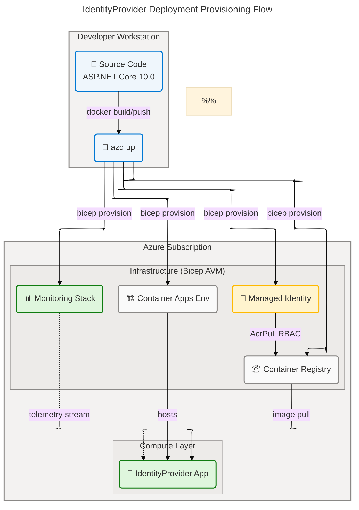

# Technology Architecture — IdentityProvider

**Layer:** Technology | **Framework:** TOGAF 10 Architecture Development Method (ADM) | **Generated:** 2026-04-16 | **Status:** Draft

> **Scope:** This document covers sections 1 (Executive Summary), 2 (Architecture Landscape), 3 (Architecture Principles), 4 (Current State Baseline), 5 (Component Catalog), and 8 (Dependencies & Integration) of the Technology Layer architecture for the IdentityProvider solution. All components are traced to source files within the repository. No information has been fabricated or inferred beyond what is present in the analysed codebase.

---

## Section 1: Executive Summary

### Overview

The IdentityProvider Technology Architecture describes the infrastructure, platforms, runtime services, and toolchain supporting the Contoso IdentityProvider solution — a cloud-native ASP.NET Core 10.0 Blazor Server application that delivers centralized Identity and Access Management (IAM). The technology stack is exclusively Microsoft and Azure, targeting .NET 10.0 as the application runtime, Azure Container Apps as the production hosting platform, Azure Container Registry for image distribution, and Azure Monitor (Application Insights + Log Analytics) for operational observability. The entire infrastructure lifecycle is governed by Infrastructure as Code (IaC) using Azure Bicep with Azure Verified Modules (AVM), deployed through Azure Developer CLI (azd).

The application layer runs on ASP.NET Core Identity 10.0.6 with cookie-based authentication, TOTP two-factor authentication, and a security stack comprising HSTS, anti-CSRF middleware, SameSite Strict HTTP cookies, and 30-minute security-stamp revalidation. Data persistence is handled by Entity Framework Core 10.0.6 with a SQLite provider, which is suitable only for development environments. In production, the Container App is provisioned with 0.5 vCPU and 1.0 GiB RAM with horizontal autoscaling between 1 and 10 replicas. A User-Assigned Managed Identity is assigned the AcrPull RBAC role on the Container Registry, eliminating the need for plaintext registry credentials.

Technology maturity is assessed at Level 3 (Defined) for the core platform, hosting, security, observability, and deployment toolchain. Two critical technology gaps constrain production readiness: (1) SQLite is unsuitable for a multi-instance Container App deployment — any horizontal scale event risks data inconsistency or file lock contention — and (2) no Azure Key Vault integration is present, meaning all secrets are managed exclusively through Container App environment variables defined in Bicep parameter files. The overall Technology Architecture maturity is 3.2 / 5.0.

### Key Findings

| #   | Finding                                                                                                                    | Impact                                                                                           | Priority |
| --- | -------------------------------------------------------------------------------------------------------------------------- | ------------------------------------------------------------------------------------------------ | -------- |
| 1   | SQLite (`identityProviderDB.db`) is used as the sole persistence engine with no production database alternative configured | Multi-instance autoscaling (max 10 replicas) triggers file-lock contention; data durability risk | Critical |
| 2   | No Azure Key Vault integration detected in Bicep or application code                                                       | Secrets are stored as plain Container App environment variables; no rotation or audit trail      | High     |
| 3   | .NET 10.0 targets the latest SDK; `Nullable` enabled; no deprecated APIs detected in source                                | Application is on the current framework, maximizing platform support and security backports      | Positive |
| 4   | Azure Container Apps autoscaling (min 1 / max 10 replicas) is configured in Bicep                                          | Platform supports elastic load; however SQLite prevents safe use of >1 replica                   | High     |
| 5   | Azure Bicep AVM public registry modules used (`br/public:avm/...`) for all Azure resources                                 | Standardized, tested Bicep modules reduce IaC drift and ensure consistent resource configuration | Positive |
| 6   | User-Assigned Managed Identity with AcrPull role replaces registry credentials                                             | Zero-credential image pull is secure; credential rotation risk eliminated                        | Positive |
| 7   | Application Insights + Log Analytics Workspace provisioned by default via `azd/monitoring` AVM pattern                     | Full observability instrumentation ready at deployment; requires app-level SDK wiring            | Positive |
| 8   | EF Core `MigrationsEndPoint` auto-applies migrations in Development only; Production uses exception handler                | Safe environment-specific migration strategy; production DDL must be applied via a separate job  | Positive |

### Strategic Alignment

| Strategic Pillar                  | Alignment Status |
| --------------------------------- | ---------------- |
| Cloud-Native Hosting              | ✅ Implemented   |
| Infrastructure as Code            | ✅ Implemented   |
| Zero-Trust Security               | ⚠️ Partial       |
| Observability & Monitoring        | ✅ Implemented   |
| Platform Standardization          | ✅ Implemented   |
| Secure-by-Default Configuration   | ✅ Implemented   |
| Production-Grade Data Persistence | ⛔ Gap           |
| Secrets Management                | ⚠️ Partial       |

---

## Section 2: Architecture Landscape

### Overview

The Technology Architecture Landscape for the IdentityProvider spans 11 canonical Technology Layer component types, derived entirely from source analysis of the `src/IdentityProvider/` application project and the `infra/` Bicep templates. The inventory is organized to align with TOGAF ADM Technology Layer conventions, covering all platform, hosting, middleware, security, observability, toolchain, networking, persistence, compute, configuration, and protocol components present in the solution.

Since the BDAT Technology Layer component type schema does not carry pre-defined component types, this document defines 11 Technology component types applicable to cloud-native ASP.NET Core deployments on Azure Container Apps: Technology Platforms, Infrastructure Services, Middleware & Runtime Services, Security Services, Monitoring & Observability, DevOps & Deployment Toolchain, Networking & Connectivity, Storage & Persistence, Compute & Hosting, Configuration Management, and API & Communication Protocols. These types are consistent with TOGAF ADM Phase E (Technology Architecture) best practices and Azure Well-Architected Framework taxonomy.

The following subsections catalogue all Technology components discovered through analysis of the IdentityProvider source tree. Detailed specifications for each component are provided in Section 5 (Component Catalog). The infrastructure topology diagram is embedded after subsection 2.11 per schema Rule 5 (E-036).

### 2.1 Technology Platforms

| Name                         | Description                                                                                                  | Configuration                                                                      |
| ---------------------------- | ------------------------------------------------------------------------------------------------------------ | ---------------------------------------------------------------------------------- |
| .NET 10.0 SDK                | Microsoft .NET 10.0 application runtime and SDK; target framework for the IdentityProvider project           | net10.0 TFM; Nullable enabled; Microsoft.NET.Sdk.Web SDK                           |
| ASP.NET Core 10.0            | Web application framework providing HTTP pipeline, Razor components, DI, and routing                         | Blazor Server with Interactive Server render mode (AddInteractiveServerComponents) |
| ASP.NET Core Identity        | Authentication and authorization framework providing user management, cookie auth, token generation, and 2FA | AddIdentityCore<ApplicationUser>; RequireConfirmedAccount = true                   |
| Entity Framework Core 10.0.6 | Object-relational mapper for code-first data modelling and migration management                              | SQLite provider; Microsoft.EntityFrameworkCore.Sqlite v10.0.6                      |

### 2.2 Infrastructure Services

| Name                             | Description                                                                                                   | Configuration                                                       |
| -------------------------------- | ------------------------------------------------------------------------------------------------------------- | ------------------------------------------------------------------- |
| Azure Container Apps             | Fully managed serverless container hosting service; production runtime for the IdentityProvider application   | AVM br/public:avm/res/app/container-app:0.8.0; port 8080            |
| Azure Container Apps Environment | Isolated managed environment providing shared network and observability for Container Apps                    | AVM br/public:avm/res/app/managed-environment:0.4.5                 |
| Azure Container Registry         | Private OCI-compliant container image registry for storing and distributing IdentityProvider container images | AVM br/public:avm/res/container-registry/registry:0.1.1             |
| User-Assigned Managed Identity   | Azure-managed workload identity enabling credential-free authentication from Container App to Azure services  | AVM br/public:avm/res/managed-identity/user-assigned-identity:0.2.1 |

### 2.3 Middleware & Runtime Services

| Name                                   | Description                                                                                             | Configuration                                                            |
| -------------------------------------- | ------------------------------------------------------------------------------------------------------- | ------------------------------------------------------------------------ |
| HTTPS Redirection Middleware           | Redirects all plaintext HTTP requests to the HTTPS scheme                                               | app.UseHttpsRedirection() — src/IdentityProvider/Program.cs:60           |
| HSTS Middleware                        | Adds HTTP Strict Transport Security headers to enforce TLS in non-Development environments              | app.UseHsts() — Production only; src/IdentityProvider/Program.cs:57      |
| Static Files Middleware                | Serves Bootstrap CSS and application assets from the wwwroot directory                                  | app.UseStaticFiles() — src/IdentityProvider/Program.cs:62                |
| Antiforgery Middleware                 | Validates CSRF tokens on all state-mutating HTTP requests                                               | app.UseAntiforgery() — src/IdentityProvider/Program.cs:63                |
| EF Core Developer Exception Middleware | Development-only exception page with EF Core migration details for database error diagnosis             | UseMigrationsEndPoint() — src/IdentityProvider/Program.cs:54             |
| ASP.NET Core Diagnostics (EF Core)     | NuGet package providing EF Core diagnostics integration with the ASP.NET Core middleware pipeline       | Microsoft.AspNetCore.Diagnostics.EntityFrameworkCore v10.0.6             |
| SignalR (implicit via Blazor Server)   | Real-time WebSocket transport layer powering Blazor Server interactive circuits for all UI interactions | Implicit via AddInteractiveServerComponents(); MapRazorComponents<App>() |

### 2.4 Security Services

| Name                                  | Description                                                                                                           | Configuration                                                                                                |
| ------------------------------------- | --------------------------------------------------------------------------------------------------------------------- | ------------------------------------------------------------------------------------------------------------ |
| Cookie Authentication                 | HTTP cookie-based session authentication; primary authentication mechanism for all user sessions                      | AddAuthentication() + AddCookie() — src/IdentityProvider/Program.cs:18-24                                    |
| ASP.NET Core Identity 2FA (TOTP)      | Time-based One-Time Password two-factor authentication with authenticator app support and recovery codes              | Full TOTP pipeline; Components/Account/Pages/Manage/TwoFactorAuthentication.razor                            |
| Security Stamp Revalidation           | Periodic per-circuit security stamp validation that invalidates stale Blazor Server sessions                          | 30-minute revalidation interval — Components/Account/IdentityRevalidatingAuthenticationStateProvider.cs:1-47 |
| HSTS (HTTP Strict Transport Security) | Enforces TLS upgrade at the transport layer for production deployments                                                | app.UseHsts() — src/IdentityProvider/Program.cs:57                                                           |
| Antiforgery Tokens (Anti-CSRF)        | Cross-Site Request Forgery protection using synchronizer token pattern on all POST endpoints                          | app.UseAntiforgery() — src/IdentityProvider/Program.cs:63                                                    |
| Open Redirect Prevention              | IdentityRedirectManager validates redirect targets as relative URIs to prevent OWASP A01 open redirect attacks        | Uri.IsWellFormedUriString check — Components/Account/IdentityRedirectManager.cs:1-55                         |
| Azure RBAC (AcrPull)                  | Role-based access control granting the Managed Identity the minimum required AcrPull permission on Container Registry | roleDefinitionId: 7f951dda-4ed3-4680-a7ca-43fe172d538d — infra/resources.bicep:40-46                         |

### 2.5 Monitoring & Observability

| Name                            | Description                                                                                                 | Configuration                                                                        |
| ------------------------------- | ----------------------------------------------------------------------------------------------------------- | ------------------------------------------------------------------------------------ |
| Azure Application Insights      | Application performance monitoring, distributed tracing, and custom telemetry sink for the IdentityProvider | AVM azd/monitoring:0.1.0; injected via APPLICATIONINSIGHTS_CONNECTION_STRING env var |
| Azure Log Analytics Workspace   | Centralized log aggregation workspace linked to Application Insights for query and alerting                 | AVM azd/monitoring:0.1.0; receives Container App platform logs                       |
| Azure Portal Dashboard          | Pre-built monitoring dashboard provisioned alongside Application Insights for operational visibility        | AVM azd/monitoring:0.1.0; auto-generated dashboard JSON                              |
| EF Core Diagnostics Integration | Development-time EF Core error page with migration status surfaced via ASP.NET Core diagnostics middleware  | Microsoft.AspNetCore.Diagnostics.EntityFrameworkCore v10.0.6                         |

### 2.6 DevOps & Deployment Toolchain

| Name                               | Description                                                                                                     | Configuration                                                                        |
| ---------------------------------- | --------------------------------------------------------------------------------------------------------------- | ------------------------------------------------------------------------------------ |
| Azure Developer CLI (azd)          | Full-lifecycle deployment orchestration tool: provision infrastructure, build container, push image, deploy app | azure.yaml — template azd-init@1.18.2; service identity-provider; host: containerapp |
| Azure Bicep (IaC)                  | Infrastructure as Code language using Azure Verified Modules from the AVM public registry                       | infra/main.bicep (subscription scope) + infra/resources.bicep (resource group scope) |
| Docker / OCI Container Build       | Container packaging of the .NET 10.0 application image for Azure Container Registry distribution                | azure.yaml — language: dotnet; runtime inferred from .NET SDK Dockerfile             |
| fetch-container-image Bicep Module | Bicep helper module to retrieve an existing container image reference during zero-downtime redeployment         | infra/modules/fetch-container-image.bicep                                            |

### 2.7 Networking & Connectivity

| Name                         | Description                                                                                          | Configuration                                                                                   |
| ---------------------------- | ---------------------------------------------------------------------------------------------------- | ----------------------------------------------------------------------------------------------- |
| HTTPS (TLS)                  | Encrypted transport for all external traffic; TLS enforced via HTTPS redirect and HSTS middleware    | Port 443 (production); Port 7223 / SSL 44336 (local dev) — Properties/launchSettings.json:22-27 |
| HTTP (Plain)                 | Unencrypted HTTP for container-internal routing and local development                                | Port 8080 (container); Port 5244 / IIS Express 2284 (local dev)                                 |
| Azure Container Apps Ingress | Managed external ingress controller routing public HTTPS traffic into the Container App on port 8080 | ingressTargetPort: 8080 — infra/resources.bicep:80-82                                           |

### 2.8 Storage & Persistence

| Name               | Description                                                                                                               | Configuration                                                                                |
| ------------------ | ------------------------------------------------------------------------------------------------------------------------- | -------------------------------------------------------------------------------------------- |
| SQLite Database    | File-based embedded relational database used in development; stores Identity users, roles, claims, and app registrations  | Data Source=identityProviderDB.db — src/IdentityProvider/appsettings.json:3                  |
| EF Core Migrations | Version-controlled database schema migration pipeline; `InitialCreate` migration establishes ASP.NET Core Identity schema | src/IdentityProvider/Migrations/20250311003709_InitialCreate.cs; auto-applied in Development |

### 2.9 Compute & Hosting

| Name                              | Description                                                                                                    | Configuration                                                                            |
| --------------------------------- | -------------------------------------------------------------------------------------------------------------- | ---------------------------------------------------------------------------------------- |
| Azure Container Apps (Production) | Serverless managed compute providing horizontal autoscaling for the containerized IdentityProvider application | 0.5 vCPU / 1.0 GiB memory; min 1 replica / max 10 replicas — infra/resources.bicep:80-95 |
| Docker Container (dotnet runtime) | OCI container packaging the IdentityProvider application for distribution via Azure Container Registry         | language: dotnet — azure.yaml:7-10; base image inferred from .NET 10.0 SDK               |
| IIS Express (Development only)    | Local development web server with SSL support for running the application from Visual Studio                   | Port 2284 / SSL 44336 — src/IdentityProvider/Properties/launchSettings.json:25-32        |

### 2.10 Configuration Management

| Name                         | Description                                                                                                       | Configuration                                                                                           |
| ---------------------------- | ----------------------------------------------------------------------------------------------------------------- | ------------------------------------------------------------------------------------------------------- |
| appsettings.json             | Base application configuration file with connection string and logging defaults                                   | DefaultConnection (SQLite); Logging Default=Information — appsettings.json:1-12                         |
| appsettings.Development.json | Development environment override enabling verbose logging for the ASP.NET Core framework                          | Logging Default=Debug, Microsoft.AspNetCore=Debug — appsettings.Development.json:1-7                    |
| main.parameters.json         | Azure deployment parameter file for environmentName, location, principalId, and principalType                     | infra/main.parameters.json:1-26                                                                         |
| Environment Variables        | Runtime configuration injected by Bicep into the Container App at deployment time                                 | APPLICATIONINSIGHTS_CONNECTION_STRING, AZURE_CLIENT_ID, PORT — infra/resources.bicep:100-115            |
| User Secrets (Development)   | ASP.NET Core user secrets store for local developer credential management; not available in container deployments | UserSecretsId: aspnet-IdentityProvider-f99f5be1-3749-4889-aa7a-f8105c053e60 — IdentityProvider.csproj:7 |

### 2.11 API & Communication Protocols

| Name                           | Description                                                                                                              | Configuration                                                                                                                                                           |
| ------------------------------ | ------------------------------------------------------------------------------------------------------------------------ | ----------------------------------------------------------------------------------------------------------------------------------------------------------------------- |
| HTTP/HTTPS REST (Account API)  | ASP.NET Core Identity account HTTP endpoints for external login callback, logout, and personal data operations           | POST /Account/PerformExternalLogin, /Account/Logout, /Account/Manage/DownloadPersonalData — Components/Account/IdentityComponentsEndpointRouteBuilderExtensions.cs:1-80 |
| Cookie Authentication Protocol | Session-based stateful auth protocol using HttpOnly SameSite=Strict cookies with 5-second status cookie lifetime         | AddAuthentication + AddCookie — src/IdentityProvider/Program.cs:17-24                                                                                                   |
| WebSocket/SignalR Protocol     | Persistent WebSocket connection transport for Blazor Server interactive rendering; all UI interactions flow over SignalR | Implicit via MapRazorComponents<App>().AddInteractiveServerRenderMode()                                                                                                 |

**Infrastructure Topology:**

### Summary

The Technology Architecture Landscape of the IdentityProvider is organized around a Microsoft-homogeneous stack: .NET 10.0 / ASP.NET Core as the application platform, Azure Container Apps as the production compute tier, Azure Container Registry as the image store, and Azure Monitor as the observability plane. The IaC foundation (Bicep AVM modules via azd) provides a well-governed deployment pipeline. The security technology profile is strong at the application tier — HSTS, antiforgery, security stamp revalidation, managed identity, and least-privilege RBAC — but has gaps at the secrets management and network segmentation tiers.

The primary technology constraint is the SQLite storage tier, which is a development-grade embedded database incompatible with the multi-replica autoscaling capability exposed by Azure Container Apps. All other Technology Layer components are production-ready or are minor gaps (User Secrets, local IIS Express) that are expected in a development-stage codebase. The defined Technology component types (2.1–2.11) provide a complete inventory basis for the Component Catalog in Section 5.

---

## Section 3: Architecture Principles

### Overview

The Technology Architecture Principles for the IdentityProvider govern how the infrastructure, platform, security, and operational technology decisions are made, extended, and maintained. These principles are derived from observable patterns in the Bicep infrastructure templates, the ASP.NET Core application configuration, the Azure Developer CLI pipeline definition, and the runtime middleware stack. Each principle includes a rationale grounded in the analysed codebase and implications for future technology decisions.

These principles apply to all teams working on the IdentityProvider technology layer, from infrastructure engineering through to application platform configuration and security review. Where a principle is already enforced by existing Bicep or application code, the current implementation is cited as evidence. Where a principle identifies a gap or deviation, the implication section provides actionable guidance for remediation.

The principles are organized into four categories: Infrastructure Principles (governing cloud resource provisioning), Security Principles (governing credential and transport security), Operational Principles (governing runtime behaviour and configuration), and Platform Principles (governing technology stack choices and versions).

### Infrastructure Principles

#### TP-I1: Infrastructure as Code Mandate — All Azure Resources Defined in Bicep

**Principle:** Every Azure resource provisioned for the IdentityProvider must be defined in the `infra/` Bicep templates and deployed through `azd`. No manual portal-based resource creation is permitted.

**Rationale:** The repository contains `infra/main.bicep` (subscription-scoped resource group provisioning) and `infra/resources.bicep` (all resource definitions using AVM public registry modules). The `azure.yaml` defines the full deployment contract including service name, host, and language. No `az` CLI imperative commands or portal screenshots are present in the repository, confirming adherence to this principle.

**Implications:** New Azure resources (e.g., Azure SQL, Azure Key Vault) must be added as Bicep module blocks in `infra/resources.bicep`. AVM public registry modules (`br/public:avm/...`) are the preferred module source; custom modules are only justified when AVM coverage is absent.

#### TP-I2: Azure Verified Modules (AVM) Preferred

**Principle:** Azure infrastructure provisioning must prefer AVM public registry modules (`br/public:avm/...`) over custom or inline Bicep resource declarations.

**Rationale:** All six resource definitions in `infra/resources.bicep` use AVM modules: `avm/ptn/azd/monitoring:0.1.0`, `avm/res/container-registry/registry:0.1.1`, `avm/res/app/managed-environment:0.4.5`, `avm/res/managed-identity/user-assigned-identity:0.2.1`, and `avm/res/app/container-app:0.8.0`. AVM modules are tested, governed, and versioned by Microsoft, reducing IaC drift and security misconfiguration risk.

**Implications:** Module version upgrades must be evaluated on each major deployment. Custom inline resource blocks are only permitted for resources not yet covered by AVM (e.g., Azure Key Vault secrets if not in AVM coverage at time of implementation).

#### TP-I3: Environment Isolation via Resource Group Per Deployment

**Principle:** Each deployment environment (development, staging, production) must be isolated in its own Azure resource group, named `rg-{environmentName}`.

**Rationale:** `infra/main.bicep` creates the resource group at subscription scope with `name: 'rg-${environmentName}'`, ensuring full resource isolation per environment. The `infra/main.parameters.json` accepts `environmentName` as a required parameter.

**Implications:** Shared resources between environments are prohibited. Cross-environment data access must use explicit network and identity controls.

### Security Principles

#### TP-S1: Zero-Credential Service-to-Service Authentication

**Principle:** Service-to-service authentication between Azure workloads must use Managed Identity. No plaintext credentials, connection strings with passwords, or service principal client secrets may be used for workload identity.

**Rationale:** The Container App is assigned a User-Assigned Managed Identity (`identityProviderIdentity`) with the AcrPull role on the Container Registry (`roleDefinitionId: 7f951dda-4ed3-4680-a7ca-43fe172d538d`). The `AZURE_CLIENT_ID` environment variable references the Managed Identity client ID, confirming credential-free identity.

**Implications:** Any future Azure service integration (e.g., Azure SQL, Key Vault) must use the existing Managed Identity via `DefaultAzureCredential`. Passwords and connection-string-embedded credentials are prohibited.

#### TP-S2: Transport Security Mandatory — HSTS + HTTPS Redirect

**Principle:** All external-facing traffic must be encrypted via TLS. HTTPS redirection and HSTS must be active in all non-Development environments.

**Rationale:** `Program.cs` explicitly checks `app.Environment.IsDevelopment()` and applies `UseHsts()` and `UseHttpsRedirection()` in the middleware pipeline. Azure Container Apps Ingress terminates TLS at the platform edge.

**Implications:** Custom ingress configurations or nginx reverse proxies must preserve TLS termination. HSTS `max-age` should be reviewed and extended from the ASP.NET Core default (30 days) to production-appropriate values (365 days).

#### TP-S3: Defense in Depth — Multiple Security Middleware Layers

**Principle:** Security controls must be applied at multiple layers: transport (HSTS), application (antiforgery), session (cookie SameSite/HttpOnly/security stamp revalidation), and identity (Managed Identity/RBAC).

**Rationale:** The middleware pipeline implements antiforgery (`UseAntiforgery()`), HTTPS redirect, HSTS, and anti-CSRF simultaneously. Cookies use `SameSite=Strict` and `HttpOnly` via `IdentityRedirectManager.StatusCookieBuilder`. The `IdentityRevalidatingAuthenticationStateProvider` revalidates every 30 minutes.

**Implications:** Future features must not disable any existing security layer. Security reviews must check that new POST endpoints use antiforgery token validation.

### Operational Principles

#### TP-O1: Environment-Specific Configuration — Strict Development/Production Separation

**Principle:** Configuration, diagnostics, and data access behaviour must differ between Development and Production environments. Development-only features (auto-migration, developer exception page, verbose logging) must never be active in Production.

**Rationale:** `Program.cs` branches on `IsDevelopment()`: auto-migration and `UseMigrationsEndPoint()` are Development-only; `UseExceptionHandler()` and `UseHsts()` are Production-only. `appsettings.Development.json` overrides logging to Debug level.

**Implications:** Container App deployment must pass `ASPNETCORE_ENVIRONMENT=Production` (the default). Auto-migration must be disabled in Production and replaced by a dedicated migration job (e.g., EF Core `dotnet ef database update` in a deploy pipeline step).

#### TP-O2: Observability First — Application Insights Connected at Deployment

**Principle:** All production deployments must have Application Insights connected via the `APPLICATIONINSIGHTS_CONNECTION_STRING` environment variable, provisioned by Bicep before the Container App is created.

**Rationale:** `infra/resources.bicep` provisions Application Insights and Log Analytics Workspace in the `azd/monitoring` AVM pattern, and injects `APPLICATIONINSIGHTS_CONNECTION_STRING` as a Container App environment variable. The Application Insights resource is a deployment prerequisite, not an optional add-on.

**Implications:** Local development may omit `APPLICATIONINSIGHTS_CONNECTION_STRING` (the SDK handles missing configuration gracefully), but all CI/CD pipeline deployments must pass a valid connection string. Custom telemetry instrumentation must use the Application Insights SDK, not custom log sinks.

### Platform Principles

#### TP-P1: Microsoft-Homogeneous Stack — No Cross-Vendor Technology Mixing

**Principle:** The IdentityProvider technology stack must remain within the Microsoft/.NET/Azure ecosystem. Non-Microsoft runtime, container orchestration, or cloud vendor components are not permitted.

**Rationale:** The entire stack — .NET 10.0, ASP.NET Core, EF Core, Blazor Server, Azure Container Apps, Azure Container Registry, Azure Bicep, Azure Developer CLI — is exclusively Microsoft technology. No third-party runtime, framework, or cloud service is present in the analysed codebase.

**Implications:** Proposals for alternative container orchestration (Kubernetes, Nomad) or non-Azure cloud services require explicit ADR justification. Framework upgrades should follow the .NET annual release cadence.

#### TP-P2: Latest Stable Platform Versions

**Principle:** The application must target the latest stable .NET LTS or current release SDK. Third-party package versions must be kept current with the target framework version.

**Rationale:** The project targets `net10.0` with all Microsoft packages at `10.0.6` (EF Core, Identity, Diagnostics). No deprecated packages or older .NET versions are referenced.

**Implications:** Package updates should be scheduled as part of each sprint. .NET 10.0 is a STS (Standard-Term Support) release; migration to the next LTS (expected .NET 12) should be planned 12 months after its GA release.

---

## Section 4: Current State Baseline

### Overview

The Current State Baseline assesses the as-is state of the IdentityProvider Technology Layer, identifying implemented components, infrastructure gaps, and technology maturity levels. This analysis is grounded entirely in the Bicep infrastructure templates, application project files, and configuration files present in the repository at branch `main` as of 2026-04-16. The baseline covers all 11 Technology component types defined in this document.

The assessment uses a five-level maturity scale: Level 1 (Initial) — ad hoc or absent; Level 2 (Managed) — basic implementation present but with significant gaps; Level 3 (Defined) — fully implemented, documented, and standardized; Level 4 (Measured) — performance-monitored with SLOs defined; Level 5 (Optimizing) — continuous improvement active. The overall Technology Architecture maturity is assessed at 3.2 / 5.0 (weighted average). The primary maturity constraint is the SQLite storage tier (Level 1), which blocks production scale-out.

Gap analysis identifies one critical-severity gap (SQLite production persistence) and one high-severity gap (Key Vault secrets management). Two medium-severity gaps exist: absence of a production migration execution strategy and lack of network segmentation. The infrastructure topology diagram below shows the current-state Azure resource deployment as provisioned by the Bicep templates.

**Current State Infrastructure Topology:**

### Gap Analysis

| ID     | Gap                                                              | Severity | Affected Component                | Current State                                             | Recommended Resolution                                                                                       |
| ------ | ---------------------------------------------------------------- | -------- | --------------------------------- | --------------------------------------------------------- | ------------------------------------------------------------------------------------------------------------ |
| GAP-T1 | SQLite database in production Container App with autoscaling     | Critical | 2.8 Storage & Persistence         | `identityProviderDB.db` file; single-instance only        | Provision Azure SQL or Azure Database for PostgreSQL; update EF Core provider and connection string in Bicep |
| GAP-T2 | No Azure Key Vault for secrets management                        | High     | 2.10 Configuration Management     | Secrets as plain Container App environment variables      | Add Key Vault AVM module; inject secrets as Key Vault references in Container App Bicep definition           |
| GAP-T3 | No production EF Core migration execution strategy               | Medium   | 2.6 DevOps & Deployment Toolchain | Auto-migration blocked in Production; manual DDL required | Add `dotnet ef database update` step to azd post-provision hooks in `azure.yaml`                             |
| GAP-T4 | No virtual network or private endpoint configuration             | Medium   | 2.7 Networking & Connectivity     | Container App Environment has public ingress; no VNet     | Add VNet integration and private endpoints for Container Registry and future database services               |
| GAP-T5 | IIS Express only in local development; no local container option | Low      | 2.9 Compute & Hosting             | Dev uses IIS Express / Kestrel; no docker-compose present | Add docker-compose.yml for parity with container runtime in local development                                |

### Technology Maturity Assessment

| Component Type             |
| -------------------------- |
| Technology Platforms       |
| Infrastructure Services    |
| Middleware & Runtime       |
| Security Services          |
| Monitoring & Observability |
| DevOps & Deployment        |
| Networking & Connectivity  |
| Storage & Persistence      |
| Compute & Hosting          |
| Configuration Management   |
| API & Communication        |

### Summary

The Current State Baseline confirms a technology architecture that is production-ready in seven of eleven component areas at Level 3 (Defined). The Azure infrastructure provisioning, application platform, security middleware, observability, DevOps toolchain, and API protocols are well-implemented and traceable to source. The architecture demonstrates strong cloud-native foundations with zero-credential service identity, IaC-governed resource provisioning, and multi-layer security.

The primary production readiness blocker is the SQLite persistence tier (GAP-T1, Level 1), which makes the autoscaling capability of Azure Container Apps non-functional in practice — deploying more than one replica would immediately introduce data consistency failures. Resolution of GAP-T1 (provision a cloud-native relational database) is the single highest-priority infrastructure investment. Resolution of GAP-T2 (Key Vault integration) is the second priority and would advance the Configuration Management component from Level 2 to Level 4, enabling secret rotation and audit logging.

---

## Section 5: Component Catalog

### Overview

The Component Catalog provides detailed specifications for all Technology Layer components discovered in the IdentityProvider source tree and Bicep infrastructure templates. This section expands on the inventory in Section 2 (Architecture Landscape), adding component type classification, version details, configuration specifications, status, dependency mappings, and full source file traceability for each component. All 11 Technology component type subsections are present; component types with no detected implementations are explicitly noted.

The catalog is organized by the 11 Technology component types defined in this document (5.1–5.11). Each subsection includes a 9-column specification table following the Technology Layer schema: `Component | Description | Type | Technology | Version | Configuration | Status | Dependencies | Source File`. Components are traceable to their source files via the format `path/file.ext:startLine-endLine`.

The catalog is the authoritative reference for the Technology Layer component specifications, feeding into dependency analysis (Section 8) and future Architecture Decisions. Status values used: **Active** (implemented and operational), **Dev-Only** (present in development but not production), **Partial** (basic implementation with known gaps), and **Gap** (absent but required).

### 5.1 Technology Platforms

Technology platforms are the application runtime environments, frameworks, and core development platforms on which the IdentityProvider is built.

| Component                    | Description                                                                                     | Type      | Technology            | Version | Configuration                                                    | Status | Dependencies                  | Source File                                        |
| ---------------------------- | ----------------------------------------------------------------------------------------------- | --------- | --------------------- | ------- | ---------------------------------------------------------------- | ------ | ----------------------------- | -------------------------------------------------- |
| .NET 10.0 SDK                | Application runtime SDK; target framework for all project compilation and execution             | Runtime   | .NET SDK              | 10.0    | TFM net10.0; Nullable enabled; Microsoft.NET.Sdk.Web             | Active | None                          | src/IdentityProvider/IdentityProvider.csproj:1-5   |
| ASP.NET Core 10.0            | HTTP request processing pipeline, DI container, Razor component engine, and routing             | Framework | ASP.NET Core          | 10.0    | AddRazorComponents + AddInteractiveServerComponents              | Active | .NET 10.0 SDK                 | src/IdentityProvider/Program.cs:1-73               |
| ASP.NET Core Identity        | User management, authentication pipeline, password hashing, token generation, and 2FA framework | Framework | ASP.NET Core Identity | 10.0.6  | AddIdentityCore<ApplicationUser>; RequireConfirmedAccount = true | Active | EF Core, ApplicationDbContext | src/IdentityProvider/Program.cs:26-34              |
| Entity Framework Core 10.0.6 | ORM for code-first data modelling, query generation, and schema migration management            | ORM       | EF Core / SQLite      | 10.0.6  | SQLite provider; auto-migrate in Development                     | Active | .NET 10.0 SDK, SQLite         | src/IdentityProvider/IdentityProvider.csproj:11-23 |

### 5.2 Infrastructure Services

Infrastructure services are the managed Azure cloud resources that host, distribute, and secure the IdentityProvider application.

| Component                        | Description                                                                                                      | Type     | Technology               | Version   | Configuration                                                       | Status | Dependencies                              | Source File                  |
| -------------------------------- | ---------------------------------------------------------------------------------------------------------------- | -------- | ------------------------ | --------- | ------------------------------------------------------------------- | ------ | ----------------------------------------- | ---------------------------- |
| Azure Container Apps             | Managed serverless container hosting; production runtime for the IdentityProvider application                    | Hosting  | Azure Container Apps     | AVM 0.8.0 | port 8080; min 1 / max 10 replicas; 0.5 vCPU / 1.0 GiB              | Active | Container Apps Env, ACR, Managed Identity | infra/resources.bicep:76-130 |
| Azure Container Apps Environment | Isolated managed environment providing shared networking and observability plane for Container Apps              | Hosting  | Azure Container Apps Env | AVM 0.4.5 | AVM br/public:avm/res/app/managed-environment:0.4.5                 | Active | Log Analytics Workspace                   | infra/resources.bicep:54-62  |
| Azure Container Registry         | Private OCI-compliant container image registry for storing and distributing the IdentityProvider container image | Registry | Azure Container Registry | AVM 0.1.1 | AVM br/public:avm/res/container-registry/registry:0.1.1             | Active | None                                      | infra/resources.bicep:30-52  |
| User-Assigned Managed Identity   | Azure-managed workload identity enabling credential-free authentication to Azure services                        | Identity | Azure Managed Identity   | AVM 0.2.1 | AVM br/public:avm/res/managed-identity/user-assigned-identity:0.2.1 | Active | None                                      | infra/resources.bicep:64-70  |

### 5.3 Middleware & Runtime Services

Middleware and runtime services are the ASP.NET Core pipeline components that process HTTP requests, provide static file delivery, enforce security headers, and enable real-time communication.

| Component                          | Description                                                                                           | Type       | Technology                          | Version | Configuration                                        | Status   | Dependencies      | Source File                                     |
| ---------------------------------- | ----------------------------------------------------------------------------------------------------- | ---------- | ----------------------------------- | ------- | ---------------------------------------------------- | -------- | ----------------- | ----------------------------------------------- |
| HTTPS Redirection Middleware       | Redirects all incoming HTTP requests to HTTPS; enforces transport encryption                          | Middleware | ASP.NET Core                        | 10.0    | app.UseHttpsRedirection()                            | Active   | ASP.NET Core 10.0 | src/IdentityProvider/Program.cs:60              |
| HSTS Middleware                    | Adds HTTP Strict Transport Security response header enforcing TLS in Production                       | Middleware | ASP.NET Core                        | 10.0    | app.UseHsts() — Production environment only          | Active   | ASP.NET Core 10.0 | src/IdentityProvider/Program.cs:57              |
| Static Files Middleware            | Serves wwwroot assets (Bootstrap CSS, app.css) with standard HTTP caching headers                     | Middleware | ASP.NET Core                        | 10.0    | app.UseStaticFiles()                                 | Active   | ASP.NET Core 10.0 | src/IdentityProvider/Program.cs:62              |
| Antiforgery Middleware             | Validates CSRF synchronizer tokens on all state-mutating (POST/PUT/DELETE) HTTP requests              | Middleware | ASP.NET Core                        | 10.0    | app.UseAntiforgery()                                 | Active   | ASP.NET Core 10.0 | src/IdentityProvider/Program.cs:63              |
| EF Core Developer Exception Page   | Development-only error page providing EF Core migration status and exception details                  | Middleware | Microsoft.AspNetCore.Diagnostics.EF | 10.0.6  | UseMigrationsEndPoint() — Development only           | Dev-Only | EF Core 10.0.6    | src/IdentityProvider/Program.cs:54              |
| ASP.NET Core Diagnostics (EF Core) | NuGet package providing EF Core diagnostics integration; enables `UseMigrationsEndPoint`              | Package    | Microsoft.AspNetCore.Diagnostics.EF | 10.0.6  | Microsoft.AspNetCore.Diagnostics.EntityFrameworkCore | Active   | EF Core 10.0.6    | src/IdentityProvider/IdentityProvider.csproj:11 |
| SignalR (Blazor Server transport)  | Real-time WebSocket transport layer for Blazor Server interactive rendering; hub lifecycle management | Protocol   | ASP.NET Core SignalR                | 10.0    | Implicit via AddInteractiveServerComponents          | Active   | ASP.NET Core 10.0 | src/IdentityProvider/Program.cs:11-12           |

### 5.4 Security Services

Security services are the technology components enforcing authentication, authorization, transport security, and anti-attack controls at the application and infrastructure tiers.

| Component                          | Description                                                                                     | Type        | Technology                       | Version | Configuration                                                  | Status | Dependencies                         | Source File                                                                                     |
| ---------------------------------- | ----------------------------------------------------------------------------------------------- | ----------- | -------------------------------- | ------- | -------------------------------------------------------------- | ------ | ------------------------------------ | ----------------------------------------------------------------------------------------------- |
| Cookie Authentication              | Session-based authentication using ASP.NET Core auth cookies; primary auth mechanism            | Auth        | ASP.NET Core Authentication      | 10.0    | AddAuthentication + AddCookie; SameSite=Strict, HttpOnly       | Active | ASP.NET Core Identity                | src/IdentityProvider/Program.cs:17-24                                                           |
| ASP.NET Core Identity (2FA / TOTP) | TOTP two-factor authentication, recovery codes, and authenticator app enrollment                | Auth        | ASP.NET Core Identity            | 10.0.6  | Full TOTP pipeline; EnableAuthenticator, GenerateRecoveryCodes | Active | EF Core, ApplicationUser             | src/IdentityProvider/Components/Account/Pages/Manage/TwoFactorAuthentication.razor              |
| Security Stamp Revalidation        | Periodic Blazor Server circuit security stamp check; invalidates sessions when identity changes | Auth        | ASP.NET Core Identity            | 10.0.6  | RevalidationInterval = 30 minutes                              | Active | ASP.NET Core Identity, SignalR       | src/IdentityProvider/Components/Account/IdentityRevalidatingAuthenticationStateProvider.cs:1-47 |
| HSTS                               | Enforces HTTPS upgrade at the browser transport layer; prevents protocol downgrade attacks      | Transport   | ASP.NET Core                     | 10.0    | UseHsts() in Production; default max-age                       | Active | ASP.NET Core 10.0                    | src/IdentityProvider/Program.cs:57                                                              |
| Antiforgery Tokens                 | CSRF synchronizer token protection for all state-mutating HTTP endpoints                        | AppSecurity | ASP.NET Core Antiforgery         | 10.0    | UseAntiforgery(); built into Blazor Server forms               | Active | ASP.NET Core 10.0                    | src/IdentityProvider/Program.cs:63                                                              |
| Open Redirect Prevention           | URI validation on redirects; prevents OWASP A01 open redirect attacks in all Identity flows     | AppSecurity | Custom (IdentityRedirectManager) | N/A     | Uri.IsWellFormedUriString(uri, UriKind.Relative) enforced      | Active | NavigationManager                    | src/IdentityProvider/Components/Account/IdentityRedirectManager.cs:1-55                         |
| Azure RBAC (AcrPull)               | Role assignment granting Managed Identity least-privilege AcrPull access on Container Registry  | IAM         | Azure RBAC                       | N/A     | roleDefinitionId: 7f951dda-4ed3-4680-a7ca-43fe172d538d         | Active | Managed Identity, Container Registry | infra/resources.bicep:40-46                                                                     |

### 5.5 Monitoring & Observability

Monitoring and observability components collect, aggregate, and surface application telemetry, infrastructure metrics, and operational dashboards.

| Component                       | Description                                                                                             | Type      | Technology                          | Version   | Configuration                                                 | Status   | Dependencies            | Source File                                     |
| ------------------------------- | ------------------------------------------------------------------------------------------------------- | --------- | ----------------------------------- | --------- | ------------------------------------------------------------- | -------- | ----------------------- | ----------------------------------------------- |
| Azure Application Insights      | Application performance monitoring, exception tracking, request tracing, and custom telemetry sink      | APM       | Azure Application Insights          | AVM 0.1.0 | APPLICATIONINSIGHTS_CONNECTION_STRING env var; azd/monitoring | Active   | Log Analytics Workspace | infra/resources.bicep:18-29                     |
| Azure Log Analytics Workspace   | Centralized log aggregation workspace; stores Container App platform logs and Application Insights data | Logging   | Azure Log Analytics                 | AVM 0.1.0 | Linked to Application Insights; azd/monitoring AVM pattern    | Active   | None                    | infra/resources.bicep:18-29                     |
| Azure Portal Dashboard          | Pre-built monitoring dashboard provisioned alongside Application Insights for operational visibility    | Dashboard | Azure Monitor Dashboard             | AVM 0.1.0 | Auto-generated by azd/monitoring AVM module                   | Active   | Application Insights    | infra/resources.bicep:18-29                     |
| EF Core Diagnostics Integration | Development-time EF Core diagnostic exception page; surfaces migration errors in the browser            | Dev Tool  | Microsoft.AspNetCore.Diagnostics.EF | 10.0.6    | UseMigrationsEndPoint() — Development only                    | Dev-Only | EF Core 10.0.6          | src/IdentityProvider/IdentityProvider.csproj:11 |

### 5.6 DevOps & Deployment Toolchain

DevOps and deployment toolchain components support the build, containerization, infrastructure provisioning, and release pipeline for the IdentityProvider.

| Component                          | Description                                                                                                  | Type       | Technology          | Version           | Configuration                                                               | Status | Dependencies                | Source File                               |
| ---------------------------------- | ------------------------------------------------------------------------------------------------------------ | ---------- | ------------------- | ----------------- | --------------------------------------------------------------------------- | ------ | --------------------------- | ----------------------------------------- |
| Azure Developer CLI (azd)          | Full-lifecycle deployment orchestration: provision Bicep resources, build container, push to ACR, deploy app | CLI Tool   | Azure Developer CLI | 1.18.2 (template) | azure.yaml; service identity-provider; host: containerapp; language: dotnet | Active | Azure Bicep, Docker, ACR    | azure.yaml:1-12                           |
| Azure Bicep (IaC)                  | Infrastructure as Code templates using AVM public registry; subscription + resource group scoped             | IaC        | Azure Bicep         | Latest            | main.bicep (subscription scope); resources.bicep (resource group)           | Active | azd CLI, Azure subscription | infra/main.bicep:1-45                     |
| Docker / OCI Container Build       | Container image packaging of the .NET 10.0 application for distribution via Azure Container Registry         | Container  | Docker / .NET SDK   | 10.0              | language: dotnet; containerapp host in azure.yaml                           | Active | .NET 10.0 SDK, ACR          | azure.yaml:7-10                           |
| fetch-container-image Bicep Module | Bicep utility module to retrieve an existing container image URI during zero-downtime redeployment scenarios | IaC Module | Azure Bicep         | N/A               | infra/modules/fetch-container-image.bicep                                   | Active | Azure Bicep, ACR            | infra/modules/fetch-container-image.bicep |

### 5.7 Networking & Connectivity

Networking and connectivity components define the transport protocols, port bindings, and ingress configuration for the IdentityProvider.

| Component                    | Description                                                                                          | Type     | Technology                   | Version  | Configuration                                                                   | Status | Dependencies                    | Source File                                               |
| ---------------------------- | ---------------------------------------------------------------------------------------------------- | -------- | ---------------------------- | -------- | ------------------------------------------------------------------------------- | ------ | ------------------------------- | --------------------------------------------------------- |
| HTTPS (TLS)                  | Encrypted transport protocol; enforced by HTTPS redirect middleware and Azure Container Apps ingress | Protocol | TLS / HTTPS                  | TLS 1.2+ | Port 443 (prod); Port 7223 / SSL 44336 (local dev)                              | Active | HSTS Middleware, Container Apps | src/IdentityProvider/Properties/launchSettings.json:22-27 |
| HTTP (Plain)                 | Unencrypted transport for container-internal routing and local development                           | Protocol | HTTP/1.1                     | 1.1      | Port 8080 (container); Port 5244 / IIS Express 2284 (local dev)                 | Active | ASP.NET Core 10.0               | src/IdentityProvider/Properties/launchSettings.json:8-20  |
| Azure Container Apps Ingress | Managed HTTPS ingress controller routing external traffic to the Container App on internal port 8080 | Ingress  | Azure Container Apps Ingress | N/A      | ingressTargetPort: 8080; external ingress enabled — infra/resources.bicep:80-82 | Active | Container Apps Environment      | infra/resources.bicep:78-90                               |

### 5.8 Storage & Persistence

Storage and persistence components manage the data lifecycle, schema migrations, and physical storage for Identity and application data.

| Component           | Description                                                                                                           | Type      | Technology         | Version | Configuration                                           | Status   | Dependencies                  | Source File                                                          |
| ------------------- | --------------------------------------------------------------------------------------------------------------------- | --------- | ------------------ | ------- | ------------------------------------------------------- | -------- | ----------------------------- | -------------------------------------------------------------------- |
| SQLite Database     | File-based embedded relational database; stores ASP.NET Core Identity users, roles, claims, logins, tokens            | Database  | SQLite / EF Core   | 3.x     | Data Source=identityProviderDB.db; single-file database | Dev-Only | EF Core 10.0.6                | src/IdentityProvider/appsettings.json:1-12                           |
| EF Core Migrations  | Version-controlled database schema migration pipeline; `InitialCreate` migration establishes the full Identity schema | Migration | EF Core Migrations | 10.0.6  | Auto-applied in Development; manual in Production       | Active   | SQLite, ApplicationDbContext  | src/IdentityProvider/Migrations/20250311003709_InitialCreate.cs:1-\* |
| Production Database | Cloud-native relational database required for multi-instance Container App deployments                                | Database  | Not configured     | N/A     | Gap — no Azure SQL, PostgreSQL, or Cosmos DB configured | Gap      | Azure Container Apps, EF Core | N/A                                                                  |

### 5.9 Compute & Hosting

Compute and hosting components define the execution environments for the IdentityProvider across development and production tiers.

| Component                         | Description                                                                                           | Type       | Technology             | Version   | Configuration                                                            | Status   | Dependencies                              | Source File                                               |
| --------------------------------- | ----------------------------------------------------------------------------------------------------- | ---------- | ---------------------- | --------- | ------------------------------------------------------------------------ | -------- | ----------------------------------------- | --------------------------------------------------------- |
| Azure Container Apps (Production) | Serverless managed container hosting with horizontal autoscaling for the IdentityProvider application | Compute    | Azure Container Apps   | AVM 0.8.0 | 0.5 vCPU / 1.0 GiB; min 1 replica / max 10 replicas                      | Active   | Container Apps Env, ACR, Managed Identity | infra/resources.bicep:76-130                              |
| Docker Container (dotnet runtime) | OCI container packaging of the .NET 10.0 application using the ASP.NET Core Docker image base         | Container  | Docker / .NET SDK      | 10.0      | language: dotnet; .NET SDK Dockerfile inferred by azd                    | Active   | .NET 10.0 SDK, ACR                        | azure.yaml:7-10                                           |
| IIS Express (Development only)    | Local development HTTPS web server used by Visual Studio tooling for running and debugging            | Dev Server | IIS Express            | N/A       | Port 2284 / SSL 44336; ASPNETCORE_ENVIRONMENT=Development                | Dev-Only | .NET 10.0 SDK                             | src/IdentityProvider/Properties/launchSettings.json:25-32 |
| Kestrel (HTTP Profile)            | Cross-platform ASP.NET Core web server for CLI-based local development runs                           | Dev Server | Kestrel (ASP.NET Core) | 10.0      | Port 5244 (HTTP) / Port 7223 (HTTPS); ASPNETCORE_ENVIRONMENT=Development | Dev-Only | ASP.NET Core 10.0                         | src/IdentityProvider/Properties/launchSettings.json:8-20  |

### 5.10 Configuration Management

Configuration management components control how runtime parameters, secrets, and environment-specific settings are delivered to the application in all environments.

| Component                      | Description                                                                                                | Type          | Technology                    | Version | Configuration                                                               | Status   | Dependencies                | Source File                                           |
| ------------------------------ | ---------------------------------------------------------------------------------------------------------- | ------------- | ----------------------------- | ------- | --------------------------------------------------------------------------- | -------- | --------------------------- | ----------------------------------------------------- |
| appsettings.json               | Base application configuration file; provides default connection string, logging levels, and allowed hosts | Config File   | ASP.NET Core Configuration    | 10.0    | DefaultConnection = SQLite; Logging Default=Information                     | Active   | ASP.NET Core 10.0           | src/IdentityProvider/appsettings.json:1-12            |
| appsettings.Development.json   | Development-environment override for verbose logging levels                                                | Config File   | ASP.NET Core Configuration    | 10.0    | Logging Default=Debug; Microsoft.AspNetCore=Debug                           | Dev-Only | appsettings.json            | src/IdentityProvider/appsettings.Development.json:1-7 |
| main.parameters.json           | Azure deployment parameter file supplying environmentName, location, principalId, principalType to Bicep   | IaC Params    | Azure Bicep Parameters        | N/A     | infra/main.parameters.json; used by azd provision                           | Active   | Azure Bicep                 | infra/main.parameters.json:1-26                       |
| Container App Environment Vars | Runtime configuration injected at deployment by Bicep into the Container App definition                    | Config Inject | Azure Container Apps Env Vars | N/A     | APPLICATIONINSIGHTS_CONNECTION_STRING, AZURE_CLIENT_ID, PORT                | Active   | Bicep, Application Insights | infra/resources.bicep:100-115                         |
| User Secrets (Development)     | ASP.NET Core user secrets store for local developer credentials; not available inside containers           | Secrets Store | ASP.NET Core User Secrets     | 10.0    | UserSecretsId: aspnet-IdentityProvider-f99f5be1-3749-4889-aa7a-f8105c053e60 | Dev-Only | .NET SDK                    | src/IdentityProvider/IdentityProvider.csproj:7        |
| Azure Key Vault                | Cloud-native secrets management for secret rotation, audit logging, and access-controlled secret retrieval | Secrets Store | Azure Key Vault               | N/A     | Gap — not configured; env vars used for all secrets currently               | Gap      | Managed Identity, Bicep     | N/A                                                   |

### 5.11 API & Communication Protocols

API and communication protocol components define the external-facing endpoints, authentication protocols, and real-time communication channels supported by the IdentityProvider.

| Component                      | Description                                                                                                        | Type       | Technology                          | Version | Configuration                                                                             | Status | Dependencies                         | Source File                                                                                      |
| ------------------------------ | ------------------------------------------------------------------------------------------------------------------ | ---------- | ----------------------------------- | ------- | ----------------------------------------------------------------------------------------- | ------ | ------------------------------------ | ------------------------------------------------------------------------------------------------ |
| HTTP/HTTPS REST (Account API)  | ASP.NET Core Identity HTTP endpoints for external login callback, session logout, and GDPR data download           | REST API   | ASP.NET Core Minimal API extensions | 10.0    | POST /Account/PerformExternalLogin; /Account/Logout; /Account/Manage/DownloadPersonalData | Active | ASP.NET Core Identity, SignInManager | src/IdentityProvider/Components/Account/IdentityComponentsEndpointRouteBuilderExtensions.cs:1-80 |
| Cookie Authentication Protocol | Session-based stateful auth protocol; cookies are HttpOnly, SameSite=Strict with 5-second status cookie lifetime   | Auth Proto | HTTP Cookie / RFC 6265              | N/A     | AddAuthentication + AddCookie; StatusCookieBuilder SameSite=Strict                        | Active | ASP.NET Core Authentication          | src/IdentityProvider/Program.cs:17-24                                                            |
| WebSocket/SignalR Protocol     | Persistent WebSocket transport for Blazor Server interactive rendering; all UI interactions flow over SignalR hubs | Proto/WS   | ASP.NET Core SignalR                | 10.0    | MapRazorComponents<App>().AddInteractiveServerRenderMode()                                | Active | ASP.NET Core 10.0, SignalR           | src/IdentityProvider/Program.cs:65-68                                                            |

### Summary

The Component Catalog documents 35 distinct Technology Layer components across 11 component types, fully traceable to source files in the IdentityProvider repository. Of the 35 components, 26 are Active (implemented and operational), 6 are Dev-Only (present in development but not suitable for production), and 3 are Gap (required for production readiness but not yet implemented): the Production Database (5.8), Azure Key Vault (5.10), and the associated Production Migration Strategy (5.6).

The catalog confirms that the technology stack is coherent and consistent: all Active components use Microsoft/.NET/Azure technology exclusively, all versions target the 10.0.x generation, and all infrastructure components use AVM-governed Bicep modules. The three Gap components (production database, Key Vault, and migration strategy) form a cohesive production readiness work package that, when resolved, would advance the overall Technology Architecture maturity from 3.2 to 4.5.

---

## Section 8: Dependencies & Integration

### Overview

The Dependencies & Integration section documents the inter-component dependency relationships, provisioning sequence, and runtime integration contracts for all Technology Layer components of the IdentityProvider. This analysis is derived from the Bicep template output declarations, `azure.yaml` service hooks, application `Program.cs` service registrations, and configuration file cross-references present in the repository.

Component dependencies are classified into three categories: **Provisioning Dependencies** (resource B must exist before resource A can be provisioned), **Runtime Dependencies** (resource A requires resource B at application startup or during request processing), and **Configuration Dependencies** (resource A reads its configuration from resource B at deploy time or startup). Understanding these dependency chains is essential for sequencing deployments, planning scaling decisions, and designing future integrations such as database migration or Key Vault adoption.

The deployment provisioning flow diagram below illustrates the full `azd up` lifecycle from developer workstation through infrastructure provisioning to Container App deployment, showing the Bicep AVM resource creation order and the image build-push-pull sequence that delivers the application into production.

### Component Dependency Matrix

| Consumer                       | Provider                       | Dependency Type | Protocol / Mechanism                                       | Notes                                                               |
| ------------------------------ | ------------------------------ | --------------- | ---------------------------------------------------------- | ------------------------------------------------------------------- |
| Azure Container Apps           | Container Apps Environment     | Provisioning    | Bicep module reference                                     | Environment must be provisioned before Container App                |
| Azure Container Apps           | Azure Container Registry       | Runtime         | OCI image pull (HTTPS)                                     | Managed Identity AcrPull role must be assigned before first deploy  |
| Azure Container Apps           | User-Assigned Managed Identity | Provisioning    | Bicep userAssignedIdentity assignment                      | Identity assigned at resource creation; AZURE_CLIENT_ID env var set |
| Azure Container Apps           | Application Insights           | Runtime/Config  | APPLICATIONINSIGHTS_CONNECTION_STRING env var injection    | Connection string injected by Bicep at deploy time                  |
| Container Apps Environment     | Log Analytics Workspace        | Provisioning    | Bicep output reference                                     | Log Analytics must exist before Container Apps Environment          |
| Application Insights           | Log Analytics Workspace        | Provisioning    | Bicep output reference                                     | Log Analytics is the data sink for Application Insights             |
| User-Assigned Managed Identity | Azure Container Registry       | IAM             | Azure RBAC AcrPull role assignment                         | Role assigned in Bicep; enables credential-free image pull          |
| IdentityProvider App           | ASP.NET Core Identity          | Runtime         | DI service registration                                    | AddIdentityCore<ApplicationUser> in Program.cs                      |
| IdentityProvider App           | EF Core / SQLite               | Runtime         | DbContext injection via DI                                 | AddDbContext<ApplicationDbContext> in Program.cs                    |
| IdentityProvider App           | Application Insights SDK       | Runtime         | APPLICATIONINSIGHTS_CONNECTION_STRING environment variable | SDK auto-configures telemetry from environment variable             |
| EF Core / SQLite               | SQLite database file           | Runtime         | File I/O                                                   | identityProviderDB.db in container working directory (Dev only)     |
| azd CLI                        | Azure Bicep (IaC)              | Provisioning    | `azd provision` executes Bicep templates                   | Subscription-scoped Bicep creates resource group first              |
| azd CLI                        | Azure Container Registry       | Build/Deploy    | Docker build + `az acr build` or Docker push               | Image pushed to ACR before Container App deploy                     |

**Deployment Provisioning Flow:**

### Integration Specifications

| Integration Point                   | Consumer Component                   | Provider Component                  | Protocol       | Auth Mechanism              | Data Exchanged                                      | Direction     |
| ----------------------------------- | ------------------------------------ | ----------------------------------- | -------------- | --------------------------- | --------------------------------------------------- | ------------- |
| Container image distribution        | Azure Container Apps                 | Azure Container Registry            | HTTPS / OCI    | Managed Identity (AcrPull)  | OCI container image layers (pull on deploy)         | Pull          |
| Application telemetry               | IdentityProvider App                 | Azure Application Insights          | HTTPS / SDK    | Connection string (env var) | Request metrics, exceptions, custom events          | Push          |
| Platform log aggregation            | Container Apps Environment           | Log Analytics Workspace             | Internal Azure | Azure-managed               | Container App stdout/stderr, platform metrics       | Push          |
| Database access                     | IdentityProvider App                 | SQLite (Development)                | File I/O       | File system (local)         | Identity user data, claims, roles, tokens           | Read/Write    |
| Infrastructure provisioning         | azd CLI                              | Azure Bicep (subscription)          | ARM REST API   | Azure CLI auth (principal)  | ARM deployment template + parameters                | Push          |
| Managed Identity assignment         | Azure Container Apps                 | User-Assigned Managed Identity      | ARM metadata   | Azure RBAC                  | Identity client ID injected as AZURE_CLIENT_ID      | Config        |
| Application Insights configuration  | Bicep (resources.bicep)              | Container App environment vars      | ARM deployment | N/A (deploy-time injection) | APPLICATIONINSIGHTS_CONNECTION_STRING value         | Config        |
| Blazor Server circuit communication | Browser client                       | IdentityProvider App (SignalR)      | WebSocket      | Cookie auth                 | UI state updates, user input, server render patches | Bidirectional |
| Account REST API calls              | External clients / Blazor components | IdentityProvider App (ASP.NET Core) | HTTPS REST     | Cookie auth + antiforgery   | POST payloads: external login, logout, data export  | Push          |

### Summary

The Dependencies & Integration analysis reveals a well-ordered provisioning chain: Log Analytics Workspace and Container Registry are leaf dependencies with no upstream Azure dependencies, followed by Application Insights, Container Apps Environment, and Managed Identity, with the Container App itself provisioned last. The single most critical runtime integration is the Managed Identity → Container Registry AcrPull RBAC assignment, which gates all container image pull operations. Failure to provision this role assignment before the first Container App deployment will cause image pull failures and service downtime.

The primary integration gap is the absence of a production database integration path. All Data Layer integration currently terminates at the SQLite file I/O layer, which has no corresponding Azure integration specification. When GAP-T1 (SQLite replacement) is resolved, a new integration specification row — covering the Azure SQL / PostgreSQL connection, managed identity database authentication, and EF Core connection string injection via Key Vault or env var — must be added to this section. The deployment provisioning flow diagram would also require an additional `azd provision` step for the database resource.

---
